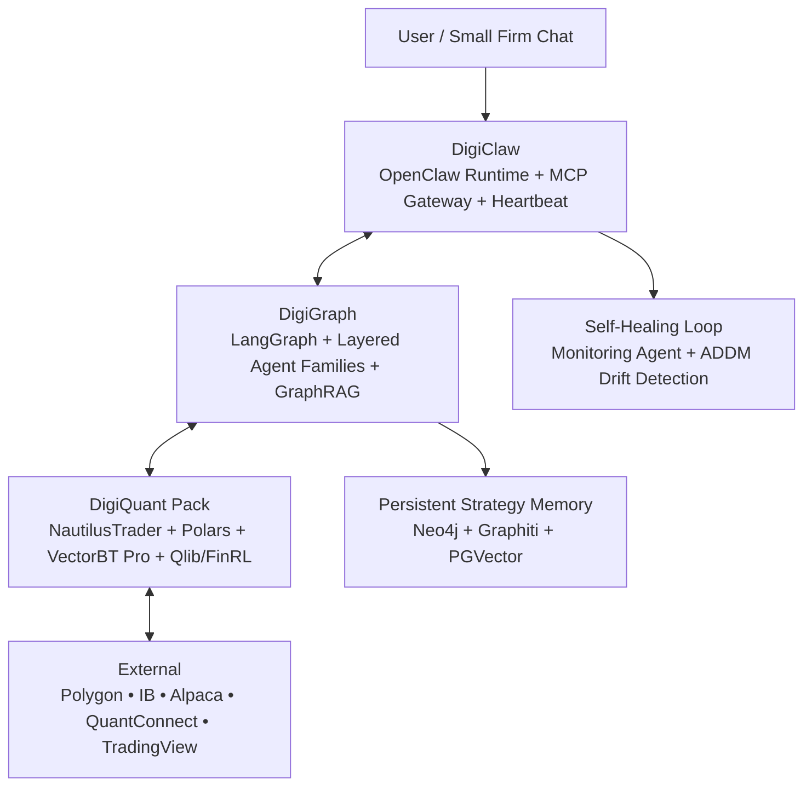

# Digi Architecture – High-Level Design (February 2026)

(See `DIGI.md` Section 3 for full narrative.)

Key Interfaces (strictly MCP-first)

DigiClaw exposes one custom skill: run_digigraph_workflow
DigiGraph exposes every major node (research, backtest, optimize, ML family) as discoverable MCP tools
All data exchange uses structured Pydantic models + Arrow zero-copy where possible
No direct user exposure to DigiQuant — it is a plug-in pack only

Component Responsibilities (cross-reference sub-folder docs)
Component,Primary Role,Calls / Receives From
DigiClaw,"User gateway, runtime, monitoring",User ↔ DigiGraph
DigiGraph,Cognitive orchestration & memory,DigiClaw ↔ DigiQuant
DigiQuant,High-perf research → backtest → live,DigiGraph only

Token efficiency: LiteLLM caching + local models for routine tasks
Compute efficiency: Rust/Polars/Nautilus only (no pandas)
Security: loopback-only, Tailscale, least-privilege (see SECURITY.md)
Scalability: Docker Compose → Kubernetes-ready, one instance per small firm

This diagram and the sub-folder documents together form the complete architectural source of truth.