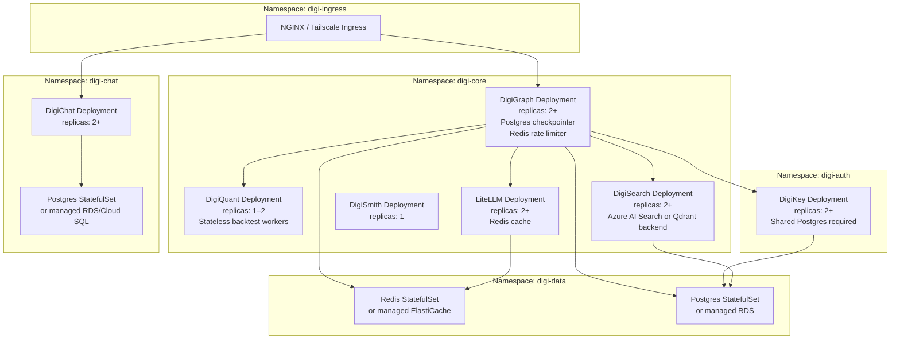

# DigiThings Architecture

> **For vision and strategy, see [docs/VISION.md](docs/VISION.md) and [ROADMAP.md](ROADMAP.md). For per-component details, read each service's own `ARCHITECTURE.md` (linked in the topology table below). For release history, see [RELEASES.md](RELEASES.md).**

---

## 1. Ecosystem Purpose

DigiThings (digithings.ai) is an open-core modular agentic stack for building conversational agents that research, search, analyze, and act. The primary use case is quantitative finance — a "hedge-fund in a box" where a single operator can run strategy research, backtesting, optimization, and execution monitoring through a single chat interface. The same stack supports RAG (retrieval-augmented generation), document search, and general agent workflows without code changes. The design philosophy is **MCP-first** (every capability is a tool with a schema; DigiGraph discovers and dispatches them dynamically), **federated hub** (DigiGraph is the horizontal orchestrator; DigiSearch and DigiQuant each own their vertical LangGraph pipelines and expose them as HTTP + MCP), and **loopback-only by default** (all services bind `127.0.0.1`; remote access requires Tailscale or Cloudflare Tunnel). The stack targets developer and small-firm deployments on a single machine today with a clear Kubernetes upgrade path.

---

## 2. Service Topology

| Service | Port (host) | Role | Auth Required | Docker Profile | MCP Server | Status |
|---------|------------|------|--------------|----------------|-----------|--------|
| **DigiGraph** | 8000 | LangGraph orchestration hub; OpenAI-compatible API; delegates to verticals | JWT (DigiKey) — 503 if not configured | core (always on) | Yes — `python -m digigraph.mcp_server` | Shipped |
| **DigiQuant** | 8001 | NautilusTrader backtest/optimize; ordered quant pipeline; orchestrator endpoints | JWT (`digiquant:backtest`, `digiquant:optimize`) | core | Yes — `python -m digiquant.mcp_server` | Shipped |
| **DigiSearch** | 8002 | RAG pipeline; document ingestion; vector search (Chroma/Azure) | JWT (`digisearch:query`, `digisearch:ingest`) | core | Yes — `docker compose --profile digisearch-mcp up` | Shipped |
| **DigiSmith** | 8003 | LangSmith-aligned tracing helpers (library); health + `/v1/status` endpoint | None (public metadata) | core | No | Shipped |
| **LiteLLM** | 4000 | LLM routing proxy (100+ providers); response cache; rate limiting | `LITELLM_MASTER_KEY` Bearer | core | No | Shipped |
| **DigiKey** | 8005 | API key issuance; JWT exchange (RS256); JWKS endpoint | Admin token for key issuance | core | No | Shipped |
| **Ollama** | 11435 (host) | Local LLM inference (maps to container port 11434) | None | core | No | Shipped |
| **DigiChat** | 3005 | Next.js BFF + React chat UI; Auth.js OIDC; machine API keys | OIDC session or Bearer API key | digichat | No | Shipped |
| **DigiChat-DB** | 5433 | Postgres 16 for DigiChat conversations and API keys | Postgres credentials | digichat | No | Shipped |
| **DigiClaw** (heartbeat) | — | Heartbeat agent; health polling; JSONL audit; ADDM drift trigger | None (internal cron) | heartbeat | No (Phase 2) | Partial (Phase 3) |
| **DigiBase** (service) | TBD | Data-plane broker: managed Postgres/Redis/object credentials | DigiKey-scoped tokens | not shipped | No | Roadmap |

**Notes:**
- DigiGraph, DigiQuant, and DigiSearch all depend on DigiKey being healthy at startup (Compose `condition: service_healthy`).
- DigiGraph additionally waits for DigiQuant, DigiSearch, and LiteLLM.
- DigiChat waits for DigiKey, DigiGraph, and DigiChat-DB.
- All inter-service URLs inside Docker Compose use internal hostnames (e.g. `http://digigraph:8000`); host-side ports are loopback-bound.

---

## 3. Inter-Service Interaction Flows

### Flow A: User Chat Request — End to End

```mermaid
sequenceDiagram
    participant Browser
    participant DigiChat as DigiChat BFF (3005)
    participant DigiKey as DigiKey (8005)
    participant DigiGraph as DigiGraph (8000)
    participant LiteLLM as LiteLLM (4000)
    participant DigiSearch as DigiSearch (8002)
    participant DigiQuant as DigiQuant (8001)

    Browser->>DigiChat: POST /api/chat (session cookie or Bearer key)
    DigiChat->>DigiKey: POST /v1/oauth/token (grant_type=bff_session, Bearer DIGIKEY_BFF_TOKEN)
    DigiKey-->>DigiChat: { access_token: JWT, litellm_proxy_api_key }
    DigiChat->>DigiGraph: POST /v1/chat/completions (Authorization: Bearer JWT, X-LiteLLM-Proxy-Key, X-Request-ID)
    Note over DigiGraph: Validates JWT via JWKS; runs LangGraph workflow
    DigiGraph->>LiteLLM: POST /v1/chat/completions (Bearer litellm_proxy_api_key)
    LiteLLM-->>DigiGraph: LLM response (streamed)
    DigiGraph->>DigiSearch: POST /v1/orchestrator_invoke (tool=digisearch, Bearer JWT, X-Request-ID)
    DigiSearch-->>DigiGraph: search results + rag_sources
    DigiGraph->>DigiQuant: POST /v1/jobs/backtest (Bearer JWT, X-Request-ID)
    DigiQuant-->>DigiGraph: job_id; poll GET /v1/jobs/{id}/status → BacktestResult
    DigiGraph-->>DigiChat: SSE stream (OpenAI chunks + digigraph_trace parts)
    DigiChat-->>Browser: streamed response with trace metadata
```

### Flow B: DigiGraph Vertical Orchestrator Tool Invocation

```mermaid
sequenceDiagram
    participant DigiGraph as DigiGraph (LangGraph node)
    participant Vertical as DigiSearch or DigiQuant

    Note over DigiGraph: On startup (or per-request cache miss)
    DigiGraph->>Vertical: POST /v1/orchestrator_tools (optional index_config body)
    Vertical-->>DigiGraph: OpenAI-style tool schemas array (manifest)
    Note over DigiGraph: LLM selects tool from manifest; node decides to invoke
    DigiGraph->>Vertical: POST /v1/orchestrator_invoke { tool: "digisearch", args: {...}, request_id }
    Note over Vertical: Validates JWT scope (digisearch:query or digiquant:backtest)
    Vertical-->>DigiGraph: ToolResult { result, trace, request_id }
    Note over DigiGraph: LangGraph node continues with result; appends to WorkflowState
```

**Key detail:** DigiGraph never hard-codes DigiSearch or DigiQuant tool schemas. It fetches them at runtime via `/v1/orchestrator_tools`. With `DIGI_HUB_MODE=federated`, additional delegate tool names (`digisearch_research_delegate`, `digiquant_pipeline_delegate`) are also exposed to the LLM surface. With `DIGI_HUB_MODE=legacy` (default), the same vertical invoke path is used but those alias names are not registered.

### Flow C: Authentication Exchange — Machine Key to JWT

```mermaid
sequenceDiagram
    participant Client as Client (DigiChat BFF or CLI)
    participant DigiKey as DigiKey (8005)
    participant Service as Protected Service (DigiGraph/DigiSearch/DigiQuant)

    Client->>DigiKey: POST /v1/oauth/token { grant_type: api_key, api_key: dgk_live_... }
    Note over DigiKey: bcrypt-verify key; check scopes; RS256-sign JWT
    DigiKey-->>Client: { access_token: JWT (RS256), litellm_proxy_api_key, expires_in }
    Client->>Service: GET/POST /v1/... Authorization: Bearer JWT
    Note over Service: DigiAuthMiddleware fetches JWKS from http://digikey:8005/.well-known/jwks.json
    Service->>DigiKey: GET /.well-known/jwks.json (cached)
    DigiKey-->>Service: JWKS (public key set)
    Note over Service: Validate: RS256 sig, iss=http://digikey:8005, aud=digi-ecosystem, exp, scopes
    Service-->>Client: 200 response (or 403 insufficient_scope / 503 auth_not_configured)
```

---

## 4. MCP Server Topology

MCP (Model Context Protocol) is the standard for tool discovery and invocation at the edge of the DigiThings ecosystem. DigiGraph, DigiQuant, and DigiSearch each expose MCP servers. DigiKey, DigiSmith, and DigiClaw do not (DigiClaw MCP integration is Phase 2).

| Component | MCP Server Command | Host Port | Exposed Tools (examples) | Typical Clients |
|-----------|-------------------|-----------|--------------------------|-----------------|
| **DigiGraph** | `python -m digigraph.mcp_server` (install: `pip install -e "digigraph[mcp]"`) | stdio or SSE | `workflow`, `chat`, `thread_state`, `list_orchestrator_tools`, `list_orchestrator_tools_detailed` | DigiClaw (Phase 2), IDE plugins, Claude Desktop |
| **DigiQuant** | `python -m digiquant.mcp_server` | stdio or SSE | `digiquant_run_pipeline`, `digiquant_list_strategies`, `run_backtest`, `run_optimize`, `run_validation` | DigiGraph (invokes via HTTP orchestrator), power-user IDE |
| **DigiSearch** | `docker compose --profile digisearch-mcp up` → container port 8765 | 8765 | `digisearch_query`, `digisearch_fetch_all`, `digisearch_research_turn` (with `digisearch[agent]`), `digisearch_research_delegate` | DigiGraph (invokes via HTTP orchestrator), Langflow, IDE |

**Design notes:**

- For normal chat operation, DigiGraph does **not** connect to DigiSearch/DigiQuant via MCP. It uses HTTP (`POST /v1/orchestrator_tools` + `/v1/orchestrator_invoke`) for vertical dispatch. MCP servers are for external clients (IDEs, DigiClaw, Langflow) that want to attach directly to a vertical.
- DigiGraph's own MCP server exposes the hub workflow surface. Clients that want single-entry-point access should connect here.
- Use **hub-only** (DigiGraph MCP) when you want one DigiKey allowlist and unified trace stream. Use **direct vertical MCP** (DigiSearch or DigiQuant MCP) when a client should bypass DigiGraph.
- MCP tool schemas for DigiSearch and DigiQuant are also served over HTTP (`GET /v1/orchestrator_tools`) so DigiGraph can fetch them without running a local MCP process.

---

## 5. Docker Compose Profiles

### Default / Core (no profile flag)

**Includes:** DigiKey (8005), Ollama (11435), DigiSmith (8003), DigiGraph (8000), DigiQuant (8001), DigiSearch (8002), LiteLLM (4000)

**When to use:** Standard developer stack. All core services. No chat UI, no Redis cache, no heartbeat agent.

```bash
make build
make up
# or: docker compose up -d
```

**Startup order:** DigiKey → {DigiQuant, DigiSearch, LiteLLM} → DigiSmith → DigiGraph

---

### Profile: `heartbeat`

**Adds:** `heartbeat` container (Python 3.12-slim running `python -m digiclaw` in a loop every 1800 seconds)

**When to use:** Production-style monitoring; ADDM drift detection; periodic health checks logged to JSONL audit.

```bash
make up-heartbeat
# or: docker compose --profile heartbeat up -d
```

**Notes:** Requires DigiGraph and DigiQuant to be healthy. Writes audit events to `digiquant/results/audit/events.jsonl`. Reads `HEARTBEAT.md` from workspace root.

---

### Profile: `digichat`

**Adds:** `digichat-db` (Postgres 16 on host port 5433) + `digichat` (Next.js BFF on host port 3005)

**When to use:** Full stack with browser-accessible chat UI. Auth.js OIDC or machine API keys. Persistent conversation storage.

```bash
make up-digichat
# or: docker compose --profile digichat up -d --build
```

**Notes:** Requires `AUTH_SECRET`, `AUTH_URL`, `DIGIKEY_BFF_TOKEN` in `.env`. DigiChat auto-migrates the database on startup (`DIGICHAT_AUTO_MIGRATE=1`). Default host port is 3005; override with `DIGICHAT_PUBLISH_PORT`. To bind to LAN (not just loopback), set `DIGICHAT_PUBLISH_HOST=0.0.0.0` — see `SECURITY.md`.

---

### Profile: `litellm-cache`

**Adds:** `redis` container (Redis 7 Alpine, internal only — no host port)

**When to use:** Enable Redis-backed LiteLLM response cache to reduce LLM API spend across service restarts.

```bash
docker compose --profile litellm-cache up -d
```

**Notes:** Set `REDIS_URL=redis://redis:6379` in `.env` when this profile is active. LiteLLM config (`config/litellm.yaml`) must be updated to use `type: redis` under `cache_params`. See `config/MODELS.md`.

---

### Profile: `digisearch-mcp`

**Adds:** `digisearch-mcp` container (DigiSearch MCP server on host port 8765)

**When to use:** Expose DigiSearch MCP tools to external clients (Langflow, Claude Desktop, IDE plugins) without going through DigiGraph.

```bash
docker compose --profile digisearch-mcp up -d
# MCP endpoint: http://127.0.0.1:8765/mcp
```

---

## 6. Authentication and Authorization

### Key Types

| Type | Prefix | Purpose | Requires |
|------|--------|---------|---------|
| Live API key | `dgk_live_` | Machine clients, DigiChat machine users, CI | `DIGIKEY_ALLOW_DEV_GLOBAL=0` (default) |
| Dev global key | `dev_global` kind | Local development only, all scopes | `DIGIKEY_ALLOW_DEV_GLOBAL=1` in env |
| BFF session | — | DigiChat exchanges OIDC session for JWT | `DIGIKEY_BFF_TOKEN` on DigiKey + DigiChat |
| Ephemeral signing key | — | Local Docker dev JWKS (rotates on restart) | `DIGIKEY_ALLOW_EPHEMERAL_KEY=1` |

### JWT Claims Structure

DigiKey issues RS256 JWTs. Relevant claims:

| Claim | Value | Notes |
|-------|-------|-------|
| `iss` | `http://digikey:8005` (or `DIGIKEY_ISSUER`) | Must match consumer `DIGIKEY_ISSUER` |
| `aud` | `digi-ecosystem` (or `DIGIKEY_AUDIENCE`) | Validated by all protected services |
| `sub` | key prefix or OIDC subject | Tenant/user identifier |
| `scopes` | array of strings | e.g. `["digigraph:workflow", "digisearch:query"]` |
| `exp` | Unix timestamp | Short-lived; no revocation today (see Known Gaps) |
| `jti` | UUID | Included in audit events; not checked against blocklist today |
| `litellm_proxy_api_key` | string | Injected by DigiKey when `DIGIKEY_LITELLM_PROXY_KEY` is set; forwarded as `X-LiteLLM-Proxy-Key` |

### Scope Naming Convention

Scopes follow the pattern `service:action`:

```
digigraph:workflow       digigraph:chat          digigraph:mcp
digiquant:backtest       digiquant:optimize
digisearch:query         digisearch:ingest
*                        # matches all (dev_global only)
```

### DigiAuthMiddleware (service-side validation)

All three protected services (DigiGraph, DigiQuant, DigiSearch) use `digikey.integrations.service_middleware`. On every protected request:

1. Read `Authorization: Bearer <token>` header.
2. Fetch JWKS from `DIGIKEY_JWKS_URL` (cached; falls back to `DIGIKEY_PUBLIC_KEY_PEM` if set).
3. Validate RS256 signature, `iss`, `aud`, `exp`.
4. Check required scope for the route (e.g. `digiquant:backtest` for `POST /backtest/start`).
5. Attach `request.state.tenant`, `request.state.key_prefix`, `request.state.jti` for audit events.

**Fail-closed behavior:** If neither `DIGIKEY_JWKS_URL` nor `DIGIKEY_PUBLIC_KEY_PEM` is configured, protected routes return `503 auth_not_configured`. There is no anonymous access to protected routes.

### Header Propagation

| Header | Direction | Purpose |
|--------|-----------|---------|
| `Authorization: Bearer <JWT>` | Client → all services | Identity and scope |
| `X-Request-ID` | Propagated hub→vertical | Correlation across audit logs and traces |
| `X-LiteLLM-Proxy-Key` | DigiChat → DigiGraph → LiteLLM | Per-session LLM proxy authorization |
| `X-Session-Id` / `X-Digichat-Session` | DigiChat → DigiGraph | LangGraph `thread_id` for checkpoint continuity |
| `X-Digi-Tenant` | Optional; operator-set | Multi-tenant routing (Phase 2) |

### DigiChat Auth Exchange Flow

```
Browser (OIDC session)
  └─► DigiChat BFF
        ├─► DigiKey POST /v1/oauth/token (grant_type=bff_session)
        │     └─► JWT + litellm_proxy_api_key
        └─► DigiGraph POST /v1/chat/completions
              Authorization: Bearer JWT
              X-LiteLLM-Proxy-Key: <litellm key>
```

Machine clients use `grant_type=api_key` with a `dgk_live_` key for the same exchange.

### Known Gaps

- **No JWT revocation:** Revoked keys remain valid until `exp`. A `jti` blocklist is on the roadmap ([ROADMAP.md](ROADMAP.md), DigiKey section in [digikey/ARCHITECTURE.md](digikey/ARCHITECTURE.md)).
- **Multi-tenant incomplete:** `X-Digi-Tenant` is propagated but tenant isolation within DigiSearch and DigiQuant is not enforced at the data layer today.
- **DigiBase credential broker not shipped:** Each service holds its own raw `DATABASE_URL` / `REDIS_URL`. Central credential rotation is Phase 1 of the DigiBase service roadmap.

---

## 7. Observability Stack

Observability in DigiThings operates across three layers. None of them are fully integrated into a single dashboard today.

### Layer 1: Distributed Tracing

**LangSmith (conditional):** DigiGraph wraps LLM calls with `digismith.trace.traceable`. When `LANGSMITH_API_KEY` is set and the `langsmith` package is installed, traces are sent directly from DigiGraph to LangSmith (or a custom `LANGSMITH_ENDPOINT`). The `digismith` library is a thin no-op wrapper when LangSmith is not configured — no crash, no implicit data leakage.

Required span attributes: `workflow_id`, `request_id` (mirrors `X-Request-ID`), `session_id`. Optional: `job_id` (DigiQuant backtest job), `tool` name, `run_name`.

Prohibited in spans: raw prompts, API keys, bearer tokens, file paths outside approved workspace roots, full document bodies.

**OpenTelemetry (optional per service):** Install `digibase[otel]` on any service and set `OTEL_EXPORTER_OTLP_ENDPOINT` to export infra-level traces. This complements LangSmith; it does not replace it. Same PII rules apply on span attributes.

**DigiSmith status endpoint:** `GET /v1/status` (port 8003) returns version flags and sanitized LangSmith host only. It is intentionally public — never add secrets or keys to this payload.

### Layer 2: Audit Logs

**JSONL append-only audit:** DigiClaw (`digiclaw/audit.py`) and DigiQuant (`digiquant/audit.py`) write structured JSONL to `AUDIT_LOG_PATH` (default: `digiquant/results/audit/events.jsonl`). DigiGraph writes `workflow_start`, `workflow_end`, and `tool_denied` events to the same path.

**Event fields (standard):** `event_type`, `agent_id`, `request_id`, `workflow_id`, `timestamp`, `payload` (redacted). Secret keys are stripped by `audit_log()` before writing.

**Optional remote sink:** Set `AUDIT_SINK_URL` to forward events to an external collector. Not currently wired in all services — check per-component docs.

### Layer 3: Health and Status

Every service exposes `GET /health` returning `{"status": "ok"}` (used by Docker Compose healthchecks and DigiClaw heartbeat). DigiChat exposes `GET /api/health` which also checks the DigiGraph upstream and Postgres connection.

DigiChat's ecosystem side panel displays health badges for DigiGraph, DigiQuant, DigiSmith, and DigiSearch (configurable via `DIGICHAT_ENABLED_SERVICES`).

### Gap Analysis

| Gap | Impact | Roadmap |
|-----|--------|---------|
| No Prometheus endpoints | Cannot scrape service metrics into Grafana without custom instrumentation | Phase 2 |
| No centralized metrics dashboard | Must use LangSmith UI + log files separately | Phase 2 (DigiBase + Prometheus) |
| Span PII not enforced | Operators must configure LangSmith data masking manually | Policy gap; no automated check today |
| Audit sink not wired in DigiSearch | DigiSearch audit events may be missed by remote collectors | Phase 2 |
| No distributed trace correlation across services | `X-Request-ID` propagates but is not auto-injected into OTel spans | Requires digibase[otel] instrumentation per service |

---

## 8. Security Perimeter

### Network Boundary

All services in Docker Compose bind `127.0.0.1` (loopback) on the host. Services communicate over the internal Docker network using container hostnames (e.g. `http://digigraph:8000`). No service is exposed to `0.0.0.0` by default.

For remote access, use:
- **Tailscale**: preferred for teams; machine-to-machine encrypted mesh.
- **Cloudflare Tunnel**: for public endpoints behind Cloudflare WAF.

Do not expose raw ports to the internet. There is no TLS between internal services (terminate at the ingress layer — Tailscale funnel or CF Tunnel).

### Secret Management

Secrets are passed via environment variables defined in root `.env` (not committed to git; `.env.example` is the template). The only current secret store is env vars in Docker Compose. Future: DigiBase credential broker (Phase 1) would centralize rotation without requiring every service to hold raw URLs.

**Never commit to git:** `DIGIKEY_PRIVATE_KEY_PEM`, `DIGIKEY_ADMIN_TOKEN`, `DIGIKEY_BFF_TOKEN`, `LITELLM_MASTER_KEY`, `OPENAI_API_KEY`, `OLLAMA_API_KEY`, `LANGSMITH_API_KEY`, `AUTH_SECRET`.

### Code Execution

DigiGraph supports sandboxed Python execution (via the `data_engineer_agent` tool using Polars). This is gated by `DIGI_ALLOW_CODE_EXEC=true`. When enabled, the executor runs code in-process — it is **not sandboxed in a container or VM** today. Operators must set this explicitly; it is off by default.

Human-in-the-loop interrupt before code execution is supported via `DIGI_INTERRUPT_AFTER_RESEARCH=1` + the thread resume endpoint.

### Critical Risks

| Risk | Severity | Mitigation Today | Roadmap Fix |
|------|----------|-----------------|-------------|
| No JWT revocation | High | Short-lived tokens; network isolation | `jti` blocklist in DigiKey |
| Unsandboxed code execution | High | Off by default (`DIGI_ALLOW_CODE_EXEC`); loopback-only network | gVisor or subprocess sandboxing |
| Multi-tenant incomplete | Medium | Network isolation; per-key scopes | DigiBase + per-tenant index isolation |
| Ephemeral JWKS rotates on restart | Medium | Dev-only (`DIGIKEY_ALLOW_EPHEMERAL_KEY=1`); use PEM or stable key in production | Vault/KMS-backed signing keys |
| DigiChat `DIGICHAT_PUBLISH_HOST=0.0.0.0` | High if set | Warning in `SECURITY.md`; not the default | Always use Tailscale/CF Tunnel for remote |

See [SECURITY.md](SECURITY.md) for the full hardening spec.

---

## 9. Setup Guide

### Quick Start (Docker — recommended)

```bash
cp .env.example .env
# Edit .env: set OLLAMA_API_KEY (Ollama Cloud free tier) or OPENAI_API_KEY
# Set DIGIKEY_ADMIN_TOKEN and DIGIKEY_BFF_TOKEN to random secrets
make build
make up
```

Services available after `make up`:
- DigiGraph API: `http://localhost:8000`
- LiteLLM proxy: `http://localhost:4000`
- DigiKey: `http://localhost:8005`
- DigiSearch: `http://localhost:8002`

Issue a dev API key after startup:
```bash
python -m digikey.cli issue-key --tenant default --label dev --scopes '*' --kind dev_global
# Requires: DIGIKEY_ALLOW_DEV_GLOBAL=1 in .env and pip install -e ./digikey
```

### With DigiChat BFF

```bash
# Add to .env: AUTH_SECRET, AUTH_URL=http://127.0.0.1:3005, DIGICHAT_POSTGRES_PASSWORD
make up-digichat
# or: docker compose --profile digichat up -d --build
# DigiChat: http://127.0.0.1:3005
```

### With Heartbeat Monitoring

```bash
make up-heartbeat
# or: docker compose --profile heartbeat up -d
# Heartbeat polls /health every 30 min and appends to digiquant/results/audit/events.jsonl
```

### Local Dev (no Docker)

```bash
# Start all Python backends on host (DigiKey 8005, services 8000–8003, LiteLLM 4000)
make stack-local          # runs scripts/run_stack_local.sh

# Start DigiChat UI with hot reload (separate terminal)
make digichat-dev         # cd digichat && npm run dev → http://127.0.0.1:3000
```

Requires Python 3.12+ virtual environment with all packages installed editable:
```bash
pip install -e ./digibase -e "./digismith[langsmith]" -e ./digikey \
            -e "./digigraph[dev]" -e "./digiquant[dev]" \
            -e "./digisearch[dev]"
```

### Seeding DigiSearch (local)

```bash
# After make up or make stack-local:
export DIGISEARCH_SEED_API_KEY=dgk_live_...   # key with digisearch:ingest scope
make seed-digisearch-local

# Optional EDGAR dev corpus:
make export-edgar-digisearch-dev              # downloads ~25 SEC filings
make seed-digisearch-edgar-dev                # ingest into edgar_dev index
```

### Critical Environment Variables

| Variable | Description | Required? |
|----------|-------------|-----------|
| `OPENAI_API_KEY` | OpenAI API key (LiteLLM container) | One of OpenAI or Ollama Cloud |
| `OLLAMA_API_KEY` | Ollama Cloud API key (free tier; LiteLLM container) | One of OpenAI or Ollama Cloud |
| `LITELLM_MASTER_KEY` | LiteLLM proxy admission secret | Recommended for production |
| `LITELLM_PROXY_API_KEY` | DigiGraph Bearer for LiteLLM proxy | Set to same as LITELLM_MASTER_KEY |
| `DIGIKEY_ADMIN_TOKEN` | Secret for issuing API keys via admin API | Required |
| `DIGIKEY_BFF_TOKEN` | DigiChat BFF session exchange token | Required for DigiChat |
| `DIGIKEY_ALLOW_EPHEMERAL_KEY` | `1` permits ephemeral JWKS (local dev only) | Set to `1` for local; use stable key in prod |
| `DIGIKEY_PRIVATE_KEY_PEM` | RS256 private key for stable JWT signing | Required for production (not ephemeral) |
| `DIGIKEY_LITELLM_PROXY_KEY` | Injected into token exchange response | Set to same as LITELLM_MASTER_KEY for funnel |
| `AUTH_SECRET` | Next-Auth signing secret for DigiChat | Required for DigiChat |
| `AUTH_URL` | Full public URL of DigiChat (must match browser origin) | Required for DigiChat |
| `DIGICHAT_POSTGRES_PASSWORD` | Postgres password for DigiChat-DB | Required for `digichat` profile |
| `LANGSMITH_API_KEY` | Enables LangSmith trace export from DigiGraph | Optional |
| `DIGI_LLM_MODE` | `test` / `medium` / `best` — model selection tier | Optional (default: `test`) |
| `DIGI_HUB_MODE` | `legacy` / `federated` — vertical delegate tool exposure | Optional (default: `legacy`) |
| `DIGI_ALLOW_CODE_EXEC` | `true` enables sandboxed Python in DigiGraph | Optional (default: off) |
| `DIGI_CHECKPOINTER` | `memory` / `sqlite` / `postgres` — LangGraph checkpoint backend | Optional (default: `memory`) |
| `OTEL_EXPORTER_OTLP_ENDPOINT` | OTel collector endpoint for infra traces | Optional |
| `AUDIT_SINK_URL` | Remote audit event collector | Optional |
| `AUDIT_LOG_PATH` | Local JSONL audit file path | Optional (default in digiquant/results/audit/) |

---

## 10. Scalability and Kubernetes Path

### Current Limits

The default Docker Compose deployment is designed for a single machine (developer or small firm). Known scaling limits:

| Limit | Root Cause | Impact |
|-------|-----------|--------|
| Single-instance per service | Docker Compose; no replica support | No horizontal scaling; single point of failure |
| In-memory rate limiting | Per-process rate limiter in DigiGraph policy | Not distributed; resets on restart; ineffective with multiple replicas |
| LangGraph `MemorySaver` (default) | In-process Python dict | Thread state lost on restart; no cross-instance sharing |
| Chroma local volume | `digisearch_chroma` Docker volume on single host | Cannot be shared across DigiSearch replicas |
| LiteLLM local cache | `type: local` in `litellm.yaml` | Per-process disk cache; not shared with other LiteLLM instances |
| DigiKey SQLite (default) | `sqlite:////data/digikey.db` in container | Not suitable for multiple DigiKey replicas; switch to Postgres |

### Kubernetes Target Architecture

When scaling beyond a single machine, each service becomes a `Deployment`. Below is the target namespace layout:



### Migration Steps: Compose → Kubernetes

| Concern | Compose Today | K8s Target | Action Required |
|---------|--------------|------------|-----------------|
| LangGraph checkpointer | `MemorySaver` (in-process) | Postgres (`DIGI_CHECKPOINTER=postgres`) | Set `DIGI_CHECKPOINTER_POSTGRES_URI`; install `langgraph-checkpoint-postgres` |
| DigiGraph rate limiting | Per-process dict | Redis-backed (`digibase` rate limiter) | Wire `REDIS_URL` to DigiGraph; implement distributed rate limiter (Phase 2) |
| DigiSearch vector store | Chroma local volume | Azure AI Search or Qdrant Cloud | Set `AZURE_SEARCH_*` env vars; Chroma is dev/test only |
| DigiKey storage | SQLite default | Postgres (required for multi-replica) | Set `DIGIKEY_DATABASE_URL=postgresql://...` |
| LiteLLM cache | Local disk | Redis (`type: redis` in litellm.yaml) | Set `REDIS_URL`; use `litellm-cache` profile → K8s Redis StatefulSet |
| Secrets | `.env` file | K8s Secrets → env injection | Migrate all `*_KEY`, `*_TOKEN`, `*_PASSWORD` vars to K8s Secrets |
| DigiBase credential broker | Not shipped | Central K8s service | Phase 1 DigiBase service: manages Postgres/Redis connection grants per tenant |
| Ollama inference | Local container | Separate GPU node pool | Ollama on GPU nodes; or use Ollama Cloud (`OLLAMA_API_KEY`) to skip self-hosting |

### Performance Targets (unchanged by scale)

- 10M-row NautilusTrader backtest: < 2 seconds
- 100k-parameter sweep: < 30 seconds
- Token reduction vs naive prompts: ≥ 70% (LiteLLM caching + mode-based model selection)

---

## Cross-Reference: Per-Component Architecture Docs

Each service maintains its own detailed architecture document. The root `ARCHITECTURE.md` (this file) covers inter-service topology. For component internals, read:

| Component | Doc |
|-----------|-----|
| DigiGraph | [digigraph/ARCHITECTURE.md](digigraph/ARCHITECTURE.md) |
| DigiQuant | [digiquant/ARCHITECTURE.md](digiquant/ARCHITECTURE.md) |
| DigiSearch | [digisearch/ARCHITECTURE.md](digisearch/ARCHITECTURE.md) |
| DigiSmith | [digismith/ARCHITECTURE.md](digismith/ARCHITECTURE.md) |
| DigiBase | [digibase/ARCHITECTURE.md](digibase/ARCHITECTURE.md) |
| DigiClaw | [digiclaw/ARCHITECTURE.md](digiclaw/ARCHITECTURE.md) |
| DigiKey | [digikey/ARCHITECTURE.md](digikey/ARCHITECTURE.md) |
| DigiChat | [digichat/ARCHITECTURE.md](digichat/ARCHITECTURE.md) |
| Local full stack setup | [docs/LOCAL_STACK.md](docs/LOCAL_STACK.md) |
| LLM model configuration | [config/MODELS.md](config/MODELS.md) |
| Security hardening | [SECURITY.md](SECURITY.md) |

**API versioning:** HTTP APIs use a shared error envelope from `digibase`: `{"error": {"code", "message", "request_id", "service"}}`. Services echo and honor `X-Request-ID`. DigiQuant v1 job endpoints: `POST /v1/jobs/backtest`, `GET /v1/jobs/{job_id}/status`. Compatibility: prefer the same git SHA across all services in production.
