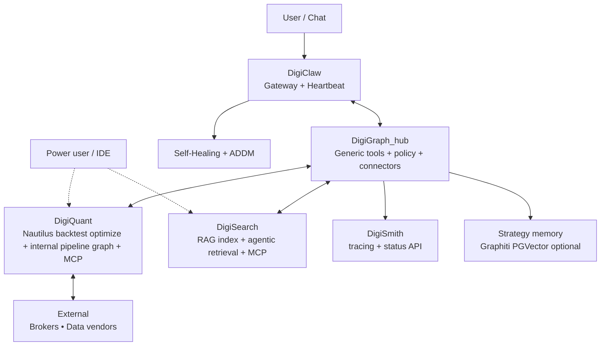
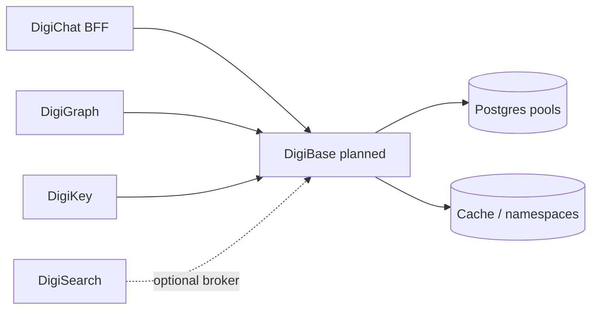

# DigiThings Architecture – High-Level Design (February 2026)

This diagram describes the **DigiThings** stack (digithings.ai): DigiClaw, DigiGraph, DigiSearch, DigiQuant, DigiSmith. See `DIGI.md` for vision and narrative. For a loopback full stack (DigiKey, LiteLLM, local Ollama, DigiChat BFF), see **[docs/LOCAL_STACK.md](docs/LOCAL_STACK.md)**.

**Target data plane (roadmap — not default in Compose yet):** a future **DigiBase** HTTP service would sit **between** app services and shared **Postgres / Redis / object** backends so chat history, checkpoints, identity-linked DBs, and cache credentials are **brokered** with DigiKey-scoped tokens instead of every container holding raw URLs. The **`digibase`** folder today ships only the **Python library** (errors, HTTP helpers, OTel). See [digibase/DIGIBASE.md](digibase/DIGIBASE.md).

**Federated hub model:** **DigiGraph** is the default **horizontal hub** (generic data-science agents, visualization, planning, session policy, **connectors** to verticals). **DigiSearch** and **DigiQuant** each expose **HTTP + MCP** and may run **internal LangGraph** pipelines for domain-specific ordering (retrieval turns; validate → backtest → optimize → export). **DigiChat** aggregates whichever services the deployment enables via configuration (`DIGICHAT_ENABLED_SERVICES`, upstream URLs, tool allowlists).

### Digi Connector Spec (normative)

Cross-service calls MUST:

1. **Transport:** Prefer **HTTP** for hub→vertical composite operations (e.g. `POST /v1/workflow` on DigiQuant, `POST /query` on DigiSearch). **MCP** remains the standard for DigiClaw, Langflow, and IDE clients attaching directly to a vertical.
2. **Identity:** Send **`X-Request-ID`** and optional **`X-Session-Id`** / tenant headers; use [digibase](digibase/README.md) `outbound_request_id_headers` where applicable.
3. **Errors:** JSON envelope `{"error": {"code", "message", "request_id", "service"}}`.
4. **Traces:** Hub and verticals SHOULD emit trace payloads that can carry **`service`: `digigraph` | `digisearch` | `digiquant`** for UIs (e.g. DigiChat `data-digigraphTrace` parts).

Key Interfaces (MCP-first at the edge; HTTP for hub composability)

DigiClaw may expose hub skills (`run_digigraph_workflow`) and/or direct vertical MCP attachments depending on deployment (see [digiclaw/DIGICLAW.md](digiclaw/DIGICLAW.md)).
DigiGraph exposes **generic** orchestrator MCP tools + optional **connector** tools when `DIGI_HUB_MODE=federated` (delegate to DigiSearch/DigiQuant HTTP — see [digigraph/DIGIGRAPH.md](digigraph/DIGIGRAPH.md)).
DigiSearch exposes document search and **research-turn** tooling via HTTP + MCP.
DigiQuant exposes strategy catalog, granular backtest/optimize/export, and **pipeline workflow** (`digiquant_run_pipeline`, `POST /v1/workflow`) via HTTP + MCP.
All data exchange uses structured Pydantic models + Arrow zero-copy where possible
End users typically reach DigiQuant only through the hub, BFF, or explicit operator MCP — not as a public internet-facing quant console by default.

Component Responsibilities (cross-reference sub-folder docs)
Component,Primary Role,Calls / Receives From
DigiClaw,"User gateway, runtime, monitoring",User ↔ DigiGraph (and optionally ↔ vertical MCP)
DigiGraph,"Hub: generic orchestration, connectors, memory hooks",DigiClaw ↔ DigiQuant ↔ DigiSearch
DigiQuant,"Quant pipeline + Nautilus execution; owns ordered backtest/optimize/export graph",DigiGraph connectors, MCP clients, HTTP — roadmap: [digiquant/docs/DIGIQUANT_CHAT_PRODUCT_GAP.md](digiquant/docs/DIGIQUANT_CHAT_PRODUCT_GAP.md)
DigiSearch,"Evidence + retrieval (+ optional internal agentic graph)",DigiGraph connectors, DigiFlow, MCP
DigiSmith,"LangSmith-aligned tracing helpers, health/status HTTP API",DigiGraph (library); optional Docker service
DigiBase,"Data plane (roadmap): broker Postgres/cache/object policy for platform services",DigiKey-authorized services → logical DB/cache handles; see [digibase/DIGIBASE.md](digibase/DIGIBASE.md) — **library** only today ([digibase/README.md](digibase/README.md))
DigiChat,"Tenant chat UI + BFF (Next.js)",Browser → DigiGraph (+ optional DigiSearch URL for RAG health); **capability matrix** from env/config. **Persistence (v1):** optional direct Postgres (`DIGICHAT_DATABASE_URL`, Compose `digichat-db` on **5433**). **Target:** route via **DigiBase** with centralized credentials — [digibase/DIGIBASE.md](digibase/DIGIBASE.md). ([DIGICHAT.md](DIGICHAT.md))

### Ownership of orchestration

| Concern | Owns the LangGraph / agent loop |
|--------|----------------------------------|
| Generic data science, viz, planning, neutral delegates | **DigiGraph** |
| Tiered RAG, query reformulation, citation packaging | **DigiSearch** (see internal `digisearch/agent/`, MCP `digisearch_research_turn`) |
| Validate inputs → backtest → optimize → export ordering | **DigiQuant** (see `digiquant/graph/`, MCP `digiquant_run_pipeline`, `POST /v1/workflow`) |

Token efficiency: LiteLLM caching + local models for routine tasks
Compute efficiency: Rust/Polars/Nautilus only (no pandas)
Security: loopback-only, Tailscale, least-privilege (see SECURITY.md)
Scalability: Docker Compose → Kubernetes-ready, one instance per small firm

This diagram and the sub-folder documents together form the complete architectural source of truth.

## API versioning and compatibility

- **Error JSON (v1):** HTTP APIs use a shared envelope from the `digibase` package: `{"error": {"code", "message", "request_id", "service"}}` for validation failures, `HTTPException`, and rate limits (see [digibase](digibase/README.md)).
- **DigiQuant v1 jobs:** `POST /v1/jobs/backtest` (same body as `/backtest/start`) and `GET /v1/jobs/{job_id}/status` for lifecycle (`running` | `completed` | `failed`). Legacy paths unchanged.
- **Correlation:** Services echo and honor `X-Request-ID`; set `request.state.request_id` for handlers and outbound calls.
- **DigiKey (optional):** JWT issuance and scoped API keys for DigiGraph, DigiQuant, DigiSearch; DigiChat can exchange session or `dgk_live_` keys for upstream bearer tokens. See [digikey/DIGIKEY.md](digikey/DIGIKEY.md).
- **OpenTelemetry:** Set `OTEL_EXPORTER_OTLP_ENDPOINT` and install `digibase[otel]` on a service to export traces (optional per component).

### Compatibility matrix (operator pin)

| DigiGraph | DigiQuant | DigiSearch | Notes |
|-----------|-----------|------------|--------|
| 0.1.x | 0.1.x | 0.1.x | Current monorepo tag family. |
| 0.1.x | ≥ 0.1.x | ≥ 0.1.x | Prefer same git SHA for production. Bump when `/v1/jobs/*` or error envelope is required by clients. |

Authoritative release tags and changelogs: [RELEASES.md](RELEASES.md).