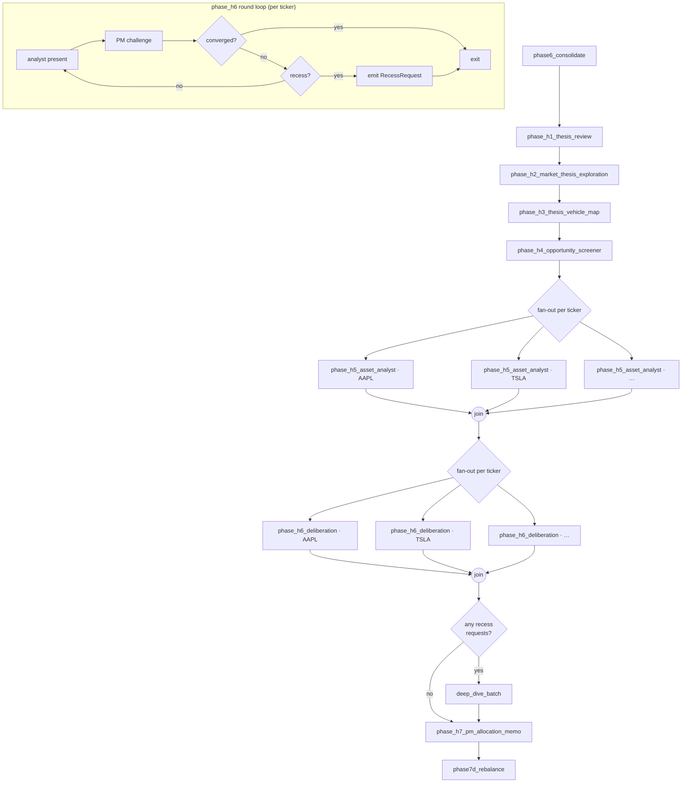

# Hermes — Portfolio Deliberation Sub-graph

> **Status:** architectural spec — Wave 2 implements (see [`WAVE2_UNIT_SPECS.md`](WAVE2_UNIT_SPECS.md)). Predecessor: Atlas phases 1–6 consolidated bias row consumed at `phase_h1_thesis_review`. Refs: [`docs/plans/atlas-full-migration-wave1.md`](../../../../docs/plans/atlas-full-migration-wave1.md); ADR-0009; migration 024 (W1-B); migration 025 (§5.1, W2-A).

Hermes turns Atlas research into an allocation memo and rebalance decision. It replaces the single-call `phase7c_analyst` + `phase7d_pm` pair with a seven-phase flow: thesis review, vehicle mapping, opportunity screening, blinded per-ticker analysis, cyclic analyst↔PM deliberation, and the PM memo.

---

## 1. Topology

### 1.1 ASCII diagram

```
  phase6_consolidate (Atlas; existing)
            │
            ▼
  phase_h1_thesis_review ─────────► theses CRUD
            │
            ▼
  phase_h2_market_thesis_exploration
            │
            ▼
  phase_h3_thesis_vehicle_map ─────► thesis_vehicles (×N)
            │
            ▼
  phase_h4_opportunity_screener
            │
            ▼
     fan-out per ticker
   ┌────────┴────────┐
   ▼        …        ▼
  phase_h5_asset_analyst (×N)       ← batchable (W3-C)
   │                 │
   └────── fan-in ───┘
            │
     fan-out per ticker
   ┌────────┴────────┐
   ▼        …        ▼
  phase_h6_deliberation (×N)        ← internal round-loop per ticker
   │                 │
   │  ┌──── round loop (cyclic) ─────┐
   │  │  PM challenge                │
   │  │  analyst defend              │
   │  │  converge? ─── yes ──► exit  │
   │  │  recess? ─── emit RecessReq  │
   │  └──────────────────────────────┘
   │                 │
   └────── fan-in ───┘
            │
            ▼
    any recess requests? ─── yes ──► deep_dive_batch (conditional)
            │                              │
            │ no                           │
            ▼◄─────────────────────────────┘
  phase_h7_pm_allocation_memo
            │
            ▼
  phase7d_rebalance (existing; input swapped in W2-G)
```

### 1.2 Mermaid



### 1.3 Phase directory

| Phase | Role | Skill(s) | Fan-out | Primary output |
|-------|------|----------|---------|----------------|
| `phase_h1_thesis_review` | Re-score active theses; update status (`ACTIVE` / `CHALLENGED` / `CLOSED` / `INVALIDATED` / `PAUSED`) per `chk_theses_status` | [`thesis`](../../skills/thesis/SKILL.md), [`thesis-tracker`](../../skills/thesis-tracker/SKILL.md) | 1 | `ThesisReviewOutput` |
| `phase_h2_market_thesis_exploration` | Discover new theses from macro + sector research | [`market-thesis-exploration`](../../skills/market-thesis-exploration/SKILL.md) | 1 | `MarketThesisExploration` |
| `phase_h3_thesis_vehicle_map` | Map each thesis to candidate tickers | [`thesis-vehicle-map`](../../skills/thesis-vehicle-map/SKILL.md) | 1 | `ThesisVehicleMap` |
| `phase_h4_opportunity_screener` | Rank universe; pick analyst roster | [`opportunity-screener`](../../skills/opportunity-screener/SKILL.md) | 1 | `OpportunityScreen` |
| `phase_h5_asset_analyst` | Per-ticker blinded analyst recommendation | [`asset-analyst`](../../skills/asset-analyst/SKILL.md) | N tickers | `AssetRecommendation` per ticker |
| `phase_h6_deliberation` | PM↔analyst cyclic deliberation per ticker | [`deliberation`](../../skills/deliberation/SKILL.md), [`portfolio-manager`](../../skills/portfolio-manager/SKILL.md), [`asset-analyst`](../../skills/asset-analyst/SKILL.md) | N tickers (× rounds) | `DeliberationSession` per ticker |
| `deep_dive_batch` | Resolve recess requests | [`deep-dive`](../../skills/deep-dive/SKILL.md) | M recesses | `DeepDiveNote` rows |
| `phase_h7_pm_allocation_memo` | PM-authored allocation memo | [`pm-allocation-memo`](../../skills/pm-allocation-memo/SKILL.md) | 1 | `PMAllocationMemo` |

---

## 2. Round-loop design (phase_h6)

### 2.1 Structure

Each per-ticker deliberation node is itself a **cyclic LangGraph sub-graph** with three nodes and a conditional edge:

```
  enter
    │
    ▼
  analyst_present ──► pm_challenge ──► converge_check
                                          │
                      ┌───────────────────┤
                      │ converged=true    │ converged=false
                      ▼                   ▼
                   exit               recess_check
                                          │
                      ┌───────────────────┤
                      │ recess=true       │ recess=false
                      ▼                   ▼
              emit RecessRequest    loop back to analyst_present
                      │                   │
                      └───► exit          └───► (next round)
```

- The **conditional edge** reads `meta.converged` (`True` → `exit`) and `meta.recess_triggered` (`True` → emit `RecessRequest` then `exit`; the ticker's loop pauses and resumes after `deep_dive_batch`).
- Personas are loaded as **two separate skill files** so neither side sees the other's system prompt: `asset-analyst/SKILL.md` for the presenter, `portfolio-manager/SKILL.md` for the challenger. This keeps the PM adversarial instead of inheriting the analyst's framing.

### 2.2 Safety cap

- `MAX_ROUNDS = 6`, overrideable via env `ATLAS_DELIBERATION_MAX_ROUNDS` (int).
- On cap hit: the node sets `meta.escalated = True`, records `meta.cap_reason = "max_rounds"`, forces `meta.converged = True` with the last analyst recommendation as the final stance, and emits a warning into `state.errors` (retryable=False) that Phase 9 evolution surfaces in the post-mortem.

### 2.3 Recess semantics

- When a round sets `recess_triggered = True` with `reason`, the node returns a `RecessRequest(ticker, reason, trigger_round_number)` marker and exits the loop for this ticker.
- A pipeline-level collector appends each `RecessRequest` to `state.phase_hermes.recess_requests` via the list-append reducer.
- After the fan-in barrier on `phase_h6`, a conditional router checks `len(state.phase_hermes.recess_requests) > 0`:
  - **yes** → run `deep_dive_batch` (W3-C dispatches via Anthropic Batches; until then, synchronous fan-out via the existing `research_agent`).
  - **no** → skip to `phase_h7`.
- `deep_dive_batch` writes one `deep-dive` document per request and fills `deep_dive_document_key` on the corresponding `deliberation_rounds` row. A follow-up round is **not** auto-run in Wave 2; the next-day delta-triage picks up challenged tickers naturally. Re-entering the round loop in the same run is deferred to Wave 3.

---

## 3. State additions to `AtlasResearchState`

A new nested block is added to [`state.py`](../../src/digiquant_atlas/state.py):

```python
class PhaseHermesState(BaseModel):
    thesis_review: ThesisReviewOutput | None = None
    market_thesis_exploration: MarketThesisExploration | None = None
    thesis_vehicle_map: ThesisVehicleMap | None = None
    opportunity_screen: OpportunityScreen | None = None
    asset_recommendations: Annotated[dict[str, AssetRecommendation], _merge_ticker_dict] = Field(default_factory=dict)
    deliberation_sessions: Annotated[dict[str, DeliberationSession], _merge_ticker_dict] = Field(default_factory=dict)
    pm_allocation_memo: PMAllocationMemo | None = None
    recess_requests: Annotated[list[RecessRequest], _append_list] = Field(default_factory=list)

class AtlasResearchState(BaseModel):
    ...
    phase_hermes: PhaseHermesState = Field(default_factory=PhaseHermesState)
```

Two reducer changes (same file):

- `_merge_analyst_dict` is **renamed** to `_merge_ticker_dict` in W2-E (see [WAVE2_UNIT_SPECS.md §W2-E](WAVE2_UNIT_SPECS.md#w2-e--phase_h5_asset_analyst-replaces-phase7c)) — one ticker-keyed, right-wins-on-collision reducer shared by `asset_recommendations` (h5) and `deliberation_sessions` (h6). No separate `_merge_session_dict`.
- `_append_list` (new) — concatenates parallel list writes; order is commit-order from LangGraph (not semantically significant — consumers sort by `ticker`).

`RecessRequest`, the Hermes sub-models, and `_merge_ticker_dict` / `_append_list` live alongside `SegmentSlot` in `state.py` so they share the same import boundary.

---

## 4. Pydantic output models

One model per H-phase. Each is validated against the schema under [`templates/schemas/`](../../templates/schemas/). Every schema enforces the envelope `{schema_version, doc_type, date, meta, body}` — the Pydantic models mirror that split.

### 4.1 `ThesisReviewOutput` (phase_h1)

- **Schema:** `thesis-review.schema.json` *(to create in W2-B — the `thesis` skill has no dedicated schema today; the envelope matches the `thesis` doc_type already registered).*
- **Fields (body):** `reviewed_theses: list[ThesisStatusUpdate]`, `new_candidate_theses: list[str]` (thesis_ids discovered mid-review), `notes: str`.
- **`ThesisStatusUpdate`:** `thesis_id`, `prior_status`, `new_status ∈ {ACTIVE, MONITORING, CHALLENGED, CLOSED, INVALIDATED, PAUSED, NEW}` (matches live `chk_theses_status`, migration 002 — do NOT introduce new status tokens without a migration), `evidence: list[str]`, `challenged_by: list[str] | None`, optional `resolution: Literal["win", "loss"] | None` (set when `new_status == "CLOSED"` to capture win/loss granularity in the document payload), optional `reason: str | None` (e.g. `"time_expired"` when transitioning to `INVALIDATED`).
- **Status mapping from research vocabulary:** the skills can say "confirmed / expired / closed-win / closed-loss" in their prose; the Pydantic adapter MUST normalize those onto the seven allowed tokens before persistence. Canonical mapping: `CONFIRMED` → `ACTIVE` (plus an incremented per-document `evidence_count` in the payload — "confirmed" is implicit in a still-`ACTIVE` thesis with fresh evidence); `CLOSED-WIN` → `CLOSED` with `resolution="win"`; `CLOSED-LOSS` → `CLOSED` with `resolution="loss"`; `EXPIRED` → `INVALIDATED` with `reason="time_expired"`.
- **Validation:** `thesis_id` must match an existing `theses` row (looked up in `prior_context.active_theses`) *or* appear in `new_candidate_theses`; `new_status == "CLOSED"` requires `evidence` length ≥ 1 AND `resolution ∈ {"win", "loss"}`; `new_status == "INVALIDATED"` requires `reason` non-empty.

### 4.2 `MarketThesisExploration` (phase_h2)

- **Schema:** [`market-thesis-exploration.schema.json`](../../templates/schemas/market-thesis-exploration.schema.json).
- **Fields (body):** `executive_digest_pointer: str`, `deeper_dives: list[str]`, `theses: list[ThesisProposal]`.
- **`ThesisProposal`:** `thesis_id` (≤32), `title` (≤200), `direction`, `statement` (≤4000), `validation_criteria: list[str]` (required, ≥1), `invalidation_criteria: list[str]` (required, ≥1), optional `headwinds / tailwinds / bull_case / bear_case`.
- **Validation:** `thesis_id` unique within the run; direction ∈ {`long`, `short`, `pair`, `hedge`, `avoid`}.

### 4.3 `ThesisVehicleMap` (phase_h3)

- **Schema:** [`thesis-vehicle-map.schema.json`](../../templates/schemas/thesis-vehicle-map.schema.json).
- **Fields (body):** `mappings: list[ThesisVehicleMapping]`.
- **`ThesisVehicleMapping`:** `thesis_id` (must reference h1+h2 theses), `candidate_tickers: list[str]` (min 1; each ≤12 chars, must be in `config.watchlist` or flagged as `extra-universe`), `rationale` (≤4000), `exclusion_reasons: list[str]`, `user_mandate_notes: list[str]`.
- **Validation:** every `thesis_id` in the output must appear in `state.phase_hermes.thesis_review.reviewed_theses` with non-`CLOSED` status, or in `market_thesis_exploration.theses`.

### 4.4 `OpportunityScreen` (phase_h4)

- **Schema:** `opportunity-screen.schema.json` *(create in W2-D — the screener currently emits ad-hoc JSON).*
- **Fields (body):** `roster: list[RosterPick]`, `excluded: list[ExcludedTicker]`, `notes: str`.
- **`RosterPick`:** `ticker`, `rank: int` (1 = highest), `score: float` (0–1), `source_thesis_ids: list[str]`, `rationale: str` (≤800).
- **Validation:** `roster` is non-empty when any non-CLOSED thesis exists; `rank` unique and dense (1..N); `source_thesis_ids` must reference thesis IDs present in h1 or h2.

### 4.5 `AssetRecommendation` (phase_h5)

- **Schema:** [`asset-recommendation.schema.json`](../../templates/schemas/asset-recommendation.schema.json).
- **Fields (body):** `context: PriceContext` (`price`, `day_pct`, `segment_bias`), `bull_case: list[str]`, `bear_case: list[str]`, `verdict: Verdict`, optional `catalysts`, `risk_flags`.
- **`Verdict`:** `bias`, `thesis_status`, `recommended_weight_pct: float` (0–100), `rationale` (≤2000).
- **Validation:** blinded — must **not** reference `current_weights` or `portfolio.json`; `recommended_weight_pct` ignored if `bias == "avoid"`. This model replaces `phase7c_analyst.AnalystPayload` (see §7).

### 4.6 `DeliberationSession` (phase_h6)

- **Schema (transcript):** [`deliberation-transcript.schema.json`](../../templates/schemas/deliberation-transcript.schema.json).
- **Schema (session index):** [`deliberation-session-index.schema.json`](../../templates/schemas/deliberation-session-index.schema.json).
- **Fields:**
  - Transcript `body`: `trigger_summary: list[str]`, `rounds: list[DeliberationRound]`, `final_decisions: list[FinalDecision]`.
  - `DeliberationRound`: `label`, `sections: list[{heading, markdown}]` — canonical heading values, in round order: `"analyst"` (analyst-present), `"pm_challenge"` (PM push-back), `"analyst_defense"` (analyst rebuttal), `"pm_decision"` (PM commit to converge/continue), optional `"recess_reason"` (populated only when `recess_triggered=True`). Writers MUST use these exact strings so downstream readers can index by heading without a regex. Plus Hermes-added `converged: bool`, `recess_triggered: bool`, `deep_dive_document_key: str | None`, `round_number: int`.
  - `FinalDecision`: `ticker`, `analyst_recommendation`, `pm_decision`, `invalidation_condition`.
  - `meta`: `converged: bool`, `escalated: bool` (true when cap hit), `rounds_completed: int`.
- **Validation:** `rounds_completed == len(rounds)`; exactly one round has `converged=True` unless `escalated=True`; `deep_dive_document_key` only set when the round emitted a `RecessRequest`.

### 4.7 `PMAllocationMemo` (phase_h7)

- **Schema:** [`pm-allocation-memo.schema.json`](../../templates/schemas/pm-allocation-memo.schema.json).
- **Fields (body):** `narrative: str` (≤12000), `turnover_discipline: str` (≤4000), `target_weights_rationale: list[TargetWeightRationale]`, `open_questions: list[str]`.
- **`TargetWeightRationale`:** `ticker`, `target_weight_pct` (0–100), `prior_weight_pct: float | None`, `rationale` (≤2000), `deliberation_document_key: str | None`.
- **Validation:** sum of `target_weight_pct` ≤ 100 + cash tolerance (configurable, default 101); every non-null `deliberation_document_key` must resolve to a row in `deliberation_sessions`.

### 4.8 Ancillary models (state-only, not documents)

- `RecessRequest` — `ticker`, `reason`, `trigger_round_number: int`.
- `ThesisStatusUpdate` — see §4.1.

---

## 5. Persistence mapping

Each H-phase's Supabase adapter (to be added in W2-A) writes to both `documents` (full JSON payload, backward-compat) **and** the first-class tables from migration 024 (subset of structured fields for indexed query). Atlas's `supabase_io.py` gains one writer function per H-phase.

> **doc_type vocabulary:** strings below are the **exact Title-Case tokens** enforced by `chk_documents_doc_type` (migration 023, live in prod). Do not change case or spacing — the CHECK constraint will reject the insert.
>
> **`'Thesis Review'` is NOT yet in the allowlist.** A stub migration **025** (see §5.1 below) must be written and applied in Wave 2 as part of W2-A before W2-B can persist `phase_h1_thesis_review` output. Until 025 ships, W2-B tests run against a FakeSupabase fixture that mirrors the proposed extended allowlist.

| Phase | `documents` row (`doc_type`) | First-class table(s) |
|-------|-----------------|----------------------|
| `phase_h1_thesis_review` | `'Thesis Review'` (payload = full output; requires migration 025 — see §5.1) | `theses` — upsert one row per `ThesisStatusUpdate` (`(date, thesis_id)` key); update **only canonical columns** present in migration 001: `status`, `invalidation`, `notes`, `vehicle`. Per-day evidence trail lives in the `'Thesis Review'` **document payload** (`body.reviewed_theses[].evidence[]`) — it is NOT duplicated into a relational column. There is no `evidence_log` column on `theses`, and we do not add one: the document is the right home for the narrative evidence list. |
| `phase_h2_market_thesis_exploration` | `'Market Thesis Exploration'` | `theses` — insert one row per new `ThesisProposal` with `status='ACTIVE'`. |
| `phase_h3_thesis_vehicle_map` | `'Thesis Vehicle Map'` | `thesis_vehicles` — one row per `(thesis_id, ticker)` with `rationale`, `exclusion_reasons`, `candidate_rank` (derived from position in `candidate_tickers`), `user_mandate_notes`, `source_exploration_key` = the `documents.key` of the h2 output. |
| `phase_h4_opportunity_screener` | `'Opportunity Screen'` (requires migration 025 — see §5.1) | `analyst_coverage` — upsert `(date, ticker)` for each `RosterPick`; set `thesis_ids`, `analyst_role='roster'`. |
| `phase_h5_asset_analyst` | `'Asset Recommendation'` (one per ticker) | `analyst_coverage` — update `current_recommendation_key` + `last_updated`. |
| `phase_h6_deliberation` | `'Deliberation Transcript'` (one per ticker) **+** one `'Deliberation Session Index'` (run-level) | `deliberation_sessions` (one row per run) + `deliberation_rounds` (one per round per ticker) + `deep_dive_triggers` (one per `RecessRequest`). |
| `deep_dive_batch` | `'Deep Dive'` (one per recess — **reuses** the existing allowlist entry; we do NOT mint a separate `'Deep Dive Batch'` doc_type, because each individual recess writes its own document) | `deep_dive_triggers` — update `deep_dive_document_key` + `resolved_at`. |
| `phase_h7_pm_allocation_memo` | `'PM Allocation Memo'` | *(none — narrative-heavy; no first-class table. Table-queryable fields live in the phase7d `rebalance_decision` row.)* |

Each row is also appended to `state.published: list[PublishedArtifact]` so Phase 9 evolution can audit write volume.

**Canonical literal values (for row writers):**

- `deliberation_sessions.kind ∈ {'baseline', 'delta_scoped', 'monthly'}` — `baseline` on Sunday full runs, `delta_scoped` on Mon–Sat triaged runs, `monthly` on month-end synthesis.
- `deep_dive_triggers.triggered_by = 'pm_recess'` for recess requests emitted by `phase_h6` — that is the only producer in Wave 2. (Other producers, e.g. operator-initiated, are deferred.)
- `analyst_coverage.analyst_role = 'roster'` for the default screener-driven entries in `phase_h4`.

### 5.1 Migration 025 — Hermes doc_type additions (stub, implemented in W2-A)

Migration 023 is the current live state of `chk_documents_doc_type`. Two Hermes outputs are not yet covered:

- `'Thesis Review'` — output of `phase_h1_thesis_review`.
- `'Opportunity Screen'` — output of `phase_h4_opportunity_screener`.

All other Hermes doc_types (`'Market Thesis Exploration'`, `'Thesis Vehicle Map'`, `'Asset Recommendation'`, `'Deliberation Transcript'`, `'Deliberation Session Index'`, `'PM Allocation Memo'`, `'Deep Dive'`) are already in the migration-023 allowlist — **no action required for them**.

**W2-A deliverable (stub spec; W2-A authors the full SQL):**

```sql
-- apps/digiquant-atlas/supabase/migrations/025_hermes_doc_types.sql
ALTER TABLE documents DROP CONSTRAINT IF EXISTS chk_documents_doc_type;
ALTER TABLE documents ADD CONSTRAINT chk_documents_doc_type CHECK (
  doc_type IS NULL OR doc_type IN (
    -- … all tokens from migration 023 …
    'Thesis Review',
    'Opportunity Screen'
  )
);
```

W2-A applies 025 to dev before W2-B / W2-D can green their persistence tests. No other Hermes writer is blocked on 025.

---

## 6. Delta-run behavior

Triage ([`triage.py`](../../src/digiquant_atlas/triage.py)) is extended with Hermes-tier rules in W2-H:

| Phase | Baseline (Sun) | Delta (Mon–Fri) | Monthly |
|-------|----------------|-----------------|---------|
| `phase_h1_thesis_review` | run | **run daily** — thesis drift is material | run |
| `phase_h2_market_thesis_exploration` | run | skip unless `prior_context.latest_segments["macro"]` shows regime shift | run |
| `phase_h3_thesis_vehicle_map` | run | skip unless h1 produced a `CHALLENGED` or `CLOSED` transition *or* h2 ran | run |
| `phase_h4_opportunity_screener` | run | skip if h3 skipped and no ticker had bias flip | run |
| `phase_h5_asset_analyst` (per-ticker) | all roster | only tickers on `analyst_coverage` whose segment bias flipped OR whose linked thesis is `CHALLENGED` | all roster |
| `phase_h6_deliberation` (per-ticker) | all roster | only tickers whose `AssetRecommendation` changed versus the prior run *or* whose thesis is `CHALLENGED` | all roster |
| `phase_h7_pm_allocation_memo` | run | run **only if** any `phase_h6` node actually ran (otherwise carry the prior memo) | run |

**New triage rule kinds (added to `_rule_for_segment`):**

- `hermes_thesis_drift` (for h2/h3) — evaluates whether h1 produced any status transitions.
- `hermes_ticker_filter` (for h5/h6) — evaluates per-ticker instead of per-segment; the gate returns a `Carried` marker keyed by ticker. Requires extending the gate signature from `(state, segment) → Carried | None` to also accept `(state, ticker) → Carried | None`; W2-H tracks the split.
- `hermes_memo_gate` (for h7) — regenerate iff `state.phase_hermes.deliberation_sessions` has any fresh (non-Carried) entry for this run.

Carried entries still surface in the Phase 9 post-mortem so operators can see what didn't run.

---

## 7. Integration with existing phases

### 7.1 `phase7c_analyst` (current) → `phase_h5_asset_analyst` (new)

**Decision: replace.** The existing [`phase7c_analyst.py`](../../src/digiquant_atlas/phases/phase7c_analyst.py) emits a minimal `AnalystPayload` (`conviction_score`, `stance`, `thesis`, `risks`). `phase_h5` emits the richer `AssetRecommendation` governed by the existing [`asset-recommendation.schema.json`](../../templates/schemas/asset-recommendation.schema.json) — bull/bear cases, context block, verdict with `recommended_weight_pct`, thesis linkage.

- **W2-E deletes** `phase7c_analyst.py` and `state.phase7c_analysts`.
- Callers move to `state.phase_hermes.asset_recommendations`.
- The `AnalystPayload` Pydantic class is removed; no backward-compat shim — callers are in-repo and migrate in the same PR.
- A thin-wrapper option (keeping `phase7c_analyst` as a call through to `phase_h5`) was rejected: adds indirection with no consumer, and the state-field rename is a one-line change at the call sites.

### 7.2 `phase7d_rebalance` (current) consumes `phase_h7_pm_allocation_memo`

[`phase7d_pm.py`](../../src/digiquant_atlas/phases/phase7d_pm.py) currently reads `state.phase7c_analysts` directly and re-derives allocations. Under Hermes, phase_h7 writes the allocation memo and phase7d becomes a **pure transform**:

- New input to `phase7d`: `state.phase_hermes.pm_allocation_memo`.
- `phase7d` maps `PMAllocationMemo.target_weights_rationale` → `RebalanceDecision.recommended_portfolio` + derives `RebalanceAction` list by diffing against `config.preferences.current_weights`.
- `phase7d` no longer invokes the LLM; it becomes deterministic. The node factory keeps the `PipelinePhase` shape so the graph assembly in `graph.py` doesn't change.
- W2-G owns the code swap and the test updates.

---

## 8. Cost + quality guardrails

- **Cache-control:** every H-phase passes `shared_context=_shared_context(state)` so the frozen `config`, `prior_context`, and `data_layer` blocks are `cache_control: ephemeral` on the first call. The deliberation round loop reuses the same shared context across rounds — per-round deltas are the only cache-miss surface.
- **Per-phase LLM mode** (`DIGI_LLM_MODE`):
  - h1, h2, h4 — `medium`
  - h3 — `test` (structural mapping; small output)
  - h5 — `medium`
  - h6, h7 — `best` (deliberation quality + memo voice matter)
  - `deep_dive_batch` — `medium`
- **Max-rounds cap:** see §2.2 (canonical). Escalation surfaces in Phase 9.
- **Batching plan (Wave 3):** h5 per-ticker and h6 round batches become single Anthropic Batches submissions; `deep_dive_batch` likewise. The `NodeSpec(batch=True)` flag lands in W3-C — Hermes only needs to declare the intent in node metadata, which the pipeline builder picks up.
- **Per-run cost telemetry:** Hermes phases emit token counts into `state.phase9_evolution.cost_by_phase[phase_name]`. Phase 9 post-mortem prints a cost trend line per phase so regressions show up against prior baselines.

---

*(Skill ↔ phase crosswalk lives in the §1.3 phase directory "Skill(s)" column — no separate appendix.)*
