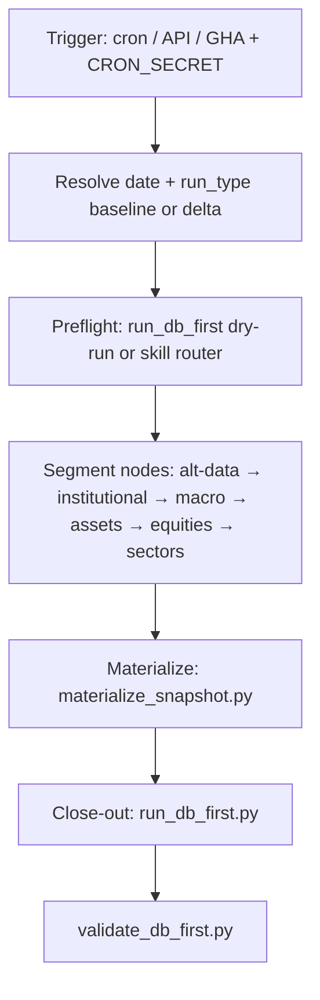

# Wave 2 — DigiGraph graph sketch (Atlas)

This file is the **implementation anchor** for [MIGRATION-ROADMAP-DIGITHINGS.md](MIGRATION-ROADMAP-DIGITHINGS.md) **§ P1b — DigiGraph scheduled operations**. It does not replace the roadmap; it **narrows** how scheduled Cowork work becomes **LangGraph** runs inside **DigiGraph** (`digithings/digraph/`).

**DigiThings on disk:** sibling repo `../digithings` (see roadmap). **DigiGraph** = LangGraph orchestration service; extend it with new compiled graphs or nodes that call Atlas.

---

## Principles

1. **One publish path** — Nodes that persist state should prefer **subprocess or import** of existing Atlas entrypoints: `scripts/publish_document.py`, `scripts/materialize_snapshot.py`, `scripts/run_db_first.py`, `scripts/validate_db_first.py` ([`RUNBOOK.md`](../../RUNBOOK.md), [`docs/ops/SCRIPTS.md`](SCRIPTS.md)).
2. **LLM where the skill already assumes it** — Research segments match today’s **agent + skill** model; a graph can wrap **one prompt = one node** or a **research subgraph** (DigiGraph already has research patterns — see `digithings/digraph/ARCHITECTURE.md`).
3. **Idempotency** — Schedule triggers include stable keys: `(graph_name, date, run_type)`; workers skip or no-op duplicate success for the same key.
4. **Cowork becomes manual** — [`cowork/tasks/`](../../cowork/tasks/README.md) stay the **spec** for behavior and prompts until copied into graph node configs; **scheduled** jobs no longer depend on Cowork’s calendar.

---

## Graph families (minimum viable Wave 2)

| Graph (conceptual name) | Replaces scheduled reliance on | Closes with |
|---------------------------|---------------------------------|-------------|
| **atlas-daily-research** | `recurring-scheduled-run.md` / `research-daily-delta.md` / `research-weekly-baseline.md` (branch by day) | Published digest + `run_db_first.py` → validated DB |
| **atlas-postmortem-research** | `post-mortem-research-github.md` | `pipeline_review` published + optional `pipeline_review_to_github.py` |
| **atlas-postmortem-portfolio** | `post-mortem-portfolio-github.md` | Same for Track B review payload |

Optional later graphs: monthly synthesis, document-deltas fold, portfolio PM rebalance — same pattern, separate `graph_name` and schedule.

---

## High-level flow (daily research)

Logical order only; DigiGraph may parallelize where safe.

**Post-mortem graphs** are smaller: load context from Supabase → LLM or template fill for `pipeline_review` schema → `publish_document.py` → optional GitHub sync script.

---

## Node types

| Node kind | Responsibility | Atlas touchpoints |
|-----------|----------------|-------------------|
| **Router** | Sunday vs weekday vs month-end; mirrors [`scripts/run_db_first.py --dry-run`](../../scripts/run_db_first.py) hints | Config + date |
| **Skill segment** | One phase = one skill package; prompt from [`skills/`](../../skills/) + [`cowork/tasks/`](../../cowork/tasks/) | `validate_artifact.py`, `publish_document.py` |
| **Materialize** | Digest snapshot row + digest document | `materialize_snapshot.py` |
| **Operator close-out** | Metrics, execute-at-open, validation | `run_db_first.py` |
| **Post-mortem publish** | `doc_type: pipeline_review` | `publish_document.py`, [`pipeline_review_to_github.py`](../../scripts/pipeline_review_to_github.py) |

Avoid reimplementing SQL writes in TypeScript for Wave 2; keep Python authoritative.

---

## Environment (worker / graph runner)

Mirror today’s operator machine; inject from DigiThings env or secrets store:

- `SUPABASE_URL`, `SUPABASE_SERVICE_KEY` (or name used in Atlas scripts)
- `CRON_SECRET` or internal auth for **trigger** endpoints only
- Provider keys for LLM nodes (LiteLLM in DigiThings or BYOK later)
- `ATLAS_ROOT` or monorepo path to **`scripts/`** if subprocess uses relative imports

Document the exact variable names in the **DigiThings** deployment template when Wave 1 lands; keep [`config/supabase.env`](../../config/supabase.env) as the local operator reference.

---

## DigiGraph extension (where code lives)

Implementation belongs in **`digithings/digraph/`** (new graph module or registration in `orchestration/`, compiled graph in `graph/` — follow [`digithings/digraph/ARCHITECTURE.md`](../../../digithings/digraph/ARCHITECTURE.md)). Atlas repo **does not** need a second orchestrator; it keeps **skills + scripts + schemas**.

---

## Acceptance cross-check

Matches roadmap **P1b**: a **dated** daily run and a **post-mortem** run complete **without Cowork**; Supabase rows and logs match a manual script-driven run; failures surface in DigiGraph / worker observability.

When this sketch is outdated after implementation, update this file **and** the checklist rows in [MIGRATION-ROADMAP-DIGITHINGS.md](MIGRATION-ROADMAP-DIGITHINGS.md) § P1b.
