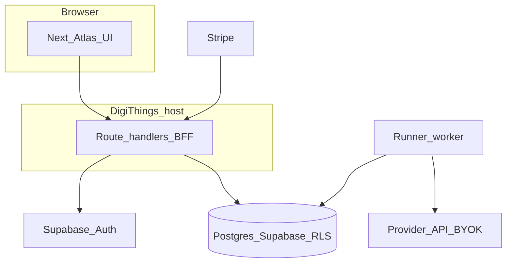

# Migration roadmap: DigiThings, DigiGraph, multi-tenant

This document is the **post-cleanup migration spec** for moving **digiquant-atlas** into the **DigiThings** monorepo as the **DigiQuant** product, adopting **DigiGraph** (LangGraph) for scheduled runs, then adding **user tenancy** (auth, workspaces, BYOK, Stripe, RLS).

**Before executing:** complete [PRE-MIGRATION-CLEANUP.md](PRE-MIGRATION-CLEANUP.md) so the tree you migrate is lean.

**Track work** in your issue tracker (Waves 1–3); this file is the narrative and technical checklist.

**Wave 1 execution plan:** [DIGITHINGS-WAVE1-PLAN.md](DIGITHINGS-WAVE1-PLAN.md) — import path, Next integration options, env/CI checklist (implements **§ P1**).

**Wave 2 design detail:** [DIGITHINGS-WAVE2-GRAPH-SKETCH.md](DIGITHINGS-WAVE2-GRAPH-SKETCH.md) — graph families, node types, Cowork task mapping, env/idempotency (implements **§ P1b**).

**External repos:** The DigiThings monorepo lives alongside this repo — on disk: `../digithings` from the parent of `digiquant-atlas` (e.g. `/Users/…/Code/digithings`). Product name **DigiThings**; folder name may be lowercase.

---

## Strategic priority order (authoritative)

Execution is intentionally **three waves**. Do **not** start Wave 3 (user workspaces, billing, RLS refactors) until Wave 1 and Wave 2 are far enough along that you are not fighting monorepo and scheduling migrations at the same time as schema tenancy.

| Wave | Priority | Outcome |
|------|----------|---------|
| **Wave 1 — DigiThings + DigiQuant** | **First** | Atlas **lives inside the DigiThings monorepo** as a **DigiQuant** app/service (package + route + deploy), same way other first-class apps do. One build pipeline, shared conventions, path to DigiChat/DigiClaw integration. |
| **Wave 2 — DigiGraph operations** | **Second** | **Stop depending on Cowork UI schedules** for recurring work. Implement **daily** and **postmortem** (and related) runs as **DigiGraph** graphs (**LangGraph** in DigiThings — “line graph” in conversation = this stack). **Systematic execution**: your own schedule (cron / API / queue), **API connections**, MCP and tools already wired in DigiThings. Graph nodes call the **same canonical Python/scripts** (`publish_document`, `run_db_first`, `validate_db_first`, etc.) where possible. |
| **Wave 3 — Users & tenancy** | **Final** | **User access** (OAuth), **user settings**, **user-level research**, **workspaces**, **BYOK**, **Stripe**, **RLS** — the productized multi-tenant plan (former **P2–P8** in this doc). |

**Cowork:** After Wave 2, **scheduled** operator work moves to **DigiGraph**; [`cowork/`](../../cowork/) can remain a **manual escape hatch** (ad-hoc sessions), not the source of truth for cron-like reliability.

**Note:** DigiThings already describes **LangGraph** orchestration as **DigiGraph** ([digithings README](../../../digithings/README.md)). Use that stack for Wave 2 so you do not maintain two orchestration philosophies.

---

## A) Requirements

### A.1 Functional

- **F1** User can sign in with **low-friction OAuth**; **v1 default providers:** Google + GitHub (**A.4 D3**); add Microsoft if ICP is enterprise-heavy.
- **F2** **Free**: **authenticated** user sees **dashboard** and **global research** (system workspace: digest/library-style content). **No** anonymous Supabase read of full research corpus in prod (**A.4 D2**).
- **F3** **Paid + BYOK**: user can save **encrypted** provider API key(s), edit **investment profile**, **preferences**, **`rebalancing_policy`**, run **custom research** into **their** workspace, run **Track B PM**, and **schedule** runs (when Phase 7 is on).
- **F4** **Platform subscription** (Stripe) gates customization/scheduling/PM; **BYOK** gates actual model calls for user jobs; UI and ToS state **subscription ≠ inference spend**.
- **F5** **Manual operator** path remains: [`cowork/`](../../cowork/) + tasks + scripts, publishing to a chosen `workspace_id` via service role.
- **F6** **Single-seat** v1; multi-seat / org later.

### A.2 Non-functional (production)

- **N1** **RLS** on all tenant-scoped tables; no cross-tenant reads/writes from `authenticated` role.
- **N2** **Secrets**: BYOK ciphertext at rest; **master encryption key** only on server/worker; no plaintext keys in logs or API responses.
- **N3** **Idempotent** Stripe webhooks and job dispatch (unique constraints + webhook event id storage).
- **N4** **Audit**: optional `audit_log` for key connect/disconnect, subscription changes, policy saves.
- **N5** **Observability**: structured logs for runner and webhooks; failed job visibility (table + UI or admin).
- **N6** **Backups**: Supabase PITR / backup policy documented; migration rollback notes.

### A.3 Security / compliance (v1 bar)

- HTTPS only; secure cookies for sessions (framework defaults).
- Rate-limit **BFF** routes that accept keys or trigger runs.
- Document **data residency** (Supabase region) and subprocessors for enterprise demos.
- ToS: user responsibility for provider keys; no commingling of your API spend with theirs.

### A.4 Decision record (v1 defaults — override only deliberately)

These are **plan defaults** so implementation can start without re-debating each fork. Change them in `docs/ops/multi-tenant.md` if you choose otherwise.

| ID | Topic | Default | Rationale |
|----|--------|---------|-----------|
| **D1** | **Partition strategy** for `daily_snapshots` / `documents` | **Prefer collapse to a single unpartitioned parent** for tenant columns + RLS **if** current + projected multi-tenant row counts stay modest (order of **low millions** of rows total, not per workspace). If production already has large partitions or you expect huge growth, use **D1-alt**: add `workspace_id` to **parent + all yearly child partitions** and recreate UNIQUEs — more migration work, better scan isolation at scale. | Unpartitioned (or single parent) drastically simplifies `UNIQUE(workspace_id, date, …)` and policy rollout; matches “single-seat + system workspace” v1. |
| **D2** | **Anonymous access to global research** | **No** — `anon` does **not** read `documents` / `daily_snapshots` for the full library in prod. **Free tier** = **authenticated** users read **system** `workspace_id` only. **Optional:** public marketing page with **static** or **curated** snippets (not full Supabase corpus) via Next.js SSG or a tiny `public_summaries` table if needed. | Reduces scraping/leakage; aligns with “login for demo” and enterprise narrative; RLS stays simple (`authenticated` only on sensitive tables). |
| **D3** | **OAuth providers (v1)** | **Google + GitHub** enabled in Supabase Auth; add **Microsoft** if ICP is corporate-heavy. | Fast evaluation for technical buyers; Microsoft is one checkbox later. |
| **D4** | **Billing source of truth** | **Stripe webhook** updates `workspaces` billing columns; **BFF** enforces gates (subscription + BYOK) before mutating config or enqueueing jobs. Optional nightly **Stripe API reconcile** job if webhook gaps worry you. | Webhooks are standard; reconcile is insurance, not v1 blocker. |
| **D5** | **`workspaces` config writes** | **Owner-only** via BFF `PATCH` with server-side validation; **no** direct client `update` on `workspaces` from browser if you can avoid it (use RLS deny + service role from BFF using user JWT to authorize). | Prevents tampering with `plan_tier` from client. |

### A.5 Edge cases & account lifecycle

- **Account deletion:** On `auth.users` delete (or user-requested delete), define **cascade**: soft-delete `workspaces` (`deleted_at`) or hard-delete user workspace rows per retention policy; **never** delete **system** workspace. **BYOK** rows must be removed or anonymized. Document **export** path (JSON dump of workspace config) before delete for compliance demos.
- **`past_due` / `canceled`:** **BFF** behavior: block **new** job enqueue and **config saves** that affect PM (or enter read-only settings mode); allow **read** of last published research in user workspace for grace UX. Exact policy: **7-day grace** optional (product choice).
- **Revoked / missing BYOK:** Runner marks job `skipped` with reason `no_credentials`; UI shows “Connect API key to run.”
- **Stripe webhook ordering:** Use `stripe_events` idempotency + **compare** `subscription` object timestamps or event `created` so out-of-order events do not regress `subscription_status`.
- **Concurrent settings saves:** Use `workspaces.updated_at` **check** (If-Match style) or `published_profile_version` increment to avoid lost updates.
- **Operator error:** Wrong `ATLAS_WORKSPACE_ID` publishing to another tenant — mitigate with **CLI confirmation** or **allowlist** of workspace ids in operator env for prod.

---

## B) Architecture snapshot

- **Browser** uses **anon** or **authenticated** Supabase client for **RLS-scoped reads**; **never** service role.
- **BFF** (Next.js Route Handlers or DigiThings equivalent): Stripe webhooks, encrypt BYOK, **internal** job triggers with `CRON_SECRET`.
- **Worker** uses **service role** + explicit `workspace_id` on writes; loads decrypted BYOK in memory only for job duration.
- **Wave 2 (before Wave 3):** **DigiGraph** runs daily/postmortem jobs; may use the same worker process without multi-tenant columns until Wave 3 adds `workspace_id`.

---

## C) Phasing (detailed)

**Wave mapping:** **Wave 1** = **P1** below. **Wave 2** = new section **P1b / DigiGraph ops** (inserted after P1). **Wave 3** = **P2–P8** (multi-tenant productization). Detailed acceptance criteria for P2–P8 are unchanged; they are simply **deferred** until after Wave 2 unless you explicitly parallelize (not recommended).

Each phase has **deliverables**, **files/migrations**, and **acceptance criteria**.

### Phase dependencies (waves first)

| Step | Hard prerequisites | Notes |
|------|---------------------|--------|
| **Wave 1 (P1)** | None | Import repo; DigiQuant route |
| **Wave 2 (DigiGraph)** | Wave 1 codebase in monorepo | Replace Cowork **schedules** with graphs + triggers |
| **Wave 3 (P2–P8)** | Wave 2 **or** at least stable headless runs | Tenancy touches many tables—do after ops migration |

**Legacy P2–P8 dependency table (Wave 3 only):**

| Phase | Hard prerequisites | Can parallelize with |
|-------|-------------------|----------------------|
| **P2a** | Wave 1 done (repo location settled) | — |
| **P2b–c** | P2a tables + seed `system` workspace | P3 design-only |
| **P3** | P2c RLS + `workspace_id` columns on touched tables | P4 stubs behind feature flag |
| **P4** | P3 authenticated identity | P5 UI mock |
| **P5** | P4 billing + BFF PATCH | P6 |
| **P6** | P2b + service role writers | P7 |
| **P7** | P4 gates + P6 runner | P8 |
| **P8** | P2–P7 on staging | — |

### P1 — Monorepo + hosting (Wave 1)

**Goal:** Atlas UI and build live inside DigiThings; one deploy; optional redirect from GitHub Pages.

**Execution plan:** [DIGITHINGS-WAVE1-PLAN.md](DIGITHINGS-WAVE1-PLAN.md) — naming (`apps/digiquant-atlas` vs `digiquant/`), subtree vs submodule, Next `basePath`, CI, ordered checklist.

| Task | Detail |
|------|--------|
| Import | `apps/digiquant-atlas` or `apps/atlas` (align with DigiThings conventions); preserve or subtree history. |
| Routing | Sub-path e.g. `/digiquant-atlas` or `/atlas` — match [`digichat/ARCHITECTURE.md`](../../../digithings/digichat/ARCHITECTURE.md) routing patterns. |
| Env | `NEXT_PUBLIC_SUPABASE_URL`, `NEXT_PUBLIC_SUPABASE_ANON_KEY`, server-only `SUPABASE_SERVICE_ROLE_KEY`, `STRIPE_*`, `ATLAS_ENCRYPTION_KEY` / KMS ref, `CRON_SECRET`. |
| CI | Build + deploy step in DigiThings pipeline; E2E smoke on staging. |

**Acceptance:** Staging URL loads Atlas pages (`/`, `/library`, `/portfolio`, …) under sub-route; no secrets in client bundle.

---

### P1b — DigiGraph scheduled operations (Wave 2)

**Goal:** **Delegate** recurring **daily** pipeline steps and **postmortem** (and similar review) runs from **Claude Cowork scheduled tasks** to **DigiGraph** (**LangGraph**) inside DigiThings: a **single systematic** system with **schedule** (cron, queue worker, or HTTP trigger), **provider APIs**, and **MCP / tool** access already centralized (DigiClaw, DigiThings connectors).

**Implementation sketch:** [DIGITHINGS-WAVE2-GRAPH-SKETCH.md](DIGITHINGS-WAVE2-GRAPH-SKETCH.md) — replaces narrative-only planning with graph names, node boundaries, and acceptance cross-check for this section.

| Task | Detail |
|------|--------|
| Graphs | Define at least: **(1) daily research/digest path** aligned with [`RUNBOOK.md`](../../RUNBOOK.md) + [`cowork/tasks/research-daily-delta.md`](../../cowork/tasks/research-daily-delta.md) / router; **(2) postmortem** flows aligned with [`post-mortem-research-github.md`](../../cowork/tasks/post-mortem-research-github.md) / portfolio variants. |
| Nodes | Prefer **thin nodes** that shell out or import existing **Python** entrypoints (`publish_document.py`, `materialize_snapshot.py`, `run_db_first.py`, `validate_db_first.py`) so **one canonical publish path** remains. |
| Schedule | Wire **DigiThings** scheduler (or GHA calling an internal API) to **start graph runs**; use **idempotency** keys per `(date, run_type, graph_name)`. |
| Secrets | Operator/provider keys from **DigiThings env** or vault — same trust model as today’s service role on workers. |
| Cowork | **Remove reliance** on Cowork **calendar** for these jobs; keep **manual** [`cowork/tasks/`](../../cowork/tasks/) for ad-hoc operator sessions. Update [`cowork/PROJECT.md`](../../cowork/PROJECT.md) to say **scheduled** runs = DigiGraph. |

**Acceptance:** A dated daily run and a postmortem run complete **without opening Cowork**, logs + Supabase rows match what a manual script run would produce; failures visible in DigiThings/DigiGraph observability.

---

### P2 — Database: workspaces + tenant columns + RLS (Wave 3)

**Goal:** Production schema for multi-tenancy; **system** workspace for global research; **user** workspaces; strict RLS.

#### P2a — New tables (new migration, e.g. `supabase/migrations/015_workspaces_and_billing.sql`)

Suggested objects (adjust names to match your naming style):

- **`workspaces`**
  - `id` uuid PK default `gen_random_uuid()`
  - `slug` text unique nullable (for human/debug)
  - `type` text check in (`system`, `user`) — exactly one row `type = 'system'` for global research
  - `name` text
  - `created_at` timestamptz
  - **Billing (denormalized for RLS simplicity):** `stripe_customer_id`, `stripe_subscription_id`, `subscription_status` (`none` | `active` | `past_due` | `canceled`), `plan_tier` (`free` | `pro` | `enterprise`)
  - **Config (paid):** `investment_profile` jsonb, `preferences` jsonb, `rebalancing_policy` jsonb, `settings` jsonb (UI prefs), `updated_at`
  - Optional: `published_profile_version` int for optimistic concurrency

- **`workspace_members`**
  - `workspace_id` uuid FK → workspaces
  - `user_id` uuid FK → `auth.users`
  - `role` text check in (`owner`, `member`) — v1 usually one `owner` per user workspace
  - PK `(workspace_id, user_id)`; index on `user_id`

- **`profiles`** (if not using auth metadata only)
  - `user_id` uuid PK → `auth.users`
  - `display_name`, `avatar_url`, `default_workspace_id` uuid nullable

- **`workspace_provider_credentials`**
  - `id` uuid PK
  - `workspace_id` uuid FK unique per (`workspace_id`, `provider`) 
  - `provider` text
  - `ciphertext` bytea or text (base64)
  - `nonce` / `key_id` if using envelope encryption
  - `fingerprint` text (hash prefix for UI)
  - `created_at`, `revoked_at` nullable, `last_used_at`

- **`stripe_events`** (idempotency)
  - `stripe_event_id` text PK
  - `processed_at` timestamptz
  - `payload` jsonb optional

- **`job_runs`** (Phase 7 can add; or stub empty in P2)
  - `id` uuid PK, `workspace_id`, `job_type`, `status`, `started_at`, `finished_at`, `error`, `idempotency_key` unique nullable

- **`audit_log`** (optional)
  - `id`, `workspace_id`, `user_id`, `action`, `metadata` jsonb, `created_at`

**Triggers:** `updated_at` on `workspaces` via `moddatetime` extension if already in project.

#### P2b — Tenant columns on existing tables

Add **`workspace_id` uuid not null** (after backfill) to:

- `daily_snapshots`, `documents`, `positions`, `theses`, `position_events`, `nav_history`, `portfolio_metrics`

**Global market data** (typically **no** `workspace_id` — shared across all users):

- `price_history`, `price_technicals` (confirm current migrations — keep global unless you need per-tenant symbols later)

**Constraints:** Replace:

- `daily_snapshots`: `UNIQUE(date)` → `UNIQUE(workspace_id, date)`
- `documents`: `UNIQUE(date, document_key)` → `UNIQUE(workspace_id, date, document_key)`
- `positions`: `UNIQUE(date, ticker)` → `UNIQUE(workspace_id, date, ticker)`
- `theses`: `UNIQUE(date, thesis_id)` → `UNIQUE(workspace_id, date, thesis_id)`
- `position_events`: evaluate `UNIQUE(date, ticker)` → include `workspace_id` if events are per-tenant
- `nav_history`, `portfolio_metrics`: add `workspace_id` to PK/unique (`date` alone → `(workspace_id, date)`)

**Partitioning:** Today yearly partitions exist on snapshots/documents ([`004_partition_strategy.sql`](../../supabase/migrations/004_partition_strategy.sql), [`011_unpartition_snapshots_documents.sql`](../../supabase/migrations/011_unpartition_snapshots_documents.sql)). **Locked default:** see **A.4 D1** — prefer **collapse** when row counts allow; else **Option A** (add `workspace_id` to parent + **each** child partition + recreate UNIQUEs). Record the **actual** choice and row-count snapshot in the migration header comment.

**Backfill script (one-off SQL or Python):**

1. Insert **system** workspace row; insert **owner workspace** for existing operator data.
2. `UPDATE ... SET workspace_id = '<system>'` for rows you classify as global research vs `'<personal>'` for legacy portfolio — **you** define the split from current single-tenant data.

#### P2c — RLS policies (replace `anon_read` all)

- **Remove** or **narrow** `anon_read USING (true)` on tenant tables for **production** (align with **A.4 D2**: no broad anon read of research corpus).
- **`authenticated` SELECT** on `documents` / `daily_snapshots` / etc.:
  - `workspace_id = <system_workspace_id>` **OR** `workspace_id` in (select from `workspace_members` where `user_id = auth.uid()`)
- **`authenticated` UPDATE** on `workspaces` row: only if `owner` in `workspace_members` **and** RLS or check constraint aligns with subscription (or enforce subscription only in BFF and keep DB to membership — **prefer** BFF for billing complexity, DB for tenant isolation).
- **INSERT** on tenant tables: typically **deny** for `authenticated` (runners use **service_role**). Exception: none for raw inserts; use **RPC** with `security definer` if ever needed.
- **`service_role`**: document that app server/worker uses it; never in browser.

**Acceptance:** As user A, cannot `select` user B’s `documents` via Supabase client; free user can read **system** workspace only; service role can still publish with explicit workspace id in staging.

---

### P3 — Frontend auth + query scoping (Wave 3)

**Goal:** Real sessions; all library/dashboard queries scoped.

| Area | Files / actions |
|------|------------------|
| Supabase client split | [`frontend/lib/supabase.ts`](../../frontend/lib/supabase.ts) — browser client with cookie/session; optional server client for RSC. |
| Auth UI | `frontend/app/login/page.tsx`, callback route, `middleware.ts` (protect `/settings`, `/portfolio` if needed). |
| Types | Regenerate [`frontend/lib/database.types.ts`](../../frontend/lib/database.types.ts) from Supabase CLI after migrations. |
| Data layer | [`frontend/lib/queries.ts`](../../frontend/lib/queries.ts) — every query takes `workspaceId` or resolves `default_workspace_id` + system id for global tab. |
| Layout | [`frontend/app/layout.tsx`](../../frontend/app/layout.tsx) — session provider, nav sign-in/out. |

**Routes (minimum):**

- `/login`, `/auth/callback` (if PKCE flow)
- `/settings` (paywalled sections)
- Existing: `/`, `/library`, `/portfolio`, `/performance`, `/architecture` — gate portfolio-heavy views for free tier if they show user workspace data

**Acceptance:** E2E: sign in → see global research; second user cannot see first user’s workspace rows (manual or automated test against staging).

---

### P4 — BFF: BYOK encryption + Stripe (Wave 3)

**Goal:** Secure key storage; subscription state drives `plan_tier`.

| Route / module | Responsibility |
|----------------|----------------|
| `POST /api/atlas/credentials` | Accept plaintext once; encrypt with server key; store fingerprint; audit. |
| `DELETE /api/atlas/credentials` | Revoke. |
| `POST /api/stripe/webhook` | Verify signature; idempotent insert into `stripe_events`; update `workspaces` billing columns. |
| `POST /api/stripe/checkout-session` | Create Checkout for logged-in user (map to `stripe_customer_id`). |
| `GET /api/stripe/portal` | Customer Portal session. |

**Encryption:** Use a vetted library (e.g. AES-GCM) with random nonce; store `key_id` if rotating master keys. Prefer **KMS** (AWS/GCP) or **Supabase Vault** if adopted — document choice.

**Acceptance:** Network tab never shows full API key after save; webhook replay does not double-apply subscription state.

**HTTP / errors (BFF):** Return **401** unauthenticated, **403** wrong workspace / not owner, **402** or **409** with stable JSON body `{ "code": "SUBSCRIPTION_REQUIRED" | "BYOK_REQUIRED" | "PAST_DUE" }` for paywall states — **no** stack traces or provider keys in responses. Log server-side with request id.

**Stripe → `workspaces` mapping (handle in webhook handler):**

| Stripe signal | Suggested workspace updates |
|---------------|----------------------------|
| `checkout.session.completed` | Attach `stripe_customer_id`; optionally start trial flags |
| `customer.subscription.created` | `stripe_subscription_id`, `subscription_status = active`, `plan_tier = pro` |
| `customer.subscription.updated` | Sync `status` → `active` \| `past_due` \| `canceled` \| `trialing`; sync price → `plan_tier` if multiple products |
| `customer.subscription.deleted` | `subscription_status = canceled`, downgrade `plan_tier` to `free` |
| `invoice.payment_failed` | `subscription_status = past_due` (grace rules per **A.5**) |

---

### P5 — Settings UI + validation (Wave 3)

**Goal:** Users edit structured config safely.

- **Pages:** `frontend/app/settings/profile`, `…/billing`, `…/api-keys`, `…/rebalancing` (or single page with tabs).
- **JSON schemas:** Add under `templates/schemas/` for `investment-profile`, `preferences`, `rebalancing-policy` (mirror [`config/schedule.json`](../../config/schedule.json) fields you expose).
- **Client validation** + **server re-validation** on save (BFF PATCH `workspaces`).

**Acceptance:** Invalid JSON rejected with field errors; successful save updates `workspaces` and `updated_at`.

---

### P6 — Python publishers + thin runner (Wave 2 invokes; Wave 3 extends with `--workspace-id`)

**Goal:** Same code path for Cowork and automation.

**Scripts to extend** (add `--workspace-id` and/or `ATLAS_WORKSPACE_ID`):

- [`scripts/publish_document.py`](../../scripts/publish_document.py)
- [`scripts/materialize_snapshot.py`](../../scripts/materialize_snapshot.py)
- [`scripts/run_db_first.py`](../../scripts/run_db_first.py)
- [`scripts/update_tearsheet.py`](../../scripts/update_tearsheet.py)
- [`scripts/validate_db_first.py`](../../scripts/validate_db_first.py)
- [`scripts/execute_at_open.py`](../../scripts/execute_at_open.py), [`scripts/backfill_execution_prices.py`](../../scripts/backfill_execution_prices.py) as applicable

**New package (suggested):** `scripts/atlas_runner/` or `python -m atlas_runner`:

- Load workspace row (service role): profile, prefs, policy
- Decrypt BYOK (same crypto as TS or delegate to small shared lib — **one** implementation preferred)
- Build prompt from [`skills/`](../../skills/) + [`templates/`](../../templates/)
- Call Anthropic/OpenAI Messages API
- Write artifacts → existing publishers

**Acceptance:** One manual CLI run publishes a `research-delta` document_key under a **test** user workspace; `validate_db_first.py` passes with `--workspace-id`.

---

### P7 — Jobs + cron + hardening (Wave 2 baseline; Wave 3 adds per-tenant gates)

**Goal:** Scheduled runs for entitled workspaces only.

- **`job_runs`**: enqueue/dispatch; `idempotency_key` = `(workspace_id, job_type, date)` or similar.
- **Dispatcher:** `POST /api/internal/jobs/dispatch` with `Authorization: Bearer CRON_SECRET` or Vercel Cron headers + shared secret.
- **Worker:** claim row `for update skip locked` or use external queue later.
- **Limits:** max concurrent jobs per workspace; backoff on provider 429.

**Acceptance:** Cron fires staging dispatch; only `subscription_status = active` and BYOK present run; failures recorded in `job_runs`.

---

### P8 — Production readiness (Wave 3 ops)

- **Staging** mirrors prod migrations; seed system workspace + test users.
- **Runbook:** [`RUNBOOK.md`](../../RUNBOOK.md) section **Multi-tenant**: env vars, webhook setup, operator workspace id, rollback.
- **Docs:** `docs/ops/multi-tenant.md` — RLS diagram, billing states, support playbooks.
- **Security review:** RLS spot-check, Stripe webhook auth, encryption, dependency audit.

---

## D) Commercial model (summary)

| Tier | Access |
|------|--------|
| **Free** | OAuth login (**authenticated**); read **system** workspace research + dashboard; anon has **no** library access per **D2**. |
| **Pro (+ BYOK)** | Stripe active; encrypted keys; full settings; user workspace research + PM; scheduling when P7 on. |

**Messaging:** Subscription = **platform**; model usage = **user’s** provider bill.

---

## E) File checklist (Atlas repo — indicative)

**New**

- `supabase/migrations/015_workspaces_and_billing.sql` (or split 015–017)
- `frontend/middleware.ts`
- `frontend/app/login/page.tsx`, `frontend/app/auth/callback/route.ts`
- `frontend/app/settings/**` (layout + tabs)
- `frontend/lib/auth.ts` (session helpers)
- `frontend/lib/workspace-context.tsx` (optional)
- `app/api/**/route.ts` (or under DigiThings `apps/.../api`) for Stripe + credentials
- `templates/schemas/rebalancing-policy.schema.json` (and siblings)
- `docs/ops/multi-tenant.md`
- `scripts/atlas_runner/**` (or equivalent)

**Modify**

- [`frontend/lib/supabase.ts`](../../frontend/lib/supabase.ts), [`frontend/lib/queries.ts`](../../frontend/lib/queries.ts), [`frontend/lib/types.ts`](../../frontend/lib/types.ts)
- [`frontend/app/layout.tsx`](../../frontend/app/layout.tsx), page components that assume single-tenant data
- All publisher scripts listed in P6
- [`.github/workflows/deploy.yml`](../../.github/workflows/deploy.yml) / DigiThings CI when merged
- [`RUNBOOK.md`](../../RUNBOOK.md), [`cowork/PROJECT.md`](../../cowork/PROJECT.md), [`AGENTS.md`](../../AGENTS.md) (operator rules)

**DigiThings repo (merge side)**

- App registration, shared `layout` nav link to Atlas
- Optional: DigiChat tool definitions calling Atlas BFF
- Docker compose service for **worker** (if not GHA-only)

---

## F) Environment variables (production)

| Variable | Where | Purpose |
|----------|--------|---------|
| `NEXT_PUBLIC_SUPABASE_URL` | Client | Supabase project URL |
| `NEXT_PUBLIC_SUPABASE_ANON_KEY` | Client | RLS-scoped anon key |
| `SUPABASE_SERVICE_ROLE_KEY` | Server/worker only | Publishers, webhooks, decrypt jobs |
| `ATLAS_ENCRYPTION_KEY` or KMS refs | Server/worker | BYOK envelope |
| `STRIPE_SECRET_KEY`, `STRIPE_WEBHOOK_SECRET` | Server | Billing |
| `STRIPE_PRICE_PRO` etc. | Server | Checkout |
| `CRON_SECRET` | Server | Internal dispatch auth |
| `NEXT_PUBLIC_APP_URL` | Client/server | Stripe redirects |

---

## G) Testing matrix (minimum)

| Layer | Test |
|-------|------|
| RLS | Two JWTs: A cannot read B’s workspace rows |
| RLS | **Anon** key cannot `select` tenant tables in prod config (per **D2**) |
| Billing | Webhook sequence: checkout → active → cancel |
| Billing | **Out-of-order** webhooks: older event does not overwrite newer `subscription_status` |
| BYOK | Save key → DB ciphertext → runner can decrypt in staging job only |
| BYOK | **Revoke** → next job `skipped` with visible reason |
| Publishers | `--workspace-id` upsert correct parent/partition (matches **D1** choice) |
| Settings | Concurrent PATCH with stale `updated_at` → **409** conflict |
| E2E | Login → library (system) → upgrade path (staging Stripe test mode) |
| Lifecycle | User delete / GDPR export script (staging) leaves **system** workspace intact |

---

## H) Cowork / manual operator (ongoing)

- After **Wave 2**, **scheduled** work is **DigiGraph**, not Cowork UI timers. **Cowork** remains for **ad-hoc** operator sessions and emergencies.
- Document **`ATLAS_WORKSPACE_ID`** (or `--workspace-id`) in [`cowork/PROJECT.md`](../../cowork/PROJECT.md) and [`RUNBOOK.md`](../../RUNBOOK.md) (Wave 3 when multi-tenant writes matter).
- Manual runs use **service role** on operator machine — treat laptop as **trusted**; never commit keys.

---

## I) Future (out of v1 scope)

- **DigiQuant** signals → PM (NautilusTrader / Polars artifacts linked to theses; PM reads signals as sizing/constraints).
- **Enterprise** SAML, SCIM, multi-seat, contracts.
- **DigiChat**-first onboarding ([`digichat/ARCHITECTURE.md`](../../../digithings/digichat/ARCHITECTURE.md)).

---

## J) Where you are today (unchanged baseline)

- Single-tenant Supabase: global UNIQUEs, `anon` read-all ([`001_initial_schema.sql`](../../supabase/migrations/001_initial_schema.sql), [`006_fix_partitioned_rls.sql`](../../supabase/migrations/006_fix_partitioned_rls.sql)).
- Cowork + Python publishers ([`RUNBOOK.md`](../../RUNBOOK.md)).
- GitHub Actions: market data only ([`daily-price-update.yml`](../../.github/workflows/daily-price-update.yml)).
- Frontend: no auth ([`frontend/lib/queries.ts`](../../frontend/lib/queries.ts)).

---

## K) Suggested execution order (when you leave plan mode)

1. **Wave 1 — P1:** Import Atlas into **DigiThings** per [DIGITHINGS-WAVE1-PLAN.md](DIGITHINGS-WAVE1-PLAN.md); route + env + CI on staging.
2. **Wave 2 — P1b:** Implement **DigiGraph** flows for **daily** + **postmortem** (etc.) per [DIGITHINGS-WAVE2-GRAPH-SKETCH.md](DIGITHINGS-WAVE2-GRAPH-SKETCH.md); wire schedule/API; retire Cowork **scheduled** reliance; keep scripts as the canonical publish path.
3. **Wave 3 — Req sign-off:** confirm **A.4** before large DB churn.
4. **P2a–c** migrations → regenerate types → **P3** auth + query scoping.
5. **P4** Stripe + credential encrypt → **P5** account settings UI.
6. **P6** `--workspace-id` on publishers + graph/worker alignment.
7. **P7** per-tenant job rules (if not subsumed by DigiThings scheduler).
8. **P8** hardening + docs + production cutover checklist.

The **YAML todos** at the top list **waves** first, then granular **P*** items for Wave 3 tracking.

---

## L) Glossary

| Term | Meaning |
|------|---------|
| **BYOK** | Bring your own key — user’s LLM provider API key, encrypted at rest, used only server-side for their jobs. |
| **System workspace** | Single `workspaces` row (`type = system`) whose `workspace_id` tags **global** research readable by entitled free/paid users per RLS. |
| **User workspace** | Per-account workspace for **custom** research + **portfolio** rows; isolated by RLS. |
| **BFF** | Backend-for-frontend — Next.js Route Handlers (or DigiThings equivalent) that hold secrets and call Stripe / encrypt credentials. |
| **Runner / worker** | Process using **service role** to read workspace config, decrypt BYOK in memory, call provider API, invoke Python publishers. |
| **Entitlements** | `plan_tier` + `subscription_status` + feature gates; enforced in BFF and reflected in UI. |
| **Track A / B** | Research-only vs portfolio PM track ([`RUNBOOK.md`](../../RUNBOOK.md)). |
| **DigiGraph** | DigiThings’ **LangGraph**-based orchestration for tool-calling workflows — use for **Wave 2** scheduled runs. |

---

## M) Config & skill references (implementation anchors)

Keep these paths stable so runners and Cowork stay aligned:

| Asset | Path |
|-------|------|
| Full repo inventory (pre-export) | [`docs/ops/REPOSITORY-INVENTORY.md`](REPOSITORY-INVENTORY.md) |
| Wave 1 monorepo + hosting plan | [`docs/ops/DIGITHINGS-WAVE1-PLAN.md`](DIGITHINGS-WAVE1-PLAN.md) |
| Wave 2 DigiGraph graph sketch | [`docs/ops/DIGITHINGS-WAVE2-GRAPH-SKETCH.md`](DIGITHINGS-WAVE2-GRAPH-SKETCH.md) |
| Operator briefing | [`cowork/PROJECT.md`](../../cowork/PROJECT.md), [`RUNBOOK.md`](../../RUNBOOK.md) |
| Digest / delta schemas | [`templates/digest-snapshot-schema.json`](../../templates/digest-snapshot-schema.json), [`templates/delta-request-schema.json`](../../templates/delta-request-schema.json) |
| Schedule concepts (rebalancing_policy) | [`config/schedule.json`](../../config/schedule.json) |
| Legacy profile sources (until fully DB-backed) | [`config/preferences.md`](../../config/preferences.md), [`config/investment-profile.md`](../../config/investment-profile.md) |
| Supabase env (local operator) | [`config/supabase.env`](../../config/supabase.env) (never commit secrets) |
