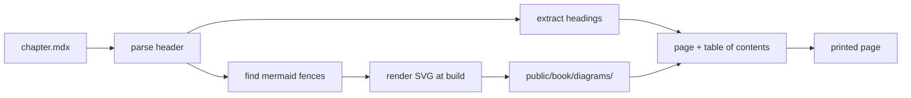

```mermaid
graph LR
  A[chapter.mdx] --> B[parse header]
  B --> C[extract headings]
  B --> D[find mermaid fences]
  D --> E[render SVG at build]
  E --> F[public/book/diagrams/]
  C --> G[page + table of contents]
  F --> G
  G --> H[printed page]
```

There are four steps and one of them is the only place a diagram is ever
rendered.
