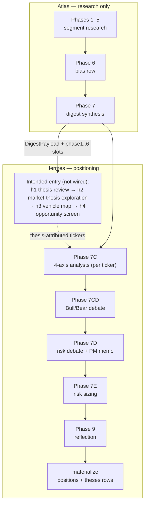
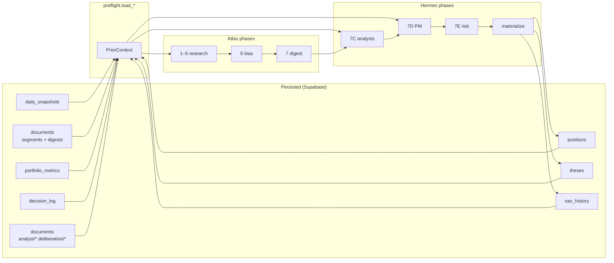

# DigiQuant Architecture

**Version:** 0.1.x
**Last updated:** 2026-03-29
**Audience:** Engineers, reviewers, and agents working on or integrating with DigiQuant.

---

## Table of Contents

1. [Overview](#1-overview)
2. [Current Implementation State](#2-current-implementation-state)
3. [API Surface](#3-api-surface)
4. [Data Model](#4-data-model)
5. [Internal Architecture](#5-internal-architecture)
6. [Security Analysis](#6-security-analysis)
7. [Scalability Analysis](#7-scalability-analysis)
8. [Performance Analysis](#8-performance-analysis)
9. [Integration Points](#9-integration-points)
10. [Docker and MCP Composition](#10-docker-and-mcp-composition)
11. [Phase 2+ Gaps and Roadmap](#11-phase-2-gaps-and-roadmap)
12. [Redesign Recommendations](#12-redesign-recommendations)

---

## 1. Overview

DigiQuant is the deterministic quant engine of the DigiThings stack. Its primary role is to own and execute the ordered pipeline: **validate → backtest → optimize → export**. No other service in the stack is permitted to make performance claims (Sharpe, PnL, trade count) without a result originating from this service.

DigiQuant operates as an internal vertical in the federated hub model. Typical callers are:

- **DigiGraph** (orchestration hub) — calls via HTTP orchestrator endpoints and dispatches tool invocations through `/v1/orchestrator_invoke`
- **MCP clients** (IDE, Claude Desktop, DigiClaw) — attach directly via `streamable-http` or `stdio` transport on port 8767
- **Power users** — call HTTP endpoints directly or use the `digiquant` CLI
- **DigiClaw** (heartbeat service) — polls `/check_drift` for ADDM-triggered re-optimization

### NautilusTrader Integration

NautilusTrader is the sole backtest and live-trade execution engine. Its key properties relevant to architecture:

- **Rust core** for the event loop, order book, and fill simulation — Python strategies attach via the Actor/MessageBus pattern
- **`BacktestEngine`** is the synchronous entrypoint; DigiQuant calls `engine.run()` in the current thread
- **Bar-driven** by default: OHLCV data is fed through `BarDataWrangler` and replayed bar-by-bar to the strategy's `on_bar()` callback
- **`TestInstrumentProvider.equity()`** is used for simulation instruments; no real market microstructure (no bid/ask spread, no partial fills) in the default configuration
- **Optional dependency**: installed via `digiquant[nautilus]`. The backtest entry point falls through to `None` if `nautilus_trader` is not importable.

The Polars-to-pandas boundary in `nautilus_runner.py` is a deliberate, documented exception to the "Polars only" rule. Nautilus's `BarDataWrangler.process()` requires a pandas DataFrame with a `timestamp` UTC index. All other data handling in DigiQuant (CSV loading, account report parsing, result assembly) uses Polars.

**Version pinning:** `nautilus_trader` is pinned to `>=1.190,<2` in `pyproject.toml`. The 2.x series introduced an async-first API surface with breaking changes to `BacktestEngine.run()` and the Actor registration model.

**Linux CI crash (SIGABRT / exit 134) — tracked in #42:**
`BacktestEngine.run()` registers C++-level SIGTERM/SIGINT handlers in its Rust runtime. On Linux, `uvicorn[standard]` installs `uvloop` and sets it as the global asyncio event loop policy, which also claims those POSIX signal handlers via libuv. When both runtimes attempt to own signal handling, a C-level assertion fires → SIGABRT. Mitigation: `tests/dq/conftest.py` resets the asyncio policy to `DefaultEventLoopPolicy` before the dq suite runs, preventing uvloop from conflicting with Nautilus's signal registration. The three integration tests that run a real `BacktestEngine` are skipped on Linux CI (`CI=true`) until the per-component test suite (#43) re-enables pytest and the fix is confirmed green on Ubuntu.

### Pipeline Ownership

DigiQuant owns the ordered quant workflow internally via a LangGraph `StateGraph` in `digiquant/src/digiquant/graph/pipeline.py`. This graph is not the same as DigiGraph's supervisor — it is a local, synchronous, domain-specific pipeline that ensures validate runs before backtest, backtest before optimize, and optimize before export. DigiGraph is the external orchestration hub that decides *when* to call DigiQuant, not *how* DigiQuant sequences its own steps.

---

## 2. Current Implementation State

### What Is Built

**6 registered strategies** in `digiquant/src/digiquant/strategies/`:

| Canonical Name | File | Type | Description |
|---|---|---|---|
| `ema_cross` | `ema_cross.py` | Nautilus wrapper | Fast/slow EMA crossover, long and short |
| `ema_cross_long` | `ema_cross_long.py` | Nautilus wrapper | EMA crossover, long-only |
| `ema_cross_trailing` | `ema_cross_trailing.py` | Nautilus wrapper | EMA crossover with ATR trailing stop |
| `rsi_momentum` | `rsi_momentum.py` | Custom Nautilus | RSI overbought/oversold momentum |
| `bollinger_mr` | `bollinger_mr.py` | Custom Nautilus | Bollinger Band mean reversion |
| `macd_trend` | `macd_trend.py` | Custom Nautilus | MACD signal-line crossover trend |

**Strategy aliases** (defined in `strategy_specs.py`):

| Alias | Resolves To |
|---|---|
| `ema`, `s`, `mean_reversion_tech`, `momentum_tech` | `ema_cross` |
| `mean_reversion_stat_arb` | `bollinger_mr` |
| `momentum_energy` | `rsi_momentum` |

**3 optimization engines** in `optimize.py` and `optimize_bayesian.py`:

| Method | Implementation | Parallelism |
|---|---|---|
| `grid` | Cartesian product via `infer_param_grid()` → `ProcessPoolExecutor` | `DIGIQUANT_OPTIMIZE_WORKERS` or `os.cpu_count()` |
| `random` | `sample_random_params()` → `ProcessPoolExecutor` | Same as grid |
| `bayesian` | Optuna `TPESampler` (`digiquant[optimize]`) | Sequential (Optuna's own trial loop) |

**5 export targets** in `export.py`:

| Target | Artifact | Status |
|---|---|---|
| `nautilus` | JSON config file | Written; no deployment |
| `nautilus_bundle` | ZIP with `manifest.json`, `params.json`, `README.txt` | `ema_cross` only |
| `tradingview` | JSON config file | Written; no Pine codegen |
| `alpaca` | JSON config file | Written; no broker wiring |
| `quantconnect` | JSON config file | Written; no QC deployment |

**Broker adapter stubs** in `digiquant/src/digiquant/brokers/stubs.py`:

All three adapters (`IBAdapterStub`, `AlpacaAdapterStub`, `QuantConnectAdapterStub`) raise `NotImplementedError` on every method. There is no credentials management, no OAuth flow, and no live order routing.

**Source file reference table:**

| File | Role |
|---|---|
| `server.py` | FastAPI app, all HTTP routes, rate limiting, correlation ID middleware |
| `service.py` | Shared service layer called by HTTP, CLI, and MCP |
| `graph/pipeline.py` | LangGraph pipeline: validate → backtest → optimize → export |
| `nautilus_runner.py` | NautilusTrader engine wiring, Polars↔pandas boundary |
| `backtest.py` | `run_backtest()` entrypoint, optional result caching |
| `optimize.py` | Grid/random optimization, `ProcessPoolExecutor` parallelism |
| `optimize_bayesian.py` | Optuna Bayesian optimization |
| `export.py` | Artifact writing with path confinement |
| `strategies/registry.py` | Strategy registration and lookup |
| `strategy_specs.py` | Param ranges, alias map, grid/random/Optuna space inference |
| `models.py` | Pydantic v2 result models |
| `constraints.py` | `satisfies_constraints()` filter |
| `addm.py` | Rolling Sharpe Z-score drift detection |
| `audit.py` | JSONL append-only audit log |
| `mcp_server.py` | FastMCP server wrapping `service.py` |
| `orchestrator_tools.py` | OpenAI-style tool manifest for DigiGraph |
| `brokers/stubs.py` | IB, Alpaca, QuantConnect stubs (all `NotImplementedError`) |
| `tradingview.py` | PyneCore stubs (not implemented) |
| `data/loader.py` | Polars OHLCV CSV loading and synthetic data generation |
| `tearsheet.py` | Plotly HTML tearsheet generation (`digiquant[visualization]`) |
| `tearsheet_data.py` | Unified `TearsheetData` schema + `from_pine`/`from_nautilus` adapters; emits the JSON consumed by the React strategy-tearsheet library (`frontend/digiquant-web` `/strategies` routes on digiquant.io) |
| `sweep.py` | Grid sweep loop (not VectorBT fast path) |
| `cli.py` | `digiquant backtest | optimize | export` CLI |

---

## 3. API Surface

### REST Endpoints

All endpoints bind on `127.0.0.1:8001` by default. Auth is enforced by `DigiAuthMiddleware` from `digikey.integrations`. The `/health` endpoint is public; all others require a valid DigiKey JWT with the appropriate scope.

#### Synchronous endpoints

| Method | Path | Auth Scope | Description |
|---|---|---|---|
| `GET` | `/health` | None | Legacy health check; returns `{"status": "ok", "service": "digiquant"}` (back-compat; prefer `/healthz`) |
| `GET` | `/healthz` | None | Liveness probe; returns `{"ok": true}` (auth-exempt, rate-limit-exempt; see AGENTS.md "Liveness vs status") |
| `GET` | `/strategies` | `digiquant:backtest` | List registered strategies (name, aliases, description, default_params) |
| `GET` | `/check_drift` | `digiquant:backtest` | ADDM drift check for a strategy; query params: `strategy_id`, `baseline_run_id` |
| `POST` | `/run_backtest` | `digiquant:backtest` | Synchronous NautilusTrader backtest; returns `BacktestResult` |
| `POST` | `/run_optimize` | `digiquant:optimize` | Parameter optimization (grid/bayesian/random); returns `OptimizeResult` |
| `POST` | `/run_export` | `digiquant:backtest` | Export strategy config to artifact; returns `ExportResult` |
| `POST` | `/run_pipeline` | `digiquant:backtest` + `digiquant:optimize` | Full pipeline via internal LangGraph; returns `{trace, backtest, optimize, export}` |
| `POST` | `/v1/workflow` | `digiquant:backtest` + `digiquant:optimize` | Versioned alias for `/run_pipeline` |

#### Async job endpoints

| Method | Path | Auth Scope | Description |
|---|---|---|---|
| `POST` | `/backtest/start` | `digiquant:backtest` | Submit async backtest; returns `{"job_id": "..."}` |
| `POST` | `/v1/jobs/backtest` | `digiquant:backtest` | Versioned alias for `/backtest/start` |
| `GET` | `/backtest/{job_id}/progress` | `digiquant:backtest` | SSE stream: `start`, `heartbeat`, `done`, `error` events |
| `GET` | `/backtest/{job_id}/result` | `digiquant:backtest` | Final `BacktestResult` (202 if still running) |
| `GET` | `/v1/jobs/{job_id}/status` | `digiquant:backtest` | Job lifecycle: `running` | `completed` | `failed` |

#### Orchestrator endpoints (DigiGraph hub dispatch)

| Method | Path | Auth Scope | Description |
|---|---|---|---|
| `POST` | `/v1/orchestrator_tools` | `digiquant:backtest` | Return OpenAI-style tool manifest (6 tools) |
| `POST` | `/v1/orchestrator_invoke` | `digiquant:backtest` + `digiquant:optimize` | Dispatch named tool by `tool` field in request body |

### Rate Limits

Implemented as per-IP sliding window using an in-memory `deque` behind a `threading.Lock`. Override at runtime with `DIGI_DISABLE_RATE_LIMIT=1`.

| Path | Limit |
|---|---|
| `/run_backtest` | 10 requests / 60 s |
| `/run_optimize` | 10 requests / 60 s |
| `/run_pipeline` | 10 requests / 60 s |
| `/v1/workflow` | 10 requests / 60 s |
| `/v1/jobs/backtest` | 10 requests / 60 s |
| `/v1/orchestrator_tools` | 30 requests / 60 s |
| `/v1/orchestrator_invoke` | 10 requests / 60 s |
| All other paths | 30 requests / 60 s |
| `/health` | Unlimited |

### MCP Tools

The MCP server (`mcp_server.py`) listens on `127.0.0.1:8767` by default with `streamable-http` transport. Stdio transport is available via `--stdio` for Claude Desktop. All tools delegate to `service.py`.

| Tool Name | Description |
|---|---|
| `digiquant_list_strategies` | Returns JSON array of registered strategies |
| `digiquant_run_backtest` | Runs Nautilus backtest; `symbols_json` is a JSON array string |
| `digiquant_run_optimize` | Runs parameter optimization (grid/bayesian/random) |
| `digiquant_export` | Exports strategy config to a target artifact |
| `digiquant_run_pipeline` | Runs the full LangGraph pipeline |

The `digiquant_pipeline_delegate` tool is a second name in the orchestrator manifest (same function), used by DigiGraph's hub dispatch to alias the pipeline call.

---

## 4. Data Model

### BacktestResult

Defined in `models.py`. Returned by `run_backtest()`, the pipeline's backtest node, and the async job endpoint.

| Field | Type | Description |
|---|---|---|
| `run_id` | `str` | `nautilus-{hex8}` or `multi-{hex8}` |
| `strategy_name` | `str` | Strategy label as provided |
| `symbols` | `list[str]` | Instruments used (uppercased) |
| `start_time` | `str` | ISO 8601 UTC, derived from first bar `ts_init` |
| `end_time` | `str` | ISO 8601 UTC, derived from last bar `ts_init` |
| `total_pnl` | `float` | `final_balance - 1_000_000.0` (hardcoded starting capital) |
| `total_return_pct` | `float` | `total_pnl / 1_000_000.0 * 100` |
| `sharpe_ratio` | `float | None` | Annualised (252 days) from Nautilus portfolio analyzer |
| `max_drawdown_pct` | `float | None` | From `get_performance_stats_pnls()` or returns series fallback |
| `num_trades` | `int` | Row count of `generate_order_fills_report()` |
| `per_symbol_pnl` | `dict[str, float]` | Populated for multi-symbol runs; empty for single-symbol |
| `status` | `str` | `ok` | `partial` | `error` |
| `message` | `str` | Optional detail |

### OptimizationConstraints

Applied as a hard filter before scoring candidates. Any trial that fails these constraints is discarded; if all trials fail, `OptimizeResult.status` is `partial`.

| Field | Type | Meaning |
|---|---|---|
| `min_trades` | `int | None` | Minimum trade count |
| `max_drawdown_pct` | `float | None` | e.g. `-0.15` for −15% |
| `min_sharpe` | `float | None` | Minimum Sharpe ratio |
| `min_return_pct` | `float | None` | Minimum total return |
| `max_trades_per_year` | `float | None` | Activity cap |
| `min_trades_per_year` | `float | None` | Minimum activity |

### OptimizeResult

| Field | Type | Description |
|---|---|---|
| `run_id` | `str` | `optimize-{hex8}` |
| `strategy_name` | `str` | |
| `symbols` | `list[str]` | |
| `best_params` | `dict[str, float | int | str]` | Winning parameter set |
| `best_backtest` | `BacktestResult | None` | Backtest at best params (None if all trials failed) |
| `num_evaluations` | `int` | Total trials run (including failed/pruned) |
| `status` | `str` | `ok` | `partial` | `error` |
| `message` | `str` | |

### ExportResult

| Field | Type | Description |
|---|---|---|
| `run_id` | `str` | `export-{hex8}` |
| `target` | `str` | One of `SUPPORTED_TARGETS` |
| `strategy_name` | `str` | |
| `artifact_path` | `str | None` | Absolute path to written file/zip |
| `status` | `str` | `ok` | `partial` | `error` |
| `message` | `str` | Note on deployment status |

### QuantPipelineState (LangGraph)

The `TypedDict` passed through the internal LangGraph pipeline:

| Key | Type | Notes |
|---|---|---|
| `strategy_name` | `str` | Required |
| `symbols` | `list[str]` | Required |
| `data_path` | `str | None` | |
| `data_dir` | `str | None` | |
| `strategy_params` | `dict | None` | Initial params for baseline backtest |
| `constraints` | `OptimizationConstraints | None` | |
| `export_target` | `str` | Default `"nautilus"` |
| `run_optimize` | `bool` | Default `True` |
| `run_export` | `bool` | Default `True`; also gated by `DIGIQUANT_ALLOW_EXPORT` |
| `method` | `str` | `grid` | `bayesian` | `random` |
| `n_trials` | `int` | Default 50 |
| `backtest` | `BacktestResult | None` | Written by `node_backtest` |
| `optimize` | `OptimizeResult | None` | Written by `node_optimize` |
| `export` | `ExportResult | None` | Written by `node_export` |
| `error` | `str | None` | Set by any node on failure; gates all downstream nodes |
| `trace` | `list[dict]` | Annotated with `add` — nodes append step records |

---

## 5. Internal Architecture

### LangGraph Pipeline

The pipeline graph is compiled fresh on every `run_quant_workflow()` call (no reuse of a compiled instance). Each invocation is synchronous; the caller blocks until all nodes complete.

```
START
  |
  v
[validate] ─── error ──► END
  |
  v (ok)
[backtest] ─── error ──► END
  |
  ├── run_optimize=False, run_export=False ──► END
  ├── run_optimize=False, run_export=True ──► [export] ──► END
  └── run_optimize=True ──►
       |
       v
    [optimize] ─── error ──► END
       |
       ├── run_export=False ──► END
       └── run_export=True ──►
              |
              v
           [export] ──► END
```

Conditional routing is implemented in `route_after_validate`, `route_after_backtest`, and `route_after_optimize`. The `DIGIQUANT_ALLOW_EXPORT` env var provides a global kill switch for the export node independently of the request body's `run_export` flag.

The `trace` key uses LangGraph's `Annotated[list, add]` reducer so each node appends its step record without overwriting. Callers receive the full trace in the response, making the pipeline auditable step-by-step.

### NautilusTrader Actor/MessageBus Pattern

Each strategy in the registry is a `Strategy` subclass (which inherits from `Actor`). The lifecycle within a backtest is:

1. `BacktestEngine` is instantiated with venue, instrument, bars, and starting balance
2. `engine.add_strategy(strategy)` registers the strategy's message subscriptions
3. `engine.run()` drives the internal event loop: for each bar, the engine publishes a `Bar` event on the MessageBus; all subscribers with matching `BarType` receive it via `on_bar()`
4. Strategies call `self.submit_order()` which goes through the simulated venue for fill simulation
5. After `run()` completes, `engine.trader.generate_order_fills_report()` and `generate_account_report()` provide structured output
6. `engine.dispose()` frees internal resources

DigiQuant calls this pattern in `_build_engine()` in `nautilus_runner.py`. One engine instance is created per backtest run and disposed immediately after metric extraction. There is no engine reuse across runs.

**Default position sizing is instrument-aware.** The venue starts with `STARTING_BALANCE_USD` ($1M) cash. When a caller does not pass `trade_size`, `_build_engine()` derives one via `_default_trade_size()`: `floor(STARTING_BALANCE_USD * DEFAULT_NOTIONAL_FRACTION / first_bar_price)`, clamped to a minimum of 1 unit. This keeps per-trade notional at a fixed fraction (default 2%) of equity rather than a fixed unit count. A fixed count (the old `Decimal(1000)`) silently over-leveraged high-priced instruments — 1000 BTC units at ~$10k+ on a $1M account is 10–100x leverage, so Nautilus halted the whole run with `AccountBalanceNegative` after a handful of bars and returned a misleading 1-trade result. An explicit caller `trade_size` always overrides the default. Regression coverage: `tests/dq/test_default_trade_size.py`.

### Strategy Registry

`strategies/registry.py` maintains two module-level dicts: `_REGISTRY` (name → `StrategySpec`) and `_ALIASES` (alias → canonical name). Registration is done at import time in each strategy module via `register(...)`. The registry does not persist between processes; optimization workers (when `ProcessPoolExecutor` is used) import the strategy modules fresh in each subprocess.

`StrategySpec` holds:
- `strategy_cls`: the `Strategy` subclass
- `config_cls`: the `StrategyConfig` subclass
- `default_params`: default values merged with caller overrides
- `description`: human-readable summary

`get_strategy()` resolves aliases, looks up the spec, merges `default_params` with caller overrides and required fields (`instrument_id`, `bar_type`), instantiates `config_cls(**params)`, and returns `(strategy_instance, config)`.

### Optimization Engine Selection

The dispatch in `run_optimize()`:

1. If `param_grid` is provided explicitly, skip method inference and run that grid directly
2. If `method == "bayesian"`, delegate to `run_optimize_bayesian()` (Optuna)
3. If `method == "random"`, call `sample_random_params()` then `_run_trials_parallel()`
4. Otherwise (grid default), call `infer_param_grid()` then `_run_trials_parallel()`

`infer_param_grid()` reads from `STRATEGY_PARAM_SPECS` in `strategy_specs.py`, which can be extended at runtime via a YAML file pointed to by `DIGIQUANT_STRATEGY_SPECS_PATH`. A hard cap of `MAX_GRID_SIZE = 10_000` prevents combinatorial explosion.

`_run_trials_parallel()` uses `ProcessPoolExecutor` for grid and random methods. It falls back to sequential execution if the executor raises (common on macOS due to `spawn` context restrictions). When `max_workers=1`, the parallel path is skipped and execution is sequential.

### Audit JSONL Flow

`audit.py` appends one JSON line per event to the file at `AUDIT_LOG_PATH` (default: `digiquant/results/audit/events.jsonl`). Each event contains: `ts`, `event_type`, `agent_id`, `payload`, and optional `key_prefix`, `tenant`, `project_id`, `jti`, `path`.

Before writing, `audit_log()` redacts any payload key containing `password`, `api_key`, `token`, or `secret` (case-insensitive substring match). The file is opened in append mode on every call; there is no buffering or rotation mechanism.

Audit events are written explicitly in `server.py` after `run_backtest`, `run_optimize`, pipeline, and `v1_workflow`. The `run_export` synchronous endpoint does not write an audit event.

---

## 6. Security Analysis

### DigiKey JWT Scopes

Access control is enforced by `DigiAuthMiddleware` from `digikey.integrations.service_middleware`. Scope requirements per path, as defined in `digiquant_path_scopes()`:

| Scope | Required For |
|---|---|
| `digiquant:backtest` | `/run_backtest`, `/run_export`, `/backtest/start`, `/backtest/*`, `/v1/jobs/*`, `/v1/orchestrator_tools`, `/strategies` |
| `digiquant:optimize` | `/run_optimize` |
| `digiquant:backtest` + `digiquant:optimize` | `/run_pipeline`, `/v1/workflow`, `/v1/orchestrator_invoke` |
| None (public) | `/health`, `/docs`, `/redoc`, `/openapi.json` |

When DigiKey is not configured or `DIGI_API_KEY` is not set, the middleware may fall through to unauthenticated access depending on the middleware implementation. Production deployments must set DigiKey JWKS URL and audience.

### Strategy Sandboxing Gap

This is a significant security concern. The strategy registry resolves and instantiates strategy classes at backtest time within the HTTP server process. While the default strategies are repo-controlled and safe, the architecture has no isolation barrier. A future feature allowing user-supplied or tenant-provided strategy code would execute with full access to the server process, file system, and network. The export path confinement (`_validate_export_dir()`) and the `data_dir` path traversal check in `nautilus_runner.py` (`.is_relative_to()` guard) are the only sandbox-like controls in place. These protect artifacts and data access, not strategy execution.

The grid/random optimization path uses `ProcessPoolExecutor`, which does provide subprocess isolation as a side effect, but this is not a security boundary — the worker processes inherit the same environment and credentials as the parent.

### Broker Adapter Auth Management

All three broker adapters are stubs with no implementation. There is no credentials management, no token storage, no OAuth flows, and no secrets handling for any broker. When these are implemented, credentials will need to be injected via environment variables or a secrets manager, not hard-coded in config files or logged in audit events (the audit redaction pattern provides a foundation for this).

### CORS Wildcard Risk

CORS is configured via the shared `digibase.cors.install_cors(app, service="digiquant")` helper. The allowlist is read from `DIGIQUANT_CORS_ORIGINS` → `DIGI_CORS_ORIGINS` → legacy `DIGI_ALLOWED_ORIGINS`, defaulting to **empty** (most restrictive). Methods and headers are restricted to `GET/POST/PUT/DELETE/OPTIONS` and `Authorization/Content-Type/X-Request-ID` respectively. See `SECURITY.md` §"CORS policy".

### Audit Log Secret Redaction

The `audit_log()` function redacts payload keys containing `password`, `api_key`, `token`, or `secret`. This is a substring match, so it catches variations like `api_key_prefix` or `access_token`. However, secrets could leak through non-obvious keys (e.g., `bearer`, `credential`, `auth`) or through nested dicts (redaction only applies to the top-level `payload` dict, not recursively). The redaction list is hardcoded and cannot be extended without code changes.

The audit JSONL file is world-readable if default filesystem permissions apply. In Docker, the file is mounted at `./digiquant/results/audit` and shared with the DigiGraph and DigiClaw containers. Access controls on this directory should be reviewed.

---

## 7. Scalability Analysis

### In-Memory Rate Limiting (Single-Node Limitation)

The rate limiter uses a module-level `dict` of `deque` objects keyed by client IP, protected by a single `threading.Lock`. This state is not shared across processes. In a multi-worker deployment (e.g., Gunicorn with multiple workers, or Kubernetes with multiple replicas), each worker maintains its own independent rate limit window. A client can send `10 * num_workers` requests per minute before hitting any limit. The limiter is suitable for single-node Docker Compose; it must be replaced before horizontal scaling.

### NautilusTrader Single-Threaded Event Loop

`engine.run()` is synchronous and single-threaded. One backtest consumes one CPU core for its duration. The HTTP server's synchronous route handlers (`def`, not `async def`) for `/run_backtest` and `/run_optimize` block the FastAPI thread pool. Under concurrent load, backtest requests queue in the thread pool. The async job pattern (`/backtest/start` → background thread → SSE) correctly offloads this to a daemon thread, but the thread still consumes a core while running. A 10M-row backtest targeting < 2s occupies that core for the full 2s per concurrent caller.

### Optimization Parallelism

Grid and random methods use `ProcessPoolExecutor` with `DIGIQUANT_OPTIMIZE_WORKERS` workers (default: `os.cpu_count()`). Each worker runs a full Nautilus backtest. A 50-trial grid on a 4-core machine can run ~4 backtests in parallel. On macOS with `spawn` context, the executor may silently fall back to sequential execution. For Bayesian (Optuna), trials are sequential by default; Optuna supports a multi-process study via a shared RDB backend, but this is not configured.

`_run_trials_parallel()` has a fallback path that catches all exceptions and retries sequentially. This means a silent executor failure during optimization will produce correct results but at sequential speed with no user-visible warning beyond a log entry.

### Long-Running Backtest vs HTTP Timeout

The synchronous `/run_backtest` endpoint has no server-side timeout. A large dataset or a complex strategy can hold the connection indefinitely. Upstream proxies (nginx, load balancers) typically impose 30–120s timeouts. The async job pattern addresses this for callers that use `/backtest/start` + SSE, but the synchronous path remains exposed. The orchestrator invoke handler that calls `service_run_backtest` directly is also synchronous and unbounded.

### No Persistent Strategy Versioning

Strategy registrations are ephemeral — they exist only in the process memory of the running server. There is no database of strategy versions, no immutable record of which strategy code produced a given `run_id`. A `run_id` in the audit log cannot be reproduced without the same code commit, same data, and same parameters. The audit log records `strategy_name` and `symbols`, not the strategy source hash or a code version.

The in-process backtest job table (`_backtest_jobs`) has a documented 5-minute TTL but no active cleanup task. Jobs accumulate until the process restarts.

---

## 8. Performance Analysis

### Polars for OHLCV Ingestion

`data/loader.py` uses Polars for all CSV loading. The standard column contract is `timestamp, open, high, low, close, volume, symbol`. Bar period is inferred from median timestamp delta using Polars operations (`.dt.total_microseconds().median()`), not Python loops. The result DataFrame is held in memory for the duration of the backtest.

The Polars-to-pandas conversion in `_prepare_bar_data()` is a full materialization (`.to_pandas()` with `.astype("float64")`). For 10M rows with 5 OHLCV columns, this is approximately 400 MB as a pandas DataFrame. Nautilus's `BarDataWrangler.process()` converts this into a list of `Bar` objects; the memory footprint roughly doubles during this phase before the pandas DataFrame can be garbage collected.

### NautilusTrader Rust Core Performance

Nautilus's event loop, order matching, and fill simulation run in Rust via Cython bindings. The Python-visible overhead is `on_bar()` callback dispatch. For strategies with simple indicator lookups (`self.fast_ema.value`), the per-bar Python cost is dominated by the function call overhead. The 10M-row / 2s target is achievable for simple strategies on modern hardware; complex strategies with many Python operations per bar may exceed this.

### Optuna Bayesian Optimization Convergence

The Bayesian optimizer uses Optuna's default `TPESampler`. For strategies with 2–3 parameters, TPE typically converges meaningfully within 30–50 trials. The default `n_trials=50` is appropriate for the built-in strategies. For strategies with 5+ parameters or correlated search spaces, convergence requires more trials and the single-objective formulation may miss Pareto-optimal trade-offs (e.g., high Sharpe with low drawdown). Pruned trials (constraint violations or `None` Sharpe) count against `n_trials`, effectively reducing useful evaluations.

The Bayesian path runs one final `run_backtest()` with the best parameters after `study.optimize()` completes, adding one additional full backtest to the total wall time.

### Backtest < 2s for 10M Rows Target

The target applies to the NautilusTrader event loop itself. Total wall time for a backtest request also includes: CSV loading and Polars processing (~50–200ms for 10M rows), pandas conversion (~200–400ms), `BarDataWrangler.process()` (~200–500ms), Nautilus `engine.run()` (< 2s target), and metric extraction from the analyzer. End-to-end HTTP latency for a 10M-row backtest is therefore likely 3–5s even if the Nautilus target is met.

### Export Format Generation Overhead

JSON export is near-instant (file write of a small JSON object). The `nautilus_bundle` ZIP uses `zipfile.ZipFile` with `ZIP_DEFLATED` compression on a small in-memory buffer; overhead is negligible. Tearsheet generation (Plotly) is the most expensive export-adjacent operation and runs only when `tearsheet_path` is explicitly provided.

---

## 9. Integration Points

### Orchestrator Tools Contract with DigiGraph

DigiGraph discovers DigiQuant's capabilities via `POST /v1/orchestrator_tools`, which returns an OpenAI function-calling compatible manifest of 6 tools. DigiGraph then dispatches tool calls via `POST /v1/orchestrator_invoke` with `{"tool": "digiquant_*", "arguments": {...}}`.

The manifest is built by `build_orchestrator_tool_manifest()` in `orchestrator_tools.py`. It is static (not dynamically generated from Pydantic schemas), which creates a risk of schema drift if `BacktestRequest` or `PipelineRequest` evolves without a corresponding update to the manifest.

The `_normalize_symbols()` helper in `server.py` normalizes symbols in `v1_orchestrator_invoke` (uppercase, strip whitespace, filter empty) to prevent common LLM formatting artifacts from causing validation failures.

### DigiKey Auth Middleware

`DigiAuthMiddleware` from `digikey.integrations.service_middleware` is mounted as an ASGI middleware before route handlers. It validates JWT Bearer tokens against the DigiKey JWKS endpoint (`DIGIKEY_JWKS_URL`), checks issuer (`DIGIKEY_ISSUER`), audience (`DIGIKEY_AUDIENCE`), and required scopes via `digiquant_path_scopes()`. When DigiKey is not available or misconfigured, the middleware behavior depends on the DigiKey package's failure mode.

### DigiSmith Tracing

OpenTelemetry instrumentation is set up via `setup_otel_fastapi(app, service_name="digiquant")` from `digibase.otel`. This instruments all FastAPI routes with spans. The OTEL exporter is configured via the standard `OTEL_EXPORTER_OTLP_ENDPOINT` env var. When the endpoint is not set, tracing is a no-op. DigiQuant does not explicitly add custom span attributes with `workflow_id`, `request_id`, or `session_id` — these would need to be added from `request.state.request_id` (set by the correlation ID middleware) if tracing is actively used.

### DigiClaw Heartbeat and ADDM Drift Detection

The DigiClaw heartbeat container calls `GET /check_drift?strategy_id=…` on a schedule. The `check_drift()` function in `addm.py` performs a rolling Sharpe Z-score calculation against in-process history built by `record_sharpe()`. The HTTP handler accepts optional `current_sharpe` (wired from DigiClaw when available) and `service_run_backtest()` records Sharpe after successful backtests. With fewer than three observations, `check_drift()` still returns `implemented=False`; operators must feed history via backtests or explicit `current_sharpe` before drift detection is meaningful. History is in-process only (not durable across restarts).

---

## 10. Docker and MCP Composition

### Docker Compose Service Definition

The `digiquant` service in `docker-compose.yml`:

```yaml
digiquant:
  build:
    context: .
    dockerfile: digiquant/Dockerfile
    args:
      NAUTILUS: ${NAUTILUS:-1}
  image: digi-digiquant:latest
  container_name: digi-digiquant
  ports:
    - "127.0.0.1:8001:8001"
  env_file: .env
  volumes:
    - ./digiquant/data:/app/data:ro
    - ./digiquant/results:/app/results
  depends_on:
    digikey:
      condition: service_healthy
  healthcheck:
    test: ["CMD", "curl", "-f", "http://127.0.0.1:8001/health"]
    interval: 30s
    timeout: 5s
    retries: 3
    start_period: 10s
```

The data volume is mounted **read-only** (`/app/data:ro`), preventing strategies from writing to the data directory. The results volume (`/app/results`) is writable, which is where exports and tearsheets land. The audit log is mounted into the DigiGraph and DigiClaw containers at `./digiquant/results/audit`.

`NAUTILUS=1` (default) enables the NautilusTrader dependency installation in the Dockerfile. Set `NAUTILUS=0` for a lighter image that returns `None` from `run_nautilus_backtest()`.

### Environment Variables

| Variable | Default | Description |
|---|---|---|
| `DIGI_CORS_ORIGINS` / `DIGIQUANT_CORS_ORIGINS` | (empty) | Comma-separated CORS origins (supports `${VAR}` expansion). Legacy `DIGI_ALLOWED_ORIGINS` still honored. |
| `DIGI_DISABLE_RATE_LIMIT` | `""` | Set to `1`/`true`/`yes` to disable rate limiting |
| `DIGIQUANT_ALLOW_EXPORT` | `"1"` | Set to `0`/`false` to disable export node globally |
| `DIGIQUANT_OPTIMIZE_WORKERS` | `os.cpu_count()` | Parallel processes for grid/random optimization |
| `DIGIQUANT_DATA_DIR` | `""` | Default data directory when `data_dir` not specified in request |
| `DIGIQUANT_STRATEGY_SPECS_PATH` | `""` | Path to YAML file with custom/tenant param specs |
| `EXPORT_OUTPUT_DIR` | `digiquant/results/exports` | Allowed root for export artifact writes |
| `AUDIT_LOG_PATH` | `digiquant/results/audit/events.jsonl` | JSONL audit log path |
| `DIGIKEY_JWKS_URL` | `http://digikey:8005/.well-known/jwks.json` | DigiKey JWKS endpoint |
| `DIGIKEY_ISSUER` | `http://digikey:8005` | JWT issuer |
| `DIGIKEY_AUDIENCE` | `digi-ecosystem` | JWT audience |
| `DIGIKEY_PUBLIC_KEY_PEM` | `""` | Inline PEM for offline JWT verification |
| `OTEL_EXPORTER_OTLP_ENDPOINT` | `""` | OpenTelemetry collector endpoint |
| `LOG_LEVEL` | `"INFO"` | Logging level for MCP server |

### MCP Server Startup

The MCP server is not started by the Docker Compose configuration. It must be launched separately:

```bash
pip install -e "digiquant[mcp]"
python -m digiquant.mcp_server
# or with stdio transport for Claude Desktop:
python -m digiquant.mcp_server --stdio
```

The MCP server shares no state with the HTTP server. Both use `service.py` as their shared implementation layer, so any in-process caching in `backtest.py` would be cache-private to each process.

### NautilusTrader Data Volume

NautilusTrader's backtest engine holds all bar data in memory. There is no on-disk Nautilus data store; the DigiQuant data volume contains only OHLCV CSV files loaded by `data/loader.py`. Nautilus's own persistence layer (Parquet catalog, `BacktestNode` data infrastructure) is not used — DigiQuant uses the lighter `BacktestEngine` directly.

---

## 11. Phase 2+ Gaps and Roadmap

### VectorBT Pro Sweeps

The `sweep.py` module currently implements a plain Python loop that calls `run_backtest()` for each parameter set. This is equivalent to grid optimization without the parallel executor. VectorBT Pro's vectorized approach would compute all parameter combinations in a single Numba-compiled pass over the price series, targeting the "100k-param sweep < 30s" performance goal. VectorBT Pro is listed as an approved package but is not installed or integrated. Integrating it requires a two-path abstraction: VectorBT for fast sweeps and Nautilus for final validation and live parity.

### ML/RL Pipelines (Qlib, FinRL)

No ML or RL code exists. The approved packages (Qlib, FinRL, XGBoost) are named in `ARCHITECTURE.md` but have no implementation path. Adding them requires: feature engineering on OHLCV data (Polars transforms), model training as a pipeline step, signal → strategy wiring into the Nautilus actor pattern, and a new `ml_backtest` optimization method. This is a significant architectural addition, not a drop-in.

### ADDM Drift Detection (In-Process; Persistence Gap)

`addm.py` implements rolling Sharpe Z-score drift detection. `service_run_backtest()` calls `record_sharpe()` when `sharpe_ratio` is present; `GET /check_drift` accepts optional `current_sharpe` and returns `implemented=False` until at least three observations exist for the strategy. History lives in an in-process `deque` — it is lost on restart and is not shared across replicas. Remaining work: persist history (Postgres or Redis), wire DigiClaw to pass `current_sharpe`, and productize re-optimization when `drift_detected=true`.

### Remote Worker Delegation

Heavy optimization runs (large Bayesian jobs, VectorBT sweeps) should be offloaded to remote or batch compute. The `ARCHITECTURE.md` mentions Modal and self-hosted workers. The current architecture has no job queue (Redis, RabbitMQ, Celery), no artifact store keyed by job ID, and no worker process. The in-process `ProcessPoolExecutor` is a stopgap for single-node parallelism only.

### Broker Adapter Implementations

IB, Alpaca, and QuantConnect adapters all raise `NotImplementedError`. Implementing them requires: credential management (OAuth tokens, API keys via secrets), order submission with proper error handling and idempotency, position reconciliation after reconnects, and human-gate enforcement before any live order submission. The `SECURITY.md` requirement for human gates before live trading is architecturally important — the broker adapter implementation must enforce this, not merely document it.

### Sandboxed Strategy Execution

There is no sandbox for strategy code. This gap is documented in `ARCHITECTURE.md` under "Isolation (custom strategy code)." Enabling user-supplied strategies without sandboxing exposes the server to arbitrary code execution.

### Persistent Run History

Each `BacktestResult` has a `run_id` but no persistent store. The audit JSONL is append-only and not queryable. There is no `GET /runs/{run_id}` endpoint. Run history for comparison (A/B backtests) requires either a DigiQuant-owned store (SQLite/Postgres) or a shared DigiChat Postgres table. This gap blocks the "compare runs" user journey described in `DIGIQUANT_CHAT_PRODUCT_GAP.md`.

---

## 12. Redesign Recommendations

The following recommendations are specific, architecturally grounded, and prioritized by impact-to-effort ratio.

### (a) Strategy Sandboxing via Subprocess Isolation or gVisor

**Problem:** User-supplied strategy code runs in the main server process with full filesystem and network access.

**Recommendation:** Execute custom (non-registry) strategy code in a dedicated subprocess with restricted capabilities. Two options:

- **Subprocess with restricted environment:** Spawn a child process via `subprocess.run()` or `multiprocessing` with `os.setuid()` to a low-privilege user, `chroot` to a read-only data directory, and no network namespace. The child serializes results back via stdout/pipe.
- **gVisor (`runsc`) sandbox:** Run optimization worker containers under gVisor in the Docker Compose configuration. gVisor intercepts all syscalls and limits the blast radius of malicious strategy code to the container's allowed capabilities.

The `ProcessPoolExecutor` path already exists for grid/random optimization; extending it with `setuid`/`chroot` or replacing it with gVisor containers is a natural evolution. Registry-controlled default strategies should remain in-process for performance; only user-provided strategies need sandboxing.

### (b) Persistent Strategy Version History in Postgres

**Problem:** `run_id` is not reproducible; strategy code version is not recorded; no run comparison is possible.

**Recommendation:** Emit a canonical run record from `service_run_backtest()` and `service_run_optimize()` to a Postgres table (or DigiBase when available). The run record should include: `run_id`, `strategy_name`, `strategy_git_sha` (from `__version__` or git tag), `params_hash` (SHA-256 of sorted params JSON), `symbols`, `data_fingerprint` (SHA-256 of first/last row of CSV), `result_json`, `created_at`. This enables `GET /runs/{run_id}` for reproducibility checks and a comparison endpoint (`GET /runs?strategy_name=&symbols=`) for the DigiChat A/B workflow.

### (c) Async Job Queue for Long Backtests (Avoid HTTP Timeout)

**Problem:** The synchronous `/run_backtest` and `/v1/orchestrator_invoke` paths block indefinitely. In-memory job table does not survive restarts. No persistent job queue exists.

**Recommendation:** Replace the in-process `threading.Thread` + in-memory `_backtest_jobs` dict with a lightweight task queue. For single-node Compose, Redis + Celery (or `arq`, which has lower overhead) provides durable job submission, worker isolation, result TTL, and retry logic. The existing async job API surface (`/backtest/start`, `/backtest/{id}/progress`, `/v1/jobs/{id}/status`) maps directly onto Celery task IDs and requires no client-side changes. For multi-node scale, the same Celery workers can be distributed across machines sharing a Redis broker.

The synchronous paths (`/run_backtest`, `/run_optimize`) should be kept for backward compatibility but given configurable timeouts (e.g., `DIGIQUANT_SYNC_TIMEOUT_SECS=30`) that return a `{"job_id": ...}` redirect rather than blocking indefinitely.

### (d) Distributed Optimization Workers with Ray or Celery

**Problem:** `ProcessPoolExecutor` is limited to a single machine, falls back silently to sequential, and has no progress visibility.

**Recommendation:** For grid and random optimization, replace `ProcessPoolExecutor` with a Ray remote function or Celery task map. Each trial becomes an independent task with its own retry, result storage, and visibility in a dashboard. Ray is preferred for compute-heavy workloads (native GPU support, shared memory for large datasets) and has a direct Optuna integration (`ray[tune]`) that enables distributed Bayesian optimization. Celery is preferred if the team already uses Redis and wants operational simplicity.

The `_run_trial()` function in `optimize.py` is already structured as a top-level picklable callable — it can be decorated with `@ray.remote` or `@celery_app.task` with minimal changes.

### (e) ADDM Persistence and Heartbeat Wiring

**Problem:** Sharpe history is in-process only; DigiClaw may skip drift checks when no DigiKey bearer is configured (`drift_check_skipped`), even though `/check_drift` is implemented.

**Recommendation:**

1. Persist rolling Sharpe history to Postgres or Redis keyed by `strategy_id` so restarts and replicas share state.
2. Pass `current_sharpe` from the heartbeat when a baseline metric is available.
3. When `drift_detected=True`, enqueue re-optimization with strategy-specific symbols (replace hardcoded `["AAPL", "MSFT", "GOOGL"]` in `digiclaw` heartbeat).

### (f) Prometheus Metrics for Backtest Throughput and Optimization Convergence

**Problem:** There is no operational visibility into backtest latency, optimization trial counts, constraint failure rates, or SSE connection health.

**Recommendation:** Expose a `GET /metrics` endpoint (Prometheus text format) via `prometheus-fastapi-instrumentator` or manual `prometheus_client` counters. Key metrics to instrument:

- `digiquant_backtest_duration_seconds` (histogram, labeled by `strategy_name`) — tracks the < 2s target
- `digiquant_optimize_trials_total` (counter, labeled by `strategy_name`, `method`, `status`) — tracks convergence efficiency
- `digiquant_optimize_constraint_failures_total` (counter) — identifies over-constrained optimization runs
- `digiquant_job_queue_size` (gauge) — tracks in-flight async jobs
- `digiquant_rate_limit_rejections_total` (counter, labeled by `path`) — identifies rate limit pressure

These metrics complement DigiSmith's LLM-level tracing by providing infrastructure-level observability on the compute-intensive quant path.

## Observability

This service exposes a Prometheus `/metrics` endpoint (counter, histogram, in-flight gauge for every HTTP route) via `digibase.metrics.install_metrics`; scraped by the `observability` compose profile per [ADR-0003](../docs/adr/0003-observability-baseline.md).

## Input Validation Posture

All HTTP request bodies are typed with Pydantic v2 models using `ConfigDict(extra="forbid")`, which rejects unknown fields with HTTP 422 at the framework boundary. Shared validation-error shape lives in `digibase.errors`.

## Atlas + Hermes Sub-graphs (ADR-0009 + ADR-0015)

DigiQuant ships two sibling sub-graphs that compose end-to-end:

- **Atlas** (`digiquant/src/digiquant/olympus/atlas/`) — research only. Phases 1–7a
  produce a daily `DigestPayload` via `phase7_synthesis` (research summary only —
  no portfolio positioning or thesis lifecycle; those fields are deprecated and
  always empty on new runs). Atlas migrated
  from standalone skills + Supabase scripts into a DigiGraph sub-graph
  (#176), then folded fully into the digiquant module (epic #297).
- **Hermes** (`digiquant/src/digiquant/olympus/hermes/`) — analysis, debate,
  portfolio mgmt, reflection. Phases 7c (4-axis analyst), 7cd (Bull/Bear
  debate), 7d (risk debate + PM allocation memo), 9 (closed-loop
  reflection) consume Atlas's digest and produce analyst payloads + a
  rebalance decision + a reflection record. Split from Atlas in epic
  #471 per [ADR-0015](../docs/adr/0015-atlas-vs-hermes.md).

The handoff seam is the existing `digiquant.olympus.atlas.snapshot.DigestPayload`
contract — the only symbol Hermes imports from Atlas runtime.

#### Responsibility boundary (Atlas research vs Hermes positioning)

Atlas **discovers and summarizes** market state. Hermes **translates research into
investment theses, maps vehicles, and books positions**. The digest must never carry
portfolio tilts, thesis lifecycle, or trade verbs — `thesis_tracker` and
`portfolio_recommendations` are deprecated and zeroed on every new run, and allocation
verbs in `actionable_summary` items (e.g. "overweight", "trim", "rotate into") are
deterministically rewritten into research/watchlist language
(`phase7_synthesis._enforce_research_only_boundary`, #927). On delta runs the digest
LLM sees **only today-source segment bodies** — carried baseline segments are filtered
out of the prompt inputs (`phase7_synthesis._bodies`) so the digest never re-synthesizes
unchanged baseline material; carried provenance still reaches the dashboard via
`segment_freshness`.



**Live graph today** (`build_hermes_graph`): Atlas digest → **7C → 7CD → 7D → 9** →
terminal risk-sizing / publish / materialize. The analyst fan-out watchlist comes from
`chain.cli_main` → `select_focus_tickers` (prior-book holdings + top-N technical scores),
**not** from thesis vehicle mapping. The `theses` table is populated **after** the PM
books holdings (`portfolio_materialize._upsert_theses`), not from a dedicated
thesis-translation phase.

**Intended thesis-first entry** (Wave 2 spec in
[`hermes/docs/HERMES_SUBGRAPH.md`](src/digiquant/olympus/hermes/docs/HERMES_SUBGRAPH.md);
skills not wired): translate `phase7_digest` + segment bodies into market-facing
theses → attribute ETF/ticker vehicles per thesis → build the Phase 7C roster from
those thesis-attributed tickers (plus held names for review). Track in [#924](https://github.com/digithings-ai/digithings/issues/924)
— out of scope for digest-boundary alignment (#859).

#### Day-over-day continuity contract (#859)

Supabase is the system of record. Preflight loads **pointers and slim summaries**;
phases **fetch** full history on demand via `query_data` / MCP — nothing stuffs
multi-day document dumps into every prompt.



| Field | Source table | Loaded in | In prompt | Fetch on demand |
| --- | --- | --- | --- | --- |
| `last_snapshots` | `daily_snapshots` | `load_prior_context` | last 2 bias rows (filtered per node) | older snapshots via `query_data` |
| `latest_segments` | `documents` | `load_prior_context` | own segment + declared extras only (#696) | full segment body by `document_key` |
| `prior_book` / `current_weights` | `positions` | `load_prior_book` | PM + risk: weights + held names | entry prices via `positions` tool |
| `prior_analyst_by_ticker` | `documents` (`analyst/*`) | `load_prior_analyst_summaries` | slim excerpt for **held** tickers | full analyst payload by key |
| `active_theses` | `theses` | `load_active_theses_rows` | Hermes 7C + PM (phase-0 carry) | thesis history via `theses` tool |
| `portfolio_performance` | `nav_history` + `portfolio_metrics` | `load_portfolio_performance_snapshot` | latest NAV + metrics pointer | full NAV series via `nav_history` tool |
| `decision_lessons` | `decision_log` | `fetch_recent_lessons` | PM `past_context` (bounded) | older lessons via `decision_log` query |
| `phase7c_analysts` | in-run state | — | today's fan-out only | prior day → `prior_analyst_by_ticker` |

**Excluded from `latest_segments`:** `analyst/*` and `deliberation/*` keys — loaded
separately so research nodes never pay the per-ticker decision-artifact token tax.

**Hermes phase-0 (interim):** until Wave-2 `phase_h1`–`h4` land ([#924](https://github.com/digithings-ai/digithings/issues/924)),
`active_theses` + `prior_analyst_by_ticker` seed thesis and held-name continuity at
the 7C/7D entry.

### Atlas (research)

- Entry point: `digiquant.olympus.atlas.graph.build_atlas_graph(run_type, deps, watchlist)`
  plus `digiquant.olympus.atlas.graph.AtlasInput` — the stable contract.
- Three run modes: `baseline` (Sunday), `delta` (Mon–Sat with triage
  carry-forward), `monthly` (month-end synthesis).
- Skills under `digiquant/src/digiquant/olympus/atlas/skills/` (alt-data, institutional, macro,
  asset-class, equity, sector-research, digest, monthly-synthesis, …).
  Loaded via `digiquant.olympus.atlas.skills.load_skill`.
- Standalone CLI: `python -m digiquant.olympus.atlas.graph` — useful for
  research-only consumers (e.g. SITAAS-style deployments) and tests.
- Terminal `publish_phase` is wired only when `deps.publish` is provided;
  the chain orchestrator passes `None` so publish runs once at the end.

### Hermes (analysis + PM + reflection)

- Entry points:
  - `digiquant.olympus.hermes.chain.run_atlas_then_hermes(atlas_input, deps)` —
    end-to-end: Atlas (no publish) → Hermes → terminal `publish_phase`.
    The unified cron workflow (`.github/workflows/olympus.yml`) invokes
    `python -m digiquant.olympus.hermes.chain` for this path.
  - `digiquant.olympus.hermes.graph.build_hermes_graph(watchlist, deps)` plus
    `python -m digiquant.olympus.hermes.graph --from-digest <state.json>` for
    isolated Hermes runs.
- Skills under `digiquant/src/digiquant/olympus/hermes/skills/` (4-axis analysts, research-debate,
  research-manager, risk-aggressive/conservative, pipeline-evolution, plus
  WAVE2 skills queued for h1–h7 expansion).
  Loaded via `digiquant.olympus.hermes.skills.load_skill`. Cross-engine loads
  raise `SkillNotFoundError`.
- Schemas under `digiquant/src/digiquant/olympus/hermes/templates/schemas/`. Loaded via
  `digiquant.olympus.hermes.schemas.load_schema`.

#### Risk-sizing layer (Pillar 2)

Implements the FinPos direction/sizing split: the PM (`phase7d_pm`) owns *direction +
conviction + narrative*; deterministic code owns *sizing, caps, and risk*, so the book's
risk profile is reproducible and auditable rather than LLM-eyeballed.

- `digiquant.olympus.hermes.sizing.size_portfolio(...)` — pure, I/O-free. Turns per-ticker
  conviction + stance into final target weights: select (conv ≥ bar, buy/hold) → raw
  weights (conviction-∝ × inverse-vol, or fractional-Kelly) → position caps → sector caps
  → correlation de-dup → ex-ante vol-target (√(wᵀΣw), pure-Python) → drawdown-breaker scale
  → round-DOWN to grid → cash residual. Every reduction is **reduce-only / cash-first**:
  freed weight becomes cash, never redistributed up (re-breaching the cap). Unknown
  correlations default to ρ=1.0 (conservative). `SizingCaps.from_preferences` reads
  `config/portfolio.json` constraints.
- `digiquant.olympus.hermes.sector_map` — buckets every holdable ticker for concentration
  control + exposure roll-ups, unifying GICS equity sectors (`config/sectors.yaml`) with the
  cross-asset sleeves (`config/asset_classes.yaml`: fixed-income / commodity / crypto / fx /
  international / equity-broad / cash). `asset_classes.yaml` is authoritative on conflict
  (true risk exposure beats research fan-out — e.g. USO is `commodity`, not Energy equity).
  `sector_bucket(t)` → fine-grained concentration slug; `asset_class(t)` → coarse class.
- `digiquant.olympus.hermes.phases.phase7e_risk_sizing` — the enforcement node. Reads each
  PM-recommended ticker's effective conviction (analyst `conviction_score` + debate
  `conviction_delta`, clamped −5..+5), per-ticker vol from the latest `price_technicals` row
  ≤ `run_date` (look-ahead-guarded), and the `sector_map` bucket; calls `size_portfolio`; and
  overwrites `phase7d_rebalance.recommended_portfolio` (+ rebuilds the action list). Wired in
  `chain.py` via `ChainDeps.risk_sizing`, it runs **before** `publish` + `materialize` so the
  published `pm-rebalance` document and the booked `positions` reflect the same sized book.
  Fail-soft: a data or sizing error keeps the PM's book; a no-op when the PM never ran.
  Correlation is stubbed (`corr=None`) pending a follow-up PR.
- `digiquant.olympus.hermes.risk_controls` — the drawdown circuit breaker. Pure
  `compute_breaker_scale(navs)` maps the book's drawdown from its recent NAV peak to a
  gross-exposure `scale ∈ [1 − max_reduction, 1.0]` (1.0 above the soft drawdown, ramping
  to the floor at the hard drawdown — only ever *reduces* gross, never levers up);
  `breaker_scale_from_nav_history` reads the recent `nav_history` window (look-ahead-guarded,
  fail-soft → 1.0). phase7e feeds the scale into `size_portfolio`. Thresholds come from
  `BreakerConfig.from_preferences` (`breaker_soft_dd_pct` / `breaker_hard_dd_pct` /
  `breaker_max_reduction`; defaults −8% / −20% / 0.5).

#### Run robustness + telemetry (Pillar 1B)

- `digiquant.olympus.atlas.diagnostics` — writes one `atlas_run_diagnostics` row per run
  (`write_row`, keyed on `run_id`, fail-soft): fresh/carried/failed segment counts from
  state + the `digigraph.usage` LLM snapshot (calls/tokens/sources). `summarize_run` derives
  a `status` (`ok`/`degraded`/`failed`); a carry with reason `NODE_FAILED_REASON` counts as a
  failure, a deliberate carry does not.
- `chain.run_atlas_then_hermes` wraps each sub-graph (`_safe_invoke_graph`) and each terminal
  phase (`_run_terminal_phase`) so a late crash is recorded as a `PhaseError` and the run still
  reaches publish + materialize + the diagnostics write with last-good state. LLM usage is
  captured (`usage.start`/`snapshot`/`reset`) across the whole run.
- `cli_main` exits non-zero when `is_degraded` (failed-segment share > `ATLAS_DEGRADED_RUN_PCT`,
  default 50%) so CI's outer retry fires on a starved run — one bad sector does not trip it.
- **Technicals freshness (Pillar 1F).** `data/prices/refresh.recompute_technicals_from_history`
  recomputes `price_technicals` from the raw OHLCV already in `price_history` (look-ahead-guarded,
  network-free, idempotent) — distinct from the prices cron's network `fetch-quotes`. When
  preflight finds `price_technicals` stale it can call this in-graph, opt-in via
  `ATLAS_REFRESH_ON_DEMAND` (off by default; fail-soft → keeps the stale data + the `scripts`
  signal), then re-probes and clears the signal if now fresh. The CI pre-baseline step (a
  `fetch-quotes` + `compute-technicals` pass in the baseline path of `olympus.yml`) is the
  primary mechanism.
- **Fed rate-decision odds (#21).** `data/prices/fed_probabilities` ingests FOMC rate-decision
  probabilities from Kalshi (KXFED threshold contracts → survival ladder) and Polymarket Gamma
  (fed-rates events → Yes prices) into `macro_series_observations` under the `FEDPROB/` series
  namespace. The pure `*_to_rows` parsers are HTTP-free (unit-tested against captured-shape
  fixtures in `tests/dq/data/test_fed_probabilities.py`); the `fetch_*` wrappers add the
  network call + fail-soft (exceptions degrade to `[]`, never break the run). The data
  flows through the same `upsert_macro_observations` path as FRED/Yahoo. Ingested by the
  "Ingest Fed rate-decision odds" step of `.github/workflows/olympus.yml` (runs for
  baseline + delta, before the research pipeline) via
  `python -m digiquant prices fetch-macro --sources fedprob`. The step is fail-soft (a
  data-source outage degrades the signal, never blocks the run) — no enable gate. Preflight
  reads the latest snapshot via `get_fed_rate_probabilities` (queries.py) and injects it into
  `market_context["fed_odds"]`; phase6 consolidates it into the bias row for the PM.
  Endpoint shape is assumed from the Kalshi trade-api v2 and Polymarket Gamma API as of 2026-06;
  validate live if both sources start returning zero rows (see issue #21).

### Persistence

Per ADR-0009: writes to Supabase `documents` / `daily_snapshots` /
`decision_log` tables via `digiquant.olympus.atlas.supabase_io.publish_document` /
`publish_daily_snapshot` / Hermes phase 9's `persist_pending`. The legacy
`digiquant/scripts/atlas/publish_document.py` and `materialize_snapshot.py`
are frozen — marked as such in their headers.

Skills as injected context: each phase loads a `SKILL.md` file and passes
it to DigiGraph's generic research agent alongside a Pydantic output
model. No prompt ports; skills stay authoritative as Markdown. 11
near-duplicate sector skills were collapsed into one templated
`sector-research` skill + `config/sectors.yaml`.

See `docs/adr/0009-atlas-supabase-persistence.md` for the persistence
decision and `docs/adr/0015-atlas-vs-hermes.md` for the engine split.

## DigiSearch Integration (#199)

Finalized Atlas research documents in Supabase `documents` are indexed
into DigiSearch's vector store so the Kairos exploration agent and
DigiChat can semantically search the research library.

**Helper module:** `digisearch/src/digisearch/atlas_ingest.py`

- `ingest_atlas_payload(row, *, index_name=None)` — pure function: takes a
  pre-fetched `documents` row dict, runs it through the standard
  `RecursiveChunker(512, 64)` (same as `POST /ingest`), stamps Atlas
  metadata onto each chunk, and upserts into the configured DigiSearch
  index. Returns an `IndexedDocument` summary.
- `ingest_atlas_document(client, date, document_key, *, index_name=None)` —
  Supabase-aware wrapper: fetches the row by `(date, document_key)` then
  forwards to the pure helper. Returns `None` when the row is absent so
  late or out-of-order triggers no-op rather than raise.
- `fetch_atlas_row(client, date, document_key)` — read-only single-row
  selector mirroring the access pattern in `supabase_io.load_prior_context`.

**Index name:** the default index for Atlas research is `"atlas"`,
overridable via the `DIGISEARCH_ATLAS_INDEX` env var. Keep it separate
from the generic `"default"` index so cross-tenant queries cannot leak.

**Chunk metadata stamped at ingest:**

| Key | Source | Filter use |
| --- | --- | --- |
| `source` | constant `"atlas"` | tag every Atlas chunk |
| `date` | row `date` (`YYYY-MM-DD`) | `eq` match |
| `date_ordinal` | derived `int YYYYMMDD` | range `gt/ge/lt/le` |
| `doc_type` | row `doc_type` | `eq` (e.g. `Daily Digest`) |
| `segment` | row `segment` | `eq` (e.g. `technology`) |
| `sector` | row `sector` | `eq` (analyst notes) |
| `run_type` | row `run_type` | `eq` (`baseline` \| `delta`) |
| `category` | row `category` | `eq` (default `research`) |
| `document_key` | row `document_key` | `eq` natural key |
| `title` | row `title` | display only |
| `asset_class` | hoisted from `payload.asset_class` | `eq` |

`date_ordinal` exists because the in-memory stub and the Chroma backend
compare numerically for `gt/ge/lt/le` — ISO date strings would fail
coercion and silently drop the filter. Callers should pass integers like
`20260420` to the MCP tool's `date_from_ymd` / `date_to_ymd` args.

**MCP tool:** `search_strategies(query, top_k, date_from_ymd, date_to_ymd,
doc_type, segment, sector, run_type, index_name)` in
`digisearch/src/digisearch/mcp_server.py`. Returns up to `top_k` typed
hits with shape `{chunk_id, doc_id, score, content, content_length,
metadata}`. The tool defaults to the Atlas index and AND-combines all
non-null filters via DigiSearch's structured-filter pipeline (`Query.filters
= {"structured": [...]}`); empty filter args become a plain hybrid search.

**Idempotency:** `ingest_atlas_payload` derives both `Document.id` and
chunk ids deterministically from `(date, document_key)`. Re-ingesting the
same row replaces the prior chunks rather than appending duplicates — the
contract every test in `tests/ds/test_atlas_ingest.py` asserts. The same
deterministic ids let the Chroma backend's id-collision upsert behavior do
the same job in production.

**Triggering — current state (pull-based):** Atlas's `publish_phase`
(`digiquant/src/digiquant/olympus/atlas/phases/publish_phase.py`)
writes to Supabase. A poller or follow-up explicit call is responsible
for driving `ingest_atlas_document` against each `(date, document_key)`
returned in `state.published`.

**Punted — DigiStore eventing (#57):** real-time Atlas publish →
DigiSearch reindex via DigiStore events is out of scope for #199 because
DigiStore is not yet implemented. Once it lands, the natural wiring is
either (a) call `ingest_atlas_document` directly at the end of
`publish_phase`, or (b) push the natural keys onto a queue that
`ingest_worker.py` (currently a placeholder per
`digisearch/ARCHITECTURE.md`) drains.
