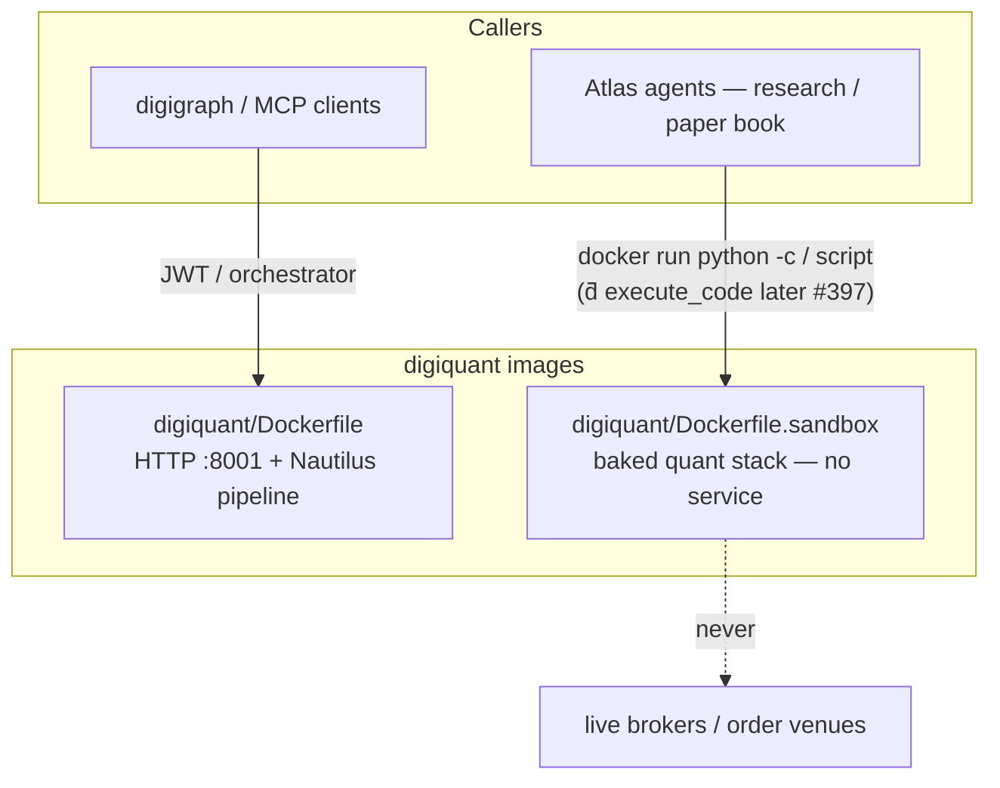
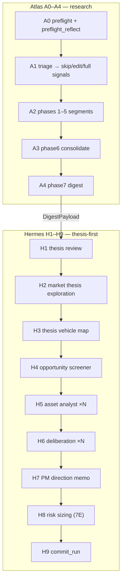
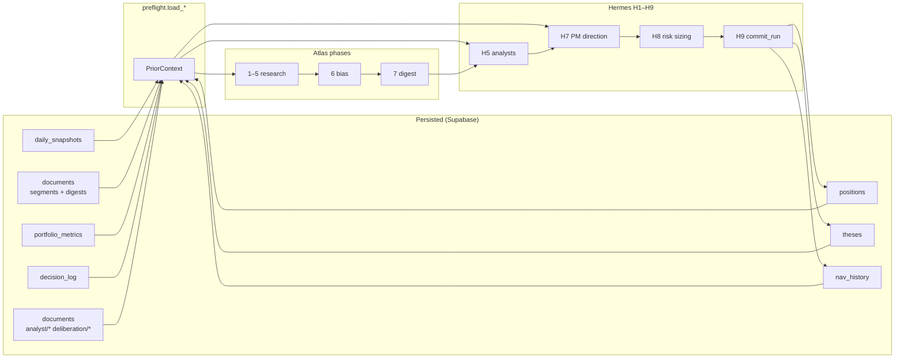

# digiquant Architecture

**Version:** 0.1.x
**Last updated:** 2026-08-27
**Audience:** Engineers, reviewers, and agents working on or integrating with digiquant.

---

## Table of Contents

1. [Overview](#1-overview)
2. [Current Implementation State](#2-current-implementation-state)
3. [API Surface](#3-api-surface)
4. [Data Model](#4-data-model)
5. [Internal Architecture](#5-internal-architecture)
6. [Security Analysis](#6-security-analysis)
7. [Scalability Analysis](#7-scalability-analysis)
8. [Performance Analysis](#8-performance-analysis)
9. [Integration Points](#9-integration-points)
10. [Docker and MCP Composition](#10-docker-and-mcp-composition)
11. [Phase 2+ Gaps and Roadmap](#11-phase-2-gaps-and-roadmap)
12. [Redesign Recommendations](#12-redesign-recommendations)

---

## 1. Overview

digiquant is the deterministic quant engine of the digithings stack. Its primary role is to own and execute the ordered pipeline: **validate → backtest → optimize → export**. No other service in the stack is permitted to make performance claims (Sharpe, PnL, trade count) without a result originating from this service.

digiquant operates as an internal vertical in the federated hub model. Typical callers are:

- **digigraph** (orchestration hub) — calls via HTTP orchestrator endpoints and dispatches tool invocations through `/v1/orchestrator_invoke`
- **MCP clients** (IDE, Claude Desktop, digiclaw) — attach directly via `streamable-http` or `stdio` transport on port 8767
- **Power users** — call HTTP endpoints directly or use the `digiquant` CLI
- **digiclaw** (heartbeat service) — polls `/check_drift` for ADDM-triggered re-optimization

### NautilusTrader Integration

NautilusTrader is the sole backtest and live-trade execution engine. Its key properties relevant to architecture:

- **Rust core** for the event loop, order book, and fill simulation — Python strategies attach via the Actor/MessageBus pattern
- **`BacktestEngine`** is the synchronous entrypoint; digiquant calls `engine.run()` in the current thread
- **Bar-driven** by default: OHLCV data is fed through `BarDataWrangler` and replayed bar-by-bar to the strategy's `on_bar()` callback
- **`TestInstrumentProvider.equity()`** is used for simulation instruments; no real market microstructure (no bid/ask spread, no partial fills) in the default configuration
- **Optional dependency**: installed via `digiquant[nautilus]`. The backtest entry point falls through to `None` if `nautilus_trader` is not importable.

The Polars-to-pandas boundary in `nautilus_runner.py` is a deliberate, documented exception to the "Polars only" rule. Nautilus's `BarDataWrangler.process()` requires a pandas DataFrame with a `timestamp` UTC index. All other data handling in digiquant (CSV loading, account report parsing, result assembly) uses Polars.

**Version pinning:** `nautilus_trader` is pinned to `>=1.190,<2` in `pyproject.toml`. The 2.x series introduced an async-first API surface with breaking changes to `BacktestEngine.run()` and the Actor registration model.

**Linux CI crash (SIGABRT / exit 134) — tracked in #42:**
`BacktestEngine.run()` registers C++-level SIGTERM/SIGINT handlers in its Rust runtime. On Linux, `uvicorn[standard]` installs `uvloop` and sets it as the global asyncio event loop policy, which also claims those POSIX signal handlers via libuv. When both runtimes attempt to own signal handling, a C-level assertion fires → SIGABRT. Mitigation: `tests/dq/conftest.py` resets the asyncio policy to `DefaultEventLoopPolicy` before the dq suite runs, preventing uvloop from conflicting with Nautilus's signal registration. The three integration tests that run a real `BacktestEngine` are skipped on Linux CI (`CI=true`) until the per-component test suite (#43) re-enables pytest and the fix is confirmed green on Ubuntu.

### Pipeline Ownership

digiquant owns the ordered quant workflow internally via a LangGraph `StateGraph` in `digiquant/src/digiquant/graph/pipeline.py`. This graph is not the same as digigraph's supervisor — it is a local, synchronous, domain-specific pipeline that ensures validate runs before backtest, backtest before optimize, and optimize before export. digigraph is the external orchestration hub that decides *when* to call digiquant, not *how* digiquant sequences its own steps.

---

## 2. Current Implementation State

### What Is Built

**6 registered strategies** in `digiquant/src/digiquant/strategies/`:

| Canonical Name | File | Type | Description |
|---|---|---|---|
| `ema_cross` | `ema_cross.py` | Nautilus wrapper | Fast/slow EMA crossover, long and short |
| `ema_cross_long` | `ema_cross_long.py` | Nautilus wrapper | EMA crossover, long-only |
| `ema_cross_trailing` | `ema_cross_trailing.py` | Nautilus wrapper | EMA crossover with ATR trailing stop |
| `rsi_momentum` | `rsi_momentum.py` | Custom Nautilus | RSI overbought/oversold momentum |
| `bollinger_mr` | `bollinger_mr.py` | Custom Nautilus | Bollinger Band mean reversion |
| `macd_trend` | `macd_trend.py` | Custom Nautilus | MACD signal-line crossover trend |

**Strategy aliases** (defined in `strategy_specs.py`):

| Alias | Resolves To |
|---|---|
| `ema`, `s`, `mean_reversion_tech`, `momentum_tech` | `ema_cross` |
| `mean_reversion_stat_arb` | `bollinger_mr` |
| `momentum_energy` | `rsi_momentum` |

**3 optimization engines** in `optimize.py` and `optimize_bayesian.py`:

| Method | Implementation | Parallelism |
|---|---|---|
| `grid` | Cartesian product via `infer_param_grid()` → `ProcessPoolExecutor` | `DIGIQUANT_OPTIMIZE_WORKERS` or `os.cpu_count()` |
| `random` | `sample_random_params()` → `ProcessPoolExecutor` | Same as grid |
| `bayesian` | Optuna `TPESampler` (`digiquant[optimize]`) | Sequential (Optuna's own trial loop) |

**5 export targets** in `export.py`:

| Target | Artifact | Status |
|---|---|---|
| `nautilus` | JSON config file | Written; no deployment |
| `nautilus_bundle` | ZIP with `manifest.json`, `params.json`, `README.txt` | `ema_cross` only |
| `tradingview` | JSON config file | Written; no Pine codegen |
| `alpaca` | JSON config file | Written; no broker wiring |
| `quantconnect` | JSON config file | Written; no QC deployment |

**Broker adapter stubs** in `digiquant/src/digiquant/brokers/stubs.py`:

All three adapters (`IBAdapterStub`, `AlpacaAdapterStub`, `QuantConnectAdapterStub`) raise `NotImplementedError` on every method. There is no credentials management, no OAuth flow, and no live order routing.

**Source file reference table:**

| File | Role |
|---|---|
| `server.py` | FastAPI app, all HTTP routes, rate limiting, correlation ID middleware |
| `service.py` | Shared service layer called by HTTP, CLI, and MCP |
| `graph/pipeline.py` | LangGraph pipeline: validate → backtest → optimize → export |
| `nautilus_runner.py` | NautilusTrader engine wiring, Polars↔pandas boundary |
| `backtest.py` | `run_backtest()` entrypoint, optional result caching |
| `optimize.py` | Grid/random optimization, `ProcessPoolExecutor` parallelism |
| `optimize_bayesian.py` | Optuna Bayesian optimization |
| `export.py` | Artifact writing with path confinement |
| `strategies/registry.py` | Strategy registration and lookup |
| `strategy_specs.py` | Param ranges, alias map, grid/random/Optuna space inference |
| `models.py` | Pydantic v2 result models |
| `constraints.py` | `satisfies_constraints()` filter |
| `addm.py` | Rolling Sharpe Z-score drift detection |
| `audit.py` | Thin `audit_log` → `digibase.audit.emit_event` |
| `mcp_server.py` | FastMCP server wrapping `service.py` |
| `orchestrator_tools.py` | OpenAI-style tool manifest for digigraph |
| `brokers/stubs.py` | IB, Alpaca, QuantConnect stubs (all `NotImplementedError`) |
| `tradingview.py` | PyneCore stubs (not implemented) |
| `data/loader.py` | Polars OHLCV CSV loading and synthetic data generation |
| `tearsheet.py` | Plotly HTML tearsheet generation (`digiquant[visualization]`) |
| `tearsheet_data.py` | Unified `TearsheetData` schema + `from_pine`/`from_nautilus` adapters; emits the JSON consumed by the React strategy-tearsheet library (`frontend/digiquant-web` `/strategies` routes on digiquant.io) |
| `sweep.py` | Grid sweep loop (not VectorBT fast path) |
| `cli/` | `digiquant backtest | optimize | export | strategy | prices | policy-replay` CLI |

---

## 3. API Surface

### REST Endpoints

All endpoints bind on `127.0.0.1:8001` by default. Auth is enforced by `DigiAuthMiddleware` from `digikey.integrations`. The `/health` endpoint is public; all others require a valid digikey JWT with the appropriate scope.

#### Synchronous endpoints

| Method | Path | Auth Scope | Description |
|---|---|---|---|
| `GET` | `/health` | None | Legacy health check; returns `{"status": "ok", "service": "digiquant"}` (back-compat; prefer `/healthz`) |
| `GET` | `/healthz` | None | Liveness probe; returns `{"ok": true}` (auth-exempt, rate-limit-exempt; see AGENTS.md "Liveness vs status") |
| `GET` | `/strategies` | `digiquant:backtest` | List registered strategies (name, aliases, description, default_params) |
| `GET` | `/check_drift` | `digiquant:backtest` | ADDM drift check for a strategy; query params: `strategy_id`, `baseline_run_id` |
| `POST` | `/run_backtest` | `digiquant:backtest` | Synchronous NautilusTrader backtest; returns `BacktestResult` |
| `POST` | `/run_optimize` | `digiquant:optimize` | Parameter optimization (grid/bayesian/random); returns `OptimizeResult` |
| `POST` | `/run_export` | `digiquant:backtest` | Export strategy config to artifact; returns `ExportResult` |
| `POST` | `/run_pipeline` | `digiquant:backtest` + `digiquant:optimize` | Full pipeline via internal LangGraph; returns `{trace, backtest, optimize, export}` |
| `POST` | `/v1/workflow` | `digiquant:backtest` + `digiquant:optimize` | Versioned alias for `/run_pipeline` |

#### Async job endpoints

| Method | Path | Auth Scope | Description |
|---|---|---|---|
| `POST` | `/backtest/start` | `digiquant:backtest` | Submit async backtest; returns `{"job_id": "..."}` |
| `POST` | `/v1/jobs/backtest` | `digiquant:backtest` | Versioned alias for `/backtest/start` |
| `GET` | `/backtest/{job_id}/progress` | `digiquant:backtest` | SSE stream: `start`, `heartbeat`, `done`, `error` events |
| `GET` | `/backtest/{job_id}/result` | `digiquant:backtest` | Final `BacktestResult` (202 if still running) |
| `GET` | `/v1/jobs/{job_id}/status` | `digiquant:backtest` | Job lifecycle: `running` | `completed` | `failed` |

#### Orchestrator endpoints (digigraph hub dispatch)

| Method | Path | Auth Scope | Description |
|---|---|---|---|
| `POST` | `/v1/orchestrator_tools` | `digiquant:backtest` | Return OpenAI-style tool manifest (11 tools: 6 digiquant + 5 olympus policy-replay) |
| `POST` | `/v1/orchestrator_invoke` | `digiquant:backtest` + `digiquant:optimize` | Dispatch named tool by `tool` field in request body |

#### Olympus policy replay endpoints (#3011 / WP16.9)

Recommendation/read surfaces for offline policy replay evidence. Summaries and
artifact IDs only — no confidential fills/holdings/nav dumps. Running and
evaluating never activate production policy. Default path scope remains
`digiquant:backtest` (no digikey edits).

| Method | Path | Description |
|---|---|---|
| `POST` | `/v1/olympus/policy_replay/run` | Register a replay run against a stored pair |
| `GET` | `/v1/olympus/policy_replay/{run_id}` | Replay-run summary (fail closed) |
| `GET` | `/v1/olympus/policy_comparison/{comparison_id}` | Comparison summary (IDs/status only) |
| `POST` | `/v1/olympus/policy_gate/evaluate` | Evaluate immutable gate criteria (eligibility only) |
| `GET` | `/v1/olympus/policy_gate/evaluations/{evaluation_id}` | Gate-evaluation summary |
| `POST` | `/v1/olympus/policy_governance_decisions` | Authenticated human decision write (`request.state.digi_auth` → `AuthenticatedPrincipal`) — **not** on MCP |

### Rate Limits

Implemented as per-IP sliding window using an in-memory `deque` behind a `threading.Lock`. Override at runtime with `DIGI_DISABLE_RATE_LIMIT=1`.

| Path | Limit |
|---|---|
| `/run_backtest` | 10 requests / 60 s |
| `/run_optimize` | 10 requests / 60 s |
| `/run_pipeline` | 10 requests / 60 s |
| `/v1/workflow` | 10 requests / 60 s |
| `/v1/jobs/backtest` | 10 requests / 60 s |
| `/v1/orchestrator_tools` | 30 requests / 60 s |
| `/v1/orchestrator_invoke` | 10 requests / 60 s |
| All other paths | 30 requests / 60 s |
| `/health` | Unlimited |

### MCP Tools

The MCP server (`mcp_server.py`) listens on `127.0.0.1:8767` by default with `streamable-http` transport. Stdio transport is available via `--stdio` for Claude Desktop. All tools delegate to `service.py`.

| Tool Name | Description |
|---|---|
| `digiquant_list_strategies` | Returns JSON array of registered strategies |
| `digiquant_run_backtest` | Runs Nautilus backtest; `symbols_json` is a JSON array string |
| `digiquant_run_optimize` | Runs parameter optimization (grid/bayesian/random) |
| `digiquant_export` | Exports strategy config to a target artifact |
| `digiquant_run_pipeline` | Runs the full LangGraph pipeline |
| `digiquant_fetch_coinbase_ohlcv` | Fetches daily OHLCV from Coinbase (CCXT) into the price-history cache |
| `digiquant_fit_btc_power_law` | Fits the SDCA BTC power-law (RAQQR) valuation rails from cached daily price history (`data/prices/history_cache.py`, not a bespoke fetch) and persists the coefficients to `strategies/sdca/btc_power_law_coefficients.json` (#1082) |
| `digiquant_build_sdca_risk_index` | Builds the SDCA `date`/`risk` parquet from a `RiskModel` + cached daily prices (`history_cache.py`, never a bespoke fetch) and writes it for `SdcaStrategy.risk_path` (#3168). `risk_model` is a string selector (`btc_power_law` today; #3175 adds providers). Returns `{path, row_count, date_start, date_end, null_risk_days}` or `{"error": ...}` |
| `digiquant_generate_slapper_tearsheet` | Runs the NautilusTrader backtest for the Slapper family and writes TV-style tearsheet JSON to the digiquant.io frontend. Delegates each strategy to `generate_tearsheets.run_strategy_isolated` (spawn-per-strategy, #1389 — a second in-process engine would SIGABRT the long-lived server); resolves calibrations file → Supabase (example only via `allow_example_calibrations`), accepts `signal_delay_days` (#1462), and returns `{"entries", "failures"}` with per-strategy errors as data. Does **not** write `index.json` (the CLI `main()` owns that) |
| `digiquant_validate_slapper_vs_tradingview` | Trade-level parity check of a Slapper strategy against a TradingView "List of Trades" CSV export |
| `olympus_run_policy_replay` | Register a policy replay run (summary IDs only; never activates) |
| `olympus_get_policy_replay` | Fetch a replay-run summary by `run_id` (fail closed) |
| `olympus_get_policy_comparison` | Fetch a comparison summary (artifact IDs / status only) |
| `olympus_evaluate_policy_gate` | Evaluate immutable gate criteria (eligibility only) |
| `olympus_get_policy_gate_evaluation` | Fetch a gate-evaluation summary by `evaluation_id` |

Human decision write (`record_policy_governance_decision`) is **not** an MCP tool —
only the DigiAuth HTTP boundary may record decisions. There is no
promote/activate/set-live/rollback-live tool on any surface.

The `digiquant_pipeline_delegate` tool is a second name in the orchestrator manifest (same function), used by digigraph's hub dispatch to alias the pipeline call.

### CLI (`python -m digiquant` / `digiquant`)

Top-level click group in `cli/__init__.py`. Subgroups live under `cli/` (or olympus for policy-replay). Pipeline commands call the same functions as HTTP/MCP via `service.py` where applicable.

| Command | Implementation | Notes |
|---|---|---|
| `backtest` / `optimize` / `export` | `cli/__init__.py` | Direct `run_*` entrypoints (same as HTTP handlers) |
| `strategy list` | `cli/strategy.py` → `service_list_strategies` | JSON; twin of MCP `digiquant_list_strategies` / `GET /strategies` (#160) |
| `strategy search <query>` | `cli/strategy.py` | Case-insensitive filter on name, aliases, description |
| `prices …` | `cli/prices.py` | OHLCV / technicals / macro cron surface |
| `policy-replay …` | `olympus/replay/cli.py` | Read-only governance summaries |

Still open from #160 AC: dedicated `indicator list` / `indicator compute` (closest today: `prices compute-technicals`; MCP indicator tools tracked in #152).

#### Slapper tearsheet pipeline

The BTC/ETH/SOL Slapper tearsheets published on digiquant.io are produced end-to-end by digiquant's own pipeline:

1. **Price** — `scripts/fetch_coinbase.py` pulls daily Coinbase OHLCV (CCXT) into `data/price-history/<TICKER>.csv` (matches TradingView's Coinbase series).
2. **Backtest** — `scripts/generate_tearsheets.py` runs each strategy through the NautilusTrader engine, extracts round-trip trades from the positions report, and builds a TradingView-style percent-of-equity compounding equity curve + All/Long/Short stats, emitting `TearsheetData` JSON (`tearsheet_data.from_nautilus_run`) into `frontend/digiquant-web/public/strategies/`. Each strategy's backtest runs in its **own spawned process** (#1389): NautilusTrader's Rust logging can only initialize once per process (`log::set_boxed_logger`), so a second in-process `BacktestEngine` aborts the interpreter with a logger re-init panic (SIGABRT). Isolation also contains any engine crash to its strategy — the script collects per-strategy success/failure, prints an OK/FAILED summary line per strategy, and exits non-zero if **any** strategy failed. On a partial failure, `index.json` keeps the prior entry for each failed strategy (so digiquant.io does not lose a live strategy card); a fully successful full run rewrites `index.json` as before.
3. **Validation** — `scripts/validation/pine_backtest.py` is a Pine-faithful replica of TradingView's fill model used as a parity oracle; `scripts/validation/compare_tv.py` matches our entries to a TradingView export (entry date + direction, broken down by signal family).

Structural settings (symbol, capital, sizing, 2018 trade window, precision) live in the **public** `strategies/settings.json`; proprietary indicator calibrations live in the **gitignored** `strategies/calibrations.json` (shape shown in `calibrations.example.json`). The `SlapperConfig.trade_start` gate mirrors Pine's `in_date_range` so warmup uses earlier bars while reported trades match the TradingView window.

**Tearsheet schema 1.1** (`tearsheet_data.SCHEMA_VERSION`) adds two back-compatible fields the renderer can opt into:

- `ohlc_bars: list[OHLCBar]` (`{t,o,h,l,c}`) — full-history candlesticks for the price chart. Note this spans the **entire** price series, while `equity_curve`/`trades` are scoped to the `trade_start` window — the renderer must not assume a shared x-axis. Defaults to `[]`; absent on 1.0 fixtures and on adapter paths with no bars.
- Per-trade signal type carried in `TradeRecord.entry_label` on the Nautilus path. `SlapperStrategy` records each entry's signal family in a metadata-only side-channel (`_signal_log`, keyed by `(entry_date, direction)`) — pure metadata, never fed back into a trade decision. `generate_tearsheets._entry_label` joins it onto round-trip trades and maps to the Pine display taxonomy (`MR Long`/`Trend Long`/`MR&T Long`/`Reversal Long` + Short variants), matching `scripts/validation/pine_backtest.py`. A join miss falls back to `""`.

**Tearsheet schema 1.2** adds `signal_delay_days: int` (default `0`, back-compatible) — see the public signal delay below.

Existing published fixtures stay at older schema versions (no `ohlc_bars`, blank `entry_label`, no `signal_delay_days`) until regenerated, so consumers must tolerate all versions.

**Public signal delay (#1462).** The public tearsheets lag reality by **3 calendar days** ("backtested strategies running live — signals delayed 3 days") to protect strategy IP: on a single-asset long/flat strategy a current equity curve trivially leaks the live position. The mechanism is an **end-date shift, not redaction** — `generate_tearsheets.py --signal-delay-days N` truncates the OHLCV frame (`apply_signal_delay`, cutoff = newest cached bar minus N calendar days) *before* the backtest, so the entire tearsheet is generated as if run N days ago. Every artifact (equity curve, drawdown, trade log, open-position state, headline metrics, `period_end`) is self-consistent by construction; there is no per-field redaction logic to get wrong. The lag is declared honestly: the static JSON, the `index.json` entry, and the `strategy_tearsheets` metrics all carry `signal_delay_days`, and a payload note states the as-of date. `generated_at` stays the true generation timestamp (the delay is marketed openly, not hidden). Default is `0` (exact no-op) for internal/undelayed runs; the scheduled pipeline (`pipeline-digiquant-tearsheets.yml`) passes `--signal-delay-days 3`. Side effect: the `_PUBLISHED_BASELINE` drift warning compares exact trade counts, so a trade opened within the delay window can transiently warn — informational only. Tests: `tests/dq/test_tearsheet_signal_delay.py`.

**digiquant.io consumption** — the landing page, strategy library (`/strategies`), and tearsheet views read **live from Supabase `strategy_tearsheets`** at runtime (#1069): the client fetches the row via the shared anon browser client (`frontend/digiquant-web/lib/live/`), so a fresh nightly upsert updates the site with **no rebuild or redeploy**. The static-JSON artifacts under `public/strategies/` were removed. Build-time still needs the *route list* (`generateStaticParams` in `app/strategies/[id]/page.tsx` hardcodes the three Slapper slugs); the public env (`NEXT_PUBLIC_SUPABASE_URL` / `NEXT_PUBLIC_SUPABASE_ANON_KEY`) must be set in the Cloudflare Pages build for the client to light up.

Regenerate only when calibrations are available from **one** of:

1. **Local file** — `digiquant/src/digiquant/strategies/calibrations.json` (gitignored)
2. **Supabase** — `strategy_calibrations` table (service-role read; upload via `scripts/sync_strategy_calibrations.py`)

Without real calibrations, `SlapperStrategy` falls back to `calibrations.example.json` placeholder values and produces **wrong** trade counts (e.g. ~264 BTC trades instead of ~79). `generate_tearsheets.py` exits unless you pass `--allow-example-calibrations`.

**Daily pipeline (intended):**

```bash
python digiquant/scripts/fetch_coinbase.py --through-yesterday
python digiquant/scripts/generate_tearsheets.py --from-supabase --push-supabase --signal-delay-days 3
# No git commit — the DB is the delivery; the site reads strategy_tearsheets live.
```

`--from-supabase` loads fitted params from `strategy_calibrations`. `--push-supabase` upserts the **full tearsheet payload** into `strategy_tearsheets.metrics` — the complete `TearsheetData` (headline metrics, equity/drawdown curves, OHLC bars, trades) plus a derived `current_signal` (position / last signal date / last price) and the index extras (`label`/`kind`/`avg_trade_pct`) — and refreshes the normalized `strategy_signals` row. digiquant.io reads that one anon-readable row live, so updating it updates the site with no deploy. The scheduled job (`pipeline-digiquant-tearsheets.yml`) is the same three steps: fetch → generate `--push-supabase --signal-delay-days 3`, no repo write.

**One-time upload** (after optimizing in TradingView):

```bash
# Credentials: CORE_SUPABASE_* or legacy SUPABASE_URL + SUPABASE_SERVICE_KEY
# (Atlas local runs: digiquant/src/digiquant/atlas/config/.env)
cp /path/to/your/calibrations.json digiquant/src/digiquant/strategies/calibrations.json
python digiquant/scripts/sync_strategy_calibrations.py --verify
python digiquant/scripts/verify_strategy_calibrations_rls.py
```

The separate `pipeline-digiquant-prices.yml` job feeds **Supabase price_history**
for Atlas/Olympus and owns `position_events` writes at the market open; it does
**not** regenerate these public tearsheets. Two UTC crons cover New York daylight
and standard time. `market_open_gate.py` selects the season-correct cron and keeps
it valid after the open even when GitHub delivers it late, while rejecting the
wrong-season duplicate and pre-open execution.

Each `index.json` entry carries a `kind` slug (`long_short`, `long_only`, …) from `settings.json` for library filters as the catalog grows.

---

## 4. Data Model

### BacktestResult

Defined in `models.py`. Returned by `run_backtest()`, the pipeline's backtest node, and the async job endpoint.

| Field | Type | Description |
|---|---|---|
| `run_id` | `str` | `nautilus-{hex8}` or `multi-{hex8}` |
| `strategy_name` | `str` | Strategy label as provided |
| `symbols` | `list[str]` | Instruments used (uppercased) |
| `start_time` | `str` | ISO 8601 UTC, derived from first bar `ts_init` |
| `end_time` | `str` | ISO 8601 UTC, derived from last bar `ts_init` |
| `total_pnl` | `float` | `final_balance - 1_000_000.0` (hardcoded starting capital) |
| `total_return_pct` | `float` | `total_pnl / 1_000_000.0 * 100` |
| `sharpe_ratio` | `float | None` | Annualised (252 days) from Nautilus portfolio analyzer |
| `max_drawdown_pct` | `float | None` | Negative percent (e.g. `-15` is −15%), from `get_performance_stats_pnls()` or returns series fallback |
| `num_trades` | `int` | Row count of `generate_order_fills_report()` |
| `per_symbol_pnl` | `dict[str, float]` | Populated for multi-symbol runs; empty for single-symbol |
| `status` | `str` | `ok` | `partial` | `error` |
| `message` | `str` | Optional detail |

### OptimizationConstraints

Applied as a hard filter before scoring candidates. Any trial that fails these constraints is discarded; if all trials fail, `OptimizeResult.status` is `partial`.

| Field | Type | Meaning |
|---|---|---|
| `min_trades` | `int | None` | Minimum trade count |
| `max_drawdown_pct` | `float | None` | Negative percent (e.g. `-15` is −15%); compared directly with `BacktestResult.max_drawdown_pct` |
| `min_sharpe` | `float | None` | Minimum Sharpe ratio |
| `min_return_pct` | `float | None` | Minimum total return |
| `max_trades_per_year` | `float | None` | Activity cap |
| `min_trades_per_year` | `float | None` | Minimum activity |

### OptimizeResult

| Field | Type | Description |
|---|---|---|
| `run_id` | `str` | `optimize-{hex8}` |
| `strategy_name` | `str` | |
| `symbols` | `list[str]` | |
| `best_params` | `dict[str, float | int | str]` | Winning parameter set |
| `best_backtest` | `BacktestResult | None` | Backtest at best params (None if all trials failed) |
| `num_evaluations` | `int` | Total trials run (including failed/pruned) |
| `status` | `str` | `ok` | `partial` | `error` |
| `message` | `str` | |

### ExportResult

| Field | Type | Description |
|---|---|---|
| `run_id` | `str` | `export-{hex8}` |
| `target` | `str` | One of `SUPPORTED_TARGETS` |
| `strategy_name` | `str` | |
| `artifact_path` | `str | None` | Absolute path to written file/zip |
| `status` | `str` | `ok` | `partial` | `error` |
| `message` | `str` | Note on deployment status |

### QuantPipelineState (LangGraph)

The `TypedDict` passed through the internal LangGraph pipeline:

| Key | Type | Notes |
|---|---|---|
| `strategy_name` | `str` | Required |
| `symbols` | `list[str]` | Required |
| `data_path` | `str | None` | |
| `data_dir` | `str | None` | |
| `strategy_params` | `dict | None` | Initial params for baseline backtest |
| `constraints` | `OptimizationConstraints | None` | |
| `export_target` | `str` | Default `"nautilus"` |
| `run_optimize` | `bool` | Default `True` |
| `run_export` | `bool` | Default `True`; also gated by `DIGIQUANT_ALLOW_EXPORT` |
| `method` | `str` | `grid` | `bayesian` | `random` |
| `n_trials` | `int` | Default 50 |
| `backtest` | `BacktestResult | None` | Written by `node_backtest` |
| `optimize` | `OptimizeResult | None` | Written by `node_optimize` |
| `export` | `ExportResult | None` | Written by `node_export` |
| `error` | `str | None` | Set by any node on failure; gates all downstream nodes |
| `trace` | `list[dict]` | Annotated with `add` — nodes append step records |

---

## 5. Internal Architecture

### LangGraph Pipeline

The pipeline graph is compiled fresh on every `run_quant_workflow()` call (no reuse of a compiled instance). Each invocation is synchronous; the caller blocks until all nodes complete.

```
START
  |
  v
[validate] ─── error ──► END
  |
  v (ok)
[backtest] ─── error ──► END
  |
  ├── run_optimize=False, run_export=False ──► END
  ├── run_optimize=False, run_export=True ──► [export] ──► END
  └── run_optimize=True ──►
       |
       v
    [optimize] ─── error ──► END
       |
       ├── run_export=False ──► END
       └── run_export=True ──►
              |
              v
           [export] ──► END
```

Conditional routing is implemented in `route_after_validate`, `route_after_backtest`, and `route_after_optimize`. The `DIGIQUANT_ALLOW_EXPORT` env var provides a global kill switch for the export node independently of the request body's `run_export` flag.

The `trace` key uses LangGraph's `Annotated[list, add]` reducer so each node appends its step record without overwriting. Callers receive the full trace in the response, making the pipeline auditable step-by-step.

### NautilusTrader Actor/MessageBus Pattern

Each strategy in the registry is a `Strategy` subclass (which inherits from `Actor`). The lifecycle within a backtest is:

1. `BacktestEngine` is instantiated with venue, instrument, bars, and starting balance
2. `engine.add_strategy(strategy)` registers the strategy's message subscriptions
3. `engine.run()` drives the internal event loop: for each bar, the engine publishes a `Bar` event on the MessageBus; all subscribers with matching `BarType` receive it via `on_bar()`
4. Strategies call `self.submit_order()` which goes through the simulated venue for fill simulation
5. After `run()` completes, `engine.trader.generate_order_fills_report()` and `generate_account_report()` provide structured output
6. `engine.dispose()` frees internal resources

digiquant calls this pattern in `_build_engine()` in `nautilus_runner.py`. One engine instance is created per backtest run and disposed immediately after metric extraction. There is no engine reuse across runs.

**Default position sizing is instrument-aware.** The venue starts with `STARTING_BALANCE_USD` ($1M) cash. When a caller does not pass `trade_size`, `_build_engine()` derives one via `_default_trade_size()`: `floor(STARTING_BALANCE_USD * DEFAULT_NOTIONAL_FRACTION / first_bar_price)`, clamped to a minimum of 1 unit. This keeps per-trade notional at a fixed fraction (default 2%) of equity rather than a fixed unit count. A fixed count (the old `Decimal(1000)`) silently over-leveraged high-priced instruments — 1000 BTC units at ~$10k+ on a $1M account is 10–100x leverage, so Nautilus halted the whole run with `AccountBalanceNegative` after a handful of bars and returned a misleading 1-trade result. An explicit caller `trade_size` always overrides the default. Regression coverage: `tests/dq/test_default_trade_size.py`.

### Strategy Registry

`strategies/registry.py` maintains two module-level dicts: `_REGISTRY` (name → `StrategySpec`) and `_ALIASES` (alias → canonical name). Registration is done at import time in each strategy module via `register(...)`. The registry does not persist between processes; optimization workers (when `ProcessPoolExecutor` is used) import the strategy modules fresh in each subprocess.

`StrategySpec` holds:
- `strategy_cls`: the `Strategy` subclass
- `config_cls`: the `StrategyConfig` subclass
- `default_params`: default values merged with caller overrides
- `description`: human-readable summary

`get_strategy()` resolves aliases, looks up the spec, merges `default_params` with caller overrides and required fields (`instrument_id`, `bar_type`), instantiates `config_cls(**params)`, and returns `(strategy_instance, config)`.

### SDCA Engine (#1080, #1081)

`strategies/sdca/` is the generic, asset-agnostic Strategic-DCA engine: composite
risk score → accumulation/distribution curve → daily backtest vs. lump-sum
buy-&-hold. Reverse-engineered from the owner's BTC SDCA artifact but with the
BTC valuation model factored out — the core engine (`curve.py`,
`composite_risk.py`, `risk_model.py`, `valuation.py`, `backtest.py`) has **zero
NautilusTrader dependency and zero BTC-specific constants in its valuation
path**, unlike every other entry in the strategy table above.
`sdca/nautilus_strategy.py` (#1081) is the one file in the package that does
depend on NautilusTrader — it wraps the engine as `SdcaStrategyConfig`/
`SdcaStrategy`, following the same precompute-then-drive pattern as
`m2_liquidity.py`: a Polars DataFrame and a `RiskModel` cannot live in a frozen
`StrategyConfig` (msgspec struct), so the caller runs
`sdca/risk_index.py::build_risk_index()` (#3168) upstream (rails →
`valuation_z_score()` → `compute_composite_risk()`), writes the two-column
`date`/`risk` parquet with `write_risk_index()`, and passes its path in as
`risk_path`. The MCP tool `digiquant_build_sdca_risk_index` is that upstream
for cached price history; a notebook is no longer required. `on_start()` loads that
parquet into a `date -> risk` map (validating the `date`/`risk` columns are
present, rejecting duplicate dates, casting a `pl.Datetime` `date` column
to `pl.Date` — `iter_rows()` otherwise yields `datetime.datetime` keys that
never equal the `datetime.date` `on_bar()` looks up with; any other non-Date
dtype raises — rejecting any null `date` (would otherwise become an
unreachable `None` dict key), and requiring `risk` to be numeric and, where
non-null, finite: a string column loads without error and only fails later as
a `TypeError` inside `AccumDistCurve.value_at_risk()`, and NaN/±inf pass
`is_numeric()` but reach that same call as a non-finite float; a null `risk`
is kept as an explicit no-data day. `on_bar()` looks up the day's risk,
converts it to a trade rate via `AccumDistCurve.value_at_risk()`, and sizes
the trade via the shared `sdca/backtest.py::size_trade()` helper — both
`run_backtest()` and `on_bar()` call this one function, so live/backtest and
the standalone parity harness never diverge. `long_only=True` clamps the rate
to `>= 0` regardless of the curve's own sign, as a safety override independent
of which curve is configured. `on_bar()` skips sizing a new order while a
prior one is still open (`_order_pending`, cleared on
fill-complete/canceled/rejected/expired/denied), so two bars can never size
off the same unreserved cash/asset_units. Shadow `_cash`/`_asset_units` are
updated from real `OrderFilled` events (`on_order_filled()`), not the
pre-submission estimate, so they track Nautilus's actual quantity-quantized
execution state rather than drifting from it; a fill's `commission` is also
deducted from `_cash` when denominated in the instrument's quote currency —
a fee paid in a different currency (e.g. the base asset) is left untouched
rather than misapplied, since this shadow accounting has no conversion rate
for it.
Like `m2_liquidity`, **SDCA is not registered in `strategies/registry.py`** —
`risk_path` has no sensible static default (it's produced by a specific
upstream `RiskModel` run), so `SdcaStrategyConfig` must be instantiated
directly by the caller; the registry is for discovery only.

`strategies/sdca/presets.py` (backed by `presets.json`) ships named,
hand-authored `curve_nodes`/`long_only` personalities as public config —
`conservative_hold`, `balanced`, `aggressive_accumulate` (long-only,
increasingly aggressive accumulation) and `accumulate_and_distribute` (signed
curve, the BTC-reference `DEFAULT_BTC_NODES` shape). These are documented
personalities, not optimized/backtested-and-selected parameters — `list_presets()`
returns the available names and `load_preset(name)` returns an `SdcaPreset`
(frozen Pydantic v2 model: `curve_nodes`, `long_only`, `description`). To add a
preset: append an entry to `presets.json` with a 21-element `curve_nodes` array
(matches `RISK_NODES`), `long_only`, and a `description`; `SdcaPreset` validates
both the node count and, if `long_only` is `true`, that every node is `>= 0` at
load time (`field_validator`/`model_validator`), not just in
`tests/dq/strategies/sdca/test_presets.py`.

**This module is a CI-only parity harness, not a second backtest engine.**
`digiquant/AGENTS.md` is explicit that NautilusTrader is the sole backtest and
live-trade engine and that PnL/Sharpe/drawdown must never be returned from
anywhere but a completed `BacktestResult`/`OptimizeResult`. `run_backtest()`
here does not violate that: it exists only so the allocation math (curve,
composite-risk, valuation) can be unit-tested deterministically against known
reference numbers in milliseconds, without a data fetch or Nautilus's actor/bar
infrastructure — see the issue #1080 acceptance criteria (`pytest -m unit -k
sdca`, parity fixture). Its `SdcaBacktestReport` must never be surfaced to
users or dashboards as an actual backtest result. **`nautilus_strategy.py`
(#1081) calls `AccumDistCurve.value_at_risk()` and `size_trade()` directly
rather than reimplementing them** — that is what keeps this module and the
real Nautilus backtest from silently
diverging into two sources of truth for the same allocation decision.
`build_risk_index()` / `write_risk_index()` (`sdca/risk_index.py`, #3168)
are the caller's upstream of `SdcaStrategy` (to build the `risk_path`
parquet), the same way `m2_liquidity`'s own signal computation happens outside
its `Strategy` class. The MCP tool `digiquant_build_sdca_risk_index` is that
upstream for cached price history.

| File | Role |
|---|---|
| `sdca/valuation.py` | `valuation_z_score(price, low, median, high)` — log-space position of price within the `RiskModel` rails, in `[-3, 3]` (cheap = +3, rich = −3). The default/primary indicator. Validates finite, positive rails with `low < median < high` on rows where all four inputs are present; a row with any null input passes through as null. |
| `sdca/risk_model.py` | `RiskModel` — a `runtime_checkable` `Protocol` with one method, `rails(dates) -> pl.DataFrame` (`low`/`median`/`high` columns). Any object with a matching `rails()` satisfies it structurally; the engine never imports a concrete provider. |
| `sdca/btc_power_law.py` | `BtcPowerLawRiskModel` — the first concrete `RiskModel` (#1082): fits 7 quantile rails (`q01`…`q99`) as `price_q(t) = 10 ** (c + a*x + b*x**2)`, `x = ln(days_since_genesis(t)) - mu`, one quantile regression (`statsmodels.QuantReg`, lazily imported) per rail. `rails()`/`rails_full()` sort each row's fitted quantiles ascending (rearrangement method) so independently-fit curves never cross. `fit_btc_power_law()`/`save_coefficients()`/`load_coefficients()` handle fitting and JSON persistence; `load_coefficients()` prefers the real fit (`btc_power_law_coefficients.json`, git-ignored) and falls back to the checked-in synthetic placeholder (`btc_power_law_coefficients.example.json`) with a warning. The `digiquant_fit_btc_power_law` MCP tool is the orchestration layer — this module has no data-fetching or MCP dependency of its own. `low_quantile`/`high_quantile` (default `q10`/`q95`) pick which fitted rails map to the protocol's `low`/`high`; this default and the model itself are unvalidated against the reference artifact — network access to it was blocked in the environment #1082 was built in. |
| `sdca/composite_risk.py` | `IndicatorWeight` (strict Pydantic v2 model: `name`, `z: pl.Series`, `weight`, `enabled`) and `compute_composite_risk()` — weight-normalized blend of enabled indicators' z-scores into `composite_z` (`[-3, 3]`) and `risk` (`[0, 100]`, 0 = max buy, 100 = max sell). Rejects duplicate enabled indicator names and a non-finite/zero total weight. Mirrors the equal-weighted vote pattern in `indicators/m2_signals.py`. |
| `sdca/curve.py` | `AccumDistCurve` — 21-node (risk 0, 5, …, 100) piecewise-linear map from risk to a daily trade rate (%). `value_at_risk()` interpolates and clamps to `[0, 100]`, rejecting non-finite risk. Nodes are fully configurable and must be finite: all-positive = long-only accumulation, signed = accumulation + distribution. The no-arg default (`DEFAULT_BTC_NODES`) is the issue's documented BTC-reference curve shape, not a hardcoded valuation constant — callers targeting another asset pass their own `nodes`. |
| `sdca/backtest.py` | `run_backtest(dates, price, risk, curve, initial_cash) -> (SdcaBacktestReport, pl.DataFrame)` — the daily state loop and its strict Pydantic v2 summary report. Validates non-empty, equal-length inputs; a non-null, strictly-increasing `dates` series (#2539, #2544); and a finite, positive, non-null price series and `initial_cash` before running. |
| `sdca/risk_index.py` | `build_risk_index(dates, price, risk_model, extra_indicators=None, valuation_weight=1.0) -> pl.DataFrame` and `write_risk_index(df, path)` (#3168). Pure wiring: `risk_model.rails()` → `valuation_z_score()` → `IndicatorWeight(name="valuation")` + extras → `compute_composite_risk()`. Returns `date`/`risk` plus diagnostics (`price`, `low`, `median`, `high`, `valuation_z`, `composite_z`). `write_risk_index()` persists the two-column parquet under every validation `SdcaStrategy._load_risk_index()` already enforces (Date dtype, numeric finite-or-null risk, no null/duplicate dates). `RiskIndexBuildResult` is the Pydantic v2 JSON envelope the MCP tool returns. |
| `sdca/nautilus_strategy.py` | `SdcaStrategyConfig` (frozen `StrategyConfig`: `instrument_id`, `bar_type`, `initial_cash`, `risk_path`, `curve_nodes` default `DEFAULT_BTC_NODES`, `long_only` default `False`) and `SdcaStrategy(Strategy)` — the NautilusTrader wrapper (#1081). Not registered in `strategies/registry.py` (see above). `risk_path` is produced by `sdca/risk_index.py` (#3168), not assembled by hand. |
| `sdca/presets.py` / `sdca/presets.json` | `SdcaPreset` (frozen Pydantic v2 model: `curve_nodes`, `long_only`, `description`, validated at load time), `list_presets() -> list[str]`, `load_preset(name) -> SdcaPreset` — named public curve personalities for `SdcaStrategyConfig` (#1081). |

**Composite-risk null rule.** If any *enabled* indicator's z-score is null on a
day, `composite_z` and `risk` are null that day too — `compute_composite_risk`
uses `pl.sum_horizontal(..., ignore_nulls=False)` so there is never a partial
blend. `run_backtest` treats a null-risk day as a no-trade day: state (cash,
holdings) carries forward unchanged, but the day is still marked to market.

**Backtest state is a sequential Python loop, not a vectorized Polars
expression** — `cash`/`asset_units` are running balances that each day's buy/sell
depends on, which Polars' columnar model doesn't express cleanly. Inputs
(`dates`, `price`, `risk`) and the per-day export frame are Polars per the
Polars-only convention; only the intermediate accumulator is plain Python. This
mirrors how `nautilus_strategy.py`'s `SdcaStrategy.on_bar()` (#1081) also
processes bars one at a time, driven by real Nautilus bar events rather than a
Python `for` loop.

Per-day export frame columns (`asset_units` rather than the issue's literal
`btc_units` pseudocode name, to match the module's asset-agnostic design):
`date`, `price`, `risk`, `rate`, `daily_trade_usd` (signed: positive = bought,
negative = sold), `cash`, `asset_units`, `net_deployed` (`initial_cash - cash`),
`portfolio_value` (`cash + asset_units * price`), `buy_hold_value` (the
lump-sum benchmark: all
`initial_cash` deployed at day-0 price, marked to market thereafter).
`SdcaBacktestReport` adds `total_pnl`, `vs_lump_usd`, and four fields whose shared
`_pct` suffix spans **two unit systems**: `total_return_pct` and `vs_lump_pct` are
true percents (×100 at `backtest.py:162,164`, so `-15.0` means −15%), while
`dca_max_drawdown_pct` / `buy_hold_max_drawdown_pct` are negative *fractions*
(`-0.15` for a 15% drawdown — `_max_drawdown_pct` applies no ×100). The drawdown
pair is therefore **not** interchangeable with `BacktestResult.max_drawdown_pct`,
which is a negative percent — check each field's own docstring before comparing them. Also
`buy_days`/`sell_days`/`no_trade_days`, and `avg_risk`/`avg_rate` (means over
non-null days only).

### Optimization Engine Selection

The dispatch in `run_optimize()`:

1. If `param_grid` is provided explicitly, skip method inference and run that grid directly
2. If `method == "bayesian"`, delegate to `run_optimize_bayesian()` (Optuna)
3. If `method == "random"`, call `sample_random_params()` then `_run_trials_parallel()`
4. Otherwise (grid default), call `infer_param_grid()` then `_run_trials_parallel()`

`infer_param_grid()` reads from `STRATEGY_PARAM_SPECS` in `strategy_specs.py`, which can be extended at runtime via a YAML file pointed to by `DIGIQUANT_STRATEGY_SPECS_PATH`. A hard cap of `MAX_GRID_SIZE = 10_000` prevents combinatorial explosion.

`_run_trials_parallel()` uses `ProcessPoolExecutor` for grid and random methods. It falls back to sequential execution if the executor raises (common on macOS due to `spawn` context restrictions). When `max_workers=1`, the parallel path is skipped and execution is sequential.

### Audit JSONL Flow

`digiquant.audit.audit_log` is a thin wrapper over `digibase.audit.emit_event`
(CHR-151 / #1193). The digibase emitter appends one JSON line per event to
`AUDIT_LOG_PATH` (default: `digiquant/results/audit/events.jsonl`). Each event
matches the Pydantic `AuditEvent` schema: `ts`, `event_type`, `agent_id`,
`payload`, and optional `key_prefix`, `tenant`, `project_id`, `jti`, `path`.

Before writing, `emit_event` redacts any payload key containing `password`,
`api_key`, `token`, or `secret` (case-insensitive substring match, recursive into
nested dicts/lists). The file is opened in append mode on every call; there is
no buffering or rotation mechanism.

Audit events are written explicitly in `server.py` after `run_backtest`,
`run_optimize`, pipeline, and `v1_workflow`. The `run_export` synchronous
endpoint does not write an audit event.

---

## 6. Security Analysis

### digikey JWT Scopes

Access control is enforced by `DigiAuthMiddleware` from `digikey.integrations.service_middleware`. Scope requirements per path, as defined in `digiquant_path_scopes()`:

| Scope | Required For |
|---|---|
| `digiquant:backtest` | `/run_backtest`, `/run_export`, `/backtest/start`, `/backtest/*`, `/v1/jobs/*`, `/v1/orchestrator_tools`, `/strategies` |
| `digiquant:optimize` | `/run_optimize` |
| `digiquant:backtest` + `digiquant:optimize` | `/run_pipeline`, `/v1/workflow`, `/v1/orchestrator_invoke` |
| None (public) | `/health`, `/docs`, `/redoc`, `/openapi.json` |

When digikey is not configured or `DIGI_API_KEY` is not set, the middleware may fall through to unauthenticated access depending on the middleware implementation. Production deployments must set digikey JWKS URL and audience.

### Strategy Sandboxing Gap

This is a significant security concern. The strategy registry resolves and instantiates strategy classes at backtest time within the HTTP server process. While the default strategies are repo-controlled and safe, the architecture has no isolation barrier. A future feature allowing user-supplied or tenant-provided strategy code would execute with full access to the server process, file system, and network. The export path confinement (`_validate_export_dir()`) and the `data_dir` path traversal check in `nautilus_runner.py` (`.is_relative_to()` guard) are the only sandbox-like controls in place. These protect artifacts and data access, not strategy execution.

The grid/random optimization path uses `ProcessPoolExecutor`, which does provide subprocess isolation as a side effect, but this is not a security boundary — the worker processes inherit the same environment and credentials as the parent.

### Broker Adapter Auth Management

All three broker adapters are stubs with no implementation. There is no credentials management, no token storage, no OAuth flows, and no secrets handling for any broker. When these are implemented, credentials will need to be injected via environment variables or a secrets manager, not hard-coded in config files or logged in audit events (the audit redaction pattern provides a foundation for this).

### CORS Wildcard Risk

CORS is configured via the shared `digibase.cors.install_cors(app, service="digiquant")` helper. The allowlist is read from `DIGIQUANT_CORS_ORIGINS` → `DIGI_CORS_ORIGINS` → legacy `DIGI_ALLOWED_ORIGINS`, defaulting to **empty** (most restrictive). Methods and headers are restricted to `GET/POST/PUT/DELETE/OPTIONS` and `Authorization/Content-Type/X-Request-ID` respectively. See `SECURITY.md` §"CORS policy".

### Audit Log Secret Redaction

`digibase.audit.emit_event` (via `redact_mapping`) redacts payload keys
containing `password`, `api_key`, `token`, or `secret`. This is a substring
match, so it catches variations like `api_key_prefix` or `access_token`, and it
recurses into nested dicts and lists. Secrets can still leak through
non-obvious keys (e.g., `bearer`, `credential`, `auth`) or values under safe
key names. The default redaction list is hardcoded; callers may pass an
extended `redact=` tuple.

The audit JSONL file is world-readable if default filesystem permissions apply.
In Docker, the file is mounted at `./digiquant/results/audit` and shared with
the digigraph and digiclaw containers. Access controls on this directory should
be reviewed.

---

## 7. Scalability Analysis

### In-Memory Rate Limiting (Single-Node Limitation)

The rate limiter uses a module-level `dict` of `deque` objects keyed by client IP, protected by a single `threading.Lock`. This state is not shared across processes. In a multi-worker deployment (e.g., Gunicorn with multiple workers, or Kubernetes with multiple replicas), each worker maintains its own independent rate limit window. A client can send `10 * num_workers` requests per minute before hitting any limit. The limiter is suitable for single-node Docker Compose; it must be replaced before horizontal scaling.

### NautilusTrader Single-Threaded Event Loop

`engine.run()` is synchronous and single-threaded. One backtest consumes one CPU core for its duration. The HTTP server's synchronous route handlers (`def`, not `async def`) for `/run_backtest` and `/run_optimize` block the FastAPI thread pool. Under concurrent load, backtest requests queue in the thread pool. The async job pattern (`/backtest/start` → background thread → SSE) correctly offloads this to a daemon thread, but the thread still consumes a core while running. A 10M-row backtest targeting < 2s occupies that core for the full 2s per concurrent caller.

### Optimization Parallelism

Grid and random methods use `ProcessPoolExecutor` with `DIGIQUANT_OPTIMIZE_WORKERS` workers (default: `os.cpu_count()`). Each worker runs a full Nautilus backtest. A 50-trial grid on a 4-core machine can run ~4 backtests in parallel. On macOS with `spawn` context, the executor may silently fall back to sequential execution. For Bayesian (Optuna), trials are sequential by default; Optuna supports a multi-process study via a shared RDB backend, but this is not configured.

`_run_trials_parallel()` has a fallback path that catches all exceptions and retries sequentially. This means a silent executor failure during optimization will produce correct results but at sequential speed with no user-visible warning beyond a log entry.

### Long-Running Backtest vs HTTP Timeout

The synchronous `/run_backtest` endpoint has no server-side timeout. A large dataset or a complex strategy can hold the connection indefinitely. Upstream proxies (nginx, load balancers) typically impose 30–120s timeouts. The async job pattern addresses this for callers that use `/backtest/start` + SSE, but the synchronous path remains exposed. The orchestrator invoke handler that calls `service_run_backtest` directly is also synchronous and unbounded.

### No Persistent Strategy Versioning

Strategy registrations are ephemeral — they exist only in the process memory of the running server. There is no database of strategy versions, no immutable record of which strategy code produced a given `run_id`. A `run_id` in the audit log cannot be reproduced without the same code commit, same data, and same parameters. The audit log records `strategy_name` and `symbols`, not the strategy source hash or a code version.

The in-process backtest job table (`_backtest_jobs`) has a documented 5-minute TTL but no active cleanup task. Jobs accumulate until the process restarts.

The digiquant strategy store (#1064; see [§ digiquant Data Layer](#digiquant-data-layer--strategy-store--shared-data-1064)) now provides the durable substrate for per-strategy config, fitted calibration, trades, tearsheets, and live signals. Wiring `service_run_backtest` / the Slapper recompute job to persist canonical run records there (strategy git sha, params hash, data fingerprint) is the remaining step toward reproducible `run_id`s — tracked by #1067/#1068.

---

## 8. Performance Analysis

### Polars for OHLCV Ingestion

`data/loader.py` uses Polars for all CSV loading. The standard column contract is `timestamp, open, high, low, close, volume, symbol`. Bar period is inferred from median timestamp delta using Polars operations (`.dt.total_microseconds().median()`), not Python loops. The result DataFrame is held in memory for the duration of the backtest.

The Polars-to-pandas conversion in `_prepare_bar_data()` is a full materialization (`.to_pandas()` with `.astype("float64")`). For 10M rows with 5 OHLCV columns, this is approximately 400 MB as a pandas DataFrame. Nautilus's `BarDataWrangler.process()` converts this into a list of `Bar` objects; the memory footprint roughly doubles during this phase before the pandas DataFrame can be garbage collected.

### NautilusTrader Rust Core Performance

Nautilus's event loop, order matching, and fill simulation run in Rust via Cython bindings. The Python-visible overhead is `on_bar()` callback dispatch. For strategies with simple indicator lookups (`self.fast_ema.value`), the per-bar Python cost is dominated by the function call overhead. The 10M-row / 2s target is achievable for simple strategies on modern hardware; complex strategies with many Python operations per bar may exceed this.

### Optuna Bayesian Optimization Convergence

The Bayesian optimizer uses Optuna's default `TPESampler`. For strategies with 2–3 parameters, TPE typically converges meaningfully within 30–50 trials. The default `n_trials=50` is appropriate for the built-in strategies. For strategies with 5+ parameters or correlated search spaces, convergence requires more trials and the single-objective formulation may miss Pareto-optimal trade-offs (e.g., high Sharpe with low drawdown). Pruned trials (constraint violations or `None` Sharpe) count against `n_trials`, effectively reducing useful evaluations.

The Bayesian path runs one final `run_backtest()` with the best parameters after `study.optimize()` completes, adding one additional full backtest to the total wall time.

### Backtest < 2s for 10M Rows Target

The target applies to the NautilusTrader event loop itself. Total wall time for a backtest request also includes: CSV loading and Polars processing (~50–200ms for 10M rows), pandas conversion (~200–400ms), `BarDataWrangler.process()` (~200–500ms), Nautilus `engine.run()` (< 2s target), and metric extraction from the analyzer. End-to-end HTTP latency for a 10M-row backtest is therefore likely 3–5s even if the Nautilus target is met.

### Export Format Generation Overhead

JSON export is near-instant (file write of a small JSON object). The `nautilus_bundle` ZIP uses `zipfile.ZipFile` with `ZIP_DEFLATED` compression on a small in-memory buffer; overhead is negligible. Tearsheet generation (Plotly) is the most expensive export-adjacent operation and runs only when `tearsheet_path` is explicitly provided.

---

## 9. Integration Points

### Orchestrator Tools Contract with digigraph

digigraph discovers digiquant's capabilities via `POST /v1/orchestrator_tools`, which returns an OpenAI function-calling compatible manifest of 11 tools (6 digiquant pipeline + 5 olympus policy-replay). digigraph then dispatches tool calls via `POST /v1/orchestrator_invoke` with `{"tool": "<name>", "arguments": {...}}` (digiquant_* or olympus_*).

The manifest is built by `build_orchestrator_tool_manifest()` in `orchestrator_tools.py`. It is static (not dynamically generated from Pydantic schemas), which creates a risk of schema drift if `BacktestRequest` or `PipelineRequest` evolves without a corresponding update to the manifest.

The `_normalize_symbols()` helper in `server.py` normalizes symbols in `v1_orchestrator_invoke` (uppercase, strip whitespace, filter empty) to prevent common LLM formatting artifacts from causing validation failures.

### digikey Auth Middleware

`DigiAuthMiddleware` from `digikey.integrations.service_middleware` is mounted as an ASGI middleware before route handlers. It validates JWT Bearer tokens against the digikey JWKS endpoint (`DIGIKEY_JWKS_URL`), checks issuer (`DIGIKEY_ISSUER`), audience (`DIGIKEY_AUDIENCE`), and required scopes via `digiquant_path_scopes()`. When digikey is not available or misconfigured, the middleware behavior depends on the digikey package's failure mode.

### digismith Tracing

OpenTelemetry instrumentation is set up via `setup_otel_fastapi(app, service_name="digiquant")` from `digibase.otel`. This instruments all FastAPI routes with spans. The OTEL exporter is configured via the standard `OTEL_EXPORTER_OTLP_ENDPOINT` env var. When the endpoint is not set, tracing is a no-op. digiquant does not explicitly add custom span attributes with `workflow_id`, `request_id`, or `session_id` — these would need to be added from `request.state.request_id` (set by the correlation ID middleware) if tracing is actively used.

### digiclaw Heartbeat and ADDM Drift Detection

The digiclaw heartbeat container calls `GET /check_drift?strategy_id=…` on a schedule. The `check_drift()` function in `addm.py` performs a rolling Sharpe Z-score calculation against in-process history built by `record_sharpe()`. The HTTP handler accepts optional `current_sharpe` (wired from digiclaw when available) and `service_run_backtest()` records Sharpe after successful backtests. With fewer than three observations, `check_drift()` still returns `implemented=False`; operators must feed history via backtests or explicit `current_sharpe` before drift detection is meaningful. History is in-process only (not durable across restarts).

---

## 10. Docker and MCP Composition

### Component layers (service vs research sandbox)

digiquant ships **two** Docker images. They must not be merged:


```mermaid
flowchart TB
  subgraph callers["Callers"]
    DG["digigraph / MCP clients"]
    Atlas["Atlas agents — research / paper book"]
  end

  subgraph images["digiquant images"]
    SVC["digiquant/Dockerfile<br/>HTTP :8001 + Nautilus pipeline"]
    SBX["digiquant/Dockerfile.sandbox<br/>baked quant stack — no service"]
  end

  DG -->|"JWT / orchestrator"| SVC
  Atlas -->|"docker run python -c / script<br/>(#396; execute_code later #397)"| SBX

  SBX -.->|"never"| Live["live brokers / order venues"]
```

| Image | Dockerfile | Role |
|-------|------------|------|
| Service | `digiquant/Dockerfile` | FastAPI + `digiquant[nautilus]` on port 8001 |
| Research sandbox (#396) | `digiquant/Dockerfile.sandbox` | Isolated Python env with TA / portfolio / risk packages baked in for Atlas agent code |

The sandbox is paper-book / research only: no broker credentials, no live-order path, no Nautilus live engine. Free-data clients (`yfinance`, `pandas-datareader`) may use outbound HTTPS; do not point the image at trading venues. MCP `execute_code` wrappers that consume this image are tracked separately (#397).

### Docker Compose Service Definition

The `digiquant` service in `docker-compose.yml`:

```yaml
digiquant:
  build:
    context: .
    dockerfile: digiquant/Dockerfile
  image: digi-digiquant:latest
  container_name: digi-digiquant
  ports:
    - "127.0.0.1:8001:8001"
  env_file: .env
  volumes:
    - ./digiquant/data:/app/data:ro
    - ./digiquant/results:/app/results
  depends_on:
    digikey:
      condition: service_healthy
  healthcheck:
    test: ["CMD", "curl", "-f", "http://127.0.0.1:8001/healthz"]
    interval: 15s
    timeout: 5s
    retries: 3
    start_period: 10s
```

The data volume is mounted **read-only** (`/app/data:ro`), preventing strategies from writing to the data directory. The results volume (`/app/results`) is writable, which is where exports and tearsheets land. The audit log is mounted into the digigraph and digiclaw containers at `./digiquant/results/audit`.

The image always installs `digiquant[nautilus]` (NautilusTrader + Polars pipeline). It does **not** download upstream Nautilus test CSVs at build time — market samples for backtests are under `digiquant/data/` (compose-mounted). Optional Nautilus package fixtures for local unit tests: `python digiquant/scripts/fetch_nautilus_test_data.py`.

### Atlas research sandbox image (#396)

Build context is the `digiquant/` directory (not the monorepo root):

```bash
docker build -f digiquant/Dockerfile.sandbox -t digiquant-sandbox digiquant
docker run --rm digiquant-sandbox \
  python -c "import skfolio, riskfolio, pandas_ta, arch, alphalens"
```

Manifest: `digiquant/requirements.sandbox.txt`. Notable bake choices:

- **TA-Lib:** `TA-Lib>=0.7` manylinux wheels bundle `libta-lib` — debian slim has no `libta-lib-dev`. Apt install of that package is documented as a historical/OS-dependent alternative in the Dockerfile header.
- **`pandas_ta`:** `pandas-ta-classic` installs as `pandas_ta_classic`; a thin shim under `digiquant/sandbox/pandas_ta/` (on `PYTHONPATH=/opt/digiquant_sandbox`) restores `import pandas_ta`.
- **pandas 2.x:** pinned `<3` so `alphalens-reloaded` / `pyfolio-reloaded` resolve; `vectorbt` is pinned to `1.0.0` (1.1 requires pandas 3) and `plotly>=5.18,<6` (vectorbt 1.0 templates still use `scattermapbox`).
- **yfinance retries:** `yfinance_retry.download_with_retry` / `history_with_retry` are baked for Yahoo rate-limits.
- **Size budget:** keep the image under 3GB; record the measured size from `docker images digiquant-sandbox` in the PR that lands or verifies the build. Verified locally at **1.59GB**.

The sandbox runs as UID `10001` (`sandbox`). It does not install digiquant itself — agents import the baked third-party stack only.

### Environment Variables

| Variable | Default | Description |
|---|---|---|
| `DIGI_CORS_ORIGINS` / `DIGIQUANT_CORS_ORIGINS` | (empty) | Comma-separated CORS origins (supports `${VAR}` expansion). Legacy `DIGI_ALLOWED_ORIGINS` still honored. |
| `DIGI_DISABLE_RATE_LIMIT` | `""` | Set to `1`/`true`/`yes` to disable rate limiting |
| `DIGIQUANT_ALLOW_EXPORT` | `"1"` | Set to `0`/`false` to disable export node globally |
| `DIGIQUANT_OPTIMIZE_WORKERS` | `os.cpu_count()` | Parallel processes for grid/random optimization |
| `DIGIQUANT_DATA_DIR` | `""` | Default data directory when `data_dir` not specified in request |
| `DIGIQUANT_STRATEGY_SPECS_PATH` | `""` | Path to YAML file with custom/tenant param specs |
| `EXPORT_OUTPUT_DIR` | `digiquant/results/exports` | Allowed root for export artifact writes |
| `AUDIT_LOG_PATH` | `digiquant/results/audit/events.jsonl` | JSONL audit log path |
| `DIGIKEY_JWKS_URL` | `http://digikey:8005/.well-known/jwks.json` | digikey JWKS endpoint |
| `DIGIKEY_ISSUER` | `http://digikey:8005` | JWT issuer |
| `DIGIKEY_AUDIENCE` | `digi-ecosystem` | JWT audience |
| `DIGIKEY_PUBLIC_KEY_PEM` | `""` | Inline PEM for offline JWT verification |
| `OTEL_EXPORTER_OTLP_ENDPOINT` | `""` | OpenTelemetry collector endpoint |
| `LOG_LEVEL` | `"INFO"` | Logging level for MCP server |

### MCP Server Startup

The MCP server is not started by the Docker Compose configuration. It must be launched separately:

```bash
pip install -e "digiquant[mcp]"
python -m digiquant.mcp_server
# or with stdio transport for Claude Desktop:
python -m digiquant.mcp_server --stdio
```

The MCP server shares no state with the HTTP server. Both use `service.py` as their shared implementation layer, so any in-process caching in `backtest.py` would be cache-private to each process.

### NautilusTrader Data Volume

NautilusTrader's backtest engine holds all bar data in memory. There is no on-disk Nautilus data store; the digiquant data volume contains only OHLCV CSV files loaded by `data/loader.py`. Nautilus's own persistence layer (Parquet catalog, `BacktestNode` data infrastructure) is not used — digiquant uses the lighter `BacktestEngine` directly.

---

## 11. Phase 2+ Gaps and Roadmap

### VectorBT Pro Sweeps

The `sweep.py` module currently implements a plain Python loop that calls `run_backtest()` for each parameter set. This is equivalent to grid optimization without the parallel executor. VectorBT Pro's vectorized approach would compute all parameter combinations in a single Numba-compiled pass over the price series, targeting the "100k-param sweep < 30s" performance goal. VectorBT Pro is listed as an approved package but is not installed or integrated. Integrating it requires a two-path abstraction: VectorBT for fast sweeps and Nautilus for final validation and live parity.

### ML/RL Pipelines (Qlib, FinRL)

No ML or RL code exists. The approved packages (Qlib, FinRL, XGBoost) are named in `ARCHITECTURE.md` but have no implementation path. Adding them requires: feature engineering on OHLCV data (Polars transforms), model training as a pipeline step, signal → strategy wiring into the Nautilus actor pattern, and a new `ml_backtest` optimization method. This is a significant architectural addition, not a drop-in.

### ADDM Drift Detection (In-Process; Persistence Gap)

`addm.py` implements rolling Sharpe Z-score drift detection. `service_run_backtest()` calls `record_sharpe()` when `sharpe_ratio` is present; `GET /check_drift` accepts optional `current_sharpe` and returns `implemented=False` until at least three observations exist for the strategy. History lives in an in-process `deque` — it is lost on restart and is not shared across replicas. Remaining work: persist history (Postgres or Redis), wire digiclaw to pass `current_sharpe`, and productize re-optimization when `drift_detected=true`.

### Remote Worker Delegation

Heavy optimization runs (large Bayesian jobs, VectorBT sweeps) should be offloaded to remote or batch compute. The `ARCHITECTURE.md` mentions Modal and self-hosted workers. The current architecture has no job queue (Redis, RabbitMQ, Celery), no artifact store keyed by job ID, and no worker process. The in-process `ProcessPoolExecutor` is a stopgap for single-node parallelism only.

### Broker Adapter Implementations

IB, Alpaca, and QuantConnect adapters all raise `NotImplementedError`. Implementing them requires: credential management (OAuth tokens, API keys via secrets), order submission with proper error handling and idempotency, position reconciliation after reconnects, and human-gate enforcement before any live order submission. The `SECURITY.md` requirement for human gates before live trading is architecturally important — the broker adapter implementation must enforce this, not merely document it.

### Sandboxed Strategy Execution

There is no sandbox for **Nautilus strategy** code inside the HTTP service process. That gap remains under "Isolation (custom strategy code)." Enabling user-supplied strategies without sandboxing exposes the server to arbitrary code execution.

Separately, the **Atlas research sandbox image** (`Dockerfile.sandbox`, #396) isolates agent-written research Python (indicators, portfolio maths, tearsheets) from the service process. It does not yet replace strategy-code isolation for `run_backtest`; MCP `execute_code` that shells into the sandbox is #397.

### Persistent Run History

Each `BacktestResult` has a `run_id` but no persistent store. The audit JSONL is append-only and not queryable. There is no `GET /runs/{run_id}` endpoint. Run history for comparison (A/B backtests) requires either a digiquant-owned store (SQLite/Postgres) or a shared digichat Postgres table. This gap blocks the "compare runs" user journey described in `DIGIQUANT_CHAT_PRODUCT_GAP.md`.

---

## 12. Redesign Recommendations

The following recommendations are specific, architecturally grounded, and prioritized by impact-to-effort ratio.

### (a) Strategy Sandboxing via Subprocess Isolation or gVisor

**Problem:** User-supplied strategy code runs in the main server process with full filesystem and network access.

**Recommendation:** Execute custom (non-registry) strategy code in a dedicated subprocess with restricted capabilities. Two options:

- **Subprocess with restricted environment:** Spawn a child process via `subprocess.run()` or `multiprocessing` with `os.setuid()` to a low-privilege user, `chroot` to a read-only data directory, and no network namespace. The child serializes results back via stdout/pipe.
- **gVisor (`runsc`) sandbox:** Run optimization worker containers under gVisor in the Docker Compose configuration. gVisor intercepts all syscalls and limits the blast radius of malicious strategy code to the container's allowed capabilities.

The `ProcessPoolExecutor` path already exists for grid/random optimization; extending it with `setuid`/`chroot` or replacing it with gVisor containers is a natural evolution. Registry-controlled default strategies should remain in-process for performance; only user-provided strategies need sandboxing.

### (b) Persistent Strategy Version History in Postgres

**Problem:** `run_id` is not reproducible; strategy code version is not recorded; no run comparison is possible.

**Recommendation:** Emit a canonical run record from `service_run_backtest()` and `service_run_optimize()` to a Postgres table (or digibase when available). The run record should include: `run_id`, `strategy_name`, `strategy_git_sha` (from `__version__` or git tag), `params_hash` (SHA-256 of sorted params JSON), `symbols`, `data_fingerprint` (SHA-256 of first/last row of CSV), `result_json`, `created_at`. This enables `GET /runs/{run_id}` for reproducibility checks and a comparison endpoint (`GET /runs?strategy_name=&symbols=`) for the digichat A/B workflow.

### (c) Async Job Queue for Long Backtests (Avoid HTTP Timeout)

**Problem:** The synchronous `/run_backtest` and `/v1/orchestrator_invoke` paths block indefinitely. In-memory job table does not survive restarts. No persistent job queue exists.

**Recommendation:** Replace the in-process `threading.Thread` + in-memory `_backtest_jobs` dict with a lightweight task queue. For single-node Compose, Redis + Celery (or `arq`, which has lower overhead) provides durable job submission, worker isolation, result TTL, and retry logic. The existing async job API surface (`/backtest/start`, `/backtest/{id}/progress`, `/v1/jobs/{id}/status`) maps directly onto Celery task IDs and requires no client-side changes. For multi-node scale, the same Celery workers can be distributed across machines sharing a Redis broker.

The synchronous paths (`/run_backtest`, `/run_optimize`) should be kept for backward compatibility but given configurable timeouts (e.g., `DIGIQUANT_SYNC_TIMEOUT_SECS=30`) that return a `{"job_id": ...}` redirect rather than blocking indefinitely.

### (d) Distributed Optimization Workers with Ray or Celery

**Problem:** `ProcessPoolExecutor` is limited to a single machine, falls back silently to sequential, and has no progress visibility.

**Recommendation:** For grid and random optimization, replace `ProcessPoolExecutor` with a Ray remote function or Celery task map. Each trial becomes an independent task with its own retry, result storage, and visibility in a dashboard. Ray is preferred for compute-heavy workloads (native GPU support, shared memory for large datasets) and has a direct Optuna integration (`ray[tune]`) that enables distributed Bayesian optimization. Celery is preferred if the team already uses Redis and wants operational simplicity.

The `_run_trial()` function in `optimize.py` is already structured as a top-level picklable callable — it can be decorated with `@ray.remote` or `@celery_app.task` with minimal changes.

### (e) ADDM Persistence and Heartbeat Wiring

**Problem:** Sharpe history is in-process only; digiclaw may skip drift checks when no digikey bearer is configured (`drift_check_skipped`), even though `/check_drift` is implemented.

**Recommendation:**

1. Persist rolling Sharpe history to Postgres or Redis keyed by `strategy_id` so restarts and replicas share state.
2. Pass `current_sharpe` from the heartbeat when a baseline metric is available.
3. When `drift_detected=True`, enqueue re-optimization with strategy-specific symbols (replace hardcoded `["AAPL", "MSFT", "GOOGL"]` in `digiclaw` heartbeat).

### (f) Prometheus Metrics for Backtest Throughput and Optimization Convergence

**Problem:** There is no operational visibility into backtest latency, optimization trial counts, constraint failure rates, or SSE connection health.

**Recommendation:** Expose a `GET /metrics` endpoint (Prometheus text format) via `prometheus-fastapi-instrumentator` or manual `prometheus_client` counters. Key metrics to instrument:

- `digiquant_backtest_duration_seconds` (histogram, labeled by `strategy_name`) — tracks the < 2s target
- `digiquant_optimize_trials_total` (counter, labeled by `strategy_name`, `method`, `status`) — tracks convergence efficiency
- `digiquant_optimize_constraint_failures_total` (counter) — identifies over-constrained optimization runs
- `digiquant_job_queue_size` (gauge) — tracks in-flight async jobs
- `digiquant_rate_limit_rejections_total` (counter, labeled by `path`) — identifies rate limit pressure

These metrics complement digismith's LLM-level tracing by providing infrastructure-level observability on the compute-intensive quant path.

## Observability

This service exposes a Prometheus `/metrics` endpoint (counter, histogram, in-flight gauge for every HTTP route) via `digibase.metrics.install_metrics`; scraped by the `observability` compose profile per [ADR-0003](../docs/adr/0003-observability-baseline.md).

## Input Validation Posture

All HTTP request bodies are typed with Pydantic v2 models using `ConfigDict(extra="forbid")`, which rejects unknown fields with HTTP 422 at the framework boundary. Shared validation-error shape lives in `digibase.errors`.

## Atlas + Hermes Sub-graphs (ADR-0009 + ADR-0015 + ADR-0020)

digiquant ships two sibling sub-graphs that compose end-to-end on **one daily topology**
([#930](https://github.com/digithings-ai/digithings/issues/930), spec
[`docs/superpowers/specs/2026-06-20-olympus-daily-thesis-design.md`](../docs/superpowers/specs/2026-06-20-olympus-daily-thesis-design.md)):

- **Atlas** (`digiquant/src/digiquant/olympus/atlas/`) — research only. **A0–A4:**
  preflight → triage → phases 1–5 segments → phase6 consolidate → phase7 digest.
  Preflight (#2609 Track B) pins a versioned `ProfileConfig` onto
  `AtlasConfigBundle.profile_config_version_id` / `.profile_config`: omitting the pin
  selects the digithings **house** default (always-on, immutable); an overlay pin
  fails closed when the exact `olympus_profile_config.id` is missing. Overlays must
  not fork the graph or cancel the house run. Models:
  `digiquant.olympus.profile_config`.
  Shared research corpus (#2613 Track B / WP12-class) uses tenant-agnostic keys
  `theme:` / `asset:` / `segment:` in `olympus_research_corpus` with
  publish-if-missing only — house writes defaults; overlays never fork per-user
  research trees. Models/store: `digiquant.olympus.research_corpus`.
  **Phase 3 research-state contracts (#2841 / WP12.1, hardened #2856).** Frozen/extra-forbid
  Pydantic models in `olympus/research_retrieval/models.py`
  (`EvidenceRecord`, `BeliefVersion`, `ExpectedEventVersion`, `ResearchPatch`,
  `ResearchStateManifest`, `ResearchStateVersion`, `ResearchStatePin`,
  `LegacyDocumentRef`) establish append-only structured research memory before
  persistence. UTC temporal order (`event_time` / `effective_as_of` / `known_at` /
  `recorded_at`), typed `TypedProvenance`, immutable sorted+deduped ID tuples, UUID5
  content identity independent of input ordering (lineage in evidence/patch IDs;
  `state_version_id` includes `schema_version`), parent/supersession validation, and
  pin invariants (`requested_as_of <= knowledge_cutoff_at <= pinned_at` with
  `pinned_at >= requested_as_of`). Prose `documents` remain views — never authoritative
  truth; do not parse legacy prose into claims. Distinct from Track B corpus pins
  (theme/asset/segment identity).
**Research-state store (#2854 / WP12.2, hardened #2867).** Private append-only tables in
  migration `088_olympus_research_state.sql` (pin temporal CHECKs in `089`) plus
  in-memory `research_retrieval/store.py` (`ResearchStateStore`; SQL IO adapter later):
  content-idempotent appends, changed content appends new content-addressed rows (never
  UPDATE), `select_state_as_of`, `pin_state_for_run`, exact `load_state_version` (byte-
  equivalent after newer rows), child-parent checks. Pins reject future-known children and
  `effective_as_of` after `requested_as_of`; appends reject children known after the
  version envelope. Strict reads exclude future-known (`known_at` after cutoff) and
  legacy-null-known inventory rows. Dark launch — no public base view.
  **Research-state preflight pin (#2863 / WP12.3).** Atlas preflight selects one
  exact `ResearchStatePin` via `research_retrieval.pin.pin_research_state_for_preflight`
  (`select_state_as_of` / optional explicit `requested_research_state_version_id`,
  then `pin_state_for_run`). Result lands on `AtlasResearchState.research_state_pin`
  + `research_state_status` (`pinned` | `state_unavailable`). Resume reuses the
  run/attempt pin (checkpoint + store `get_pin`); same-run child versions must
  name the pinned root as `parent_state_version_id` (`child_version_must_name_parent`).
  Typed `state_unavailable` when store missing/unusable — including fail-closed
  store rejections (look-ahead children / `effective_as_of` after `requested_as_of`).
  Compatibility `documents` path remains shadow-only until exact-state coverage; never
  `load_latest` after pin. Helper uses WP12.1 ID helpers only (no redefine).
  Soft API for WP12.3 must sit on the hardened store (#2868 / #2867).
  **Legacy research-state inventory (#2870 / WP12.4).** Operator backfill
  `scripts/atlas/backfill_research_state.py` (default dry-run; `--apply` appends
  to in-memory `ResearchStateStore` only — SQL IO adapter later) maps existing
  `documents` / JSON sources into `LegacyDocumentRef` inventory via
  `research_retrieval.legacy_backfill.backfill_legacy_manifests` — hashes source
  payloads with WP12.1 `content_digest` / `legacy_document_ref_id`, sets
  `known_at=None` + `legacy_manifest_only=True`, and never appends evidence,
  belief, expected-event, or patch rows. Idempotent counts
  (`source == inserted + skipped + unverifiable`); strict `load_state_version`
  continues to omit legacy refs. Audit/degraded compatibility only — not strict
  replay/training.
  **Compiled research-state prose views (#2877 / WP12.5).** Deterministic brief/digest
  markdown from one exact `ResearchStateVersion` via `research_retrieval/views.py`
  (`compile_research_brief` / `compile_research_digest` / `compile_views_from_store`).
  Entities are sorted by UUID; every view embeds `state_version_id`, state
  `content_hash`, `schema_version`, and `manifest_content_hash`. Same pinned version
  recompiles byte-identically after newer store rows. `publish_compiled_views` fails
  closed when structured write did not succeed (no misleading view publication).
  Atlas publish dual-writes `research-state-brief` / `research-state-digest` only when
  `research_state_status=pinned` and `PublishDeps.research_state_store` can exact-load
  the pin; incumbent digest/segment writers remain. Default Atlas/Hermes CLI leave
  `research_state_store` unwired (WP12.3 shadow pattern), so dual-write is inactive
  until callers inject the store; not yet an operator-authoritative document surface.
  Never `load_latest`; never parse prose into claims.
  **Ticker evidence bundles (#2844 / WP11.1 + #2892 / WP11.2).** Immutable H5 base
  `TickerEvidenceBundle` plus append-only `MissingFactRequest` /
  `EvidenceBundleAmendment` contracts in `research_retrieval/models.py`.
  Private migration `090_olympus_evidence_bundles.sql` (+ `091` base/request
  consistency trigger) and in-memory `EvidenceBundleStore`: content-idempotent
  base append, one base per run/ticker, amendments must FK one base + one
  missing-fact request (zero unlinked amendments), public grants denied, no
  public view. Reuses WP12 UUID5 / `content_digest` / `TypedProvenance`
  conventions — does not invent a parallel hash scheme. WP11.2
  (`research_retrieval/evidence_bundle.py`) builds one canonical H5 base per
  ticker (dedupe, temporal span, conflicts/missing fields) **before** the
  provider call (`portfolio_common` / `h5_asset_analyst`), retains
  `PhaseHermesState.ticker_evidence_bundles` even when H5 fails, and cites
  bundle/evidence IDs on newly materialized `ForecastTerms`. Default Hermes
  graph leaves `EvidenceBundleStore` unwired (same shadow pattern as
  `research_state_store`): typed in-run bundles always materialize; store
  append runs only when a caller injects the store. `OLYMPUS_EVIDENCE_BUNDLE_WRITER=off`
  then skips that append while retaining the typed bundle. Not
  operator-durable yet — SQL IO adapter still later. WP11.3
  (`research_retrieval/planner.py`) adds deterministic `H6Selection`
  (reasons/features/budget) wired into `h6_deliberation`:
  `OLYMPUS_H6_SELECTION_MODE=off|shadow|enforce` (default `shadow` records
  selection beside full incumbent H6; `enforce` actuates low-value carry with
  zero provider calls; planner failure falls back to full incumbent H6, never
  an unrecorded skip). Materiality (`weight_pct`) is a selection feature only
  — never injected into H6 prompts. Selected success still meets the two-round
  floor. WP11.4 (`research_retrieval/h6_amendment.py`) constrains H6 to at most one
  validated missing-fact supplement per base bundle: PM ``MissingFactProposal``
  (claim_id/question/source_kind/reason) → blinded ``query_research`` only (no
  generic ``live_search``) → append-only ``MissingFactRequest`` +
  ``EvidenceBundleAmendment`` with base ``content_hash`` unchanged; invalid,
  exhausted, or failed paths record ``evidence_amendment_outcome`` on
  ``DeliberationSummary`` and continue on the H5 base. WP11.5
  (`EvidenceBundleStore.dump_snapshot` / `from_snapshot`, simulator
  `evidence_bundle_store` + `invoke_through_h5` / `invoke_hermes_from_h6`,
  `tests/dq/atlas/test_pipeline_simulation.py::TestDurableH5H6LineageRoundTrip`)
  proves H5 bases + H6 amendments survive store serialize/reload across the
  H5→H6 checkpoint boundary with byte-equivalent lineage, two-round floor,
  accepted/invalid amendment provenance, and no generic H6 ``live_search``.
  WP11 closes on develop when this lands.
  AttentionPlan shadow (#2616 Track B / WP13-class) records typed pre-provider
  decisions + stable `RefreshReasonCode`s via `digiquant.olympus.attention_plan`
  (`plan_attention_shadow`) beside incumbent `resolve_edit_mode`. Modes are
  `off` \| `shadow` only (no enforce); `actuated` is always false. House
  ProfileConfig is the default pin; overlay pins fail closed when missing. The
  planner cannot expand H4 roster/cap or carry H7/H8 authority fields.
  **Research attention policy (#2918 / WP13.1).** Versioned YAML at
  `digiquant/config/olympus_research_policy.yaml` (override via
  `OLYMPUS_RESEARCH_POLICY_PATH`) defines thresholds, session budgets, mode
  estimates, and exploration floor — not hard-coded in planner source.
  `research_retrieval/planner.py` exposes `AttentionFeatures`,
  `AttentionDecision`, `AttentionPlan`, `ResearchAttentionPolicy`,
  `route_attention`, and `plan_research_attention` with five modes
  (`carry` \| `metric_patch` \| `section_patch` \| `challenge` \| `deep_refresh`)
  and rollout `off` \| `shadow` \| `enforce`. Identical state/policy/target set
  yields byte-identical plan + resource totals; exploration reservations survive
  session budget trimming.   `h6_selection_to_attention_decision` bridges WP11.3
  `H6Selection` without forking ID schemes. API-only in 13.1 — Hermes
  runtime wiring is WP13.4 (landed #2930); persistence is WP13.2; Atlas pre-provider routing is
  WP13.3.
  **Attention persistence (#2922 / WP13.2).** Migration
  `092_olympus_attention_context.sql` + in-memory
  `research_retrieval/store.py` `AttentionStore` persist append-only
  `AttentionPlan` / `AttentionDecision` / `AttentionContextManifest` /
  `AttentionPolicyEvaluation` rows with run/attempt/state/policy/reason/feature/
  budget lineage and per-decision WP1 `provider_attempt_id` links. Exact
  `recorded_at` as-of reads; `reconcile_plan` joins planned budgets to actual
  attempt usage and sets `complete=False` when telemetry is missing (rollback:
  disable writes/enforcement). Storage only until WP13.3+ callers opt in via
  `OLYMPUS_RESEARCH_ATTENTION_MODE`.
  **Atlas attention routing (#2926 / WP13.3).** After triage,
  `atlas/research_attention.py` calls `plan_research_attention`, persists reasons
  to `AttentionStore`, and stores the plan on `AtlasResearchState.research_attention_plan`.
  Provider-owning nodes (`_node_factory.build_segment_node`, `phase7_synthesis`) require
  the plan before `build_grounding` when mode is `shadow`/`enforce`. `enforce` actuates
  `carry`/`metric_patch` as zero-call paths (deterministic structured patch); `shadow`
  records decisions while the incumbent edit path still runs. Rollback: `off`/`shadow`.
  Env: `OLYMPUS_RESEARCH_ATTENTION_MODE=off|shadow|enforce` (default `shadow`).
  **Hermes attention routing (#2930 / WP13.4).** After H4 fixes the focus roster,
  `hermes/research_attention.py` plans per-ticker attention over that roster only
  (cannot add/remove/reorder/expand or consume exploration). Stores
  `AtlasResearchState.hermes_research_attention_plan` and persists to the shared
  `AttentionStore`. H5 branches on enforced `carry`/`metric_patch`/`full` before
  provider work; H6 re-routes with post-H5 features (`challenge` vs `carry`).
  H4 roster/exclusions are byte-identical across `off`/`shadow`/`enforce`.
  Rollback: `off`/`shadow` restores incumbent H5/H6 paths.
  **Attention shadow evaluation (#2934 / WP13.5).** File-only CLI
  `scripts/atlas/evaluate_research_policy_shadow.py` joins `AttentionStore`
  plans/decisions to exact WP1 `provider_attempt_id` usage and per-target
  downstream outcomes (carries, amendments, forecast, H7, exploration) via
  `research_retrieval/shadow_evaluation.py`. Missing telemetry or downstream
  linkage sets `complete=False`; eligible shadow runs require 100%
  decision-attempt reconciliation before enforcement. Rollback: shadow-only —
  no `enforce` activation.
  **Role context compiler (#2938 / WP14.1).** `research_retrieval/context.py`
  defines frozen `ContextCapsule`, `ContextItem`, `ContextManifest`, and per-role
  allowlists (`h5_analyst`, `h6_deliberation`, `h7_pm`). `compile_context_capsule`
  / `compile_context_manifest` compile bounded structured JSONL bodies from one
  exact pinned `ResearchStateVersion` plus optional bundle/amendment/attention
  artifacts. Deterministic sort/hash, byte/token budgets, typed omission reasons,
  and reject unpinned bundle/state mismatches at compile time. Models + compiler
  only — H5/H6/H7 provider wiring is WP14.2–14.4; drill-down manifest pinning is
  WP14.4. **WP14.2 (#2942)** wires H5/H6 via
  `research_retrieval/context_wiring.py` (`OLYMPUS_CONTEXT_COMPILER_MODE`
  `off|shadow|enforce`): shadow records compiled capsule/manifest beside incumbent
  `phase_inputs`; enforce strips portfolio/PM keys and injects `structured_context`
  with manifest linkage fields for WP1 telemetry. Prompt guards live in
  `research_retrieval/blinding.py` (`assert_blinded_h5_prompt` /
  `assert_blinded_h6_prompt`). **WP14.3 (#2946)** wires H7 via the same mode knob:
  `h7_decision_context.py` compiles typed sections (mandate, calibration,
  contribution/cost, pre-trade risk, prior authorization, unresolved/matured
  forecasts) from pinned research state plus `h7_prerequisite_snapshot` (preflight);
  `wire_h7_phase_inputs` records shadow beside incumbent PM inputs or enforces
  `structured_context` without target weights; H7 output schema unchanged.
  **WP14.4 (#2950)** pins drill-down retrieval to compiled manifests via
  `OLYMPUS_RETRIEVAL_MANIFEST_MODE` (`off|shadow|enforce`, default `shadow`):
  `build_retrieval_query_pin` binds document access to pinned state legacy refs;
  `build_research_tool_dispatcher` rejects un-pinned calls and latest-date
  fallbacks in enforce; `RoleRetrievalManifestStore` persists pre-call manifests and
  append-only WP1 token links (`ProviderAttemptTokenLink`) without mutating
  manifests; `retrieval_pin_from_wire_result` bridges WP14.2/14.3 linkage fields.
  **Outcome-learning contracts (#2954 / WP15.1).** Frozen Pydantic v2 models in
  `olympus/learning/outcome_models.py` (`OutcomeEpisode`, `ComponentAttributionReport`,
  `OutcomeLessonVersion`, disposition/eligibility/quality enums) connect forecast →
  decision → execution → realized outcome → learning eligibility without persistence.
  UTC temporal contract (`OutcomeTemporalContract`), UUID5 version IDs, SHA-256 content
  hashes, and disposition-aware validation: excluded/no-op/rejected forbid fabricated
  H9 links or realized returns; authorized requires them; unavailable attribution and
  ineligible components require typed reasons; causal sizing/timing P&L requires
  `counterfactual_replay` with `replay_artifact_id`. Legacy `beliefs_distillation` prose
  remains non-authoritative. **Outcome-learning store (#2959 / WP15.2).** Private append-only
  `OutcomeLearningStore` in `olympus/learning/outcome_store.py` persists episodes, component
  attribution reports, and lesson versions (migration `093_olympus_outcome_learning.sql`).
  Content-idempotent retry; changed content appends a new version; supersession requires parent;
  `select_episode_as_of` / `select_lesson_as_of` honor `available_at` and knowledge cutoff;
  exact load never fabricates history. **Outcome episode assembler (#2963 / WP15.3).**
  `OutcomeEpisodeAssembler` in `olympus/learning/outcome_assembly.py` joins typed reader
  protocols only (WP2 ledger lineage, WP3 accounting slices, WP5 matured forecasts, WP7 cost
  refs, WP9 pre-trade risk) to build one deterministic `OutcomeEpisode` per matured forecast.
  Assembly failures return `AssemblyBlocker` without fabricating partial numbers; content-idempotent
  retry via `OutcomeLearningStore`; corrections supersede prior versions. **Component attribution
  (#2967 / WP15.4).** `ComponentAttributor` in `olympus/learning/component_attribution.py` builds
  independent `ComponentAttributionReport` observations from one `OutcomeEpisode` plus optional
  `PairedReplayEvidence`. Forecast error uses identical-horizon instrument returns; execution compares
  expected vs realized cost; timing latency/price drift are descriptive only; sizing/timing causal P&L
  requires `counterfactual_replay` with a paired manifest hash and declared baseline — one-at-a-time
  deltas from different replay artifacts are rejected.   Active-return waterfall declares order, baseline,
  and residual without summing independent counterfactuals or substituting zero for missing data.
  **Lesson compiler (#2971 / WP15.5).** `LessonCompiler` in `olympus/learning/lesson_registry.py`
  aggregates eligible episodes and component attribution reports into immutable
  `OutcomeLessonVersion` records via Polars (mean/std), low-sample prior/shrinkage toward a
  declared compilation policy, deterministic SHA-256 content hashes, and append-only persistence
  through `OutcomeLearningStore.append_lesson`. Cutoff rules honor `available_at` /
  `knowledge_cutoff_at`, exclude the consuming run's own outcomes, and expose every source
  episode/report ID — rendered prose is never authoritative. **Preflight lesson pin (#2975 / WP15.6).**
  `atlas/phases/outcome_maturation.py` runs inside existing `preflight` (no new graph node) in
  order: pinned `knowledge_cutoff_at` → `OutcomeEpisodeAssembler.assemble_pass` +
  `ComponentAttributor.attribute_and_persist` for prior-run matured forecasts →
  `LessonCompiler.compile_and_persist` / `OutcomeLearningStore.select_lesson_as_of` →
  `outcome_lesson_pin` on `AtlasResearchState` and `H7PrerequisiteSnapshot.outcome_lesson_*`
  for WP14 H5/H7 context. Structured `outcome_lesson:{id}` replaces `decision_log` prose in
  prior-authorization sections when pinned; consuming-run episodes are excluded. Unwired
  `outcome_maturation_deps` → typed `store_unavailable` (legacy paths continue).
  pin one timezone-aware UTC `AtlasResearchState.knowledge_cutoff_at` before
  graph construction (`digiquant.olympus.temporal`). Registry readers must call
  `require_knowledge_cutoff_at` — missing cutoff fails closed (no `now()`
  fallback). Checkpoint resume preserves the pinned value; naive / non-UTC
  stamps are rejected at capture and on the state field validator.
  **Typed forecast contracts (#2637 / WP4.2, #2649 / WP4.3, #2656 / WP4.4).** Frozen Pydantic
  models in `hermes/models/forecast.py` (`ForecastTerms`, `ForecastAssessment`,
  `ForecastAmendment`, `EffectiveForecast`, `PriceAnchor`) separate scenario economics
  from UUID5 identity / content hash. Optional `AnalystPayload.forecast` may carry terms;
  legacy `conviction_score` / `price_targets` never synthesize them. H5 full/edit
  materializes an immutable `ForecastAssessment` via
  `hermes/phases/portfolio_common.py` (`materialize_forecast_assessment`,
  serializer includes assessment; legacy priors without typed forecast force
  full; skip preserves identity; partial nested forecast edits are rejected).
  H6 appends optional evidence-linked `ForecastAmendment` without rewriting the base;
  `resolve_effective_forecast` selects base or accepted amendment (invalid/failed
  amendments and post-cutoff known_at preserve base). Fingerprint skip and slim prior
  carry retain effective identity/time/hash **and** the accepted `forecast_amendment`
  dump (`supabase_io._slim_deliberation_summary`, deliberation payloads) so H9 can
  re-persist after registry fail-soft (#2790). **H7 forecast-reference-only (#2660 / WP4.5):** after the
  PM LLM (or fail-soft prior-memo carry), `bind_forecast_references` attaches one
  typed `ForecastReference` per `TickerDirection` from current H6 lineage IDs
  (`effective_forecast_id` / nested `effective_forecast`) — identity only, never
  terms/weights; missing lineage is an explicit degraded reference (null IDs +
  `degradation_reason`, no fabricated UUIDs); fail-soft rebinds from the current
  map and cannot retain prior refs. H8 still reads direction/rank only.
  **H9 forecast registry (#2663 / WP4.6):** after portfolio booking, H9 fail-soft
  appends prospective `olympus_forecast_assessments` / `olympus_forecast_amendments`
  via `atlas/forecast_registry.py` (exact retry / content conflict; exact-ID cutoff
  reads). Registry failure keeps the one committed book and cannot rebook; status
  lands on the commit manifest (`schema_version` 1.3). No calibration writers.
  **Forecast calibration contracts (#2672 / WP5.1 + #2676 / WP5.2 + #2680 / WP5.3 +
  #2684 / WP5.4):** frozen models in
  `hermes/models/forecast_calibration.py` (`ForecastOutcome`, `ForecastCalibration`,
  `CalibratedForecast`, `SessionPriceSnapshot`) plus private append-only tables in
  migration `080_olympus_forecast_calibration.sql`. Prospective labels only (no
  portfolio contribution); trading-session maturity; UUID5 + content-hash identity.
  **Outcome resolver (#2676 / WP5.2):** `atlas/forecast_outcomes.py` runs beside
  `preflight_reflect` (not inside `decision_log`), snapshots due typed forecasts into
  `olympus_forecast_outcomes` using the trading calendar + first observed closes,
  cutoff eligibility, same-run exclusion, and append-only idempotency. Missing
  calendar/close stays pending (never zero-return). **Shadow calibrator (#2680 / WP5.3):**
  `hermes/forecast_calibration.py` shrinks cohort residual bias toward a declared
  zero-mean prior (`PRIOR_DEFINITION` / `METHOD_VERSION`), reports Brier/log scores via
  Polars aggregation, and emits observational `CalibratedForecast` subjects with
  non-zero uncertainty and sample-bounded reliability. **Shadow persistence (#2684 /
  WP5.4):** `attach_shadow_calibrations*` runs at the existing H6→H7 boundary (no new
  node); cutoff-bounded outcomes via `list_resolved_outcomes_as_of`; typed state slots
  `phase_hermes.forecast_calibrations` / `calibrated_forecasts`; H9 fail-soft appends
  via `forecast_registry.persist_shadow_calibrations` after booking. H8 remains
  untouched. **WP5 Gate-2 follow-up (#2797):** outcomes stamp `horizon_sessions`;
  cohort attach filters residuals to the subject horizon; migration 087 adds
  `UNIQUE (effective_forecast_id, maturity_session)` and refuses wall-clock
  `as_of` when knowledge cutoff is missing.
  **Risk policy contracts (#2692 / WP6.2, #2803):** frozen models in
  `hermes/models/risk_policy.py` (`RiskPolicy`, `CovarianceSnapshot`, provenance
  leaves, explicit Phase 1 unavailable factor/stress/tail capabilities) plus pure
  resolver in `hermes/risk_policy.py` (`incumbent-*-@v2`). Resolves incumbent defaults
  from config/preferences into one fully provenanced policy and one canonical
  correlation snapshot (63-day Pearson). Incomplete Pearson pairs fail closed as
  ``unavailable`` (structural identity placeholder only; ``unavailable_reason`` is
  hashed so distinct failures cannot share ``snapshot_id``). Bridge helpers derive
  `SizingCaps` / `BreakerConfig` for parity tests only — production H8 still calls
  `size_portfolio` directly in Phase 1.
  **Risk snapshot persistence (#2698 / WP6.3, #2803):** `hermes/h8_risk_snapshots.resolve_h8_risk_artifacts`
  runs at the existing H8 entry before incumbent sizing and always returns typed
  artifacts (resolver exceptions become visible ``unavailable`` dumps); typed state
  slots `phase_hermes.risk_policy` / `covariance_snapshot`; H9 fail-soft appends via
  `risk_policy_registry.persist_h8_risk_snapshots_from_state` after booking (manifest
  `schema_version` 1.4). Never feeds resolved objects into `size_portfolio` in Phase 1.
  **Action cost input binding (#2700 / WP7.1):** adapters in
  `hermes/action_cost_inputs.py` translate authoritative Phase 0 ledger rows
  (`PortfolioCommit`, `DecisionIntent`, `OrderIntent`, `PaperExecution`) and
  accounting `PeriodFill` into frozen `ActionCostInput` / `RealizedCostInput`
  without inferring notional from NAV/weights. Currency is caller-supplied (Phase 0
  rows carry no currency column); missing fee/slippage on pre-070 executions raises
  `ActionCostBindingError` rather than defaulting to zero. H9 / preflight resolve
  currency only via explicit `config.preferences.investor_currency` (or `currency`)
  — never silently invent `USD` (#2808); missing currency fail-softs as
  `currency_missing`.
  **Observational cost/liquidity (#2703 / WP7.2):** pure contracts in
  `hermes/models/cost_liquidity.py` and estimator in `hermes/cost_liquidity.py`
  consume `ActionCostInput`, prospective OHLCV/technicals, and resolved
  `RiskPolicy.cost_coefficients` to emit `LiquiditySnapshot`, `ActionCostEstimate`,
  and `ActionCostOutcome`. Spread uses labeled high-low range fractions (not quotes);
  missing economics map to `unpriceable`/`degraded` with explicit reasons — never
  zero-by-omission. Phase 1 observational only — estimates do not feed turnover.
  **Cost/liquidity persistence (#2709 / WP7.3):** after H9 mints `order_intent_id`,
  `hermes/h9_cost_evidence.py` builds bundles and
  `atlas/cost_liquidity_registry.py` append-writes to migration `082` tables
  (fail-soft after booking). `preflight_reflect` resolves `ActionCostOutcome` when
  paper executions arrive; typed state slots `liquidity_snapshots` and
  `action_cost_estimates` on `PhaseHermesState`.
  **H8 allocation input contracts (#2727 / WP8.2 + #2730 / WP8.3 + #2734 / WP8.4 +
  #2738 / WP8.5):** frozen
  `AllocationInputBundle` models in `hermes/allocation_contracts.py` with SHA-256
  helpers in `hermes/allocation_hashes.py`. `hermes/allocation_inputs.py` assembles
  one validated bundle at H8 entry from H7 mandate + exact Phase 1 forecast /
  policy / covariance / cost versions + prior weights; typed state slot
  `phase_hermes.allocation_input_bundle`. WP8.4 cutover: when
  `h8_sizing_input_mode=calibrated` (default) and the bundle yields at least one
  AVAILABLE positive-alpha score, incumbent `size_portfolio` raw weights use
  `reliability × max(0, μ) / σ_ε` — rank→conviction and fixed-premium Kelly are
  absent from that path. Missing/empty coverage falls back to characterized
  incumbent (`incumbent_fallback`); set `h8_sizing_input_mode=incumbent` to force
  the legacy path. Every sized book stamps `allocation_input_bundle_hash` +
  `h8_sizing_input_mode`. Downstream caps/corr/vol/breaker/grid/continuity are
  unchanged (no optimizer / control reorder). WP8.5 locks that shell in
  `tests/dq/hermes/test_allocation_invariants.py` (explicit
  `INCUMBENT_CONTROL_ORDER`, cash-first caps, continuity/cadence/turnover/final
  caps, calibrated mode stamps).
  **Pre-trade risk report (#2742 / WP9.1, #2746 / WP9.2, #2750 / WP9.3):** the same
  `hermes/allocation_contracts.py` module defines frozen `PreTradeRiskReport`
  (plus `ScalarMetric` leaves, book/trade views, exposure/risk/concentration/
  cost/forecast/control blocks). Every required metric is a value +
  `MetricProvenance` or typed `UNAVAILABLE`/`DEGRADED` with reason — no hidden
  zeroes, no LLM numbers, no weight mutation. SHA-256
  `pretrade_risk_report_content_hash` / `pretrade_risk_report_hash_payload` live
  in `hermes/allocation_hashes.py`. Pure builders in `hermes/pretrade_risk.py`
  compute variance/MRC/CRC (CRC reconciles to σ_p), concentration/effective bets,
  turnover, and cost/liquidity from the exact WP6 correlation snapshot +
  caller-supplied annualized vols and WP7 observational scalars — never
  re-estimating covariance/cost or fabricating factor/scenario values. H8
  (`phase7e_risk_sizing`) attaches `phase_hermes.pre_trade_risk_report` after the
  final control shell only; `final_book_weights_fingerprint` must equal the final
  sized-book fingerprint. Typed report failure omits the report without changing
  the book. H9 (`commit_run`) validates attached report hashes under
  `OLYMPUS_PRETRADE_RISK_MODE` (`off`|`shadow`|`enforce`; default `shadow`) and
  append-only persists to `olympus_pretrade_risk_reports` (migration `083`) via
  `atlas/pretrade_risk_registry.py` + `commit_io.validate_pretrade_risk_report` /
  `persist_validated_pretrade_risk_report` (#2754 / WP9.4). Enforce fails closed
  on missing/unknown/fingerprint or bundle-hash mismatch before booking; exact
  retry skips; H9 never imports report builders. Manifest schema 1.6 carries
  `pretrade_risk_report_id` / `pretrade_risk_report_hash` + write counts.
  **Shadow allocation artifact (#2758 / WP10.1):** frozen
  `ShadowAllocationArtifact` in `hermes/shadow_artifact.py` binds the exact
  `AllocationInputBundle`, incumbent final book, `PreTradeRiskReport`, and
  minimal H9 commit metadata under one SHA-256 `artifact_content_hash`. Chain
  exports canonical JSON atomically (temp + replace) after Hermes when
  `OLYMPUS_SHADOW_ARTIFACT_MODE=export` (default) into
  `OLYMPUS_SHADOW_ARTIFACT_DIR` (default `artifacts/`). Fail-soft — export
  failure never reruns or mutates H8/H9. No challenger optimizer, replay, or
  broker imports on the production path; `pipeline-olympus.yml` uploads
  `shadow-allocation-*.json` with run artifacts for WP10.2+ isolation.
  **Write-denied shadow workflow (#2762 / WP10.2):**
  `pipeline-olympus-allocation-shadow.yml` +
  `digiquant/scripts/atlas/check_allocation_shadow_isolation.py` enforce
  artifact-in / file-out isolation (no `secrets: inherit`, no production
  credentials, read-only permissions, trusted producer workflow/branch,
  schema/hash gates). Disable the shadow workflow to roll back without
  touching production H8/H9.
  **Solver-free robust challenger (#2770 / WP10.3):**
  `hermes/shadow_optimizer.py` — deterministic coordinate-search on the robust
  objective (uncertainty + covariance risk + linear cost + L1 turnover) under
  shared feasibility (caps/grid/authorization). Shadow-only; never wired into
  production H8/H9; no SciPy/CVXPY; abstains on incomplete/invalid inputs.
  **Shared-cash Nautilus portfolio replay (#2784 / WP10.4):**
  `olympus/replay/` — one `BacktestEngine`, one cash account, all instruments,
  global event ordering, next-bar target deltas, and real engine fills/costs.
  Parent API `run_portfolio_replay_isolated` spawns a fresh worker with JSON
  I/O; crash/timeout → typed inconclusive (never a fabricated book). Must not
  call `nautilus_runner._run_multi_symbol_backtest`. Shadow/challenger only —
  production H8/H9 must not import `olympus.replay`.
  **Paired shadow comparison evidence (#2799 / WP10.5):**
  `olympus/replay/allocation_comparison.py` + packaged
  `replay/shadow_criteria/v1.json` + CLI
  `digiquant/scripts/atlas/compare_allocation_shadow.py`. Loads frozen criteria
  before inspecting arm results; requires identical data/cost/execution hashes;
  emits absolute + paired metrics with explicit unavailable/inconclusive leaves;
  hard-constraint breaches stay visible even when challenger return is stronger;
  atomic file-only report output. No auto-promotion, production config write, or
  H8/H9 wiring.
  **Policy replay manifests (#2979 / WP16.1):** `olympus/replay/models.py` adds
  `PolicyVersionRef`, `PolicyBundle`, `SharedInputIdentity`, `WalkForwardFold`,
  `ReplayInputManifest`, `ReplayArmSpec`, and `ReplayPairSpec` — strict frozen
  contracts that separate shared as-of inputs from arm-specific policy refs.
  `olympus/replay/canonical.py` centralizes SHA-256 digests (data/cost/seed/fill/
  cash/manifest/pair) reused by WP10.5 shadow comparison. Paired arms must share
  one `manifest_content_hash`; `build_replay_pair` rejects unequal shared inputs.
  Allowlisted policy families only; path/pickle-like version IDs rejected. Offline
  models/canonical hashing only — persistence lands in WP16.2.
  **Policy replay governance store (#2983 / WP16.2):** `olympus/replay/store.py`
  `PolicyReplayStore` + `governance_models.py` persist manifests, pairs, append-only
  run events, immutable arm results, comparison reports, gate criteria versions,
  evaluations, and human decisions. Migration `094_olympus_policy_replay.sql`.
  Content-hash dedupe for manifests/pairs; paired arms require identical shared
  manifest hash; run status derived from events (no mutable running row);
  `load_gate_evidence` reconstructs full gate lineage from immutable IDs/hashes.
  Dark launch — gate evaluator is WP16.7 (`replay/governance.py`); portfolio workers
  ship in WP16.4.
  **As-of policy replay inputs (#2987 / WP16.3):** `olympus/replay/asof_dataset.py`
  materializes cutoff-bound bars/cash/costs/timing/seed and builds
  `ReplayInputManifest` envelopes; `olympus/replay/policy_registry.py` resolves
  only allowlisted registered policies (`research_plan`, `portfolio_target`,
  `observed_shadow` plus infrastructure refs). All reads filter
  `known_at <= replay_as_of`; missing/unregistered/incomplete state fails closed;
  unavailable research output is typed — never fabricate H5/H6 counterfactuals.
  Later source mutations cannot change a historical manifest at the same cutoff.
  No network/provider calls. Offline only.
  **Policy portfolio replay (#2991 / WP16.4):** `olympus/replay/policy_portfolio.py`
  binds WP16.3 `AsOfDatasetSnapshot` + `ReplayInputManifest` + `ReplayArmSpec` to
  the WP10.4 shared-cash adapter. Registered `portfolio_target` policies supply
  sorted target weights; walk-forward folds slice eval bars deterministically
  (`slice_series_for_eval_fold`). `build_policy_arm_request` validates manifest/arm
  hash alignment and shared-input identity; `run_policy_arm_replay_isolated` spawns
  one fresh worker per arm/fold. `reconcile_portfolio_replay_result` in
  `nautilus_portfolio.py` asserts every OK result reconciles NAV, cash, holdings,
  fills, and commission totals in one engine. Unavailable/mismatched policy → typed
  ERROR inconclusive (never fabricated book). No `nautilus_runner`, no vectorized
  fallback, no `BacktestResult` changes.
  **Purged walk-forward folds (#2995 / WP16.5):** `olympus/replay/walk_forward.py`
  builds deterministic train/calibration/eval assignments from WP15
  `OutcomeEpisode` temporal fields and WP16.1 `WalkForwardFold` windows.
  `WalkForwardScheduleParams` versions all fold/sample parameters with a content
  hash; crossing-horizon labels are purged from train/calibration, late-known
  episodes are excluded at role cutoffs, and embargo gaps separate train from
  eval. Paired replay arms share identical fold plans; undersampled history returns
  `insufficient_history` — never silent drop or pass/fail by omission.
  `verify_fold_assignments` property-checks zero train/eval overlap and embargo
  boundaries.
  **Paired policy comparison reports (#2999 / WP16.6):** `olympus/replay/comparison.py`
  aggregates fold/arm evidence into a rich `PolicyComparisonReport` across required
  metric groups — research (calls/searches/tokens/cost/latency/budget), signal
  quality (novelty/conflict/coverage/exploration/staleness), forecast calibration/
  proper scores/uncertainty, actions/turnover/cost/fills, NAV/active return/
  drawdown, tail/scenarios/constraints, and engine/data/failure metadata. Shared
  manifest hash is required; every leaf carries direction, absolute/delta,
  count/missing, provenance, and evidence mode. Observed and modeled evidence are
  never pooled into one leaf; missing inputs are typed unavailable (never zero).
  Undersampled folds, accounting breaches, and hard-constraint breaches block
  promotion (`eligible_for_governance=False`) while remaining visible. Fold IDs
  are retained; `report_content_hash` is deterministic. `to_governance_envelope()`
  projects into the WP16.2 store `PolicyComparisonReport` persistence row. Gate
  criteria evaluation remains WP16.7+.
  **Immutable gate criteria evaluation (#3003 / WP16.7):** `olympus/replay/governance.py`
  applies pre-versioned `HumanAuthoredGateCriteria` (metric/cohort, absolute or
  paired delta, direction/threshold, evidence mode, min sample/folds/duration,
  missing-data and confidence-bound rules, author/rationale/effective time/hash)
  to a WP16.6 `PolicyComparisonReport`. Machine output is
  `eligible_for_human_review` / `rollback_eligible_for_human_review` only —
  never promotion or activation. Empty criteria fail closed; missing metrics are
  insufficient; accounting/hard-constraint breaches and ineligible comparisons
  block review; per-criterion results are retained; rollback is evaluated
  separately from promotion. `persist_gate_evaluation` appends into
  `PolicyReplayStore` via immutable criteria/evaluation IDs. No source-code
  production thresholds, no evaluator-authored criteria, no config write.
  **Authenticated human decisions (#3007 / WP16.8):** `record_policy_governance_decision`
  in `olympus/replay/governance.py` appends approve/reject/defer/rollback-review
  `PolicyGovernanceDecision` rows via `PolicyReplayStore.append_decision`. Actor
  identity comes only from an `AuthenticatedPrincipal` value object (construct
  with `AuthenticatedPrincipal.from_digi_auth` from digikey middleware's
  `request.state.digi_auth` / `DigiAuthContext` — no digikey source edits). There
  is no caller-supplied actor string parameter; MCP cannot impersonate. Approve
  requires `eligible_for_human_review`; reject/defer need non-empty rationale;
  rollback-review links `evaluation_id` + `current_policy_version_id`. Decisions
  are immutable and may supersede prior decisions. **No activation, deploy,
  broker, or policy mutation** — production activation remains an external
  human-controlled process. Library API is the secure recording boundary;
  WP16.9 exposes the DigiAuth HTTP write only (never unauthenticated MCP).
  **Policy replay service/MCP/CLI exposure (#3011 / WP16.9):**
  `olympus/replay/exposure.py` + `service.py` provide typed summary I/O —
  `service_run_policy_replay`, `service_get_policy_replay`,
  `service_get_policy_comparison`, `service_evaluate_policy_gate`,
  `service_get_policy_gate_evaluation` — returning artifact IDs / coarse status
  only (no confidential evidence dumps). Invalid IDs fail closed. MCP tools and
  orchestrator manifest register the five `olympus_*` recommendation tools;
  CLI group `digiquant policy-replay` (`olympus/replay/cli.py`) mirrors run/
  get/evaluate. `POST /v1/olympus/policy_governance_decisions` records
  decisions from `AuthenticatedPrincipal.from_digi_auth(request.state.digi_auth)`.
  Running/evaluating cannot change active policy; no promote/activate/set-live
  tools exist. **Phase 4 lock surface (#3015 / Integration 4.1):**
  `tests/dq/replay/test_phase4_end_to_end.py` + `phase4_e2e_fixtures.py` pin the
  governed learning loop across WP15–WP16 — reconciled accounting before learning,
  episode assembly (authorized/excluded/no-op), late-known correction supersession
  without changing historical replay manifests, observed vs counterfactual attribution,
  lesson pin at preflight cutoffs, identical paired-arm manifests, shared-cash
  portfolio replay (real Nautilus gated by ``SKIP_NATIVE_CRASH`` on Linux CI #42),
  purged walk-forward when history suffices, all comparison metric groups or typed
  unavailable, eligible/ineligible/insufficient gate evaluation, authenticated human
  approval without activation, and byte-stable rerun hashes. Production policy
  activation remains external.
  **Phase 2 lock surface (#2820 / Integration 2.1):**
  `tests/dq/hermes/test_phase2_allocation_contracts.py` (+
  `phase2_e2e_fixtures.py`) pins Gate 2 composition across WP8–WP10 — H7/H8/H9
  ownership, rank-gap independence of calibrated magnitude, final-book report
  bind, H9 hash validation without report rebuild, byte-stable shadow artifacts,
  production import fence vs challenger/replay, write-denied isolation checker,
  and hard-failure visibility on shared-cash replay. Challenger selection and
  live trading remain disabled.
  **Phase 3 lock surface (#3019 / Integration 3.1):**
  `tests/dq/hermes/test_phase3_research_contracts.py` (+
  `phase3_e2e_fixtures.py`, extended `tests/dq/atlas/test_pipeline_simulation.py`)
  pins Gate 3 composition across WP11–WP14 — one A0–A4/H1–H9 graph with no
  planner node/service, H4 roster preservation under shadow attention routing,
  immutable H5 bundles + H6 amendments (no broad live search), H6 two-round floor
  + carry/failure provenance, blinded deterministic H5/H6/H7 contexts from one
  pinned research-state version, byte-identical exact-version replay and evidence
  bundle serialize/reload, and pre-call manifest → WP1 token reconciliation.
  Rollout stays `off`/`shadow` only — no runtime policy promotion or second graph.
  Glass-box persistence (#1945 / #2622): `digiquant.olympus.attention_plan_io`
  publishes `document_key='attention-plan'` / `doc_type='Attention Plan'` with
  refresh-reason labels + read-only profile pin. Daily wiring:
  `attention_plan_graph.maybe_publish_attention_plan_shadow` runs inside Atlas
  `publish_phase` (fail-soft) when triage decisions exist and
  `OLYMPUS_PLANNER_MODE=shadow` (default; `off` skips). Migrations `077` (doc_type)
  and `078` (category `planner`) register allow-list values. UI must not invent
  rows without a published document.
  Per-artifact `resolve_edit_mode` (`skip` \| `edit` \| `full`) controls LLM spend;
  `edit` emits `DocumentPatch` ops merged via `digiquant.olympus.edit_mode`. The
  merge implements the RFC 6901 `-` append token (repeated `set /list/-` = sequential
  appends) and fail-soft list indices (past-end set → append; OOR remove → no-op),
  and a segment whose patch cannot merge falls back to full-mode regeneration
  instead of carrying + degrading the run (#1641). That fallback is **counted, not
  silent** (#1741): the node records `state.merge_fallbacks[segment] = reason` and
  `atlas.telemetry.merge_fallback_breakdown` — registered through the #1736
  `register_breakdown_contributor` seam — projects it into the diagnostics
  `breakdown` as a non-gating `merge_fallback` key, the same shape as
  `circuit_breaker_skips`. Run
  status is unchanged — a fallback that then succeeds in full mode is still `ok` —
  but a segment that paid for a patch call *and* a full regeneration is now visible
  to a cost audit.

  **Content identity (#1749/#1751).** A merge can succeed structurally and change nothing:
  the model emits `set` ops whose values already hold, or declares `status="skipped"`.
  `edit_mode/content_identity.py` owns that question and the two provenance keys that record
  the answer, both in `documents.payload` (jsonb, no migration):
  `content_unchanged` and `unchanged_since`. `MergeStats.content_changed` carries the verdict
  — `ops_applied` counts ops *submitted*, so a patch can report six applied ops and change
  nothing, which is what 54 of 69 frozen production rows did. Four consequences:

  * `_run_edit_segment` stamps the merged body — `mark_unchanged` **propagates** the prior
    chain's `unchanged_since` rather than resetting it; `clear_unchanged` is the matching
    reset, needed because `apply_ops` copies the prior body.
  * `PriorPublished.content_date` (`None` when the row carries no marker) feeds
    `resolve_edit_mode`, which measures `gap_days` from the content date. Before this, a
    no-op republish wrote a fresh `documents` row and `prior.date` followed it, so the gap was
    1 on every run of a frozen chain and §5.3.2's `OLYMPUS_STALE_FULL_DAYS` hard cap could
    never fire — `alt-politician-signals` published five rows carrying one body across seven
    days at `gap_days=1` each. **This is not the verbatim guard §5.3.1 rejects** (ADR-0019 Q1,
    *won't do*): the trigger is still purely elapsed days, only its input is corrected. The
    markers are prospective — no already-published row carries one.
  * `SegmentFreshness.source` is three-way: `today`, `frozen` (ran, changed nothing, `as_of`
    is the content's own date), `baseline` (not regenerated). Keep
    `atlas/snapshot.py`'s copy in lockstep — it is the read-path validator, `extra="forbid"`,
    so a value the writer emits but that `Literal` omits is a ValidationError on every later
    read.
  * `atlas.telemetry.content_freeze_breakdown` projects `state.content_freezes` into
    `breakdown` as a non-gating `content_freeze` key. `segments_ok` is deliberately
    **unchanged** — it counts segments that produced a row today, which stays true of a frozen
    one, and it is read by `atlas_run_health` (041), `run-episodes.ts` and three frontend
    components.

  Scoped to segments. The digest's equivalent freeze was fixed by #1559's
  `carried_from`/`continuity` markers on the synthesis-carry path. The dominant cause was unguarded `Literal[...]` axes, so
  `SegmentReport` normalizes LLM synonyms for **every** Literal field of every
  subclass generically (`_normalize_literal_axes`): an unrecognized value degrades to
  `None` on an Optional axis and is still rejected on a required one (`growth` /
  `inflation` have no non-directional member, so coercing them would invent a macro
  call that Phases 4–7 consume as fact). A field that declares its own
  `mode="before"` validator (`bias`, `data_quality`, `flow_direction`) keeps
  ownership of its vocabulary and is skipped by the generic pass.
- **Hermes** (`digiquant/src/digiquant/olympus/hermes/`) — thesis-aware portfolio loop.
  **H1–H9:** market thesis review → exploration → vehicle map → opportunity screener →
  unified asset analyst (×N) → PM↔analyst deliberation (×N) → PM direction memo →
  deterministic risk sizing (H8 / legacy 7E) → `commit_run` terminal booking.
  Split from Atlas in epic #471 per [ADR-0015](../docs/adr/0015-atlas-vs-hermes.md);
  topology canonical in [ADR-0020](../docs/adr/0020-olympus-mvp-daily-delta.md).
  **H4 is the sole fan-out cap chokepoint** — `roster_cap.capped_tickers` bounds the
  H5/H6 roster width to `max(ATLAS_MAX_ANALYSTS, len(prior_book))`; the prior book is
  the only sanctioned overshoot (#936) and thesis vehicles are prioritised within the
  cap rather than exempt from it (#1767). The `build_h5_asset_analyst` /
  `build_h6_deliberation` compile-time builders also call it, but are test-only —
  `graph.py` wires the runtime `build_h5_from_state` / `build_h6_from_state` fan-outs.
  Roster width lands in `atlas_run_diagnostics.breakdown` via
  `hermes/roster_diagnostics.roster_breakdown`.

The handoff seam is `digiquant.olympus.atlas.snapshot.DigestPayload` — the only symbol
Hermes imports from Atlas runtime.

**Not in v1:** `OLYMPUS_HERMES_LITE`, `build_hermes_phases_lite`, `run_type=baseline|delta`
graph forks, `phase7cd` bull/bear stack, phase9 evolution LLM on the daily path, or a
`monthly` synthesis cron. Operator full refresh uses `--refresh-scope all` (Sunday cron
sets this automatically) — not a separate graph.

#### Responsibility boundary (Atlas research vs Hermes positioning)

Atlas **discovers and summarizes** market state. Hermes **translates research into
investment theses, maps vehicles, deliberates, sizes, and books positions**. The digest
must never carry portfolio tilts or trade verbs — `thesis_tracker` and
`portfolio_recommendations` are deprecated and zeroed on every new run (#927). Digest
`edit` mode patches the prior materialized snapshot; carried segments use `skip` (shallow
carry) or feed triage hints without full re-synthesis.


```mermaid
flowchart TB
  subgraph Atlas["Atlas A0–A4 — research"]
    A0["A0 preflight + preflight_reflect"]
    A1["A1 triage → skip/edit/full signals"]
    A2["A2 phases 1–5 segments"]
    A3["A3 phase6 consolidate"]
    A4["A4 phase7 digest"]
    A0 --> A1 --> A2 --> A3 --> A4
  end

  subgraph Hermes["Hermes H1–H9 — thesis-first"]
    H1["H1 thesis review"]
    H2["H2 market thesis exploration"]
    H3["H3 thesis vehicle map"]
    H4["H4 opportunity screener"]
    H5["H5 asset analyst ×N"]
    H6["H6 deliberation ×N"]
    H7["H7 PM direction memo"]
    H8["H8 risk sizing (7E)"]
    H9["H9 commit_run"]
    H1 --> H2 --> H3 --> H4 --> H5 --> H6 --> H7 --> H8 --> H9
  end

  A4 -->|"DigestPayload"| H1
```

**Live graph** (`build_hermes_graph` → `build_hermes_phases_thesis`): Atlas A0–A4 →
Hermes H1–H9 in-graph; chain terminal `publish_phase` flushes Atlas research artifacts
only — Hermes terminal persist is **H9 `commit_run`** (positions, nav, theses sync,
portfolio brief, `decision_log` append). Beliefs distillation runs **on demand**
(`refresh_scope=beliefs` or backlog > `OLYMPUS_BELIEFS_BACKLOG`), not on the daily graph.

#### Day-over-day continuity contract (#859)

Supabase is the system of record. Preflight loads **pointers and slim summaries**;
phases **fetch** full history on demand via `query_data` / MCP — nothing stuffs
multi-day document dumps into every prompt.


```mermaid
flowchart LR
  subgraph persist["Persisted (Supabase)"]
    DS["daily_snapshots"]
    DOC["documents<br/>segments + digests"]
    POS["positions"]
    TH["theses"]
    NAV["nav_history"]
    PMET["portfolio_metrics"]
    DL["decision_log"]
    ADOC["documents<br/>analyst/* deliberation/*"]
  end

  subgraph preflight["preflight.load_*"]
    PC["PriorContext"]
  end

  subgraph atlas["Atlas phases"]
    A1["1–5 research"]
    A6["6 bias"]
    A7["7 digest"]
  end

  subgraph hermes["Hermes H1–H9"]
    H5["H5 analysts"]
    H7["H7 PM direction"]
    H8["H8 risk sizing"]
    H9["H9 commit_run"]
  end

  DS --> PC
  DOC --> PC
  POS --> PC
  TH --> PC
  NAV --> PC
  PMET --> PC
  DL --> PC
  ADOC --> PC

  PC --> A1
  PC --> H5
  PC --> H7
  A1 --> A6 --> A7 --> H5 --> H7 --> H8 --> H9
  H9 --> POS
  H9 --> TH
  H9 --> NAV
```

| Field | Source table | Loaded in | In prompt | Fetch on demand |
| --- | --- | --- | --- | --- |
| `last_snapshots` | `daily_snapshots` | `load_prior_context` | last 2 bias rows (filtered per node) | older snapshots via `query_data` |
| `latest_segments` | `documents` | `load_prior_context` | own segment + declared extras only (#696) | full segment body by `document_key` |
| `prior_book` / `current_weights` | `positions` | `load_prior_book` | PM + risk: weights + held names | entry prices via `positions` tool |
| `prior_analyst_by_ticker` | `documents` (`analyst/*`) | `load_prior_analyst_summaries` | slim excerpt for **held** tickers | full analyst payload by key |
| `prior_deliberation_by_ticker` | `documents` (`deliberation/*`) | `load_prior_deliberation_summaries` | slim carry (net_stance, conviction_delta, conclusion excerpt) for **held** tickers; injected as H6 `prior_deliberation` (#925) | full transcript by `document_key` |
| `active_theses` | `theses` | `load_active_theses_rows` | H1–H3 + H7 PM | thesis history via `theses` tool |
| `portfolio_performance` | `nav_history` + `portfolio_metrics` | `load_portfolio_performance_snapshot` | latest NAV + metrics pointer | full NAV series via `nav_history` tool |
| `decision_lessons` | `decision_log` | `fetch_recent_lessons` | PM `past_context` (bounded) | older lessons via `decision_log` query |
| `phase7c_analysts` | in-run state (`phase_hermes.asset_analysts`) | — | today's fan-out only | prior day → `prior_analyst_by_ticker` |

`portfolio_metrics` persists two distinct return horizons. `pnl_pct` is the daily
portfolio return. `net_return_pct` is the simple return between the first and latest
stored NAV observations; `benchmark_return_pct` uses the first and latest benchmark
closes available inside that NAV date range; `relative_return_pct` is their arithmetic
difference in percentage points. All metric writers use
`digiquant.olympus.performance_returns.calculate_performance_returns`; frontend clients
must read these fields when present. The Olympus Performance view fills only missing
fields with the same deterministic first/latest calculation over live `nav_history` and
the benchmark closes inside that exact NAV window, and labels the result as a live-history
or mixed fallback. Rows in
`current_book_lookback` (legacy alias view `position_attribution`) are a trailing-window
diagnostic with an explicit lookback interval — not inception-to-date contribution and
not realized daily P&L (#2598). The Performance cumulative contribution chart instead
applies each position snapshot's prior weight to the next interval's price return and
overlays the exact NAV-rebased portfolio return. Realized daily contribution is
`daily_realized_attribution` (finalized `olympus_accounting_*` tip only).

##### Risk-metric scale contract (#1748, migration 058)

`portfolio_metrics.volatility` and `.max_drawdown` are **percent**, like every other
`_pct`-shaped column on the table: `18.4` is 18.4% annualized volatility and `-12.5` is a
12.5% peak-to-trough decline. All three writers now agree —
`hermes/portfolio_materialize.py` (phase 9d) and `scripts/atlas/refresh_performance_metrics.py`
already multiplied by 100, and `scripts/atlas/update_tearsheet.py` does so via
`compute_nav_risk_metrics`, which is the only place that arithmetic lives in that script.
`sharpe` is a ratio, computed against the fraction-scale volatility, and is unaffected.

Migration 058 widens the two CHECK constraints to match (`volatility` 0–1000,
`max_drawdown` -100–0). The pre-058 bounds were fraction-scaled (`<= 10`, `>= -1`), which
the two percent writers could not satisfy: both are gated on `nav_history` reaching
`_MIN_NAV_HISTORY_ROWS = 20`, and the first running drawdown they compute (~-1.31%) raises
PostgREST `APIError 23514` — permanently, since running max drawdown is monotonically
non-increasing. New writers of these columns must emit percent; readers may take the stored
value directly (`frontend/olympus/lib/portfolio-risk-metrics.ts` maps them onto
`annVolPct` / `maxDrawdownPct` unchanged).

Known wart, deliberately not changed here: `computed_from` carries
`DEFAULT 'tearsheet'` (migration 012) and phase 9d upserts without setting it, so a phase-9d
row inserted before any `refresh_script` row for that date is labelled `tearsheet`. That
label also suppresses the `refresh_performance_metrics.py` overwrite guard.

#### Canonical market-thesis identity (#1615)

`theses.topic_key` identifies one durable market opinion independently of its daily title,
evidence, criteria, or confidence. H2 receives the full active thesis register and every
proposal declares `action=create|update`. An update preserves the active row's `thesis_id`
and `topic_key`; a create uses a topic absent from both the active register and the current
H2 output. `validate_market_thesis_proposals` rejects ID/topic collisions before
persistence, while migration 056's partial unique `(date, topic_key)` index prevents more
than one nonterminal market thesis for a topic on a date. The migration also consolidates
the legacy CTA and Advanced Materials duplicate clusters and rewires their relationships.
Different wording or evidence is an update, never a new opinion. H2 creates start as
`ACTIVE`; updates preserve H1's same-run lifecycle decision, falling back to the prior
nonterminal status when H1 emitted no update. A `PAUSED` topic remains the same opinion and
cannot be replaced with a new ID.

#### Canonical instrument metadata (#1615)

`instruments` is the security master for every ticker tracked by `positions` or
`price_history`. Migration 055 backfills existing symbols and a `positions` trigger inserts
a non-destructive placeholder for every newly booked ticker. The daily
`digiquant prices fetch-quotes --instrument-metadata --supabase` job resolves Yahoo's best
available long name plus instrument type, exchange, currency, country, sector, and industry;
Olympus `sector_map` remains authoritative for the coarse `asset_class` and risk `category`.
Provider failures never overwrite a resolved row.

**Excluded from `latest_segments`:** `analyst/*` and `deliberation/*` keys — loaded
separately so research nodes never pay the per-ticker decision-artifact token tax.

### Atlas (research)

- Entry point: `digiquant.olympus.atlas.graph.build_atlas_graph(deps, watchlist)`
  plus `digiquant.olympus.atlas.graph.AtlasInput` (`cadence=daily`, `refresh_scope`).
- **One daily topology** — triage always runs; per-segment `skip`/`edit`/`full` via
  `resolve_edit_mode` + triage signals. Operator full refresh: `refresh_scope=all`
  or Sunday cron (see `.github/workflows/pipeline-olympus.yml`).
- Skills under `digiquant/src/digiquant/olympus/atlas/skills/` (alt-data, institutional,
  macro, asset-class, equity, sector-research, digest, …).
  Loaded via `digiquant.olympus.atlas.skills.load_skill`.
  **Two shared instruction blocks are appended at the loader, not copied into the ~20 SKILL.md
  files** — a single chokepoint cannot drift between them. `EDIT_SCHEMA_CONSTRAINTS` (#1740) goes
  on edit skills only; `QUANTITATIVE_FINDING_RULES` (#1750) goes on **both** variants, because
  the undated-number defect it addresses appeared on the FULL path (the frozen XLV block came
  from a baseline run, which forces `resolve_edit_mode → full`). `Finding.as_of` is the field
  those rules target: optional and lenient by necessity — edit-mode re-validates bodies derived
  from prior published rows, so a required field would raise on all ~660 existing rows and #1641
  would convert each into a full regeneration, and #1740 showed a strict constraint on an
  informational field discards the whole patch. It makes a quoted figure auditable; it cannot
  tell whether the figure is real.
- Standalone CLI: `python -m digiquant.olympus.atlas.graph` — research-only consumers.
- Terminal `publish_phase` is wired only when `deps.publish` is provided;
  the chain orchestrator passes `None` so publish runs once at the end (Atlas artifacts).

### Hermes (thesis-aware portfolio loop)

- Entry points:
  - `digiquant.olympus.hermes.chain.run_atlas_then_hermes(atlas_input, deps)` —
    end-to-end: Atlas (no publish) → Hermes H1–H9 → `publish_phase` (Atlas only).
    Cron: `python -m digiquant.olympus.hermes.chain --cadence daily`
    (`.github/workflows/pipeline-olympus.yml`).
  - `digiquant.olympus.hermes.graph.build_hermes_graph(watchlist, deps)` plus
    `python -m digiquant.olympus.hermes.graph --from-digest <state.json>` for
    isolated Hermes runs.
- Skills under `digiquant/src/digiquant/olympus/hermes/skills/` (thesis, market-thesis-exploration,
  thesis-vehicle-map, opportunity-screener, asset-analyst, deliberation, pm-direction, …).
  Each LLM node loads `*-full.md` or `*-edit.md` per `resolve_edit_mode`.
- Schemas under `digiquant/src/digiquant/olympus/hermes/templates/schemas/`. Loaded via
  `digiquant.olympus.hermes.schemas.load_schema`.
- **H7** emits `PMDirectionMemo` (direction + conviction rank only — no weights).
  Each roster row may carry a deterministic `ForecastReference` to the effective
  forecast H7 saw (`hermes/models/pm_direction.py`); economics and identifiers are
  never LLM-authored. **H8** (`phase7e_risk_sizing`) is the sole weight owner and
  ignores forecast refs (direction/rank unchanged). **H9** (`commit_run`) is the
  Hermes terminal: positions, nav, theses sync, brief publish, `decision_log` append,
  the portfolio lineage ledger commit chain (see below), and fail-soft prospective
  forecast-registry persistence (#2663).

#### Risk-sizing layer (Pillar 2)

Implements the FinPos direction/sizing split: **H7** owns direction + conviction +
narrative; **H8** deterministic code owns sizing, caps, and risk.

- `digiquant.olympus.hermes.sizing.size_portfolio(...)` — pure, I/O-free. Turns per-ticker
  conviction + stance (or WP8.4 `calibrated_scores`) into final target weights: select →
  raw weights → position caps → sector caps → correlation de-dup → ex-ante vol-target
  (√(wᵀΣw), pure-Python) → drawdown-breaker scale → round-DOWN to grid → cash residual.
  Raw-weight modes: **calibrated** (`reliability × max(0, μ) / σ_ε`, #2734),
  conviction-∝ × inverse-vol, or fractional-Kelly (incumbent fallback only). Every
  reduction is **reduce-only / cash-first**: freed weight becomes cash, never redistributed
  up (re-breaching the cap). A pair with no estimated correlation falls back to an
  **asset-class bucket** ρ (`_bucket_corr`: equity↔bond ≈0, equity↔equity≈0.8; UNKNOWN class
  stays ρ=1.0 conservative) rather than full-correlation — the #934 over-cashing fix.
  `SizingCaps.from_preferences` reads `config/portfolio.json` constraints.
- `digiquant.olympus.hermes.sector_map` — buckets every holdable ticker for concentration
  control + exposure roll-ups, unifying GICS equity sectors (`config/sectors.yaml`) with the
  cross-asset sleeves (`config/asset_classes.yaml`: fixed-income / commodity / crypto / fx /
  international / equity-broad / cash). `asset_classes.yaml` is authoritative on conflict
  (true risk exposure beats research fan-out — e.g. USO is `commodity`, not Energy equity).
  `sector_bucket(t)` → fine-grained concentration slug; `asset_class(t)` → coarse class.
- `digiquant.olympus.hermes.phases.phase7e_risk_sizing` — H8 enforcement node. Reads
  `PMDirectionMemo` (direction + ranks), assembles `AllocationInputBundle`, and on the
  calibrated path feeds bundle scores into `size_portfolio` (rank→conviction unused).
  Falls back to dense rank→conviction when mode is `incumbent` or calibrated coverage is
  empty. Writes `phase_hermes.sized_book` with `allocation_input_bundle_hash` +
  `h8_sizing_input_mode`. After the final control shell (carry / cadence / backstop /
  grid / final caps), builds and attaches `phase_hermes.pre_trade_risk_report` via
  `build_pretrade_risk_report_for_final_book` (WP9.3 / #2750) and stamps
  `pre_trade_risk_report_hash` on the book; report omission is fail-soft. Per-ticker vol
  from `price_technicals` and `sector_map` buckets still feed caps/vol-target. Wired
  in-graph via `HermesGraphDeps.risk_sizing`. Fail-soft on data errors. Real pairwise
  correlations load from `price_history` via `get_return_correlations` (look-ahead-guarded);
  a pair with no estimate uses the asset-class bucket fallback (#934). The sized book
  passes through `turnover.apply_rebalancing_cadence`, which dispatches to either
  `apply_turnover_to_sized_book` (on-cadence: applies turnover, the no-trade band, and
  the minimum-hold override, #934) or `hold_drifted_book` (off-cadence: holds continuing
  positions at their drifted weight, still honoring an explicit PM exit, #955).
- `digiquant.olympus.hermes.risk_controls` — the drawdown circuit breaker. Pure
  `compute_breaker_scale(navs)` maps the book's drawdown from its recent NAV peak to a
  gross-exposure `scale ∈ [1 − max_reduction, 1.0]` (1.0 above the soft drawdown, ramping
  to the floor at the hard drawdown — only ever *reduces* gross, never levers up);
  `breaker_scale_from_nav_history` reads the recent `nav_history` window (look-ahead-guarded,
  fail-soft → 1.0). phase7e feeds the scale into `size_portfolio`. Thresholds come from
  `BreakerConfig.from_preferences` (`breaker_soft_dd_pct` / `breaker_hard_dd_pct` /
  `breaker_max_reduction`; defaults −8% / −20% / 0.5).

#### H8 adjustment-event taxonomy (#2417)

Explanation-only at emission time: every place H8 moves a ticker away from its raw
requested value emits an in-memory `digiquant.olympus.hermes.sizing_events.SizingAdjustment`
(frozen, `extra="forbid"`, `unit: Literal["pct", "conviction"]`) alongside the weight it
computes — never fed back into the weight math, and never reordering or renaming an
existing control. Since #2768, H9 persists `unit="pct"` events as durable
`TargetAdjustment` rows (migration 095); `unit="conviction"` stays in-memory only.
`SizingAdjustmentType` enumerates all 12 causes and where each is emitted:

| Type | Emitted by | Reduce-only? |
|------|-----------|--------------|
| `CONVICTION_FLOOR` | `phases.phase7e_risk_sizing._cap_unchallenged_convictions` | n/a (clips conviction, `unit="conviction"`) |
| `SINGLE_NAME_CAP` | `sizing.size_portfolio` (position-cap step) | yes |
| `SECTOR_CAP` | `sizing.size_portfolio` (sector-cap step) | yes |
| `CORRELATION_DEDUP` | `sizing.size_portfolio` (correlation de-dup step) | yes |
| `VOLATILITY_SCALE` | `sizing.size_portfolio` (ex-ante vol-target step) | no — bidirectional by design; #943 added the up-scale path to correct chronic under-risking ("over-cashing") whenever the book sits below its vol budget, so this can raise a weight as well as trim one |
| `DRAWDOWN_BREAKER` | `sizing.size_portfolio` (breaker-scale step) | yes |
| `GRID_ROUNDING` | `sizing.size_portfolio` (round-down-to-grid step) | yes |
| `CADENCE_HOLD` | `turnover.hold_drifted_book` (off-cadence, continuing position) | no — holds at drifted weight |
| `MINIMUM_HOLD_OVERRIDE` | `turnover.apply_turnover_to_sized_book` (`inside_hold` branch) | no — lockup overrides a PM exit |
| `CONTINUITY_CARRY` | `phases.phase7e_risk_sizing._apply_held_continuity_backstop` | no — restores a dropped held position |
| `FINAL_GROSS_SCALE` | `sizing.size_portfolio` (gross/pos/sector-cap-binding scale step); `phases.phase7e_risk_sizing._cap_total_invested` (total-invested cap) | no — two sites, two directions: the `size_portfolio` binding-scale step can raise a weight in an under-invested-book edge case (the candidate scale it picks among is not capped at 1 from below), while `_cap_total_invested` only ever fires when total invested exceeds 100% and is therefore strictly reduce-only |
| `FLAT_EXIT` | `turnover.hold_drifted_book` (off-cadence PM exit); `phases.phase7e_risk_sizing._apply_held_continuity_backstop` (H7-flat branch) | yes (to 0) |

`_held_carry_weights` computes the drifted-weight candidate for a held-but-memo-unaddressed
ticker but does not itself emit `CONTINUITY_CARRY` — its caller,
`_apply_held_continuity_backstop`, is the sole emitter, firing only when the carry actually
sticks (a prior CodeRabbit round on #2434 fixed a double-emission bug where emitting
unconditionally inside `_held_carry_weights` produced a record for carries that never
happened).

Two notes on `FLAT_EXIT` vs. `CONTINUITY_CARRY`: an H7-flat held name (explicit PM exit) is
never resurrected and always gets `FLAT_EXIT`; a held name the memo simply omitted
(memo-unaddressed, or H4-gated out of the roster) is carried at its drifted weight and gets
`CONTINUITY_CARRY` instead. The two are mutually exclusive by control flow, not by set
membership: inside `_apply_held_continuity_backstop`, the `flats` branch `continue`s
unconditionally for a flat-tagged ticker before the carry-miss branch is ever reached for
that same ticker, so a single pass can never emit both for one name.

The no-trade-band clamp in `apply_turnover_to_sized_book` deliberately emits **no** event: by
construction it only fires when the delta is smaller than the pipeline's own materiality band
(`max(rebalance_threshold_pct, rebalance_rel_band_pct * current_pct)`), so the suppressed
delta is not material by the pipeline's own definition.

`sizing_events.validate_sizing_lineage(requested, approved, adjustments, materiality_pct=...)`
is the corresponding lineage check: any requested→approved delta larger than
`materiality_pct` with no matching adjustment ticker raises `UnexplainedDeltaError`. Callers
pass the same no-trade-band width used above (the widest band in play this run) so a
legitimately-suppressed micro-delta is never flagged as unexplained. This runs as a layer
**after** (not inside) `phases.phase7e_risk_sizing._build_sized_book`'s own fail-soft
try/except around `size_portfolio` — in production it only logs and never raises past its own
call site, so a lineage failure cannot turn into a dropped rebalance.

**Intended consumers (not yet wired)**: `RebalancePayload.adjustments` (`list[dict[str, Any]]`,
explanation-only, never persisted) is the wire shape for future in-process readers — H9
narrative/notes, pre-trade risk review, and outcome-episode logging are the anticipated
consumers, all downstream of H8, which remains the sole weight owner — but no consumer in this
codebase reads the field yet. It is populated today only on payloads `phases.phase7e_risk_sizing
._build_sized_book` produces; the legacy `phase7d_rebalance` payload (`phases.phase7d_pm`) has no
`adjustments` key at all, so any future consumer must treat the field as absent-safe
(`.get("adjustments") or []`, the same pattern `_validate_h8_lineage` already uses) rather than
assuming it is always present.

#### Run robustness + telemetry (Pillar 1B)

- `digillm.telemetry` defines the provider-agnostic `NodeRunRecord`, `ProviderCallRecord`,
  `ProviderAttemptRecord`, and `ArtifactRef` vocabulary. Migration
  `067_olympus_provider_telemetry.sql` owns the corresponding private normalized ledger in the
  `core` Supabase project. The records distinguish graph work, logical calls/cache outcomes, and
  physical attempts without storing prompts, responses, search text, secrets, or raw exceptions.
  Producer event times and database `recorded_at` remain distinct; unavailable token usage or cost
  stays NULL. #1955 produces physical attempts at the transport boundary and #1963 the generic
  logical-call lineage; #1978 supplies the node identity that lineage hangs from, so logical calls
  are produced in process — not merely producible — for every call originating inside a
  `build_pipeline` node.
- `digiquant.olympus.atlas.provider_telemetry` — the durable writer for that ledger (#1979).
  `flush_run_telemetry` drains the `digigraph.usage` buffers and appends them in foreign-key
  order: node runs, then logical calls with parents ahead of children, then physical attempts.
  Called from `hermes/chain.py`'s `finally`, ahead of both `write_row` and `_usage.reset()` —
  `reset()` clears the buffers a later flush would read, and going first is what makes the
  detailed and aggregate writes independent in both directions without altering the aggregate
  path.
  - **Quarantine, not insertion.** A record whose foreign-key referent is absent from the same
    flush is counted and reported as incomplete coverage, never submitted. This is a reachable
    path, not a theoretical guard, and it has two sources. The beliefs-distillation fold runs
    outside any graph node, so its provider calls are orphaned when it runs — which is *not*
    every run: `should_distill_beliefs` gates it on `refresh_scope == "beliefs"` or an unfolded
    backlog above `OLYMPUS_BELIEFS_BACKLOG` (default 20). And a run with no `DiagnosticsDeps` has
    no run identifier at all, so no node runs and no logical calls are produced *at the source*.
    A flush can therefore carry attributed and orphaned records together, which is why
    eligibility is decided per record rather than per flush.
  - **Reconciliation direction is the signal.** `usage.record` gates only on capture being
    active, while a `ProviderCallRecord` also needs an open node scope, so the aggregate counts
    calls the detailed side structurally cannot see. Detail *below* the aggregate is therefore
    explainable; detail *above* it is not, and only double-counting could produce it. An unknown
    key never suppresses a mismatch reported on a different key — those are orthogonal facts.
  - **Validation is the gate.** The ledger revokes `UPDATE`/`DELETE`/`TRUNCATE` from every role
    and rejects them by trigger besides, so a bad row is permanent. Every record is re-validated
    through its Pydantic model immediately before insert; a failure is counted and dropped. A
    tier that fails cascades to its dependents as quarantine, and a batch that lands partially
    is reported as permanently inconsistent, because no correction is possible.
  - **Reconciliation reports three states, not two.** `reconciled`, `mismatched` (known and
    wrong), and `unavailable` (unknown). Missing provider usage or cost yields `unavailable` and
    a quantified shortfall — never a fabricated zero, and never an exact-billing claim.
  - **Failure is fail-soft throughout.** A flush failure cannot change the run's return value,
    its exit code, the portfolio commit, or the `atlas_run_diagnostics` row. No reader is cut
    over to these tables; the aggregate remains the active read path (plan Invariant 14).
- `digiquant.olympus.atlas.diagnostics` — writes one `atlas_run_diagnostics` row per run
  **attempt** (`write_row`, keyed on `(run_id, attempt)`, fail-soft): fresh/carried/failed
  segment counts from
  state + the `digigraph.usage` LLM snapshot (calls/tokens/sources). `summarize_run` derives
  a `status` (`ok`/`degraded`/`failed`); a carry with reason `NODE_FAILED_REASON` counts as a
  failure, a deliberate carry does not.
- The same writer bulk-upserts ordered `usage_snapshot.events` into
  `olympus_run_events` on `(run_id, attempt, sequence)`. Rewrites reconcile stale higher
  sequences; a snapshot with no `events` key preserves the prior trace, while an explicitly
  empty list clears it. Malformed events are skipped and every cleanup/upsert remains fail-soft.
- Migration `066_olympus_run_events.sql` keeps the base table private (RLS, no policies,
  public-role grants revoked). The definer-rights `olympus_run_event_trace` view exposes only
  fixed operation metadata, timing/status/retries, source counts, and bounded shape summaries.
  Token/cost fields remain operator-only. Prompts, tool values/results, document bodies,
  credentials, PII-heavy values, model output, and reasoning are not columns. **Migration 066
  is human-gated and must not be applied to the live Supabase project without review.**
- **WP1 join + null usage (#2763 / migration 086).** Glass-box events soft-stamp
  `call_id` / `attempt_id` / `node_run_id` so Pipeline rows reconcile to
  `olympus_provider_*` (Gate 3). **Authority for economics is 067**; 066 is the ordered
  compatibility surface. Migration 086 makes `prompt_tokens` / `completion_tokens` /
  `cached_tokens` / `cost_usd` nullable (no DEFAULT 0) so missing usage stays NULL —
  digigraph `usage.record` and digillm `_record_usage` no longer zero-fill the event path.
  The public view appends join keys only (still no tokens/cost). Soft stamps, not hard FKs:
  067 quarantine may omit an attempt that glass-box still needs for ordering honesty.
- `chain.run_atlas_then_hermes` wraps each sub-graph (`_safe_invoke_graph`) and each terminal
  phase (`_run_terminal_phase`) so a late crash is recorded as a `PhaseError` and the run still
  reaches publish + materialize + the diagnostics write with last-good state. LLM usage is
  captured (`usage.start`/`snapshot`/`reset`) across the whole run.
- `cli_main` exits non-zero when `is_degraded` (failed-segment share > `ATLAS_DEGRADED_RUN_PCT`,
  default 50%) so CI's outer retry fires on a starved run — one bad sector does not trip it.
- **Technicals freshness (Pillar 1F).** `data/prices/refresh.recompute_technicals_from_history`
  recomputes `price_technicals` from raw OHLCV in `price_history` (look-ahead-guarded,
  network-free, idempotent). Preflight may call this when stale (`ATLAS_REFRESH_ON_DEMAND`).
  The daily prices cron (`pipeline-digiquant-prices.yml`) is the primary freshness mechanism.
  Three contracts the recompute must honour (#1752):
  - **Read window ≠ write window.** The read spans `[write_start − warmup_days, as_of]`; only
    rows on or after `write_start` are upserted. Every rolling indicator has a warm-up prefix
    (`sma_200` / `zscore_200` need 200 bars) where the value is genuinely `NULL`, and
    `upsert_price_technicals` is a coalesce-free PostgREST bulk upsert — writing a warm-up row
    *replaces* a stored good value with `NULL`. Defaults: `WARMUP_CALENDAR_DAYS = 320`
    (≈200 sessions), `DEFAULT_WRITE_WINDOW_DAYS = 30`. `since=` moves the write floor for a
    repair. Residual, by design: a ticker whose inception falls inside the warm-up read window
    has no 200 bars, so its leading rows carry `NULL` long-window values — first writes, not
    clobbers.
  - **The `price_history` read is paginated.** PostgREST caps a rangeless response at 1 000
    rows, so one request over ~250 tickers × ~350 days returned ~4 bars per ticker — every one
    below `MIN_BARS` — and the recompute silently processed nothing. Paging is ordered
    `(ticker, date)`; a date-only order lets same-date rows shuffle between pages.
  - **Non-session rows are dropped first**, against `trading_calendar` via
    `_utils.fetch_trading_days` + `filter_rows_by_trading_days` (fail-soft: no calendar rows →
    compute on all rows, with a warning). `price_history` carries weekend bars for some
    tickers; without the filter they become technicals the cron path would never write.
- **Technicals repair (#1752).** `python -m digiquant prices recompute-technicals` drives the
  same core from the CLI: reads `price_history`, writes `price_technicals`, no network fetch and
  no CSV cache. `--since` bounds the *write*, `--dry-run` computes and reports without writing.
  Exposed as `mode: repair-technicals` on `pipeline-digiquant-backfill.yml`. This is the repair
  path for the NULL long-window bands that `compute-technicals` wrote from its ephemeral 1-year
  cache; `compute-technicals` itself keeps its cache-sourced contract and is unchanged.
- **Market-clock schedules are DST-aware (#1775).** Every deadline in
  `pipeline-digiquant-prices.yml` is an ET wall-clock event (09:30 open, 16:00 close) while
  GitHub cron is fixed UTC, so each schedule is the **union** of the two ET offsets:
  intraday `*/15 13-21`, EOD `25 21` (after the close in both, off the 15-minute grid so it
  never shares a minute with an intraday tick, done before `pipeline-atlas-metrics.yml`'s
  `0 22`). One-sided constraints are solved by the window alone; the two-sided at-open
  constraint cannot be — the offsets differ by exactly one hour — so **both** `35 13` and
  `35 14` ship and an `at-open-clock` gate job admits whichever is 09:35 ET. That gate is
  inline in the YAML on purpose: these jobs check out `ref: main` (#1626), so a repo-side
  helper would lag the schedule it guards by one promotion. Invariants are asserted in
  `tests/scripts/test_prices_cron_dst.py` against derived ET times in both offsets.
- **Fed rate-decision odds (#21).** `data/prices/fed_probabilities` ingests FOMC probabilities
  into `macro_series_observations`. Ingested by `.github/workflows/pipeline-olympus.yml` (daily,
  before research) via `python -m digiquant prices fetch-macro --sources fedprob`.
  Preflight injects `market_context["fed_odds"]`; phase6 consolidates into the bias row.

### Persistence

Per ADR-0009: Atlas research writes via `publish_phase` (`documents`, `daily_snapshots`).
Hermes terminal writes via **H9 `commit_run`** (`positions`, `nav_history`, `theses`,
portfolio brief, `decision_log`, plus the append-only `portfolio_ledger_*` commit chain —
see below). `preflight_reflect` resolves due `decision_log` rows daily;
beliefs distillation is on-demand only. Legacy `digiquant/scripts/atlas/publish_document.py`
and `materialize_snapshot.py` are frozen.

Skills as injected context: each phase loads a `SKILL.md` file and passes
it to digigraph's generic research agent alongside a Pydantic output
model. No prompt ports; skills stay authoritative as Markdown. 11
near-duplicate sector skills were collapsed into one templated
`sector-research` skill + `config/sectors.yaml`.

See `docs/adr/0009-atlas-supabase-persistence.md` for the persistence
decision and `docs/adr/0015-atlas-vs-hermes.md` for the engine split.

### Portfolio lineage ledger (private, #2415, #2418)

Closes finding OLY-REV-009: decision intent, target approval, order intent, fill, and
holding state were conflated across `positions`/`decision_log`/snapshots with no way to
replay "why did this weight change" as a chain of discrete facts. Eight new append-only
Pydantic models + migration 069 introduce that chain:

`PortfolioCommit → DecisionIntent → RequestedTarget → ApprovedTarget → OrderIntent →
PaperExecution → HoldingLot`, with `TargetAdjustment` hanging directly off
`RequestedTarget` as a sibling of `ApprovedTarget` rather than a serial link between
them — both `TargetAdjustment.requested_target_id` and
`ApprovedTarget.requested_target_id` FK to the same `RequestedTarget` row (see
`SCHEMA.md`), since an adjustment is a point-in-time audit step alongside the approval,
not a row the approval chains through.

- **Models**: `digiquant/src/digiquant/olympus/hermes/models/portfolio_ledger.py`. Same
  frozen/strict/UTC-only style as `digillm/src/digillm/telemetry.py`
  (`ConfigDict(extra="forbid", frozen=True)`, one `StrEnum` per closed vocabulary,
  `AwareDatetime` fields with `model_validator` UTC enforcement, `Decimal` for every
  quantity/weight/price — a deliberate break from `commit_io.py`'s legacy float
  convention, which this task does not touch).
- **Tables**: `digiquant/supabase/migrations/069_olympus_portfolio_ledger.sql` —
  `portfolio_ledger_{commits,decision_intents,requested_targets,target_adjustments,
  approved_targets,order_intents,paper_executions,holding_lots}`. RLS enabled with zero
  `CREATE POLICY` statements (fully private); `PUBLIC`/`anon`/`authenticated` fully
  revoked; `service_role` is reset then granted `SELECT, INSERT` only — no
  `UPDATE`/`DELETE` at the grant layer. A shared `reject_portfolio_ledger_mutation()`
  trigger additionally guards every table's `UPDATE`/`DELETE`/`TRUNCATE` at the row
  layer, mirroring migration 067's telemetry-guard pattern.
- **Append-only, backward-only supersession — never a forward pointer.** `PortfolioCommit`,
  `ApprovedTarget`, and `OrderIntent` each carry a self-FK `supersedes_id`: a changed
  same-date row is a new INSERT whose `supersedes_id` points *backward* at the prior row
  it replaces. There is no `superseded_by_id`/forward-pointer column anywhere in this
  chain — under an append-only trigger plus PK uniqueness a row can never learn the id of
  whatever eventually supersedes it (that row doesn't exist yet at INSERT time, and no
  later UPDATE can add it), so a backward-only link is the only one that is ever
  reachable; a forward pointer was the original HIGH finding this design closes.
  `TargetAdjustment` has no supersession concept at all — it is a point-in-time audit
  step, not a currency-tracked entity. `portfolio_ledger_commits` has no `status` column;
  "one root run per `run_date`" and "at most one row supersedes a given prior row" are
  enforced structurally by six partial unique indexes (`uq_portfolio_ledger_commits_*`,
  `uq_portfolio_ledger_approved_targets_*`, `uq_portfolio_ledger_order_intents_*` — see
  `SCHEMA.md`), not by a status value, since a plain `UNIQUE` table constraint cannot
  carry a `WHERE` clause. `OrderIntent.status` is `pending`/`executed`/`rejected` only —
  `superseded` was removed because supersession is orthogonal to status, not a status
  value itself; an `executed` row is terminal because append-only forbids the `UPDATE`
  and the `PRIMARY KEY` forbids re-`INSERT`ing the same id, not because of a CHECK.
  `PaperExecution.id` is a deterministic `uuid5(order_intent_id, executed_date)` backed by
  `UNIQUE (order_intent_id, executed_date)`, so an exact-same-date retry reproduces the
  identical row instead of creating a duplicate fill.
- **Missing vs. zero, and XOR vs. OR presence.** `RequestedTarget` weight/quantity are
  nullable with no DB `DEFAULT` and mutually exclusive — exactly one of the two must be
  set (`CHECK ((requested_weight IS NOT NULL) <> (requested_quantity IS NOT NULL))`), so a
  target is always expressed in one unambiguous unit. `ApprovedTarget` weight/quantity are
  also nullable-not-zero but *not* mutually exclusive — at least one must be set (`CHECK
  (approved_weight IS NOT NULL OR approved_quantity IS NOT NULL)`), since nothing
  downstream infers a unit from which column is populated the way `RequestedTarget` does.
  `PaperExecution` quantity/price and `HoldingLot` quantity/open_price are `NOT NULL CHECK
  (... > 0)` — a fill or lot that cannot be priced does not get written at all.
- **Ownership and scope — read this before wiring a producer.** These tables are private
  (no `anon`/`authenticated` grant, no RLS policy). Hermes owns the models, and **H9
  `commit_run` is the sole writer** — `writers/commit_io.py` still owns the authoritative
  legacy booking (`positions`, `nav_history`, `theses`, `decision_log`), and
  `writers/ledger_io.py` appends the lineage chain beside it, in the same node, for the same
  `run_date`. As of #2418 the two are **dual-written**: the ledger is the record of *why*,
  the legacy tables remain what every reader still reads. Nothing here changes H7/H8/H9
  responsibility — H7 still owns direction, H8 still owns weights, H9 still commits. Chain
  from here: this ledger → a paper executor (#2420) → accounting/learning. No broker or
  live-trading path is touched.
- **Failure behavior — two enforcement layers, not one.** A self-referencing
  `supersedes_id`, an untimezoned timestamp, an invalid action/reason pairing, or a
  target missing both weight and quantity all fail closed at Pydantic model-validation
  time, before the row is ever constructed. What depends on *other rows already in the
  table* can't be caught by a single model in isolation and is enforced at the database
  layer instead: an attempt to re-terminal an executed order is blocked by the
  append-only trigger plus the `PRIMARY KEY` (no `UPDATE`, no re-`INSERT` of the same
  id); a supersession link reaching outside its own `run_date`/symbol lineage is blocked
  by the composite `FOREIGN KEY (supersedes_id, ...)`; more than one row claiming to be
  current for the same key is blocked by the partial unique indexes. Either layer
  failing closed keeps the row out before it can reach an authoritative commit or fill.
  A missing economic value stays absent (`NULL` / no row) rather than silently becoming
  `0`.
- **Rollback note: the schema is no longer dark.** Since #2418 wired H9, these tables take
  traffic on every commit run, so reverting migration 069 on its own now breaks H9 — drop the
  writer first, or set `OLYMPUS_PORTFOLIO_LEDGER=0` (below). Reverting the *writer* alone is
  still safe in either order, but no longer because nothing reads the chain — since #2420 the
  at-open job does. It is safe because a chain that stops growing makes that read *decline*
  and hand the day back to the prose builders, so the cost is lineage rather than correctness.
  That stops being true the moment `--require-ledger` joins the pipeline invocation.
- **Tests**: `tests/dq/hermes/test_portfolio_ledger.py` (model/fixture behavior — add,
  trim, exit, no-op, rejection, cap, rounding, carry, supersession, immutability,
  idempotency) and `tests/dq/atlas/test_migration_069.py` (structural: RLS, grants,
  triggers, closed vocab, nullability), mirroring the `test_migration_067.py` pattern.

#### H9 appends the commit chain (#2418)

`digiquant/src/digiquant/olympus/hermes/writers/ledger_io.py` is the only writer into these
tables, called from exactly one place: `phases/h9_commit_run.py`, after `persist_decision_log`
and **before `save_commit_manifest`**. That ordering is load-bearing — the manifest is what the
next attempt reads to decide "already committed", so a partial chain must leave no manifest
behind. Raising is the honest outcome (invariant 12); a manifest written first would report a
failed append as a clean no-op and leave the lineage silently one commit short.

`append_commit_chain(...)` writes one `PortfolioCommit` plus, per symbol, a `DecisionIntent`, a
`RequestedTarget`, an `ApprovedTarget`, and — when the share delta is non-zero — an
`OrderIntent`: five batched `.insert()` calls in FK order. It never calls `.upsert()`.
`service_role` holds `SELECT, INSERT` only, so an upsert whose conflict path fires is a `55000`
from the append-only trigger, not an update.

Conventions this writer fixes, each of which is easy to get backwards:

- **The head is found by exclusion, not by `supersedes_id IS NULL`.** That predicate identifies
  the permanent chain *root*; the current head is the row nobody supersedes, so `_heads()`
  subtracts the set of referenced `supersedes_id` values from the row set. More than one commit
  head for a `run_date` is a fork the writer cannot resolve — it raises rather than guessing
  which lineage to extend.
- **Only three tables chain.** `commits`, `approved_targets`, and `order_intents` carry
  `supersedes_id`; `decision_intents` and `requested_targets` have no such column. They are
  per-commit children, so a changed recommit appends *fresh* intent and requested rows under the
  new commit instead of superseding the old ones.
- **`OrderIntent.quantity` is an absolute share count** — not notional, not signed:
  `abs(Δweight) × nav / close`, quantized to 6dp, and the row is dropped entirely when that
  rounds to zero. The table has no `side` column and enforces `quantity > 0`, so direction is
  derived downstream from the approved target against holdings.
- **Price convention: the last available `price_history` close strictly before `run_date`**,
  within a 14-day lookback. A symbol with no such close still gets a committed target — it just
  gets no `OrderIntent`, and is named in `ledger_unpriced_symbols` rather than priced at a guess.
  A `price_history` read failure propagates; it does not degrade to "unpriced".
- **A symbol with a fill is frozen.** If its head order is `executed`, or any `paper_executions`
  row references one of its order ids, the symbol is dropped from the append: only fills alter
  realized quantity (invariant 9), and superseding an order that already traded would rewrite
  history.
- **Requested vs approved.** H8 publishes ``requested_pct`` and pct-unit
  ``SizingAdjustment`` events on the sized book; H9 writes
  ``requested_weight`` from the pre-cap request when present and appends
  ``TargetAdjustment`` rows keyed to each ``RequestedTarget`` (#2768 / migration
  095). When H8 emits no request map and no pct adjustments for a symbol,
  requested equals approved (no durable delta).
- **Prior weights come from Atlas preflight** (`state.config.preferences["current_weights"]`) and
  are simply absent on a first run, so every delta is measured against 0. A first commit being
  all `add` is correct, not a bug.

The manifest carries the join into this chain: `schema_version` is now **`"1.2"`**, adding
`ledger_commit_id`, `ledger_frozen_symbols`, and `ledger_unpriced_symbols`. The no-op
short-circuit path leaves all three at `null`/`[]` — and so does a first commit with the kill
switch off, so the three fields are absent-safe for a 1.1 reader rather than a rerun signal;
`status` (`"noop"` vs. `"committed"`) stays the discriminator. `ledger_frozen_symbols` is a
manifest field only — there is no such column on any ledger table.

`OLYMPUS_PORTFOLIO_LEDGER` is the kill switch, and it is **opt-out — default on**: set it to
`0`, `off`, `false`, `no`, or `disabled` to skip the append and leave the legacy projections
untouched. The polarity is deliberately the inverse of `OLYMPUS_POSITION_RISK_FIELDS` (opt-in) —
a dark schema needs opting into, a live writer needs an escape hatch.

- **Tests**: `tests/dq/hermes/test_commit_run.py::TestCommitChainLedger` — every final ticker
  plus cash appears; inserts are never upserts; H9 is the only ledger writer; an identical
  same-date rerun appends nothing; a changed pre-fill commit supersedes pending orders; an
  existing fill freezes the symbol; orphan pruning still converges with the ledger on; a partial
  failure does not masquerade as committed; and the kill switch writes no rows.
  `::TestLedgerRowsSatisfyMigration069` guards the other seam: the models in
  `hermes/models/portfolio_ledger.py` hand-mirror 069's CHECKs, so that class parses the
  vocabularies and bounds out of the migration itself and asserts the emitted rows satisfy
  them. Parsed, not transcribed — narrowing a CHECK fails those tests instead of silently
  outdating them. Keep it: mutation shows loosening the `Weight` mirror to `le=100` *and*
  dropping the writer's `/100.0` leaves 48 of this file's 50 ledger tests green.

#### The at-open fill path — `execution_io` (#2420, Task 2.4)

H9 records what the portfolio *decided*; this is what it *did*.
`digiquant/src/digiquant/olympus/hermes/writers/execution_io.py` is the only writer into
`portfolio_ledger_paper_executions` and `portfolio_ledger_holding_lots`, and
`execute_pending_orders(...)` has exactly one caller: `digiquant/scripts/atlas/execute_at_open.py`,
the job the prices pipeline runs at 09:35 ET. Two structural tests hold both halves of that
(`tests/dq/hermes/test_execution_io.py::TestSoleAuthority`) — a second writer would give one
position two irreconcilable records, and the append-only trigger cannot tell a rogue insert
from a legitimate one.

The executor reads the day's pending `OrderIntent` heads, resolves each one's direction from
its `ApprovedTarget` against the symbol's live lots, and writes three batched inserts in FK
order: `paper_executions` → `holding_lots` → the `order_intents` head marking the order
`executed` or `rejected`. Every id is a `uuid5` of its inputs
(`executed_intent_id(pending_id, executed_date)`, `open_lot_id`, `close_lot_id`), so a rerun
collides on the PK rather than duplicating the day — idempotency without a read-modify-write
the grants would refuse anyway.

- **A close is a second lot row, not an update.** The tables reject `UPDATE` by trigger, so
  closing a lot appends a row carrying the *same* `opened_by_execution_id` plus
  `closed_by_execution_id`/`closed_at`/`status = 'closed'`. A lot's identity is therefore the
  execution that opened it, never its own row id, and readers group by
  `opened_by_execution_id` and **subtract**:
  `live = opened.quantity − Σ(quantity of the closed rows sharing that id)`. Not "take the
  latest state per group" — a trim appends a *partial* close, so latest-state would read a
  lineage trimmed by one share as fully closed and lose the rest of the position. A negative
  residue means the ledger over-closed a lot; `_lineages` logs it and drops the lineage rather
  than clamping to zero, because clamping would hide a real inconsistency. This needed no
  migration.
- **Costs are measured zero, not absent.** Migration 070 adds nullable `fee` and `slippage`
  to `paper_executions`. A paper fill at the declared open has an effective price equal to
  its mark, so both are an exact `0` — `FillCosts` records that rather than leaving the
  columns NULL, and `slippage` is signed (`(price − mark) × quantity`) so a real broker
  adapter later fills the same fields without a schema change.
- **The event name comes from the lots, not from the action label.** `DecisionAction` has no
  "open": a buy is `add`. So `Fill` carries `prior_quantity` and `residual_quantity`, both
  measured, and the projection names the event from them — `OPEN` when the prior live total
  is 0 else `ADD`, `EXIT` when the residual is 0 else `TRIM`. There is no epsilon ladder;
  that ladder is what made `EXIT` unreachable in #1743 (31 OPEN rows in one day, zero EXITs).
- **The residual is read back, never computed.** After booking the close rows the executor
  re-reads `_live_quantity` out of the lineages it just mutated. `prior − quantity` would
  report −2 shares for a sell of 5 against 3 live ones, which reads as a *short* to anything
  looking at magnitude; the position is flat and the surplus is logged as a data error.
  Reading it back is also what makes two orders on one symbol in one run chain correctly —
  the second sees the first's residual, not the pre-run book.
- **A missing mark is a rejection, not a guessed price.** Symbols with no `price_history.open`
  row for the execution date get `data_unavailable` on the order head and no `position_events`
  row at all. Non-finite marks or quantities (`NaN` / `±Infinity`, including `float("nan")`
  via the public `marks: dict[str, float | Decimal]` signature) take the same decline —
  `_rejection_reason` checks `is_finite()` before any comparison so the executor does not
  raise (#2497).

`execute_at_open.py` tries the ledger first and reaches the prose builders only when it
declines. `build_events_from_paper_fills` returns `(None, reason)` for "the ledger has no
opinion" — no `portfolio_ledger_commits` row for the run date, the kill switch off, or the
read raising — and `([], "")` for "authoritatively a quiet day", which the caller must not
conflate. The read probe is wrapped; `execute_pending_orders` is deliberately **outside** the
guard so a partial write stays loud. Exit codes: `2` for conflicting flags or an unresolvable
prior trading date, `3` for `--require-ledger` when the ledger declined, `0` otherwise.

Two projection details are easy to get wrong. `approved_weight` is a 0..1 fraction while
`position_events.weight_pct` is a percent, so the ×100 happens in `Decimal` and only then
becomes a float — scaled as a float first, `0.07` lands on `7.000000000000001`. And
`prev_weight_pct` is **display only**, read from the last committed `positions` book: migration
069 has no NAV column, so a lot-derived portfolio weight is not computable from the ledger at
all, and the book may be a different date than the run date.

Cutover is a deliberate edit, **not** a property of the data alone (#2508 → #2589). The kill
switch defaults *on*. After #2589 the morning job and backfill run the ledger path with
`--require-ledger`. Safety is the opening snapshot + cold-start decline:

1. `ensure_legacy_opening_snapshot` (in `hermes/writers/opening_snapshot.py`, called from
   `build_events_from_paper_fills` before `execute_pending_orders`) idempotently seeds open
   lots from the prior `positions` book × `nav_history.nav` ÷ mark as one labeled
   `policy_version_id=legacy_opening_snapshot` chain — commit → ADD/new_conviction →
   quantity targets → executed order → paper fill (fee=0, slippage=0) → open lot. It does
   not invent pre-cutover fill history beyond that single snapshot.
2. If lots are still empty while the prior book has holdings,
   `cold_start_requires_seed` / `build_events_from_paper_fills` returns `(None, reason)` and
   `--require-ledger` exits 3 — it will not book OPEN/EXIT mislabels into append-only 069
   rows, and prose cannot hide the handover.

Ops can also run `digiquant/scripts/atlas/seed_ledger_opening_snapshot.py` (`--date` optional,
`--dry-run` supported). Deleting the two prose builders remains a further follow-up gated on
prod reaching 070.

#### Compatibility projection labeling (#2422 / Task 2.5)

`position_events` remains the Activity compatibility table existing readers use unmodified.
Migration `071_olympus_position_events_book_source.sql` adds `book_source text NOT NULL
DEFAULT 'legacy'` with `CHECK (book_source IN ('legacy', 'authoritative'))`. Historical rows
keep the `legacy` label permanently (column default; no content rewrite). The morning
executor stamps:

- `authoritative` — ledger paper-fill projections (`build_events_from_paper_fills` +
  `_record_ledger_events`, including HOLD continuity written under ledger authority)
- `legacy` — every prose / digest / positions-book reconstruction path

Curated views (security_invoker; no SELECT from private `portfolio_ledger_*`):

- `olympus_position_events` — all rows with `book_source` explicit
- `olympus_position_events_authoritative` — `WHERE book_source = 'authoritative'` only

New consumers that require lineage must use the authoritative view (or filter). Legacy
projection writers are retired only after holding_lots seed + `--no-ledger` removal + named
readers pass retention checks — not as part of #2422.

- **Tests**: `tests/dq/hermes/test_execution_io.py` (`TestResidualIsMeasured`,
  `TestSoleAuthority`, plus rejection/idempotency/lot coverage),
  `tests/dq/hermes/test_opening_snapshot.py` (seed idempotency / cold-start), and
  `tests/dq/atlas/test_execute_at_open.py` (`TestBuildEventsFromPaperFills`,
  `TestBuildEventsFromPaperFillsDeclines`, `TestMainPrefersTheLedger` — the last proves the
  prose builders are never called when the ledger speaks, that HOLD continuity survives, and
  that both new exit codes are reachable). The atlas module imports the table names from the
  writers rather than restating them, so a rename breaks the test instead of drifting past it.

#### Period accounting contracts, engine, and EOD finalizer (#2596/#2597)

Closes OLY-REV-007 / OLY-REV-008 for the calculation and persistence boundary: exact-date
target weights must not be applied across a full return interval. One event-boundary engine
owns NAV, P&L, and daily contribution math from authoritative opening holdings/cash,
fills/costs, and closing marks. Task 3.2 persists one coherent EOD period atomically enough
that metrics/attribution job order cannot alter meaning.

- **Models**: `digiquant/src/digiquant/olympus/accounting/models.py` — frozen/strict Pydantic
  v2 contracts (`AccountingPolicy`, `PeriodAccountingInput`, `AccountingPeriod`, ticker
  results, marks, fills, corporate actions). Every money field is `Decimal` with
  `allow_inf_nan=False`.
- **Engine**: `digiquant/src/digiquant/olympus/accounting/engine.py` — pure Decimal/Polars
  `compute_period(...)` (no I/O, no pandas, no broker paths). Status is `final` only when
  marks are complete and fresh and residual is inside the versioned tolerance; missing marks
  → `incomplete`, stale marks / ignored corporate actions → `estimated`, residual /
  negative quantity / benchmark boundary mismatch → `failed`. Exact same inputs reproduce
  the same period `id` (`uuid5` over a canonical digest).
- **Persistence**: `digiquant/src/digiquant/olympus/accounting/io.py` — service-role
  `INSERT` only into `olympus_accounting_{periods,contributions,holdings}`. Deterministic
  child PKs; exact retry is a no-op (or child repair). Restatement appends a superseding
  period (`supersedes_id`); never in-place correction. `select_final_period` returns only a
  complete head with `status=final` — provisional H9 `nav_history`/`positions` rows are
  continuity data and are never selected as final. A crash after the period INSERT leaves
  an incomplete child set that is not selectable as final until retry repairs it.
- **Finalizer**: `digiquant/scripts/atlas/finalize_period_accounting.py` — assembles ledger
  fills/lots + marks, runs the engine, persists, shadow-reconciles vs provisional H9 nav
  day return. Flags: `--date`, `--dry-run` (no INSERT), `--shadow` (default persist +
  reconcile). Mode also via `OLYMPUS_ACCOUNTING_FINALIZER` / `--mode` (`off` no-op). Cold
  ledger declines with exit 3 (no partial final). Wired ahead of metrics in
  `pipeline-atlas-metrics.yml` (`continue-on-error` while shadowing). Holding-lot reads
  page via PostgREST `.range` (`_LOT_PAGE_SIZE=1000`) so closed-lot history cannot silently
  truncate the opening book (#2776).
- **Metrics cutover (dual-write)**: `refresh_performance_metrics.py` prefers a finalized
  accounting period for `pnl_pct` and indexed `nav_history` compounding when one exists;
  otherwise falls through to provisional H9 nav only. Never sums
  `current_book_lookback` / legacy `position_attribution` into daily `pnl_pct` (#2598).
  H9 keeps writing provisional continuity; public curated views are migration
  `074_olympus_accounting_views.sql` (#2599) with follow-ups
  `084_olympus_accounting_day_return_pct.sql` (#2779, equity-delta
  `day_return_pct`) and `085_olympus_accounting_tip_children_complete.sql`
  (#2780, tip/final views require `period_children_complete` parity):
  `public_accounting_nav_history` (finalized preferred + labeled legacy),
  `public_finalized_nav`, `public_accounting_period_status`,
  `public_daily_realized_attribution`. Adapters: Olympus
  `observability-queries` / `queries` and digiquant.io `useLivePortfolio`.
  Rollback = repoint to `public_nav_history` / `nav_history`. Cutover only after
  approved shadow interval (incl. one rebalance) with zero unexplained
  reconciliation failures. Do not flip `OLYMPUS_ACCOUNTING_FINALIZER=on`
  without that ops evidence.
- **Lookback vs realized (#2598 / Task 3.3)**: migration `073_olympus_lookback_vs_realized.sql`
  renames the physical diagnostic table to `current_book_lookback` (explicit
  `window_*` / `lookback_days` / `contract` columns). `position_attribution` remains a
  deprecated compatibility VIEW over that table (delete after readers migrate).
  `daily_realized_attribution` is a `security_invoker` VIEW over the finalized accounting
  tip only (`service_role` SELECT; public twin `public_daily_realized_attribution`). Writers:
  `refresh_attribution.py` → `current_book_lookback`; accounting finalizer → periods/
  contributions. Pure core: `compute_current_book_lookback` in `atlas/attribution.py`.
- **Schema**: migration `072_olympus_period_accounting.sql` —
  `olympus_accounting_{periods,contributions,holdings}`. **User-private** (vision brief):
  RLS with zero policies; `PUBLIC`/`anon`/`authenticated` revoked; `service_role`
  `SELECT, INSERT` only; append-only mutation triggers. Public curated projections are
  Task 3.4 / migration 074 (never grant base tables).
- **Identities** (when `status == final`):
  `E1 = E0 + Σ NetPnL_i + CashPnL`;
  `E1 = ClosingCash + Σ q_i,1 P_i,1`;
  `Σ Contribution_i + CashContribution = (E1 − E0) / E0`.
- **Tests**: `tests/dq/atlas/test_period_accounting.py`,
  `tests/dq/atlas/test_migration_072.py`,
  `tests/dq/atlas/test_finalize_period_accounting.py`,
  `tests/dq/atlas/test_migration_073.py`,
  `tests/dq/atlas/test_lookback_vs_realized.py`,
  `tests/dq/atlas/test_migration_074.py`,
  `tests/dq/atlas/test_migration_084.py`,
  `tests/dq/atlas/test_migration_085.py`.
- **Anti-goals**: target-snapshot ownership inference, float-only reconciliation,
  current-book lookback as realized attribution, public base-table grants on accounting,
  selecting provisional rows as final, in-place period correction,
  combining finalized + legacy into one unlabeled value.

## digiquant Data Layer — Strategy Store + Shared Data (#1064)

The digiquant shared backend is the **`core`** Supabase project — the project historically
used by Olympus/Atlas (`config.toml project_id "digiquant-atlas"`, rooted at
`digiquant/supabase/`), repurposed (renamed `core`) as the suite-wide backend rather than a
separate project, because the `digiquant.io` org is free-tier (2-project limit) and both
slots are taken (Olympus + the confidential twelve-x). The shared market datasets
(`price_history`, `price_technicals`, `trading_calendar`, `macro_series_observations`)
already live here; #1064 only **adds** the strategy store. See
`docs/adr/0021-digiquant-supabase-project-topology.md`.

**Connection.** Accessor `digiquant.data.store` (`build_digiquant_client` + Polars-friendly
helpers in `strategies.py`). Credentials resolve the standardized `CORE_SUPABASE_URL` /
`CORE_SUPABASE_SERVICE_KEY` ([ADR 0022](../docs/adr/0022-supabase-env-naming-standard.md)),
falling back to the legacy `*_DIGIQUANT` and shared `SUPABASE_URL` /
`SUPABASE_SERVICE_ROLE_KEY` names — one project today, a zero-code split if the store ever
graduates onto its own project.

**Strategy store** (added by [`supabase/migrations/046_strategy_store.sql`](supabase/migrations/046_strategy_store.sql))

- `strategies` — `id`, `symbol`, `label`, `engine`, `config` jsonb, `enabled`, `version`. Public-readable.
- `strategy_calibrations` — **private** 1:1 sidecar holding fitted `calibration` jsonb. Service-role-only.
- `strategy_trades` — executed trade history (entry/exit ts, side, prices, qty, pnl, return_pct).
- `strategy_tearsheets` — latest tearsheet payload per strategy (`metrics`, `equity_curve`, `as_of`).
- `strategy_signals` — current state per strategy (`position` long/flat/short, `last_signal_date`, `last_price`).

**Shared data layer.** `price_history`, `price_technicals`, `trading_calendar`,
`macro_series_observations` already reside in `core` (no migration needed). `#1065`'s
cross-project price copy is therefore **superseded**. `#1066` adds a shared
`economic_calendar` (migration `047`, mirroring twelve-x's `fx_economic_calendar`
incl. `event_datetime_utc` + the impact CHECK + unique `external_id`): the twelve-x
ingest (`fx_calendar/calendar_db.py`) is repointed to write it, and the Olympus
twelve-x **events tab reads it via the main Olympus client** (`getUpcomingEvents` in
`frontend/olympus/lib/twelve-x/fetch.ts`) rather than the twelve-x project — the
other FX research tables stay on `twelveXSupabase`. Cutover is gated: the frontend
read goes live only once the repointed ingest has populated `core`.

**RLS.** Every strategy-store table RLS-enabled. Public reference + tearsheet tables grant
`anon SELECT USING (true)`; writers use the service role (RLS bypass). `strategy_calibrations`
has no anon policy — anon reads return an empty set (not a permission error) while the service
role keeps full access (mirrors the `atlas_run_diagnostics` idiom, migration 033). Run
`get_advisors(type="security")` after applying; expect zero `rls_disabled_in_public` findings.

**Grants — RLS is no longer the only write gate (#1757).** Migration
[`supabase/migrations/060_lock_public_write_grants.sql`](supabase/migrations/060_lock_public_write_grants.sql)
revokes `INSERT, UPDATE, DELETE, TRUNCATE, REFERENCES, TRIGGER` from `PUBLIC`, `anon` and
`authenticated` on **all tables in schema `public`** and narrows `ALTER DEFAULT PRIVILEGES`
with the same list, so new relations inherit read-only instead of Supabase's bootstrap
`GRANT ALL`. Before it, the *published* anon JWT held full DML on all 35 base tables plus
two views, and RLS-with-no-write-policy was the single layer denying writes — one already
exploitable: `atlas_run_health` (migration 041) is auto-updatable and deliberately
`security_invoker = false`, so an unauthenticated `DELETE` through it ran as `postgres` and
erased every `atlas_run_diagnostics` row. `service_role` is untouched — it is the only
writer. When adding a public view, pair `GRANT SELECT` with an explicit `REVOKE` (050/052
do; 041/018 did not) and never use `REVOKE ALL` in the default-privileges statement: it
would strip `SELECT` and `safeSelect` renders a PostgREST 42501 as an empty panel, not an
error. See [`supabase/SCHEMA.md`](supabase/SCHEMA.md) "Grants" for the residuals and for why
the statement must not carry a `FOR ROLE` clause.

**Private provider telemetry (#1951).** Migration
[`supabase/migrations/067_olympus_provider_telemetry.sql`](supabase/migrations/067_olympus_provider_telemetry.sql)
adds `olympus_node_runs`, `olympus_provider_calls`, and `olympus_provider_attempts`. All three are
service-role-only, RLS-enabled with no policies, and append-only: `service_role` receives only
`SELECT`/`INSERT`, while database triggers reject `UPDATE` and `DELETE`. The schema stores generic
artifact references but no provider payload. It is prospective only; no historical attempts or
costs are inferred from `atlas_run_diagnostics` aggregates. Task #1963 does not write these tables:
it establishes in-process logical purpose, parentage, cache status, exact observable attempt count,
and artifact disposition; Task 1.5 owns durable persistence and reconciliation.

**Live price fan-out + public portfolio surface (#1461/#1462).** Migration
[`supabase/migrations/050_public_portfolio_views.sql`](supabase/migrations/050_public_portfolio_views.sql)
adds digiquant.io's public read surface to this project's single migration chain: three
curated anon-readable views — `public_portfolio_positions`, `public_nav_history`,
`public_price_latest` — exposing performance metrics only (never
`rationale`/`pm_notes`/risk parameters; user ruling 2026-07-10, #1462). They pair with
the `supabase/functions/prices-live/` Deno edge function, which polls Finnhub
server-side (key held as a Supabase secret; **live since 2026-07-13** on a 60s pg_cron
schedule) and upserts one row per ticker into `public.prices_live` (migration `063`),
which browsers read over Realtime `postgres_changes`. Crypto
quotes take the other lane — streamed client-side from Coinbase's public WebSocket. See
[`supabase/README.md`](supabase/README.md) for the two-lane design, pg_cron + pg_net
scheduling, and the one-time setup steps, and [`supabase/SCHEMA.md`](supabase/SCHEMA.md)
for the view and table inventory.

**Invocation is rate-limited, not authorized — the shared secret was withdrawn (migration
`064`, superseding #1756).** `verify_jwt: true` was never authorization: it proves the caller
holds *a* project key, and the anon key ships in plaintext in every digiquant.io bundle. So
anyone can invoke `prices-live`, and the harm available to them is to exhaust Finnhub's free
tier (60 calls/min) out from under the 60s cron — the feed then goes stale for every real
visitor. That is a **rate** problem, not an **identity** problem, and #1756's
`x-prices-live-secret` / `PRICES_LIVE_INVOKE_SECRET` header answered the wrong one at the cost
of a real operational credential to store, embed in `cron.job`, rotate and lose. It is gone.
[`supabase/migrations/064_prices_live_lease.sql`](supabase/migrations/064_prices_live_lease.sql)
replaces it with an **atomic claim**: every invocation calls
`public.claim_prices_live_refresh(50)` before touching a symbol, which is ONE conditional
`UPDATE` of the single-row `public.prices_live_lease` (`WHERE id = 1 AND claimed_at <
clock_timestamp() - <min_age>`, returning `FOUND`). Concurrent callers block on that row, then
re-evaluate the predicate against the committed new value under READ COMMITTED and match zero
rows — exactly one winner per window, for any arrival pattern. Losers get `200
{"skipped": "not claimed"}` and fetch nothing. The caller **fails closed**: an RPC error, a
thrown exception, or any `data` that is not exactly `true` all mean not-claimed, so deploying
the function ahead of the migration fetches nothing rather than everything. `MAX_SYMBOLS = 40`
at one fetch per 50s is 48 Finnhub calls/min against the 60/min tier (a rate over the claim
window, not a cap on an arbitrary sliding minute); raising `MAX_SYMBOLS` or lowering
`MIN_REFRESH_SECONDS` breaks that and a test asserts the product.

*The rejected design, because it is the one a reader will propose.* A freshness check —
`select max(updated_at) from prices_live`, skip if young — is **read-then-act and protects
nothing**. `updated_at` is written by the upsert *after* the whole fetch loop (40 symbols ×
150 ms ≈ 6 seconds), so for those ~6s every concurrent invocation reads the same stale
timestamp, all pass the check, and all fetch: ten parallel requests become ~400 Finnhub calls.
It is not a narrow race a tighter threshold would shrink, and a sequential test of it passes
perfectly — which is why the design survives review. Advisory locks cannot substitute either:
the protected region is a ~6s fetch in Deno that outlives the RPC, and PostgREST returns the
pooled session at commit. Test-and-consume in one statement or there is no guard.

*What the rate guard does and does not cover.* Unauthorized callers are **not blocked** — they reach
the function and get a `200`. What they cannot do is exceed the legitimate refresh rate, so
invoking the endpoint gains an attacker nothing beyond a Supabase function invocation: a caller
who *wins* a claim causes the same real Finnhub fetch and the same correct upsert the cron
would have. `verify_jwt` stays **on** as a cheap outer layer. Two things this deliberately does
not cover. (1) **Invocation volume itself is unprotected** — ten thousand calls a minute yield
ten thousand `skipped` responses, each still costing an edge-function invocation and a claim
round-trip, and only Supabase's platform rate limiting bounds that; what is bounded here is the
metered Finnhub spend. (2) **Direct RPC access would starve the feed**, which is why `064`
revokes `EXECUTE` from `PUBLIC`/`anon`/`authenticated` and grants it to `service_role` only:
every winning call advances `claimed_at`, so a caller hitting the RPC directly — no edge
function, no Finnhub call, no cost — could win every window and leave the cron nothing to
claim, a denial of *freshness* cheaper than the quota attack. The REVOKE is half the control.

**The live equity transport is a table, not a broadcast channel (#1807).** The feed used to
ride the Realtime *broadcast* topic `prices:live`, and that was forgeable: broadcast
messages are client-authored, delivery is a bare INSERT into `realtime.messages`, Supabase
grants `anon` INSERT on that table, and the anon key ships in plaintext in every
digiquant.io bundle — so anyone could publish forged quotes straight onto the feed,
bypassing the edge function, and whatever gate it carried, entirely.
[`supabase/migrations/063_prices_live_table.sql`](supabase/migrations/063_prices_live_table.sql)
moves the transport onto `public.prices_live`: the publisher upserts one row per ticker
(`functions/prices-live/index.ts`) and the browser subscribes to `postgres_changes` on that
table (`frontend/digiquant-web/lib/live/useLivePrices.ts`). **Neither end passes
`config: { private: true }` any more, deliberately** — that flag routes authorization back
through RLS on `realtime.messages`, which we can never police.

*Why the textbook fix was withdrawn.* The obvious patch — RLS policies on
`realtime.messages` plus private channels on both ends — was written as migration `062`, then
proved **impossible to apply**. It never reached production (no `olympus_schema_migrations`
row; two `db-migrate` runs failed on it), so it was deleted and the number burned. `realtime.messages` is
owned by `supabase_realtime_admin`, a role with zero members over which zero roles hold
admin option; our connection is `postgres` (`rolsuper = false`, not a member), and on
PostgreSQL 17.6 `CREATEROLE` no longer implies admin over pre-existing roles. `CREATE
POLICY` requires ownership, so it raises `42501` for us permanently — including from the
dashboard SQL editor, which runs as the same role. Verified read-only against the live
project on 2026-08-01. The `supabase_realtime` publication and every `public` table *are*
owned by `postgres`, which is exactly why `063` is appliable and `062` was not.

*Security posture, stated precisely.* The forgery hole is **abandoned, not policed**.
`prices:live` remains an open, anon-writable broadcast topic on this project permanently —
`anon`'s INSERT grant on `realtime.messages` is platform-managed and cannot be revoked. It
is harmless only because **nothing subscribes to it any more**. The control is
`public.prices_live`: RLS enabled with exactly one policy (`FOR SELECT TO anon,
authenticated USING (true)`), **no** write policy for any role (absent policy = deny), and
the write grants revoked from `PUBLIC`/`anon`/`authenticated` with `service_role` the sole
writer. Because `postgres_changes` events originate from the WAL, a client cannot inject
one at all — forgery becomes impossible rather than merely disallowed. See
[`supabase/README.md`](supabase/README.md) for the migration-first rollout runbook and the
subscribe snippet (the topic must be unique per hook instance — `RealtimeClient.channel()`
dedupes by topic, and a shared one silently kills the lane for every consumer), and
[`supabase/SCHEMA.md`](supabase/SCHEMA.md) for the table inventory.

## digisearch Integration (#199)

Finalized Atlas research documents in Supabase `documents` are indexed
into digisearch's vector store so the Kairos exploration agent and
digichat can semantically search the research library.

**Helper module:** `digisearch/src/digisearch/atlas_ingest.py`

- `ingest_atlas_payload(row, *, index_name=None)` — pure function: takes a
  pre-fetched `documents` row dict, runs it through the standard
  `RecursiveChunker(512, 64)` (same as `POST /ingest`), stamps Atlas
  metadata onto each chunk, and upserts into the configured digisearch
  index. Returns an `IndexedDocument` summary.
- `ingest_atlas_document(client, date, document_key, *, index_name=None)` —
  Supabase-aware wrapper: fetches the row by `(date, document_key)` then
  forwards to the pure helper. Returns `None` when the row is absent so
  late or out-of-order triggers no-op rather than raise.
- `fetch_atlas_row(client, date, document_key)` — read-only single-row
  selector mirroring the access pattern in `supabase_io.load_prior_context`.

**Index name:** the default index for Atlas research is `"atlas"`,
overridable via the `DIGISEARCH_ATLAS_INDEX` env var. Keep it separate
from the generic `"default"` index so cross-tenant queries cannot leak.

**Chunk metadata stamped at ingest:**

| Key | Source | Filter use |
| --- | --- | --- |
| `source` | constant `"atlas"` | tag every Atlas chunk |
| `date` | row `date` (`YYYY-MM-DD`) | `eq` match |
| `date_ordinal` | derived `int YYYYMMDD` | range `gt/ge/lt/le` |
| `doc_type` | row `doc_type` | `eq` (e.g. `Daily Digest`) |
| `segment` | row `segment` | `eq` (e.g. `technology`) |
| `sector` | row `sector` | `eq` (analyst notes) |
| `run_type` | row `run_type` (legacy column) | `eq` — historical rows may show `baseline`/`delta`; new daily runs use `cadence=daily` |
| `category` | row `category` | `eq` (default `research`) |
| `document_key` | row `document_key` | `eq` natural key |
| `title` | row `title` | display only |
| `asset_class` | hoisted from `payload.asset_class` | `eq` |

`date_ordinal` exists because the in-memory stub and the Chroma backend
compare numerically for `gt/ge/lt/le` — ISO date strings would fail
coercion and silently drop the filter. Callers should pass integers like
`20260420` to the MCP tool's `date_from_ymd` / `date_to_ymd` args.

**MCP tool:** `search_strategies(query, top_k, date_from_ymd, date_to_ymd,
doc_type, segment, sector, run_type, index_name)` in
`digisearch/src/digisearch/mcp_server.py`. Returns up to `top_k` typed
hits with shape `{chunk_id, doc_id, score, content, content_length,
metadata}`. The tool defaults to the Atlas index and AND-combines all
non-null filters via digisearch's structured-filter pipeline (`Query.filters
= {"structured": [...]}`); empty filter args become a plain hybrid search.

**Idempotency:** `ingest_atlas_payload` derives both `Document.id` and
chunk ids deterministically from `(date, document_key)`. Re-ingesting the
same row replaces the prior chunks rather than appending duplicates — the
contract every test in `tests/ds/test_atlas_ingest.py` asserts. The same
deterministic ids let the Chroma backend's id-collision upsert behavior do
the same job in production.

**Triggering — current state (pull-based):** Atlas's `publish_phase`
(`digiquant/src/digiquant/olympus/atlas/phases/publish_phase.py`)
writes to Supabase. A poller or follow-up explicit call is responsible
for driving `ingest_atlas_document` against each `(date, document_key)`
returned in `state.published`.

**Punted — digistore eventing (#57):** real-time Atlas publish →
digisearch reindex via digistore events is out of scope for #199 because
digistore is not yet implemented. Once it lands, the natural wiring is
either (a) call `ingest_atlas_document` directly at the end of
`publish_phase`, or (b) push the natural keys onto a queue that
`ingest_worker.py` (currently a placeholder per
`digisearch/ARCHITECTURE.md`) drains.

---

<!-- #1736 -->
## Run health telemetry — `atlas_run_diagnostics` (#1736)

`digiquant/src/digiquant/olympus/atlas/diagnostics.py` derives **two** verdicts from a
finished run's state, and they are deliberately not the same signal:

Call-level transparency is a separate relation from this aggregate health row. Migration 066
adds the ordered `olympus_run_events` base table and curated `olympus_run_event_trace` view;
historical diagnostics rows are not backfilled because aggregate counters cannot reconstruct
individual calls, ordering, retries, or timing without fabrication.

| Field | Question | Consumers |
|---|---|---|
| `RunSummary.status` | Was the run healthy? | `atlas_run_diagnostics.status`, `frontend/olympus` (`run-episodes.ts` `classify()`, `freshness-banner.tsx` `isOk()`) |
| `RunSummary.retry_signal` | Is re-running worth the money? | `chain._retry_worthy` → the process exit code → CI's outer-retry loop |

`status` stays inside `ok | degraded | failed | cancelled` — there is no CHECK constraint on
the column, but both frontend readers string-match, so a new value would silently fall
through to "unknown". `retry_signal` is frozen at the pre-#1736 rules; `is_degraded()`
returns it, which is why that function's name no longer matches the health verdict.

### One row per retry ATTEMPT, not per workflow run (#1762)

`pipeline-olympus.yml` retries the chain up to `MAX_OUTER_ATTEMPTS=3` times **inside one job**,
so every attempt sees the same `GITHUB_RUN_ID`. That was the entire upsert key, so the last
attempt — usually the cheap checkpoint-resumed one — replaced the expensive attempt's tokens,
cost, `status` and `error_summary`. 28 of 54 production rows were affected.

The forensic tell is `created_at`: `_row()` omits it, so `ON CONFLICT DO UPDATE` preserved the
*first* insert's value while replacing everything else, leaving rows whose creation predates
their own `started_at`. **Keep omitting it** — that asymmetry is what made the corruption
detectable and is the only way a future collision would be visible.

- The attempt number reaches Python through exactly one channel: `OLYMPUS_ATTEMPT`, exported
  per attempt by the workflow's retry loop and read by `chain._outer_attempt()` (defaults to 1,
  tolerant of a malformed value — telemetry must never kill a run). Guarded by
  `tests/scripts/test_pipeline_olympus_attempt.py`, because dropping the export restores the
  defect with no error anywhere and no symptom but a cost figure that is quietly a floor.
- `run_id` is **unchanged** and still the resume handle — `chain._thread_base = resume_run_id or
  run_id` builds the LangGraph checkpoint thread from it, and `--resume-run-id` takes a bare
  `GITHUB_RUN_ID`. The attempt is a separate column precisely so the telemetry key and the
  resume key cannot drift apart.
- Migration `065` swaps the primary key to `(run_id, attempt)` and appends `attempt` to the
  `atlas_run_health` view — appended **last**, since `CREATE OR REPLACE VIEW` can only add
  columns. Pre-existing rows carry the sentinel `0`, never `1`: backfilling 1 would assert 28
  provably-collapsed rows are first attempts, which is the fabrication the change exists to end.
- `frontend/olympus/lib/run-episodes.ts` gets fixed for free — `attempts = rows.length` and the
  `recovered` outcome were built on the assumption that attempts are distinct rows. It orders by
  `attempt` where usable and falls back to `created_at` for `0`-sentinel rows.
  `RUN_DIAGNOSTICS_LIMIT` rose 30 → 90 because a retried date now consumes several slots.

**Escalation rules on `status`** (each records itself in `breakdown.degraded_reasons`):
any failed research segment (STRICT — supersedes the `ATLAS_DEGRADED_RUN_PCT` share rule for
health purposes), more than `_HERMES_DEGRADED_PCT_DEFAULT` of the run's Hermes deliberations
failed, and `atlas_research_produced and not book_committed` (the no-book gate — closes the
residual detection hole behind #1766, which the #1555 commit gate misses because it only
fires once a book has *materialized*).

### Spend alert — the one breakdown key that is NOT a contributor (#1764)

`ATLAS_SPEND_ALERT_USD` (default $10) is a warning threshold on one chain invocation. Over it,
`breakdown.spend_alert` is written, a warning is logged, and `_emit_ci_warning` raises a GitHub
Actions `::warning::` annotation — the annotation is the part that makes this an alert rather
than a record, since a jsonb key and a log line are both passive.

**Alert only, by the owner's explicit decision.** Nothing in this path touches `status`,
`retry_signal`, or the exit code. A mid-run abort would leave a partially-published run, and
#1749/#1751 established that partial states are where the silent-staleness defects live. There
are tests pinning the negative property; do not relax them into a ceiling without a new decision.

It is computed in `_row` rather than through `register_breakdown_contributor` because **that seam
is `state -> dict` and spend does not live in state** — it arrives in the `digigraph.usage`
snapshot, which is only in scope at that call site. `models`, `by_kind` and `cached_tokens` set
the precedent for a usage-derived breakdown key. Widening `summarize_run` to carry usage was
considered and rejected: two of its three callers want only `retry_signal` and have no usage to
pass. `diagnostics` imports `telemetry` lazily inside `_row` because `telemetry` imports
`register_breakdown_contributor` from `diagnostics` — a module-level import is a cycle.

Scope limit to state honestly when reading the key: the threshold is **per invocation, not per
day**. `digigraph.usage` is process-global and `chain` calls `start()` once per process, so three
outer-retry attempts at $6 each do not trip a $10 threshold on an $18 day. Since #1762 the day's
true total *is* recoverable (`sum(est_cost_usd) … GROUP BY run_date` now sums across attempts),
but that needs a query, so a daily aggregate belongs in a separate check.

### Extending `breakdown` — use the seam, not a new edit site

`breakdown` is schema-free jsonb, so a new telemetry key needs no migration. Register a
contributor rather than editing `summarize_run`:

```python
from digiquant.olympus.atlas.diagnostics import register_breakdown_contributor

register_breakdown_contributor(lambda state: {"roster": _roster_tally(state)})
```

Contributors are pure, fail-soft (an exception is logged and swallowed), may not overwrite an
existing key, and run **once per run** inside `_segment_counts`. Note the split:
`_segment_totals` is the pure counter used by `atlas_research_produced`, which the chain calls
*mid-run* to gate Hermes — contributors must never see that half-populated state.

## Kairos execution contracts

`digiquant/src/digiquant/brokers/contracts.py` (K0, part of the Olympus Kairos/tenancy
program — see `docs/superpowers/specs/2026-08-29-kairos-tenancy-implementation-spec.md`
§4-K0) defines the typed venue/order/position surface every `BrokerAdapter` implementation
exchanges with a venue, replacing the previous ad hoc positional `submit_order(symbol,
side, quantity, order_type)` call. This work package is **contracts and typing only**: no
HTTP client, no broker SDK, no database access, and no venue router — a later work package
(K1 Alpaca, K2 IBKR, K4 router/sync) builds on this surface without changing it.

### Vocabulary and models

- `ExecutionVenue` (`StrEnum`): `paper_internal`, `alpaca_paper`, `ibkr_paper`,
  `alpaca_live`, `ibkr_live`. The `*_live` members exist so the vocabulary is complete for
  K4's venue-resolution policy; nothing in the codebase today constructs a resolver that
  reaches either one, and K4's spec binds `resolve_venue` raising on any `*_live` value as
  a test-pinned invariant.
- `BrokerOrderStatus` (`StrEnum`): `submitted`, `accepted`, `partially_filled`, `filled`,
  `canceled`, `rejected`, `expired`.
- `OrderSide` (`StrEnum`): `buy`, `sell`. `TimeInForce` (`StrEnum`): `day`, `gtc`, `opg`,
  `ioc`. `OrderType` (`StrEnum`): `market`, `limit` — v1 scope only; stop/stop-limit are
  deferred to whichever work package's behavior spec first needs them.
- `BrokerOrderRequest`: `client_order_id`, `symbol`, `side`, `quantity` XOR `notional`
  (exactly one, mirroring `RequestedTarget`'s weight/quantity XOR in
  `hermes/models/portfolio_ledger.py`), `order_type`, `limit_price` (required iff
  `order_type` is `limit`, forbidden otherwise), `time_in_force`.
- `BrokerOrderAck`: `external_order_id`, `status`, `submitted_at` (UTC), `raw_sha256` — a
  SHA-256 hex fingerprint of the venue's raw response, never the payload itself.
- `BrokerFill`: `external_fill_id`, `symbol`, strictly-positive `quantity`/`price`,
  optional non-negative `fee`, `executed_at` (UTC). "No fill happened" is the absence of a
  row, never a zero-valued one — same invariant as `PaperExecution`.
- `BrokerPosition`: `symbol`, signed `quantity` (long positive, short negative),
  non-negative `avg_entry_price`, signed `market_value`/`unrealized_pl`.
- `BrokerAccountSnapshot`: `account_id`, signed `equity`/`cash`, non-negative
  `buying_power`, 3-letter uppercase `currency`, `as_of` (UTC).

All money/quantity fields are `Decimal` (`allow_inf_nan=False`), never `float`. Every
model is frozen with `extra="forbid"` (`BrokerContractModel`, mirroring
`PortfolioLedgerModel`), and every UTC-only datetime field is rejected if naive or offset
by anything other than +00:00 via a locally reimplemented `_reject_non_utc` (mirrors
`portfolio_ledger._reject_non_utc`; not imported, since that helper is private to its
module). `symbol` and `currency` fields are stripped and uppercased by a `mode="before"`
field validator before length/pattern validation runs.

### Widened `BrokerAdapter` protocol

`digiquant/src/digiquant/brokers/base.py`'s `runtime_checkable` `BrokerAdapter` `Protocol`
gained `get_account() -> BrokerAccountSnapshot`, `get_positions() -> list[BrokerPosition]`,
`get_order(external_order_id) -> BrokerOrderAck`, `cancel_order(external_order_id) ->
None`, and `list_fills(since: datetime) -> list[BrokerFill]`, alongside the existing
`name`/`connect`/`disconnect`. `submit_order` changed shape from the legacy positional
`submit_order(symbol, side, quantity, order_type) -> str` to `submit_order(req:
BrokerOrderRequest) -> BrokerOrderAck` — the legacy signature is deliberately not part of
this protocol.

All three stubs in `brokers/stubs.py` (`IBAdapterStub`, `AlpacaAdapterStub`,
`QuantConnectAdapterStub`) were migrated to the widened surface; every method still raises
`NotImplementedError`, so `isinstance(<stub>(), BrokerAdapter)` holds without any of them
doing real work. `digiquant/brokers/__init__.py` re-exports the contracts alongside the
protocol and stubs.

### Scope and anti-goals

No I/O, no database, no new runtime dependency, and no live-order-routing path anywhere in
this module — `ExecutionVenue` defines `*_live` members but nothing routes to them. This
work package's pre-push hook enforces a small set of forbidden method-name tokens for any
order-submission code (see `scripts/hooks/pre-push.sh`); none of those tokens appear
anywhere in `brokers/contracts.py`, `brokers/base.py`, or `brokers/stubs.py` — every method
here is named `submit_order`, `get_order`, `cancel_order`, or `list_fills`. Broker
stub/protocol coverage lives entirely in `tests/dq/brokers/test_contracts.py` — the legacy
`tests/dq/test_brokers.py` was deleted and its coverage folded in there.

### Alpaca adapter

`digiquant/src/digiquant/brokers/alpaca.py` (K1) is the first real `BrokerAdapter`
implementation: Alpaca Trading API **paper only**, via the optional
`digiquant[brokers-alpaca]` extra (`alpaca-py>=0.40,<1` — capped to the current major
because a broker SDK is a behavior-critical boundary). Auth is a tagged union
`ApiKeyAuth | OAuthAuth`; construction always passes `paper=True` to `TradingClient`, and
any non-`paper` `env` raises `LiveVenueNotAuthorizedError` (no live override in this
program yet).

Binding behavior: every submit sets Alpaca `client_order_id` from
`BrokerOrderRequest.client_order_id` and, on transport **or** rate-limit failure,
recovers via `get_order_by_client_id` before any retry — only a confirmed HTTP 404
(`BrokerOrderNotFound`) authorizes a resubmit; any other lookup failure propagates.
Notional or fractional qty requires `time_in_force=day` (local `BrokerOrderRejected`,
no HTTP); `extended_hours` is never sent; HTTP errors map to the shared exception
family in `contracts.py` (`BrokerAuthError` / `BrokerOrderNotFound` /
`BrokerOrderRejected` / `BrokerRateLimited` / `BrokerTransportError`); money/qty
parse with `Decimal(str(...))`; logs carry a 6-char sha256 fingerprint +
`X-Request-ID`, never secrets. Fills are derived from closed-order
`filled_qty`/`filled_avg_price` via REST polling (no activities helper / websocket in v1).

The package imports without the extra (`brokers/__init__.py` lazy-exports `AlpacaAdapter`;
`alpaca.py` guards the SDK import). Mocked unit tests live in
`tests/dq/brokers/test_alpaca_adapter.py`; live paper smoke is
`tests/dq/brokers/test_alpaca_integration.py` behind the `alpaca_paper` marker + env keys
(excluded from CI).

### Credential vault (K3)

`digiquant/src/digiquant/vault/envelope.py` seals broker credentials so that the
plaintext exists only inside a process, only for the duration of a `with` block, and
never in Postgres, a log record, a `repr`, or a traceback. `brokers/connections.py` is
the store that puts sealed rows in `public.broker_connections` (migration 099) through
the same Supabase client seam Atlas uses (`olympus/atlas/supabase_io.py`), and the
vault has no database import of its own — the crypto is testable without a DB and the
store is testable without a key.

**Envelope.** AES-256-GCM (`cryptography`), a fresh 96-bit random nonce per seal, and
AAD = `f"{workspace_id}:{broker}:{env}"`. The AAD is the design's load-bearing part: it
binds a ciphertext to the row that holds it, so bytes lifted from another workspace's
row — or from the same workspace's `paper` row pasted onto its `live` row — fail
authentication rather than decrypt. Nonces are never reused because they are never
derived; a seal that cannot obtain 12 fresh random bytes fails instead of falling back.

**Master key.** `DIGIQUANT_VAULT_MASTER_KEY`, base64 of exactly 32 raw bytes, read at
first use with **no default and no fallback**: a wrong length, bad base64, or missing
variable raises `VaultConfigurationError` naming the problem without echoing the value.
`DIGIQUANT_VAULT_KEY_ID` (default `v1`) is recorded on every row as `key_id` so a later
rotation can tell which rows are sealed under which key; opening a row whose `key_id`
does not match the loaded key raises `VaultKeyMismatchError` rather than attempting a
decrypt that would fail confusingly. There is no rotation implementation in K3 — only
the field that makes one possible without a schema change.

**Payloads.** Plaintext is canonical JSON (sorted keys, no spaces) of a Pydantic tagged
union with `extra="forbid"`: `OAuthCredential` (`kind="oauth"`) or `ApiKeyCredential`
(`kind="api_key"`). Validation happens *before* the seal, so a malformed credential
cannot be stored as an opaque blob that only fails at unseal time on a live path.
Unseal re-validates, because a row is untrusted input even after its tag verifies.

**Fingerprint.** First 8 hex chars of `sha256` over the secret material — the only
displayable artifact anywhere in this subsystem. It is a label, not an identity: 32 bits
collide, so nothing compares fingerprints to conclude two rows hold the same credential.

**Lease.** `unseal_credential` yields a `CredentialLease` context manager rather than
returning the credential, and the lease refuses to hand out plaintext after the block
exits (`CredentialLeaseExpiredError`). This does not "erase" the secret — CPython gives
no such guarantee, and the docstring says so instead of implying it. What it does buy is
that a caller cannot *accidentally* hold a credential past its use site, and that the
plaintext has an explicit, greppable lifetime in every caller.

**Store.** `create_connection` seals and inserts; `get_connection` / `open_credential`
read and unseal, failing closed on a revoked or non-active row
(`ConnectionRevokedError`); `revoke_connection` sets `status`/`revoked_at`;
`list_connection_fingerprints` returns a display model that carries no sealed columns at
all — it is built with `extra="forbid"` over a narrowed `select`, so a future widening of
that projection breaks a test instead of leaking ciphertext into a UI payload.
Re-connecting a broker is revoke + insert, never an update — uniqueness is a partial
unique index on `(workspace_id, broker, env) WHERE status = 'active'` so a revoked row
and a new active row can coexist (DELETE is not granted to service_role).

**Test vectors.** `tests/dq/vault/vectors.json` commits `(key, nonce, aad, plaintext,
ciphertext)` tuples plus negative cases, generated deterministically from this
implementation with synthetic keys. The K4-era Supabase Edge Function TypeScript
implementation must pass the identical suite — that file, not this prose, is the
cross-language contract. `tests/dq/vault/test_envelope.py` verifies the vectors
round-trip, and covers wrong-key, wrong-AAD, truncated-ciphertext, flipped-bit, and
key-id-mismatch failures alongside a test that captures logging across seal/unseal and
asserts no plaintext reaches any log record, `repr`, or exception message.

**Not in K3:** no key rotation, no broker adapter wiring, no Edge Function, no HTTP
surface, and nothing on a live-trading path. Migration 099 is not applied live without
the repository's human migration review gate.

### IBKR adapter

`digiquant/src/digiquant/brokers/ibkr.py` (K2) implements `BrokerAdapter` against IBKR's
Client Portal Web API. **Read-first:** `get_account` / `get_positions` use
`/portfolio/accounts`, paginated `/portfolio/{id}/positions/{page}`, `/summary`, and
`/ledger` on the SSO/live-session layer and never call `/iserver/auth/ssodh/init`.
`connect()` checks `/iserver/auth/status`; `keepalive()` is a single `POST /tickle` (no
threads — the caller owns any tickle loop). Expired sessions get one transparent re-auth,
then `BrokerAuthError`.

Order submission is implemented but locked behind `DIGIQUANT_IBKR_ORDERS=1` (default off;
`submit_order` raises `IbkrOrdersDisabledError`). When enabled, brokerage init uses
`compete=false`, surfaces competing sessions as `SessionCompetingError` without kicking the
user, resolves `conid` via `/iserver/secdef/search` (per-symbol cache), submits
`POST /iserver/account/{id}/orders`, and walks the reply chain against
`SUPPRESSIBLE_MESSAGE_IDS` (re-applied via `/iserver/questions/suppress` after every session
init). Off-allowlist prompts → `BrokerOrderRejected(question_text)`.

Pacing: monotonic-clock ≥5s spacing on `/portfolio/accounts`, `/iserver/orders`,
`/iserver/trades` — violation raises `BrokerRateLimited` (no silent sleep). Money/qty parse
as `Decimal`; logs carry response SHA-256 fingerprints only. Auth is an injected
pre-authenticated `IbkrTransport` (no OAuth signing in-tree yet). Optional extra
`brokers-ibkr = ["httpx>=0.27"]`. Operational notes: `digiquant/docs/brokers/IBKR-NOTES.md`.
Broker exceptions use the shared family in `contracts.py` (`BrokerAuthError`,
`BrokerOrderRejected`, `BrokerRateLimited`, `BrokerTransportError`); IBKR-only
`IbkrOrdersDisabledError` and `SessionCompetingError` remain in `ibkr.py`.
Tests: `tests/dq/brokers/test_ibkr_adapter.py` (mocked transport only).

### Kairos router + mirror

`digiquant/src/digiquant/olympus/kairos/` (K4) routes approved Hermes order intents to an
external paper venue after H9 / `execute_at_open`, and mirrors acks / fills / positions
append-only (D10). The internal `paper_internal` path is unchanged.

**Venue resolution (`policy.py`).** `resolve_venue(workspace_id, *, active_paper_brokers)`
performs **no I/O**. House / system — `workspace_id is None` **or** the well-known
`house_workspace_id()` / `system_workspace_id()` UUIDs → always `PAPER_INTERNAL`
(hard-coded; those identities can never route externally). Kill switch
`OLYMPUS_KAIROS_ROUTING` defaults **off** (inverse polarity of `OLYMPUS_PORTFOLIO_LEDGER`):
off ⇒ only `PAPER_INTERNAL` regardless of connections. With the switch on, a **tenant**
workspace with exactly one active paper `broker_connections` row maps to `ALPACA_PAPER` /
`IBKR_PAPER`; zero → `PAPER_INTERNAL`; two or more → `AmbiguousVenueError`. v1 does **not**
store an execution-policy column on `workspaces` (T0 untouched; richer policy lands with
T4). Live venue / broker tokens in `active_paper_brokers` (e.g. `"alpaca_live"`,
`ExecutionVenue.ALPACA_LIVE`) raise `LiveVenueNotAuthorizedError` on the **public** API
(not a bare `ValueError`); `_assert_not_live` remains defense-in-depth on the return path.

**Router (`router.py`) — authority boundary.** Gates evaluate first:
`workspace_id` is passed to `resolve_venue` **unchanged** (`None` / house /
system UUID ⇒ `PAPER_INTERNAL`; never substituted with
`connection.workspace_id`). `connection.env != paper` raises
`LiveVenueNotAuthorizedError` before any `submit_order`. After a non-internal
venue is resolved for a real overlay workspace, ledger reads are **threaded**
with that `workspace_id` (T4 omitted workspace ⇒ house, so overlay intents are
otherwise invisible). `_scope_ledger_rows_to_workspace` then asserts every
returned row matches the connection; a same-date pending head missing
`workspace_id` raises `ForeignWorkspaceIntentError` (scoped `eq` cannot observe
a null column, so the router does a date-scoped missing-id scan that never
submits). Foreign-workspace intents are never submitted. Builds
`BrokerOrderRequest` from a pending `OrderIntent` (`client_order_id = str(order_intent_id)`;
side from `DecisionIntent.action` via `_directions_by_order` — never from the positions
book). `NO_OP`/`REJECT` with a pending intent → `InconsistentOrderChainError`. Appends one
`broker_orders` row with deterministic id `uuid5(ns, f"{order_intent_id}:{broker}:{date}")`
— retries collide, never duplicate. `upsert` is forbidden.

**Sync (`sync.py`).** Per active connection: refresh order status (supersede chain), pull
fills since a `SyncCursor`, append `broker_executions` (`uuid5(connection_id,
external_fill_id)`), and take a positions/account snapshot. Alpaca ≤6 REST
calls/connection/cycle (`SyncBudgetExceeded`); IBKR pacing lives in the adapter (≥5s).
Credentials are unsealed only inside the caller's `open_credential` lease — sync never
sees plaintext. Unlinked (orphan) fills hold `fills_since` at the previous cursor so
exclusive-`since` adapters re-read them next cycle (`unlinked_fills_held_cursor`);
operator remedy: ensure the submit mirror exists or resolve symbol ambiguity.
Reconciliation: snapshot vs fill-implied expectation → `reconciliation_diverged` +
structured report on the snapshot row + log; **never** auto-submit corrective orders
(`SyncResult.refused_corrective_orders` is always true).

**Cron CLI (`sync_cron.py`, `python -m digiquant.olympus.kairos.sync_cron`).**
Production entry that polls **Alpaca paper OAuth** connections only. House and
system workspace ids are never sync targets; `env=live` is refused; inactive
rows are dropped. IBKR paper is counted then held
(`ibkr_requires_brokerage_session`) — cron does not open a brokerage session.
Alpaca `auth_kind=api_key` is counted then held
(`alpaca_api_key_does_not_prove_oauth_hop`) — `--all` must not poll that row,
and `--connection-id` on it exits **3** with `ALPACA_API_KEY_SYNC_HELD`.
`--check` exits **2** with `KAIROS_SYNC_NOT_CONFIGURED` listing missing store
env *names*. `--dry-run` prints candidate counts (`ibkr_held`,
`alpaca_api_key_held`) and does not unseal. Apply requires `--connection-id`
or `--all` (refuses implicit broker polls). Apply without an injected callback
also requires `DIGIQUANT_VAULT_MASTER_KEY` (names only on failure). Credentials
are unsealed only inside `open_credential` for Alpaca OAuth adapter
construction — `api_key` payloads are never polled. Do not run `--all` against
Observer until an Alpaca paper OAuth connection exists. The fill remaining-hop
requires a mirrored row with a symbol **and** an Alpaca paper OAuth connection.

**`execute_at_open` seam.** `resolve_execution_venue_for_run` is the only new call site;
invalid / empty `OLYMPUS_KAIROS_WORKSPACE_ID` warns and falls back to house
(`paper_internal`). Default (no workspace / kill switch off) stays on
`build_events_from_paper_fills`. Migration 102 + `tests/dq/olympus/kairos/`.

## Notifications (email v0)

K5 Mailgun dispatch for daily digest, holding-change, and execution-alert emails.
Module: `digiquant/src/digiquant/notify/` (`entitlements.py` mirrors T5
`frontend/olympus/lib/entitlements.ts` artifact-class matrix).

**Env:** `MAILGUN_API_KEY`, `MAILGUN_DOMAIN`, `NOTIFY_FROM` (required to send);
`NOTIFY_UNSUBSCRIBE_BASE` optional (defaults to digiquant.io settings placeholder).

**Behavior:** fail-soft for cron/post-run — Mailgun/network errors log a warning and
return; missing Mailgun env logs `MAILGUN_NOT_CONFIGURED` with named keys and skips
(never silent as success in agent probes). Dedupe via `notification_log` insert-first
PK `(workspace_id, event_key, sent_date)`; suppression checked **before** claim
(skipped sends do not burn dedupe slots); tier gates on digest sections and event
types (`house_weights_nav` for holding-change, `private_book` for execution alerts);
templates carry unsubscribe link, no broker ids/tokens/keys.

**Loud-fail probe:** `python -m digiquant.notify.dispatch --require-mailgun` (alias
`--check`) exits **2** with `MAILGUN_NOT_CONFIGURED` listing missing env *names*
when vendor keys are empty. Combined cron probe:
`python scripts/kairos_cron_check.py` (overlay `--check` + kairos sync `--check` +
Mailgun names) exits **2** with `KAIROS_CRON_CHECK` listing which probes failed.
Staging inventory also covers these names in
`digiquant.olympus.kairos.staging_secrets`. `scripts/kairos_staging_e2e.py` runs
Observer Settings hops first (when `KAIROS_STAGING_USER_JWT` or email/password
is set): reads 200, Custom writes `TIER_FORBIDDEN`, then still exits **2** if
vendor secrets are missing (and prints `KAIROS_STAGING_E2E_REMAINING_HOPS` so
the five live hops are named even before secrets land). After Observer hops
pass, the harness GETs `/settings/profile` (billing snapshot), `/brokers`,
`/jobs`, `/fills`, and `/notifications/log`. A hop is proven only from that
product state: `subscription_status=active` **and** `has_stripe_subscription`
(boolean; house is seeded `enterprise`/`active` without Stripe ids and must
not prove checkout; ops grants with `subscription_status=none` also do not);
Alpaca paper `active` with `auth_kind=oauth`; `overlay_daily` **succeeded**
(not `running` / `skipped` / `persist_disabled` / `not_entitled`); a fill
fingerprint with a symbol **and** that OAuth paper connection (`api_key` fills
do not prove the hop); a `digest:`
log key **and** `KAIROS_STAGING_DIGEST_INBOX_CONFIRMED` after an inbox check
(claim-ledger rows are inserted before Mailgun send). Remaining-hop GETs that
are not HTTP 200 exit **3**. Exit **0** only when all five remaining hops are
proven. Exit **2** when hops are unproven **and** named vendor secrets are
missing. Checkout URL + unsigned webhook with hops still unproven is **exit 4**.
Recipient for staging digests can be an Agentmail inbox once Mailgun is
configured.

**Entry points:**

| Caller | Function | Digest hour gate |
|--------|----------|------------------|
| Cron `python -m digiquant.notify.dispatch` | `dispatch_notifications(hour_utc=now.hour)` | Yes — matches `digest_hour_utc` |
| House CLI `python -m digiquant.olympus.hermes.chain` (success, not retry) | `dispatch_house_notifications_after_chain` → `force_digest=True` | No — always attempts today's digest; dedupe prevents double-send |
| Probe `… --require-mailgun` | env presence only (no send) | N/A — exit 2 if incomplete |
| `run_db_first.py` post-run | `dispatch_notifications(run_date=…, force_digest=True)` | No — always attempts today's digest; dedupe prevents double-send |
| Overlay `run_atlas_then_hermes` | none | N/A — nested overlay must not send house mail |
| K4 `run_sync_batch` tail | `dispatch_execution_alerts(run_date=…)` | N/A — execution alerts only |

House GHA (`pipeline-olympus.yml`) does not yet pass `MAILGUN_API_KEY` /
`MAILGUN_DOMAIN` / `NOTIFY_FROM` into the chain step. Splice
`docs/agent-backlog/kairos-tenancy/pipeline-olympus-mailgun.env.yml` on a
`chore/` or `feat/` branch (`cursor/*` cannot write workflows). Until then the
close-out is fail-soft skip.

Migration 103 (`notification_prefs`, `notification_log`) + `tests/dq/notify/`.

## Billing (T2)

Olympus **consumer** subscription tiers are driven by Stripe Checkout + Customer Portal +
webhook Edge Functions under `digiquant/supabase/functions/` (not Next.js route handlers).
This is distinct from ADR-0004's digikey metered API seat flow — here entitlements ride
Supabase Auth JWT `app_metadata.plan_tier` (`free | baseline | custom | enterprise` per
spec D1) and denormalized `workspaces` billing columns for RLS.

| Function | Auth | Role |
|----------|------|------|
| `stripe-webhook` | Stripe-Signature (`STRIPE_WEBHOOK_SECRET`); `verify_jwt=false` | Idempotent `stripe_events` insert → roadmap P4 column mapping → Auth claim sync |
| `create-checkout-session` | Supabase user JWT (`verify_jwt=true`) | Owner's workspace via `workspace_members`; reuses `stripe_customer_id`; price ids from env; success/cancel → `{APP_URL}/olympus/settings/?tab=billing&checkout=…` (`_shared/app-url.ts`) |
| `customer-portal` | Supabase user JWT (`verify_jwt=true`) | Portal session for existing `stripe_customer_id`; return `{APP_URL}/olympus/settings/?tab=billing` |

`APP_URL` / `NEXT_PUBLIC_APP_URL` is the **site origin** (`https://digiquant.io`).
Helpers strip a trailing `/olympus` so a mistaken path does not double the basePath.
Loopback origins (`127.0.0.1`) break Alpaca `redirect_uri` and Stripe return URLs;
`GET /settings/app-urls` is the Observer probe. It also returns the public
Alpaca OAuth client id (never the secret) so Brokers connect can start as soon
as EF secrets land, without a Pages rebuild. Settings UI opens the Billing tab from
`?tab=billing` / `?checkout=success|cancel`.

Shared helpers: `_shared/{stripe.ts,tiers.ts,supabase-admin.ts,webhook-handler.ts,billing-auth.ts}`.
Price → tier map keys off `STRIPE_PRICE_BASELINE_{MONTHLY,ANNUAL}` /
`STRIPE_PRICE_CUSTOM_{MONTHLY,ANNUAL}` (set via `supabase secrets set` — see
`digiquant/supabase/functions/README.md`). Paid claims only while status maps to
`active`/`past_due` (trialing→active); deleted/incomplete force `plan_tier=free`.
Ordering is atomic via `workspaces.last_stripe_event_created` CAS (migration 101).
Idempotency uses `stripe_events.applied_at` — insert-first with NULL marker; duplicate
pending re-applies; applied rows are true no-ops (poison-pill fix). Claim-sync runs on
every applied event; failures set `workspaces.claim_sync_pending` (migration 100) and
still return 200 after marking applied. HTTP errors use stable JSON codes (401/403/…);
never stack traces or keys.

**Settings entitlement (T3).** `settings` Edge Function tier gates
(`PATCH /profile`, `POST /brokers/connect`) read **`workspaces.plan_tier` only** —
never the JWT claim. Preferring a stale elevated `app_metadata.plan_tier` after
cancel (when claim sync failed) would fail-open and still seal broker credentials
or append overlay profiles on a `free` workspace.

Structural SQL coverage: `tests/dq/olympus/test_migration_billing.py`. Deno unit tests
(colocated under `functions/`) cover signature reject, duplicate no-op, out-of-order,
checkout→active→cancel, and claim-sync failure. CI Deno wiring is a documented follow-up.

## Overlay runs

T4 overlay pipeline (`digiquant/src/digiquant/olympus/overlay/`) gives entitled
Custom/Enterprise workspaces a scheduled run of the **one** Olympus graph (no
`run_type` fork, no planner changes).

**Dispatch (`dispatch.py`).** Entitlement is paid Custom/Enterprise
(`plan_tier ∈ {custom, enterprise}` AND `subscription_status = active`) **or**
D1 `entitlement_grants.plan_floor ∈ {custom, enterprise}` (creator/ops without
Stripe), **and** BYOK present-and-unsealable. Misses write a
`job_runs` row `skipped` with `error` = `not_entitled` / `no_credentials` (visible,
never silent). Idempotency key is `{workspace_id}:overlay_daily:{run_date}`; claim
is insert-first + skip-locked (first claimer wins). Production persistence is
`SupabaseJobRunStore` (`INSERT … ON CONFLICT (idempotency_key) DO NOTHING`);
`MemoryJobRunStore` is the test seam. Overlay failures never write house job rows.

**Cron CLI (`cron.py`, `python -m digiquant.olympus.overlay`).** Production
entry that writes `job_runs` via `SupabaseJobRunStore`. House and system
workspace ids are never overlay targets (even if seeded `enterprise`/`active`).
`--check` exits **2** with `OVERLAY_STORE_NOT_CONFIGURED` listing missing env
*names* (`SUPABASE_URL` / `CORE_SUPABASE_URL`, `SUPABASE_SERVICE_ROLE_KEY` /
`CORE_SUPABASE_SERVICE_KEY`). `--dry-run` prints candidate counts
(`considered`, `targets`, `billing_active`, `byok_present`) and writes nothing.
`byok_present` counts active `workspace_provider_credentials` rows among
billing-entitled targets (presence only; no unseal). Apply requires
`--workspace-id` or `--all` (refuses implicit writes).
`--all` against a free workspace inserts a visible `skipped`/`not_entitled`
row; it does not invoke the graph. Dispatch-only claims leave the row
`running`. `--execute` runs claimed jobs through the **one** Olympus graph
(`overlay/graph_invoke.py` → `run_atlas_then_hermes(..., manage_usage=False)`
so overlay's `overlay_usage_scope` owns WP1 capture). `chain=None` is
refused (`OverlayExecuteRequiresChain` / `chain_required`) because
`execute_overlay(chain=None)` would mark `succeeded` without a book. A
missing overlay `olympus_profile_config` pin fails closed
(`profile_pin_missing`) — the house default is never used. A graph or runner
exception fails that claimed row (`job_runs.error` = structured code or
exception type name, never the payload) and continues the batch. Persist-off
finishes `persist_disabled`, which the staging harness does **not** treat
as proven (hop requires `succeeded` only). `--execute` apply also requires
`DIGIQUANT_VAULT_MASTER_KEY` and `OLYMPUS_OVERLAY_PERSIST=1` (safe after
migration 110; `OVERLAY_EXECUTE_NOT_CONFIGURED` if either is missing) so a
production cron cannot finish `persist_disabled` and look like a hop. Do not run
`--all` / `--execute --all` against Observer until Stripe + BYOK land;
skipped rows are not a remaining-hop proof. The cron module does
not import `byok`/`digillm` (digiquant-only CI). Production apply passes
`byok=None` so `dispatch_overlay_daily` lazy-probes per workspace.

**Scheduled probe (separate process).** Overlay must never share
`pipeline-olympus.yml`'s Hermes chain job (`usage.start` is process-global).
The fail-closed GHA spec is
`docs/agent-backlog/kairos-tenancy/kairos-cron-check.workflow.yml`
(`15 12 * * *`, `make kairos-cron-check` / overlay `--dry-run` / sync
`--dry-run`). `cursor/*` cannot write `.github/workflows/`; copy the spec
to `kairos-cron-check.yml` on a `chore/` or `feat/` branch. Missing
`CORE_SUPABASE_*` / Mailgun GitHub secrets fail closed (exit 2). That job
must never pass `--execute`, `--all`, or invoke `hermes.chain`.

**Omitted `workspace_id` means the house.** Readers and writers that leave the
argument off (`load_prior_book`, `_prune_orphan_positions`, `_rows_for_date`,
`_pending_order_heads`) filter **and** stamp `house_workspace_id()`. They never
mean "every row".

**Test-fake vs PostgREST `eq` (workspace_id).** The in-memory `_FakeQuery` in
`tests/dq/atlas/test_supabase_io.py` treats a missing `workspace_id` column as
matching `house_workspace_id()` when filtering — a **TEST-FAKE courtesy** for
legacy house fixtures only. Production PostgREST does not: `.eq("workspace_id",
house)` matches only rows where the column equals `house`. Migration 097's
backfill stamps `workspace_id` on live tables; pre-097 rows without the column
are invisible to scoped readers, which is correct post-backfill (PostgREST `eq`
semantics, not the fake's).

**Runner (`runner.py`).** ProfileConfig pin (`requested_version_id` + `workspace_id`
at the preflight seam — the pin loader is unchanged) → publish-if-missing into the
shared corpus under `theme:` / `asset:` / `segment:` keys → private H7–H9 book.
A write-time assertion rejects any corpus key containing the workspace or user id.
House callers that omit `workspace_id` keep the T0 house stamp (byte-identical).
Overlay commit manifests use `overlay-commit/{workspace_id}/…`; H7/H8 document
keys use `overlay/{workspace_id}/pm-direction-memo` (and the same prefix for
`pm-rebalance`, `analyst/…`, `deliberation/…`) so they cannot collide with house
keys after the documents unique is `(workspace_id, date, document_key)`.

**Documents tenancy (migration 105).** `documents.workspace_id` is NOT NULL
(backfilled house). The legacy `UNIQUE(date, document_key)` is **replaced** by
`UNIQUE(workspace_id, date, document_key)` — keeping both would still collide
overlay+house same-key rows. Authenticated own-workspace SELECT is added for
non-house/non-system rows; **migration 110** narrows ``anon_read`` on
workspace-scoped private books to house (documents: house+system) so overlay
rows cannot leak to anon. Cutover 900 still DROPs those policies.

**Persist flag.** Overlay private-phase writes (`documents` / `positions` /
`nav_history` / ledger) require `OLYMPUS_OVERLAY_PERSIST=1` (default off).
Production may enable that flag **after migration 110** is applied on the
target (anon house-only on private books). Overlay publish **skips**
`daily_snapshots` (house-only `UNIQUE(date)` — an overlay upsert would
overwrite the house Brief). Cutover 900 is still required before dropping
the house teaser for anon / free JWTs; it is not the persist precondition.
With the flag off, research/corpus phases still run; private-phase
persistence refuses and the job row is `persist_disabled`.

**Budget (`budget.py`).** At overlay start the runner calls
`digigraph.usage.start(run_id=<job id>)`, which clears process-global `_CALLS`,
then reads `snapshot()["cost_usd"]`. `usage.start` / `usage.reset` are
**process-global** — overlay jobs must run in a **separate process** from the
house run, else house WP1 capture is clobbered; a run-scoped ledger is the
future fix if co-residence is ever needed. Budget is checked after each corpus
pin **and after the chain**. Crossing `ProfileConfig.research_budget_usd` skips
remaining research, commits what is already consistent, and marks the job
`budget_exhausted`. Post-chain overrun: the chain has already returned, so
whatever it persisted stays; the job is `budget_exhausted` rather than
`succeeded`.

**BYOK (`byok.py`).** Sealed rows in `workspace_provider_credentials` (migration 104)
reuse the K3 AES-256-GCM envelope. AAD is `workspace_id:provider:llm`. Overlay LLM
clients are constructed only inside `digillm.client.byok` — house `OPENAI_API_KEY` /
LiteLLM proxy keys are never a fallback. `_invoke_chain` / `invoke_overlay_chain`
with `credential is None` refuses (`no_credentials`) and never calls `chain()`.
A prefixed model not covered by the unsealed provider (`anthropic/…` with an
openai BYOK row) refuses `byok_provider_mismatch` rather than falling through
to house env keys. Missing or unsealable user key ⇒ skip.

**BYOK seal CLI (`byok_seal.py`, `scripts/kairos_seal_byok.py`).** Resume path when
a real user LLM key lands and Settings Keys is not yet on production Pages.
Default `--check` requires gitignored `.local/secrets/digithings-byok.env`
(`BYOK_PROVIDER` + `BYOK_API_KEY`, names only in logs). `--apply` seals with
the K3 vault (AAD `workspace_id:provider:llm`), verifies unseal, and inserts
one active `workspace_provider_credentials` row (unique-conflict = revoke then
insert, same as the settings Edge Function). House/system and non-entitled
workspaces (Observer free without `plan_floor`) are refused. Do not seal a
placeholder or a house process-env key. Overlay `--execute` still requires
`present_and_unsealable` plus `OLYMPUS_OVERLAY_PERSIST=1` after migration 110.

**Venue.** K4 `policy.py` (review-fix `9b4e9c86`) hard-codes `PAPER_INTERNAL`
for `None` / house / system UUIDs. Overlay tenant routing threads
`workspace_id` into `_pending_order_heads` after those gates.

**Authority note (ledger / paper fills).** Overlay's runner path writes the
shared corpus (tenant-agnostic keys), the pin-seam `workspace_id` on
`AtlasConfigBundle`, H9 commit manifests (`overlay-commit/{workspace_id}/…`),
the private book / NAV (`commit_io`), and the ledger chain (`ledger_io` models
receive `workspace_id=` when overlay; house constructors stay on
`house_workspace_id()`). It does **not** call `execution_io.execute_pending_orders`
or `kairos.router.route_pending_orders`. Those stay on their existing authorities:
house paper fills are the `execute_at_open` job (date-scoped, house stamp);
external venue submit is K4's router (`9b4e9c86` gates first: None/house/system →
`PAPER_INTERNAL`, live-env raise before submit; then overlay `workspace_id` is
threaded into `_pending_order_heads` / `_directions_by_order`; missing ledger
`workspace_id` → `ForeignWorkspaceIntentError`). Omitted `workspace_id` on those
helpers is house (same as `_rows_for_date`). `documents.workspace_id` landed in
migration 105; overlay isolation is the column plus the
`overlay/{workspace_id}/…` key prefix.

Tests: `tests/dq/olympus/overlay/`.

