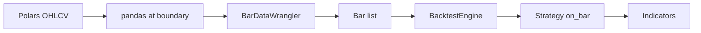

# NautilusTrader Navigation for DigiQuant

Central guide for agents and developers working with NautilusTrader in DigiQuant. Use this when adding strategies, modifying backtest logic, or debugging Nautilus integration.

## 1. Package Structure

| Area | Import path | Purpose |
|------|-------------|---------|
| Backtest | `nautilus_trader.backtest.engine.BacktestEngine` | Run backtests |
| Strategies | `nautilus_trader.examples.strategies.*` | Built-in strategies |
| Indicators | `nautilus_trader.indicators` | RSI, MACD, BollingerBands, etc. |
| Model | `nautilus_trader.model` | Bar, BarType, Instrument, Venue |
| Config | `nautilus_trader.config` | StrategyConfig, PositiveInt, etc. |
| Wranglers | `nautilus_trader.persistence.wranglers.BarDataWrangler` | OHLCV → Bar conversion |
| Test kit | `nautilus_trader.test_kit.providers.TestInstrumentProvider` | Create instruments |

## 2. Data Flow

1. **OHLCV** (Polars) from `load_ohlcv_csv` or `generate_synthetic_ohlcv`
2. **Boundary:** Convert to pandas (timestamp index) for `BarDataWrangler.process()`
3. **BarDataWrangler** produces list of `Bar` objects
4. **BacktestEngine** runs strategy; `on_bar` receives each bar
5. **Indicators** updated via `register_indicator_for_bars` or manual `update_raw`

## 3. API Boundaries

- **Polars → pandas:** Only at `nautilus_runner.py` L98–108 for `BarDataWrangler.process()`. Nautilus expects pandas with `timestamp` index. Convert back to Polars for `account_report` (already done).
- **Bar format:** `{symbol}.{venue}-{period}-LAST-EXTERNAL` (e.g. `AAPL.SIM-1-DAY-LAST-EXTERNAL`).
- **Bar period inference:** `_infer_bar_period_nautilus()` maps timestamp deltas to `1-MINUTE`, `1-HOUR`, `1-DAY`.

## 4. Strategy Lifecycle

Follow this pattern when implementing custom strategies:

1. **`__init__(config)`** — Create indicators; store config.
2. **`on_start()`** — Get instrument from cache; `register_indicator_for_bars(bar_type, indicator)`; `request_bars()`; `subscribe_bars()`.
3. **`on_bar(bar)`** — Check `indicators_initialized()`; implement trading logic; submit orders.
4. **`on_reset()`** — Reset all indicators.

## 5. Indicator Patterns

- **Registered indicators:** Use `register_indicator_for_bars(bar_type, indicator)` so Nautilus auto-updates them when bars arrive.
- **Manual indicators:** Call `indicator.update_raw(value)` or `indicator.handle_bar(bar)` yourself (e.g. signal line from MACD).
- **Indicator signatures:**
  - `RSI.update_raw(value)` — single close price
  - `BollingerBands.update_raw(high, low, close)` — three args
  - `MACD.update_raw(close)` — single close price

## 6. Known Pitfalls

- **MACD:** `MovingAverageConvergenceDivergence(fast, slow)` takes only 2 params. A third int is interpreted as `ma_type`, not `signal_period`. Invalid `ma_type` (e.g. 9) causes `MovingAverageFactory.create` to return None and `update_raw` to raise. For signal line, use `EMA(signal_period)` on MACD values manually.
- **Config types:** Use `PositiveInt`, `PositiveFloat` from `nautilus_trader.config` for numeric params.
- **Instrument:** Use `TestInstrumentProvider.equity(symbol, venue)` for backtest; instrument must exist before strategy runs.

## 7. External Links

- [Official docs](https://nautilustrader.io/docs/latest/)
- [Concepts](https://nautilustrader.io/docs/latest/concepts)
- [API reference](https://nautilustrader.io/docs/latest/api_reference)
