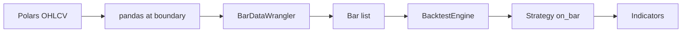

# NautilusTrader Navigation for digiquant

Central guide for agents and developers working with NautilusTrader in digiquant. Use this when adding strategies, modifying backtest logic, or debugging Nautilus integration.

## 1. Package Structure

| Area | Import path | Purpose |
|------|-------------|---------|
| Backtest | `nautilus_trader.backtest.engine.BacktestEngine` | Run backtests |
| Strategies | `nautilus_trader.examples.strategies.*` | Built-in strategies |
| Indicators | `nautilus_trader.indicators` | RSI, MACD, BollingerBands, etc. |
| Model | `nautilus_trader.model` | Bar, BarType, Instrument, Venue |
| Config | `nautilus_trader.config` | StrategyConfig, PositiveInt, etc. |
| Wranglers | `nautilus_trader.persistence.wranglers.BarDataWrangler` | OHLCV → Bar conversion |
| Test kit | `nautilus_trader.test_kit.providers.TestInstrumentProvider` | Create instruments |

## 2. Data Flow

```mermaid
flowchart LR
    OHLCV[Polars OHLCV] --> Pandas[pandas at boundary]
    Pandas --> Wrangler[BarDataWrangler]
    Wrangler --> Bars[Bar list]
    Bars --> Engine[BacktestEngine]
    Engine --> Strategy[Strategy on_bar]
    Strategy --> Indicators[Indicators]
```

1. **OHLCV** (Polars) from `load_ohlcv_csv` or `generate_synthetic_ohlcv`
2. **Boundary:** Convert to pandas (timestamp index) for `BarDataWrangler.process()`
3. **BarDataWrangler** produces list of `Bar` objects
4. **BacktestEngine** runs strategy; `on_bar` receives each bar
5. **Indicators** updated via `register_indicator_for_bars` or manual `update_raw`

## 3. API Boundaries

- **Polars → pandas:** Only at `nautilus_runner.py` L98–108 for `BarDataWrangler.process()`. Nautilus expects pandas with `timestamp` index. Convert back to Polars for `account_report` (already done).
- **Bar format:** `{symbol}.{venue}-{period}-LAST-EXTERNAL` (e.g. `AAPL.SIM-1-DAY-LAST-EXTERNAL`).
- **Bar period inference:** `_infer_bar_period_nautilus()` maps timestamp deltas to `1-MINUTE`, `1-HOUR`, `1-DAY`.

## 4. Strategy Lifecycle

Follow this pattern when implementing custom strategies:

1. **`__init__(config)`** — Create indicators; store config.
2. **`on_start()`** — Get instrument from cache; `register_indicator_for_bars(bar_type, indicator)`; `request_bars()`; `subscribe_bars()`.
3. **`on_bar(bar)`** — Check `indicators_initialized()`; implement trading logic; submit orders.
4. **`on_reset()`** — Reset all indicators.

## 5. Indicator Patterns

- **Registered indicators:** Use `register_indicator_for_bars(bar_type, indicator)` so Nautilus auto-updates them when bars arrive.
- **Manual indicators:** Call `indicator.update_raw(value)` or `indicator.handle_bar(bar)` yourself (e.g. signal line from MACD).
- **Indicator signatures:**
  - `RSI.update_raw(value)` — single close price
  - `BollingerBands.update_raw(high, low, close)` — three args
  - `MACD.update_raw(close)` — single close price

## 6. Known Pitfalls

- **MACD:** `MovingAverageConvergenceDivergence(fast, slow)` takes only 2 params. A third int is interpreted as `ma_type`, not `signal_period`. Invalid `ma_type` (e.g. 9) causes `MovingAverageFactory.create` to return None and `update_raw` to raise. For signal line, use `EMA(signal_period)` on MACD values manually.
- **Config types:** Use `PositiveInt`, `PositiveFloat` from `nautilus_trader.config` for numeric params.
- **Instrument:** Use `TestInstrumentProvider.equity(symbol, venue)` for backtest; instrument must exist before strategy runs.

## 7. Schedule replay (dated weight schedule, schema 2.0)

`digiquant/dashboard/replay/` snapshots the house book through the
BacktestEngine with zero-fee, same-bar fills:

- **Schema 2.0:** `PortfolioReplayRequest.weight_schedule` is a tuple of
  `ScheduledTargetWeights(effective_date, weights)`. Non-empty schedule
  requires `schema_version="2.0"`, empty `target_weights`, and
  `execution.next_bar_execution=False`. Every `effective_date` must equal a
  bar date in the series (subset check — prevents silent no-ops).
- **Convention:** a schedule date is both the submission and execution date —
  the row dated D is submitted at D's close and fills at D's close (causal
  forward writer; matches legacy methodology. The 2026-06→09 restatement run
  matched the arithmetic chain to <1e-6; the enforced forward guard band is
  25bp fail / 1bp warn — see `verify_nav_replay.py`).
- **Ordering:** sells-before-buys two-pass per rebalance avoids
  `AccountBalanceNegative` halts on fully-invested books.
- **Bar volume:** Nautilus market fills are constrained by bar volume — the
  verify harness must use real `price_history` volumes (default 1M model
  volume is a test-only hazard).
- **Fractional lots:** `Equity` hardcodes `size_precision=0` (no fractional
  units), so the harness runs at scaled notional ($100M) with integer
  `ROUND_DOWN` lots, then normalizes — on the restatement run engine NAV
  matched the arithmetic chain to <1e-6 (integer-lot dust ≈0.05bp/lot at
  $100M scale).
- **Verify script:** `digiquant/scripts/research/verify_nav_replay.py`
  rebuilds the causal schedule + bars from Supabase and compares engine NAV
  vs `nav_history` (non-zero exit on breach). Reads page by last-seen-key
  cursor over a deterministic `(date, ticker)` order (#3803) — never offsets —
  and refuses to verify or `--write` from a truncated/unstable page.

## 8. External Links

- [Official docs](https://nautilustrader.io/docs/latest/)
- [Concepts](https://nautilustrader.io/docs/latest/concepts)
- [API reference](https://nautilustrader.io/docs/latest/api_reference)
