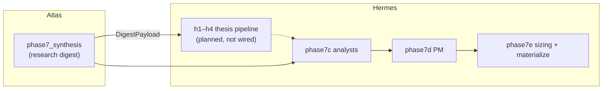

# digiquant-atlas — System Architecture

> **Last updated**: 2026-06-20  
> **Pipeline version**: v4 — daily Olympus graph (Atlas A0–A4 → Hermes H1–H9) with edit-mode continuity  
> **Canonical spec:** [`docs/superpowers/specs/2026-06-20-olympus-daily-thesis-design.md`](../../../../../../../docs/superpowers/specs/2026-06-20-olympus-daily-thesis-design.md) §13–§14

---

## Where to read what

| Need | Doc |
|------|-----|
| **Cowork schedules (how the repo is run day-to-day)** | [`cowork/tasks/README.md`](../cowork/tasks/README.md), [`cowork/PROJECT.md`](../cowork/PROJECT.md) |
| Operator commands and validation | [`RUNBOOK.md`](../../RUNBOOK.md) |
| Daily cadence + refresh_scope | [`WORKFLOWS.md`](WORKFLOWS.md) |
| Skill index (filesystem source of truth) | [`SKILLS-CATALOG.md`](SKILLS-CATALOG.md) |
| IDE / Copilot / Cursor setup | [`PLATFORMS.md`](PLATFORMS.md) |
| Hermes H1–H9 topology | [`hermes/docs/ARCHITECTURE.md`](../../../hermes/docs/ARCHITECTURE.md) |
| Dated health / score snapshot | [`../SYSTEM-SCORECARD.md`](../SYSTEM-SCORECARD.md) |

---

## Operational scope (Cowork-first)

**In scope for ongoing operation**

| Track | What | Task entry points |
|-------|------|-------------------|
| **Research (Track A)** | Daily research with edit-mode — publish **`digest`** and segment research to Supabase | [`recurring-scheduled-run.md`](../cowork/tasks/recurring-scheduled-run.md), `python -m digiquant.olympus.hermes.chain --cadence daily` |
| **Portfolio (Track B)** | Thesis-first Hermes H1–H9 → `commit_run` | Same chain entry point (unified daily graph) |
| **Review & improvement** | `preflight_reflect` on due `decision_log` rows; beliefs on-demand | `--refresh-scope beliefs` |

**Superseded cadence (historical only):** separate weekly baseline / weekday delta / month-end
synthesis workflows — replaced by one daily graph + `resolve_edit_mode` per artifact ([#930](https://github.com/digithings-ai/digithings/issues/930)).

The **9-phase tables** below are a **reference map** of segment skills. **Authoritative runtime
order** is the LangGraph pipeline: A0 preflight → A1 triage → A2 segments → A3 consolidate →
A4 digest → Hermes H1–H9.

---

## Overview

digiquant-atlas is an AI-orchestrated daily market intelligence system. Agents load config and
prior context from **Supabase**, follow **`skills/<slug>/SKILL.md`** packages (or `*-edit.md`
when `resolve_edit_mode` returns `edit`), and publish structured JSON to **`daily_snapshots`**
and **`documents`**.

### Daily cadence (current)

| Control | Behavior |
|---------|----------|
| **Cron** | `.github/workflows/pipeline-olympus.yml` — `0 12 * * *` UTC daily |
| **Sunday** | `refresh_scope=all` (operator full refresh) |
| **Weekdays** | `refresh_scope=none` — continuity via `skip`/`edit`/`full` per artifact |
| **CLI** | `python -m digiquant.olympus.hermes.chain --cadence daily [--refresh-scope …]` |
| **Cost** | `OLYMPUS_MODEL_TIER` (`cheap` \| `balanced` \| `quality`) — not graph forks |

Quiet-day savings: triage `skip` (0 LLM) + `edit` (`DocumentPatch`) — not a separate delta graph.

---

## Atlas → Hermes handoff

Atlas terminates at `phase7_synthesis` (`DigestPayload`). Hermes reads only `DigestPayload`
from Atlas runtime ([ADR-0015](../../../../../../docs/adr/0015-atlas-vs-hermes.md)).

Retrieval tools (Hermes grounding): `query_research`, `query_data`, `query_portfolio` with
phase-scoped blinding (spec §6.1).

---

## Three-Tier Cadence (historical — superseded 2026-06-20)

> **Superseded.** The three-tier baseline/delta/monthly model is replaced by one daily graph
> and per-artifact edit mode. The section below is retained for operator context on legacy
> Cowork task names and token-savings rationale.

### Sunday — Weekly Baseline (historical entry point)

Entry point was: `python -m digiquant.olympus.hermes.chain --run-type baseline`  
**Current:** `--cadence daily --refresh-scope all` (Sunday cron sets `all` automatically).

### Mon–Sat — Daily Delta (historical)

Entry point was: `python -m digiquant.olympus.hermes.chain --run-type delta`  
**Current:** `--cadence daily` with triage + `resolve_edit_mode` per segment.

### Month-End — Monthly Synthesis (removed)

**Not in v1.** Month-over-month views are UI aggregation over stored daily artifacts.
Do not schedule `monthly` runs or `phase_monthly` on the daily chain.

---

## Pre-Flight Protocol (All Run Types)

Before any phase executes, the agent performs a structured context load:

1. **Confirm cadence** — `python -m digiquant.olympus.hermes.chain --cadence daily` (Sunday: `refresh_scope=all` via cron or `--refresh-scope all`)
2. **Load config** — `config/watchlist.md`, `config/preferences.md`
3. **Load prior context from Supabase** — query `daily_snapshots` and `documents` for recent dates
4. **Load yesterday's snapshot from Supabase** — establishes continuity baseline for today's changes
5. **Inject market context (#694)** — preflight queries `price_technicals`
   (core + sector ETFs, latest row each) and `macro_series_observations`
   (latest + previous value per configured series) into
   `DataLayerSnapshot.market_context`, which `_shared_context` serializes into
   every phase call. Agents get real quantitative values deterministically —
   the Supabase data tools remain available for follow-up queries but are no
   longer the only path to price/macro data (they were never invoked under
   `tool_choice="auto"`). Fail-soft: a data-layer error logs a warning and
   phases run without injected values.
6. **Announce**: `"Context loaded. Starting Phase 1 of 9."`

---

## The 9-Phase Pipeline (Weekly Baseline)

### Phase 1 — Alternative Data & Positioning Signals

> **Runs FIRST** — positioning intelligence must color all downstream reads.
> Never read macro before knowing what the market is actually positioned for.

| Sub | Skill package |
|-----|----------------|
| 1A | `skills/alt-sentiment-news/SKILL.md` |
| 1B | `skills/alt-cta-positioning/SKILL.md` |
| 1C | `skills/alt-options-derivatives/SKILL.md` |
| 1D | `skills/alt-politician-signals/SKILL.md` |

Supabase: segment payloads → `documents` per RUNBOOK (stable `document_key` values).

**What each sub-agent covers:**
- **1A Sentiment & News**: AAII/CNN Fear & Greed, retail sentiment, social media signal, top news catalysts
- **1B CTA Positioning**: Systematic trend-follower positioning (via COT, CTI), futures open interest, CTA flow model estimates
- **1C Options & Derivatives**: GEX (gamma exposure), VIX structure, put/call ratios, dealer positioning, block prints
- **1D Politician Signals**: Congressional trades (STOCK Act filings), recent buys/sells by tracked officials

---

### Phase 2 — Institutional Intelligence

> Smart money reads — ETF flows, dark pool prints, and hedge fund signals.

| Sub | Skill package |
|-----|----------------|
| 2A | `skills/inst-institutional-flows/SKILL.md` |
| 2B | `skills/inst-hedge-fund-intel/SKILL.md` |

Supabase: institutional segment payloads → `documents`.

**What each sub-agent covers:**
- **2A Flows**: ETF inflows/outflows by asset class and sector, dark pool unusual activity, 13D/13G/Form 4 filings, options-implied institutional positioning
- **2B Hedge Fund Intel**: Latest signals from 16 tracked funds (CIK list in `config/hedge-funds.md`), reported via 13F, X posts, conference calls

**Delta circuit-breaker (#928):** both 2A/2B run live web search + an LLM. Pre-flight
probes `documents` (`query_institutional_absence_streak`) for consecutive recent runs that
published **no** `inst-*` document and records the count on
`DataLayerSnapshot.institutional_absence_streak` (`institutional_data_available` is the
boolean flag). On a **delta** run, once that streak reaches
`phase2_institutional.ABSENCE_BREAKER_THRESHOLD` (3), Phase 2 skips the paid `inst-*`
LLM/search nodes and writes a deterministic `data_quality="absent"` stub (zero search spend)
carrying a `circuit_breaker` marker; publish suppresses the empty stub and diagnostics records
the skip + reason under `breakdown.phase2_outputs.circuit_breaker_skips`. **Baseline always
runs Phase 2 fully** — a baseline re-probes the layer rather than inheriting a stale absence.

---

### Phase 3 — Macro Regime Classification

> The analytical anchor for all downstream work.
> Every asset class analysis in Phases 4–5 must reference this regime.

Skill: `skills/macro/SKILL.md`  
**Canonical:** published macro segment in Supabase `documents` and snapshot materialization per RUNBOOK.

**4-Factor Regime Model:**

| Factor | What It Measures |
|--------|-----------------|
| **Growth** | GDP trend, PMI, labor market, earnings revisions |
| **Inflation** | CPI/PPI trajectory, commodity pressures, breakevens |
| **Policy** | Fed/ECB/BOJ stance, rate trajectory, QT pace |
| **Risk Appetite** | VIX structure, credit spreads, EM flows, safe-haven demand |

Output: a regime label (e.g., `Growth Slowing / Inflation Sticky / Policy Tightening / Risk-Off`) plus portfolio implications.

---

### Phase 4 — Asset Class Analysis

> Five dedicated asset-class agents. Each reads the Phase 3 regime output and checks for alignment.

| Sub | Skill package |
|-----|----------------|
| 4A | `skills/bonds/SKILL.md` |
| 4B | `skills/commodities/SKILL.md` |
| 4C | `skills/forex/SKILL.md` |
| 4D | `skills/crypto/SKILL.md` |
| 4E | `skills/international/SKILL.md` |

Supabase: asset-class segments → `documents`.

**Coverage:**
- **4A Bonds**: Yield curve (2s10s, 10s30s), real rates, TIPS breakevens, duration positioning, credit spreads (IG/HY), MBS
- **4B Commodities**: WTI/Brent, Nat Gas, Gold, Silver, Copper, agricultural commodities, supply/demand drivers, OPEC+ signals
- **4C Forex**: DXY, EUR/USD, USD/JPY, GBP/USD, EM FX, BOJ/ECB policy divergence, carry trade dynamics
- **4D Crypto**: BTC, ETH, BTC dominance, funding rates, exchange flows, on-chain metrics, macro correlation
- **4E International/EM**: Asia (Hang Seng, Nikkei), Europe (DAX, FTSE), EM country reads, geopolitical risk premiums

---

### Phase 5 — US Equities + 11-Sector Swarm

> Top-down market analysis first, then delegated to 11 specialized sector sub-agents.

| Sub | Skill package |
|-----|----------------|
| 5A | `skills/equity/SKILL.md` |
| 5B | `skills/sector-technology/SKILL.md` |
| 5C | `skills/sector-healthcare/SKILL.md` |
| 5D | `skills/sector-energy/SKILL.md` |
| 5E | `skills/sector-financials/SKILL.md` |
| 5F | `skills/sector-consumer-staples/SKILL.md` |
| 5G | `skills/sector-consumer-disc/SKILL.md` |
| 5H | `skills/sector-industrials/SKILL.md` |
| 5I | `skills/sector-utilities/SKILL.md` |
| 5J | `skills/sector-materials/SKILL.md` |
| 5K | `skills/sector-real-estate/SKILL.md` |
| 5L | `skills/sector-comms/SKILL.md` |
| 5M | *(orchestrator synthesis)* — sector scorecard in materialized digest / snapshot |

Supabase: US equities + 11 sector documents → `documents`.

**Phase 5A covers**: SPY/QQQ/IWM, market breadth (NYSE A/D line, new 52W highs/lows), factor performance (value, growth, momentum, quality, small cap).

**Phase 5M** produces a final sector scorecard after all 11 agents complete:
```
SECTOR SCORECARD — {{DATE}}
| Sector | ETF | Bias | Confidence | Key Driver |
```

---

### Phase 6 — Supabase Consolidation & Bias Tracker

> System-wide Supabase publish. Runs after all research is complete.

| Sub-Phase | Action |
|-----------|--------|
| 6A | Publish new bias row to Supabase `daily_snapshots` (14 columns: date, macro regime, equity/crypto/bond/commodity/forex bias, VIX, inst. flow, options sentiment, CTA direction, HF consensus, Fed odds, notes) |
| 6B | Confirm all segment documents were published to Supabase `documents` this session |

**Complete segment document manifest (25 segments):**
- Core market (7): macro, equity, crypto, bonds, commodities, forex, international
- Sectors (11): technology, healthcare, energy, financials, consumer-staples, consumer-disc, industrials, utilities, materials, real-estate, comms
- Alternative data (4): sentiment, cta-positioning, options, politician
- Institutional (2): flows, hedge-funds
- Portfolio (1): portfolio evolution and rebalance history
- Cross-asset trackers (2): bias rows in `daily_snapshots`, thesis data in `documents`

---

### Phase 7 — Master Synthesis (digest snapshot)

> Research-only synthesis. Pull the most important signals across all phases
> into a coherent research brief. **No portfolio positioning** — that is Hermes's
> domain (phases 7C–7E). See [ADR-0015](../../../../../../docs/adr/0015-atlas-vs-hermes.md).

**Canonical output:** digest snapshot JSON validated against `templates/digest-snapshot-schema.json`. Inside the LangGraph pipeline the terminal `phases/publish_phase.py` writes the digest into Supabase `daily_snapshots` and `documents` in one transaction (replacing the legacy `scripts/materialize_snapshot.py` + `scripts/publish_document.py` step). Markdown render is **derived** from JSON.

**Required narrative coverage** (map into snapshot JSON fields / sections the schema defines):
1. **Market Regime Snapshot** — single dominant force today; cross-asset research themes (not positioning)
2. **Alternative Data Dashboard** — sentiment + CTA + options + politician synthesis; lead with any contrarian signal
3. **Institutional Intelligence Summary** — ETF flow direction, notable HF signal, any 13D/13G filing
4. **Macro** — full regime read (from published macro segment)
5. **Asset Classes** — bonds, commodities, forex, crypto, international
6. **US Equities** — overview + full sector scorecard (11 sectors, OW/UW/N + key driver each)
7. **Research Watchlist** (`actionable_summary`) — 3–5 evidence-based items to monitor; no trade verbs
8. **Risk Radar** — what could break the current bias in 24–72 hours

**Deprecated / always empty on new runs** (kept in schema for backward compat with historical rows):
- `thesis_tracker` — Hermes PM + reflection own thesis lifecycle
- `portfolio_recommendations` — Hermes phases 7D–7E own allocation

**Context budget ([#1559](https://github.com/digithings-ai/digithings/issues/1559)).** Phase 7 aggregates every fresh phase-1..5 segment body plus prior context, and two inputs scale with the segment roster. On full ~27-segment baseline days they blew past the smallest routed reasoning-tier model's **64k** context (`BadRequestError 400 … requested ~90690`), after which graceful degradation carried the prior digest forward — publishing a byte-identical `daily_snapshots` row daily while telemetry read "ok". The fix (`phases/phase7_synthesis.py`) bounds **both** movers:

- **PHASE_INPUTS** — a run-wide char budget (`_DIGEST_SEGMENT_INPUTS_BUDGET_CHARS = (64000 − 24000 reserve) × 3 chars/tok = 120 000 chars`) split across the *actual* fresh-segment count (`_per_segment_char_budget`), so the aggregate stays bounded as the roster grows. Within each segment `_slim_segment_body` greedily fills the decision-relevant fields (identity + stance → findings → sources → notes) up to that allowance and drops verbose extension prose; a full 34-segment day assembles to ~30k tokens.
- **SHARED_CONTEXT** — `latest_segments` is filtered to the digest keys (`digest`, `digest-delta`) and the retained prior-digest payloads are trimmed (`_slim_prior_digest_payload`). The unfiltered prior per-segment carry was the dominant driver (~145k → ~0.4k tokens on a verbose baseline); it was redundant since carry/edit read the prior digest via `_DigestPriorLoader` directly.

**Failure visibility.** When master-digest synthesis fails and carries the prior forward, the carried payload is stamped with `carried_from` (ISO source date) + a human `continuity` note (JSONB, no migration), and `diagnostics.summarize_run` escalates the run to **degraded** with the failure leading `error_summary` and a first-class `breakdown["master_digest_failed"]` key — so a stale carry is never reported as `ok`. (With the budget fix the overflow won't recur; the escalation is a safety net for any future digest failure.)

---

### Phase 7C — Asset Analyst Pass

> Per-asset conviction scores. Analysts are blinded to current portfolio weights.

- Reads only Phase 1–5 published segment payloads (Supabase `documents`) — no new web searches
- For each ticker in `config/portfolio.json`, produces an independent conviction score
- Also identifies 1–2 new opportunity candidates from the session's research

**Output:** publish per-ticker analyst payloads to Supabase `documents` with stable keys per RUNBOOK.

---

### Phase 7D — Portfolio Manager Review

> Clean-slate portfolio construction, then comparison vs current holdings.
> This is the most actionable output of the full pipeline.

**Phase B — Clean-Slate (blinded to weights):**
- Reads all analyst outputs from published position documents
- Applies theme caps and weight constraints from `config/preferences.md`
- Builds ideal target portfolio
- **Output:** publish `portfolio-recommended` payload to Supabase `documents`

**Phase C — Comparison (weights unlocked):**
- Loads `config/portfolio.json` with current weights
- Diffs recommended vs current; applies ≥5% threshold to filter noise
- Produces rebalance table: Hold / Add / Trim / Exit / New
- **Output:** publish `rebalance-decision` to Supabase `documents`
- Updates `config/portfolio.json` → `proposed_positions[]`
- Publishes portfolio rebalance record to Supabase `documents`

---

### Phase 8 — Web dashboard / tearsheet

```bash
python3 scripts/update_tearsheet.py   # NAV path + frontend/public/dashboard-data.json; Supabase when configured
./scripts/git-commit.sh             # commit config / static JSON as needed
```

**Behavior:** `update_tearsheet.py` uses `config/portfolio.json` and, when Supabase env is set, aligns dashboard history with `daily_snapshots` / documents. See script `--help` for optional disk scan behavior used in some operator workflows.

The Next.js frontend reads from Supabase where wired, with `frontend/public/dashboard-data.json` as static fallback — no separate backend API for the digest loop.

---

### Phase 9 — Post-Mortem & Evolution

> Self-improvement loop. Strict guardrails prevent uncontrolled pipeline drift. Phase 9 evolution artifacts (JSON-first).

| Sub-Phase | Action | Artifact |
|-----------|--------|----------|
| 9A | Source Scorecard: rate every data source (1–5 stars), log failures, record discoveries | `evolution_sources` JSON — schema `templates/schemas/evolution-sources.schema.json` (publish per RUNBOOK; optional files from `scaffold_evolution_day.sh`) |
| 9B | Quality Post-Mortem: check yesterday's predictions (✅/❌/⏳), rate digest on 5 dimensions (1–5 scale each) | `evolution_quality_log` JSON — schema `templates/schemas/evolution-quality-log.schema.json` |
| 9C | Improvement Proposals: max 2 per session, each specifying exact target file + change + rationale | `evolution_proposals` JSON — schema `templates/schemas/evolution-proposals.schema.json` |
| 9D | Document applied proposals (approved in prior PRs) | `docs/evolution-changelog.md` |
| 9E | Evolution branch + PR | `evolve/YYYY-MM-DD` — requires user approval to merge |

**Guardrails — Phase 9 may NEVER propose changes to:**
- Published digest snapshot schema (`templates/digest-snapshot-schema.json`) / segment contracts without an approved migration
- Risk profile or position sizing in `config/investment-profile.md` §4
- These guardrails themselves

```bash
./scripts/git-commit.sh --evolution   # creates evolve/ branch + PR, does NOT auto-merge to master
```

---

## Artifact layout (canonical vs optional scratch)

**Canonical (system of record):** Supabase `documents` (per-segment JSON payloads, stable keys per RUNBOOK), `daily_snapshots` (materialized digest row for the date), and related tables (`positions`, etc., per schema).

**`data/agent-cache/`** may be **absent** on a fresh clone. Scripts populate it only when running fetch, backfill, evolution PR prep, or similar — see [`data/README.md`](../../data/README.md). **Sunday baseline vs Mon–Sat delta:** same Supabase contract; delta runs additionally emit delta-oriented documents.

---

## Snapshot read path (frontend-consumable)

**Goal:** the Atlas frontend (Next.js dashboard at `frontend/olympus/`) and any other consumer can fetch a daily run's full state with one query and zero pipeline-runtime imports. Issue [#302](https://github.com/digithings-ai/digithings/issues/302).

### Source of truth

After every baseline / delta run, the LangGraph pipeline writes one row to **`daily_snapshots`** via `digiquant_atlas.supabase_io.publish_daily_snapshot` (PR #441). That row is the canonical artifact — there is **no** separate static JSON published anywhere else. Columns we care about:

| Column | Type | Notes |
|---|---|---|
| `date` | `date` | Trading date (run_date) |
| `run_type` | `text` | `'baseline'` (Sunday) or `'delta'` (Mon–Sat) |
| `baseline_date` | `date` | Most recent baseline this delta builds on; `NULL` for baseline runs |
| `snapshot` | `jsonb` | Full Phase 7 digest payload — matches `templates/digest-snapshot-schema.json` |
| `digest_markdown` | `text` | Optional rendered Markdown view |
| `created_at` / `updated_at` | `timestamptz` | Supabase row timestamps |

### Access (anon, RLS-gated)

Migration **011** (`011_unpartition_snapshots_documents.sql`) installs the policy:

```sql
ALTER TABLE daily_snapshots ENABLE ROW LEVEL SECURITY;
CREATE POLICY "anon_read" ON daily_snapshots FOR SELECT TO anon USING (true);
```

So the frontend uses the Supabase **anon** key — no service-role key client-side, no separate publish step. The same policy is in place on `documents`. The Next.js dashboard already consumes Supabase this way; the envelope schema below is the typed contract on top of those rows.

### Envelope schema

The wire-level contract is **[`digiquant.olympus.atlas.SnapshotEnvelope`](../../../../digiquant/src/digiquant/olympus/atlas/snapshot.py)** — a Pydantic v2 model wrapping the Phase 7 digest with run-level metadata. The exported JSON Schema lives at [`digiquant/docs/schemas/atlas_snapshot.v1.json`](../../../../digiquant/docs/schemas/atlas_snapshot.v1.json) and is regenerated by `scripts/export_atlas_snapshot_schema.py`.

```text
SnapshotEnvelope
├─ schema_version: int = 1     # bump on breaking changes
├─ run_date: date              # daily_snapshots.date
├─ run_type: "baseline"|"delta"
├─ baseline_date: date | None  # daily_snapshots.baseline_date
├─ published_at: datetime      # updated_at, falling back to created_at
└─ digest: DigestPayload       # daily_snapshots.snapshot (jsonb)
```

The envelope is `extra="forbid"` end-to-end, so a frontend validator catches drift loudly. `SnapshotEnvelope.from_supabase_row(row)` accepts the natural row dict and assembles the envelope.

### Why this design (Option A) and not a static JSON publish step (Option B)

- The `daily_snapshots` row is **already** the canonical artifact — duplicating it to a static file (committed branch / object-store URL) creates two sources of truth and a cache-invalidation problem.
- RLS gating with the anon key gives the same "no auth dance" UX as a public file URL, but with row-level security primitives if we later want to gate by tenant or date.
- No new infra (no S3 bucket, no GitHub Pages publish step, no CDN cache to invalidate) and no changes to the LangGraph runtime.

### DigestPayload duality (don't import the app from the lib)

`digiquant_atlas` (under `apps/`) depends on `digiquant` and `digigraph`. To keep the import direction correct (apps → libs, never libs → apps), `digiquant.olympus.atlas.snapshot.DigestPayload` is a **mirror** of `digiquant_atlas.phases.phase7_synthesis.DigestSnapshot`. A parity test (`tests/dq/atlas/test_snapshot.py::TestParityWithPipelineDigest`) imports both classes when the pipeline package is available and asserts field-name equality; drift fails loud.

### Schema versioning policy

Bump `digiquant.olympus.atlas.snapshot.SCHEMA_VERSION` and ship a sibling `atlas_snapshot.v{N}.json` whenever fields are added/removed/renamed or semantics change. Frontend consumers branch on `envelope.schema_version`. The previous version's schema file stays committed for grace-period rollouts.

### Personalization (read-time, additive)

The pipeline writes one canonical `daily_snapshots` row per day — *not* a per-user view. Per-user filtering and ranking happens at read time via [`digiquant.olympus.atlas.personalize_snapshot`](../../../../digiquant/src/digiquant/olympus/atlas/personalization.py). Issue [#312](https://github.com/digithings-ai/digithings/issues/312).

```
SnapshotEnvelope ──┐
                   ├──> personalize_snapshot ──> PersonalizedSnapshot { envelope, excluded_count, rank_changes }
InvestmentProfile ─┤
AssetPreferences ──┘
```

Behavior:
- **Anonymous** (both args `None`): pass-through — same envelope instance, no diagnostics.
- **`AssetPreferences.excluded_tickers`**: drops items in `actionable_summary`, `risk_radar`, `material_findings` whose label/rationale/trigger/summary mention an excluded ticker (word-boundary uppercase regex; coarse but documented — "USA"/"UK" can collide).
- **`AssetPreferences.custom_universe`**: stable-partitions `actionable_summary` so items mentioning a custom-universe ticker move to the front; positional moves are reported in `rank_changes`.
- **`InvestmentProfile.risk_tolerance`**: `conservative` drops `actionable_summary` items with `priority < 3`; `moderate` / `aggressive` keep all.
- **`InvestmentProfile.esg_preference == "strict"`**: drops items whose label/rationale/trigger/summary contain any `excluded_sectors` substring (lower-cased contains-match). `tilt` / `none` are pass-through here — `tilt` drives weighting downstream in Hermes/Kairos, not visibility in Atlas.

`schema_version` does **not** bump — personalization is additive and consumed via the sibling `PersonalizedSnapshot` dataclass, keeping the wire envelope contract immutable. Performance budget: < 100 ms per snapshot (issue req); CI assertion at 200 ms for runner variance.

---

## Run Checkpoint / Resume (#665)

A failed or interrupted run (e.g. provider outage, credit exhaustion) can **resume from the last completed node** instead of re-running the whole pipeline. When `DIGI_CHECKPOINTER=postgres` + `DIGI_CHECKPOINTER_POSTGRES_URI` are set, the chain compiles Atlas and Hermes with a LangGraph **PostgresSaver** and runs them under **distinct per-graph threads** — `{run_id}::atlas` and `{run_id}::hermes` (never one shared thread; their state schemas differ). Each node (per-segment, per-(axis,ticker) analyst, per-(round,ticker) debater) is a checkpoint boundary, so resume re-runs only incomplete nodes. Publish is **not** checkpointed (cheap + idempotent upserts).

- **Automatic within a run:** the workflow's 3× outer retry reuses the same `GITHUB_RUN_ID`, so attempt 2 finds attempt 1's checkpoint and continues from the failure point.
- **Cross-dispatch:** re-dispatch with `--resume-run-id <prior GITHUB_RUN_ID>` (a `resume_run_id` workflow input) to continue a previously-dead run.
- Resume control flow: if a graph's thread already has a checkpoint, invoke with `None` (continue); otherwise invoke with the upstream state. Degrades to no-checkpointing (plain run) when the env/secret/package is absent.

## Research Continuity Architecture

Supabase is the system's long-term intelligence layer. Research continuity across sessions is achieved by querying prior rows at session start rather than reading flat files.

**Supabase tables used for continuity:**

| Table | Content |
|-------|---------|
| `daily_snapshots` | Per-date bias rows (14 columns: macro regime, equity/crypto/bond/commodity/forex bias, VIX, inst. flow, options sentiment, CTA direction, HF consensus, Fed odds, notes) |
| `documents` | Per-segment research documents keyed by `(date, document_key)` — covers all 25 segments: macro, equity, crypto, bonds, commodities, forex, international, 11 sectors, 4 alt-data sub-segments, 2 institutional, portfolio, thesis data |

**Research continuity protocol:**
- Query Supabase at session start — retrieve last 3 entries per relevant segment for trend identification (handled by `phases/preflight.py` → `load_prior_context`)
- Publish new documents at session end via the terminal `phases/publish_phase.py` (replaces legacy `publish_document.py` / `materialize_snapshot.py` scripts when running inside the LangGraph pipeline)
- Append-only semantics preserved in Supabase via unique `(date, document_key)` keys on `documents`
- Creates compounding intelligence — each session builds on all prior research in every domain

---

## Data Flow

```
config/watchlist.md ─────────────────────────────────────────┐
config/preferences.md ──────────────────────────────────────┐│
config/hedge-funds.md ─────────────────────┐                ││
                                           │                ││
Supabase daily_snapshots/documents ───┐    │(all skills read)│
(prior context queried at session start)│   │                 │
                                      ▼    ▼                 ▼
         Phase 1 ─► segment JSON ──► Phase 2 ─► Phase 3 ─► Phase 4 ─► Phase 5
                                                    │
                                 (macro regime anchors all phases below)
                                                    │
                                           Phase 6: Supabase PUBLISH
                                         (all segment documents published)
                                                    │
                                           Phase 7: materialized digest
                                         (daily_snapshots + digest document)
                                                    │
                                     Phase 7C/7D: portfolio analysis
                                    (published position + PM payloads)
                                                    │
                                     Phase 8: dashboard-data.json
                                     (update_tearsheet.py → frontend)
                                                    │
                                     Phase 9: evolution JSON (+ optional PR)
                                     (data/agent-cache/evolution/{{DATE}}/)
```

**Dependency rule**: Each phase reads all prior phases' published outputs before executing. This sequential dependency is intentional — sector analysts must know the macro regime before making allocation calls.

### Tool-based grounding (#566)

`preflight.py` still runs a **freshness probe** (latest dates + counts in `state.data_layer`) for triage, but phases no longer rely on pre-loaded values. Instead each research phase runs a **tool loop** so the model fetches real data on demand:

```
preflight (freshness probe; no pre-loaded values)
  ↓ phase node: inputs_builder → scope/segment context
  ├─ web-grounding pre-pass (live_search phases): responses.create(tools=[web_search])
  │    → cited summary injected into phase_inputs as `web_grounding`
  └─ run_research_agent → chat_completion_with_tools(tools=[data tools])
       ├─ get_price_technicals / get_macro_series → real Supabase values
       ├─ web_grounding block (news/sentiment/flows + citations) already in inputs
       └─ model emits final JSON → validate against output_model (retry on invalid)
  ↓ existing publish path (documents + daily_snapshot) — unchanged
```

- **Two data tools, one query layer** (`olympus/atlas/data/queries.py`): exposed both in-process (`data/tools.py` → `DATA_TOOLS` + dispatcher, consumed by `build_grounding` in `phases/_node_factory.py`) and over MCP (`digiquant_get_price_technicals` / `digiquant_get_macro_series` in `mcp_server.py`).
- **Per-phase flags** on `SegmentNodeSpec`: `use_data_tools` (macro, asset-classes, equity, sectors) and `live_search` (macro, all alt-/inst-, international). Equity/sector nodes are bespoke and call `build_grounding` directly.
- **Web grounding** (`data/web_grounding.py` → `digigraph.llm.web_search`): a read-only **pre-pass** using xAI's Agent Tools `web_search` over the **Responses API** (`responses.create`, `tools=[{type: web_search, filters: {allowed_domains}}]`), scoped to a **per-segment** allowlist in `config/search_domains.yaml` (`per_segment` map, each capped at xAI's 5-domain limit; unmapped segments use the default list). Returns a cited summary (`output_text` with inline `[[n]](url)` citations) that is injected into `phase_inputs` as `web_grounding`, then the normal chat.completions data-tools pass runs. **This replaced the deprecated chat-completions `search_parameters` Live Search, which xAI retired (HTTP 410).** xAI-only; non-xAI models and any search error degrade to ungrounded research (no crash).
- **Env gate**: `ATLAS_DATA_TOOLS` (default on; set `0`/`false` to disable all tool grounding). If Supabase is unavailable, `build_grounding` degrades to tool-less rather than crashing the phase.

Function-tools and `response_format=json_schema` are mutually exclusive in one OpenAI-API call, so the structured-output contract is preserved by prompt + Pydantic validate-retry rather than by `response_format` on the tool path.

---

## Signal Priority Hierarchy

When signals conflict across phases, apply in order:

1. **Fundamental regime change** — macro regime shifts override all other signals
2. **Institutional flows** — large capital movements are directionally predictive short-term
3. **Alternative data / sentiment** — useful for timing and contrarian reads
4. **Technical levels** — useful for medium-term target setting

---

## Web dashboard (frontend)

```
Supabase (documents, daily_snapshots, price_history, …)
     │
     ▼  @supabase/supabase-js in Next.js (App Router)
  frontend/app/ …                    Library, portfolio, architecture pages, …
     │
     ├─ scripts/update_tearsheet.py → frontend/public/dashboard-data.json (static JSON used when present)
     └─ CI: .github/workflows/deploy.yml → static export → GitHub Pages (when configured)
```

**Primary path:** the app reads **live data from Supabase** (`NEXT_PUBLIC_SUPABASE_*`). **`dashboard-data.json`** is an optional static fallback — see [`RUNBOOK.md`](../../RUNBOOK.md).

---

## Repository structure

```
digiquant-atlas/
  AGENTS.md, CLAUDE.md, RUNBOOK.md, CLAUDE_PROJECT_INSTRUCTIONS.md
  config/                    Watchlist, portfolio, preferences, macro_series.yaml, …
  skills/<slug>/SKILL.md     Orchestrator, daily-delta, weekly-baseline, sectors, …
  templates/schemas/         JSON Schema for published artifacts
  scripts/                   Bash + Python — run_db_first.py, materialize_snapshot.py,
                             publish_document.py, preload-history.py, smoke-test.sh, …
  agents/                    Named role files (*.agent.md)
  frontend/                  Next.js (App Router) + TypeScript
  supabase/                  SQL migrations, config.toml
  tests/                     pytest
  cowork/                    Cowork tasks and project prompts
  docs/agentic/              ARCHITECTURE.md (this file), WORKFLOWS, PLATFORMS, …
  data/                      Not in git — local scratch + price CSV cache (see .gitignore)
```

Skills are packaged as **`skills/<slug>/SKILL.md`**; use [`SKILLS-CATALOG.md`](SKILLS-CATALOG.md) for the full list.

---

*Platform setup: [`PLATFORMS.md`](PLATFORMS.md).*

---

## LLM Routing — Three-Tier Provider Model

*Introduced 2026-04. Rationale and token budget: [`docs/atlas/token-budget.md`](../../../../docs/atlas/token-budget.md). Design decision: [DESIGN-DECISIONS.md ADR-016](../DESIGN-DECISIONS.md#adr-016-three-tier-llm-provider-routing).*

The pipeline uses three free-tier providers, each matched to the complexity of the phases it serves. The default configuration is **fully free**; paid users can override any model via config.

### Provider assignment (default free-tier)

| Tier | Provider | Model | Phases | Rationale |
|------|----------|-------|--------|-----------|
| **Extraction** | Groq | `llama-3.1-8b-instant` | 1, 2, 7C | Fast, high concurrency, 20k TPM free — ideal for parallel structured extraction fan-outs |
| **Analysis** | Ollama Cloud | `qwen3.5:cloud` (via `DIGI_LLM_MODE`) | 3, 4, 5 | 397B MoE, 256K context, deep multi-factor reasoning for sequential analysis phases |
| **Synthesis** | Gemini | `gemini-2.5-flash` | 7, 7D, 9 | 1M TPM free, best multi-document reasoning for high-stakes synthesis |

Estimated **~113k tokens/run** spread across three independent free tiers (vs ~674k on a single Ollama provider). Per-provider peak load stays within each provider's free-tier TPM window.

### How routing works

Every phase node passes a `phase_slug` (e.g. `alt-sentiment-news`, `analyst-AAPL`, `master-digest`) to `run_research_agent`. The agent resolves the model in this priority order:

```
1. Explicit model= kwarg  (test overrides, never set in production)
2. get_model_for_phase(phase_slug)  →  looks up phase_models in config/model_modes.yaml
3. get_model_for_mode()  →  DIGI_LLM_MODE tier (Ollama default)
```

`config/model_modes.yaml` is the single configuration source for both tier defaults and per-phase overrides:

```yaml
# Per-phase overrides (provider/model format for Groq and Gemini)
phase_models:
  alt-sentiment-news: "groq/llama-3.1-8b-instant"
  "analyst-":         "groq/llama-3.1-8b-instant"   # prefix match: analyst-AAPL, analyst-NVDA, …
  master-digest:      "gemini/gemini-2.5-flash"
  pm-rebalance:       "gemini/gemini-2.5-flash"
  phase9-evolution:   "gemini/gemini-2.5-flash"
  # Phases 3, 4, 5 have no entry → fall through to Ollama via DIGI_LLM_MODE

# Ollama tier defaults (used when no phase_models entry exists)
defaults:
  test:   ollama-cloud/rnj-1:cloud
  medium: ollama-cloud/qwen3-next:80b-cloud
  best:   ollama-cloud/deepseek-v4-flash:cloud
```

Model strings with a `provider/` prefix (`groq/`, `gemini/`) are routed to the corresponding external OpenAI-compatible client in `digigraph/src/digigraph/llm.py`. All other strings go through the existing Ollama Cloud path.

### Fan-out cap (`ATLAS_MAX_ANALYSTS`)

Phase 7C spawns one LLM node per ticker in the watchlist (up to 98). The `ATLAS_MAX_ANALYSTS` env var caps the fan-out:

| Value | Behaviour |
|-------|-----------|
| `0` (default) | No cap — full watchlist |
| `25` (CI default) | Capped at 25 tickers; logged at INFO level |

This keeps Phase 7C within Groq's free-tier concurrency limits during scheduled CI runs. Production / local runs can set `ATLAS_MAX_ANALYSTS=0` to use the full watchlist.

**Watchlist resolution (#694):** when the CLI is invoked without `--watchlist`
(every scheduled workflow), `resolve_cli_inputs` falls back to
`config/watchlist.md` — both the Atlas graph and the Hermes 7C/7CD fan-out are
compiled from `AtlasInput.watchlist`, and an empty tuple silently skipped every
analyst/debate node. An explicit `--watchlist` still overrides the file, and an
empty file still disables the fan-out. Cost note: with the fallback active, a
delta run adds `min(len(watchlist), ATLAS_MAX_ANALYSTS) × 4` analyst calls plus
the debate/risk rounds — tune `ATLAS_MAX_ANALYSTS` in the workflow envs to
bound spend.

### Fallback behaviour

If a provider key is not configured (`GROQ_API_KEY` or `GEMINI_API_KEY` unset), `chat_completion` logs a warning and falls back to the Ollama client for that call. The pipeline completes with degraded quality on those phases but never hard-fails due to a missing key.

### Overriding models (user configuration)

Any phase model can be overridden by editing `config/model_modes.yaml`. The `phase_models` block accepts any OpenAI-compatible model string:

```yaml
phase_models:
  master-digest: "groq/llama-3.3-70b-versatile"     # swap synthesis to Groq
  macro:         "gemini/gemini-2.5-pro"             # use Pro model for macro
  "analyst-":    "cerebras/llama-3.3-70b"            # switch extraction tier to Cerebras
```

To add a new provider, register it in `_EXTERNAL_PROVIDERS` in `digigraph/src/digigraph/llm.py` (three lines: base URL, API key env var name). All existing retry, caching, and fallback logic applies automatically.

### Required secrets / env vars

| Variable | Provider | Where set |
|----------|----------|-----------|
| `OPENAI_API_KEY` | Ollama Cloud | GitHub secret `OLLAMA_API_KEY` mapped in CI |
| `GROQ_API_KEY` | Groq | GitHub secret + local `.env` |
| `GEMINI_API_KEY` | Gemini | GitHub secret + local `.env` |
| `ATLAS_MAX_ANALYSTS` | (cap) | CI workflow env: `"25"` |
| `DIGI_LLM_MODE` | Ollama tier | CI: `best` (baseline), `medium` (delta) |

Run `python3 scripts/validate-provider-keys.py` after adding keys to `.env` to smoke-test all three providers.

---

## DigiGraph Sub-graph Orchestration (issue #176, ADR-0009)

The 9-phase pipeline described above is now orchestrated by a DigiGraph
sub-graph in `digiquant/src/digiquant/olympus/atlas/`. Skill files in
`skills/<slug>/SKILL.md` remain the authoritative "what to research"
instructions — they are injected into a generic research agent at runtime
rather than ported as prompt code.

Entry point: `digiquant_atlas.graph.build_atlas_graph` plus `AtlasInput`.
DigiClaw (issue #219) invokes this on a cron schedule.

**What changed operationally:**

- Publishing runs from inside the sub-graph (`supabase_io.py`) rather than
  from `scripts/publish_document.py`. Those scripts are now frozen; see
  their file headers.
- The 11 per-sector `sector-*/SKILL.md` files were deleted in favor of a
  single templated `skills/sector-research/SKILL.md` + `config/sectors.yaml`.
  Every sector now goes through the same prompt with its config injected.
- Phase 9 evolution 9D (apply approved proposals) and 9E (branch + PR)
  are deliberately out of scope for the scheduled sub-graph; 9A/9B/9C
  still emit JSON artifacts into `state.phase9_evolution`.

The Cowork-based manual runs described above remain valid as an escape
hatch for backfills and operator scenarios, but the scheduled cadence
now flows through the sub-graph.

---

## Hermes sub-graph (portfolio deliberation)

Hermes owns **positioning** — thesis lifecycle, vehicle mapping, analyst
deliberation, PM allocation, risk sizing, and book materialization. Atlas's
Phase 7 digest is **research-only** (no `thesis_tracker`, no
`portfolio_recommendations` on new runs). See
[ADR-0015](../../../../../../docs/adr/0015-atlas-vs-hermes.md).

### Boundary diagram



### Live vs intended entry

| Stage | Intended (thesis-first) | Live today |
|-------|-------------------------|------------|
| Research handoff | `phase7_digest` + phases 1–6 segment slots | Same |
| Thesis translation | h2 `market-thesis-exploration` → h3 `thesis-vehicle-map` | **Skipped** — Wave 2 skills deleted, not in graph |
| Analyst roster | Tickers from thesis vehicle map + held names | `select_focus_tickers`: `prior_book` holdings + top-N `price_technicals` scores (#696) |
| Thesis rows | Written when theses are proposed/mapped (h1–h3) | Written post-PM in `portfolio_materialize._upsert_theses` (one row per held ticker) |
| Analyst linkage | Per-ticker analysis tied to `source_thesis_ids` | `AnalystPayload.thesis` is per-axis rationale text only — no thesis_id FK |

The **live** Hermes graph is documented in
[`hermes/docs/README.md`](../../hermes/docs/README.md). The **planned** seven-phase
expansion (h1 thesis review through h7 PM memo) remains in
[`HERMES_SUBGRAPH.md`](../../hermes/HERMES_SUBGRAPH.md) and
[`WAVE2_UNIT_SPECS.md`](../../hermes/WAVE2_UNIT_SPECS.md) for reference; wiring h1–h4
is a separate follow-up ([#924](https://github.com/digithings-ai/digithings/issues/924)) from book-continuity work (#859).

Persistence lands in both `documents` (full payload) and the first-class
tables introduced by migration 024: `theses`, `thesis_vehicles`,
`deliberation_sessions`, `deliberation_rounds`, `analyst_coverage`,
`deep_dive_triggers`.
