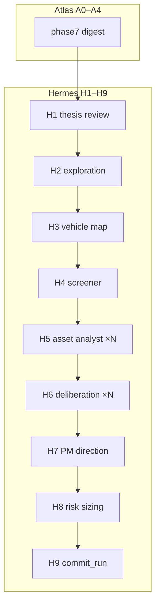

# Hermes — architecture

> Thesis-aware portfolio loop. Consumes Atlas `DigestPayload`; produces analyst payloads,
> deliberation summaries, PM direction memo, sized book, and terminal booking via H9.
>
> Boundary: [ADR-0015](../../../../../docs/adr/0015-atlas-vs-hermes.md) · Canonical topology:
> [ADR-0020](../../../../../docs/adr/0020-olympus-mvp-daily-delta.md) · Spec §13.2:
> [`docs/superpowers/specs/2026-06-20-olympus-daily-thesis-design.md`](../../../../../docs/superpowers/specs/2026-06-20-olympus-daily-thesis-design.md)

---

## End-to-end flow (chain)

Production cron invokes `python -m digiquant.olympus.hermes.chain --cadence daily`:

```
preflight + preflight_reflect (Atlas)
  → triage (Atlas A1)
  → phases 1–5 segments + phase6 + phase7 digest (Atlas A2–A4)
  → Hermes H1–H9 (thesis-first)
  → publish_phase (Atlas research artifacts only)
```

Hermes terminal persist is **H9 `commit_run`** (in-graph): `positions`, `nav_history`,
`theses` / `thesis_vehicles` sync, portfolio brief (weights from H8), `decision_log`
append. Phase 9 evolution LLM is **not** on the daily path; beliefs distillation is
on-demand (`refresh_scope=beliefs` or backlog > `OLYMPUS_BELIEFS_BACKLOG`).

---

## H1–H9 path map

| Step | Node | Module | Edit behavior | Output |
|------|------|--------|---------------|--------|
| **H1** | `hermes/thesis/market-review` | `phases/h1_thesis_review.py` | `edit` active market theses | `theses` rows + review doc |
| **H2** | `hermes/thesis/market-exploration` | `phases/h2_market_thesis_exploration.py` | `edit` exploration doc | market thesis proposals |
| **H3** | `hermes/thesis/vehicle-map` | `phases/h3_thesis_vehicle_map.py` | `full`/`edit` | `thesis_vehicles` |
| **H4** | `hermes/thesis/opportunity-screener` | `phases/h4_opportunity_screener.py` | deterministic | focus roster (held + mapped + unlinked), capped by a **regime-adaptive budget** |
| **H5** | `hermes/portfolio/asset-analyst` (×N) | `phases/h5_asset_analyst.py` | `skip`/`edit`/`full` per ticker | unified `AnalystPayload` |
| **H6** | `hermes/portfolio/deliberation` (×N) | `phases/h6_deliberation.py` | cyclic PM↔analyst sub-graph | `deliberation_transcript` + summary |
| **H7** | `hermes/portfolio/pm-direction` | `phases/h7_pm_direction.py` | `edit` prior memo | `PMDirectionMemo` — **no weights** |
| **H8** | `hermes/portfolio/risk-sizing` | `phases/phase7e_risk_sizing.py` | no LLM | `phase_hermes.sized_book` (sole weight owner) |
| **H9** | `hermes/portfolio/commit-run` | `phases/h9_commit_run.py` | no LLM | positions, nav, brief, `decision_log` |

### Vehicle → market thesis linkage (#1563)

`theses.linked_market_thesis_id` ties a `vehicle-{ticker}` thesis to the market
thesis it expresses. It is resolved at **creation time by H5**
(`upsert_vehicle_thesis_from_analyst` → `resolve_primary_market_thesis`) from the
reliable `thesis_vehicles` map (H3's ticker → market-thesis mapping): primary =
lowest `candidate_rank`, falling back to the most recent prior mapping for a
carried held name. This replaced a same-date H3 back-fill that structurally
never fired (the `vehicle-{ticker}` row does not exist when H3 runs), which left
every vehicle thesis null-linked in prod. The link is **self-healing** — H5
rewrites the vehicle row each run and re-resolves — so it repairs going forward;
historical rows stay as-was and the frontend derives the hierarchy from
`thesis_vehicles` directly (#1562). `upsert_thesis_row` refuses to persist a
self-referential link (`linked == thesis_id`), neutralizing the ~140 legacy
self-refs at the single write chokepoint.

Graph builder: `graph.build_hermes_phases_thesis()` → `build_hermes_graph()`.
Legacy `build_hermes_phases` aliases the thesis path. **Removed from graph:** 4-axis 7C,
`phase7cd_debate`, risk debaters, `portfolio_materialize`, phase9 evolution on daily path.

---

## H4 dispatch budget (regime-adaptive, Stage 2 — #1043 / #1017)

`_h4_node` calls `budget_controller.assess_budget(state, client, static_cap)` to size the
analyst roster instead of relying solely on the static `ATLAS_MAX_ANALYSTS`. A deterministic
classifier (`budget_controller.py`) maps three signals Atlas already produces — VIX
term-structure state, market breadth (`pct_above_50dma`), and cross-sectional return
dispersion derived for free from `state.price_deltas` — to a regime:

- **stress** (VIX backwardation OR breadth < 40%) → budget tightened (`max(STRESS_FLOOR, round(cap*0.5))`), explore floor 0 — fewer idiosyncratic dives when correlation is high / risk-off.
- **dispersion** (return spread ≥ `DISPERSION_HI`) → budget = cap, explore floor raised — probe more new names.
- **neutral** (incl. sparse signals) → budget = cap, explore floor 1 (today's default).

The result feeds `compute_focus_roster(..., adaptive_max_analysts=budget, min_new_candidates=explore_floor)`
→ `roster_cap.capped_tickers`. **Invariants:** *cost-safe* — `budget ≤ ATLAS_MAX_ANALYSTS`
always (the adaptive budget only tightens, never increases spend); *fail-soft* — any missing
signal, absent client, or reader error degrades to the static cap and logs (never raises).
Env knobs: `ATLAS_MAX_ANALYSTS` (the cap/baseline), `ATLAS_BUDGET_STRESS_FLOOR` (default 3),
`ATLAS_BUDGET_DISPERSION_HI` (default 0.015). Deferred (cost-/measurement-gated): budget > cap
in dispersion regimes, a dedicated cross-asset dispersion metric, and the `dispatch_outcomes`
feedback table (Stage 4).

---

## PMDirectionMemo (H7)

H7 emits direction + ordinal conviction rank + narrative only — never `target_pct`,
`weight`, or `recommended_portfolio`. Schema: `PMDirectionMemo` / `TickerDirection`
(see spec §11.2). H8 maps memo + feasibility constraints → sized weights.

---

## H6 deliberation sub-graph

Per-ticker cyclic sub-graph (not a single LLM call):

- `h6_pm_challenge` — PM challenges analyst doc; may emit `converged=true`
- `h6_analyst_response` — analyst responds or revises stance

Termination when either side sets `converged=true` (no product round cap; infra timeouts
only). On fingerprint quiet (#925): `skip` — carry prior deliberation summary into H7;
fresh `deliberation_transcript` row only when the loop runs.

---

## LLM-node fail-soft (#1665)

Every hermes LLM call site (H1–H3 via `thesis_common`, H5 via `portfolio_common`, H6
deliberation turns, H7 memo, 7D debate/PM, phase 9 evolution) is wrapped: a
research-agent output failure (JSONDecodeError / ValidationError / empty body after
digillm's retries) degrades **that node** with a node-level `PhaseError` and a
phase-appropriate fallback — H7 carries the prior memo re-dated (held names it misses
are covered by the #1649 carry), H6 carries the analyst stance, H5/thesis skip the
item, 7D empties the debate arm, legacy PM skips (H8 prefers the H7 memo anyway).
`chain/hermes` (`phase="chain"`) errors can therefore only come from infra
(checkpointer/graph), never LLM output. Rationale: three runs in two days
(2026-07-21/22) died run-fatal on one flaky parse, and each outer retry re-runs the
whole chain at ~$1.2–3.6 — the pipeline must complete (and commit) on the first
attempt with local degradation instead.

## H9 commit-run: coherence, held-carry, and observability (#932 / #1030 / #1555 / #1649)

H9 is the sole terminal writer. Before it books, `commit_io.coherence_errors` runs two
fail-closed checks over the H8 `sized_book` weights:

1. every prior holding is either in the book with positive weight **or** explicitly `flat`
   in the H7 memo (no silent drop of an owned name);
2. every open position has an H5 analyst doc **or** is `flat` **or** is a deliberately
   carried held name (`commit_io.carried_held_tickers`).

**Held-carry (two classes, one set).** `commit_io.carried_held_tickers` — used by BOTH
H8's carry injection (`phase7e_risk_sizing._held_carry_weights`) and H9's exemption, so
the two can never diverge — covers:

- **H4-gated** (#1030/#1555): the staleness gate moves a quiet held name into
  `focus_roster_excluded` and dispatches no analyst, so it never reaches the H7 memo.
- **Memo-unaddressed** (#1649): the H7 memo's roster omits a held name entirely (neither
  `long` nor `flat`). Memo coverage is LLM discipline — the pm-direction skill demands
  full roster coverage and the model still omitted SEVEN held tickers on 2026-07-21/22
  (run 29936849103), freezing the commit. An owned position with no explicit PM
  instruction defaults to **hold at drifted weight**; exiting requires an explicit
  `flat` (a flatted name is memo-addressed and never resurrected).

H8 carries both classes into the sized book at their current drifted weight *before* the
rebalancing-cadence band — a held position stays owned unless the PM explicitly exits it.
**Regression #1555:** before the gated carry, dropped held names made check (1) fail
closed with a `PhaseError` that never reached the degraded gate — every delta-day commit
was silently frozen from 2026-06-26 while runs still reported `ok:true`.

**Commit is observable.** A book H8 materializes but H9 does not persist (coherence
fail-closed, idempotency conflict, or a no-manifest skip) is now a **degraded** run:
`diagnostics.summarize_run` computes `(book_materialized, book_committed)` from
`phase_hermes.sized_book` / `commit_manifest` (a manifest with status `committed`/`noop`
counts as committed) and forces `degraded` when materialized-but-not-committed — a state an
H9 `PhaseError` can't trigger on its own. Both flags are emitted structurally in the
`atlas_run_diagnostics.breakdown` (truncation-proof) and in the chain CLI summary alongside
`book_materialized`; a commit-failure marker is prepended to `error_summary` so it survives
the 2000-char cap. `chain._retry_worthy` keys the #809 good-book guard on `book_committed`
(not mere materialization), so an uncommitted book retries while a committed one does not.

---

## Boundary diagram



---

## Grounding and blinding

Hermes H1–H7 use `build_grounding` / `build_thesis_grounding` with phase-scoped tool
blinding (`query_research`, `query_data`, `query_portfolio` per spec §6.1). Prior analyst
and thesis context loads via preflight + on-demand `fetch_prior_document`.

---

## Related docs

- [`AGENTS.md`](AGENTS.md) — extension checklist
- [`HERMES_SUBGRAPH.md`](HERMES_SUBGRAPH.md) — historical Wave 2 spec (topology now shipped as H1–H9)
- Atlas handoff: [`atlas/docs/agentic/ARCHITECTURE.md`](../../atlas/docs/agentic/ARCHITECTURE.md)
