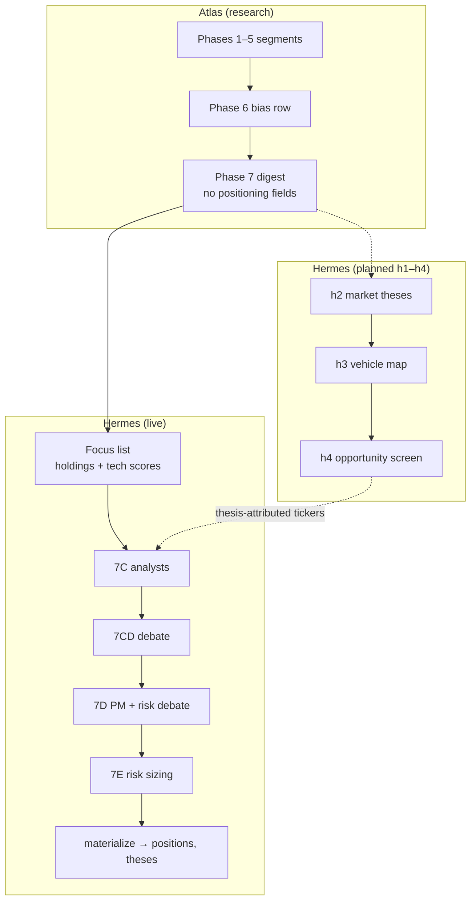

# Hermes — architecture

> Analysis, debate, portfolio management, and reflection. Consumes Atlas research;
> produces analyst payloads, a rebalance decision, reflection records, and (via
> `portfolio_materialize`) booked `positions` / `theses` rows.
>
> Boundary: [ADR-0015](../../../../../docs/adr/0015-atlas-vs-hermes.md). Parent overview:
> [`digiquant/ARCHITECTURE.md`](../../../../../ARCHITECTURE.md) § Atlas + Hermes.

---

## End-to-end flow (chain)

Production cron invokes `python -m digiquant.olympus.hermes.chain`:

```
preflight (Atlas) → phases 1–6 research → phase7_synthesis (digest)
    → Hermes graph (7C → 7CD → 7D → 9)
    → phase7e risk-sizing → publish_phase → portfolio_materialize
```

`chain.run_atlas_then_hermes` runs Atlas with `publish=None`, then Hermes, then
terminal phases. Monthly runs stop after Atlas `phase_monthly` (no Hermes).

---

## Intended vs live analyst entry

### Intended (thesis-first)

1. **Translate** Atlas research (`phase7_digest` + segment bodies) into market-facing
   **theses** (`market-thesis-exploration` schema).
2. **Map** investment vehicles/tickers to each thesis (`thesis-vehicle-map`).
3. **Screen** the universe; analysts fan out over **thesis-attributed tickers**
   (plus held names for mandate review) — not an arbitrary watchlist slice.

Planned phases: h1 thesis review → h2 exploration → h3 vehicle map → h4 opportunity
screen → h5 asset analyst. Spec:
[`HERMES_SUBGRAPH.md`](HERMES_SUBGRAPH.md) §1. Wave 2 skills were never wired to the
live graph.

### Live today

| Step | Module | Behavior |
|------|--------|----------|
| Watchlist source | `chain.cli_main` | When `--watchlist` is empty: `load_prior_book` → `holdings_from_prior_book` + `select_focus_tickers` (`candidates.py`) |
| Focus selection | `candidates.select_focus_tickers` | Holdings first (from materialized `positions`, not stale `portfolio.json`), then top-N watchlist names by legible technical score |
| Analyst fan-out | `graph.build_hermes_phases` → `phase7c_analyst` | 4-axis specialists per ticker in the focus list; join → `phase7c_analysts` |
| Cap (held invariant) | `phase7c_analyst._capped_tickers` / `phase7cd_debate._capped_tickers` | `ATLAS_MAX_ANALYSTS` caps fan-out width, but **every prior-book holding (`held`) always survives** — the cap budget is spent on non-held candidates; held over budget are kept (over budget) with a warning. `held` is threaded `chain.run_atlas_then_hermes(hermes_held=…)` → `build_hermes_graph(held=…)` → `build_hermes_phases(held=…)` → both phase builders (#936; prevents the Jun-18 IJR auto-exit) |
| Debate / PM | `phase7cd_debate`, `phase7d_pm` | Unchanged contract; 7CD self-gates rubber-stamp debates at runtime (see § Debate gating) |
| Thesis table | `portfolio_materialize._upsert_theses` | **Post-PM**: one `theses` row per **held** ticker (`thesis_id = ticker.lower()`), not from h2/h3 |

**Gap:** `thesis_tracker` in the digest is always empty (Atlas research-only).
Hermes does not yet run thesis translation before analysts; `AnalystPayload.thesis`
is aggregated axis rationale, not a link to a `theses.thesis_id`.

---

## Boundary diagram



---

## Phase reference (live graph)

| Phase | File | Output state keys |
|-------|------|-------------------|
| 7C-i | `phases/phase7c_analyst.py` | `phase7c_specialists[ticker][axis]` |
| 7C-ii | same (join) | `phase7c_analysts[ticker]` |
| 7CD | `phases/phase7cd_debate.py` | `phase7cd_debates[ticker]` |
| 7D | `phases/phase7d_pm.py` | `phase7d_risk_debate`, `phase7d_rebalance` |
| 9 | `phases/phase9_evolution.py` | `phase9_evolution`, `decision_log` rows |
| 7E | `phases/phase7e_risk_sizing.py` | overwrites `phase7d_rebalance` weights |
| 9D | `portfolio_materialize.py` | Supabase `positions`, `theses`, `thesis_vehicles` |

---

## Debate gating (#933)

Most delta-run 7CD debates rubber-stamp `conviction_delta=0` (Jun 17–18: 100% zero
delta) — three LLM calls per ticker (bull → bear → research-manager) for no portfolio
impact. Phase 7CD now skips the fan-out for tickers whose analysts already agree.

The gate is a **runtime** check inside the node run-functions, not a build-time decision:
the agreement signal lives in `state.phase7c_analysts[ticker]`, which only exists after
Phase 7C runs — the graph is already compiled by then. `_should_gate_debate(state, ticker)`
returns `True` (skip) when the analyst payload shows tight agreement:

- `abs(conviction_score) <= threshold` (default 2, env `HERMES_DEBATE_GATE_THRESHOLD`)
  **and** stance is not `sell`; **or**
- a held name (`held_in_prior_book`) whose `prior_analyst` stance is unchanged.

It always returns `False` (full debate) when `abs(conviction_score) >= 3`, stance is
`sell`, or the prior analyst stance materially changed. The gate reads the **agreement
signal** only — never a model's self-reported confidence.

When gated: the bull and bear nodes return `{}` (no LLM call) and the research-manager
node emits a deterministic `DebateSummary(net_stance="neutral", conviction_delta=0,
bull_thesis/bear_thesis="<gated: analysts in agreement>", rounds=[])` with a `gated: True`
marker on the emitted dict — **no LLM call**. The PM consumes the neutral summary exactly
as before.

**Flag** `HERMES_DEBATE_GATING` (read like `ATLAS_MAX_ANALYSTS`): unset → on for `delta`
runs, off for `baseline`/`monthly`; `HERMES_DEBATE_GATING=0` disables gating entirely
(always full debate); any truthy value forces it on. **Telemetry**: a `logger.info` per
gated ticker plus the `gated: True` marker on the summary dict (visible to the dashboard
and the diagnostics breakdown).

---

## Related docs

- [`README.md`](README.md) — layout, CLI, tests
- [`AGENTS.md`](AGENTS.md) — agent operator guide
- [`HERMES_SUBGRAPH.md`](HERMES_SUBGRAPH.md) — Wave 2 planned topology (historical)
- Atlas Phase 7 boundary: [`atlas/docs/agentic/ARCHITECTURE.md`](../../atlas/docs/agentic/ARCHITECTURE.md) § Phase 7
