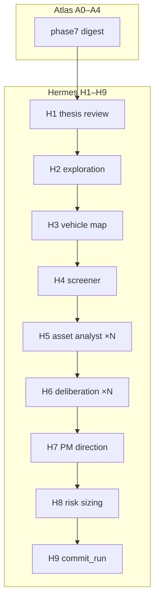

# Hermes — architecture

> Thesis-aware portfolio loop. Consumes Atlas `DigestPayload`; produces analyst payloads,
> deliberation summaries, PM direction memo, sized book, and terminal booking via H9.
>
> Boundary: [ADR-0015](../../../../../docs/adr/0015-atlas-vs-hermes.md) · Canonical topology:
> [ADR-0020](../../../../../docs/adr/0020-olympus-mvp-daily-delta.md) · Spec §13.2:
> [`docs/superpowers/specs/2026-06-20-olympus-daily-thesis-design.md`](../../../../../docs/superpowers/specs/2026-06-20-olympus-daily-thesis-design.md)

---

## End-to-end flow (chain)

Production cron invokes `python -m digiquant.olympus.hermes.chain --cadence daily`:

```
preflight + preflight_reflect (Atlas)
  → triage (Atlas A1)
  → phases 1–5 segments + phase6 + phase7 digest (Atlas A2–A4)
  → Hermes H1–H9 (thesis-first)
  → publish_phase (Atlas research artifacts only)
```

Hermes terminal persist is **H9 `commit_run`** (in-graph): `positions`, `nav_history`,
`theses` / `thesis_vehicles` sync, portfolio brief (weights from H8), `decision_log`
append. Phase 9 evolution LLM is **not** on the daily path; beliefs distillation is
on-demand (`refresh_scope=beliefs` or backlog > `OLYMPUS_BELIEFS_BACKLOG`).

House CLI close-out (`cli_main`, not `run_atlas_then_hermes`): after a non-retry
exit, fail-soft K5 `dispatch_house_notifications_after_chain` attempts today's
digest (`force_digest=True`). Overlay nested chain skips this so overlay jobs
cannot send house mail. Missing Mailgun env logs and returns.

---

## H1–H9 path map

| Step | Node | Module | Edit behavior | Output |
|------|------|--------|---------------|--------|
| **H1** | `hermes/thesis/market-review` | `phases/h1_thesis_review.py` | `edit` active market theses | `theses` rows + review doc |
| **H2** | `hermes/thesis/market-exploration` | `phases/h2_market_thesis_exploration.py` | `edit` exploration doc | market thesis proposals |
| **H3** | `hermes/thesis/vehicle-map` | `phases/h3_thesis_vehicle_map.py` | `full`/`edit` | `thesis_vehicles` |
| **H4** | `hermes/thesis/opportunity-screener` | `phases/h4_opportunity_screener.py` | deterministic | focus roster (held + mapped + unlinked), capped by a **regime-adaptive budget** |
| **H5** | `hermes/portfolio/asset-analyst` (×N) | `phases/h5_asset_analyst.py` | `skip`/`edit`/`full` per ticker | unified `AnalystPayload` + WP11.2 `ticker_evidence_bundles` (base build before provider; cite on new forecasts; optional `HermesGraphDeps.evidence_bundle_store` append when injected; `OLYMPUS_EVIDENCE_BUNDLE_WRITER=off` kill switch) |
| **H6** | `hermes/portfolio/deliberation` (×N) | `phases/h6_deliberation.py` | cyclic PM↔analyst sub-graph; WP11.3 `H6Selection` (`OLYMPUS_H6_SELECTION_MODE`); WP11.4 bounded missing-fact amendment via shared `evidence_bundle_store` | `deliberation_transcript` + summary (+ amendment/carry provenance) |
| **H7** | `hermes/portfolio/pm-direction` | `phases/h7_pm_direction.py` | `edit` prior memo | `PMDirectionMemo` — **no weights** |
| **H8** | `hermes/portfolio/risk-sizing` | `phases/phase7e_risk_sizing.py` | no LLM | `phase_hermes.sized_book` (sole weight owner) |
| **H9** | `hermes/portfolio/commit-run` | `phases/h9_commit_run.py` | no LLM | positions, nav, brief, `decision_log` |

**Pre-trade risk report (#2742 / WP9.1, #2746 / WP9.2, #2750 / WP9.3):** `hermes/allocation_contracts.py`
defines frozen `PreTradeRiskReport` (metric leaves with provenance or typed
unavailability; binding constraints / altered / rejected targets). SHA-256 helpers
live in `hermes/allocation_hashes.py`. Deterministic builders in
`hermes/pretrade_risk.py` populate variance/MRC/CRC, concentration, turnover,
cost/liquidity, and forecast-quality leaves from exact WP6 covariance + caller-
supplied vols and WP7 observational scalars — never re-estimating inputs or
mutating weights. H8 attaches the report to `phase_hermes.pre_trade_risk_report`
(and stamps `pre_trade_risk_report_hash` on the sized book) **only after** the
final control shell (carry → cadence → backstop → grid → final caps); report
identity equals the final book fingerprint (same extractor as H9:
`commit_io.weights_from_sized_book`). Fail-soft omission does not change
the sized book. H9 (`commit_run`) validates report identity under
`OLYMPUS_PRETRADE_RISK_MODE` (`off`|`shadow`|`enforce`; default `shadow`) and
append-only persists hash-bound rows to `olympus_pretrade_risk_reports`
(migration `083`, via `atlas/pretrade_risk_registry.py` +
`commit_io.validate_pretrade_risk_report` /
`persist_validated_pretrade_risk_report`). Enforce rejects missing/unknown/
fingerprint or bundle-hash mismatch before booking; shadow records status
without blocking (covered by unit tests; #2824). H9 never recomputes the report.

**Shadow allocation artifact (#2758 / WP10.1):** `hermes/shadow_artifact.py` defines
frozen `ShadowAllocationArtifact` — exact `AllocationInputBundle`, incumbent final
book weights, `PreTradeRiskReport`, and minimal H9 commit metadata with a SHA-256
`artifact_content_hash`. Canonical JSON bytes are written via temp + `os.replace`
under `OLYMPUS_SHADOW_ARTIFACT_DIR` (default `artifacts/`). Mode
`OLYMPUS_SHADOW_ARTIFACT_MODE` (`off`|`export`; default `export`). Chain calls
`maybe_export_shadow_allocation_artifact` after Hermes returns (fail-soft; never
reruns or mutates H8/H9). The module must not import challenger optimizer, replay,
or broker surfaces. `pipeline-olympus.yml` uploads `shadow-allocation-*.json` with
other run artifacts.

**Write-denied allocation shadow workflow (#2762 / WP10.2):**
`.github/workflows/pipeline-olympus-allocation-shadow.yml` consumes WP10.1 artifacts
only. It declares `permissions: contents: read` + `actions: read`, never
`secrets: inherit`, and never production Supabase / provider / broker /
checkpointer secrets. Producer trust is gated to workflow
`Pipeline: Olympus research` on `main`.
`digiquant/scripts/atlas/check_allocation_shadow_isolation.py` statically rejects
forbidden imports (Supabase, H9 commit I/O, network clients, live Nautilus,
brokers), write permissions, secret references, untrusted source/branch/schema/hash,
and non-file sinks; results are written as a local JSON report artifact only.
Disable the workflow to roll back; the production Hermes graph is unaffected.

**Solver-free robust challenger (#2770 / WP10.3):** `hermes/shadow_optimizer.py`
evaluates the robust objective
\(J(w)=\hat\mu^\top w-\kappa\|D_\mu w\|_2-\frac{\lambda}{2}w^\top\Sigma w-C(w-w_0)-\gamma\|w-w_0\|_1\)
via deterministic coordinate search (one grid quantum donor→receiver, including
`CASH`). Shared feasibility checks enforce caps/grid/authorization; accept only
objective improvement above epsilon; bounded iterations; byte-identical digests.
Abstains on missing covariance/cost bindings, degraded calibrated inputs, or an
infeasible seed. Shadow-only — never imported by `chain.py`, H8, or H9; no
SciPy/CVXPY; no production runtime flag.

**Shared-cash Nautilus portfolio replay (#2784 / WP10.4):** `olympus/replay/`
(`models.py`, `nautilus_portfolio.py`, `worker.py`) replays synchronized target
books in one Nautilus account with shared cash and real fills/costs. Spawned
workers use JSON request/result I/O; child crash/timeout is typed inconclusive
with no fallback. Never calls `_run_multi_symbol_backtest`; never a production
booking path.

**Paired shadow comparison evidence (#2799 / WP10.5):**
`olympus/replay/allocation_comparison.py` compares incumbent vs challenger
WP10.4 arms under an identical observed manifest (data/cost/execution hashes).
Versioned criteria live in `replay/shadow_criteria/v1.json` (no activation hook).
CLI `compare_allocation_shadow.py` freezes criteria first, then writes an
immutable file-only `AllocationComparisonReport`. Hard constraints remain
visible when return is stronger; unavailable/inconclusive metrics are explicit.
Never wired into production H8/H9; no auto-promotion or config write.

**Phase 2 lock surface (#2820 / Integration 2.1):**
`tests/dq/hermes/test_phase2_allocation_contracts.py` and
`phase2_e2e_fixtures.py` lock Gate 2 composition for WP8–WP10 (calibrated H8,
PreTradeRiskReport identity, shadow isolation + comparison) without enabling
challenger selection or changing Hermes graph topology.

**Phase 3 lock surface (#3019 / Integration 3.1):**
`tests/dq/hermes/test_phase3_research_contracts.py` and
`phase3_e2e_fixtures.py` lock Gate 3 composition for WP11–WP14 (immutable
evidence bundles/amendments, pinned research state, shadow attention planner,
blinded role contexts, H6 selection round floor, telemetry reconciliation)
without planner graph nodes or enforce-mode promotion. Pipeline simulation
(`tests/dq/atlas/test_pipeline_simulation.py`) extends the WP11.5 durable
H5/H6 lineage round-trip with graph-level planner-node guards.

### H2 market-thesis identity

Every market proposal has a stable lowercase `topic_key` plus an explicit
`action=create|update`. H2 receives `prior_context.active_theses` with full names, notes,
criteria, IDs, and topic keys. Revised evidence, wording, confidence, or catalyst detail
updates the existing topic with its exact `thesis_id`; only a distinct market mechanism
creates a new topic. `validate_market_thesis_proposals` drops unknown updates, active topic
collisions, ambiguous legacy topic ownership, changed topic keys, duplicate IDs, and duplicate
topics before persistence. New topics start `ACTIVE`; updates preserve H1's same-run status,
or the prior nonterminal status when H1 did not review that topic. A `PAUSED` topic remains
the same opinion and cannot be replaced with a new ID. Supabase migration 056 provides the
final one-active-topic-per-date constraint.

### Vehicle → market thesis linkage (#1563)

`theses.linked_market_thesis_id` ties a `vehicle-{ticker}` thesis to the market
thesis it expresses. It is resolved at **creation time by H5**
(`upsert_vehicle_thesis_from_analyst` → `resolve_primary_market_thesis`) from the
reliable `thesis_vehicles` map (H3's ticker → market-thesis mapping): primary =
lowest `candidate_rank`, falling back to the most recent prior mapping for a
carried held name. This replaced a same-date H3 back-fill that structurally
never fired (the `vehicle-{ticker}` row does not exist when H3 runs), which left
every vehicle thesis null-linked in prod. The link is **self-healing** — H5
rewrites the vehicle row each run and re-resolves — so it repairs going forward;
historical rows stay as-was and the frontend derives the hierarchy from
`thesis_vehicles` directly (#1562). `upsert_thesis_row` refuses to persist a
self-referential link (`linked == thesis_id`), neutralizing the ~140 legacy
self-refs at the single write chokepoint.

Graph builder: `graph.build_hermes_phases_thesis()` → `build_hermes_graph()`.
Legacy `build_hermes_phases` aliases the thesis path. **Removed from graph:** 4-axis 7C,
`phase7cd_debate`, risk debaters, `portfolio_materialize`, phase9 evolution on daily path.

---

## H4 dispatch budget (regime-adaptive, Stage 2 — #1043 / #1017)

`_h4_node` calls `budget_controller.assess_budget(state, client, static_cap)` to size the
analyst roster instead of relying solely on the static `ATLAS_MAX_ANALYSTS`. A deterministic
classifier (`budget_controller.py`) maps three signals Atlas already produces — VIX
term-structure state, market breadth (`pct_above_50dma`), and cross-sectional return
dispersion derived for free from `state.price_deltas` — to a regime:

- **stress** (VIX backwardation OR breadth < 40%) → budget tightened (`max(STRESS_FLOOR, round(cap*0.5))`), explore floor 0 — fewer idiosyncratic dives when correlation is high / risk-off.
- **dispersion** (return spread ≥ `DISPERSION_HI`) → budget = cap, explore floor raised — probe more new names.
- **neutral** (incl. sparse signals) → budget = cap, explore floor 1 (today's default).

The result feeds `compute_focus_roster(..., adaptive_max_analysts=budget, min_new_candidates=explore_floor)`
→ `roster_cap.capped_tickers`. **Invariants:** *cost-safe* — `budget ≤ ATLAS_MAX_ANALYSTS`
always (the adaptive budget only tightens, never increases spend); *fail-soft* — any missing
signal, absent client, or reader error degrades to the static cap and logs (never raises).
Env knobs: `ATLAS_MAX_ANALYSTS` (the cap/baseline, read only through
`roster_cap.configured_max_analysts()`), `ATLAS_BUDGET_STRESS_FLOOR` (default 3),
`ATLAS_BUDGET_DISPERSION_HI` (default 0.015). Deferred (cost-/measurement-gated): budget > cap
in dispersion regimes, a dedicated cross-asset dispersion metric, and the `dispatch_outcomes`
feedback table (Stage 4).

### Roster cap enforcement (#1767)

The cost-safe invariant above held for `budget`, but not for the roster: from the day H3
started emitting a vehicle map until #1767, `compute_focus_roster` passed
`active_held ∪ every thesis-map ticker` as `capped_tickers(held=…)`. Held tickers are
exempt from the cap by #936, so a populated map (40 tickers on 2026-07-31, 46 on 07-29)
pushed the protected set past the cap on every such day, `capped_tickers` took its
over-budget branch, and **`ATLAS_MAX_ANALYSTS` never capped anything** — 39 analysts
dispatched against a configured 25, and roster width tracked spend 1:1 ($0.86 at width 8,
$4.00 at width 39).

The enforced contract is now one invariant:

> **`len(focus_roster) ≤ max(cap, len(active_held))`.** The prior book is the *only*
> sanctioned overshoot. Nothing else may widen the roster.

Two consequences, both deliberate:

- **Thesis vehicles are prioritised, not exempt.** `held=` is the prior book only;
  thesis-mapped tickers go in as `candidate_priority`, a **round-robin across theses by
  within-thesis rank** (`h4_opportunity_screener.thesis_priority_order`). Output order
  still follows the watchlist — priority decides *which* candidates survive, not the
  dispatch order. A vehicle the cap drops gets a `focus_roster_excluded` row naming the
  cap, so the drop is recorded rather than silent.
- **`min_new` / `explore_floor` is a floor, not a licence.** It is clamped to the slots
  left after the book instead of expanding the cap. Whenever the book leaves any budget,
  that whole budget goes to non-held candidates, so #950's anti-freeze guarantee survives
  within the cap; it is surrendered only when the book alone fills the ceiling.

**Known limitation.** There is **no conviction signal anywhere in the H3 output** —
`candidate_rank` is a position inside the mapping, not a score, and `ThesisVehicleMapping`
has no score field — so "prioritise the thesis map" can only mean *breadth*: cover as many
theses as the budget allows before deepening any one. At `ATLAS_MAX_ANALYSTS=30`, roughly
7 of 27 theses get no vehicle analysed on a wide day (25 would leave 12). The cap and the
thesis map are sized for different worlds; this makes the cap real without resolving that.

Width is recorded in the `atlas_run_diagnostics.breakdown` jsonb (no migration) by
`hermes/roster_diagnostics.roster_breakdown` — `width`, `by_reason`, `theses_covered`,
`excluded`, `max_analysts`, `over_cap`. Its absence is why the breach went unnoticed for
the pipeline's whole observed lifetime.

---

## PMDirectionMemo (H7)

H7 emits direction + ordinal conviction rank + narrative only — never `target_pct`,
`weight`, or `recommended_portfolio`. Schema: `PMDirectionMemo` / `TickerDirection`
(see spec §11.2). WP4.5 (#2660) adds `ForecastReference` per roster row, bound after
the LLM (and after fail-soft prior carry) from current effective-forecast lineage —
never from model-supplied IDs; missing lineage is explicit degraded (null IDs +
reason). H8 maps memo + feasibility constraints → sized weights; direction/rank
semantics are unchanged.

---

## H6 deliberation sub-graph

Per-ticker cyclic sub-graph (not a single LLM call):

- `h6_pm_challenge` — PM challenges analyst doc; may emit `converged=true`
- `h6_analyst_response` — analyst responds or revises stance

Termination when either side sets `converged=true` after the min-rounds floor
(default 2; infra timeouts / max-rounds cap only for early exit). On fingerprint
quiet (#925): `skip` — carry prior deliberation summary into H7; fresh
`deliberation_transcript` row only when the loop runs.

### Deterministic selection — WP11.3 (#2902)

`research_retrieval/planner.py` emits typed `H6Selection` (one primary reason,
decision features, provider/round budget) from structured features after H5:
decision-boundary, conflict, uncertainty, invalidation-risk, material weight, or
exploration → `select`; otherwise `low_value_carry`. Modes via
`OLYMPUS_H6_SELECTION_MODE`:

| Mode | Behavior |
|---|---|
| `shadow` (default) | Record selection; run **full incumbent** H6 (fingerprint skip still applies) |
| `enforce` | Actuate: low-value carries with **zero** provider calls; selected runs skip fingerprint short-circuit so success meets the two-round floor |
| `off` | No actuation; incumbent H6 with `incumbent_fallback` provenance |

Planner failure falls back to full incumbent H6 (typed `incumbent_fallback`), never
an unrecorded skip. `weight_pct` / materiality features are selection-only and must
not enter provider prompts. Does not replace H4 roster/exploration ownership.
WP11.4+ (durable lineage round trip) still open — WP11 incomplete.

### Research attention after H4 — WP13.4 (#2930)

After H4 materializes `focus_roster`, `hermes/research_attention.py` invokes
`plan_research_attention` over ticker targets only (helper at H4 end — not a graph
node). Modes reuse `OLYMPUS_RESEARCH_ATTENTION_MODE=off|shadow|enforce` (default
`shadow`). The planner cannot mutate roster width/order or consume the exploration
floor; H4 output is byte-identical across modes.

| Phase | Enforced behavior |
|---|---|
| H5 | `carry` → skip provider; `metric_patch` → deterministic structured patch; `deep_refresh` → force full; `challenge`/`section_patch` → incumbent edit path |
| H6 | Re-route after H5 features: `challenge` runs deliberation; other modes carry with `attention_carry` |

Plan persists to `hermes_research_attention_plan` + shared `AttentionStore`.
Coexists with WP11.3 `H6Selection` — attention enforce takes precedence when both
apply. Rollback: `off`/`shadow`.

### Role context compiler — WP14.1 (#2938)

`research_retrieval/context.py` compiles deterministic role capsules from one exact
pinned research-state version. `ContextCapsule` / `ContextManifest` record included
entity IDs, content hashes, byte/token budgets, and typed omission reasons under
per-role allowlists. H5 delta-evidence policy, H6 bundle/amendment-only evidence,
and H7 attention-decision sections are enforced at compile time — not yet wired
into provider calls (WP14.2–14.4). Prose is never authoritative over structured
state.

### Bounded missing-fact amendment — WP11.4 (#2908)

H6 no longer runs generic ``live_search`` web grounding. When the PM names exactly
one missing fact via ``MissingFactProposal`` on ``DeliberationPmTurn``, Hermes may
attempt a single targeted ``query_research`` fetch (blinded by ``source_kind``) and
append ``MissingFactRequest`` + ``EvidenceBundleAmendment`` through
``research_retrieval/h6_amendment.py``. Policy cap: one amendment per base bundle;
invalid/exhausted/failed attempts record ``evidence_amendment_outcome`` /
``evidence_amendment_failure_reason`` on ``DeliberationSummary`` and continue with
the immutable H5 base — never broad re-grounding.

### Carry provenance — `carry_reason` (#1742)

`DeliberationSummary.carried` is set by **multiple** unrelated paths.
`carry_reason` names which one happened:

| `carry_reason` | Path | `converged` | Meaning |
|---|---|---|---|
| `fingerprint_skip` | quiet ticker (#925) | `true` | a real prior debate still stands |
| `llm_failure` | fail-soft catch (#1665) | **`false`** | no PM challenge ever ran |
| `low_value_carry` | WP11.3 enforce selection (#2902) | `true` | deterministic skip; zero provider calls |
| `attention_carry` | WP13.4 enforce attention (#2930) | `true` | post-H5 re-route skipped H6; zero provider calls |

Consequences of `llm_failure`, all downstream of the flag:

- **State.** `converged=false` — there is no debate to converge, so H7's `debate_summaries`
  and the published `deliberation/{ticker}` document stop claiming one.
- **Document.** `payloads.deliberation_summaries` publishes **no** `bear_thesis`; mirroring
  the bull side off the same `conclusion` produced two byte-identical theses.
  Successful H6 chats publish the turns under both `transcript` (canonical) and `rounds`
  (legacy alias). When a PM↔analyst transcript is present and no explicit theses exist,
  `bull_thesis` / `bear_thesis` stay empty so the dashboard renders the chat instead of
  two conclusion-mirrored cards.
- **Sizing.** H8 caps the name's conviction at `SizingCaps.min_conviction`
  (`phase7e._cap_unchallenged_convictions`) — applied to **both** the memo and the legacy
  branch, since H7 writes a memo on every production run. Capping *at* the bar, not below
  it, is deliberate: a name pushed under the bar is dropped by the sizer's selection step
  and then re-added at its drifted weight by the #1649 held-carry backstop, which can size
  it *larger*. Correlation de-dup can still drop a capped leg in favour of a challenged one
  — intended. The book note names every capped position.

The `PhaseError` shape (`phase="hermes_h6_deliberation"`, message prefix `deliberation LLM
failed`) is unchanged — Atlas's Hermes-density degraded gate counts phases, not messages.
Not yet propagated: `supabase_io._slim_deliberation_summary` drops `carry_reason`, so a
crash carry looks benign to the *next* day's fingerprint-skip carry.

---

## LLM-node fail-soft (#1665)

Every hermes LLM call site (H1–H3 via `thesis_common`, H5 via `portfolio_common`, H6
deliberation turns, H7 memo, 7D debate/PM, phase 9 evolution) is wrapped: a
research-agent output failure (JSONDecodeError / ValidationError / empty body after
digillm's retries) degrades **that node** with a node-level `PhaseError` and a
phase-appropriate fallback — H7 carries the prior memo re-dated (held names it misses
are covered by the #1649 carry), H6 carries the analyst stance, H5/thesis skip the
item, 7D empties the debate arm, legacy PM skips (H8 prefers the H7 memo anyway).
`chain/hermes` (`phase="chain"`) errors can therefore only come from infra
(checkpointer/graph), never LLM output. Rationale: three runs in two days
(2026-07-21/22) died run-fatal on one flaky parse, and each outer retry re-runs the
whole chain at ~$1.2–3.6 — the pipeline must complete (and commit) on the first
attempt with local degradation instead.

## H9 commit-run: coherence, held-carry, and observability (#932 / #1030 / #1555 / #1649)

H9 is the sole terminal writer. Before it books, `commit_io.coherence_errors` runs two
fail-closed checks over the H8 `sized_book` weights:

1. every prior holding is either in the book with positive weight **or** explicitly `flat`
   in the H7 memo (no silent drop of an owned name);
2. every open position has an H5 analyst doc **or** is `flat` **or** is a deliberately
   carried held name (`commit_io.carried_held_tickers`).

When advisory position risk fields are enabled, H9 resolves `positions.horizon_days` from
the dedicated `preferences.risk_horizon_days` contract (default 21). It intentionally does
not reuse `preferences.holding_days`: that separate value controls decision evaluation and
turnover cadence (default 5). `risk_envelope.risk_horizon_days` owns this validation and is
shared with the legacy `portfolio_materialize` path so both writers persist identical semantics.

**Held-carry (two classes, one set).** `commit_io.carried_held_tickers` — used by BOTH
H8's carry injection (`phase7e_risk_sizing._held_carry_weights`) and H9's exemption, so
the two can never diverge — covers:

- **H4-gated** (#1030/#1555): the staleness gate moves a quiet held name into
  `focus_roster_excluded` and dispatches no analyst, so it never reaches the H7 memo.
- **Memo-unaddressed** (#1649): the H7 memo's roster omits a held name entirely (neither
  `long` nor `flat`). Memo coverage is LLM discipline — the pm-direction skill demands
  full roster coverage and the model still omitted SEVEN held tickers on 2026-07-21/22
  (run 29936849103), freezing the commit. An owned position with no explicit PM
  instruction defaults to **hold at drifted weight**; exiting requires an explicit
  `flat` (a flatted name is memo-addressed and never resurrected).

H8 carries both classes into the sized book at their current drifted weight *before* the
rebalancing-cadence band — a held position stays owned unless the PM explicitly exits it.
A **final-book backstop** (`_apply_held_continuity_backstop`, #1649) then re-enforces the
invariant on the finished dict regardless of cause — the 2026-07-22 22:54 run reached H9
with nine held names at weight ≤ 0 (PM-longed but dropped by sizing, exempt from the
per-cause carries) — re-adding any held, non-flat name at its drifted weight with a
WARNING naming the crack (sized-out vs carry-miss). A name with no recoverable weight
stays out and H9 still fails closed.
**Regression #1555:** before the gated carry, dropped held names made check (1) fail
closed with a `PhaseError` that never reached the degraded gate — every delta-day commit
was silently frozen from 2026-06-26 while runs still reported `ok:true`.

**Commit is observable.** A book H8 materializes but H9 does not persist (coherence
fail-closed, idempotency conflict, or a no-manifest skip) is now a **degraded** run:
`diagnostics.summarize_run` computes `(book_materialized, book_committed)` from
`phase_hermes.sized_book` / `commit_manifest` (a manifest with status `committed`/`noop`
counts as committed) and forces `degraded` when materialized-but-not-committed — a state an
H9 `PhaseError` can't trigger on its own. Both flags are emitted structurally in the
`atlas_run_diagnostics.breakdown` (truncation-proof) and in the chain CLI summary alongside
`book_materialized`; a commit-failure marker is prepended to `error_summary` so it survives
the 2000-char cap. `chain._retry_worthy` keys the #809 good-book guard on `book_committed`
(not mere materialization), so an uncommitted book retries while a committed one does not.

### Same-date idempotency and orphan pruning (#1744)

**The idempotency key is the run *date*, never `run_id`.** `AtlasResearchState.run_id`
is `Field(default_factory=uuid4)` — a fresh UUID per process — so CI's outer retry always
presents a new id and a `run_id`-keyed manifest lookup structurally *cannot* see what an
earlier attempt on the same date wrote. Prod 2026-06-24 carries **three** `commit-run/`
manifests with three different `weights_fingerprint` values as the proof. Migration 044
re-keyed `decision_log` from `(run_id, ticker)` to `(run_date, ticker)` for the identical
reason (#947); this closes the same hole in the commit manifest.

Two things stay separate:

- the manifest **document** remains per-run (`commit-run/{source_run_id}` for
  house / house UUID; `overlay-commit/{workspace_id}/{source_run_id}` only when
  `is_private_workspace` is true), so every attempt keeps its own audit artefact;
- the **guard** is date-scoped: `commit_io.load_commit_manifests` returns every manifest
  for the date and `commit_io.resolve_prior_commit` picks the last writer.

**Reconciliation is last-writer-wins, not fail-closed.** A same-date commit whose
fingerprint differs from the prior one re-books and records `supersedes`; it does *not*
raise. A hard conflict error would fail the phase on the 06-24 shape production already
produces, and with the uncommitted-book gate above that reports `degraded` for a book that
did commit. Ordering comes from `commit_seq` inside the manifest payload because
`documents` has no `created_at` column; pre-#1744 manifests read 0, so a date carrying
several of them is an undecidable tie and `resolve_prior_commit` returns `None` (re-commit)
rather than guess.

Re-booking is safe only because `commit_io._prune_orphan_positions` deletes same-date
`positions` rows absent from the book just written — including a stale `CASH` row, which
`book_portfolio` only writes when `cash_pct > 0.01`. Without the prune a shrinking
re-commit left the dropped name at its old weight: the raw book exceeds 100% of NAV,
`refresh_performance_metrics` sums the orphan into `portfolio_metrics.invested_pct`, and
`execute_at_open.build_events_from_positions_book` emits a phantom Activity-feed event.
The prune is deliberately **not** fail-soft. That trade is worth naming precisely: the
non-transactional gap between `book_portfolio` and `save_commit_manifest` is **not
closed** — a raise from the prune (or any failure between the two calls) still leaves a
booked-but-unmanifested date, and the prune itself is one more thing that can raise
there. What changes is that re-attempts now **converge across** the gap instead of
stacking: the date-keyed guard sees no manifest, re-commits, and re-prunes to the last
writer's book. Making the prune fail-soft would trade a loud, self-healing gap for a
silent orphan in a published performance series, which is the defect this closes.

### `nav_history` ownership contract (#1745)

`nav_history` has **two writers**, and they are not peers:

| Writer | When | Owns |
|---|---|---|
| H9 `commit_io.book_portfolio` | commit time, ~12:00–14:00 UTC | the **provisional** row: NAV as of the latest close available *before* `run_date`, plus `cash_pct` / `invested_pct`, which H9 alone owns |
| `scripts/atlas/refresh_performance_metrics.py` | evening cron, ~22:00–23:00 UTC | the **authoritative** NAV: restated against that date's settled close |

**The evening restatement is a correction, not corruption.** Reading a manifest NAV and a
`nav_history` NAV that differ for the same date is expected: the manifest is a commit-time
artefact whose only structural job is the `weights_fingerprint` idempotency check, and
`nav_history` is the published series (`public_nav_history`). Do not "fix" the divergence
by having H9 write the later value — at commit time that close does not exist yet.

What H9 *must* get right is its anchor. Because the cron restates row `D` to "NAV as of
D's close", `_prior_nav` already embeds the move up to the prior book date. So the return
H9 applies is measured **over the interval from the prior book date to the last close
before `run_date`** (`commit_io._interval_price_returns`), not over the latest pair of
trading days. Applying a one-day delta on top of a restated anchor double-counts it
(2026-07-28: the manifest re-applied the 07-24→07-27 return already inside the 07-27 NAV)
and, across a book gap, records almost none of the move (2026-06-26 → 07-17 recorded
+0.03% for a book that actually returned −0.37%).

The interval start comes from the `date` column of the rows `load_prior_book` returned, so
the weights and the window are the same row set by construction. Anchoring on
`nav_history`'s own latest date would desynchronize the moment the cron extends the series
to a **bookless** date — which is exactly what `--fill-calendar-through` does, and why the
anchor is the book, not the NAV row.

`atlas.supabase_io.query_price_deltas` is deliberately left alone: it is a one-trading-day
triage signal shared with the rule evaluators, and every rule threshold is calibrated
against that meaning.
<!-- #1766 -->
### The 2026-06-27 → 2026-07-16 book gap is permanent and accepted

The #1555 freeze above left a hole in the book that will **not** be filled. Read this before
proposing a backfill. Verified against the live `core` project on 2026-08-01:

- `positions`, `nav_history` and `portfolio_metrics` each hold **zero rows** for every date in
  `2026-06-27 … 2026-07-16` — 20 consecutive calendar days. Last pre-gap book: 06-26. First
  post-gap book: 07-17.
- 22 `atlas_run_diagnostics` rows cover that window and **18 of them report `status='ok'`**.
  All 18 carry the H9 coherence check (1) failure in `error_summary`:
  `hermes_h9_commit_run/hermes/portfolio/commit-run: held ticker <T> missing from book and not
  flat in H7` (EWT on most dates; EWT, IJR, UUP and TLT by 07-16). Grep production for **that
  message**, not for the word "coherence" — the literal string `coherence` appears in zero rows,
  and no `error_summary` in the window comes close to the 2000-char cap, so nothing was
  truncated. This is check (1) at the top of this section reporting a frozen commit under an
  `ok` verdict, which is exactly the lie the degraded gate above now prevents.

**Fixed 2026-07-17** by `40312d82` "restore Hermes H4–H9 commits" (PR #1565, branch
`task/1555-hermes-restoration`), then hardened 07-22 by the memo-unaddressed held carry
(`b84a4d73`) and the final-book continuity backstop (`1dc93db3`). `positions` resumes on
2026-07-17, the same date. Of the 18 diagnostics rows from 07-17 onward that carry a **non-null**
`book_committed`, `book_committed = true` holds exactly when `positions` has rows for that
`run_date` — zero counterexamples in either direction, including the correctly-`false` 07-21,
07-22 and 07-24 runs. (Three further 07-17 rows predate emission of the flag and carry `null`.
Separately, 07-30 has no diagnostics row at all — a hole in the *detection* series, unrelated to
this book gap.)

**The gap is deliberately not backfilled**, for two independent reasons:

1. **It would fabricate an audit trail.** Synthesising 20 days of book for dates on which the PM
   demonstrably made no decision invents holdings that were never chosen, and it would silently
   restate every published performance number — NAV, Sharpe, volatility, drawdown, alpha and
   attribution are all computed over this series.
2. **The only tool that could do it structurally cannot.**
   `digiquant/scripts/atlas/refresh_performance_metrics.py`'s `fill_calendar_through`
   (`:578-596`) resolves its start from `_max_positions_date` (`:580`, `:101-107`) and then walks
   **forward only** (`:593-596`). A target date earlier than the latest snapshot degrades to a
   single-day refresh (`:584-590`). It provably cannot reach a hole that sits *behind*
   `max(positions.date)`, and `carry_forward_positions` (`:109-146`) is only ever called from
   that forward walk. See the "Limitation" note in
   [`atlas/docs/RUNBOOK.md`](../../atlas/docs/RUNBOOK.md), which has said so since before the gap.

Two consequences a future reader must not "fix" by accident. First, the sparseness of
`positions` / `nav_history` **is the signal** that a book failed to commit; densifying the
calendar by carrying the prior book forward across missing dates would destroy the only
data-level evidence of recurrence. Second, the gap is currently **invisible** in the UI rather
than merely visible-and-empty, because the tearsheet contribution chart plots by array index, so
the 20 absent dates are compressed away instead of rendering as a break. Annotating the chart is
a separate, unfiled piece of work; it was considered and deliberately deferred.

**#1766 needs no repair.** The production defect it reports was fixed 07-17, so there is nothing
live left to fix and no data left to reconstruct; this section *is* the resolution. The remediation
plan's disposition was to leave the issue **open with this evidence attached** rather than close it
as fixed-by-code, so that the gap keeps a visible owner. The narrow residual — a run that produces research but commits no book while still
reporting `ok` — is closed by detection rather than by a data repair, once the no-book gate in the
`summarize_run` work lands (PR #1774, open as of 2026-08-01). If you are here because the gap
looks unexplained, it is explained: read up, not sideways into a backfill.

---

## Boundary diagram


```mermaid
flowchart TB
  subgraph Atlas["Atlas A0–A4"]
    dig["phase7 digest"]
  end

  subgraph Hermes["Hermes H1–H9"]
    H1["H1 thesis review"]
    H2["H2 exploration"]
    H3["H3 vehicle map"]
    H4["H4 screener"]
    H5["H5 asset analyst ×N"]
    H6["H6 deliberation ×N"]
    H7["H7 PM direction"]
    H8["H8 risk sizing"]
    H9["H9 commit_run"]
    H1 --> H2 --> H3 --> H4 --> H5 --> H6 --> H7 --> H8 --> H9
  end

  dig --> H1
```

---

## Grounding and blinding

Hermes H1–H7 use `build_grounding` / `build_thesis_grounding` with phase-scoped tool
blinding (`query_research`, `query_data`, `query_portfolio` per spec §6.1). Prior analyst
and thesis context loads via preflight + on-demand `fetch_prior_document`.

---

## Related docs

- [`AGENTS.md`](AGENTS.md) — extension checklist
- [`HERMES_SUBGRAPH.md`](HERMES_SUBGRAPH.md) — historical Wave 2 spec (topology now shipped as H1–H9)
- Atlas handoff: [`atlas/docs/agentic/ARCHITECTURE.md`](../../atlas/docs/agentic/ARCHITECTURE.md)

---

<!-- #1736 -->
## Chain-level failure containment (#1736 / #1737 / #1733)

`chain.run_atlas_then_hermes` writes the `atlas_run_diagnostics` row from a `finally` block,
so anything that can reach that block with an error-free state becomes an invisible failure.
Three holes are closed:

1. **Beliefs distillation is fail-soft.** `_run_beliefs_fold` wraps both call sites (the
   `refresh_scope="beliefs"` escape hatch and the post-publish automatic fold). Beliefs is an
   optional on-demand backlog fold (spec §11.1), not a run deliverable — a failure there must
   never kill a run that already committed a book. It records `("chain", "beliefs")` instead,
   which degrades the run. Overlay nested chain **skips** the fold
   (`skip_overlay_shared_register`): `decision_log` has no `workspace_id`, and stamping
   `beliefs_folded_at` by id would consume house lessons. Overlay `workspace_id` is
   seeded onto `initial_state` from the preflight config loader so a fail-soft Atlas
   crash cannot fold as house.
2. **A terminating crash is recorded before the row is written.** `except BaseException:
   _record_chain_error(state, "terminal", exc); raise` sits between the body and the
   `finally`. This catches SystemExit / KeyboardInterrupt / a job timeout's SIGTERM — none of
   which `_safe_invoke_graph`'s `except Exception` sees. The exception is re-raised untouched,
   so the exit code and CI's view of the job are unchanged.
3. **Hermes reasoning failures are counted, not just logged.** H6 degrades one ticker per
   failure and carries the analyst stance forward, so 31 of 39 dead deliberations left every
   segment "fresh" and the run "ok". `diagnostics._hermes_deliberation_health` counts errors
   in the five Hermes phases (`phase_hermes`, `hermes_h6_deliberation`,
   `hermes_h7_pm_direction`, `phase7d_pm`, `phase9_evolution`) over
   `phase_hermes.deliberation_summaries`. `hermes_h9_commit_run` is **excluded** — it is
   already gated by #1555 and must not be double-counted.

**Adding a `breakdown` key?** Do not edit `diagnostics._segment_counts`. Write a contributor
and pass it to `diagnostics.register_breakdown_contributor`; the `breakdown_contributor`
fixture in `tests/dq/atlas/conftest.py` registers one for the duration of a test.
