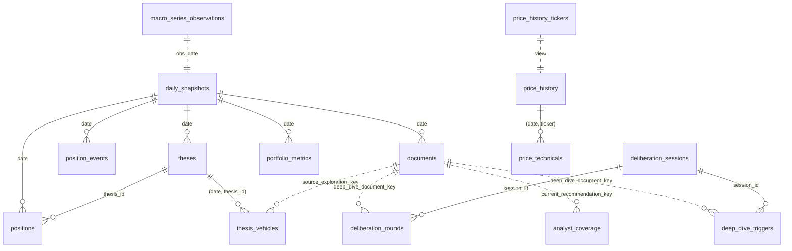

# Atlas Supabase Schema

Live Atlas Supabase schema. Source of truth: the numbered migrations under
`digiquant/supabase/migrations/`. This document inventories the
17 live tables (12 pre-024 + 5 new in migration 024) and diagrams the
high-value relationships.

> ADRs: [ADR-0008 research schema](../../../docs/adr/0008-atlas-research-schema.md),
> [ADR-0009 Supabase persistence](../../../docs/adr/0009-atlas-supabase-persistence.md),
> [ADR-0010 first-class thesis + deliberation](../../../docs/adr/0010-atlas-first-class-thesis-deliberation.md).

## ERD (primary relationships)

> Solid lines are FKs; dashed lines are logical pointers (documents.document_key
> strings — not enforced by FK because `documents` is partitioned and the
> pointer target may be in any partition).

## Per-table inventory

### Portfolio core (migration 001, partitioned since 011)

| Table | PK | Purpose |
|-------|----|---------|
| `daily_snapshots` | `(date)` | One consolidated JSON snapshot per calendar day. Root of the daily pipeline. |
| `positions` | `(date, ticker)` | Daily position book; one row per held ticker. |
| `theses` | `(date, thesis_id)` | Active investment theses per day; H1–H3 writers + H9 sync. Migration 025 adds `confidence`, `validation_criteria`, `invalidation_criteria`, `horizon`, `thesis_kind` (`market` \| `vehicle`), `linked_market_thesis_id`. |
| `position_events` | `(id uuid)` | Every open / close / rebalance against a position with reason tag. |
| `documents` | `(date, document_key)` | JSONB payload store for every narrative / structured artifact. Doc-type CHECK set by migration 023. |
| `nav_history` | `(date)` | Daily portfolio NAV. |
| `portfolio_metrics` | `(date, metric)` | Pre-computed Sharpe, vol, drawdown, exposure metrics. |

> `benchmark_history` was dropped in migration 010 — benchmark close series (SPY / QQQ / IWM …) now live as rows in `price_history`.

### Market data (migrations 005 / 007 / 015 / 018)

| Table | PK | Purpose |
|-------|----|---------|
| `price_history` | `(date, ticker)` | OHLCV history for all watchlist tickers. |
| `price_technicals` | `(date, ticker)` | 35+ pre-computed TA indicators per (date, ticker). |
| `macro_series_observations` | `(source, series_id, obs_date)` | FRED / Frankfurter / crypto FNG time series. |
| `price_history_tickers` | _(view)_ | Distinct tickers currently in `price_history`. |

### Hermes deliberation — new in migration 024

| Table | PK | Purpose |
|-------|----|---------|
| `thesis_vehicles` | `(date, thesis_id, ticker)` | Per-thesis vehicle map; FK → `theses (date, thesis_id)`. |
| `deliberation_sessions` | `(session_id UUID)` | One row per H6 deliberation session; `kind` is legacy (`baseline`, `delta_scoped`, `monthly`) — daily graph uses thesis-first H6 without separate session kinds. |
| `deliberation_rounds` | `(id BIGSERIAL)` | Round-loop persistence; unique on `(session_id, ticker, round_number)`. |
| `analyst_coverage` | `(date, ticker)` | Daily denormalized analyst ↔ ticker index. |
| `deep_dive_triggers` | `(id BIGSERIAL)` | Audit trail of every recess- or delta-watch- or manually- forced deep-dive. |

## RLS (consistent across all tables above)

- Every table has `ENABLE ROW LEVEL SECURITY`.
- Reads: per-table `{table}_anon_select` (or legacy `anon_read` on the
  001-era tables) policy granting `SELECT TO anon USING (true)`.
- Writes: require the Supabase `service_role` key. Supabase grants
  service_role bypass at the GRANT layer, so there is no explicit
  `service_role` policy on any Atlas table.

## Dead / deprecated

- `sec_recent_filings` — dropped in migration 017.
- `'Portfolio Recommendation'` doc_type — removed by migration 021.
- Partitioned children (`daily_snapshots_y2025`, `documents_y2026`, …) are
  implementation details of the partition strategy and are not inventoried
  here. See migration 004 and 006.

## How to extend

1. Create a new migration under `supabase/migrations/NNN_description.sql`.
2. Follow the RLS pattern above.
3. If the new table holds a structured projection of a `documents` payload,
   add a reference to it in this file under the "Hermes deliberation"
   section pattern and cite the source ADR.
4. Add a test under `tests/dq/atlas/test_migration_NNN.py`
   following the pattern in `test_migration_024.py` — pure-SQL parse check
   for offline unit tests, or `psycopg` round-trip for integration.
