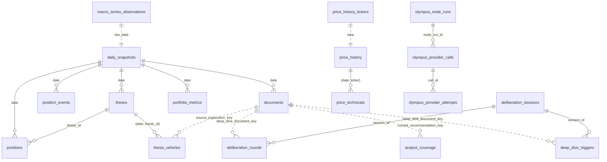

# Atlas Supabase Schema

<!--
# score:allow todo
-->

Live Atlas Supabase schema. Source of truth: the numbered migrations under
`digiquant/supabase/migrations/`. This document inventories the high-value tables and
relationships; later sections cover internal operational tables added after the original Atlas
schema.

> ADRs: [ADR-0008 research schema](../../../docs/adr/0008-atlas-research-schema.md),
> [ADR-0009 Supabase persistence](../../../docs/adr/0009-atlas-supabase-persistence.md),
> [ADR-0010 first-class thesis + deliberation](../../../docs/adr/0010-atlas-first-class-thesis-deliberation.md).

## ERD (primary relationships)

```mermaid
erDiagram
    daily_snapshots  ||--o{ positions             : "date"
    daily_snapshots  ||--o{ theses                : "date"
    daily_snapshots  ||--o{ position_events       : "date"
    daily_snapshots  ||--o{ documents             : "date"
    daily_snapshots  ||--o{ portfolio_metrics     : "date"

    theses           ||--o{ thesis_vehicles       : "(date, thesis_id)"
    theses           ||--o{ positions             : "thesis_id"

    documents        ||..o{ thesis_vehicles       : "source_exploration_key"
    documents        ||..o{ deliberation_rounds   : "deep_dive_document_key"
    documents        ||..o{ analyst_coverage      : "current_recommendation_key"
    documents        ||..o{ deep_dive_triggers    : "deep_dive_document_key"

    deliberation_sessions ||--o{ deliberation_rounds : "session_id"
    deliberation_sessions ||--o{ deep_dive_triggers  : "session_id"

    price_history        ||--o{ price_technicals : "(date, ticker)"
    price_history_tickers ||..|| price_history   : "view"

    macro_series_observations ||..|| daily_snapshots : "obs_date"

    olympus_node_runs ||--o{ olympus_provider_calls : "node_run_id"
    olympus_provider_calls ||--o{ olympus_provider_attempts : "call_id"
```

> Solid lines are FKs; dashed lines are logical pointers (documents.document_key
> strings — not enforced by FK because `documents` is partitioned and the
> pointer target may be in any partition).

## Per-table inventory

### Portfolio core (migration 001, partitioned since 011)

| Table | PK | Purpose |
|-------|----|---------|
| `daily_snapshots` | `(date)` | One consolidated JSON snapshot per calendar day. Root of the daily pipeline. |
| `positions` | `(date, ticker)` unique kept; T0 also adds `(workspace_id, date, ticker)` | Daily position book; one row per held ticker. Legacy unique retained until P6. |
| `theses` | `(date, thesis_id)` | Active investment theses per day; H1–H3 writers + H9 sync. Migration 025 adds daily thesis fields. Migration 056 adds stable `topic_key` and a partial unique `(date, topic_key)` index so only one nonterminal market opinion exists per topic/date. **No** `workspace_id` in T0 — shared research stays tenant-agnostic (system workspace conceptually; column deferred). |
| `position_events` | `(date, ticker)` unique kept; T0 also adds `(workspace_id, date, ticker)` | Every open / close / rebalance against a position with reason tag. |
| `documents` | `(date, document_key)` | JSONB payload store for every narrative / structured artifact. Doc-type CHECK set by migration 023. **No** `workspace_id` in T0 (same as theses). |
| `nav_history` | PK `(date)` kept; T0 also adds UNIQUE `(workspace_id, date)` | Daily portfolio NAV. |
| `portfolio_metrics` | `(date)` unique kept; T0 also adds `(workspace_id, date)` | Pre-computed Sharpe, vol, drawdown, exposure metrics. |

> `benchmark_history` was dropped in migration 010 — benchmark close series (SPY / QQQ / IWM …) now live as rows in `price_history`.

### Market data (migrations 005 / 007 / 015 / 018)

| Table | PK | Purpose |
|-------|----|---------|
| `price_history` | `(date, ticker)` | OHLCV history for all watchlist tickers. |
| `price_technicals` | `(date, ticker)` | 35+ pre-computed TA indicators per (date, ticker). |
| `macro_series_observations` | `(source, series_id, obs_date)` | FRED / Frankfurter / crypto FNG time series. |
| `price_history_tickers` | _(view)_ | Distinct tickers currently in `price_history`. |

### Hermes deliberation — new in migration 024

| Table | PK | Purpose |
|-------|----|---------|
| `thesis_vehicles` | `(date, thesis_id, ticker)` | Per-thesis vehicle map; FK → `theses (date, thesis_id)`. |
| `deliberation_sessions` | `(session_id UUID)` | One row per H6 deliberation session; `kind` is legacy (`baseline`, `delta_scoped`, `monthly`) — daily graph uses thesis-first H6 without separate session kinds. |
| `deliberation_rounds` | `(id BIGSERIAL)` | Round-loop persistence; unique on `(session_id, ticker, round_number)`. |
| `analyst_coverage` | `(date, ticker)` | Daily denormalized analyst ↔ ticker index. |
| `deep_dive_triggers` | `(id BIGSERIAL)` | Audit trail of every recess- or delta-watch- or manually- forced deep-dive. |

### Strategy store — new in migration 046 (#1064)

This project is the unified digiquant **`core`** backend (Supabase display name `core`;
local alias still `project_id "digiquant-atlas"`). Migration 046 adds the strategy store
(additive only — no existing table touched). See
[`docs/adr/0021-digiquant-supabase-project-topology.md`](../../docs/adr/0021-digiquant-supabase-project-topology.md).

| Table | PK | Purpose |
|-------|----|---------|
| `strategies` | `(id)` | One row per strategy: `symbol`, `label`, `engine`, `config` jsonb, `enabled`, `version`. Public-readable. |
| `strategy_calibrations` | `(strategy_id)` | **Private** 1:1 sidecar; fitted `calibration` jsonb. FK → `strategies (id)`. Service-role-only (see RLS exception). |
| `strategy_trades` | `(id BIGINT)` | Executed trade history; FK → `strategies (id)`. Indexed `(strategy_id, entry_ts DESC)`. |
| `strategy_tearsheets` | `(strategy_id)` | Latest tearsheet payload (`metrics` jsonb, `equity_curve` jsonb, `as_of`). |
| `strategy_signals` | `(strategy_id)` | Current state: `position` (long/flat/short), `last_signal_date`, `last_price`, `as_of`. |

### Public portfolio surface — views only, new in migration 050 (#1461/#1462)

The anon-readable read surface for digiquant.io's live portfolio page (user ruling
2026-07-10, #1462: performance metrics only, never research notes). Curated
security-definer views — the SELECT list is the privacy allowlist; no new tables.
They pair with the `functions/prices-live/` edge function (see [`README.md`](README.md)).

| View | Backed by | Purpose |
|------|-----------|---------|
| `public_portfolio_positions` | `positions` | Latest-date position book, performance columns only. **Excludes** `rationale`, `pm_notes`, `thesis_id`, `conviction`, `stop_loss_pct`, `target_pct_gain`, `horizon_days`. |
| `public_nav_history` | `nav_history` | Legacy NAV series + cash/invested % + derived `day_return_pct` (rollback target). |
| `public_price_latest` | `price_history` | Latest daily close per ticker — valuation fallback outside market hours (`prices-live` is live, not dormant, since 2026-07-13). |

### Public accounting surface — migration 074 (#2599 / Task 3.4) + 084/085

Curated security-definer views over private `olympus_accounting_*` tips. Prefer these
for digiquant.io / Olympus performance readers after the shadow reconciliation gate.
**Never GRANT** base accounting tables to `anon`. T0 migration 098 adds workspace-scoped
`authenticated` SELECT (own-workspace RLS only; `service_role` remains the sole writer).
Rollback = repoint adapters to `public_nav_history` / `nav_history` without deleting
accounting rows.

| View | Purpose |
|------|---------|
| `public_accounting_period_status` | Tip periods (final **and** incomplete/estimated/failed) with `status` + `quality_reasons` — incomplete stays explicit. |
| `public_finalized_nav` | Final tip closing equity only (`source`/`contract` = `finalized_accounting`). |
| `public_accounting_nav_history` | Finalized preferred; dates without a final tip use labeled legacy (`source=legacy_nav_history`, `contract=legacy_estimate`). Same date never mixes sources. |
| `public_daily_realized_attribution` | Final-tip per-ticker contribution pct; empty when no final tip (no lookback substitution). |

**Tip selection / children (#2780):** public tip and final views require the same
child-completeness gate as Python `select_final_period` /
`period_children_complete` (activity ⇒ ≥1 contribution; every positive
`closing_quantity` contribution has a matching holding). Migration
`085_olympus_accounting_tip_children_complete.sql` (CREATE OR REPLACE). A mid-chain
crash that leaves a FINAL period row without children must not publish as a
public tip.

**`day_return_pct` (084 / #2779):** `(closing_equity − opening_equity) / opening_equity`
(×100), matching engine identity `E1 = E0 + net_pnl_total + cash_pnl` — not
`net_pnl_total / E0` alone. Migration 074's formula is superseded by
`084_olympus_accounting_day_return_pct.sql`; 085 retains that equity-delta formula.

**Cutover gate:** point public readers only after an approved shadow interval (including one
rebalance session) has zero unexplained reconciliation failures. Do **not** enable
`OLYMPUS_ACCOUNTING_FINALIZER=on` until ops/shadow evidence is approved.

**Prod deploy invariant (#3029):** Olympus / digiquant.io readers already query
`public_accounting_nav_history`. If that view is missing (`PGRST205`), Performance and
the homepage live book fail closed with a typed contract error — they must **not** silently
re-point to `public_nav_history` in the browser. Apply migrations **072–074** (and later
084/085 replacements) on the core project before expecting NAV/statistics to render.

### ProfileConfig — migration 075 (#2609 / Track B)

Private append-only versioned investment overlay pins for Olympus preflight. The
digithings-owned **house** row (`profile_key='house'`, `is_house_default=true`) is the
immutable always-on default run. Overlay rows may request different universe / risk /
themes / budgets; they must not claim the house key or cancel/replace the house run.

| Table | PK | Purpose |
|-------|----|---------|
| `olympus_profile_config` | `(id UUID)` | Exact pin id (= `ProfileConfig.version_id`). Columns: `profile_key`, `schema_version`, `is_house_default`, `label`, `payload` (jsonb full ProfileConfig), optional `supersedes_id`, `recorded_at`. CHECK enforces house key ↔ house flag. Partial unique index: one current house root. |

RLS enabled with **zero** policies; `PUBLIC`/`anon`/`authenticated` fully revoked;
`service_role` reset then `SELECT, INSERT` only; `reject_olympus_profile_config_mutation()`
blocks `UPDATE`/`DELETE`/`TRUNCATE`. Models/loader:
`digiquant.olympus.profile_config`. Preflight pins via
`pin_profile_config_for_preflight` into `AtlasConfigBundle.profile_config*`.

### Shared research corpus — migration 076 (#2613 / Track B WP12-class)

Private append-only **tenant-agnostic** research corpus pins. Keys are
`theme:` / `asset:` / `segment:` only — no profile/user id in the key. House
writers publish defaults; overlays may only publish-if-missing (application
layer). Portfolio/book data does not belong here.

| Table | PK | Purpose |
|-------|----|---------|
| `olympus_research_corpus` | `(id UUID)` | Exact pin id (= `ResearchCorpusPin.version_id`). Columns: `corpus_key`, `schema_version`, `writer_role` (`house` \| `overlay_request`), `label`, `summary`, `payload` (jsonb; CHECK forbids tenant keys), `recorded_at`. Unique on `corpus_key`. |

RLS enabled with **zero** policies; `PUBLIC`/`anon`/`authenticated` fully revoked;
`service_role` reset then `SELECT, INSERT` only; `reject_olympus_research_corpus_mutation()`
blocks `UPDATE`/`DELETE`/`TRUNCATE`. Models/store:
`digiquant.olympus.research_corpus` (`ResearchCorpusStore.publish_if_missing`).

### Research-state store — migration 088 (#2854 / WP12.2)

Private append-only exact-version research memory for Phase 3 WP12 contracts
(`EvidenceRecord`, `BeliefVersion`, `ExpectedEventVersion`, `ResearchPatch`,
`LegacyDocumentRef`, `ResearchStateVersion`, `ResearchStatePin`). Distinct from
Track B corpus pins (theme/asset/segment identity). Dark launch: no public base
view, no historical backfill, no prose parsing. Application boundary:
`digiquant.olympus.research_retrieval.store.ResearchStateStore` (in-memory for
unit tests; migration 088 is the durable schema — SQL IO adapter later). Pin
temporal ordering is also enforced in SQL via migration 089
(`requested_as_of <= knowledge_cutoff_at <= pinned_at`).

| Table | PK | Purpose |
|-------|----|---------|
| `olympus_research_evidence` | `(evidence_id UUID)` | Immutable evidence leaf + payload jsonb; optional supersedes FK; temporal columns + content_hash. |
| `olympus_research_belief_versions` | `(belief_version_id UUID)` | Append-only belief versions; supersession via child INSERT. |
| `olympus_research_expected_event_versions` | `(expected_event_version_id UUID)` | Append-only expected-event versions. |
| `olympus_research_patches` | `(patch_id UUID)` | Structured research patches (never derived from prose). |
| `olympus_research_legacy_refs` | `(legacy_ref_id UUID)` | Inventory-only legacy prose refs; `known_at` CHECK NULL; strict readers exclude. WP12.4 inventory library/script (`scripts/atlas/backfill_research_state.py`, #2870) targets in-memory `ResearchStateStore` today; SQL IO adapter later. |
| `olympus_research_state_versions` | `(state_version_id UUID)` | Content-addressed state snapshots + optional parent FK + manifest payload. |
| `olympus_research_state_pins` | `(run_id, attempt_id)` | Exact run/attempt pin to one `state_version_id`; no `load_latest` after pin. |

RLS enabled with **zero** policies; `PUBLIC`/`anon`/`authenticated` fully revoked;
`service_role` reset then `SELECT, INSERT` only; `reject_olympus_research_state_mutation()`
blocks `UPDATE`/`DELETE`/`TRUNCATE`. Preflight wiring of pins = WP12.3.
Compiled prose brief/digest views (#2877 / WP12.5) are deterministic dual-write
documents (`research-state-brief` / `research-state-digest`) from exact pinned
versions — not authoritative state tables. Default Atlas/Hermes CLI leave
`research_state_store` unwired, so these document keys are not published until
callers inject the store.

### Ticker evidence bundles — migration 090 (#2844 / WP11.1 + #2892 / WP11.2)

Private append-only H5 base evidence bundles and H6 missing-fact amendments.
Contracts: `TickerEvidenceBundle`, `MissingFactRequest`,
`EvidenceBundleAmendment` in `digiquant.olympus.research_retrieval.models`.
Application boundary: `EvidenceBundleStore` (in-memory for unit tests; SQL IO
adapter later). WP11.2 builds typed H5 bases into
`phase_hermes.ticker_evidence_bundles` before the provider call; default Hermes
graph leaves the store unwired (append + `OLYMPUS_EVIDENCE_BUNDLE_WRITER` only
when a caller injects a store). Dark launch: no public base view, no historical
backfill, no H6 selection cutover (WP11.3+), not operator-durable until SQL IO
+ wiring. Bundles cite `state_version_id` + `evidence_ids` for WP12 lineage;
amendments must reference one base and one missing-fact request (zero unlinked
amendments). Unique `(source_run_id, ticker)` enforces one base per run/ticker;
content-idempotent retry is a no-op. Migration
`091_olympus_evidence_amendment_base_match.sql` adds a BEFORE INSERT/UPDATE
trigger so amendment `base_bundle_id` must equal the linked request's
`base_bundle_id` (090 FKs alone allow a cross-link).

| Table | PK | Purpose |
|-------|----|---------|
| `olympus_ticker_evidence_bundles` | `(bundle_id UUID)` | Immutable H5 base bundle + payload jsonb; unique run/ticker and run/ticker/content. |
| `olympus_missing_fact_requests` | `(request_id UUID)` | Named missing-fact request FK → base bundle. |
| `olympus_evidence_bundle_amendments` | `(amendment_id UUID)` | Append-only H6 supplement FK → base + request; `091` requires request.base = amendment.base. |

RLS enabled with **zero** policies; `PUBLIC`/`anon`/`authenticated` fully revoked;
`service_role` reset then `SELECT, INSERT` only; `reject_olympus_evidence_bundle_mutation()`
blocks `UPDATE`/`DELETE`/`TRUNCATE`.

### Attention context store — migration 092 (#2922 / WP13.2)

Private append-only research attention plans, decisions, context manifests, and
policy evaluations. Links each decision to WP1 `olympus_provider_attempts` for
planned-vs-actual reconciliation (WP13.5/WP16). No runtime Atlas/Hermes
activation in 13.2 — storage boundary only; no public base view.

| Table | PK | Purpose |
|-------|----|---------|
| `olympus_attention_plans` | `(plan_id UUID)` | One attention plan per run/attempt: state_version_id, policy_content_hash, rollout_mode, total_budget jsonb, payload. |
| `olympus_attention_decisions` | `(decision_id UUID)` | Per-target decision FK → plan; mode/reason/budget/features payload; unique (plan_id, target_key). |
| `olympus_attention_decision_attempts` | `(decision_id, provider_attempt_id)` | Junction FK → decision + `olympus_provider_attempts` (exact usage linkage, not aggregate-only). |
| `olympus_attention_context_manifests` | `(manifest_id UUID)` | Role-specific context manifest rows (WP14 compiler populates; storage in 13.2). |
| `olympus_attention_policy_evaluations` | `(evaluation_id UUID)` | Shadow/enforced reconciliation report; `complete=false` when telemetry missing. |

RLS enabled with **zero** policies; `PUBLIC`/`anon`/`authenticated` fully revoked;
`service_role` reset then `SELECT, INSERT` only; `reject_olympus_attention_context_mutation()`
blocks `UPDATE`/`DELETE`/`TRUNCATE`. Writer/reader:
`digiquant.olympus.research_retrieval.store.AttentionStore`.

### Outcome learning — migration 093 (#2959 / WP15.2)

Private append-only outcome episodes, component attribution reports, and structured
lesson versions. Contracts: `OutcomeEpisode`, `ComponentAttributionReport`,
`OutcomeLessonVersion` in `digiquant.olympus.learning.outcome_models`.
Application boundary: `OutcomeLearningStore` (in-memory for unit tests; SQL IO
adapter later). Dark launch: no public base view, no historical backfill, no
assembler/compiler wiring (WP15.3+). Supersession appends child versions;
`select_episode_as_of` / `select_lesson_as_of` honor `available_at` and knowledge
cutoff; exact load never fabricates history.

| Table | PK | Purpose |
|-------|----|---------|
| `olympus_outcome_episodes` | `(episode_version_id UUID)` | Immutable episode version + temporal columns + payload jsonb; optional supersedes FK. |
| `olympus_component_attribution_reports` | `(report_id UUID)` | Typed component observations FK → episode version. |
| `olympus_outcome_lesson_versions` | `(lesson_version_id UUID)` | Structured lesson version + episode/report membership in payload; optional supersedes FK. |

RLS enabled with **zero** policies; `PUBLIC`/`anon`/`authenticated` fully revoked;
`service_role` reset then `SELECT, INSERT` only; `reject_olympus_outcome_learning_mutation()`
blocks `UPDATE`/`DELETE`/`TRUNCATE`.

### Policy replay governance — migration 094 (#2983 / WP16.2)

Private append-only policy replay manifests, pairs, run lifecycle events, arm
results, comparison reports, gate criteria versions, evaluations, and human
governance decisions. Contracts: WP16.1 replay models plus
`digiquant.olympus.replay.governance_models` persistence envelopes.
Application boundary: `PolicyReplayStore` (in-memory for unit tests; SQL IO
adapter later). Dark launch: no public base view, no historical backfill, no
worker/governance evaluator wiring (WP16.3+). Run status is derived from
append-only events — no mutable running-status row. Manifest/pair dedupe on
content hash; `load_gate_evidence` reconstructs full lineage from immutable IDs.

| Table | PK | Purpose |
|-------|----|---------|
| `olympus_replay_input_manifests` | `(record_id UUID)` | Content-addressed `ReplayInputManifest`; unique `manifest_content_hash`. |
| `olympus_replay_pairs` | `(record_id UUID)` | `ReplayPairSpec` FK → shared manifest hash; unique `pair_content_hash`. |
| `olympus_replay_run_events` | `(event_id UUID)` | Append-only lifecycle events; unique `(run_id, sequence)`. |
| `olympus_replay_arm_results` | `(record_id UUID)` | Immutable final `PortfolioReplayResult` per `(run_id, arm_id)`. |
| `olympus_policy_comparison_reports` | `(comparison_id UUID)` | Immutable comparison envelope; FK → pair + manifest hashes. |
| `olympus_gate_criteria_versions` | `(criteria_version_id UUID)` | Human-authored criteria; optional supersedes FK. |
| `olympus_gate_evaluations` | `(evaluation_id UUID)` | Immutable gate evaluation FK → comparison + criteria. |
| `olympus_policy_governance_decisions` | `(decision_id UUID)` | Authenticated human decision FK → evaluation; optional supersedes FK. |

RLS enabled with **zero** policies; `PUBLIC`/`anon`/`authenticated` fully revoked;
`service_role` reset then `SELECT, INSERT` only; `reject_olympus_policy_replay_mutation()`
blocks `UPDATE`/`DELETE`/`TRUNCATE`.

### Forecast registry — migration 079 (#2663 / WP4.6)

Private append-only prospective H5/H6 forecast lineage. Written after H9 portfolio
booking only; registry failure is fail-soft and cannot rebook. No historical
backfill, no prompt/reasoning bodies, no public base view.

| Table | PK | Purpose |
|-------|----|---------|
| `olympus_forecast_assessments` | `(forecast_id UUID)` | Immutable H5 `ForecastAssessment` base: ticker, run/provider/prompt/artifact versions, terms jsonb, price_anchor jsonb, content_hash, effective_at, known_at, recorded_at. |
| `olympus_forecast_amendments` | `(amendment_id UUID)` | Immutable H6 `ForecastAmendment`: FK to base, optional supersedes_amendment_id, reason, terms, evidence/contradiction id arrays, content_hash, times. |

RLS enabled with **zero** policies; `PUBLIC`/`anon`/`authenticated` fully revoked;
`service_role` reset then `SELECT, INSERT` only; `reject_olympus_forecast_registry_mutation()`
blocks `UPDATE`/`DELETE`/`TRUNCATE`. Writer/readers:
`digiquant.olympus.atlas.forecast_registry`.

### Forecast calibration registry — migration 080 (#2672 / WP5.1, writers #2676+#2680+#2684)

Private append-only prospective outcome labels and shadow calibration versions.
No historical backfill, no portfolio-contribution columns, no public base view.
WP5.1 shipped schema + Pydantic contracts; WP5.2 adds the trading-session outcome
resolver (`digiquant.olympus.atlas.forecast_outcomes`) writing
`olympus_forecast_outcomes` only. WP5.3 adds the pure deterministic shrinkage
calibrator (`digiquant.olympus.hermes.forecast_calibration`). WP5.4 attaches at the
H6→H7 boundary and persists via `forecast_registry.persist_shadow_calibrations`
into `olympus_forecast_calibrations` + `olympus_calibrated_forecasts` (H9 fail-soft).
H8 cutover remains later.

| Table | PK | Purpose |
|-------|----|---------|
| `olympus_forecast_outcomes` | `(outcome_id UUID)` | Immutable `ForecastOutcome`: base/effective IDs, **`horizon_sessions`** (WP5/#2797), reference/maturity sessions + snapshots, forecast_mean/realized/signed_residual, positive_label, status, event/known times, content_hash. FK → assessments. **Unique** `(effective_forecast_id, maturity_session)` via migration 087. |
| `olympus_forecast_calibrations` | `(calibration_id UUID)` | Immutable `ForecastCalibration`: cohort/prior/method, sample + equivalent size, bias/dispersion/Brier/log/reliability, outcome_ids[], status, times, content_hash. |
| `olympus_calibrated_forecasts` | `(calibrated_forecast_id UUID)` | Shadow `CalibratedForecast`: base/effective IDs, optional calibration FK, expected return / error std / downside quantiles / positive probability / reliability weight, status, times, content_hash. |

RLS enabled with **zero** policies; `PUBLIC`/`anon`/`authenticated` fully revoked;
`service_role` reset then `SELECT, INSERT` only; `reject_olympus_forecast_calibration_mutation()`
blocks `UPDATE`/`DELETE`/`TRUNCATE`. Models:
`digiquant.olympus.hermes.models.forecast_calibration`. Outcome writer:
`digiquant.olympus.atlas.forecast_outcomes` (WP5.2). Shadow calibrator + attach:
`digiquant.olympus.hermes.forecast_calibration` (WP5.3/5.4). Calibration table writers:
`digiquant.olympus.atlas.forecast_registry.persist_shadow_calibrations` (WP5.4 / H9).

### Risk policy snapshot registry — migration 081 (#2698 / WP6.3)

Private append-only resolved H8 risk inputs: one `RiskPolicy` + one `CovarianceSnapshot`
per run, plus a run ref binding `source_run_id`. Resolver runs at the H8 entry boundary;
H9 fail-soft persistence via `digiquant.olympus.atlas.risk_policy_registry` after booking.
Phase 1 audit artifact for policy/covariance; WP8.4 may consume the paired
`AllocationInputBundle` for calibrated raw weights while leaving these registry
tables observational.

| Table | PK | Purpose |
|-------|----|---------|
| `olympus_risk_policies` | `(policy_id UUID)` | Immutable resolved `RiskPolicy`: method_version, status, unavailable_reason, effective_at, content_hash, full `policy_body` jsonb. |
| `olympus_covariance_snapshots` | `(snapshot_id UUID)` | Immutable `CovarianceSnapshot`: as_of_session, lookback_days, status, resolved_at, content_hash, full `snapshot_body` jsonb. |
| `olympus_h8_risk_run_refs` | `(source_run_id text)` | One ref per run: run_date, policy_id FK, snapshot_id FK, effective_at. |

RLS enabled with **zero** policies; append-only via `reject_olympus_risk_policy_snapshot_mutation()`.
Models: `digiquant.olympus.hermes.models.risk_policy`. Resolver: `digiquant.olympus.hermes.risk_policy`.
Registry: `digiquant.olympus.atlas.risk_policy_registry` (exact-ID reads only).

### Pre-trade risk report registry — migration 083 (#2754 / WP9.4)

Private append-only `PreTradeRiskReport` rows bound to the final H8 book H9 commits.
H8 attaches the observational report after final controls; H9 validates identity
(content hash, final-book fingerprint, allocation-bundle hash) then INSERT-only
persists. Exact retry (same `report_id` + hash) skips; content conflict never UPDATE.
Rollout: `OLYMPUS_PRETRADE_RISK_MODE=off|shadow|enforce` (default `shadow`).

| Table | PK | Purpose |
|-------|----|---------|
| `olympus_pretrade_risk_reports` | `(report_id UUID)` | Immutable report: source_run_id, session_date, status, report_content_hash, allocation_input_bundle_hash, final_book_weights_fingerprint, optional ledger_commit_id, full `report_body` jsonb. |

RLS enabled with **zero** policies; append-only via `reject_olympus_pretrade_risk_report_mutation()`.
Contract: `digiquant.olympus.hermes.allocation_contracts.PreTradeRiskReport`.
Registry: `digiquant.olympus.atlas.pretrade_risk_registry`.
H9 surface: `hermes.writers.commit_io.validate_pretrade_risk_report` /
`persist_validated_pretrade_risk_report`.

### Live quote transport — new in migration 063 (#1807)

The only **table** in the digiquant.io public read surface (the 050 trio are views), and the
only table this migration chain adds to the `supabase_realtime` publication — `063` holds
the chain's sole `ALTER PUBLICATION`. Written once a minute by the `functions/prices-live/`
edge function under pg_cron; browsers subscribe to `postgres_changes` on it rather than to
the retired `prices:live` broadcast channel.

| Table | PK | Purpose |
|-------|----|---------|
| `prices_live` | `(ticker)` | Latest intraday quote per symbol, upserted in place: `price` (Finnhub `c`, NOT NULL, may legitimately be `0` for a halted symbol), `change` (`d`), `change_pct` (`dp`, percent **points**), `quoted_at` (exchange clock — Finnhub's unix **seconds** `t`, converted), `updated_at` (our write clock). |

- **RLS enabled, exactly one policy** — `prices_live_public_read`, `FOR SELECT TO anon,
  authenticated USING (true)`. **Zero write policies**, and that absence is the whole
  security model (see RLS below). `service_role` is the only writer.
- **`REPLICA IDENTITY DEFAULT`**, set explicitly. Realtime's `walrus` decoder re-evaluates
  the SELECT policy against the *live* row keyed by the replicated identity, so only the key
  must survive replication. `FULL` would be needed only for a policy reading a non-key
  column or a consumer needing non-key columns out of a DELETE — neither exists.
- **Member of the `supabase_realtime` publication**, added under a guarded `DO` block
  (`ALTER PUBLICATION … ADD TABLE` raises 42710 on re-run, which would roll the whole
  migration back). Without publication membership the table is written and no browser ever
  sees an update.
- **No CHECK constraints and no secondary index**, both argued rather than accidental: this
  is a ≤40-row throwaway cache refreshed every 60s and it should degrade, not abort — a
  ticker-casing CHECK would turn a publisher bug into a 23514 that fails the whole minute's
  upsert (the `documents` doc_type/category churn, #628/#1005/#1383), and a `price > 0`
  CHECK would reject Finnhub's legitimate zero for a halted symbol.

### Refresh rate lease — new in migration 064 (replaces the #1756 invocation secret)

The rate guard on the `prices-live` publisher. Finnhub's free tier is 60 calls/min, and
`verify_jwt: true` never protected it — the anon key ships in every digiquant.io bundle, so
anyone can invoke the function. `064` bounds the **rate** instead of the caller's identity:
every invocation must first win an atomic claim on this table, so at most one refresh happens
per 50s window no matter how many callers arrive together. Unauthorized callers are not
blocked; they are made pointless (`200 {"skipped": "not claimed"}`, nothing fetched).

| Table | PK | Purpose |
|-------|----|---------|
| `prices_live_lease` | `(id smallint)` | Singleton lease — exactly one row, pinned by `PRIMARY KEY` **plus** `CHECK (id = 1)`. `claimed_at timestamptz NOT NULL DEFAULT '-infinity'` records when the refresh window was last claimed. |

- **One row is a correctness requirement, not tidiness.** The guard's whole argument is that
  concurrent callers contend for *the same row*; two rows would be two independent windows and
  two simultaneous winners. Hence PK and CHECK on the same column.
- **`claimed_at` defaults to `'-infinity'`** so the first claim after a fresh apply or a
  restore wins immediately. `NULL` would make the age predicate NULL — never true, i.e. a
  permanently dead feed with no error anywhere — and `now()` would blank the feed for the first
  window after every restore. Re-seeding is `ON CONFLICT (id) DO NOTHING`, so replaying the
  migration during market hours cannot reset a live lease.
- **`claim_prices_live_refresh(min_age_seconds integer) → boolean`** is the only path that
  touches it: ONE conditional `UPDATE … WHERE id = 1 AND claimed_at < clock_timestamp() -
  make_interval(secs => min_age_seconds)`, returning `FOUND`. Concurrent callers block on the
  row lock, re-evaluate the WHERE clause against the committed new value under READ COMMITTED,
  and match zero rows. It raises if `min_age_seconds` is NULL or `< 1` — a `0` would let every
  caller win and disable the guard silently. See the RLS and SECURITY DEFINER notes below.
- **Never replace the claim with a freshness `SELECT` on `prices_live.updated_at`.** That
  timestamp is written ~6s *after* a fetch starts (40 symbols × 150 ms stagger), so every
  concurrent caller would read the same stale value and all would fetch — zero protection
  against parallel callers, and a sequential test of it passes perfectly. Advisory locks cannot
  substitute either: PostgREST hands out a fresh pooled session per RPC call, so the lock
  releases long before the fetch it was meant to cover. Full argument, with measurements, in
  `migrations/064_prices_live_lease.sql`.

  ### Private provider telemetry — new in migration 067 (#1951)

  Prospective internal evidence for provider-call economics and reliability. This schema separates a
  graph node execution from a logical call and from each physical provider attempt. It does not
  backfill historical calls from aggregate diagnostics and exposes no public view.

  | Table | PK | Purpose |
  |-------|----|---------|
  | `olympus_node_runs` | `(node_run_id UUID)` | Stable graph-node execution identity, lifecycle, event time, generic artifact references, and a nullable bounded `fanout_key` naming which fan-out item the execution was for. |
  | `olympus_provider_calls` | `(call_id UUID)` | Logical purpose, cache result, parent call, requested model, and physical-attempt count; FK to `olympus_node_runs`. |
  | `olympus_provider_attempts` | `(attempt_id UUID)` | One physical transport attempt with unique `(call_id, attempt_number)`, served model, retry reason, nullable usage/cost, and sanitized error type. |

  `fanout_key` (#1978) is an opaque producer-supplied label, bounded 1–200 to match
  `NodeRunRecord.fanout_key`. NULL means *this execution had no fan-out cursor* — never
  *instrumentation missing*: Atlas sector nodes and the compile-time per-ticker Hermes variants
  carry their discriminator in `node_name` instead. The column is deliberately generic; `ticker`
  and `symbol` are in the migration test's forbidden-column list so the Olympus vocabulary cannot
  leak into the shared ledger.

  All three tables use `timestamptz` for producer event times and add `recorded_at` from the database
  write clock. Missing provider usage and cost remain NULL. Prompts, responses, search text, API keys,
  secrets, and raw exceptions have no storage columns.

  RLS is enabled with no policies and all privileges are revoked from `PUBLIC`, `anon`, and
  `authenticated`. Privileges are revoked from `service_role` **before** the grant, because a Supabase
  project carries `ALTER DEFAULT PRIVILEGES ... GRANT ALL ON TABLES TO service_role` and an additive
  grant alone leaves the inherited `UPDATE`/`DELETE`/`TRUNCATE` in place; after the revoke,
  `service_role` holds only `SELECT` and `INSERT`. Mutation-rejection triggers deny `UPDATE` and
  `DELETE` per row and `TRUNCATE` per statement, including owner-class sessions, so any future
  correction must append explicit superseding evidence rather than rewrite history. A
  `chk_olympus_provider_calls_terminal_disposition` constraint mirrors the producer's Pydantic rule in
  SQL — a `failed` call must carry `call_failed` and a `cancelled` call `call_cancelled` — so a
  mislabelled terminal disposition cannot be persisted by a writer that bypasses the models. Task #1951 creates no writer or public
  reader; later instrumentation registers the fail-soft observer and batches these records.

### Portfolio lineage ledger - new in migration 069 (#2415)

Prospective, append-only contracts closing finding OLY-REV-009: decision intent, target
approval, order intent, fill, and holding state were previously conflated across
`positions`/`decision_log`/snapshots. Eight tables form one replayable chain and add no
writer — H9 `commit_run` stays the sole authoritative booking path.

| Table | PK | Purpose |
|-------|----|---------|
| `portfolio_ledger_commits` | `(id UUID)` | Root of one lineage run: `run_date`, `policy_version_id`, no `status` column — self-FK `supersedes_id` (backward-only, never a forward pointer), scoped by a composite `FOREIGN KEY (supersedes_id, run_date) REFERENCES ... (id, run_date)` so a row can only supersede one from its own run_date, plus a partial unique index (`run_date` WHERE `supersedes_id IS NULL`) enforce currency structurally instead. |
| `portfolio_ledger_decision_intents` | `(id UUID)` | `action` (add/trim/exit/no_op/reject) plus a mandatory closed-vocabulary `reason`, cross-checked so only a valid action/reason pair persists; FK to `portfolio_ledger_commits`. |
| `portfolio_ledger_requested_targets` | `(id UUID)` | Pre-adjustment target weight/quantity, nullable with no DEFAULT (missing stays `NULL`, never fabricated to `0`) and mutually exclusive — exactly one of weight/quantity must be set (XOR), never both; an explicit `0` remains a legal value once set; FK to `portfolio_ledger_decision_intents`. |
| `portfolio_ledger_target_adjustments` | `(id UUID)` | One adjustment step (`TargetAdjustmentType`: legacy `cap`/`rounding`/`carry` plus the 12 H8 reason codes; CHECK widened in migration 095) with `original_value`/`adjusted_value` (`>= 0`, may legitimately be zero); reduce-only types may only reduce the value; no supersession concept — it's a point-in-time audit step; FK to `portfolio_ledger_requested_targets`. Producer: H9 `ledger_io.append_commit_chain` (#2768). |
| `portfolio_ledger_approved_targets` | `(id UUID)` | Post-adjustment approved weight/quantity, nullable with no DEFAULT (missing stays `NULL`, never fabricated to `0`) but *not* mutually exclusive — at least one of weight/quantity must be set (OR), both allowed, and an explicit `0` remains legal — with self-FK `supersedes_id` (backward-only), scoped by a composite `FOREIGN KEY (supersedes_id, run_date, symbol) REFERENCES ... (id, run_date, symbol)` so a row can only supersede one from its own run_date and symbol — a changed same-date target is a new row, never a rewrite; FK to `portfolio_ledger_requested_targets`. |
| `portfolio_ledger_order_intents` | `(id UUID)` | `quantity NOT NULL CHECK (> 0)`, terminal `status` (pending/executed/rejected — no `superseded` value; supersession is orthogonal to status), self-FK `supersedes_id` (backward-only), likewise scoped by a composite `FOREIGN KEY (supersedes_id, run_date, symbol) REFERENCES ... (id, run_date, symbol)`, `rejection_reason` required exactly when rejected; FK to `portfolio_ledger_approved_targets`. |
| `portfolio_ledger_paper_executions` | `(id UUID)` | Immutable fill: `quantity`/`price` both `NOT NULL CHECK (> 0)`, `id` a deterministic `uuid5(order_intent_id, executed_date)` backed by `UNIQUE (order_intent_id, executed_date)` so an exact-same-date retry reproduces the identical row instead of duplicating; FK to `portfolio_ledger_order_intents`. |
| `portfolio_ledger_holding_lots` | `(id UUID)` | Lot `quantity`/`open_price` (`NOT NULL CHECK (> 0)`), `status` (open/closed) tying `closed_at`/`closed_by_execution_id` nullability to status, opening and closing executions forced distinct; FKs to `portfolio_ledger_paper_executions`. Cutover may seed open lots via one labeled `portfolio_ledger_commits.policy_version_id = legacy_opening_snapshot` chain (#2589) — not invented pre-cutover P&L. |

### position_events book_source labeling - new in migration 071 (#2422)

Compatibility Activity projection labeling (Task 2.5). Does **not** expose private ledger
tables.

| Object | Purpose |
|--------|---------|
| `position_events.book_source` | `NOT NULL DEFAULT 'legacy'` with `CHECK IN ('legacy','authoritative')`. Existing history stays `legacy` permanently. |
| `olympus_position_events` | security_invoker view of all events including `book_source`. |
| `olympus_position_events_authoritative` | Same columns, `WHERE book_source = 'authoritative'` only — never includes legacy rows. |

Writers: `execute_at_open.py` stamps `authoritative` on the ledger path and `legacy` on every
prose path. Cutover/retirement of prose writers is gated on seeded `holding_lots` and removal
of `--no-ledger` (see ARCHITECTURE.md cutover section), not on this migration alone.

### Period accounting - migration 072 (#2596) + finalizer (#2597)

Private event-boundary EOD accounting schema (Phase 0 Tasks 3.1–3.2). User-private
portfolio/accounting — never grant base tables to `anon`. T0 migration 098 adds
`authenticated` SELECT (workspace-scoped RLS) only; writes remain `service_role`.
Curated public views land in migration `074_olympus_accounting_views.sql` (#2599).

| Table | PK | Purpose |
|-------|----|---------|
| `olympus_accounting_periods` | `(id UUID)` | One reconciled (or explicitly non-final) period: opening/closing equity & cash, gross/net PnL, fees/slippage, residual, Decimal tolerances, optional benchmark, `status` (`final`/`estimated`/`incomplete`/`failed`), `quality_reasons[]`, backward-only `supersedes_id`. `status=final` requires empty `quality_reasons`. Deterministic `id` from the pure engine. |
| `olympus_accounting_contributions` | `(id UUID)` | Per-ticker gross/net PnL, fees, slippage, contribution fraction; FK `(period_id, period_date)` → periods. Deterministic ids from `(period_id, symbol)`. |
| `olympus_accounting_holdings` | `(id UUID)` | EOD holdings (`quantity`, nullable `mark`/`market_value`); FK to periods. Deterministic ids from `(period_id, symbol)`. |

RLS enabled with **zero anon policies**; T0 migration 098 adds workspace-scoped
`authenticated` SELECT. `PUBLIC`/`anon` fully revoked; `authenticated` receives
SELECT only via 098. `service_role` reset then `SELECT, INSERT` only;
`reject_olympus_accounting_mutation()` blocks `UPDATE`/`DELETE`/`TRUNCATE`. Partial
unique indexes enforce one current root period per `period_date` and at most one
superseder per prior id. Models/engine/io: `digiquant.olympus.accounting`.

**Finalizer semantics (`accounting/io.py` + `scripts/atlas/finalize_period_accounting.py`):**

- Append-only INSERT; exact same-input retry is idempotent (same PKs; no-op or child repair).
- Restatement appends a new period that `supersedes_id`-points at the prior tip — never mutates.
- `select_final_period` returns only a **complete** head with `status=final`. Incomplete marks,
  estimated/failed status, or a period row missing its children are **not** authoritative.
- Provisional H9 `nav_history` / `positions` remain continuity data and are **never** selected
  as final accounting. Shadow mode (`--shadow` / default) reconciles period return vs legacy
  nav day return without deleting either path; `--dry-run` reports without INSERT. Cold
  ledger (open lots empty while a positions book exists) declines with exit 3.
- Metrics (`refresh_performance_metrics.py`) prefer a finalized period for `pnl_pct` / indexed
  NAV when present; never feed `current_book_lookback` into daily `pnl_pct` (#2598).

### Lookback vs realized attribution — migration 073 (#2598)

Separates the 21-day current-book diagnostic from realized period contribution
(OLY-REV-007 / Phase 0 Task 3.3).

| Object | Kind | Purpose |
|--------|------|---------|
| `current_book_lookback` | table (renamed from `position_attribution`) | Diagnostic only: today's book weights × trailing return window (default 21 calendar days). Columns include `window_start_date`, `window_end_date`, `lookback_days`, `contract='current_book_lookback'`. Anon SELECT (dashboard). |
| `position_attribution` | compatibility VIEW | Deprecated alias over `current_book_lookback`. Same columns; delete after all readers migrate (Task 3.4 follow-up). |
| `daily_realized_attribution` | VIEW (`security_invoker`) | Authoritative per-ticker daily contribution from the current finalized `olympus_accounting_*` tip only. Empty when no final period exists — never substitutes lookback. `service_role` SELECT; public curated twin is `public_daily_realized_attribution` (074). |

Writer: `scripts/atlas/refresh_attribution.py` upserts `current_book_lookback` only.
Realized rows come from the accounting finalizer (#2597), not the lookback job.

All eight use `timestamptz` producer event times (`effective_at`, or `executed_at` /
`opened_at` where the domain name reads better) plus a `recorded_at timestamptz NOT NULL
DEFAULT now()` database write clock, matching the migration-067 telemetry idiom. RLS is
enabled; migration 069 revoked `PUBLIC`/`anon`/`authenticated` entirely, and T0
migration 098 re-grants workspace-scoped `authenticated` SELECT (own-workspace via
`workspace_members` only — no system-workspace OR branch on the ledger). `service_role`
is reset then granted `SELECT, INSERT` only — no `UPDATE`/`DELETE` at the grant layer —
and a shared `reject_portfolio_ledger_mutation()` trigger denies `UPDATE`/`DELETE` per row
and `TRUNCATE` per statement on every table, so append-only holds even for a
`service_role` session that bypasses the grant.

**Currency via partial unique indexes, not status.** A plain table `UNIQUE` constraint
cannot carry a `WHERE` clause, so "at most one current row" is expressed instead as six
partial unique indexes: `uq_portfolio_ledger_commits_one_root` (`run_date` WHERE
`supersedes_id IS NULL`) and `uq_portfolio_ledger_commits_supersedes` (`supersedes_id`
WHERE `supersedes_id IS NOT NULL`); the analogous
`uq_portfolio_ledger_approved_targets_one_root` (`run_date, symbol` WHERE
`supersedes_id IS NULL`) / `uq_portfolio_ledger_approved_targets_supersedes`
(`supersedes_id` WHERE `supersedes_id IS NOT NULL`) pair — note only `_one_root` is keyed
on `(run_date, symbol)`; `_supersedes` is `(supersedes_id)` alone, same as commits above;
and `uq_portfolio_ledger_order_intents_one_root` (`run_date, symbol` WHERE
`supersedes_id IS NULL`) / `uq_portfolio_ledger_order_intents_supersedes`
(`supersedes_id` WHERE `supersedes_id IS NOT NULL`) — identical in shape to the
`_one_root` indexes above. An earlier revision scoped this index to
`status = 'pending' AND supersedes_id IS NULL` instead: `supersedes_id` is orthogonal
to `status`, and append-only immutability means a superseded row can never leave
`'pending'` on its own, so that predicate collided a superseding replacement order
(itself inserted as `'pending'`) with the stale row it replaces instead of letting the
two coexist — silently blocking the documented supersession flow. Dropping the
`status` predicate, matching `commits`/`approved_targets`, fixes it: only the root row
(no predecessor) is covered by the uniqueness rule, so a replacement is exempt from it
regardless of status.

Each of the three self-FK tables (`commits`, `approved_targets`, `order_intents`)
also carries a `CHECK (supersedes_id IS NULL OR supersedes_id <> id)` guarding against
a row claiming to supersede itself, and each pairs its self-FK with a `UNIQUE (id,
run_date)` (commits) / `UNIQUE (id, run_date, symbol)` (approved_targets,
order_intents) constraint so the composite `FOREIGN KEY (supersedes_id, ...)
REFERENCES ... (id, ...)` can only resolve to a row from the same run_date (and
symbol, where applicable) — a plain `supersedes_id → id` self-reference would let a
row supersede an identically-`id`-colliding row from a *different* lineage run, which
cannot happen with real UUIDs but is worth closing structurally rather than by
convention. The FK relies on Postgres's default `MATCH SIMPLE`, under which a `NULL`
`supersedes_id` short-circuits the whole constraint — a root row (no predecessor)
is never required to also carry `run_date`/`symbol` in the referenced row.

This is schema and contracts only (#2415). No H7/H8/H9 ownership changed, no broker or
live-trading path is touched, and nothing writes these tables yet — a future task wires a
producer (dual-writing from H7/H8/H9) before any consumer (a paper executor, then
accounting/learning) can read them. See `digiquant/ARCHITECTURE.md` → "Portfolio lineage
ledger (private, #2415)" for the full chain and failure-mode writeup.

## Tenancy — migrations 096–098 (T0, Kairos + tenancy program)

Multi-tenant privacy boundary. Typed contracts live in
`digiquant.olympus.tenancy` (`Workspace`, `PlanTier`, deterministic
`system_workspace_id()` / `house_workspace_id()`). **Do not apply these migrations to
live Supabase from this WP alone** — schema files + structural tests only until the
T0/T1 release train is reviewed.

### New tables (096)

| Table | PK | Purpose |
|-------|----|---------|
| `workspaces` | `(id uuid)` | Tenant registry. `type` ∈ (`system`,`user`); partial unique `uq_workspaces_one_system_row` enforces exactly one `type='system'`. `plan_tier` ∈ (`free`,`baseline`,`custom`,`enterprise`). Billing columns (`stripe_customer_id`, `stripe_subscription_id`, `subscription_status`) + T2 `claim_sync_pending` (bool, default false — set when Auth `app_metadata.plan_tier` sync fails after a workspace tier write) + `last_stripe_event_created` (bigint, CAS watermark for webhook ordering). Seeds: deterministic **system** + **house** rows (`ON CONFLICT (id) DO NOTHING`). |
| `workspace_members` | `(workspace_id, user_id)` | Membership; `role` ∈ (`owner`,`member`). `user_id` will reference `auth.users` once T1 ships login — no FK yet. |
| `stripe_events` | `(stripe_event_id text)` | Stripe webhook idempotency (T2 writer). Payload stores Stripe `created`. `applied_at` is NULL until workspace+claim apply succeeds; duplicate with `applied_at` NULL re-applies (poison-pill fix). service_role has column-level `UPDATE (applied_at)` only (migration 101). |
| `job_runs` | `(id uuid)` | Per-workspace job telemetry. T4 overlay dispatch writes here; status vocabulary is extended in migration 104 (`skipped`, `budget_exhausted`). Idempotency key `{workspace_id}:overlay_daily:{run_date}`. |
| `audit_log` | `(id uuid)` | Connect/revoke/settings audit trail (K3 first writer). |

**Billing flow (T2):** Edge Functions under `digiquant/supabase/functions/` —
`stripe-webhook` (signature-verified, `verify_jwt=false`), `create-checkout-session`,
`customer-portal`. Webhook inserts `stripe_events` first (`applied_at` NULL; duplicate
with `applied_at` set ⇒ no-op; duplicate pending ⇒ re-apply), CAS-updates `workspaces`
via `last_stripe_event_created`, applies roadmap P4 column mapping (`baseline`/`custom`
from env price ids; deleted/incomplete ⇒ `free`), then syncs Supabase Auth
`app_metadata.plan_tier` for every workspace member on **every** applied event.
Claim-sync failure sets `workspaces.claim_sync_pending=true` and still returns HTTP 200
to Stripe after marking `applied_at`. Migrations: `100_workspaces_claim_sync_pending.sql`,
`101_stripe_webhook_applied_and_ordering.sql` (099 reserved for K3).
Skipped in T0 (K3/K4/K5 own CREATE-time `workspace_id`): `broker_connections`,
`broker_orders`, `broker_executions`, `broker_position_snapshots`, `notification_prefs`.
`profiles` remains out of scope (T3). BYOK LLM keys land in migration 104
(`workspace_provider_credentials`).

### Notification prefs — migration 103 (K5, Kairos tenancy)

| Table | PK | Purpose |
|-------|----|---------|
| `notification_prefs` | `(workspace_id)` | Per-workspace email toggles: `daily_digest`, `holding_change_alerts`, `execution_alerts`, `digest_hour_utc` (0–23 UTC). T3 settings UI is the product writer. |
| `notification_log` | `(workspace_id, event_key, sent_date)` | Dedupe ledger — insert-before-send; duplicate PK ⇒ skip. Append-only (INSERT grant only). |

RLS enabled, no client policies; `service_role` SELECT/INSERT/UPDATE on prefs, SELECT/INSERT on log.
Typed dispatch: `digiquant.notify.dispatch` (fail-soft Mailgun client in `notify/mailgun.py`).

### `workspace_id` on the private set (097)

NULLable → backfill → `SET NOT NULL` (explicit steps in one migration).

| Table | Backfill target | Column DEFAULT | Constraints changed |
|-------|-----------------|----------------|---------------------|
| `positions` | house | house id | **keep** `positions_date_ticker_key`; **add** `uq_positions_workspace_date_ticker (workspace_id, date, ticker)` (P6 drops legacy) |
| `position_events` | house | house id | **keep** `position_events_date_ticker_key`; **add** `uq_position_events_workspace_date_ticker` |
| `nav_history` | house | house id | **keep** PK `(date)`; **add** `uq_nav_history_workspace_date (workspace_id, date)` |
| `portfolio_metrics` | house | house id | **keep** `portfolio_metrics_date_key`; **add** `uq_portfolio_metrics_workspace_date` |
| all `portfolio_ledger_*` (8) | house | **none** | column + FK only (lineage UNIQUEs unchanged — T4) |
| all `olympus_accounting_*` (3) | house | **none** | column + FK only |
| `olympus_profile_config` | **system** (house-default row) | **none** | column + FK only |

House pipeline writers (`commit_io`, `ledger_io` / `execution_io` / `opening_snapshot`,
`accounting.io`, `execute_at_open`) stamp `house_workspace_id()` explicitly.
Legacy scripts (`refresh_performance_metrics.py`, `sync_positions_from_rebalance.py`,
`update_tearsheet.py`, …) lean on Group A DEFAULTs + legacy UNIQUEs until roadmap P6.

### Authenticated RLS (098) — anon untouched until T1

New `authenticated` SELECT policies. Private-book tables (positions / NAV / ledger /
accounting) are **own-workspace only** — no system-workspace OR branch (a mis-stamped
system row must not expose the house book). System-workspace OR branch is kept **only**
on `workspaces` (`type='system'`) and `olympus_profile_config` (house-default overlay),
both marked `TODO(T5)` for the tier CHECK. **No existing `anon_read` policy is dropped
or narrowed in this WP** — that cutover ships inside T1's release train. Two-JWT
executable proof is documented in the 098 header; structural assertions live in
`tests/dq/olympus/test_migration_tenancy.py`.

### Broker credential vault — migration 099 (K3, Kairos tenancy)

Sealed broker credentials, one row per `(workspace_id, broker, env)`. This is the only
table in the schema whose contents are a *secret* rather than research output, so it is
built to a different standard than everything above it: the plaintext never exists in
Postgres at all. The secret is an AES-256-GCM envelope produced by
`digiquant.vault.envelope` before the row is written, and the row stores only
`ciphertext`, `nonce`, `key_id`, and a `fingerprint`.

| Table | PK | Purpose |
|-------|----|---------|
| `broker_connections` | `(id UUID)` | Sealed per-workspace broker credential; partial unique on `(workspace_id, broker, env) WHERE status = 'active'`. |

The envelope's AAD is the string `workspace_id:broker:env`, which makes the row's own
identity part of what the tag authenticates. That is what stops the attack this table
would otherwise invite: a `ciphertext`/`nonce` pair copied from another row (another
workspace, or the same workspace's paper row pasted onto its live row) fails
authentication instead of decrypting, so a writer who can INSERT cannot promote a
paper credential to live by moving bytes between rows. `key_id` names the *master-key
version* that sealed the row (`DIGIQUANT_VAULT_KEY_ID`, e.g. `v1`) — it is not a
broker-side key identifier; an API key's own key id lives *inside* the sealed payload,
and conflating the two is the fastest way for a reviewer to conclude a secret is in
the clear. `fingerprint` is the first 8 hex chars of `sha256` over the secret material
and is the only display-safe artifact: a label, never an identity — 32 bits collide,
so it must never be compared to decide two rows hold the same credential.

`workspace_id` **REFERENCES `workspaces(id)`** (T0 migrations 096–098 are on this
branch; migration **102** adds the FK that K3 deferred). `CHECK` constraints pin the
envelope's shape at the
storage layer rather than trusting the writer — `octet_length(nonce) = 12`,
`octet_length(ciphertext) > 16` (a GCM tag alone is not a message), 8 lowercase hex for
`fingerprint`, a closed vocabulary for `status`/`broker`/`env`/`auth_kind`, and
`revoked_at` tied to `status = 'revoked'` so a revoked row cannot lack its timestamp.
Re-connecting a broker is **revoke + insert**, never an update — which is why uniqueness
is a **partial** unique index on `(workspace_id, broker, env) WHERE status = 'active'`
rather than a table-wide UNIQUE. DELETE is not granted to `service_role`, so an
unconditional unique on the triple would make that documented reconnect flow collide;
a revoked row and a new active row for the same triple must be able to coexist.

There is no rotation path in this migration and no historical backfill; `key_id` exists
so one can be added without a schema change. Nothing in a live-trading path reads this
table yet — K3 is the vault and its store; K4's router/sync opens a lease only for the
duration of one broker call.

### Kairos broker mirror — migration 102 (K4)

Append-only mirrors for external-venue orders, fills, and position snapshots (D10: the
broker is authoritative; digithings never forges internal `portfolio_ledger_paper_executions`
from them). Status changes append a new `broker_orders` row with backward
`supersedes_id` (same convention as `portfolio_ledger_order_intents`). **No `upsert`.**

| Table | PK | Purpose |
|-------|----|---------|
| `broker_orders` | `(id uuid)` | Submission + status mirror; deterministic submit id `uuid5(ns, order_intent_id:broker:date)`; `connection_id` → `broker_connections`; `workspace_id` → `workspaces`. |
| `broker_executions` | `(id uuid)` | Fill mirror; id = `uuid5(connection_id, external_fill_id)`; `UNIQUE (broker_order_id, external_fill_id)`. |
| `broker_position_snapshots` | `(id uuid)` | Point-in-time broker truth; `UNIQUE (connection_id, as_of)`; `reconciliation_diverged` + report when mirror disagrees — never auto-trades. |

RLS enabled with **no** policies (deny-by-default). `service_role` holds SELECT + INSERT
only; BEFORE UPDATE/DELETE/TRUNCATE triggers reject mutation (069 pattern). Migration
number 102 originally skipped 100/101 for the sibling T2 branch; those migrations
now live in-tree (`100_workspaces_claim_sync_pending.sql`,
`101_stripe_webhook_applied_and_ordering.sql`). Structural tests:
`tests/dq/olympus/kairos/test_migration_102.py`.

### BYOK LLM keys + job_runs status — migration 104 (T4)

Sealed overlay LLM credentials. Mirrors 099 (`broker_connections`): RLS-none,
column-level UPDATE on lifecycle columns only, partial unique on the active row,
credential-column immutability trigger. Crypto is K3's envelope unchanged.

| Table | PK | Purpose |
|-------|----|---------|
| `workspace_provider_credentials` | `(id uuid)` | Sealed BYOK LLM key; partial unique on `(workspace_id, provider) WHERE status = 'active'`. AAD = `workspace_id:provider:llm`. FK → `workspaces`. |

`job_runs.status` CHECK is extended to `skipped` (reason in `error`:
`not_entitled` / `no_credentials`) and `budget_exhausted` (research budget hard
stop). Structural tests: `tests/dq/olympus/overlay/test_migration_104.py`.

## RLS (consistent across all tables above)

- Every table has `ENABLE ROW LEVEL SECURITY`.
- Reads: per-table `{table}_anon_select` (or legacy `anon_read` on the
  001-era tables) policy granting `SELECT TO anon USING (true)`.
- Writes: require the Supabase `service_role` key. Supabase grants
  service_role bypass at the GRANT layer, so there is no explicit
  `service_role` policy on any Atlas table.
- **Exception — Tenancy authenticated SELECT (migrations 096–098, T0):** new
  `authenticated_select_own_*` policies on `workspaces`, `workspace_members`, and every
  private-set table that gained `workspace_id`. Private-book policies are
  own-workspace only; the system-workspace OR branch is kept **only** on `workspaces`
  and `olympus_profile_config` (`TODO(T5)` tier CHECK deferred). **Anon `USING (true)`
  policies are deliberately untouched** — removal ships inside T1's login release
  train. `GRANT SELECT TO authenticated` is added on `portfolio_ledger_*` /
  `olympus_accounting_*` / `olympus_profile_config` / `workspaces` /
  `workspace_members` (previously fully revoked) so the new policies can fire; write
  grants stay `service_role`-only.
- **Exception — `strategy_calibrations` (migration 046):** RLS enabled with **no**
  anon policy, so anon reads return an empty set (not an error) while the service
  role keeps full access. The fitted calibration is private; mirrors the
  `atlas_run_diagnostics` idiom (migration 033).
- **Exception — `olympus_run_events` (migration 066, #1945; WP1 join 086 / #2763):** ordered
  call telemetry is service-role-only. RLS is enabled with zero policies and
  `anon`/`authenticated` grants are revoked. The definer-rights `olympus_run_event_trace` view
  exposes a bounded, body-free projection for Pipeline: labels, timing, status, retries, source
  counts, code-generated shape summaries, and soft WP1 join keys (`call_id` / `attempt_id` /
  `node_run_id`). It excludes token/cost fields (067 `olympus_provider_attempts` is economics
  authority) and has no columns for prompts, argument or result values, document bodies,
  credentials, or reasoning. Migration 086 makes private token/cost columns nullable so missing
  usage stays NULL. Migrations 066/086 are not applied live without the repository's human
  migration review gate.
- **Exception — strategy store lockdown (migration 051, #1462):** `strategies`,
  `strategy_signals`, and `strategy_trades` had their anon policies dropped AND their
  anon/authenticated grants revoked — anon access to live signals would bypass the
  3-day public signal delay (PR #1479). `strategy_tearsheets` keeps its anon policy
  (the pipeline writes the delayed view there). The Atlas research tables
  (`documents`, `theses`, `decision_log`, `deliberation_*`, `positions` incl.
  `rationale`/`pm_notes`) stay anon-readable **by design** — see
  [`README.md`](README.md), "What is public on purpose".
- **Exception — `prices_live` (migration 063, #1807):** RLS enabled with exactly **one**
  policy, `prices_live_public_read` (`SELECT TO anon, authenticated USING (true)`), and
  **no** INSERT/UPDATE/DELETE policy for any role. Under RLS, absent policy = deny, so the
  omission *is* the security control and must not be "completed". `service_role` is the
  sole writer, and its `SELECT, INSERT, UPDATE` grant is stated explicitly in the migration
  rather than inherited from the platform ACL. See the transport note below.
- **Exception — `prices_live_lease` (migration 064): RLS enabled with ZERO policies for any
  role, *and* every table grant revoked.** Stronger than the `strategy_calibrations` idiom
  above, which keeps RLS with no *anon* policy: here there is no policy at all, so of the roles
  that could otherwise reach a row only `rolbypassrls` holders (`postgres`, the owner, and
  `service_role`) get past row security — and `REVOKE ALL … FROM PUBLIC, anon, authenticated`
  means anon and authenticated never even reach RLS. Note the order of the two controls,
  because it decides which error a misconfiguration produces: **table privileges are checked
  before row security**, so a role with no grant gets a loud `42501 permission denied for
  table` rather than a silent empty set. `rolbypassrls` waives row security, not privilege —
  which is why `SET ROLE service_role; SELECT … FROM public.prices_live_lease` is *denied*
  despite that role's BYPASSRLS, while its call to `claim_prices_live_refresh` succeeds. There
  is no paired `GRANT SELECT` (unlike every other table here) and the migration grants
  `service_role` nothing on the table either: the SECURITY DEFINER function is the single
  audited path, and it needs the caller to hold no table privilege at all. Do not "complete"
  the policy set — no client has any business reading, let alone advancing, the lease.
- **Exception — `claim_prices_live_refresh(integer)` (migration 064): the SECOND `SECURITY
  DEFINER` function in this schema**, the other being `prune_langgraph_checkpoints` (migration
  061, see below). Same hardening: `SET search_path = ''`, `EXECUTE` revoked from
  `PUBLIC`/`anon`/`authenticated` so PostgREST does not publish it as an anon-callable RPC.
  It differs in one way worth stating — it is `VOLATILE` *explicitly* rather than by default,
  because marked `STABLE` PostgREST would serve it over `GET` in a read-only transaction and
  the UPDATE would raise `25006`. **EXECUTE is `service_role`-only in both directions.** The
  obvious direction is that anon must not refresh. The one that bites: anon must not be able to
  **burn** the lease. Every winning call advances `claimed_at`, so a caller hitting the RPC
  directly — no edge function, therefore no Finnhub call and no upstream cost at all — could
  win every window and leave the cron nothing to claim. The feed then stops updating with
  nothing logged: a denial of *freshness*, cheaper for an attacker than the quota exhaustion
  the lease exists to prevent. The REVOKE is half the control, not tidiness around a definer
  function.
- **Not an RLS surface — `realtime.messages` is unreachable, and `prices:live` is abandoned
  rather than policed (#1807).** The `prices:live` Realtime *broadcast* topic used to carry
  this feed and was forgeable: `anon` holds a platform-managed INSERT grant on
  `realtime.messages`, `pg_policies WHERE schemaname = 'realtime'` returns **zero** rows,
  and the anon key ships in every digiquant.io bundle. Migration `062` proposed the
  textbook fix — topic-scoped policies on `realtime.messages` plus
  `config: { private: true }` on both ends. Those policies **were never created and never
  can be**: that table is owned by `supabase_realtime_admin`, a role with zero members over
  which zero roles hold admin option, so `CREATE POLICY` raises 42501 for `postgres`
  permanently (verified 2026-08-01). `062` was withdrawn and deleted; `063` moved the
  transport onto `public.prices_live` instead. **`prices:live` therefore remains an open,
  anon-writable broadcast topic on this project forever** — the INSERT grant cannot be
  revoked. It is harmless only because nothing subscribes to it any more; a message pushed
  there lands in an empty room. Adding any broadcast subscriber to this project re-opens the
  hole in full. See [`README.md`](README.md), "The transport is a table we own".
- **Exception — `broker_connections` (migration 099, K3): RLS enabled with ZERO policies,
  every client grant revoked, and `service_role`'s UPDATE narrowed to three columns.**
  Follows the `prices_live_lease` idiom above (no policy at all, so only `rolbypassrls`
  holders get past row security, and `REVOKE ALL … FROM PUBLIC, anon, authenticated` means
  anon never reaches RLS in the first place) and then goes further, because the failure mode
  here is credential disclosure rather than a burned lease. `service_role` gets `SELECT` and
  `INSERT`, but **no table-wide `UPDATE` and no `DELETE`**; `UPDATE` is granted
  column-level on exactly `(status, revoked_at, last_used_at)`. So the compromise of a
  service-role key still cannot rewrite `ciphertext`, `nonce`, `key_id`, `fingerprint`,
  `workspace_id`, `broker`, or `env` — the lifecycle is writable and the credential is not.
  A `BEFORE UPDATE` trigger re-rejects any change to those columns anyway: the
  column-level grant is the control, and the trigger is the thing that still holds if a
  future migration widens the grant by accident. `DELETE` is **deliberately not blocked**,
  unlike every append-only table above — those are audit history, whereas a credential
  store must stay erasable, and "we cannot delete your broker credential" is not a
  position this schema should be able to take. Do not "complete" the policy set and do not
  add a DELETE-blocking trigger by analogy with 069/094.
- **Views (migrations 041, 050, 066):** RLS does not apply to views; the curated public
  views are intentionally security-DEFINER (`security_invoker = false`) so the column
  projection — not base-table policy — decides what anon sees. Supabase's advisor flags
  `security_definer_view`; expected and accepted for this pattern. Migrations **050 and
  052** pair their `GRANT SELECT` with an explicit `REVOKE ALL`. Migrations 041 and 018
  shipped no REVOKE at all and so left the platform-default DML grants standing — that
  omission was #1757, closed by migration 060 (see "Grants" below). Migration 066 starts with
  explicit `REVOKE ALL` on both its base table and public view, then grants view `SELECT` only.

## Grants (migration 060, #1757)

RLS is not the only layer, and before migration 060 it was. Supabase's project bootstrap
grants `anon` and `authenticated` **full DML on every relation in `public`**, plus a
matching `ALTER DEFAULT PRIVILEGES` so each new one inherits it. Because there is no
non-`SELECT` policy anywhere (`pg_policies WHERE cmd <> 'SELECT'` → 0 rows), RLS alone
stood between the *published* anon JWT and a write.

- **What 060 does:** `REVOKE INSERT, UPDATE, DELETE, TRUNCATE, REFERENCES, TRIGGER ON ALL
  TABLES IN SCHEMA public FROM PUBLIC, anon, authenticated`, the same list on `ALTER
  DEFAULT PRIVILEGES … ON TABLES` so future relations inherit read-only, and an explicit
  re-`GRANT SELECT` on the two views 041/018 had left on the platform default.
- **`SELECT` is never revoked**, and no `REVOKE ALL` appears: taking reads away from a
  curated view fails *silently* (the frontend's `safeSelect` turns PostgREST 42501 into an
  empty panel, not an error). Any future lockdown must keep listing write privileges
  explicitly.
- **No `FOR ROLE` clause.** `pg_default_acl` carries two grantors for `public` —
  `postgres` and `supabase_admin`. Every relation here is owned by `postgres` (the role the
  migration chain runs as), so the implicit form is the effective one. `FOR ROLE
  supabase_admin` raises *must be a member of role* and, under `psql
  --single-transaction`, rolls the whole migration back.
- **Why it mattered:** `atlas_run_health` is a single-table projection, so Postgres made it
  auto-updatable, and `security_invoker = false` means writes through it run as `postgres`
  and bypass `atlas_run_diagnostics`' RLS. With the standing anon DELETE grant, an
  unauthenticated `DELETE /rest/v1/atlas_run_health` erased the whole run-telemetry
  history. `price_history_tickers` carries `DISTINCT`, so it is not auto-updatable —
  defense-in-depth only.
- **Residuals:** the `supabase_admin` default-ACL entry (unreachable from `postgres`; only
  applies to relations *it* creates), PG17's `MAINTAIN` (no matviews exist), and sequence
  /function default grants. None is a data-write path once table INSERT is gone.
- **`service_role` is untouched.** It is the only writer — all production workflows, every
  Python connector, and the `prices-live` edge function.

## LangGraph checkpointer tables — retention added in migration 061 (#1758)

Not part of the Atlas schema: `checkpoints`, `checkpoint_writes`, `checkpoint_blobs`
and `checkpoint_migrations` are auto-created in `public` by the LangGraph Postgres
checkpointer (#665, `DIGI_CHECKPOINTER=postgres`). They are internal orchestration
state — no frontend and no pipeline query reads them. Migration 036 locked them down
with RLS; migration 061 bounds their growth.

They dominated the database before 061: 952 MB of a 1263 MB total (75%), growing
~50-58 MB/day since 2026-07-21, with `thread_id` = `"<GITHUB_RUN_ID>::atlas"` /
`"::hermes"` (never reused, so nothing ever became collectable).

| pg_cron job | Schedule (UTC) | Does |
|---|---|---|
| `langgraph-checkpoint-prune` | `20 5 * * *` | `SELECT public.prune_langgraph_checkpoints(14)` — deletes every row of the three tables for threads whose **newest** checkpoint is >14 days old |
| `langgraph-checkpoint-vacuum` | `50 5 * * *` | plain `VACUUM (ANALYZE)` over the three tables |

- **Retention is 14 days** by user ruling (D6, 2026-08-01). It is also the cap on
  `pipeline-olympus.yml`'s `resume_run_id` input — a run older than the window can no
  longer be resumed from its checkpoint. `retain_days` is validated `>= 1`.
- **Pruning is thread-scoped, not checkpoint-scoped.** `checkpoint_blobs` is keyed
  `(thread_id, checkpoint_ns, channel, version)` with no `checkpoint_id`, so anything
  narrower orphans blobs. Staleness uses `max((checkpoint->>'ts')::timestamptz)` per
  thread, so an in-flight run is never eligible. `checkpoint_migrations` is untouched.
- **Never `VACUUM FULL`** — ACCESS EXCLUSIVE lock, and these tables are insert-only
  with no bloat to reclaim (886 MB live compressed vs 940 MB on disk). Plain VACUUM
  returns the pruned space to the free space map for reuse, **not** to the OS, so
  `pg_database_size` will not fall by the pruned amount. 061 caps growth
  (~700-800 MB steady state); it is not a disk-reclaim migration.
- The `prune_langgraph_checkpoints` function is `SECURITY DEFINER` with
  `search_path = ''` and `EXECUTE` revoked from `PUBLIC`/`anon`/`authenticated`, so it
  is not reachable as a PostgREST RPC. It is one of **two** SECURITY DEFINER functions in this
  schema; the other is `claim_prices_live_refresh(integer)` (migration 064, the `prices-live`
  rate lease), which follows the same pattern and adds an explicit `service_role` GRANT.
- **Pause:** `SELECT cron.unschedule('langgraph-checkpoint-prune');` /
  `SELECT cron.unschedule('langgraph-checkpoint-vacuum');`
- **Verify:** `SELECT jobname, username, database, schedule FROM cron.job WHERE jobname
  LIKE 'langgraph-checkpoint%';` — expect two rows with `username = postgres`. The jobs
  run as the role that applied the migration, and a non-owner both prunes 0 rows (RLS,
  no policy) and skips the VACUUM, silently — so 061 asserts ownership at apply time.

> **Still open:** 94% of the bytes are the `__pregel_tasks` channel — one full
> `AtlasResearchState` copy per H5/H6 fan-out target (`hermes/focus_roster.py:29`),
> which violates `digigraph/AGENTS.md` "State stays lean". Retention caps the
> footprint but does not reduce the ~48 MB/day of write volume. Deferred from #1758
> as a human-gated architecture change.

## Dead / deprecated

- `sec_recent_filings` — dropped in migration 017.
- `'Portfolio Recommendation'` doc_type — removed by migration 021.
- **Migration `062` (`062_realtime_broadcast_authorization.sql`) — withdrawn and deleted,
  and the number is burned.** It could never be applied (see the `realtime.messages` note
  under RLS), so it never reached `olympus_schema_migrations` and left no orphan ledger row
  to reconcile. Migration `063` supersedes it. Do not reuse `062`: unlike the never-written
  `037`/`038`/`059` it already denotes a specific abandoned approach in the git history and
  in PR #1813. Nothing in the repo enforces this — see [`README.md`](README.md), "`062` is
  burned".
- **The `prices:live` broadcast channel** — retired by migration 063; the feed now rides
  `postgres_changes` on `public.prices_live`. One **applied** migration still describes it:
  `052_public_price_latest_day_change.sql:9,13` ("the intraday broadcast was idle", "when
  the `prices:live` broadcast is flowing"). That comment is deliberately **not** edited —
  `db-migrate.yml` keys its ledger on the filename, so a rewrite would never re-run, and
  editing applied history is not a thing we do. Read it as historical: the mechanism is now
  the `prices_live` upsert stream; the behaviour it documents (a live tick overwriting the
  daily-close seed) is unchanged. The supersession is recorded here and in `063`'s header.
- Partitioned children (`daily_snapshots_y2025`, `documents_y2026`, …) are
  implementation details of the partition strategy and are not inventoried
  here. See migration 004 and 006.

## How to extend

1. Create a new migration under `supabase/migrations/NNN_description.sql`.
2. Follow the RLS pattern above.
3. If the new table holds a structured projection of a `documents` payload,
   add a reference to it in this file under the "Hermes deliberation"
   section pattern and cite the source ADR.
4. Add a test under `tests/dq/atlas/test_migration_NNN.py`
   following the pattern in `test_migration_024.py` — pure-SQL parse check
   for offline unit tests, or `psycopg` round-trip for integration.
