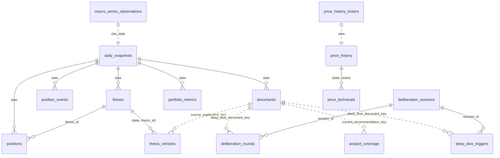

# Atlas Supabase Schema

Live Atlas Supabase schema. Source of truth: the numbered migrations under
`digiquant/supabase/migrations/`. This document inventories the
17 live tables (12 pre-024 + 5 new in migration 024) and diagrams the
high-value relationships.

> ADRs: [ADR-0008 research schema](../../../docs/adr/0008-atlas-research-schema.md),
> [ADR-0009 Supabase persistence](../../../docs/adr/0009-atlas-supabase-persistence.md),
> [ADR-0010 first-class thesis + deliberation](../../../docs/adr/0010-atlas-first-class-thesis-deliberation.md).

## ERD (primary relationships)

```mermaid
erDiagram
    daily_snapshots  ||--o{ positions             : "date"
    daily_snapshots  ||--o{ theses                : "date"
    daily_snapshots  ||--o{ position_events       : "date"
    daily_snapshots  ||--o{ documents             : "date"
    daily_snapshots  ||--o{ portfolio_metrics     : "date"

    theses           ||--o{ thesis_vehicles       : "(date, thesis_id)"
    theses           ||--o{ positions             : "thesis_id"

    documents        ||..o{ thesis_vehicles       : "source_exploration_key"
    documents        ||..o{ deliberation_rounds   : "deep_dive_document_key"
    documents        ||..o{ analyst_coverage      : "current_recommendation_key"
    documents        ||..o{ deep_dive_triggers    : "deep_dive_document_key"

    deliberation_sessions ||--o{ deliberation_rounds : "session_id"
    deliberation_sessions ||--o{ deep_dive_triggers  : "session_id"

    price_history        ||--o{ price_technicals : "(date, ticker)"
    price_history_tickers ||..|| price_history   : "view"

    macro_series_observations ||..|| daily_snapshots : "obs_date"
```

> Solid lines are FKs; dashed lines are logical pointers (documents.document_key
> strings — not enforced by FK because `documents` is partitioned and the
> pointer target may be in any partition).

## Per-table inventory

### Portfolio core (migration 001, partitioned since 011)

| Table | PK | Purpose |
|-------|----|---------|
| `daily_snapshots` | `(date)` | One consolidated JSON snapshot per calendar day. Root of the daily pipeline. |
| `positions` | `(date, ticker)` | Daily position book; one row per held ticker. |
| `theses` | `(date, thesis_id)` | Active investment theses per day; H1–H3 writers + H9 sync. Migration 025 adds daily thesis fields. Migration 056 adds stable `topic_key` and a partial unique `(date, topic_key)` index so only one nonterminal market opinion exists per topic/date. |
| `position_events` | `(id uuid)` | Every open / close / rebalance against a position with reason tag. |
| `documents` | `(date, document_key)` | JSONB payload store for every narrative / structured artifact. Doc-type CHECK set by migration 023. |
| `nav_history` | `(date)` | Daily portfolio NAV. |
| `portfolio_metrics` | `(date, metric)` | Pre-computed Sharpe, vol, drawdown, exposure metrics. |

> `benchmark_history` was dropped in migration 010 — benchmark close series (SPY / QQQ / IWM …) now live as rows in `price_history`.

### Market data (migrations 005 / 007 / 015 / 018)

| Table | PK | Purpose |
|-------|----|---------|
| `price_history` | `(date, ticker)` | OHLCV history for all watchlist tickers. |
| `price_technicals` | `(date, ticker)` | 35+ pre-computed TA indicators per (date, ticker). |
| `macro_series_observations` | `(source, series_id, obs_date)` | FRED / Frankfurter / crypto FNG time series. |
| `price_history_tickers` | _(view)_ | Distinct tickers currently in `price_history`. |

### Hermes deliberation — new in migration 024

| Table | PK | Purpose |
|-------|----|---------|
| `thesis_vehicles` | `(date, thesis_id, ticker)` | Per-thesis vehicle map; FK → `theses (date, thesis_id)`. |
| `deliberation_sessions` | `(session_id UUID)` | One row per H6 deliberation session; `kind` is legacy (`baseline`, `delta_scoped`, `monthly`) — daily graph uses thesis-first H6 without separate session kinds. |
| `deliberation_rounds` | `(id BIGSERIAL)` | Round-loop persistence; unique on `(session_id, ticker, round_number)`. |
| `analyst_coverage` | `(date, ticker)` | Daily denormalized analyst ↔ ticker index. |
| `deep_dive_triggers` | `(id BIGSERIAL)` | Audit trail of every recess- or delta-watch- or manually- forced deep-dive. |

### Strategy store — new in migration 046 (#1064)

This project is the unified DigiQuant **`core`** backend (Supabase display name `core`;
local alias still `project_id "digiquant-atlas"`). Migration 046 adds the strategy store
(additive only — no existing table touched). See
[`docs/adr/0021-digiquant-supabase-project-topology.md`](../../docs/adr/0021-digiquant-supabase-project-topology.md).

| Table | PK | Purpose |
|-------|----|---------|
| `strategies` | `(id)` | One row per strategy: `symbol`, `label`, `engine`, `config` jsonb, `enabled`, `version`. Public-readable. |
| `strategy_calibrations` | `(strategy_id)` | **Private** 1:1 sidecar; fitted `calibration` jsonb. FK → `strategies (id)`. Service-role-only (see RLS exception). |
| `strategy_trades` | `(id BIGINT)` | Executed trade history; FK → `strategies (id)`. Indexed `(strategy_id, entry_ts DESC)`. |
| `strategy_tearsheets` | `(strategy_id)` | Latest tearsheet payload (`metrics` jsonb, `equity_curve` jsonb, `as_of`). |
| `strategy_signals` | `(strategy_id)` | Current state: `position` (long/flat/short), `last_signal_date`, `last_price`, `as_of`. |

### Public portfolio surface — views only, new in migration 050 (#1461/#1462)

The anon-readable read surface for digiquant.io's live portfolio page (user ruling
2026-07-10, #1462: performance metrics only, never research notes). Curated
security-definer views — the SELECT list is the privacy allowlist; no new tables.
They pair with the `functions/prices-live/` edge function (see [`README.md`](README.md)).

| View | Backed by | Purpose |
|------|-----------|---------|
| `public_portfolio_positions` | `positions` | Latest-date position book, performance columns only. **Excludes** `rationale`, `pm_notes`, `thesis_id`, `conviction`, `stop_loss_pct`, `target_pct_gain`, `horizon_days`. |
| `public_nav_history` | `nav_history` | NAV series + cash/invested % + derived `day_return_pct`. |
| `public_price_latest` | `price_history` | Latest daily close per ticker — valuation fallback while `prices-live` is dormant / market closed. |

## RLS (consistent across all tables above)

- Every table has `ENABLE ROW LEVEL SECURITY`.
- Reads: per-table `{table}_anon_select` (or legacy `anon_read` on the
  001-era tables) policy granting `SELECT TO anon USING (true)`.
- Writes: require the Supabase `service_role` key. Supabase grants
  service_role bypass at the GRANT layer, so there is no explicit
  `service_role` policy on any Atlas table.
- **Exception — `strategy_calibrations` (migration 046):** RLS enabled with **no**
  anon policy, so anon reads return an empty set (not an error) while the service
  role keeps full access. The fitted calibration is private; mirrors the
  `atlas_run_diagnostics` idiom (migration 033).
- **Exception — strategy store lockdown (migration 051, #1462):** `strategies`,
  `strategy_signals`, and `strategy_trades` had their anon policies dropped AND their
  anon/authenticated grants revoked — anon access to live signals would bypass the
  3-day public signal delay (PR #1479). `strategy_tearsheets` keeps its anon policy
  (the pipeline writes the delayed view there). The Atlas research tables
  (`documents`, `theses`, `decision_log`, `deliberation_*`, `positions` incl.
  `rationale`/`pm_notes`) stay anon-readable **by design** — see
  [`README.md`](README.md), "What is public on purpose".
- **Views (migrations 041, 050):** RLS does not apply to views; the curated public
  views are intentionally security-DEFINER (`security_invoker = false`) so the column
  projection — not base-table policy — decides what anon sees. Supabase's advisor flags
  `security_definer_view`; expected and accepted for this pattern. Migrations **050 and
  052** pair their `GRANT SELECT` with an explicit `REVOKE ALL`. Migrations 041 and 018
  shipped no REVOKE at all and so left the platform-default DML grants standing — that
  omission was #1757, closed by migration 060 (see "Grants" below).

## Grants (migration 060, #1757)

RLS is not the only layer, and before migration 060 it was. Supabase's project bootstrap
grants `anon` and `authenticated` **full DML on every relation in `public`**, plus a
matching `ALTER DEFAULT PRIVILEGES` so each new one inherits it. Because there is no
non-`SELECT` policy anywhere (`pg_policies WHERE cmd <> 'SELECT'` → 0 rows), RLS alone
stood between the *published* anon JWT and a write.

- **What 060 does:** `REVOKE INSERT, UPDATE, DELETE, TRUNCATE, REFERENCES, TRIGGER ON ALL
  TABLES IN SCHEMA public FROM PUBLIC, anon, authenticated`, the same list on `ALTER
  DEFAULT PRIVILEGES … ON TABLES` so future relations inherit read-only, and an explicit
  re-`GRANT SELECT` on the two views 041/018 had left on the platform default.
- **`SELECT` is never revoked**, and no `REVOKE ALL` appears: taking reads away from a
  curated view fails *silently* (the frontend's `safeSelect` turns PostgREST 42501 into an
  empty panel, not an error). Any future lockdown must keep listing write privileges
  explicitly.
- **No `FOR ROLE` clause.** `pg_default_acl` carries two grantors for `public` —
  `postgres` and `supabase_admin`. Every relation here is owned by `postgres` (the role the
  migration chain runs as), so the implicit form is the effective one. `FOR ROLE
  supabase_admin` raises *must be a member of role* and, under `psql
  --single-transaction`, rolls the whole migration back.
- **Why it mattered:** `atlas_run_health` is a single-table projection, so Postgres made it
  auto-updatable, and `security_invoker = false` means writes through it run as `postgres`
  and bypass `atlas_run_diagnostics`' RLS. With the standing anon DELETE grant, an
  unauthenticated `DELETE /rest/v1/atlas_run_health` erased the whole run-telemetry
  history. `price_history_tickers` carries `DISTINCT`, so it is not auto-updatable —
  defense-in-depth only.
- **Residuals:** the `supabase_admin` default-ACL entry (unreachable from `postgres`; only
  applies to relations *it* creates), PG17's `MAINTAIN` (no matviews exist), and sequence
  /function default grants. None is a data-write path once table INSERT is gone.
- **`service_role` is untouched.** It is the only writer — all production workflows, every
  Python connector, and the `prices-live` edge function.

## LangGraph checkpointer tables — retention added in migration 061 (#1758)

Not part of the Atlas schema: `checkpoints`, `checkpoint_writes`, `checkpoint_blobs`
and `checkpoint_migrations` are auto-created in `public` by the LangGraph Postgres
checkpointer (#665, `DIGI_CHECKPOINTER=postgres`). They are internal orchestration
state — no frontend and no pipeline query reads them. Migration 036 locked them down
with RLS; migration 061 bounds their growth.

They dominated the database before 061: 952 MB of a 1263 MB total (75%), growing
~50-58 MB/day since 2026-07-21, with `thread_id` = `"<GITHUB_RUN_ID>::atlas"` /
`"::hermes"` (never reused, so nothing ever became collectable).

| pg_cron job | Schedule (UTC) | Does |
|---|---|---|
| `langgraph-checkpoint-prune` | `20 5 * * *` | `SELECT public.prune_langgraph_checkpoints(14)` — deletes every row of the three tables for threads whose **newest** checkpoint is >14 days old |
| `langgraph-checkpoint-vacuum` | `50 5 * * *` | plain `VACUUM (ANALYZE)` over the three tables |

- **Retention is 14 days** by user ruling (D6, 2026-08-01). It is also the cap on
  `pipeline-olympus.yml`'s `resume_run_id` input — a run older than the window can no
  longer be resumed from its checkpoint. `retain_days` is validated `>= 1`.
- **Pruning is thread-scoped, not checkpoint-scoped.** `checkpoint_blobs` is keyed
  `(thread_id, checkpoint_ns, channel, version)` with no `checkpoint_id`, so anything
  narrower orphans blobs. Staleness uses `max((checkpoint->>'ts')::timestamptz)` per
  thread, so an in-flight run is never eligible. `checkpoint_migrations` is untouched.
- **Never `VACUUM FULL`** — ACCESS EXCLUSIVE lock, and these tables are insert-only
  with no bloat to reclaim (886 MB live compressed vs 940 MB on disk). Plain VACUUM
  returns the pruned space to the free space map for reuse, **not** to the OS, so
  `pg_database_size` will not fall by the pruned amount. 061 caps growth
  (~700-800 MB steady state); it is not a disk-reclaim migration.
- The `prune_langgraph_checkpoints` function is `SECURITY DEFINER` with
  `search_path = ''` and `EXECUTE` revoked from `PUBLIC`/`anon`/`authenticated`, so it
  is not reachable as a PostgREST RPC.
- **Pause:** `SELECT cron.unschedule('langgraph-checkpoint-prune');` /
  `SELECT cron.unschedule('langgraph-checkpoint-vacuum');`
- **Verify:** `SELECT jobname, username, database, schedule FROM cron.job WHERE jobname
  LIKE 'langgraph-checkpoint%';` — expect two rows with `username = postgres`. The jobs
  run as the role that applied the migration, and a non-owner both prunes 0 rows (RLS,
  no policy) and skips the VACUUM, silently — so 061 asserts ownership at apply time.

> **Still open:** 94% of the bytes are the `__pregel_tasks` channel — one full
> `AtlasResearchState` copy per H5/H6 fan-out target (`hermes/focus_roster.py:29`),
> which violates `digigraph/AGENTS.md` "State stays lean". Retention caps the
> footprint but does not reduce the ~48 MB/day of write volume. Deferred from #1758
> as a human-gated architecture change.

## Dead / deprecated

- `sec_recent_filings` — dropped in migration 017.
- `'Portfolio Recommendation'` doc_type — removed by migration 021.
- Partitioned children (`daily_snapshots_y2025`, `documents_y2026`, …) are
  implementation details of the partition strategy and are not inventoried
  here. See migration 004 and 006.

## How to extend

1. Create a new migration under `supabase/migrations/NNN_description.sql`.
2. Follow the RLS pattern above.
3. If the new table holds a structured projection of a `documents` payload,
   add a reference to it in this file under the "Hermes deliberation"
   section pattern and cite the source ADR.
4. Add a test under `tests/dq/atlas/test_migration_NNN.py`
   following the pattern in `test_migration_024.py` — pure-SQL parse check
   for offline unit tests, or `psycopg` round-trip for integration.
