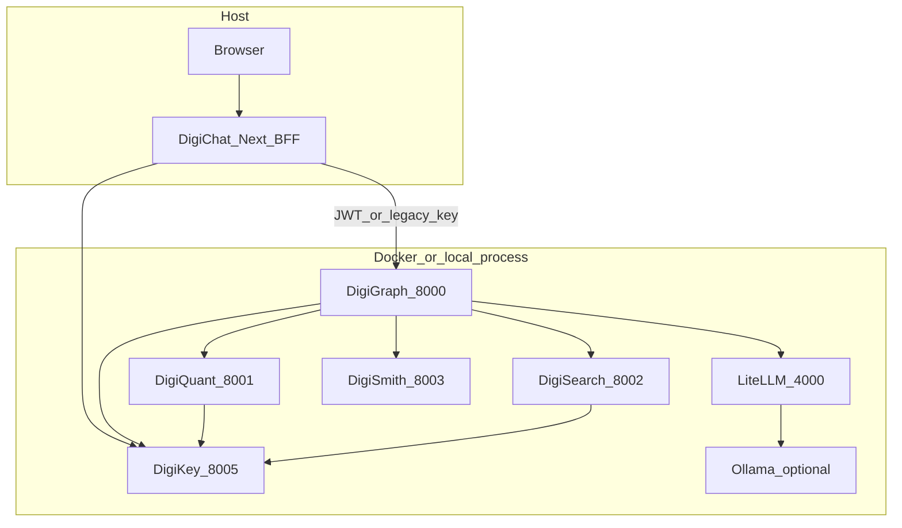

# Local full stack (DigiKey + services + LiteLLM + DigiChat)

Single reference for running **DigiKey**, **LiteLLM** (and optional **Ollama**), **DigiGraph**, **DigiQuant**, **DigiSearch**, **DigiSmith**, and **DigiChat** on loopback with **JWT auth** aligned across services.

## Architecture



**Cohesion:** Protected services expect `DIGIKEY_JWKS_URL` (or `DIGIKEY_PUBLIC_KEY_PEM`) and `Authorization: Bearer <JWT>` with the right scopes ([digikey/DIGIKEY.md](../digikey/DIGIKEY.md)). DigiChat should use **`DIGIKEY_URL` + `DIGIKEY_BFF_TOKEN`** (session exchange), or a **`dgk_live_`** key for dev—not silent anonymous access to the hub.

**LLM + proxy funnel:** When **`DIGIKEY_LITELLM_PROXY_KEY`** matches LiteLLM’s admission secret, DigiKey’s token response can include **`litellm_proxy_api_key`**; DigiChat forwards **`X-LiteLLM-Proxy-Key`** to DigiGraph. See **Security** in this doc and [SECURITY.md](../SECURITY.md).

## Paths compared

| Path | Command | DigiKey | Best for |
|------|---------|---------|----------|
| **A — Compose core** | `make up` | Container `:8005` | JWT parity with production-style compose; DigiSearch uses Chroma volume `digisearch_chroma`. |
| **B — Host Python** | `make stack-local` | Process `:8005` ([scripts/run_stack_local.sh](../scripts/run_stack_local.sh)) | Fast backend iteration without Docker; same ports as Compose (4000, 8000–8005). |
| **C — DigiChat in Docker** | `docker compose --profile digichat up -d` | `DIGIKEY_URL=http://digikey:8005` | Postgres + UI container; no local Node. |

**DigiChat on the host** (hot reload): `make digichat-dev` with `.env.local` pointing at `127.0.0.1` URLs — see [DIGICHAT.md](../DIGICHAT.md) and the **DigiChat env matrix** below.

## Path A — Docker Compose (recommended)

1. **Root `.env`**
   - **DigiKey:** `DIGIKEY_ADMIN_TOKEN`, `DIGIKEY_BFF_TOKEN` (random); `DIGIKEY_ALLOW_EPHEMERAL_KEY=1` for local JWKS (rotates on restart).
   - **LiteLLM:** [config/litellm.yaml](../config/litellm.yaml) → local Ollama at `http://ollama:11434` and/or **Ollama Cloud** via **`OLLAMA_API_KEY`**; **`LITELLM_MASTER_KEY`** + **`LITELLM_PROXY_API_KEY`** for DigiGraph → proxy Bearer.
   - **Optional funnel:** **`DIGIKEY_LITELLM_PROXY_KEY`** same as **`LITELLM_MASTER_KEY`** (Compose defaults this when unset).
   - **Local Ollama models only:** **`DIGI_MODEL_MODES_FILE=model_modes.local.yaml`** + **`DIGI_CONFIG_PATH`** mounted at `/app/config` for DigiGraph (see [config/model_modes.local.yaml](../config/model_modes.local.yaml)).

2. **`make up`** — wait for healthy **digikey**, **litellm**, **digiquant**, **digisearch**, **digismith**, **digigraph**.

3. **Bootstrap DigiKey** — issue a **`dgk_live_`** key with **`POST /v1/admin/keys`** and `DIGIKEY_ADMIN_TOKEN`, or `python -m digikey.cli issue-key …` ([digikey/README.md](../digikey/README.md)).

## JWT scopes (minimum sets)

| Purpose | Scopes (examples) |
|---------|-------------------|
| Full local dev | `*` (dev-only) |
| Hub + quant + search | `digigraph:workflow`, `digigraph:chat`, `digiquant:backtest`, `digiquant:optimize`, `digisearch:query` |
| Seeding search | add **`digisearch:ingest`** (or `*`) |

Store **`DIGIKEY_BFF_TOKEN`** in `.env` for the value DigiChat uses for **`grant_type=bff_session`** ([DIGIKEY.md](../digikey/DIGIKEY.md)).

## DigiSearch corpus

- **In-repo seeds:** [digisearch/seeds/](../digisearch/seeds/) (e.g. `digiclone_gold_brief.md`). Ingest with **`make seed-digisearch-local`** after the stack is up (see below).
- **EDGAR sample (financial disclosure text, local dev):** Optional [**EDGAR-CORPUS**](https://huggingface.co/datasets/eloukas/edgar-corpus) slice — SEC 10-K–style sections, **not** academic quant papers and **not** committed to git. Install **`pip install -e "./digisearch[edgar-corpus]"`**, then **`make export-edgar-digisearch-dev`** → writes `digisearch/devdata/edgar_sample/edgar_*.md` + YAML sidecars. Compose mounts that directory at **`/data/edgar_dev_corpus`** (read-only). Ingest index **`edgar_dev`**: **`make seed-digisearch-edgar-dev`** when DigiSearch runs in Docker (remote paths under `/data/edgar_dev_corpus`); **`make seed-digisearch-edgar-dev-host`** when DigiSearch runs on the host (`make stack-local`). Set **`DIGISEARCH_INDEX=edgar_dev`** in `.env` so **DigiGraph** queries the same Chroma collection ([docker-compose.yml](../docker-compose.yml) passes this env to `digigraph`). Citation: Loukas et al., *EDGAR-CORPUS*, ECONLP 2021. Document usage in [SECURITY.md](../SECURITY.md) if you expand beyond a small dev slice.
- **Other huge corpora:** **Not bundled** by default (e.g. custom mail archives). Ingest via **`POST /ingest`** into a dedicated index and document license/PII in [SECURITY.md](../SECURITY.md).
- **Compose:** DigiSearch uses **`CHROMA_PATH=/data/chroma`** (persistent volume). In-repo seed files are **copied into the DigiSearch image** at `/app/digisearch/seeds` so ingestion from **inside** the container works with **`DIGISEARCH_SEED_REMOTE_PREFIX=/app/digisearch/seeds`**. EDGAR exports use **`DIGISEARCH_SEED_REMOTE_PREFIX=/data/edgar_dev_corpus`** instead.

## DigiQuant data

Compose mounts [digiquant/data](../digiquant/data). Ensure `{SYMBOL}.csv` exists for backtests. [scripts/run_stack_local.sh](../scripts/run_stack_local.sh) creates tiny synthetics if the folder is empty.

## DigiChat env matrix (host dev)

| Variable | Example (host + Compose backends) |
|----------|-----------------------------------|
| `AUTH_SECRET` | `openssl rand -base64 32` |
| `AUTH_URL` | `http://127.0.0.1:3000` |
| `DIGIKEY_URL` | `http://127.0.0.1:8005` |
| `DIGIKEY_BFF_TOKEN` | Same secret as DigiKey `DIGIKEY_BFF_TOKEN` |
| `DIGIGRAPH_INTERNAL_URL` | `http://127.0.0.1:8000` |
| `DIGIQUANT_INTERNAL_URL` | `http://127.0.0.1:8001` |
| `DIGISEARCH_INTERNAL_URL` | `http://127.0.0.1:8002` |
| `DIGISMITH_INTERNAL_URL` | `http://127.0.0.1:8003` |
| `DIGICHAT_ENABLED_SERVICES` | `digigraph,digisearch,digiquant,digismith` |
| `DIGICHAT_DEV_AUTH` | `1` for password login without OIDC ([DIGICHAT.md](../DIGICHAT.md)) |

**Path C (DigiChat container):** Compose sets `DIGIGRAPH_INTERNAL_URL=http://digigraph:8000`, `DIGIKEY_URL=http://digikey:8005`, and **`DIGISEARCH_INTERNAL_URL=http://digisearch:8002`** for federated health parity.

## Path B — `make stack-local` (all services on the host, no Docker)

Use this when you want the fastest edit/run cycle: **no containers**, standard loopback ports. [scripts/run_stack_local.sh](../scripts/run_stack_local.sh) starts **DigiKey** (SQLite default **`./.local_digikey.sqlite`**), optional **LiteLLM**, **DigiQuant**, **DigiSearch**, **DigiSmith**, **DigiGraph**, with **`DIGIKEY_JWKS_URL=http://127.0.0.1:8005/.well-known/jwks.json`** for children. Pair with **DigiChat** on the host: **`make digichat-dev`** and **`digichat/.env.local`** using the same **`DIGIKEY_BFF_TOKEN`** as repo-root `.env` (see [DIGICHAT.md](../DIGICHAT.md) § Host backends only).

- If **`CHROMA_PATH`** is unset, **`DIGISEARCH_ALLOW_STUB=1`** is exported (substring stub — fine for smoke tests; use real Chroma for retrieval quality).
- **LLM URL:** Root `.env` often sets **`OPENAI_API_BASE=http://host.docker.internal:11434/v1`** for Compose → Ollama on the host. **`run_stack_local.sh`** rewrites **`host.docker.internal` → `127.0.0.1`** so DigiGraph (running on the host) can connect. Ensure **Ollama** or **LiteLLM** is listening (e.g. `ollama serve`, or `http://127.0.0.1:4000/v1` if you start LiteLLM locally); otherwise chat/RAG returns a connection error.
- Stop: **`make stack-local-stop`** ([scripts/stop_stack_local.sh](../scripts/stop_stack_local.sh)) kills processes recorded in `.local_stack_pids`.

Issue a dev **`dgk_live_`** key after DigiKey is healthy.

## Seed DigiSearch locally

1. Issue or reuse a **`dgk_live_`** key with **`digisearch:ingest`** (or `*`).
2. From repo root:

```bash
export DIGISEARCH_SEED_API_KEY=dgk_live_...
# DigiSearch on host (paths = absolute paths on this machine):
make seed-digisearch-local

# DigiSearch in Docker (paths inside container; seeds baked at /app/digisearch/seeds):
DIGISEARCH_SEED_REMOTE_PREFIX=/app/digisearch/seeds DIGISEARCH_URL=http://127.0.0.1:8002 \
  make seed-digisearch-local

# EDGAR dev corpus → index edgar_dev (after export-edgar-digisearch-dev):
export DIGISEARCH_SEED_API_KEY=dgk_live_...
make seed-digisearch-edgar-dev
# Host DigiSearch: make seed-digisearch-edgar-dev-host
```

Implementation: [scripts/seed_digisearch_local.py](../scripts/seed_digisearch_local.py) (DigiKey token → **`POST /ingest`** per file). Export: [scripts/export_edgar_corpus_dev.py](../scripts/export_edgar_corpus_dev.py).

### Test queries (hybrid + vector)

After seeding, with a JWT that has **`digisearch:query`**:

```bash
TOKEN=...  # from POST /v1/oauth/token
curl -s -X POST http://127.0.0.1:8002/query \
  -H "Authorization: Bearer $TOKEN" -H "Content-Type: application/json" \
  -d '{"text":"gold carry systematic trading","index_name":"default","mode":"hybrid","top_k":5}'

curl -s -X POST http://127.0.0.1:8002/query \
  -H "Authorization: Bearer $TOKEN" -H "Content-Type: application/json" \
  -d '{"text":"DigiClone briefing","index_name":"default","mode":"vector","top_k":5}'
```

## Verification checklist

| Step | Command / action | Pass |
|------|------------------|------|
| 1 | `curl -s http://127.0.0.1:8005/health` | DigiKey up |
| 2 | `curl -s http://127.0.0.1:8002/health` (Bearer if required by deploy) | DigiSearch up |
| 3 | `POST /query` with JWT `digisearch:query` | Non-empty hits after seeding (not for stub-only smoke) |
| 4 | `curl -s http://127.0.0.1:8001/health` | DigiQuant up |
| 5 | DigiChat `GET /api/health` | Enabled services **ok** |
| 6 | Chat in UI | Streamed reply; traces/sources if `DIGICHAT_TRACE_UI=1` |

## Optional MCP

**DigiSearch MCP:** `docker compose --profile digisearch-mcp up` — port **8765** ([docker-compose.yml](../docker-compose.yml)). IDE/OpenClaw clients; DigiGraph + DigiChat normally use HTTP.

## Security notes

- Align **`DIGIKEY_ISSUER`** / **`DIGIKEY_AUDIENCE`** across containers and host (`http://127.0.0.1:8005` vs `http://digikey:8005` must match what tokens carry — follow [digikey/DIGIKEY.md](../digikey/DIGIKEY.md)).
- **`X-LiteLLM-Proxy-Key`** is sensitive: loopback or TLS + trusted BFF only.
- **`/v1/research_turn`** on DigiSearch requires **`digisearch[agent]`** in the image; rebuild optional extras per [digisearch/Dockerfile](../digisearch/Dockerfile) if you need that route.

## LLM sanity

DigiGraph reads **`OPENAI_API_BASE`** from the environment (repo **`.env`**; host **`make stack-local`** rewrites `host.docker.internal` → `127.0.0.1`). Research/chat call the LLM through that URL.

**Symptom:** trace / UI error like *network connection failed* mentioning **`127.0.0.1:11434`** or **`4000`** — nothing is listening.

**Checks:**

```bash
curl -sS http://127.0.0.1:11434/api/tags   # local Ollama
curl -sS http://127.0.0.1:4000/health      # LiteLLM (if you use stack-local LiteLLM path)
```

**Fix (local Ollama):** start the daemon, then retry DigiChat.

```bash
ollama serve    # foreground; or use the macOS Ollama app (same port 11434)
```

Ensure **`config/model_modes.local.yaml`** (or **`DIGI_MODEL_MODES_FILE`**) lists models LiteLLM would use (e.g. **`ollama/qwen3:8b`**). **DigiGraph** strips the **`ollama/`** prefix automatically when **`OPENAI_API_BASE`** targets **Ollama’s** OpenAI API on **:11434**, so the runtime model id becomes **`qwen3:8b`**. Pull it with **`ollama pull qwen3:8b`** (or set **`OLLAMA_MODEL=qwen3:8b`**).

**Fix (LiteLLM only):** set **`OPENAI_API_BASE=http://127.0.0.1:4000/v1`** in root **`.env`** and run LiteLLM (see **`run_stack_local.sh`** / **`config/litellm.yaml`**).

If LiteLLM or Ollama cannot reach a model (not pulled, missing **`OLLAMA_API_KEY`** for cloud routes, etc.), DigiGraph fails even when service **health** endpoints are green.

## Cross-links

- [DIGICHAT.md](../DIGICHAT.md) — UI + BFF
- [ARCHITECTURE.md](../ARCHITECTURE.md) — hub vs verticals
- [digigraph/DIGIGRAPH.md](../digigraph/DIGIGRAPH.md) — orchestration
- [digisearch/DIGISEARCH.md](../digisearch/DIGISEARCH.md) — ingest / query / backends
