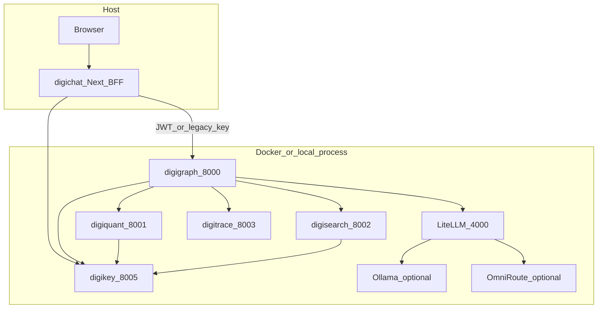

# Self-hosting digithings

This is the reference document for running the digithings AI infrastructure **on your own machine**. It merges and replaces [LOCAL_STACK.md](LOCAL_STACK.md) (the previous "local full stack" note, kept as a stub that points here).

**Measured against `develop` at `28f65195a` (2026-10-10).** Every command in this document was checked against that tree: paths, Makefile targets, environment variable names, Compose profiles and file links. Where a command is a *target of the self-host plan* and does **not** exist yet, it says so in the same sentence. Nothing in this document changes production.

Related reading: [ARCHITECTURE.md](../ARCHITECTURE.md) (hub versus verticals) · [DEPLOYMENT.md](DEPLOYMENT.md) (production) · [SECURITY.md](../SECURITY.md) · [LICENSING.md](LICENSING.md) (third-party obligations).

---

## 1. What self-hosting means here

The digithings AI infrastructure has **two first-class deployment variants**:

| Variant | Where it runs | Who runs it | Status |
|---------|---------------|-------------|--------|
| **Hosted** | Cloudflare Workers, Durable Objects, R2, Queues | digithings operations | **production only** |
| **Self-host** | your machine: Docker Compose, local processes, `wrangler dev` | you, and the digithings team on their own machines | reference variant, **in progress** |

The self-host variant is **not a dev hack or a substitute**. It is the variant that proves the software works without Cloudflare, and it is the **pre-production gate**: user interfaces, MCP servers and APIs are verified fully connected locally before anything is deployed to Cloudflare.

Four properties define the target state:

- **Documented** — this document, plus the config contract.
- **Reproducible** — the same steps, the same environment variable names, on macOS and on Linux.
- **Open source** — the repo is MIT licensed (see [Licence notes](#19-licence-notes)).
- **Modular** — each module opts in through a Compose profile; you run only what you need.

**Cloudflare is production only.** There is no hosted development stack, because it would duplicate infrastructure cost. Development, review and verification happen self-hosted.

### The one config contract

Both variants read the **same environment variable names**, the same service URL and port schema, and the same secrets manifest. A variant supplies *values*; it never invents a *name*. Without this, the two variants drift apart and local verification stops predicting production behaviour. CI parity checks exist to fail when they do drift — see [Parity with the hosted variant](#18-parity-with-the-hosted-variant).

---

## 2. What works today, and what the plan adds

The self-host work is split into ten slices. **At `28f65195a` only the documentation slice has landed.** This table is the honest state, not the target state.

| Slice | Deliverable | State at `28f65195a` |
|-------|-------------|---------------------|
| S1 | Inventory and config contract (`config/contract/`) | **not landed** — the directory does not exist |
| S2 | Supabase running locally | **not landed** — [`digiquant/supabase/config.toml`](../digiquant/supabase/config.toml) already pins `major_version = 17`, which is the base it needs |
| S3 | `wrangler dev` plus a container-to-Compose-service shim | **not landed** |
| S4 | Compose backend services brought up as a set | **not landed** |
| S5 | Secrets rendering (`.dev.vars` / `.env.local`) | **not landed** |
| S6 | Synthetic data seeding | **not landed** |
| S7 | One command (`make local-stack`, `dt up`) plus health | **not landed** — no `local-stack` target and no `dt` command exist |
| S8 | User interfaces and MCP pointed at the local stack | **not landed** |
| S9 | CI parity checks | **not landed** |
| S10 | This document | **this change** |

**Until S7 lands, bring the stack up with the commands in this document** (`make up` or `make stack-local`). They are the supported paths today.

Two known conditions, both CONFIRMED at `28f65195a`:

- The `docker-compose.yml` header comment mentions `docker compose --profile hardened up`. **No `hardened` profile exists in the file.** The profiles that do exist are listed below.
- `.gitignore` already ignores `.env.local` (rule `.env*` at `.gitignore:116`), but **`.dev.vars` is not ignored**. Wrangler reads `.dev.vars` for local secrets, so until S5 adds the rule, a stray `git add .dev.vars` would stage real secrets. Owned by S5.

---

## 3. Modular profiles

Every optional service in [`docker-compose.yml`](../docker-compose.yml) sits behind a Compose profile. The unprofiled services are the core set and start with a plain `make up`.

| Profile | Services it adds | Opt in with |
|---------|------------------|-------------|
| *(none — core)* | `digikey-blocklist-redis`, `digikey`, `ollama`, `digitrace`, `digigraph`, `digiquant`, `digisearch`, `searxng`, `valkey`, `litellm` | `make up` |
| `digichat` | `digichat-db` (Postgres 16), `digichat` | `docker compose --profile digichat up -d` |
| `digivault` | `digivault` | `docker compose --profile digivault up -d` |
| `digisearch-mcp` | `digisearch-mcp` (port 8765) | `docker compose --profile digisearch-mcp up` |
| `digivault-mcp` | `digivault-mcp` | `docker compose --profile digivault-mcp up` |
| `zammad-mcp` | `zammad-mcp` | `docker compose --profile zammad-mcp up` |
| `omniroute` | `omniroute-auth-guard`, `omniroute` (port 20128) | `docker compose --profile omniroute up` |
| `litellm-cache` | `redis` | `docker compose --profile litellm-cache up -d` |
| `heartbeat` | `heartbeat` | `make up-heartbeat` |
| `observability` | `prometheus`, `grafana` | `make up-observability` |
| `otel` | `otel-collector` | `docker compose --profile otel up -d` |

The plan adds a **higher level** of modularity on top: named profiles (`core`, `quant`, `chat`, `trace`, `all`) selected by a single `dt up --profile <name>` command, plus a reverse proxy that gives the local stack the same path routing as production through hostnames like `*.digithings.localhost`. That is a target of S3 and S7, not something you can run today.

---

## 4. Prerequisites

### Common to both platforms

- **Docker** with Compose v2 (`docker compose version`).
- **Node.js** and **npm** (the Node workspaces at the repository root).
- **uv** (the Python package and environment manager).
- **Git**.

Optional, per feature: the **Supabase CLI** (local database), **wrangler** (`npm exec wrangler`, or install it globally) to run Workers locally, **Ollama** or **LiteLLM** for a local model route, and the **Caddy** or **Traefik** reverse proxy when you want production-style hostnames.

Check what is missing before you start:

```bash
docker compose version
node --version
uv --version
git --version
```

The plan adds a preflight that runs exactly this check and also asserts free disk space (20 GB or more) before it does anything. Until then, run it yourself.

### macOS

- Docker Desktop, or Colima (`brew install colima docker`).
- The **Keychain** is the local secret store — see [Secrets](#15-secrets).
- Model server: `ollama serve`, or the macOS Ollama app on the same port 11434.

### Linux

- Docker Engine with the Compose plugin, or Docker Desktop.
- No Keychain. Use `pass`, a 1Password CLI, or a plain `.env` file you fill in by hand — see [Secrets](#15-secrets).
- Model server: `ollama serve` as a systemd unit, or LiteLLM in Compose.
- For port 80/443 hostnames with the reverse proxy, point the proxy at high ports and map them, so you do not need root to bind.

---

## 5. Architecture



**Auth cohesion.** Protected services expect `DIGIKEY_JWKS_URL` (or `DIGIKEY_PUBLIC_KEY_PEM`) and `Authorization: Bearer <JWT>` with the right scopes ([digikey/ARCHITECTURE.md](../digikey/ARCHITECTURE.md)). digichat uses **`DIGIKEY_URL` + `DIGIKEY_BFF_TOKEN`** (session exchange), or a **`dgk_live_`** key for development — never silent anonymous access to the hub.

**LLM and proxy funnel.** When **`DIGIKEY_LITELLM_PROXY_KEY`** matches LiteLLM's admission secret, digikey's token response can include **`litellm_proxy_api_key`**, and digichat forwards **`X-LiteLLM-Proxy-Key`** to digigraph. See [Security notes](#16-security-notes) and [SECURITY.md](../SECURITY.md).

**Where the Workers fit.** In production, the edge is Cloudflare: `digithings-stack` (the hub Worker, with Durable Objects and R2), `digithings-digichat`, `dashboard-api`, `digithings-cron`, and `digiquant-runner`, plus `digitrace-langfuse` and `digithings-web` which are in the repository but not live. Self-hosted, those run under `wrangler dev`, and the container classes they call are proxied to the Compose services above. **That mapping is a target of S3** — today you run the backend services directly, as described in the next section, and the Workers locally only where you need them.

---

## 6. Paths compared

| Path | Command | digikey | Best for |
|------|---------|---------|----------|
| **A — Compose core** | `make up` | container `:8005` | The default. Closest to production-style service wiring; digisearch uses the Chroma volume `digisearch_chroma`. |
| **A′ — Profile A bundle** | `make digichat-profile-a-bundle-up` | inside one stack image `:8005` | The website digichat and Cloudflare parity: one supervisord container instead of many services. See [`apps/digithings-stack-cloudflare/README.md`](../apps/digithings-stack-cloudflare/README.md). |
| **B — Host processes** | `make stack-local` | process `:8005` ([scripts/run_stack_local.sh](../scripts/run_stack_local.sh)) | The fastest backend edit-and-run cycle, no Docker. Same ports as Compose (4000, 8000–8005). |
| **C — digichat in Docker** | `docker compose --profile digichat up -d` | `DIGIKEY_URL=http://digikey:8005` | Postgres plus the UI container, when you do not want Node on the host. |

**digichat on the host** (hot reload): `make digichat-dev`, with `.env.local` pointing at `127.0.0.1` URLs. See the [digichat configuration](#12-digichat-configuration) table.

Path A is the recommended path for anything you want to keep. Path B is the fastest loop while you are changing Python services. They use the same ports and the same environment variable names, which is what makes them interchangeable.

---

## 7. Path A — Docker Compose

### 7.1 Root `.env`

- **digikey:** `DIGIKEY_ADMIN_TOKEN`, `DIGIKEY_BFF_TOKEN` (random), and `DIGIKEY_ALLOW_EPHEMERAL_KEY=1` so the local JWKS rotates on restart.
- **LiteLLM:** [`config/litellm.yaml`](../config/litellm.yaml) points at local Ollama on `http://ollama:11434` and, if you want it, at Ollama Cloud through `OLLAMA_API_KEY`. Set `LITELLM_MASTER_KEY` and `LITELLM_PROXY_API_KEY` for the digigraph to proxy Bearer. If neither a proxy key nor `OPENAI_API_KEY` is set, a declared trusted local LiteLLM base (the `:4000` defaults) sends the development sentinel `sk-no-key-required`, so a no-auth loopback stack still runs; a direct or vendor base fails fast instead (#3788 / #3939).
- **Optional funnel:** set `DIGIKEY_LITELLM_PROXY_KEY` to the same value as `LITELLM_MASTER_KEY` (Compose defaults this when unset).
- **Local Ollama models only:** set `DIGI_MODEL_MODES_FILE=model_modes.local.yaml` and mount `DIGI_CONFIG_PATH` at `/app/config` for digigraph (see [`config/model_modes.local.yaml`](../config/model_modes.local.yaml)).

### 7.2 Start

```bash
make up
```

Wait for healthy **digikey**, **litellm**, **digiquant**, **digisearch**, **digitrace** and **digigraph**.

### 7.3 Bootstrap digikey

Issue a **`dgk_live_`** development key with `POST /v1/admin/keys` and `DIGIKEY_ADMIN_TOKEN`, or use the CLI:

```bash
python -m digikey.cli issue-key ...
```

See [digikey/README.md](../digikey/README.md).

---

## 8. Path B — `make stack-local` (host processes, no Docker)

Use this for the fastest edit-and-run cycle: no containers, standard loopback ports. [scripts/run_stack_local.sh](../scripts/run_stack_local.sh) starts **digikey** (SQLite by default, at **`./.local_digikey.sqlite`**), optional **LiteLLM**, **digiquant**, **digisearch**, **digitrace** and **digigraph**, with `DIGIKEY_JWKS_URL=http://127.0.0.1:8005/.well-known/jwks.json` for the services that verify tokens.

Pair it with **digichat on the host**: `make digichat-dev`, and `digichat/.env.local` using the same **`DIGIKEY_BFF_TOKEN`** as the repository-root `.env`.

```bash
make stack-local
# ... work ...
make stack-local-stop
```

`make stack-local-stop` ([scripts/stop_stack_local.sh](../scripts/stop_stack_local.sh)) kills the processes recorded in `.local_stack_pids`.

Notes:

- If **`CHROMA_PATH`** is unset, the script exports **`DIGISEARCH_ALLOW_STUB=1`**. That is a substring stub: fine for smoke tests, not for retrieval quality. See [Seeding digisearch](#103-seeding-digisearch).
- **LLM URL:** the repository-root `.env` often sets `OPENAI_API_BASE=http://host.docker.internal:11434/v1` so that Compose can reach Ollama on the host. `run_stack_local.sh` rewrites `host.docker.internal` to `127.0.0.1` so digigraph, also on the host, can connect.
- Issue a development `dgk_live_` key after digikey reports healthy.

---

## 9. Authentication and JWT scopes

| Purpose | Scopes |
|---------|--------|
| Full local development | `*` (development only — never in production) |
| Hub, quant and search | `digigraph:workflow`, `digigraph:chat`, `digiquant:backtest`, `digiquant:optimize`, `digisearch:query` |
| Seeding search | add **`digisearch:ingest`** (or `*`) |

Store **`DIGIKEY_BFF_TOKEN`** in `.env`. That is the value digichat uses for the **`grant_type=bff_session`** exchange ([digikey/ARCHITECTURE.md](../digikey/ARCHITECTURE.md)).

Self-hosting does not relax this: the local stack uses the same token exchange, the same scopes and the same issuer/audience rules as production. That is what makes a local pass meaningful.

---

## 10. Data

### 10.1 digiquant data

Compose mounts [digiquant/data](../digiquant/data). Make sure a `{SYMBOL}.csv` file exists for each symbol you backtest. [scripts/run_stack_local.sh](../scripts/run_stack_local.sh) writes tiny synthetic files when the directory is empty.

### 10.2 digisearch corpora

- **In-repository seeds:** [digisearch/seeds/](../digisearch/seeds/), for example `digiclone_gold_brief.md`. Ingest them with `make seed-digisearch-local` once the stack is up.
- **EDGAR sample (financial disclosure text, local development, optional):** a slice of [**EDGAR-CORPUS**](https://huggingface.co/datasets/eloukas/edgar-corpus) — SEC 10-K–style sections, **not** academic quant papers, and **not committed to git**. Install the extra with `pip install -e "./digisearch[edgar-corpus]"`, then run `make export-edgar-digisearch-dev`, which writes `digisearch/devdata/edgar_sample/edgar_*.md` plus YAML sidecars. Compose mounts that directory read-only at **`/data/edgar_dev_corpus`**. Ingest into index **`edgar_dev`** with `make seed-digisearch-edgar-dev` when digisearch runs in Docker (paths inside the container), or `make seed-digisearch-edgar-dev-host` when it runs on the host. Then set **`DIGISEARCH_INDEX=edgar_dev`** in `.env` so digigraph queries the same Chroma collection — [`docker-compose.yml`](../docker-compose.yml) passes that variable to digigraph. Citation: Loukas et al., *EDGAR-CORPUS*, ECONLP 2021. Record your use in [SECURITY.md](../SECURITY.md) if you go beyond a small development slice.
- **Other large corpora are not bundled** (custom mail archives, for example). Ingest them with `POST /ingest` into a dedicated index, and record the licence and personal-data position in [SECURITY.md](../SECURITY.md).
- **Paths inside the container:** digisearch uses **`CHROMA_PATH=/data/chroma`** (a persistent volume). Seed files are copied into the digisearch image at `/app/digisearch/seeds` so ingestion works from inside the container with `DIGISEARCH_SEED_REMOTE_PREFIX=/app/digisearch/seeds`. EDGAR exports use `DIGISEARCH_SEED_REMOTE_PREFIX=/data/edgar_dev_corpus` instead.

### 10.3 Seeding digisearch

1. Issue or reuse a **`dgk_live_`** key with **`digisearch:ingest`** (or `*`).
2. From the repository root:

```bash
export DIGISEARCH_SEED_API_KEY=dgk_live_...

# digisearch on the host (paths are absolute paths on this machine):
make seed-digisearch-local

# digisearch in Docker (paths inside the container; seeds baked at /app/digisearch/seeds):
DIGISEARCH_SEED_REMOTE_PREFIX=/app/digisearch/seeds DIGISEARCH_URL=http://127.0.0.1:8002 \
  make seed-digisearch-local

# EDGAR development corpus -> index edgar_dev (after export-edgar-digisearch-dev):
export DIGISEARCH_SEED_API_KEY=dgk_live_...
make seed-digisearch-edgar-dev
# Host digisearch: make seed-digisearch-edgar-dev-host
```

Implementation: [scripts/seed_digisearch_local.py](../scripts/seed_digisearch_local.py) (digikey token, then `POST /ingest` per file). Export: [scripts/export_edgar_corpus_dev.py](../scripts/export_edgar_corpus_dev.py).

### 10.4 Chroma round trip

`DIGISEARCH_ALLOW_STUB=1` does **not** persist vectors. For an end-to-end ingest-to-query check, use real Chroma: either set `CHROMA_PATH` on the host, or use the Compose volume.

Test queries, once seeded, with a JWT that has `digisearch:query`:

```bash
TOKEN=...  # from POST /v1/oauth/token
curl -s -X POST http://127.0.0.1:8002/query \
  -H "Authorization: Bearer $TOKEN" -H "Content-Type: application/json" \
  -d '{"text":"gold carry systematic trading","index_name":"default","mode":"hybrid","top_k":5}'

curl -s -X POST http://127.0.0.1:8002/query \
  -H "Authorization: Bearer $TOKEN" -H "Content-Type: application/json" \
  -d '{"text":"digiclone briefing","index_name":"default","mode":"vector","top_k":5}'
```

### 10.5 No client data, ever

Self-hosting seeds **synthetic data only**. Never copy production rows, and never copy client data into a local stack. The plan allows an optional sanitised snapshot of schema *statistics* from the core database, never rows.

---

## 11. Health checks

Run these after the stack comes up. All six are cheap and none of them needs a production credential.

| Step | Command or action | Pass |
|------|-------------------|------|
| 1 | `curl -s http://127.0.0.1:8005/health` | digikey up |
| 2 | `curl -s http://127.0.0.1:8002/health` (Bearer if the deployment requires it) | digisearch up |
| 3 | `POST /query` with a JWT carrying `digisearch:query` | non-empty hits after seeding (not for stub-only smoke) |
| 4 | `curl -s http://127.0.0.1:8001/health` | digiquant up |
| 5 | digichat `GET /api/health` | enabled services **ok** |
| 6 | Chat in the user interface | a streamed reply; traces and sources if `DIGICHAT_TRACE_UI=1` |

The plan replaces this manual list with `dt status` / `make local-stack-health`, which also covers the database, every Worker `/healthz`, `dashboard-api`, MCP `tools/list`, a digitrace ingest round trip and an R2/KV/D1 put-and-get, and which exits non-zero on failure so CI can reuse it. That is S7.

---

## 12. digichat configuration

| Variable | Example (host, Compose backends) |
|----------|----------------------------------|
| `AUTH_SECRET` | `openssl rand -base64 32` |
| `AUTH_URL` | `http://127.0.0.1:3000` |
| `DIGIKEY_URL` | `http://127.0.0.1:8005` |
| `DIGIKEY_BFF_TOKEN` | the same secret as digikey's `DIGIKEY_BFF_TOKEN` |
| `DIGIGRAPH_INTERNAL_URL` | `http://127.0.0.1:8000` |
| `DIGIQUANT_INTERNAL_URL` | `http://127.0.0.1:8001` |
| `DIGISEARCH_INTERNAL_URL` | `http://127.0.0.1:8002` |
| `DIGITRACE_INTERNAL_URL` | `http://127.0.0.1:8003` |
| `DIGICHAT_ENABLED_SERVICES` | `digigraph,digisearch,digiquant,digitrace` |
| `DIGICHAT_DEV_AUTH` | `1` for password login without OIDC |

**Path C (digichat in a container):** Compose sets `DIGIGRAPH_INTERNAL_URL=http://digigraph:8000`, `DIGIKEY_URL=http://digikey:8005` and **`DIGISEARCH_INTERNAL_URL=http://digisearch:8002`** for federated health parity. Same variable names, container hostnames — that is the contract in miniature.

---

## 13. Optional MCP servers and optional model gateways

**digisearch MCP:** `docker compose --profile digisearch-mcp up`, on port **8765**. For IDE and OpenClaw clients; digigraph and digichat normally speak HTTP to digisearch directly.

**OmniRoute (optional):** `docker compose --profile omniroute up`, on loopback **20128**. It needs `OMNIROUTE_AUTH_PASSWORD` at start — never the vendor default, and note that the default `docker compose config` does not supply it. Overlay: [`config/litellm.omniroute.yaml`](../config/litellm.omniroute.yaml). The house model pins stay on the OpenRouter slugs in `config/litellm.yaml`. See [providers/omniroute.md](providers/omniroute.md).

---

## 14. Local Cloudflare parity (target of S3)

To run the edge locally under `wrangler dev`, Miniflare supplies R2, KV, D1, Queues and Durable Objects. Two things it does not supply, both named as gaps in the plan:

1. **Container classes.** `wrangler dev` cannot run Cloudflare Containers reliably. The plan adds a shim that maps a container class to a Compose service URL, selected by an environment variable (`DT_VARIANT=selfhost`).
2. **Analytics Engine.** There is no Miniflare parity, so a local stub writes to digitrace or Postgres instead.

Cron triggers run under `wrangler dev --test-scheduled`, and service bindings resolve only inside one multi-configuration session (`wrangler dev -c a -c b …`). The plan runs every Worker in one such session so bindings resolve, with fixed ports and `--persist-to .wrangler/state`.

`digitrace-langfuse` has its own Compose file today: [`apps/digitrace-langfuse/docker-compose.local.yml`](../apps/digitrace-langfuse/docker-compose.local.yml).

---

## 15. Secrets

**Never commit a secret, never paste one into a comment, and never echo one into a log.** Secrets arrive as environment variables; use them by name.

The plan (S5) introduces a single secrets manifest at `config/contract/secrets.yaml` listing, per secret: its name, which consumers need it, whether it is required in the self-host variant or the hosted variant or both, and where the value comes from. A `dt secrets render` step then writes `.dev.vars` and `.env.local` at mode 600. **That tooling does not exist yet**; until it does, set the variables in `.env` and `.env.local` yourself.

Intended behaviour, so you know what to expect:

- **macOS:** values come from the Keychain via `security find-generic-password -s digithings/<name>`.
- **Linux and other open-source setups:** `pass`, a 1Password CLI, or a plain `.env` you fill in by hand.
- **Local-only keys** (the local Supabase anon and service keys, the local digikey root key) are generated locally. They are never copied from production.
- `.dev.vars`, `.dev.vars.local` and `.env.local` are ignored by Git, and the secret scan runs as a pre-commit hook and in CI.

As noted in section 2, `.env.local` is ignored today (rule `.env*`) and **`.dev.vars` is not**. Until S5 lands, check `git status` before you stage anything.

---

## 16. Security notes

- Align **`DIGIKEY_ISSUER`** and **`DIGIKEY_AUDIENCE`** across containers and host. `http://127.0.0.1:8005` and `http://digikey:8005` must match what the tokens actually carry ([digikey/ARCHITECTURE.md](../digikey/ARCHITECTURE.md)).
- **`X-LiteLLM-Proxy-Key`** is sensitive: loopback only, or TLS plus a trusted backend-for-frontend.
- **`/v1/research_turn`** on digisearch requires the **`digisearch[agent]`** extra in the image. Rebuild the optional extras per [digisearch/Dockerfile](../digisearch/Dockerfile) if you need that route.
- The local stack is loopback-only by default. Do not bind it to a public interface; do not reuse a local development key, token or `DIGIKEY_ADMIN_TOKEN` anywhere near production.

---

## 17. LLM route sanity

digigraph reads **`OPENAI_API_BASE`** from the environment (the repository `.env`). Host mode rewrites `host.docker.internal` to `127.0.0.1`. Research and chat calls go through that URL.

**Symptom:** a trace or user-interface error like *network connection failed* mentioning **`127.0.0.1:11434`** or **`4000`** — nothing is listening.

**Check:**

```bash
curl -sS http://127.0.0.1:11434/api/tags   # local Ollama
curl -sS http://127.0.0.1:4000/health      # LiteLLM, if you use the host LiteLLM path
```

**Fix, local Ollama:** start the daemon, then retry digichat.

```bash
ollama serve
# macOS: or run the Ollama app, same port 11434
# Linux: run it as a systemd unit
```

Make sure **`config/model_modes.local.yaml`** (or **`DIGI_MODEL_MODES_FILE`**) lists the models LiteLLM would use, for example **`ollama/qwen3:8b`**. digigraph strips the `ollama/` prefix automatically when `OPENAI_API_BASE` targets Ollama's OpenAI API on port 11434, so the runtime model id becomes **`qwen3:8b`**. Pull it with `ollama pull qwen3:8b`, or set `OLLAMA_MODEL=qwen3:8b`.

**Fix, LiteLLM only:** set `OPENAI_API_BASE=http://127.0.0.1:4000/v1` in the repository `.env` and run LiteLLM (see `run_stack_local.sh` and `config/litellm.yaml`).

If LiteLLM or Ollama cannot reach a model — not pulled, missing `OLLAMA_API_KEY` for cloud routes — digigraph fails even while every health endpoint is green. **A green health check is not a working model route.**

---

## 18. Parity with the hosted variant

The parity design is a target of S1 and S9. In outline:

- The **config contract** under `config/contract/` — services, ports, environment variables, secrets, bindings — is the single source of truth.
- **Generators** emit the wrangler `[vars]`, the Compose environment and `.env.example` from it, so the three cannot drift by hand-editing.
- **CI checks:** (a) a contract lint that every wrangler binding and variable, and every Compose environment entry, maps to the contract; (b) `supabase db reset` on a clean PostgreSQL 17 that applies every migration; (c) a nightly and per-pull-request `dt up --profile core` in GitHub Actions, followed by the health and API contract tests, with the same suite run as a read-only smoke test against production after a deploy; (d) a drift report for any new Worker or binding.

Today the drift is real and is item 7 of the plan's gap list: environment variable names differ between wrangler `[vars]`, Compose and `.env.example`. Sections 7 to 13 of this document are the current, hand-maintained equivalent.

---

## 19. Licence notes

**This repository is MIT licensed** — see [LICENSE](../LICENSE). The policy for everything else is [docs/LICENSING.md](LICENSING.md), which is the authoritative record; this section is a summary for people standing up a self-hosted stack.

- **Permissive licences are the default.** Weak copyleft (EPL-2.0, MPL-2.0, CDDL) needs a recorded decision naming the package, version, path, rationale, and that you consume it unmodified. Strong copyleft (GPL, AGPL, SSPL) is **not accepted by default** in shipped artefacts: it needs an explicit human decision recorded in `docs/LICENSING.md`, and the default answer is to replace the dependency.
- **Modifying a dependency changes the analysis.** Adding a line of our code to a copyleft component can change what we owe.
- **There is deliberately no CI licence gate.** The audit is a review-time step. Nothing in the build will fail because a dependency's licence changed.

The audit commands, from `docs/LICENSING.md`:

```bash
npx license-checker --production --summary
npm ls <package>
pip-licenses --format=markdown --with-urls
```

### 19.1 Runtime third-party surfaces a self-hosted stack adds

The inventory in `docs/LICENSING.md` is npm-client-only (verified against `package-lock.json` on 2026-09-13). Bringing the stack up locally also runs **container images**, which are third-party software the repository neither vendors nor pins in general. That surface is **not recorded anywhere in the repository today**. Confirmed against `docker-compose.yml` at `28f65195a`:

| Runtime surface | Source | Licence recorded in the repository? |
|-----------------|--------|-------------------------------------|
| `redis:7-alpine`, `valkey/valkey:9-alpine` | Compose file | no |
| `postgres:16-alpine` (the `digichat` profile database) | Compose file | no |
| `ollama/ollama:latest` | Compose file | no |
| `docker.litellm.ai/berriai/litellm:main-stable` | Compose file | no |
| `searxng/searxng:latest` | Compose file | no |
| `diegosouzapw/omniroute:3.8.50` (optional profile) | Compose file | no — this one is the only image pinned by digest |
| `prom/prometheus:latest`, `grafana/grafana:latest`, `otel/opentelemetry-collector-contrib:0.109.0` | Compose file | no |
| `busybox:1.36` (OmniRoute auth guard) | Compose file | no |
| `digi-*` images | built from this repository | yes — MIT, via the repository `LICENSE` |
| EDGAR-CORPUS development sample | HuggingFace dataset, not committed | no — dataset terms are not recorded either |

**Reproducibility note, same measurement:** every image above except OmniRoute is referenced by a **tag**, and most by `:latest`. The content behind those tags can change between two runs on the same machine. Only the OmniRoute image is digest-pinned. Pinning the rest, or recording the digests a stack actually ran, is open work and belongs with the self-host slices; this document does not claim bit-reproducible bring-up.

**Trademarks are separate from copyright.** The digithings name and logo are trademarks; see [TRADEMARKS.md](../TRADEMARKS.md). The MIT licence grants no trademark rights.

---

## 20. Superseded documents

- **[LOCAL_STACK.md](LOCAL_STACK.md)** — the previous local-stack note. Its content is merged here; the file is kept only so existing links keep working.
- **[plans/2026-09-18-dev-cloudflare-containers.md](plans/2026-09-18-dev-cloudflare-containers.md)** — the #3854 proposal for a *hosted development* Cloudflare stack. **Superseded** by the self-host reference stack: Cloudflare is production only, and a second set of Cloudflare accounts would duplicate infrastructure cost. The underlying problem it describes is real and still open — verifying the dashboard popup and digichat end to end without touching production traffic — and the self-host stack is where that verification now happens. Read it for the history, not for the plan.

---

## 21. Cross-links

- [ARCHITECTURE.md](../ARCHITECTURE.md) — hub versus verticals.
- [digikey/ARCHITECTURE.md](../digikey/ARCHITECTURE.md) — token exchange, scopes, JWKS.
- [digigraph/ARCHITECTURE.md](../digigraph/ARCHITECTURE.md) — orchestration.
- [digisearch/ARCHITECTURE.md](../digisearch/ARCHITECTURE.md) — ingest, query, backends.
- [DEPLOYMENT.md](DEPLOYMENT.md) — the production variant.
- [SECURITY.md](../SECURITY.md) — threat model, dependency-audit policy, secret scanning.
- [LICENSING.md](LICENSING.md) — third-party licence obligations.
- `digichat/ARCHITECTURE.md` — the user interface and backend-for-frontend, in the nested digichat repository.
