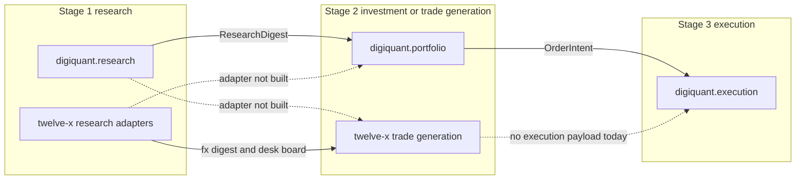

# ADR-0030 — Swappable digiquant stage modules; twelve-x is a composition

**Status:** Accepted (2026-09-29)
**Date:** 2026-09-29
**Accept:** Human Gate via One / Chris on [#4763](https://github.com/digithings-ai/digithings/pull/4763).
**Related epic:** [#4762](https://github.com/digithings-ai/digithings/issues/4762)
**Amends (reading only; historical bodies stay):** [ADR-0015](0015-atlas-vs-hermes.md), [ADR-0026](0026-retire-olympus-atlas-hermes-kairos.md)
**Extends:** [ADR-0014](0014-atlas-in-digiquant.md) (finance graphs live in `digiquant/`), [docs/VISION.md](../VISION.md) (research / portfolio / execution under digiquant)
**Orthogonal:** [#4761](https://github.com/digithings-ai/digithings/issues/4761) (where scheduled jobs run)

## Context

digiquant and twelve-x already look like the same three-stage pipeline, but nothing written down says they are one family. Further twelve-x trade-recommendation work would deepen a parallel pipeline: its own repo, its own Supabase project, its own session clocks, and a dashboard that only reads snapshots.

Product intent (Chris, 2026-09-29, [#4762](https://github.com/digithings-ai/digithings/issues/4762)):

- digiquant and twelve-x are the **same modular pipeline family**.
- Stages are swappable graphs, not product forks:
  1. **Research** — market-state discovery.
  2. **Investment / trade generation** — turns research into a longer-horizon book or shorter-horizon trade ideas.
  3. **Execution** — gated strategy / order path.
- **digiquant baseline:** general markets research → longer-term preference-driven portfolio → execution.
- **twelve-x:** a custom composition of those stages — Prime Market terminal + analyst research + platform macro / sentiment / positioning scrapes → shorter-term multi-timeframe trade recommendations → execution-family contracts.
- Example mixes that must stay legal once seams exist: digiquant research + twelve-x trade generation; twelve-x research + digiquant portfolio.
- Further involved twelve-x recommendation customization waits until this ADR is Accepted and the seams are named.

User-facing job words stay **research**, **portfolio**, and **execution** ([ADR-0026](0026-retire-olympus-atlas-hermes-kairos.md)). This ADR adds **trade-generation** as the short-horizon implementation of stage 2, beside portfolio. It is a job name, not a new brand. Historical ADR filenames keep their original words; this text does not revive them as product names.

### Evidence limit (twelve-x producer)

`digithings-ai/twelve-x` is a private sibling repo. The token used to draft this ADR received HTTP 404 on `GET /repos/digithings-ai/twelve-x`, so **producer Python was not opened**. Nothing below invents a twelve-x LangGraph node, package, or in-memory type that this session did not see.

What *is* grounded:

- This repo's digiquant packages, graphs, and handoff types (read directly).
- The FX Hub reader in `apps/dashboard/lib/twelve-x/` and the operator copy in `apps/dashboard/components/twelve-x/HowItWorksTab.tsx` (the comment there says the writer lives in the private research repo; the hub only reads snapshots).
- Org clocks in `apps/digithings-cron/src/jobs.ts`, which dispatch named twelve-x workflow files.
- Library notes that name twelve-x scraper files (`digifetch/AGENTS.md`, `digifetch/ARCHITECTURE.md`) and a separate Supabase project ([ADR-0021](0021-digiquant-supabase-project-topology.md)).

Where a seam is only visible from the reader or from a cron filename, the text says so.

## What the code does today

### digiquant baseline (this repo)

Finance stages are Python packages under `digiquant/src/digiquant/`. `digiquant.dashboard` is the operator/runtime surface (edit mode, overlay, retrieval). It is not a fourth pipeline stage.

| Stage | Package | Graph entry | What it runs |
|-------|---------|-------------|--------------|
| Research | `digiquant.research` | `build_research_graph` (`python -m digiquant.research.graph`) | preflight, optional preflight reflection, triage, phase 1 alt-data, phase 2 institutional, phase 3 macro, phase 4 asset class, phase 5 equities, phase 6 consolidate, phase 7 digest |
| Portfolio (stage 2, long horizon) | `digiquant.portfolio` | `build_portfolio_graph` / `python -m digiquant.portfolio.graph --from-digest` | thesis → market → vehicle map → screener → coverage director → asset analyst → deliberation → direction → sizing → `commit_run` |
| Chain | `digiquant.portfolio.chain` | `run_research_then_portfolio` (`python -m digiquant.portfolio.chain`) | research, then portfolio, then one publish. House cron calls this |
| Execution | `digiquant.execution` | `route_pending_orders`, `python -m digiquant.execution.route_cron` | routes approved order intents; mirrors broker acks. Default off |

House apply is still the CLI, not digigraph. `.github/workflows/pipeline-digiquant.yml` runs `python -m digiquant.portfolio.chain` on `repository_dispatch` type `digiquant-baseline`. `apps/digithings-cron` fires that event at `17 9/10/11/12 * * *` (`house-run-09` … `house-run-12`). Prices, on-chain, tearsheets, and research metrics are **sibling clocks** (`pipeline-digiquant-prices.yml` and the other `pipeline-digiquant-*.yml` jobs). They feed market data. They are not stage graphs.

digigraph registers one product graph, `research-portfolio-chain`, in `digigraph/src/digigraph/graph/product_graphs.py`. It dry-compiles through `digiquant_compile_research_portfolio`. Full apply is refused (`dry_run` must stay true; the error text points back at `digiquant.portfolio.chain`). digigraph does not import digiquant packages.

**Handoff that stage 2 actually reads.** Thesis and market call `digest_briefing_for_portfolio` (`digiquant/research/segments.py`) and pass only `date`, `body`, and `regime_label` from `state.phase7_digest`. The published read contract is `DigestPayload` inside `SnapshotEnvelope` (`digiquant/research/snapshot.py`), mirrored against `DigestSnapshot` (`digiquant/research/phases/phase7_synthesis.py`). The in-graph slot is `Phase7DigestPayload` on `ResearchState`.

**The narrow-import rule from ADR-0015 is not what the tree does.** ADR-0015 said the digest type was the only shared symbol. Today:

- `PortfolioState` is an alias of `ResearchState` (`digiquant/portfolio/state.py`: "until digest-only extraction lands").
- `python -m digiquant.portfolio.graph --from-digest` loads a full `ResearchState` JSON file, not a `DigestPayload`.
- Portfolio modules import research state, supabase I/O, price queries, skills, and grounding (`portfolio/graph.py`, `portfolio/writers/commit_io.py`, and others).
- Research imports portfolio models from `research/risk_policy_registry.py`, `research/cost_liquidity_registry.py`, and `research/testing/simulator.py`.

That drift is a named gap. This ADR does not move packages to close it.

**Execution boundary.** `commit_run` books the portfolio ledger, including `OrderIntent` rows (`digiquant/portfolio/models/portfolio_ledger.py`). `digiquant.execution.router` reads those intents and `digiquant.portfolio.writers.execution_io`. `DIGIQUANT_EXECUTION_ROUTING` defaults off (`digiquant/execution/policy.py`). House and system workspaces stay on internal paper. Live venue values are refused. `route_cron` does not submit when the switch is off. Broker adapters under `digiquant/brokers/` stay human-gated. Research and portfolio must not grow a second submit path.

### twelve-x (sibling repo, reader-side and clocks)

twelve-x is not a package in this repo. [ADR-0021](0021-digiquant-supabase-project-topology.md) keeps its Supabase project separate from digiquant `core`. The dashboard FX Hub reads twelve-x tables; `economic_calendar` and the shared macro series stay on `core` (`apps/dashboard/lib/twelve-x/types.ts`).

Org clocks (`apps/digithings-cron/src/jobs.ts`) dispatch these twelve-x workflows on `develop`:

| Job id | Workflow file | Role visible from this repo |
|--------|----------------|------------------------------|
| `twelve-x-asia` / `london` / `new-york` | `daily_run_asia.yml`, `daily_run_london.yml`, `daily_run_new_york.yml` | Weekday session runs |
| `twelve-x-market-context-*` | `market_context_ingest.yml` with `bucket` `intraday` / `daily` / `weekly` | Market-context ingest |
| `twelve-x-primemarket-heartbeat` | `primemarket_session_heartbeat.yml` | Prime Market session heartbeat |
| `twelve-x-session-catchup` | `session_catchup.yml` | Weekday catch-up |
| `twelve-x-performance-eval` | `performance_eval.yml` | Idea / consensus evaluation |
| `twelve-x-archive-maintenance` | `archive_maintenance.yml` | Archive prune (not a stage) |

The hub's "How it works" copy locks the daily run to seven steps. This ADR maps them onto stages. The mapping is a reading of that copy, not a verified split inside the producer:

| Step | Copy | Stage this ADR assigns |
|------|------|------------------------|
| 01 Calendar | Refresh the macro event window | Research input |
| 02 Ingest desk research | Full desk notes (thesis, direction, conviction, targets, catalysts). Also retail, positioning, and calendar feeds | Research |
| 03 Score relevance | Freshness, event alignment, review | Research |
| 04 Digest | Day's market read, themes, what changed | Research output |
| 05 Synthesize ideas | Two passes — candidates, then the strategist's book — ranked trade ideas | Trade generation |
| 06 Attach levels | Deterministic entry / stop / targets; optional model polish; guard on side, minimum reward-to-risk, band | Trade generation |
| 07 Daily board | Publish snapshots the hub reads | Publish, not a stage |

Same copy states the hub **never executes trades**, the watchlist is a display filter and does not steer the writer, and pair allow / deny plus risk-style generation directives **are not wired**.

Reader contracts the hub already depends on (twelve-x writes, dashboard reads):

- Research board: `fx_daily_digest`, `fx_research_history` (desk brief, `analyst_names`, `currency_views`), `fx_relevance_ledger`, `fx_events_snapshot`, `fx_consensus_snapshot` (timeframe `medium` \| `long`).
- Prime Market / positioning evidence the hub joins: `fx_smart_bias`, `fx_market_snapshots` (reader looks up `smart-bias-tracker`). Level provenance on ideas includes `pmt_bank_trade`, `pmt_seasonality_target`, `pmt_position_cluster`, `pmt_retail_book`, plus `broker_quoted`, `computed`, `technical`, `llm`.
- Trade ideas: `fx_trade_ideas_snapshot` (`FxTradeIdeaRow`: `run_date`, `rank`, `pair`, `direction`, `title`, `thesis`, `catalyst`, `levels`, `citations`, optional `trade_levels`, `evidence`, `idea_id`, optional `timeframe`). `fx_confluence_snapshot` is the ranked confluence board; its `components` jsonb carries a free-string `timeframe` (a hub test uses `1-3M`). `fx_idea_eval` scores successor-clock outcomes.
- There is **no** `OrderIntent` (or other digiquant execution type) on these rows.

`digifetch` extracted browser/HTTP mechanics from twelve-x scrapers and names `twelve-x/nodes/scrape.py` and `twelve-x/fx_calendar/scraper.py` as the requirements source. Site login, Prime Market selectors, the research-file AJAX call, Trading Economics calendar parsing, and PDF text stay in twelve-x. Wiring those scrapers onto digifetch is still deferred (`digifetch/ARCHITECTURE.md`). `digillm` notes twelve-x as a consumer (`nodes/llm.py` in the vision docs). This ADR does not claim those files were re-read.

### Composition diagram (target)

Solid arrows exist in some form today. Dashed arrows are the mixes this ADR allows later. They are not implemented.

Today's twelve-x daily run is the left-to-right path inside one sibling repo: research adapters → trade generation → snapshot publish, with execution absent. Today's digiquant house run is `research` → `portfolio` → publish, with execution behind `DIGIQUANT_EXECUTION_ROUTING`.

## Decision

### 1. Stage modules are first-class digiquant contracts

A stage module is a graph with a named input payload and a named output payload. digiquant owns the contracts. A composition (the house chain, or twelve-x) picks one module per stage. Modules in the same stage must be swappable without rewriting the other stages.

| Stage | Owns | Must not own |
|-------|------|----------------|
| **Research** | Discover and summarize market state: sources, segment memos, a digest, freshness. digiquant baseline does that for general markets (phases above). A twelve-x research module does it for the FX desk: calendar, desk/analyst notes, Prime Market session material, and platform macro / sentiment / positioning scrapes | Positions, weights, trade-idea ranking, level brackets, order intents, broker submit, venue choice |
| **Investment / trade generation** | Turn a research handoff into a book. **Portfolio** (baseline): preference-driven, longer horizon, thesis through `commit_run`. **Trade generation** (twelve-x): shorter horizon, ranked ideas with thesis, catalyst, citations, and entry / stop / target levels | Re-scraping or re-synthesizing research; choosing a broker; submitting orders |
| **Execution** | After a human-gated book exists: venue policy, routing of approved intents, broker mirror sync. The only implementation is `digiquant.execution` | Writing the research digest; sizing a book; inventing a parallel broker stack |

`digiquant.dashboard` stays the operator surface. Prices and other ingest jobs stay shared data clocks, not stages.

Trade generation is not a new product and not a fourth stage. It occupies stage 2 when the composition wants ideas instead of a portfolio book. Both may exist in the monorepo over time. This ADR does **not** create a `digiquant.trade_generation` package. The twelve-x implementation stays in `digithings-ai/twelve-x` until a follow-on issue, after Accept, names the move.

### 2. Handoff payloads

Three payloads cross stage boundaries. Anything else is an internal of one module.

**ResearchDigest** — research → stage 2.

- Canonical published shape: `DigestPayload` / `SnapshotEnvelope` (`digiquant.research.snapshot`).
- Canonical in-graph briefing the portfolio thesis and market nodes already consume: `date`, `body`, `regime_label` via `digest_briefing_for_portfolio`.
- A replacement research module must be able to emit that briefing. It does not have to emit phase-1…phase-6 slots.
- twelve-x's reader-visible research output (`fx_daily_digest` plus desk rows) is a **different** document. It is not a `DigestPayload`. Crossing from one research module to the other stage-2 module needs an adapter. That adapter does not exist. Do not pretend `fx_daily_digest.summary` is already a `DigestPayload.body`.

**Stage-2 book** — stage 2 → execution, and the operator snapshot.

- Portfolio book: ledger rows ending in `OrderIntent` after `commit_run`. Execution reads intents. It does not read the digest.
- Trade-idea book: the hub contract `fx_trade_ideas_snapshot` / `FxTradeIdeaRow` (fields listed above). There is no matching Pydantic model in digiquant. This ADR names that row the trade-idea contract. It does not add the model in this change.
- A trade-idea book is not an `OrderIntent`. Execution must not scrape idea rows and submit them.

**Execution result** — append-only broker mirror and paper fills already defined under `digiquant.execution` and the portfolio ledger. Research may keep today's closed loop (decision log, preflight reflection) inside the house chain. That loop is not a stage-swap interface and must not become one by accident.

Import direction, restated as the target (ADR-0015's rule, still not true in tree):

- Research does not import portfolio or execution.
- Stage 2 imports research only for the digest contract (`DigestPayload` and the briefing helper), not for graph nodes, skills, or supabase writers.
- Execution imports stage 2 only for the intent / ledger types it routes. It does not import research.

Enforcing that rule is follow-on work. It is blocked until this ADR is Accepted.

### 3. twelve-x is a composition, not a parallel architecture

twelve-x means this composition:

1. **Research module** — adapters around Prime Market (session heartbeat workflow, `pmt_*` level provenance, `fx_smart_bias` / smart-bias snapshot), desk analyst notes (`fx_research_history`), and platform scrapes (market-context ingest buckets; retail and positioning called out on the daily-run copy). Shared `core` calendar and macro series stay shared inputs, not a private twelve-x store ([ADR-0021](0021-digiquant-supabase-project-topology.md)).
2. **Trade-generation module** — relevance-weighted digest in, then idea synthesis and deterministic levels out, published as `fx_trade_ideas_snapshot` / confluence / consensus snapshots.
3. **Execution** — no twelve-x execution module. The hub copy is the contract until a later composition explicitly opts into `digiquant.execution`. Opting in still passes the existing human gate (`DIGIQUANT_EXECUTION_ROUTING` off by default; no live venue; no edits under `digiquant/brokers/` without human approval).

Session cadence (Asia / London / New York workflows) is a composition choice. It does not define a different architecture. The house chain's daily `portfolio.chain` cadence is the other composition choice.

Desired mixes stay valid as **targets**:

| Research module | Stage 2 module | Execution | Status today |
|-----------------|----------------|-----------|--------------|
| `digiquant.research` | `digiquant.portfolio` | `digiquant.execution` when the switch is on | House chain. Execution default off |
| twelve-x research adapters | twelve-x trade generation | none | What the FX Hub reads |
| `digiquant.research` | twelve-x trade generation | none until opted in | Adapter missing. Blocked |
| twelve-x research adapters | `digiquant.portfolio` | `digiquant.execution` when the switch is on | Adapter missing. Blocked |

### 4. Shared vs swappable

**Stays shared**

- Stage payload names in this ADR (`ResearchDigest`, portfolio `OrderIntent`, trade-idea snapshot row).
- Persistence style: snapshot or ledger rows, forward migrations, no in-place edits of applied SQL. twelve-x keeps its own Supabase project ([ADR-0021](0021-digiquant-supabase-project-topology.md), [ADR-0022](0022-supabase-env-naming-standard.md)). Composition does not merge databases.
- Human gates: live venues refused; `DIGIQUANT_EXECUTION_ROUTING` default off; `digiquant/brokers/` untouched without explicit human approval; twelve-x does not execute.
- Clock ownership: `digithings-cron` dispatches both digithings and twelve-x jobs. Graphs do not grow private schedulers.
- Service auth: digikey for digithings service calls. The twelve-x Supabase session path in `apps/dashboard/lib/twelve-x/session.ts` stays the FX Hub access path. This ADR does not fold it into digikey.
- digisearch wake: `digiclaw` `web-watch-tick` posts to digisearch `/v1/monitors/tick` with a digikey scope `digisearch:query`. That is a platform monitor clock, not a finance stage. Stage modules must not start their own digisearch wake loops.
- Secrets: site credentials and cookies stay in the consumer that logs in (Prime Market, Trading Economics). `digifetch` still reads no environment variables. [ADR-0029](0029-secrets-management.md) stays the secrets proposal; this ADR adds no secret names.
- LLM routing target remains digillm where a module already uses it. This ADR does not migrate the digiquant house prompts onto digillm.

**May swap**

- Which research graph runs (general-markets phases vs twelve-x desk / Prime Market / scrape adapters).
- Which stage-2 graph runs (portfolio thesis–commit vs trade-idea synthesis and levels).
- Adapters at the ResearchDigest boundary.
- Session calendars and which cron workflow invokes the composition.
- Skills and prompts, loaded by the module that runs them (caller-side split from ADR-0015).

**May not swap**

- A second order router or a twelve-x-local broker client.
- Killing the execution switch by default-on.
- Treating dashboard watchlist edits as generation directives (the hub copy says they are not wired; they stay unwired until an Accepted follow-on).

### 5. Gate

This ADR is **Proposed**. The gate is in force for agents now, and it stays in force until Chris changes **Status** to Accepted.

**Allowed while Proposed**

- Edits to this ADR and to the backlog index row that points at it.
- Bugfixes that preserve current daily-run and hub-read behavior.
- Dashboard display of columns already on the snapshot contracts above.
- Library fixes in digifetch / digillm that do not rewire twelve-x idea ranking, levels, or strategist passes.
- [#4761](https://github.com/digithings-ai/digithings/issues/4761) work that moves **where** an existing job runs and keeps the job's inputs and outputs the same.

**Blocked until Accepted, and until a follow-on issue names the seam it touches**

- New twelve-x recommendation behavior: pair allow / deny, risk-style generation, new ranking features, new strategist passes, a closed multi-timeframe policy, or anything that changes which ideas the book contains.
- Package moves, import-boundary enforcement, a digest-only portfolio entry, or a digiquant Pydantic twin of `FxTradeIdeaRow`.
- Adapters that feed digiquant research into twelve-x trade generation, or the twelve-x research board into `digiquant.portfolio`.
- Any twelve-x path that submits orders or writes `OrderIntent` rows.
- Wiring twelve-x scrapers onto digifetch **as part of** recommendation customization. A mechanical transport swap that preserves outputs can be its own issue; it is not a way around this gate.

Follow-on implementation issues are filed only after Accept.

### 6. Relationship to #4761

[#4761](https://github.com/digithings-ai/digithings/issues/4761) decides where live jobs run (GitHub Actions minutes vs Cloudflare Containers). This ADR decides how stage graphs compose. A container may run `digiquant.portfolio.chain` or a twelve-x `daily_run_*.yml` job. It must not merge those graphs, drop a handoff, or become the place recommendation policy is invented. Clocks stay in `digithings-cron` either way.

## Consequences

**Positive**

- One family: house digiquant and twelve-x are compositions of the same three stages.
- The customization gate is explicit, so trade-recommendation work does not land as a second architecture.
- Handoffs that already exist (`DigestPayload` briefing, `OrderIntent`, `fx_trade_ideas_snapshot`) are the seams. New type names are not required to start the conversation.

**Negative / tradeoffs**

- The tree does not match the target import rule. `PortfolioState = ResearchState` and the cross-imports listed above remain until a post-Accept refactor. Agents must not "clean that up" under this ADR's PR.
- twelve-x producer source was not readable here. Session workflow files, scraper paths, and in-process types inside `digithings-ai/twelve-x` can drift from the hub copy. A follow-on pass after Accept should open that repo and either confirm the step map or amend this ADR. Do not treat the seven-step table as a file-level map.
- Cross-composition mixes need adapters that are intentionally absent. Naming them is not permission to build them.
- Two Supabase projects remain. A portfolio module cannot read `fx_trade_ideas_snapshot` by importing digiquant `core` writers.
- Multi-timeframe is not one enum. Consensus rows are `medium` \| `long`. Confluence components carry a free string. Trade-idea rows have an optional `timeframe` that older boards omit. This ADR does not freeze a vocabulary.

**Follow-on (after Accept only)**

1. Confirm the twelve-x producer against the step map (open the sibling repo).
2. Decide the trade-generation package home (open question below) and, if needed, a Pydantic model whose fields match `FxTradeIdeaRow`.
3. Enforce the import direction and replace `PortfolioState = ResearchState` with a digest-only entry. The `--from-digest` CLI should accept a `DigestPayload` / `SnapshotEnvelope`, not only a full `ResearchState` dump.
4. Specify adapters for the two dashed mixes. Each adapter is its own issue.
5. Leave execution opt-in for twelve-x as a separate human-gated issue if Chris wants ideas to become intents.

## Amendments

This file amends the **reading** of prior ADRs. It does not edit their bodies.

- **ADR-0015** — research vs portfolio split and the digest handoff still stand. The "only shared symbol" sentence is the target, not the current import graph. Trade generation is a second stage-2 module, not a reason to push idea ranking back into research.
- **ADR-0026** — user-facing words remain research, portfolio, and execution. **Trade-generation** is allowed as the short-horizon stage-2 job name. No replacement proper noun for the retired names.
- **ADR-0014** — stage implementations that live in this monorepo stay under `digiquant/`. twelve-x may keep its repo until a follow-on says otherwise; that does not make it a second architecture.
- **ADR-0019** — one house workflow for the digiquant composition. twelve-x session workflows are the other composition's clocks, not a second copy of the house chain.
- **ADR-0021 / ADR-0022** — unchanged. twelve-x stays its own Supabase project and its own env names.
- **VISION.md** — the finance trio under digiquant remains the product picture. twelve-x is a composition of that trio (with trade generation in the portfolio slot), not a client project under `projects/` and not a separate stack.

## Open questions for Chris

1. **Package home.** Should trade generation stay in `digithings-ai/twelve-x` permanently, or move under `digiquant/` after Accept? This ADR refuses a package move either way until you Accept and a follow-on issue names the destination.
2. **Timeframe vocabulary.** Consensus is `medium` \| `long`. Idea components use free strings such as `1-3M`. Which set is the contract a swappable trade-generation module must emit?
3. **Execution opt-in.** Confirm that twelve-x keeps "never executes" until a separate human-gated issue, and that the only legal submit path then is `digiquant.execution`.
4. **Database.** Confirm composition does **not** merge the twelve-x Supabase project into `core`.
5. **Producer check.** After Accept, who opens `digithings-ai/twelve-x` and either confirms the seven-step map or amends this ADR?

## Links

- Epic: [#4762](https://github.com/digithings-ai/digithings/issues/4762)
- Orthogonal infra: [#4761](https://github.com/digithings-ai/digithings/issues/4761)
- Predecessor split: [ADR-0015](0015-atlas-vs-hermes.md)
- Product names: [ADR-0026](0026-retire-olympus-atlas-hermes-kairos.md)
- Supabase topology: [ADR-0021](0021-digiquant-supabase-project-topology.md)
- House chain: `digiquant/src/digiquant/portfolio/chain.py` (`run_research_then_portfolio`)
- Digest contract: `digiquant/src/digiquant/research/snapshot.py` (`DigestPayload`)
- Briefing actually consumed: `digest_briefing_for_portfolio` in `digiquant/src/digiquant/research/segments.py`
- Execution switch: `digiquant/src/digiquant/execution/policy.py`
- twelve-x reader: `apps/dashboard/lib/twelve-x/types.ts`, `apps/dashboard/components/twelve-x/HowItWorksTab.tsx`
- Clocks: `apps/digithings-cron/src/jobs.ts`
