# Design evolution — issue backlog

**Epic:** [#1200](https://github.com/digithings-ai/digithings/issues/1200)  
**Strategy doc:** [`frontend/design/EVOLUTION.md`](../../../frontend/design/EVOLUTION.md)  
**Reference scans:** [`frontend/design/references/scans/`](../../../frontend/design/references/scans/INDEX.md)

## Dependency graph

```mermaid
flowchart TD
  EPIC[Epic: Design evolution]
  A1[A1 tokens]
  A2[A2 typography docs]
  B1[B1 ProductFrame]
  B2[B2 BentoGrid]
  B3[B3 TrustStrip + reveal-up]
  B4[B4 ScrollyFeatures]
  B5[B5 StatCounter]
  B6[B6 ChangelogBand]
  B7[B7 CapabilityCard]
  B8[B8 CodeSampleBand]
  H1195[#1195 hoist primitives]
  C1[C1 digithings hero]
  C2[C2 digithings bento]
  C3[C3 digithings changelog]
  C4[C4 digiquant hero]
  C5[C5 digiquant bento]
  C6[C6 digiquant progress rail]
  D1[D1 Olympus flatten]
  D2[D2 twelve-x polish]
  D3[D3 subpage chrome docs]
  D4[D4 DigiChat marketing]
  I240[#240 DigiChat tokens]
  E8[E8 COPY_GUIDE]
  E2[E2 ClosingCtaBand]
  E1[E1 HorizontalScrollBand]
  E3[E3 Faq + Pricing]
  E7[E7 closing CTA wiring]
  E6[E6 digiquant pricing]
  E9[E9 TrustStrip logos]
  E4[E4 HeroFeaturePicker]
  E5[E5 AnnouncementBar]
  E10[E10 CaseStudyCard]
  E11[E11 status dot]

  EPIC --> A1 & A2
  A1 --> B1 & B2 & B3 & B5 & B6 & B8 & E1 & E2 & E3 & E5
  B3 --> E9
  B2 --> E10
  E2 --> E7
  E3 --> E6
  B1 --> E4
  B6 --> E1
  D1 --> E11
  E8 --> C1 & C4 & E7
  B1 --> B4 & B7
  B2 --> B7
  H1195 --> B1
  B1 & B3 --> C1
  B2 & B7 & C1 --> C2
  B6 --> C3
  B3 & B5 --> C4
  B1 & B2 --> C5
  B4 --> C6
  A1 --> D1
  B5 & D1 --> D2
  D1 --> D3
  B8 & I240 --> D4
```

## Issue index

| ID | Issue | File | Phase | Blocked by |
|----|-------|------|-------|------------|
| EPIC | [#1200](https://github.com/digithings-ai/digithings/issues/1200) | `issues/00-epic.md` | — | — |
| A1 | [#1201](https://github.com/digithings-ai/digithings/issues/1201) | `issues/a1-motion-layout-tokens.md` | A | — |
| A2 | [#1219](https://github.com/digithings-ai/digithings/issues/1219) | `issues/a2-typography-readme-geist.md` | A | — |
| B1 | [#1202](https://github.com/digithings-ai/digithings/issues/1202) | `issues/b1-product-frame.md` | B | #1201, #1195 |
| B2 | [#1203](https://github.com/digithings-ai/digithings/issues/1203) | `issues/b2-bento-grid.md` | B | #1201 |
| B3 | [#1204](https://github.com/digithings-ai/digithings/issues/1204) | `issues/b3-trust-strip-reveal-up.md` | B | #1201 |
| B4 | [#1205](https://github.com/digithings-ai/digithings/issues/1205) | `issues/b4-scrolly-features.md` | B | #1201, #1202 |
| B5 | [#1206](https://github.com/digithings-ai/digithings/issues/1206) | `issues/b5-stat-counter.md` | B | #1201 |
| B6 | [#1207](https://github.com/digithings-ai/digithings/issues/1207) | `issues/b6-changelog-band.md` | B | #1201 |
| B7 | [#1208](https://github.com/digithings-ai/digithings/issues/1208) | `issues/b7-capability-card.md` | B | #1202, #1203 |
| B8 | [#1209](https://github.com/digithings-ai/digithings/issues/1209) | `issues/b8-code-sample-band.md` | B | #1201 |
| C1 | [#1210](https://github.com/digithings-ai/digithings/issues/1210) | `issues/c1-digithings-hero.md` | C | #1202, #1204 |
| C2 | [#1211](https://github.com/digithings-ai/digithings/issues/1211) | `issues/c2-digithings-bento.md` | C | #1203, #1208, #1210 |
| C3 | [#1212](https://github.com/digithings-ai/digithings/issues/1212) | `issues/c3-digithings-changelog.md` | C | #1207 |
| C4 | [#1213](https://github.com/digithings-ai/digithings/issues/1213) | `issues/c4-digiquant-hero.md` | C | #1204, #1206 |
| C5 | [#1214](https://github.com/digithings-ai/digithings/issues/1214) | `issues/c5-digiquant-bento.md` | C | #1202, #1203 |
| C6 | [#1215](https://github.com/digithings-ai/digithings/issues/1215) | `issues/c6-digiquant-progress-rail.md` | C | #1205 |
| D1 | [#1216](https://github.com/digithings-ai/digithings/issues/1216) | `issues/d1-olympus-glass-surface.md` | D | #1201 |
| D2 | [#1217](https://github.com/digithings-ai/digithings/issues/1217) | `issues/d2-twelve-x-utility.md` | D | #1206, #1216 |
| D3 | [#1220](https://github.com/digithings-ai/digithings/issues/1220) | `issues/d3-olympus-subpage-docs.md` | D | #1216 |
| D4 | [#1218](https://github.com/digithings-ai/digithings/issues/1218) | `issues/d4-digichat-marketing.md` | D | #1209, #240 |

### Phase E — Primitives, copy & landing polish

| ID | Issue | File | Phase | Blocked by |
|----|-------|------|-------|------------|
| E1 | [#1221](https://github.com/digithings-ai/digithings/issues/1221) | `issues/e1-horizontal-scroll-band.md` | E | #1201 |
| E2 | [#1222](https://github.com/digithings-ai/digithings/issues/1222) | `issues/e2-closing-cta-band.md` | E | #1201 |
| E3 | [#1223](https://github.com/digithings-ai/digithings/issues/1223) | `issues/e3-faq-pricing-matrix.md` | E | #1201 |
| E4 | [#1224](https://github.com/digithings-ai/digithings/issues/1224) | `issues/e4-hero-feature-picker.md` | E | #1202, #1213 |
| E5 | [#1225](https://github.com/digithings-ai/digithings/issues/1225) | `issues/e5-announcement-bar.md` | E | #1201 |
| E6 | [#1226](https://github.com/digithings-ai/digithings/issues/1226) | `issues/e6-digiquant-pricing-faq.md` | E | #1223, #1214 |
| E7 | [#1227](https://github.com/digithings-ai/digithings/issues/1227) | `issues/e7-closing-cta-wiring.md` | E | #1222, #1210, #1213 |
| E8 | [#1228](https://github.com/digithings-ai/digithings/issues/1228) | `issues/e8-copy-guide.md` | E | — |
| E9 | [#1229](https://github.com/digithings-ai/digithings/issues/1229) | `issues/e9-truststrip-logos.md` | E | #1204 |
| E10 | [#1230](https://github.com/digithings-ai/digithings/issues/1230) | `issues/e10-case-study-card.md` | E | #1203, #1221 |
| E11 | [#1231](https://github.com/digithings-ai/digithings/issues/1231) | `issues/e11-olympus-status-dot.md` | E | #1216 |

## Related existing issues

| Issue | Relationship |
|-------|----------------|
| #235 | Parent design-system epic (tokens, surfaces) — this epic extends with reference-driven primitives |
| #240 | DigiChat token adoption — prerequisite for D4 |
| #1195 | Hoist landing primitives — should land before or with Phase B |
| #9 | digiquant.io stand-up — largely done; C-phase issues evolve the landing |

## Implementation order (recommended)

1. A1 + A2 (parallel)
2. #1195 + B1 → B2, B3, B5, B6, B8 (parallel where possible)
3. B4, B7
4. C1 + C4 (parallel) → C2, C5, C6, C3
5. D1 → D2, D3; #240 → D4
6. Phase E per [`design spec`](../../superpowers/specs/2026-06-30-frontend-design-evolution-layers-design.md): E8 → E2/E7 → E1 → E3/E6 → E9 → E4 → E5; E10/E11 when ready
