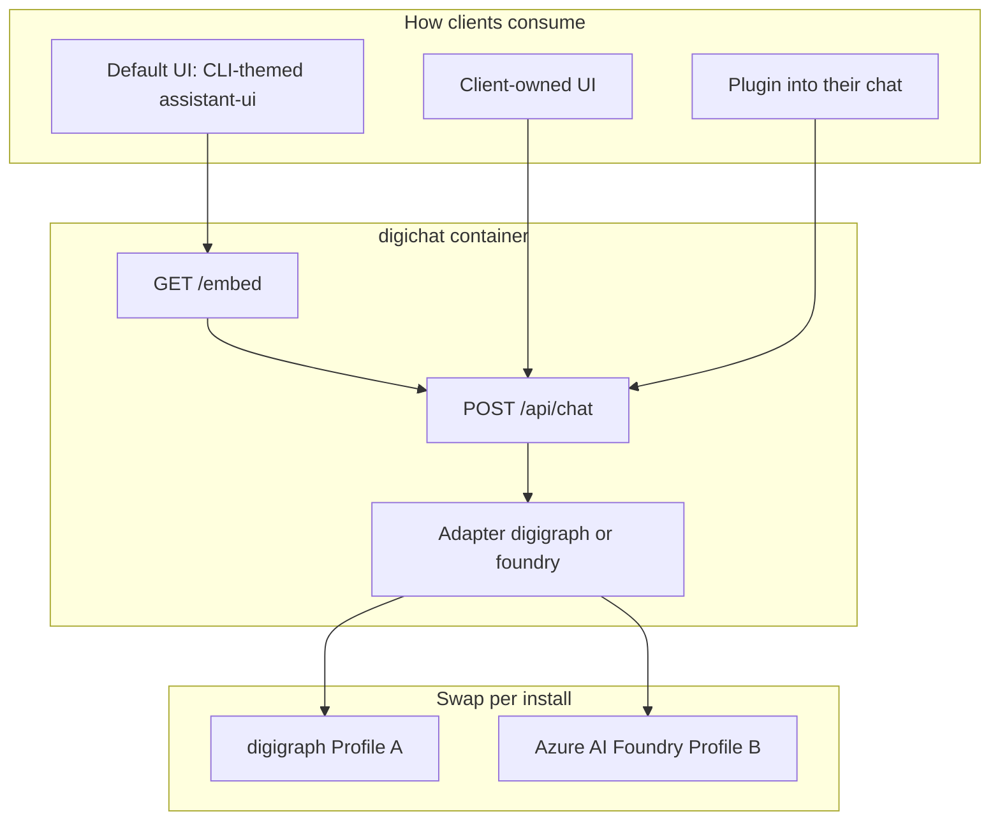

# digichat as a modular product

> digichat is a **self-hosted chat service**: BFF + optional default UI.
> Backends are pluggable (`digigraph` | `foundry`). Adapters translate provider
> streams into the shared AI SDK UI message stream.

**Status:** Living architecture note (2026-09-05)
**Related:** [ADR-0018](../adr/0018-digichat-path-routing.md), [ADR-0028](../adr/0028-digichat-web-foundation-and-opencode-distribution.md), [product / renderer contract](digichat-renderer-contract.md), [`frontend/digichat/ARCHITECTURE.md`](../../frontend/digichat/ARCHITECTURE.md)
**Naming:** Digi module names are always lowercase in prose ([PR #2007](https://github.com/digithings-ai/digithings/pull/2007)).

---

## 1. Product shape

digichat is the **containerized chat product**:

1. **BFF (the product)** — `POST /api/chat` AI SDK UI stream; auth; persistence;
   tenant/embed policy; adapters
2. **Default UI** — CLI-themed assistant-ui (`CliThread`) at `/chat` and `/embed`
3. **Shared helpers** — `@digithings/digichat-ui` CSS, slash, brand marks,
   transcript markdown (not a session shell)
4. **Tenant registry** — `DIGICHAT_EMBED_TENANTS` (hostname → branding + policy + `backend.type`)

Parents (digithings-web, dashboard, `widget.js`) iframe `/embed`. Client-owned
UIs and “plugin into their chat” use the same HTTP contract. `DigiChatSession`
and `ChatActivities` are gone from the 2.0 session path.

**Rules**

- UI never speaks digigraph / Foundry / OpenAI wire formats.
- Each adapter’s job is **translation only** into `ActivitySpan` then
  `writeStandardActivity` + text stream.
- digithings tenants use `backend.type: digigraph`. digigraph owns digivault,
  digisearch, and digillm.
- digivault / digisearch are **not** digichat HTTP backends — they are digigraph tools.
- Azure / boundary-agent clients use `backend.type: foundry` (Profile B).
- digichat Node accepts only `digigraph` | `foundry`.



**Layout**

```text
frontend/digichat/src/lib/adapters/
  digithings/
    stream.ts
    activity/{digivault.ts,digisearch.ts,index.ts}
  foundry/stream.ts
  shared/messages.ts
```

---

## 2. Install profiles

| Profile | What runs | Backend |
|---------|-----------|---------|
| **A** | digichat + digigraph stack | digigraph → digillm / digivault hub |
| **B** | digichat (+ db) only | Azure AI Foundry (`DefaultAzureCredential`) |

See [`infra/digichat-release/README.md`](../../infra/digichat-release/README.md) and
[`docs/digichat/INSTALL.md`](../digichat/INSTALL.md). digithings.ai dogfood is
Profile A on Cloudflare Containers (Pages shell iframes same-host `/embed`).

**Hard rule:** do not grow a digithings-hosted multi-client SaaS. Clients install
**their** digichat. Scale by release + adapters + corpus ingest — not a second
chat app. No `digiquant.io/chat` page; dashboard uses the digithings.ai embed
popup (`?host=digiquant.io`).

---

## 3. Client onboarding checklist

```text
[ ] digichat Node reachable; DIGICHAT_EMBED_HOSTS at build; DIGICHAT_EMBED_TENANTS at runtime
[ ] backend.type: digigraph (Profile A) or foundry (Profile B / Azure)
[ ] activityDetail set explicitly (off|labels|full)
[ ] Profile A: DIGIGRAPH_INTERNAL_URL, digikey auth, DIGIVAULT_URL on digigraph
[ ] Profile B: Azure identity on the host (no Foundry API key in digichat env)
[ ] Smoke: default UI /embed OR headless POST /api/chat against the same stream
```

---

## 4. Foundry (boundary agents)

Foundry is a **first-class backend**, not leftover chrome. Same default UI and
same `POST /api/chat` contract. Adapter specifics stay in
`adapters/foundry/stream.ts`: event → `writeStandardActivity`, conversation
continuity via `data-conversation` / `X-External-Conversation`, turn mutation
when the items API exists. Do not leak Foundry’s native protocol to the browser
and do not fork the React tree per backend.

---

## 5. End goal — self-hosted digichat

**What stays centralized (in the product/repo)**

1. digichat BFF + default assistant-ui + adapter layer (digigraph | foundry)
2. digigraph → digillm → LiteLLM + digivault as digigraph tools
3. Release artifacts, Compose/runbooks, tenant config shape

**What is per client**

1. Where digichat runs
2. Backend choice and secrets
3. Corpus / ingest — not a digichat fork
