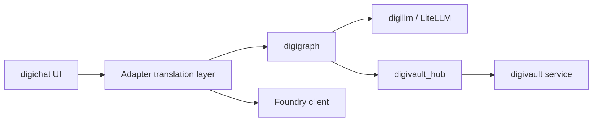

# digichat as a modular frontend

> Scope and design — digichat is a backend-agnostic translation UI. digithings
> tenants talk to digigraph (digillm + digivault hub). Client embeds may use
> Foundry. Adapters only translate provider streams into shared digichat visuals.

**Status:** Living architecture note (2026-08-09)
**Related:** [ADR-0018](../adr/0018-digichat-path-routing.md), [ADR-0028](../adr/0028-digichat-web-foundation-and-opencode-distribution.md), [renderer contract](digichat-renderer-contract.md), [activity protocol](../superpowers/specs/2026-08-01-digichat-activity-protocol-design.md), [`frontend/digichat/ARCHITECTURE.md`](../../frontend/digichat/ARCHITECTURE.md)
**Naming:** Digi module names are always lowercase in prose ([PR #2007](https://github.com/digithings-ai/digithings/pull/2007)).

---

## 1. Adapter contract

digichat is a **modular frontend + BFF**:

1. **Shared UI** — `@digithings/digichat-ui` (`DigiChatSession`, `ChatActivities`)
2. **Activity contract** — `ActivitySpan` → `DigiChatActivity`; server-side `activityDetail` gate
3. **Tenant registry** — `DIGICHAT_EMBED_TENANTS` (hostname → branding + policy + backend)
4. **Provider adapters** — translate backend wire formats into the activity vocabulary

**Rules**

- digichat UI never speaks digigraph / Foundry / OpenAI wire formats.
- Each adapter’s job is **translation only** into `ActivitySpan` / `data-digichatActivity` + text stream.
- digithings tenants must use `backend.type: digigraph`. digigraph owns digivault, digisearch, and digillm.
- digivault / digisearch are **not** digichat HTTP backends — they are digigraph tools; digichat only has activity mappers under `adapters/digithings/activity/`.
- Client (non-digithings) embeds use `backend.type: foundry`.
- digichat Node accepts only `digigraph` | `foundry`. Unused `external-relay` and digichat-Node `digivault` backends are removed.



**digithings path**

```text
Browser → digichat BFF → digigraph → digillm → LiteLLM
                              └─ digivault_search_notes (digivault_hub → digivault :8004)
```

**Layout**

```text
frontend/digichat/src/lib/adapters/
  digithings/
    stream.ts
    activity/{digivault.ts,digisearch.ts,index.ts}
  foundry/stream.ts
  shared/messages.ts
```

---

## 2. Current vs target (digithings.ai/chat)

| | Current (until cutover complete) | Target |
|---|---|---|
| Host | Cloudflare Pages Function | digichat Node behind Cloudflare Tunnel |
| LLM | OpenRouter direct from Pages | digigraph → digillm → LiteLLM |
| Vault | Direct Supabase digivault search in Function | digigraph `digivault_hub` → digivault :8004 |
| digichat backend | n/a (bypasses digichat Node) | `backend.type: digigraph` |

Cutover runbook: [`infra/digichat-digithings/README.md`](../../infra/digichat-digithings/README.md).

---

## 3. Client onboarding checklist

```text
[ ] digichat Node reachable; DIGICHAT_EMBED_HOSTS at build; DIGICHAT_EMBED_TENANTS at runtime
[ ] backend.type: digigraph (digithings) or foundry (Azure client)
[ ] activityDetail set explicitly (off|labels|full)
[ ] digithings stack: DIGIGRAPH_INTERNAL_URL, digikey auth, DIGIVAULT_URL on digigraph
[ ] Smoke: tool rows + answer via digigraph (no direct OpenRouter from digichat)
```

---

## 4. Foundry

Foundry remains the client Azure adapter. Behavior polish (reasoning summary, activity parity) is tracked separately — not required for digithings digigraph cutover.

---

## 5. End goal — self-hosted digichat, not a shared SaaS chat

**Delivery model:** digithings ships **self-hosted AI infra**. Clients install a digichat **release from GitHub** and run it in **their own** environment (Compose, ACA, k8s, etc.). There is **no** live shared digichat that all clients point at.

Same pattern as DataTap today: client-hosted digichat Node + their backend (Foundry or digigraph stack). digithings.ai/chat is digithings’ **own** instance of that same product — not a multi-tenant host for other companies.

**What stays centralized (in the product/repo)**

1. digichat UI + BFF + **adapter layer** (digigraph | foundry)
2. digigraph → digillm → LiteLLM (OpenRouter) + digivault as digigraph tools
3. Release artifacts, Compose/runbooks, tenant **config shape** (`DIGICHAT_EMBED_TENANTS`)

**What is per client (their install)**

1. Where digichat runs (their cloud / on-prem)
2. Backend choice and secrets (digigraph stack vs Foundry)
3. Corpus / ingest (e.g. crawl site → PDF/OCR → digivault) — not a digichat fork

**Hard rule:** do not grow a digithings-hosted multi-client digichat. Scale by shipping a clean release + adapters + digigraph/digivault modules clients can configure. Custom work is ingest pipelines and tenant config, not a second chat app.

**Near-term foundation**

1. digithings’ own digichat install: digigraph path proven (local Compose; operator host when digithings needs public `/chat`)
2. Release packaging / runbooks so a client can `install digichat + stack` without digithings hosting it
3. Tenant/backend config as the only per-deploy digichat surface

**Install guide:** [`docs/digichat/INSTALL.md`](../digichat/INSTALL.md)

**Later (client documentation chatbot)**

- Client (or digithings helping them) runs **their** digichat + digigraph + digivault
- Ingest into **their** vault via offline `scripts/docs_onboard/` (docs-focused crawl →
  PDFs → digivault and/or digisearch) — runbook
  [`CLIENT-DOCS-ONBOARD.md`](../digichat/CLIENT-DOCS-ONBOARD.md); ops index
  [`CLIENT_PIPELINES.md`](../ops/CLIENT_PIPELINES.md)
- Same digichat release; different env, secrets, and corpus. Not a digichat fork.

