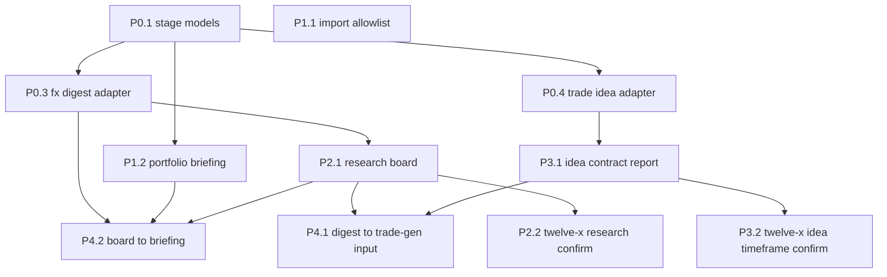

# ADR-0030 stage modules — implementation plan

> **For agentic workers:** Implement one package file under `docs/plans/adr-0030/packages/`. Do not implement a wave from this page alone. This plan is **Proposed** for Chris to skim via One. It does not mark implementation done, and it does not amend ADR-0030's Accepted text.

**Goal:** Name and stub the swappable stage handoffs so digiquant and twelve-x can be composed as one pipeline family, without changing recommendation policy and without enabling execution.

**Architecture:** Stage 1 emits `ResearchDigest`. Stage 2 is either `digiquant.portfolio` (long horizon) or twelve-x trade generation (short horizon, package stays in `digithings-ai/twelve-x`). Stage 3 is only `digiquant.execution`, and it stays off for twelve-x. Adapters are pure Pydantic functions in `digiquant.stages`. They do not invoke graphs, write Supabase, or build `OrderIntent` rows.

**Tech stack:** Python 3.12, Pydantic v2, existing `digiquant.research` / `digiquant.portfolio` / `digiquant.execution` packages, pytest unit tests. No new service. No pandas.

**Status:** Proposed (2026-09-29). Parent epic [#4762](https://github.com/digithings-ai/digithings/issues/4762). Decision record [ADR-0030](../../adr/0030-swappable-digiquant-stage-modules.md) (Accepted on [#4763](https://github.com/digithings-ai/digithings/pull/4763), `develop` commit `dc8e06365`).

## Global constraints

- Digi product names stay lowercase in prose (`digiquant`, `twelve-x`, `digithings`).
- Polars only if a package touches a frame. These packages do not. Never pandas.
- Pydantic v2 models. `extra="forbid"` on contract models. `extra="ignore"` only on reader-row inputs.
- Ruff line length 100. Imports at module top.
- No live trading. Do not set `DIGIQUANT_EXECUTION_ROUTING`. Do not edit `digiquant/brokers/`, `digiquant/src/digiquant/execution/router.py`, `digiquant/src/digiquant/execution/policy.py`, or `digiquant/src/digiquant/execution/route_cron.py`.
- Do not re-enable house GitHub Actions schedules. [#4761](https://github.com/digithings-ai/digithings/issues/4761) owns where jobs run.
- twelve-x Supabase stays a separate project from digiquant `core`. No migration that merges them. `economic_calendar` stays on `core`.
- Trade generation stays in `digithings-ai/twelve-x` for these waves. Do not move it under `digiquant/`.
- Consensus timeframe contract is `medium` | `long`. Any other string is display-only.
- twelve-x never executes in these waves. Only `digiquant.execution` may submit, and only after a future human-gated issue that this plan does not file as an agent task.
- Recommendation policy stays put: pair allow/deny, risk-style directives, strategist pass count, relevance weights, level repair, and which ideas the book contains.
- Branch from current `origin/develop` with `make task ISSUE=N` once the child issue exists. PR body uses `Refs #4762` and `Refs #<child>`. Do not write `Fixes #4762` (that would close the epic).
- Each package PR is one package. Do not batch packages.

## Evidence limit

`GET /repos/digithings-ai/twelve-x` returned **HTTP 404** for this session's GitHub token on 2026-09-29. The upload paths named in the planning task (`ADR-0030_d609.md`, `twelve-x-paths_6aed.txt`, `graph_e103.py`, `models_0ff6.py`, `timeframe_d227.py`, `nodes_trade_ideas_76e4.py`, `nodes_digest_43cb.py`, `nodes_scrape_910e.py`, the three twelve-x docs, `AGENTS_9aab.md`) were **not on disk** under `/home/ubuntu/.cursor/projects/workspace/uploads/`.

Producer Python was not opened. Packages that would edit twelve-x (P2.2, P3.2) stop on 404. They do not invent node names. Paths below are only the ones this monorepo already names:

| Source in this repo | Path it names |
|---------------------|----------------|
| `digifetch/ARCHITECTURE.md`, `digifetch/AGENTS.md` | `twelve_x/nodes/scrape.py`, `twelve_x/fx_calendar/scraper.py`, twelve-x `config.py` (`PRIMEMARKET_*`, `TE_CALENDAR_URL`) |
| `apps/digithings-cron/src/jobs.ts` | `daily_run_asia.yml`, `daily_run_london.yml`, `daily_run_new_york.yml`, `market_context_ingest.yml`, `primemarket_session_heartbeat.yml`, `session_catchup.yml`, `performance_eval.yml`, `archive_maintenance.yml` on repo `digithings-ai/twelve-x` |
| `apps/dashboard/lib/twelve-x/types.ts` | Reader tables and field names (authoritative for adapters) |
| `apps/dashboard/components/twelve-x/HowItWorksTab.tsx` | Seven-step copy. Not a file-level map of the producer |

## Locked defaults (plan, not an ADR rewrite)

Chris skipped the widget. Implementers treat these as locked for this plan. They stay **proposed** until Chris skims. Do not edit the open-question section of ADR-0030 to mark them decided.

1. Trade generation stays in `digithings-ai/twelve-x` for these waves.
2. Timeframe contract: `medium` \| `long` on consensus. Free strings (`1-3M` and anything else) are display-only.
3. twelve-x never executes until a separate human-gated issue. The only submit path then is `digiquant.execution`.
4. twelve-x Supabase stays separate from digiquant `core`.
5. Build digiquant stage contracts and adapters first. twelve-x producer edits wait until a token can read that repo.

## Architecture restatement

Three stages, two compositions, shared handoffs.

| Stage | Job word | digiquant baseline | twelve-x composition |
|-------|----------|--------------------|----------------------|
| 1 Research | research | `digiquant.research` `build_research_graph` | Desk briefs + Prime Market + scrapes, published as the FX Hub research tables |
| 2 Investment / trade generation | portfolio, or trade-generation | `digiquant.portfolio` `build_portfolio_graph` | Ranked ideas + levels in `fx_trade_ideas_snapshot`. Stays in the twelve-x repo |
| 3 Execution | execution | `digiquant.execution.route_pending_orders` when `DIGIQUANT_EXECUTION_ROUTING` is on | None. Hub copy: it never executes trades |

`digiquant.dashboard` is the operator surface. It is not a fourth stage.

House chain today: `run_research_then_portfolio` in `digiquant/src/digiquant/portfolio/chain.py`. Cron `apps/digithings-cron` dispatches `pipeline-digiquant.yml` type `digiquant-baseline`. twelve-x clocks are the other composition. Do not merge those workflows.

### Handoffs

| Boundary | Type that already exists | Type this plan adds | Rule |
|----------|--------------------------|---------------------|------|
| Research → stage 2 | `DigestPayload` inside `SnapshotEnvelope` (`digiquant/src/digiquant/research/snapshot.py`). Thesis/market read only `date`, `body`, `regime_label` via `digest_briefing_for_portfolio` (`digiquant/src/digiquant/research/segments.py`) | `ResearchDigest` | Adapters copy those three briefing fields. They do not pass a full `ResearchState` |
| twelve-x research → its trade generation | Hub rows `fx_daily_digest`, `fx_research_history`, `fx_relevance_ledger`, `fx_events_snapshot`, `fx_consensus_snapshot` | `TwelveXResearchBoard` | Validate the reader shape. Do not rescore |
| Trade generation → execution | No payload today. Portfolio books `OrderIntent` (`digiquant/src/digiquant/portfolio/models/portfolio_ledger.py`) | `TradeIdeaSnapshot` plus `refuse_order_intent` | Naming the boundary is not permission to insert an intent |
| Consensus horizon | `Timeframe = 'medium' \| 'long'` in `apps/dashboard/lib/twelve-x/types.ts` | `ConsensusTimeframe` | `FxTradeIdeaRow.timeframe?: string` and confluence `components.timeframe: string \| null` stay display-only |

### Compositions (targets)

| Research | Stage 2 | Execution | This plan |
|----------|---------|-----------|-----------|
| `digiquant.research` | `digiquant.portfolio` | `digiquant.execution` when the switch is on | House chain. Untouched except the import ratchet (P1.1) and an additive briefing helper (P1.2) |
| twelve-x research adapters | twelve-x trade generation | none | Reader-side contracts (P2.1, P3.1). Producer confirm is P2.2 / P3.2 and stops on 404 |
| `digiquant.research` | twelve-x trade generation | none | P4.1 wraps a `ResearchDigest` as `TradeGenerationInput`. No ranking, no ideas emitted |
| twelve-x research adapters | `digiquant.portfolio` | switch stays as it is today | P4.2 returns the briefing dict. It does not call `graph.invoke` |

### What stays shared

Stage payload names, snapshot/ledger persistence style, separate Supabase projects, human gates on live venues, `digithings-cron` as the only scheduler, digikey for digithings service calls, the FX Hub session path in `apps/dashboard/lib/twelve-x/session.ts`, digisearch wake owned by `digiclaw` (not by a stage), secrets staying in the site consumer (Prime Market, Trading Economics). `digifetch` still reads no environment variables. Wiring twelve-x scrapers onto `digifetch` is not part of any package here.

### What may not happen in these packages

A second order router. A twelve-x broker client. Default-on execution. Treating the dashboard watchlist as a generation directive. Package moves. Recommendation-policy changes. Editing house workflow schedules.

## Soft seams this plan is allowed to touch

ADR-0030 names the drift. These packages do not "finish" it.

- `PortfolioState = ResearchState` in `digiquant/src/digiquant/portfolio/state.py` stays. P1.2 adds a briefing helper beside it.
- `python -m digiquant.portfolio.graph --from-digest` keeps loading a full `ResearchState` JSON file (`_load_state` in `digiquant/src/digiquant/portfolio/graph.py`). Do not change that CLI.
- Cross-imports measured on `dc8e06365` (AST walk, including function-body imports): portfolio → research 103, research → portfolio 28, execution → portfolio 4, portfolio → execution 2, research → execution 1, across 48 files. P1.1 freezes that set. It does not delete imports.

## Wave graph

P1.1 has no edge. It starts with P0.1.

| Wave | Packages | What "done" means |
|------|----------|-------------------|
| W0 | P0.1, then P0.3 and P0.4 | Contract types exist. FX rows map in. `refuse_order_intent` raises |
| W1 | P1.1 (with W0 start), P1.2 after P0.1 | Import set is frozen. Briefing dict can be built from `ResearchDigest` without a graph call |
| W2 | P2.1 after P0.3. P2.2 after P2.1 and only with twelve-x read access | Research board validates. Producer files are not guessed |
| W3 | P3.1 after P0.4. P3.2 after P3.1 and only with twelve-x read access | Timeframe and levels are classified. Book contents do not change |
| W4 | P4.2 after P0.3+P1.2+P2.1. P4.1 after P2.1+P3.1 | Cross-composition adapters exist as pure functions |
| W5 | Not an agent package | Interface is the `refuse_order_intent` function shipped in P0.1, plus the section below. Do not file an implementation issue |

### Parallel-ready count

11 child packages are specified. **2** have no dependency and can start together: **P0.1** and **P1.1**.

After P0.1 merges, **3** more are parallel with each other: **P0.3**, **P0.4**, **P1.2**. **P2.1** starts when P0.3 has merged (it imports `FxDailyDigestInput` rather than copying it) and can overlap P0.4 and P1.2.

After that fan-in: **P3.1** (needs P0.4) and **P4.2** (needs P0.3, P1.2, P2.1) can run in parallel. **P4.1** waits until both P2.1 and P3.1 have merged.

**P2.2** and **P3.2** are not parallel-ready to code. They stop until `gh api repos/digithings-ai/twelve-x` returns 200.

W5 is documented here and inside P0.1. It is not a twelfth coding issue.

## Agent work packages

Child issues are filed. Epic #4762 body edit and comments returned HTTP 403 (`Resource not accessible by integration`), so this table is the index.

| ID | Issue | Spec | Lane | Blocked by | Unblocks |
|----|-------|------|------|------------|----------|
| P0.1 | [#4764](https://github.com/digithings-ai/digithings/issues/4764) | [P01](packages/P01-stage-handoff-models.md) | OpenCode free implement. Stronger review on `refuse_order_intent` | none | P0.3, P0.4, P1.2 |
| P1.1 | [#4765](https://github.com/digithings-ai/digithings/issues/4765) | [P11](packages/P11-import-allowlist.md) | OpenCode free implement | none | later boundary refactors, not this epic's other packages |
| P0.3 | [#4766](https://github.com/digithings-ai/digithings/issues/4766) | [P03](packages/P03-fx-digest-adapter.md) | OpenCode free implement | P0.1 | P2.1, P4.2 |
| P0.4 | [#4768](https://github.com/digithings-ai/digithings/issues/4768) | [P04](packages/P04-trade-idea-adapter.md) | OpenCode free implement. Stronger review | P0.1 | P3.1 |
| P1.2 | [#4769](https://github.com/digithings-ai/digithings/issues/4769) | [P12](packages/P12-portfolio-briefing.md) | OpenCode free implement | P0.1 | P4.2 |
| P2.1 | [#4770](https://github.com/digithings-ai/digithings/issues/4770) | [P21](packages/P21-research-board.md) | OpenCode free implement | P0.1, P0.3 | P4.1, P4.2, P2.2 |
| P3.1 | [#4771](https://github.com/digithings-ai/digithings/issues/4771) | [P31](packages/P31-trade-idea-contract-report.md) | OpenCode free implement | P0.4 | P4.1, P3.2 |
| P4.2 | [#4772](https://github.com/digithings-ai/digithings/issues/4772) | [P42](packages/P42-board-to-portfolio-briefing.md) | OpenCode free implement | P0.3, P1.2, P2.1 | none in this epic |
| P4.1 | [#4773](https://github.com/digithings-ai/digithings/issues/4773) | [P41](packages/P41-research-to-trade-generation-input.md) | OpenCode free implement | P2.1, P3.1 | none in this epic |
| P2.2 | [#4774](https://github.com/digithings-ai/digithings/issues/4774) | [P22](packages/P22-twelve-x-research-producer.md) | Needs twelve-x read access and stronger review | P2.1, and HTTP 200 on the twelve-x repo | none until access exists |
| P3.2 | [#4775](https://github.com/digithings-ai/digithings/issues/4775) | [P32](packages/P32-twelve-x-trade-generation-producer.md) | Needs twelve-x read access and stronger review | P3.1, and HTTP 200 on the twelve-x repo | none until access exists |

Label every child `agent-task` and `component:digiquant`. Body starts with `Parent: #4762`. Do not use `Fixes #4762`.

## W5 — execution opt-in (do not implement)

This is the whole execution interface for this epic:

- Stage 2 trade generation ends at `TradeIdeaSnapshot`.
- `refuse_order_intent(idea)` raises `ExecutionOptInRequired` and returns nothing.
- `digiquant.execution.router.route_pending_orders` keeps reading portfolio `OrderIntent` rows only.
- `DIGIQUANT_EXECUTION_ROUTING` stays default off (`digiquant/src/digiquant/execution/policy.py`).
- A future human-gated epic may specify a mapping from a trade idea to an `OrderIntent` (`id`, `approved_target_id`, `run_date`, `symbol`, `quantity`, `status`). That mapping is not designed here, because a trade idea has no approved target, no quantity, and no workspace. Inventing those fields would be a broker path.
- Do not file that epic as `agent-task`. Chris opens it, if he wants it, after this plan is skimmed.

## Out of scope for every package

- `digikey/` auth, JWT, crypto.
- `digiquant/brokers/` and any live venue.
- Setting or defaulting `DIGIQUANT_EXECUTION_ROUTING=1`.
- Re-enabling schedules in `.github/workflows/pipeline-digiquant*.yml` or twelve-x workflow files.
- Moving trade generation under `digiquant/`.
- Merging Supabase projects.
- Pair allow/deny, risk-style generation, new ranking, new strategist passes, level repair, watchlist steering.
- Rewiring scrapers onto `digifetch`.
- Editing `apps/dashboard` display components. Reader types in `types.ts` are the contract source; do not change them in these packages.
- Nautilus backtests, strategy research, tearsheets.

## Spec coverage check

| ADR-0030 requirement | Package |
|----------------------|---------|
| Stage contracts and handoff names | P0.1 |
| twelve-x is a composition, not a fork | Master plan. No package move |
| Timeframe not frozen by the ADR; plan default medium\|long | P0.1 `split_timeframe`, P0.4, P3.1 |
| Import direction is a target, not today's tree | P1.1 freezes; does not rewrite |
| `--from-digest` still accepts `ResearchState` | P1.2 does not change the CLI |
| FX digest / desk board is research output | P0.3, P2.1 |
| Ideas + levels are stage 2 | P0.4, P3.1 |
| Dashed mixes need adapters | P4.1, P4.2 |
| twelve-x does not execute | P0.1 `refuse_order_intent`, W5 not filed |
| Separate Supabase | No package touches SQL |
| #4761 orthogonal | No package edits cron schedules |
| Producer seven-step map unconfirmed | P2.2, P3.2 stop on 404 |
| Recommendation customization still gated | No package changes ranking or the book |

## Coordinator dispatch

Issues are already filed. Epic #4762 could not be edited (HTTP 403 on `updateIssue` and `addComment`).

1. Start **P0.1** (#4764) and **P1.1** (#4765) immediately, two agents.
2. When #4764 is merged to its base, start **P0.3** (#4766), **P0.4** (#4768), and **P1.2** (#4769) together. Start **P2.1** (#4770) when #4766 has merged.
3. Then **P3.1** (#4771) and **P4.2** (#4772) together.
4. Then **P4.1** (#4773).
5. **P2.2** (#4774) and **P3.2** (#4775) only after a human token can `gh api repos/digithings-ai/twelve-x` and get 200. If the agent sees 404, it comments and stops. It does not write producer files from memory.
