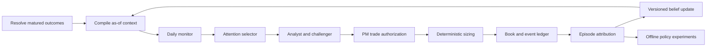
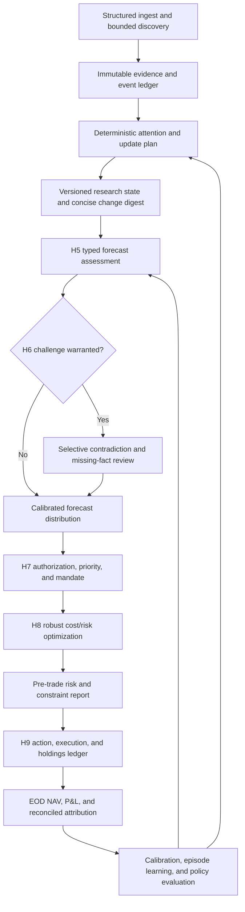

# Olympus Pipeline Review — Continuity, Decisions, and Learning

**Date:** 2026-08-06
**Status:** Architecture and production-evidence review complete; implementation has not started
**Scope:** Olympus daily Atlas A0–A4 → Hermes H1–H9 research and paper-portfolio loop
**Method:** Read-only source review plus read-only production Supabase measurements
**North star:** A self-improving hedge-fund process whose prior conclusions remain falsifiable

No application code was changed as part of this review. Proposed architecture and policy changes
must be validated separately and traced to dedicated GitHub issues before implementation.

---

## 1. Executive summary

Olympus has the major components of an institutional investment process: research ingestion,
thesis formation, analyst evidence, PM decisions, deterministic sizing, position booking,
performance history, attribution, and delayed reflection. The central weakness is not missing
components; it is that they do not yet form a reliable closed learning loop.

The current loop persists prior artifacts, but it does not consistently connect:

```text
forecast → evidence version → PM decision → booked action → position episode
         → realized attribution → belief revision → future decision context
```

Consequences observed in source and production data:

1. H7 receives limited performance context and no confirmed structured beliefs input.
2. H8 converts H7 ordinal rank into sizing conviction, weakening H5's cardinal evidence signal.
3. Delayed evaluation scores H5 analyst calls, not actual H7/H8 portfolio transitions.
4. Attribution is computed and shown to users but is not supplied to decision agents.
5. Position-event reasons are reconstructed from snapshots when decision artifacts are absent.
6. Daily re-interpretation produces frequent portfolio resizing without requiring material new
   evidence or thesis invalidation.
7. Learning is stored mainly as prose, with weak provenance and no reliable action linkage.

The recommended target is a **structured evidence ledger plus a role-specific context compiler**.
Raw transcripts remain an audit archive, and daily prose remains a generated human briefing, but
neither should be the source of operational memory.

The governing rule is:

> Memory is evidence, not authority. Every inherited conclusion must carry provenance,
> counter-evidence, a review horizon, and an invalidation path.

---

## 2. Current pipeline

The canonical design is one daily graph. Cost and continuity vary per artifact through
`skip | edit | full`; graph topology does not fork by cadence or cost tier. See the
[daily thesis design](../superpowers/specs/2026-06-20-olympus-daily-thesis-design.md) and the
[Hermes operator guide](../../digiquant/src/digiquant/portfolio/docs/AGENTS.md).

| Stage | Owner | Purpose | Principal output |
|---|---|---|---|
| A0 | Atlas preflight | Load prior artifacts, positions, theses, lessons, and performance | `PriorContext` |
| A1–A3 | Atlas research | Refresh alternative, institutional, macro, and market evidence | Research segments |
| A4 | Atlas synthesis | Produce a grounded daily market digest | `DigestPayload` |
| H1 | Hermes thesis review | Continue, challenge, create, or retire market theses | Thesis records |
| H2 | Hermes exploration | Search outside the inherited thesis set | Exploration documents |
| H3 | Hermes vehicle map | Map theses to investable vehicles | `thesis_vehicles` |
| H4 | Hermes screener | Select held, thesis-linked, and technical focus names | Focus roster |
| H5 | Hermes analyst | Assess itemized evidence and derive deterministic conviction | `AnalystPayload` |
| H6 | Hermes deliberation | Resolve PM and analyst disagreements | Deliberation summary |
| H7 | Hermes PM | Choose `long | flat` and ordinal priority; no weights | `PMDirectionMemo` |
| H8 | Deterministic risk | Convert direction and rank into portfolio weights | Sized book |
| H9 | Hermes commit | Persist positions, NAV, theses, brief, and decision log | Booked run |
| Learning | Atlas/Olympus | Resolve mature calls and occasionally distill lessons | Reflections and beliefs |

Authority is intentionally separated: H7 owns direction and ordering, H8 owns deterministic
weights, and H9 owns booking and lineage. That separation should remain.

---

## 3. Measured results

### 3.1 Historical analyst-call quality

Direction-aware, episode-level correction of the available resolved analyst calls produced:

| Metric | Result |
|---|---:|
| Hit rate | 42.1053% |
| Mean directional alpha | -0.7250% |
| Median directional alpha | -0.6743% |

These results are weak enough that confidence, selection, and portfolio-policy changes must be
treated as hypotheses to test, not assumed improvements.

### 3.2 Production portfolio activity

A read-only query measured 189 position rows across 20 observed book dates from 2026-06-23
through 2026-08-05. For each pair of observed snapshots, one-way turnover was:

$$
\operatorname{turnover}_t = \frac{1}{2}\sum_i |w_{i,t} - w_{i,t-1}|
$$

| Metric | Result |
|---|---:|
| Observed transitions | 19 |
| Transitions with a weight change above 0.01% | 17 |
| Mean one-way turnover | 17.41% |
| Median one-way turnover | 13.88% |
| 90th percentile | 40.47% |
| Maximum | 46.44% |
| Snapshot-inferred entries / exits | 11 / 9 |
| Same-ticker re-entries | 0 |

This short sample does not show same-name whipsaw. It does show frequent weight-policy changes:
two consecutive observed transitions moved approximately 30% of the portfolio without changing
the held names. These are snapshot-to-snapshot measurements, not an annualized turnover estimate.

### 3.3 Action-lineage quality

The production `position_events` table contained 104 rows:

| Event | Count |
|---|---:|
| OPEN | 31 |
| HOLD | 17 |
| TRIM | 34 |
| ADD | 20 |
| EXIT | 2 |

Every event reason said it was derived from the positions book because the proposed-position or
rebalance-decision artifact was unavailable. The discrepancy between two recorded exits and nine
snapshot-inferred exits further demonstrates that the system cannot yet reconstruct a complete,
reason-linked action history from its event records alone.

---

## 4. Principal weaknesses

### 4.1 Continuity without an operational memory contract

Preflight loads bounded prior artifacts, positions, theses, lessons, and the latest performance
snapshot. This provides continuity, but not a typed distinction between observations, beliefs,
theses, decisions, actions, and outcomes. Prose from different epistemic layers can therefore be
treated as if it carried the same authority.

The loader for the latest beliefs document exists in
[`supabase_io.py`](../../digiquant/src/digiquant/research/supabase_io.py), but no canonical
caller was found. H7 does not explicitly consume that document. Newly resolved reflections also
occur after prior context is assembled, so they are normally visible only on a later run.

### 4.2 Evaluation targets the recommendation, not the portfolio behavior

[`decision_log.py`](../../digiquant/src/digiquant/research/decision_log.py) resolves H5 calls
after a holding window and records return, benchmark alpha, and a short reflection. It does not
evaluate the actual H7 direction change, H8 weight change, or complete position/thesis episode.

This prevents questions such as:

- Did entering improve the portfolio relative to keeping the prior book?
- Did resizing add value after turnover and costs?
- Was an exit caused by invalidation, risk, drift, or a newly preferred opportunity?
- Would holding the prior position have outperformed the action taken?

### 4.3 Performance context is too thin for self-diagnosis

The agent-facing portfolio snapshot contains latest NAV and aggregate metrics, but omits the
position attribution already computed by
[`attribution.py`](../../digiquant/src/digiquant/research/attribution.py), turnover, holding
episodes, thesis-level contribution, confidence calibration, and action counterfactuals.

An LLM asked to explain one aggregate snapshot will generate plausible hindsight narratives. It
cannot reliably identify causes without deterministic attribution and linked action history.

### 4.4 Daily analysis is coupled too closely to daily portfolio revision

The graph may run daily without implying that the portfolio should be re-optimized daily. Current
turnover controls provide cadence and minimum-hold protection, but the default policy permits
frequent resizing after a short protection window. A stable thesis does not currently create a
strong default-to-hold authorization policy.

### 4.5 Confidence degrades between analysis and sizing

H5 derives conviction from itemized evidence. H7 emits direction and ordinal rank. The live H8
path maps the ordinal PM rank back into sizing conviction, losing much of the cardinal evidence
strength and uncertainty represented by H5. This makes portfolio sizing less evidence-grounded
than the analyst layer.

### 4.6 Attention is broad before it is evidence-ranked

H4 includes held names, thesis-mapped candidates, and technical candidates. H3 has no comparable
evidence score, so thesis-linked candidates receive broad analysis before expected impact,
uncertainty, evidence change, and urgency are compared. This consumes tokens while diluting
attention from positions whose risk or thesis state actually changed.

---

## 5. Temporal-memory alternatives

| Design | Strength | Primary failure | Recommendation |
|---|---|---|---|
| Replay prior transcripts | Maximum apparent continuity | Anchoring, stale-error contamination, high token cost, poor as-of filtering | Audit archive only |
| Daily reflection plus beliefs prose | Easy to build and inspect | Weak provenance, silent contradiction removal, hindsight narratives | Generated briefing only |
| Evidence ledger plus context compiler | Falsifiable, queryable, role-specific, temporally correct | Higher initial schema and resolver cost | Operational source of truth |

The three designs are complementary when assigned the correct authority:

1. Raw artifacts and transcripts are immutable audit evidence.
2. Prose is a generated human and agent briefing.
3. Structured records control retrieval, decisions, attribution, and learning.

---

## 6. Recommended target architecture



### 6.1 Structured evidence ledger

The operational record should distinguish six entities:

| Entity | Contract |
|---|---|
| Observation | Immutable fact with source, event time, and `known_at` time |
| Belief version | Claim, confidence, horizon, provenance, counter-evidence, and supersession |
| Thesis episode | Instrument-specific case, catalyst, horizon, state, and invalidation conditions |
| Decision intent | H7 action, alternatives, expected benefit, trigger, and evidence versions used |
| Portfolio action | Actual H8/H9 weight transition, costs, and booking lineage |
| Outcome evaluation | Realized attribution, calibration, counterfactuals, and resolution horizon |

Beliefs should be append-only versions rather than an overwritten prose blob. Each version should
include `belief_id`, prior version, scope, statement, confidence, horizon, review date, supporting
evidence, contradicting evidence, invalidation conditions, status, author, and creation time.

### 6.2 Thesis and position episodes

Thesis state and position state must remain separate:

```text
thesis:   candidate → active → challenged → confirmed | invalidated | expired
position: proposed  → open   → add | trim | hold      → exited
```

A position action references the active thesis and belief versions that authorized it. A thesis
may remain active while the portfolio is flat, and a risk exit need not assert that the thesis is
false.

### 6.3 Role-specific context compiler

Each agent should receive a bounded context capsule assembled strictly as of the run timestamp:

- Changes since that role's last successful run.
- Relevant active beliefs and confidence history.
- Strongest supporting and disconfirming evidence.
- Open theses, catalysts, expected horizons, and invalidation state.
- Existing positions and original authorization reasons.
- Newly matured outcomes, attribution, turnover, and calibration.
- Unresolved forecasts and scheduled review obligations.
- Source record identifiers for every inherited claim.

Raw transcripts should be available through explicit drill-down retrieval, not injected into every
prompt. Historical reconstruction must filter on both event time and `known_at` to prevent future
information from entering a past context.

### 6.4 Challenger contract

For decisions with material portfolio impact, a challenger pass should search specifically for
disconfirming evidence and alternative explanations. It should not be a generic bear persona. Its
output must identify the claim challenged, evidence searched, counter-evidence found, and whether
the original confidence remains justified.

Memory may increase retrieval priority, but it must never satisfy the evidence requirement by
itself.

---

## 7. Portfolio operating policy

Daily observation should not imply daily re-optimization. The default action should be `hold`.
A portfolio change should require at least one authorization condition:

1. A hard risk limit is breached.
2. A thesis invalidation condition is met.
3. Material new evidence changes expected return enough to clear uncertainty and switching cost.
4. A scheduled rebalance finds allocation drift beyond an approved band.
5. A superior opportunity exceeds an explicit replacement threshold after costs.

Minimum holding periods should not block risk exits. They should express an expected horizon and
raise the evidence threshold for discretionary reversals.

Strategic and tactical sleeves should have separate horizons, risk budgets, and evidence rules.
Strategic positions persist with a thesis; tactical positions require a catalyst and expiry.
Tactical evidence must not silently rewrite the strategic thesis. Exact capital splits should be
selected through backtests rather than fixed in the architecture.

H4 attention should be ranked by portfolio impact, uncertainty, evidence change, and urgency.
Held positions receive inexpensive monitoring by default; deep analysis is event- or review-gated.
A configurable exploration quota should remain available so persistence does not become lock-in.

---

## 8. Learning cadence and governance

| Cadence | Responsibility |
|---|---|
| Daily | Resolve due outcomes, ingest observations, monitor risk, compile context |
| Event-driven | Deep analysis, challenger review, and trade authorization |
| Weekly | Strategic allocation, contradictions, attribution, and thesis review |
| Monthly or sample-gated | Calibration and policy evaluation across completed episodes |
| Offline and human-gated | NautilusTrader validation and promotion of policy changes |

Agents may revise versioned beliefs within approved contracts. They may not modify code, prompts,
risk limits, or portfolio policy merely because a few recent decisions succeeded or failed.
Policy changes require a declared hypothesis, sufficient independent episodes, walk-forward tests,
cost sensitivity, and human review.

---

## 9. Validation design

Use NautilusTrader to compare these ablations without lookahead:

| Variant | Purpose |
|---|---|
| Current daily policy | Baseline |
| Weekly or event-gated trading | Isolate cadence and authorization effects |
| Thesis-duration policy | Test persistence and invalidation rules |
| Selective deep analysis | Test token savings and decision quality |
| Strategic and tactical sleeves | Test horizon separation |
| Simplified agent stack | Test whether each LLM stage adds marginal value |
| Ledger and context compiler | Test continuity and attribution-informed decisions |

Primary measures: net active return after costs, drawdown, turnover, holding duration, action hit
rate, confidence calibration, decision stability, attribution by reason, context-token cost, total
run cost, and marginal performance per stage.

---

## 10. Database evidence-pass checklist

This review inspected actual stored agent outputs and run diagnostics for:

1. Output completeness and schema compliance by A/H phase.
2. Repetition, unsupported claims, stale carry-forward, and contradiction handling.
3. Evidence density and citation/source quality.
4. H5 conviction consistency with itemized evidence.
5. H7 decisions relative to H5 analysis, prior positions, and thesis state.
6. H8/H9 action lineage relative to H7 intent.
7. Prompt, completion, cached, and total tokens by phase and run.
8. Estimated cost by phase, model, run mode, and output quality.
9. Failure, retry, carry, edit, and full-rewrite rates.
10. Stages with high cost but low decision or artifact impact.

Any stored output quoted in this review should be minimized and redacted where necessary. The
analysis should record aggregate evidence and representative failure patterns rather than copying
complete proprietary prompts or documents.

---

## 11. Current recommendation

Preserve the single Atlas → Hermes graph and deterministic H8/H9 authority split. Redesign the
information and authorization contracts around it:

1. Make the evidence ledger the source of temporal truth.
2. Compile role-specific context instead of replaying transcripts.
3. Resolve matured outcomes before compiling each run's context.
4. Evaluate booked portfolio episodes, not only analyst recommendations.
5. Feed deterministic attribution and behavioral diagnostics back to the relevant agents.
6. Require material evidence or risk events before changing the book.
7. Separate daily monitoring from slower strategic allocation and policy learning.
8. Validate every policy change offline before human-approved promotion.

This design gives Olympus day-to-day consistency without converting its own history into dogma.

---

## 12. Production output and economics audit

### 12.1 Evidence scope and trust boundary

The 2026-08-06 read-only database pass covered:

| Dataset | Rows | Date range |
|---|---:|---|
| `atlas_run_diagnostics` | 55 | 2026-06-23 through 2026-08-05 |
| `documents` | 2,466 | 2026-06-23 through 2026-08-05 |
| `daily_snapshots` | 41 | 2026-06-23 through 2026-08-05 |
| Latest-run documents | 106 | 2026-08-05 |

Cost history has a material trust limitation. Migration 065 changed diagnostics from one row per
workflow run to one row per retry attempt. Of 55 rows, 54 are legacy `attempt=0` rows and 28
provably overwrote an earlier attempt because `created_at < started_at`. The first and only fully
attempt-aware production row in this sample is 2026-08-05. Therefore:

- Historical token and cost totals below are **recorded floors**, not complete spend.
- A legacy row not proven overwritten can still be a false negative.
- Retry-adjusted distributions cannot yet be estimated reliably.
- Telemetry fields were added over time; an absent historical breakdown key is not proof that the
  corresponding event did not occur.

The implementation and migration explain this explicitly in
[`diagnostics.py`](../../digiquant/src/digiquant/research/diagnostics.py) and
[`065_atlas_run_diagnostics_attempt.sql`](../../digiquant/supabase/migrations/065_atlas_run_diagnostics_attempt.sql).

### 12.2 Recorded economics

#### Historical recorded floor

| Metric | Recorded value |
|---|---:|
| Estimated cost | **$55.1325** |
| Chat calls | 5,544 |
| Chat prompt tokens | 327,150,198 |
| Chat completion tokens | 5,342,889 |
| Chat tokens | 332,493,087 |
| Cached chat prompt tokens | 162,553,792 |
| Chat prompt cache-hit share | 49.69% |
| Web-search calls | 1,332 |
| Web-search tokens | 3,524,758 |
| Chat cost | $47.3804 |
| Web-search cost | $7.7522 |

The top-level `total_tokens` field is chat-only. The 3.52 million web-search tokens exist only in
`breakdown.by_kind` and are excluded despite the field's general name. The cost split is roughly
86% chat and 14% web search.

Highest recorded daily floors were:

| Date | Recorded cost | Chat tokens | Chat calls | Caveat |
|---|---:|---:|---:|---|
| 2026-06-24 | $6.2520 | 17,302,780 | 1,219 | Four legacy rows; prior attempts may be missing |
| 2026-07-26 | $4.6953 | 32,473,453 | 349 | Legacy row |
| 2026-08-02 | $4.6203 | 32,568,383 | 289 | Legacy row |
| 2026-08-04 | $4.3496 | 28,347,153 | 347 | Legacy row |
| 2026-07-31 | $4.0046 | 26,718,594 | 292 | Legacy row |

#### Latest attempt-aware run: 2026-08-05

| Metric | Value |
|---|---:|
| Status | `ok`; book materialized and committed |
| Duration | 3,368.19 seconds / 56.14 minutes |
| Fresh / carried / failed research segments | 20 / 7 / 0 |
| Chat calls | 296 |
| Web-search calls | 53 |
| Chat prompt tokens | 30,148,205 |
| Chat completion tokens | 626,864 |
| Chat tokens | 30,775,069 |
| Additional web-search tokens | 144,078 |
| Cached chat prompt tokens | 24,251,264 |
| Chat prompt cache-hit share | 80.44% |
| Mean prompt tokens per chat call | 101,852 |
| Recorded cost | **$2.13925** |
| Chat / search cost | $1.84639 / $0.29286 |

Caching made the monetary bill modest, but it does not make the process efficient. A successful
day consumed approximately 30.9 million recorded provider tokens, ran for nearly an hour, and
made 349 provider calls to produce 106 documents. The core concern is attention dilution,
latency, and inability to measure marginal stage value, not only dollars.

Usage capture in [`usage.py`](../../digigraph/src/digigraph/usage.py) aggregates only by call kind
(`chat`, `web_search`, and `x_search`). Phase, node, artifact key, ticker, edit mode, and per-model
cost are discarded. Consequently, the database cannot answer which A/H stage generated the 296
chat calls or which output justified its spend.

### 12.3 Latest output trace: H5 through H9

#### H5 analyst layer

The 2026-08-05 run wrote 30 analyst payloads:

| Measure | Result |
|---|---|
| Stances | 20 `hold`, 8 `buy`, 2 `sell` |
| Convictions | 15 at 0; 4 at +1; 6 at +2; 3 at +3; 2 at -1 |
| Evidence quality | 13 high, 6 medium, 11 absent |
| Sources per analyst | median 6.5; range 0–22 |
| High-quality evidence with zero conviction | 8 payloads |

High evidence quality does not itself imply directional conviction, so those eight rows are a
review queue rather than automatic errors. SPY is a confirmed example: H5 recorded high-quality
evidence, four confirming signals, three contradicting signals, and conviction zero; H6 explicitly
challenged that evidence-to-conclusion mismatch.

#### H6 deliberation layer

The latest run wrote 30 deliberations: 22 fresh and 8 carried. The fresh dialogues used 25 rounds
and stored 49 messages, establishing a lower bound of 49 dialogue calls before validation or
retry overhead. H6 changed the directional stance for 11 of 30 tickers.

However, every one of the 493 deliberations stored across the full database history satisfies:

```text
bull_thesis == bear_thesis == conclusion
```

The raw turn transcript still contains disagreement, but the final structured output destroys
the distinction it claims to preserve. This makes the three summary fields redundant and prevents
downstream agents from comparing the strongest remaining bull and bear cases.

#### H7 direction layer

H7 emitted 31 decisions: 7 `long` and 24 `flat`. Its prose memo said the portfolio was **75%
invested with 7 longs**. The memo ranked VGK, FXI, XRT, EWZ, XLF, XLV, and XLE as the seven longs.

#### H8 sizing and H9 booking

H8 emitted eight actions, all labeled `hold`, and every rationale was the same generic string:
`Position weight set by deterministic risk sizing.` H9 then committed:

| Measure | Committed result |
|---|---|
| Invested weight | **70.4721%** |
| Cash | 29.5279% |
| Long positions | **8** |
| Observed one-way turnover from 2026-08-04 | 4.8502% |

The difference is explained by deterministic policy, but not by persisted lineage:

1. H7 marked IBIT `flat`; it disappeared from the booked portfolio.
2. The H8 action list omitted IBIT entirely instead of recording an exit.
3. H7 marked XLY `flat`, but turnover/minimum-hold protection retained XLY at 5.4128%.
4. The H8 action recorded XLY as a generic `hold` without identifying the PM-direction override.
5. H7's 75%/7-long statement therefore disagrees with the authoritative 70.47%/8-long book.

The source of the exit omission is visible in
[`phase7e_risk_sizing.py`](../../digiquant/src/digiquant/portfolio/phases/phase7e_risk_sizing.py):
on the H7 memo path, synthesized actions iterate the sized tickers but do not emit prior holdings
that sizing removed. The actual book remains authoritative, but the human- and agent-facing reason
record is incomplete.

### 12.4 Edit-mode effectiveness

Across 608 stored document deltas:

| Measure | Result |
|---|---:|
| `updated` | 589 |
| `skipped` | 19 |
| Total patch operations | 4,215 |
| Updated rows with zero operations | 0 |

Only 3.1% of delta artifacts were skipped. On 2026-08-05, 18 of 21 deltas were updated and three
were skipped. Four updates materialized content identical to the prior day; the new
`content_freeze` telemetry correctly named them. Edit mode reduces output size, but current
triage still pays for many patch attempts, and some successful updates have zero informational
change.

### 12.5 Source lineage

The latest research and synthesis artifacts contained 433 structured source references:

| Measure | Result |
|---|---:|
| Source references | 433 |
| Unique source records | 328 |
| Duplicate references | 105 |
| References with URLs | 43 |
| Unique URLs | 32 |

Every structured source has only `id`, `url`, and `title`; 390 of 433 have no URL. Internal data
references without URLs are legitimate, but the source contract has no publication time, access
time, authority class, evidence type, or content hash. H5 further flattens its sources into strings
such as `price_history:SPY (Aug 4)`, losing even the structured reference.

Meanwhile, all 1,332 recorded web searches report `sources_used=0`, including 53 searches on
2026-08-05, despite URL-bearing sources appearing in published artifacts. The search observer and
artifact provenance therefore cannot be reconciled.

### 12.6 Attention width

The latest run deep-analyzed 30 tickers and H7 ranked 31. The cap helper in
[`roster_cap.py`](../../digiquant/src/digiquant/portfolio/roster_cap.py) defaults
`ATLAS_MAX_ANALYSTS` to `0`, which means no cap. No production workflow or Olympus config setting
for that variable was found. Production also has no `breakdown.roster` rows yet, so analyst width
cannot be correlated with cost historically from diagnostics alone.

---

## 13. Prioritized weak points

| ID | Priority | Weak point | Why it matters | Design direction |
|---|---|---|---|---|
| OLY-REV-001 | High | Decision intent, deterministic override, and booked transition disagree | Agents and operators cannot reconstruct why the actual book changed | Persist one post-policy transition ledger containing PM intent, every override, prior/target weight, and final action |
| OLY-REV-002 | High | Token/cost telemetry is phase-blind and legacy history is incomplete | Marginal stage value and retry-adjusted spend cannot be measured | Tag each call with run, attempt, phase, node, artifact, ticker, mode, model, and retry; retain per-call or per-node aggregates |
| OLY-REV-003 | High | Analyst fan-out is unbounded by default | A quiet successful run still made 349 provider calls and processed 30.9M tokens | Set an explicit tested attention budget; rank by held risk, evidence change, uncertainty, urgency, and exploration quota |
| OLY-REV-004 | High | H6 summary collapses bull, bear, and conclusion | Expensive deliberation leaves no structured record of remaining disagreement | Preserve distinct final cases and disputed claims, or simplify H6 to one challenger call plus deterministic resolution |
| OLY-REV-005 | High | Learning evaluates H5 calls rather than booked episodes | The system cannot learn whether entries, exits, or resizing added value | Resolve actual position/thesis episodes with hold/no-trade and benchmark counterfactuals |
| OLY-REV-006 | Medium | Source identity and freshness degrade downstream | Claims cannot be reliably re-verified or challenged later | Use immutable evidence IDs with event time, known time, URL/provider, authority, content hash, and claim links |
| OLY-REV-007 | Medium | Beliefs remain one unreferenced prose body | Prior conclusions can anchor future reasoning without provenance or contradiction state | Store append-only belief versions and compile only relevant, challengeable records |
| OLY-REV-008 | Medium | Evidence confidence is not calibrated through H5→H8 | H5 cardinal evidence is weakened into H7 rank, then reinterpreted for sizing | Preserve evidence strength and uncertainty separately from PM priority; test calibration against outcomes |
| OLY-REV-009 | Medium | Edit mode rarely skips and sometimes pays for content-identical updates | Token savings do not equal informational efficiency | Gate deep work on material evidence fingerprints; measure information changed per call |

---

## 14. Recommended next analysis

Before changing the pipeline, build a measurement baseline that closes the observability gaps:

1. Reconstruct a post-policy transition table for every observed book date, including omitted
    exits and minimum-hold overrides.
2. Grade a stratified sample of H5/H6/H7 outputs against source support, internal consistency,
    novelty, and downstream impact.
3. Add phase-tagged usage capture in a dedicated issue, then run several unchanged-policy days to
    establish cost by A/H phase and ticker.
4. Correlate completed decision episodes with the evidence version, H6 change, H7 authorization,
    H8 override, turnover, and realized attribution.
5. Use those measurements to choose which proposed redesign to test first. Current evidence makes
    action lineage and phase-level observability the prerequisites; without them, later ablations
    cannot explain why performance changed.

---

## 15. Provider-call reconstruction for 2026-08-05

### 15.1 Trust boundary

The run recorded 296 chat completions and 53 web-search completions, or 349 logical provider
calls. It is not possible to recover 349 historical request records. The usage accumulator keeps
individual calls only in process memory and persists aggregates by call kind. It discards the
timestamp, phase, node, ticker, artifact, edit mode, tool name, retry number, response ID, and
downstream consumer.

The ledger below therefore separates three levels of confidence:

- **Exact family count:** a persisted output or transcript maps one-to-one to a source-verified
    call path.
- **Reconciled search count:** source behavior, cache behavior, and the aggregate total uniquely
    reconcile the search families.
- **Unresolved chat residual:** the call occurred, but current telemetry cannot distinguish a
    function-tool turn from a validation retry or assign it to a phase.

No request identity or phase attribution is invented for the residual.

### 15.2 How one research invocation expands

`run_research_agent` is an invocation wrapper, not a single-call guarantee. For a tool-enabled
invocation its external-call cost is:

```text
1 initial chat
+ 0..5 additional tool-loop chats
+ 0..1 schema-validation retry
```

If all five rounds request tools, the helper makes a sixth tool-free chat to force a final answer.
The Pydantic wrapper can then make one final structured retry. A successful tool-enabled invocation
therefore uses 1–7 recorded chat calls. A tool-free invocation uses 1–2.

The tool executions themselves are local Supabase reads and do not increment provider usage. A
chat that only selects `get_price_technicals`, `query_research`, or another function does increment
usage even though it does not produce a persisted analytical conclusion.

### 15.3 Exact visible-call ledger

| Family | Search calls | Successful output chats | Result | Same-day portfolio contribution |
|---|---:|---:|---|---|
| Atlas segment maintenance | 6 | 19 | 19 segment patches/no-op decisions | Indirect through digest and portfolio context |
| Atlas digest synthesis | 0 | 1 | `digest-delta` | Indirect; consumed by Hermes |
| H1–H3 thesis track | 1 | 3 | Review, exploration, and vehicle-map state | Indirect; persistence/consumption is incomplete |
| H5 fresh analyst set | 22 | 22 | 22 fresh analyst documents | Consumed by H6/H7; zero fresh names entered the book |
| H6 fresh deliberations | 22 | 49 | 25 PM turns + 24 analyst replies | Consumed by H7; zero fresh names entered the book |
| H7 PM direction | 1 | 1 | One 31-name direction memo | Direct authority for direction/rank |
| Due-decision reflection | 0 | 46 | 46 resolved 2026-07-28 decisions | Future-learning only; not loaded into same-day context |
| Beliefs distillation | 1 | 1 | One beliefs blob folding the resolved backlog | Future-learning only; not a same-day portfolio input |
| **Visible/recoverable total** | **53** | **142** | 195 calls | Mixed |
| **Unresolved chat residual** | **0** | **154** | Tool-selection turns or validation retries | Unknown by current telemetry |
| **Recorded total** | **53** | **296** | **349 calls** | — |

The search count reconciles exactly:

```text
Atlas search-enabled segment edits        6
H1–H3 shared grounding request            1
H5 per-fresh-ticker grounding            22
H6 per-fresh-ticker grounding            22
H7 portfolio grounding                    1
Beliefs-distillation grounding            1
                                                                                 --
Total                                    53
```

H1–H3 all request the same generic `research` grounding query. They run sequentially with the same
model, date, prompt, and no function tools on the grounding pre-pass. The first request reaches the
provider; the next two reuse the process-local response cache and create no usage record. This saves
two calls but also means three distinct thesis jobs share one non-phase-specific search summary.

The Atlas six are `alt-sentiment-news`, `alt-cta-positioning`, `alt-politician-signals`,
`inst-institutional-flows`, `inst-hedge-fund-intel`, and `international`. The `macro` segment uses
its fresh ingested FRED layer and skips the stale-only paid fallback. `alt-ai-portfolios` was not
regenerated on this run.

### 15.4 What the 154 residual calls mean

The 154 residual chat calls are not 154 additional independent opinions. They are calls made inside
the 142 output-producing invocations, principally to:

1. ask for one or more function tools;
2. ingest the returned tool result and decide whether another tool is needed;
3. produce a final answer after tool use; or
4. re-emit an invalid answer as schema-valid JSON.

Current diagnostics cannot split those categories. It also cannot assign their 30.8 million chat
tokens or $1.85 chat cost to Atlas, H5, H6, reflection, or any ticker. The only defensible statement
is that 154 of 296 chat records, **52.0%**, were not themselves the successful structured output of
a graph invocation. Some were useful evidence-acquisition steps; some may have been avoidable tool
churn or formatting repair. Per-call tracing is required to distinguish them.

Provider-level HTTP retries are a separate blind spot. `digillm` records a logical completion only
after its internal provider/empty-response retry path finishes, so 296 is not necessarily the number
of billable network attempts.

### 15.5 Material-contribution findings

#### H1–H3 changed routing state, but new theses did not enter the book

The final daily tables show that H1/H2 carried all 30 prior market-thesis IDs and created two new
IDs. Across the 30 carried rows, six confidence values changed and two statuses moved from
`CHALLENGED` to `ACTIVE`. The database stores only the co-mingled daily snapshot, so those shared
row changes cannot be assigned unambiguously to the H1 review call versus the H2 exploration call.

H3 wrote 111 thesis-vehicle rows spanning 32 market theses and 46 unique tickers. Relative to
August 4, 41 thesis/ticker pairs were added, 18 were removed, and 19 shared pairs changed rank. The
map had broad routing reach:

- 29 of 30 H5 analyst tickers were H3-mapped;
- 17 H3-mapped tickers did not receive H5 coverage;
- five of seven H7 longs were H3-mapped; and
- six of eight booked longs were H3-mapped.

The two new H2 theses mapped six candidate tickers. Four reached H5 (`QQQ`, `SPY`, `VTI`, and
`XLK`), but none became an H7 long or a booked position. Thus the three H1–H3 output calls made
material changes to routing state and existing-thesis confidence, but the newly created thesis
branch had zero strict same-day inclusion impact. As with H5/H6 rejection work, its filtering value
requires a replay counterfactual; database reach alone is not evidence of portfolio contribution.

#### Duplicate ticker research dominates the visible daily workload

H5 and H6 each launched 22 web searches for the same 22 fresh tickers. Together they account for:

- 44 of 53 searches (**83.0%**);
- 71 successful structured chat outputs;
- at least 115 of 349 recorded provider calls (**33.0%**) before their unknown tool-loop share.

H6 receives the H5 analyst document and its evidence, but performs another paid search before every
ticker debate. The second search is not a targeted contradiction search; it is built by the same
generic portfolio-grounding helper. Evidence is therefore reacquired rather than passed forward as
one immutable ticker evidence bundle.

#### Fresh work had zero strict inclusion impact

All 22 fresh H5 names proceeded through fresh H6 deliberation. H6 changed numeric conviction for
17 of them. H7 nevertheless marked all 22 `flat`, and none entered the eight-name committed book.
The six H7 `long` names with analyst records all came from the eight carried H5/H6 names; the other
new long, VGK, entered through prior-held fallback rather than a fresh H5 record.

This proves **zero strict same-run inclusion impact** for the 115 directly visible H5/H6 calls. It
does not prove that the work had zero value: it may have correctly rejected 22 candidates. That is
a counterfactual claim and must be tested by replaying H7 with and without H5/H6 deltas. The current
system records neither a rejection reason linked to evidence nor the counterfactual needed to value
that filtering work.

The pattern also raises an anchoring concern: expensive fresh candidates occupied H7 ranks 10–31,
while carried names occupied the investable top ranks. Continuity may be dominating new evidence
rather than merely preserving it.

#### Learning work is batched but hidden in the daily total

Preflight resolved 46 decisions from 2026-07-28, making one reflector call per ticker. The beliefs
fold then marked 247 resolved rows as folded and made one search plus one synthesis call. These 48
visible calls are legitimate delayed-learning work, but they did not affect the August 5 portfolio:

- preflight loads `decision_lessons` before the 46 new reflections are written;
- the reflect node returns no updated context to the current graph;
- beliefs distillation runs after the decision path; and
- the beliefs blob is not a confirmed H7 input.

They should be reported as a separate event-triggered learning batch, with their own budget and
future-consumption test, rather than appearing as unexplained daily research overhead.

#### Edit mode still pays before learning that nothing changed

Atlas produced 19 segment delta decisions. Four had no materialized content change: three valid
`skipped` patches and one `updated` patch whose merged body was identical to the prior body. The
expensive sequence is currently:

```text
search/build tools → send prior research + current context to LLM → ask for patch
→ validate/merge → discover whether information changed
```

This is output-efficient but not discovery-efficient. It reduces rewrite size after the system has
already paid to rediscover the state. Two of the no-change segments also made paid web-search
pre-passes. A durable research process needs to detect evidence change before opening a full
research-agent loop.

### 15.6 Contribution classes for this run

| Class | Recoverable families | Interpretation |
|---|---|---|
| Direct decision-used | H7; the subset of prior/carried inputs that authorized current longs | Changed or preserved direction/rank that reached policy |
| Broad decision-consumed | Atlas, H1–H3, H5, H6 | Reached a downstream decision agent, but marginal effect is not measured |
| Continuity/learning-only | 46 reflections + beliefs fold | Intended to improve later runs; no same-day decision effect |
| Confirmed no-content maintenance | Four Atlas patch outputs | Paid invocation ended with no materialized information change |
| Overridden/unbooked | H7 intent altered by H8/H9, including XLY and the omitted IBIT exit | Decision existed, but lineage to the final book is incomplete |
| Unresolved | 154 chat calls | Tool/retry role and downstream value were discarded |

The user's hypothesis that more than half of tokens are not contributing materially is plausible,
but the present data cannot prove or disprove it. Call counts are not token counts, rejection work can
be valuable, and the 154 residual calls lack phase identity. The system can prove only that 52.0% of
chat records were intermediate and that 163 visible calls (H5/H6 plus learning) had no strict
same-day inclusion effect. Those categories overlap different definitions of “material,” so they
must not be summed into a false dead-token percentage.

---

## 16. Target research strategy: durable state, event-driven maintenance

### 16.1 Design objective

The portfolio should update daily without re-researching the world daily. A weekly baseline plus
weekday edits is directionally correct, but cadence alone is not enough. A forced Sunday rewrite
can still rediscover unchanged facts, while a material Tuesday event may require a deep rebuild.

The target is a **versioned research state machine**:

```text
durable baseline
        + immutable evidence ledger
        + expected-event register
        + deterministic metric deltas
        + targeted section patches
        = as-of research state supplied to the daily portfolio
```

Sunday becomes a reconciliation and maintenance window, not permission to rewrite every document.
The system refreshes depth when evidence, invalidation, or staleness warrants it.

### 16.2 Separate slow state from fast state

Each research artifact should separate four layers with different clocks:

| Layer | Typical horizon | Examples | Update mechanism |
|---|---|---|---|
| Core thesis | Weeks to quarters | causal mechanism, structural drivers, invalidation logic | Deep review on contradiction, expiry, or scheduled maintenance |
| Regime and assumptions | Days to weeks | growth/inflation regime, policy path, risk premium | Threshold/event patch |
| Metrics | Intraday to daily | price, spread, flow, yield, valuation, technical state | Deterministic data write |
| Evidence/events | Event time | filing, earnings, policy decision, material news | Append evidence, then route affected claims |

A metric date changing must not force a new thesis paragraph. A new article repeating known facts
must not create a new evidence item. A core claim should retain its original provenance and
`last_material_change_at` even when the document's overall `as_of` date advances.

### 16.3 Daily control loop

The proposed daily sequence is:

1. **Ingest once.** Pull structured market data, calendars, filings, trusted feeds, and a bounded
     set of domain-level novelty searches. Store atomic evidence before invoking analyst agents.
2. **Normalize and deduplicate.** Hash canonical content and claims; link repeated coverage to an
     existing evidence ID instead of treating it as new research.
3. **Resolve expected events.** Match releases and events against the artifact's event register.
     Mark each event `observed`, `missed`, `postponed`, or `still_pending`.
4. **Compute deterministic deltas.** Compare new metrics with prior values, thresholds, regime
     boundaries, expectations, and invalidation criteria.
5. **Build an update plan.** Route each artifact to `carry`, `metric_patch`, `section_patch`,
     `challenge`, or `deep_refresh` before sending the long prior document to an LLM.
6. **Patch narrowly.** Give the model only the affected claims/sections, new evidence, and explicit
     contradictions. Require patch operations and preserved evidence IDs.
7. **Compile the as-of view.** Materialize the baseline plus accepted patches for H5/H7. The daily
     portfolio sees current state and a concise change digest, not a pile of rewritten research.
8. **Record the routing outcome.** Persist why work ran or did not run, the evidence that triggered
     it, the sections changed, calls/tokens spent, and the downstream decision that consumed it.

The LLM may classify ambiguous novelty after deterministic pre-filtering. It should not have sole
authority to decide whether to spend an unbounded research budget from a full-document prompt.

### 16.4 Update modes

| Mode | Trigger | Provider work | Result |
|---|---|---|---|
| `carry` | No new evidence, threshold crossing, due event, or stale section | None | Advance run continuity; retain section dates |
| `metric_patch` | Numeric value changed without interpretive threshold crossing | None | Deterministic field/history update |
| `section_patch` | Novel evidence affects named claims but not the core thesis | One bounded patch call | Update only affected sections and confidence |
| `challenge` | Evidence conflicts with a claim or expected event | One adversarial review using the existing evidence bundle | Resolve/record disagreement and route if material |
| `deep_refresh` | Core invalidation, regime break, evidence expiry, or scheduled stale review | Bounded research plan and synthesis | New baseline version with supersession links |

The current `skip | edit | full` vocabulary can remain as a compatibility layer, but its decision
must be driven by this pre-LLM update plan. `edit` should mean a known section has new evidence, not
“ask the model to inspect everything and decide whether anything changed.”

### 16.5 Expected-event lifecycle

Research already contains implicit expectations. Make them executable records:

```text
event_id
expected_at / review_window
expected_outcome and probability
affected_claim_ids
materiality thresholds
required sources
status: scheduled | observed | missed | postponed | cancelled
actual_outcome
forecast_error
patch_ids
```

On a normal day, the pipeline checks whether an event is due and whether evidence arrived. When it
arrives, the system compares expected with actual, updates only affected claims, and records the
forecast error. If it does not arrive, the event remains pending or is marked delayed; the pipeline
does not repeatedly rediscover the original expectation in web searches.

### 16.6 One evidence bundle per ticker, not one search per agent

For a fresh ticker, H5 should own evidence acquisition. It should publish an immutable bundle of
prices, technicals, retrieved claims, source metadata, known times, and unresolved conflicts. H6
must consume that bundle and request a targeted supplemental search only when it names a specific
missing or contradictory claim.

H6 should run only when at least one condition holds:

- the candidate is near an entry/exit/sizing boundary;
- evidence sources materially disagree;
- the position is large or risk-concentrated;
- a thesis invalidation criterion is close or breached; or
- H5 uncertainty is high despite portfolio materiality.

A low-ranked candidate whose evidence is unchanged should not receive two searches and several
debate turns merely because it remains on an uncapped roster.

### 16.7 Cadence

| Cadence | Work |
|---|---|
| Continuous/daily ingest | New evidence, metric updates, event resolution, novelty routing |
| Daily portfolio | Compile current research state; analyze only material changed/held-risk names; decide and size |
| Weekly maintenance window | Reconcile patches, review stale/conflicted sections, compact evidence, refresh only due modules |
| Monthly/quarterly | Revisit structural assumptions, source coverage, model calibration, and core thesis baselines |
| Event-triggered | Immediate targeted challenge/deep refresh for invalidations or major regime breaks |

This preserves the original Sunday/weekday intent while avoiding a calendar-driven full rewrite.
If nothing structural changed, Sunday can be cheap. If a core event lands on Wednesday, Wednesday
can be deep.

### 16.8 Attention and spend budget

Before provider work begins, rank candidate updates by a transparent priority score:

```text
portfolio exposure
× evidence materiality
× novelty/conflict strength
× uncertainty
× event urgency
```

Then enforce run-level limits for searches, fresh analysts, deliberations, chat calls, and tokens.
Reserve explicit capacity for new ideas so a continuity-heavy book does not permanently suppress
exploration. A candidate below the budget boundary is carried with a recorded deferral reason, not
silently dropped.

The stopping rule should be marginal: stop adding research when the next unit is unlikely to change
a claim, a decision boundary, or portfolio risk enough to justify its expected cost.

### 16.9 Minimal state contract

The research store needs structured state in addition to rendered prose:

```text
ResearchArtifact
    artifact_id, scope, horizon
    baseline_version, baseline_as_of, next_deep_review_at
    claims[]
        claim_id, statement, confidence, evidence_ids[]
        counter_evidence_ids[], invalidation_rule, last_material_change_at
    metrics[]
        metric_id, value, observed_at, threshold_state
    expected_events[]
    section_state[]
        section_id, content_hash, last_checked_at, last_material_change_at, stale_after
    patch_history[]

Evidence
    evidence_id, source, authority, event_time, known_time, content_hash
    affected_claim_ids[], novelty_of[], contradiction_of[]
```

Human briefs remain generated views over this state. The system should never need to treat a dated
prose document as both database, memory, evidence graph, and final report.

### 16.10 Evaluation before replacement

Replay historical as-of inputs through competing policies:

1. current daily edit/full behavior;
2. calendar-only Sunday baseline plus weekday patches;
3. event-driven state maintenance with the same portfolio policy; and
4. event-driven maintenance plus selective H5/H6 attention.

Compare provider calls, uncached tokens, latency, evidence novelty, sections materially changed,
decision differences, turnover, and NautilusTrader portfolio outcomes. The first success criterion
is not “fewer words”; it is lower cost with no loss in decision quality and an auditable explanation
for every deep refresh.

---

## 17. Evidence boundary and final quantitative findings

### 17.1 Further broad research is not required before design

The review has now traced the canonical graph, production artifacts, provider-call economics,
research maintenance, H5-H9 decision flow, H8 sizing mathematics, portfolio accounting, and the
feedback path. Another broad code or database survey is unlikely to change the first implementation
dependencies. The remaining unknowns are experiments to run inside the proposed work packages,
not reasons to postpone the design.

This is a design freeze, not a claim that every model choice is settled. In particular, covariance
estimation, forecast calibration, cost coefficients, and optimizer hyperparameters must be selected
by walk-forward evaluation. They must not be chosen from in-sample portfolio returns or from an LLM's
unsupported numerical judgment.

The evidence supports these boundaries:

- the current H8 deterministic machinery is worth preserving;
- the signal entering H8 is not a calibrated expected-return forecast;
- the current attribution does not explain the realized portfolio return for its recorded date;
- the daily NAV calculation does not implement an explicit execution-time contract;
- provider work cannot be valued call by call until telemetry records identity, inputs, outputs,
  cost, and downstream consumption; and
- the self-improvement loop cannot be trusted until forecasts, actions, fills, returns, and lessons
  share stable identifiers.

### 17.2 Finding register

The identifiers below are the traceability keys for future issues and acceptance tests.

| ID | Finding | Evidence | Consequence |
|---|---|---|---|
| `OLY-REV-001` | Provider-call identity is discarded | 349 chat records can be reconciled only as 195 source-visible and 154 residual calls | Cost and material contribution cannot be attributed exactly |
| `OLY-REV-002` | Research acquisition is duplicated before attention is bounded | 31 H5 ticker agents, 30 H6 ticker agents, and overlapping searches | Cost grows with roster width rather than decision value |
| `OLY-REV-003` | Fresh H5/H6 work had no strict same-run inclusion impact on August 5 | All 22 fresh candidates were `flat`; the committed longs came from carried names or fallback | The marginal value of 115 visible calls is unknown |
| `OLY-REV-004` | The live memo path replaces cardinal analyst signal with rank-derived conviction | H8 inputs are rebuilt by `_memo_effective_inputs` and `_rank_to_conviction` | Ordinal H7 rank is treated as sizing alpha |
| `OLY-REV-005` | H5/H6 conviction is not a forecast distribution | Evidence-count rules and debate adjustments have no calibrated return, error, or decay contract | Kelly and optimization semantics are unsupported |
| `OLY-REV-006` | The enforced risk mandate is not fully explicit or versioned | Production had fresh volatility for 8/8 holdings and all 28 correlations, but key policy values also come from code defaults; configured single-name and theme caps are 100% | A run cannot reproduce one complete policy contract from persisted data |
| `OLY-REV-007` | Attribution is a current-weight trailing-window reconstruction, not period accounting | August 5 holding contribution was +1.991691% over the lookback while one-day NAV return was -0.152839% | The table cannot explain that day's realized P&L despite its date and schema claims |
| `OLY-REV-008` | NAV applies exact-date weights to the full close-to-close interval and omits costs | The script returned -0.152839% on August 5; a diagnostic split using prior weights overnight and new weights after the open returned -0.164516%, a 1.168 bp difference before costs | Rebalance-day returns depend on an unstated timing approximation |
| `OLY-REV-009` | Portfolio intent, approved targets, assumed execution, and realized holdings are not one authoritative ledger | H7/H8/H9 artifacts, position events, snapshots, and fallback paths can disagree | Actions and returns are not reproducibly connected |
| `OLY-REV-010` | Learning work is delayed and disconnected from the decision that paid for it | 48 visible reflection/belief calls ran after the decision path and did not update current context | The system spends on learning without proving future consumption |
| `OLY-REV-011` | H7 receives too little portfolio-performance feedback | The performance context exposes latest NAV and aggregate metrics, not forecast calibration, position contribution, cost, or episode outcomes | The PM cannot distinguish research, sizing, timing, and execution errors |
| `OLY-REV-012` | Turnover rules are calendar and threshold heuristics, not utility tests | Cadence, minimum hold, and no-trade bands do not compare expected improvement with transaction cost and forecast decay | The policy may trade when expected value is negative or hold after value has decayed |

### 17.3 H8 is useful but its inputs overstate what is known

H8 already provides a substantial deterministic risk shell:

1. raw conviction/inverse-volatility or fractional-Kelly weights;
2. single-position and sector caps;
3. correlation-based deduplication;
4. portfolio-volatility scaling using $\sqrt{w^T\Sigma w}$;
5. a drawdown gross scaler;
6. continuity and no-trade handling; and
7. grid rounding with residual cash.

That is not missing risk management, and replacing it with unconstrained mean-variance optimization
would be a regression. The defect is at the interface: a rank is not an expected return, evidence
count is not forecast confidence, and a fixed Kelly premium is not a calibrated edge. Correlation
and historical volatility describe the risk of the assets; they do not validate the expected return
assigned to them.

The August 5 production book had no market-data coverage gap in the fields H8 currently uses: all
eight holdings had same-date `hist_vol_21`, all 28 pairwise return correlations were available, and
none exceeded the current absolute 0.8 deduplication threshold. This rules out missing H8 market
data as the explanation for that run. It does not establish that 21-day volatility, pairwise sample
correlation, the threshold, or the forecast signal is optimal.

### 17.4 Attribution and NAV are correctness work, not dashboard polish

The attribution table's internal arithmetic is coherent for the synthetic portfolio it constructs:
current weights multiplied by trailing 21-day holding returns, compared with one SPY return. That
synthetic result is not the realized return of a changing book over the same period and is not the
one-day return represented by the row's date.

On August 5:

| Measure | Value |
|---|---:|
| Sum of non-cash `contribution_pct` in `position_attribution` | +1.991691% |
| SPY lookback return repeated in those rows | +1.984605% |
| Sum of `total_attribution_pct` | +0.007085% |
| Realized one-day NAV return | -0.152839% |

The workflow deliberately calculates performance before attribution because attribution later
overwrites position-level `pnl_pct` with a longer-horizon value. That ordering is a containment
mechanism, not a valid accounting contract.

NAV has a separate timing issue. H9 describes at-open paper execution, while `refresh_nav_point`
uses the exact-date target weights for the complete previous-close-to-current-close return. A simple
diagnostic using prior weights from previous close to current open and new weights from open to close
produced -0.164516% for August 5, versus -0.152839% from the script. The 1.168 bp difference is small
on that date but structurally variable with gaps and turnover. Neither result includes spread,
slippage, fees, taxes, or market impact.

The correction is not to substitute the diagnostic formula blindly. The system first needs an
explicit execution ledger and valuation convention, then NAV and attribution must be derived from
that common source.

---

## 18. Architecture alternatives and decision

### 18.1 Alternatives considered

| Alternative | Description | Advantages | Failure mode | Decision |
|---|---|---|---|---|
| A. Instrument only | Keep all behavior and add per-call telemetry | Fastest path to exact economics; low behavioral risk | Measures an expensive and semantically weak process without correcting it | Required first step, not the target |
| B. Repair accounting and H8 only | Correct ledger/NAV/attribution and replace rank sizing input; retain daily broad research | Establishes trustworthy outcomes and better allocation quickly | Research cost and duplicated attention remain | Required foundation, incomplete alone |
| C. One graph with durable evidence and robust allocation | Preserve A0-A4/H1-H9, add event-driven research, typed forecasts, selective challenge, deterministic optimizer, execution accounting, and calibration | Evolves existing ownership boundaries; supports traceability and staged rollout | Requires disciplined contracts and several migrations | **Recommended target** |
| D. Split research and portfolio into independently scheduled graphs | Publish research state continuously; portfolio consumes the latest version | Strong operational isolation and natural cadence separation | Creates orchestration, consistency, and replay complexity before contracts are stable | Reconsider only after C is measured |
| E. End-to-end learned allocator | Train a model from raw evidence directly to weights | Could capture nonlinear interactions | Low sample size, weak explainability, unstable regime behavior, and no trustworthy labels today | Reject for production; permit shadow research later |

Alternative C is deliberately evolutionary. One canonical graph remains the reproducible daily
transaction. Research ingestion may occur before it, but the run pins one immutable evidence-state
version. There should not be separate full/edit graph forks or an LLM with direct authority to set
weights.

### 18.2 `KEEP`

| Surface | Decision |
|---|---|
| Canonical graph | Keep one Atlas A0-A4 to Hermes H1-H9 graph with per-artifact update modes |
| Authority split | Keep H7 as the owner of `long | flat`, eligibility, and priority; H8 as deterministic weight authority; H9 as terminal booking authority |
| H8 controls | Keep long-only sizing, inverse-volatility support, position/sector/gross caps, covariance-aware portfolio volatility, drawdown scaling, continuity, no-trade handling, and deterministic grid projection |
| As-of safety | Keep event-time/known-time guards, date-bounded queries, immutable source lineage, and replayable run dates |
| Typed boundaries | Keep Pydantic v2 contracts and deterministic validation between LLM outputs and portfolio state |
| Policy validation | Keep NautilusTrader as the required engine for policy-level backtest and shadow-book validation |
| Human-readable artifacts | Keep research briefs, PM memos, rebalance reports, and dashboard views as compiled explanations over structured state |

### 18.3 `CHANGE`

| Current behavior | Required behavior |
|---|---|
| Research first, discover no change later | Deterministic/event novelty routing first, then bounded provider work |
| One H5 and H6 search process per broad candidate | One immutable evidence bundle per ticker; H6 receives it and may request only a named missing fact |
| H6 on nearly every candidate | H6 only near a decision boundary, under material disagreement/uncertainty, or for material portfolio risk |
| H5 cardinal conviction discarded in the memo path | Calibrated forecast distribution and uncertainty survive H5/H6/H7 into H8 |
| H7 ranking used as H8 alpha | H7 ranking controls authorization and attention; calibrated forecasts control optimization inputs |
| Heuristic turnover gate | Trade only when expected robust utility improvement exceeds expected cost, uncertainty, and a no-trade buffer |
| Implicit/default risk settings | Persist one versioned `RiskPolicy` resolved for every run, including all defaults and binding constraints |
| Static current-book lookback called attribution | Keep it, if useful, as explicitly named exposure/lookback analytics; derive attribution from realized holdings, executions, prices, cash, and costs |
| Exact-date weight close-to-close NAV | Value the actual/assumed execution path with explicit effective times and price conventions |
| Aggregate performance feedback | Feed calibrated forecast error, realized contribution, cost, risk, and episode outcomes into future context |
| Daily reflection mixed into portfolio economics | Run event-triggered learning batches with a version that a subsequent decision explicitly consumes |

### 18.4 `ADD`

| Capability | Purpose |
|---|---|
| `ProviderInvocation` ledger | Exact node, attempt, model, tool, cache, tokens, cost, latency, artifact, and downstream-consumption trace |
| Versioned evidence/belief store | Durable claims, contradictions, events, forecasts, invalidations, and supersession links |
| Attention plan | Rank work by portfolio exposure, decision proximity, evidence novelty, uncertainty, urgency, and expected information value |
| Typed forecast and calibration contracts | Convert analyst judgments into horizon-specific distributions with measured reliability and decay |
| Cost and liquidity model | Estimate spread, slippage, fees, impact, capacity, participation, and days to liquidate |
| Robust deterministic optimizer | Trade off calibrated return, uncertainty, covariance risk, costs, turnover, and constraints |
| Pre-trade risk report | Explain before/after risk, scenarios, liquidity, costs, binding constraints, and rejected trades |
| Action/execution ledger | Connect H7 intent, H8 targets, H9 actions, assumed orders/fills, holdings, and accounting |
| Daily reconciled attribution | Explain NAV change by holding, cash, FX, cost, and trading residual with an explicit invariant |
| Forecast/outcome calibration | Score probability and return forecasts by horizon, regime, source, model, and policy version |
| Shadow policies | Compare incumbent and challenger research/sizing policies on identical as-of inputs before promotion |

### 18.5 `REMOVE`

| Remove from the decision path | Reason |
|---|---|
| Rank-to-conviction as H8's live alpha input | Rank is ordinal and has no stable economic distance |
| Fixed 5% expected premium as generic Kelly edge | It creates false precision unrelated to the thesis forecast |
| Unconditional duplicate H6 searches and debate rounds | They spend before identifying a material disagreement |
| Unbounded fresh-candidate analysis | Attention must stop at a recorded budget boundary and reserve exploration capacity |
| Full-document prompts used to discover whether anything changed | Novelty and affected claims should be known before synthesis |
| Synthetic single-benchmark “selection/allocation” labels | Without benchmark segment weights, the current fields are not Brinson attribution |
| Metrics-before-attribution workflow dependency | Correct accounting should make job ordering non-semantic |
| Silent fallback that changes decision semantics | Fallback may remain for resilience only when emitted as typed degraded state with reason and downstream visibility |
| Prose documents as the authoritative memory database | Prose remains a rendered view, not the sole state or lineage contract |

---

## 19. Recommended target pipeline

### 19.1 End-to-end flow



Each daily run pins these versions before making a decision:

```text
run_id
evidence_state_version
research_state_version
attention_policy_version
forecast_model_version
calibrator_version
risk_model_version
cost_model_version
risk_policy_version
optimizer_version
execution_policy_version
```

No stage may read an unversioned “latest” value after the run starts. This makes replay, comparison,
and attribution possible even when research ingestion and outcome processing continue independently.

### 19.2 Attention before intelligence

The attention selector is deterministic and runs before H5/H6 fan-out. It constructs a bounded
`AttentionPlan` from changed evidence, held exposure, expected events, stale claims, uncertainty,
decision-boundary proximity, and a reserved exploration budget.

A useful initial priority is:

$$
P_i = M_i \left(a E_i + b N_i + c U_i + d B_i + e V_i\right),
$$

where $M_i$ is portfolio materiality, $E_i$ event urgency, $N_i$ evidence novelty or conflict,
$U_i$ uncertainty, $B_i$ proximity to an entry/exit/size boundary, and $V_i$ estimated information
value. The coefficients are policy values, not model improvisations. A candidate excluded by the
budget receives a reason such as `unchanged_below_boundary`, `stale_low_materiality`, or
`exploration_budget_exhausted`.

The selector should initially be rule-based. Learned information value can be tested later using
the telemetry and counterfactual labels this design creates.

### 19.3 Typed forecast contract

H5 must stop emitting a number that ambiguously means evidence strength, certainty, and expected
return. It should emit an auditable scenario assessment:

```text
ForecastAssessment
    forecast_id, ticker, as_of, known_at, horizon_days
    bear_return_pct, base_return_pct, bull_return_pct
    bear_probability, base_probability, bull_probability
    thesis_valid_probability
    forecast_half_life_days
    raw_uncertainty: low | medium | high
    evidence_ids[], counter_evidence_ids[]
    invalidation_rules[], assumptions[]
    source_model_version, prompt_version
```

H6 may amend scenarios, probabilities, assumptions, or uncertainty, but every amendment must cite
the evidence or contradiction that caused it. H7 may authorize or reject the ticker and state the
portfolio rationale, but must not silently rewrite the numerical forecast.

A deterministic calibrator then creates the H8 input:

```text
CalibratedForecast
    forecast_id, calibrator_version, cohort
    expected_gross_return_pct
    forecast_error_std_pct
    downside_quantiles
    calibrated_positive_probability
    reliability_weight
    effective_until
```

The raw scenario mean is:

$$
\hat{\mu}_i = p_{bear}r_{bear} + p_{base}r_{base} + p_{bull}r_{bull}.
$$

The calibrator measures bias and dispersion from matured, as-of-safe forecasts in comparable
horizon/regime cohorts, then shrinks weak estimates toward the appropriate prior. Until enough
observations exist, reliability must be low and uncertainty wide. The system must never infer high
precision from a small number of correct calls.

### 19.4 H7 authorization contract

H7 should produce a typed `PortfolioMandate`:

```text
PortfolioMandate
    mandate_id, run_id
    eligible_longs[]
        ticker, forecast_id, priority, rationale, allowed
    forced_flats[]
        ticker, reason_code, evidence_ids[]
    portfolio_views[]
    temporary_constraints[]
    rejected_candidates[]
    degraded_inputs[]
```

Priority allocates attention and resolves ties; it is not transformed into expected return. H7 can
forbid an otherwise attractive trade for mandate, evidence-quality, or thesis reasons. It cannot
override hard risk constraints or directly book a target weight.

### 19.5 H8 robust cost/risk optimizer

Preserve the existing deterministic sizing stages as a fallback and benchmark. The target optimizer
uses calibrated forecasts, current marked holdings, a shrinkage covariance estimate, expected
transaction costs, liquidity, and the resolved `RiskPolicy`.

An appropriate robust objective is:

$$
\max_w\quad
\hat{\mu}^{T}w
- \kappa\lVert D_{\mu}w\rVert_2
- \frac{\lambda}{2}w^{T}\Sigma w
- C(w-w_0)
- \gamma\lVert w-w_0\rVert_1,
$$

subject to:

$$
\begin{aligned}
&0 \le w_i \le u_i,\\
&\sum_i w_i \le G_{max},\\
&\sum_{i \in s} w_i \le S_s,\\
&\sqrt{w^T\Sigma w} \le \sigma_{target},\\
&\lvert w_i-w_{0,i}\rvert \le L_i,\\
&\text{turnover}(w,w_0) \le T_{max},\\
&w_{cash} = 1-\sum_i w_i \ge C_{min}.
\end{aligned}
$$

Here $D_{\mu}$ contains forecast-error scales, so uncertain alpha is penalized explicitly;
$C(\Delta w)$ is the spread/slippage/fee/impact estimate; and $L_i$ represents liquidity/capacity.
This is not naive mean-variance optimization: expected returns are shrunk, covariance is stabilized,
costs and uncertainty are explicit, constraints are hard, and output still passes deterministic
grid projection and validation.

The incumbent and optimized targets must run side by side in shadow mode. Promotion requires
walk-forward improvement after costs, stable constraint behavior, and no deterioration in tail-risk
or turnover limits. Solver selection and any new dependency require a separate benchmark and the
repository's human architecture gate.

### 19.6 Cost, liquidity, and trade utility

The first cost model may be conservative and deterministic:

$$
C_i(q_i) = \text{fees}_i + \frac{\text{spread}_i}{2}|q_i|
          + \alpha_i\sigma_i\sqrt{\frac{|q_i|}{ADV_i}}|q_i|.
$$

Every coefficient, fallback, observation time, and confidence flag is persisted. Missing liquidity
must increase cost or reduce capacity; it must not become zero cost.

A target change becomes an action only when:

$$
U(w^*) - U(w_0) > C(w^*-w_0) + \text{uncertainty buffer} + \text{no-trade buffer}.
$$

Minimum holds and calendar cadence remain optional constraints, not substitutes for this comparison.
Overrides for invalidation, risk breach, or forced exit receive explicit reason codes.

### 19.7 Versioned risk policy and pre-trade report

`RiskPolicy` must resolve every configured and default value before H8 runs:

```text
RiskPolicy
    version, effective_at, source
    max_position, sector_caps, gross_cap, min_cash
    volatility_target, turnover_cap, drawdown_schedule
    correlation_policy, covariance_policy
    liquidity_limits, cost_policy
    factor_limits, stress_limits, tail_limits
    grid_size, no_trade_buffer
```

H8 emits a `PreTradeRiskReport` for both the current and target books:

- gross, cash, position, sector, and factor exposures;
- ex-ante volatility and each holding's marginal/component contribution to risk;
- concentration, correlation clusters, and effective number of bets;
- historical and named scenario stress losses;
- turnover, expected cost, ADV participation, and days to liquidate;
- forecast staleness, forecast-error contribution, and degraded inputs;
- every binding constraint and every requested target altered by risk; and
- incumbent-versus-target robust utility with reason-coded rejected trades.

The report is an input to H9 validation and an operator artifact. An LLM may explain it but cannot
change its numbers.

### 19.8 H9 action and execution ledger

H9 should persist related but distinct records:

```text
DecisionIntent  -> ApprovedTarget -> OrderIntent -> Execution -> HoldingLot
       |                  |              |              |
       +------------------+--------------+--------------+-> AccountingPeriod
```

At minimum, records need stable IDs, supersession links, effective timestamps, quantity/weight,
price convention, expected and realized cost, status, and reason codes. Paper execution is still an
execution model: `next_open`, `same_close`, or another convention must be explicit and the assumed
fill stored. A target that is skipped, capped, rounded, deferred, or unfilled remains visible.

This ledger resolves the current ambiguity between H7 intent, H8 output, H9 action lines, position
events, and daily snapshots. It is also the boundary required before any future broker adapter. No
live-trading path is part of this design phase.

### 19.9 Period-correct NAV and attribution

NAV and attribution must derive from the same holdings, cash, execution, price, FX, and cost events.
For an at-open rebalance, the daily return can be linked from explicit subperiods:

$$
1 + R_{p,t} = (1 + R_{overnight,t})(1 + R_{intraday,t})(1 - C_t),
$$

with prior holdings used before execution and post-fill holdings after execution. More generally,
portfolio accounting should operate on valued positions and cash at every event boundary, not infer
ownership from a dated target snapshot.

The daily invariant is:

$$
\Delta NAV_t = \sum_i P\&L_{i,t} + P\&L_{cash,t} + P\&L_{FX,t}
               - \text{fees}_t - \text{slippage}_t + \epsilon_t,
$$

where $\epsilon_t$ must be zero within a declared rounding tolerance or fail reconciliation.

Required outputs are:

1. daily position and cash contribution that sums to the realized portfolio return;
2. explicit trading-cost contribution;
3. benchmark return over the identical interval;
4. active return that equals portfolio return minus benchmark return; and
5. geometrically linked multi-period contribution using a documented linking method.

The current 21-day current-weight calculation may survive as `current_book_lookback`, but it must
not populate realized attribution fields. “Selection” and “allocation” should be used only after a
valid benchmark decomposition with benchmark segment weights exists.

### 19.10 Self-improvement contract

Learning is split by what it can legitimately improve:

| Layer | Outcome | Update |
|---|---|---|
| Evidence/source | Novelty, contradiction, later confirmation | Source reliability and retrieval priority |
| Forecast | Realized horizon return, probability calibration, thesis validity | Bias, dispersion, reliability, and decay calibrators |
| H7 decision | Opportunity cost of included/excluded names under the same risk policy | Authorization and attention policy evaluation |
| H8 sizing | Return/risk/cost of target versus incumbent and challenger | Optimizer/risk-policy selection in shadow evaluation |
| Execution | Expected versus realized spread, slippage, and impact | Cost-model coefficients and capacity limits |
| Portfolio | NAV, drawdown, factor/scenario loss, and active return | Mandate-level policy review, never direct online weight mutation |

Every matured forecast creates an `OutcomeEpisode` linked to its evidence, forecast, mandate,
target, execution, and contribution. Calibration changes are versioned and promoted only after
walk-forward validation. The production policy must not update itself online from one outcome or
optimize directly against recent realized P&L.

---

## 20. Dependency-ordered implementation backlog

Each row is intended to become a small issue, not one program-wide implementation ticket. Issue
specifications should quote the linked `OLY-REV-*` findings and state whether they change behavior,
schema, or only observability.

### 20.1 Phase 0: establish trustworthy evidence

| Order | Work package | Depends on | Acceptance criteria | Findings |
|---:|---|---|---|---|
| 1 | Provider invocation and node telemetry | None | Every provider attempt has `run_id`, node/agent, model, tool/search identity, cache status, tokens, cost, latency, outcome, parent call, artifact IDs, and error/retry status; the daily total reconciles exactly to provider billing; no prompt secrets are persisted | `OLY-REV-001` |
| 2 | Authoritative decision/action/execution schema | None | One replayable chain links H7 intent, H8 requested and approved targets, H9 action, paper fill, and holding state; superseded, rejected, capped, rounded, and no-op actions remain queryable; execution timing is explicit | `OLY-REV-009` |
| 3 | Period-correct NAV and daily attribution | 2 | Golden tests cover hold, add, trim, exit, cash, gap, missing price, and cost cases; daily contributions reconcile to NAV within tolerance; benchmark interval matches; the 21-day snapshot is renamed/separated; workflow order no longer changes semantics | `OLY-REV-007`, `OLY-REV-008` |

Phase 0 is the correctness gate. Historical model evaluation built on the current attribution or an
ambiguous rebalance-day NAV would produce misleading labels.

### 20.2 Phase 1: make forecasts and risk inputs honest

| Order | Work package | Depends on | Acceptance criteria | Findings |
|---:|---|---|---|---|
| 4 | Typed forecast assessment | 1 | H5 emits horizon, scenarios, probabilities, uncertainty, half-life, evidence IDs, assumptions, and invalidations; H6 amendments preserve lineage; H7 cannot silently mutate forecast values | `OLY-REV-004`, `OLY-REV-005` |
| 5 | Forecast outcome and calibration registry | 3, 4 | As-of-safe outcomes mature by horizon; calibration reports sample count, bias, dispersion, Brier/log scores where applicable, regime/cohort, and uncertainty; low-sample cohorts shrink to a declared prior; versions are replayable | `OLY-REV-005`, `OLY-REV-010`, `OLY-REV-011` |
| 6 | Versioned risk-policy contract | None | Every H8 run persists one fully resolved policy including defaults; validation rejects contradictory or absent hard limits; reports identify source and version for every limit | `OLY-REV-006` |
| 7 | Cost and liquidity model | 2, 3 | Expected fees, spread, slippage/impact, ADV participation, and days to liquidate are produced per action with timestamped inputs and conservative missing-data fallbacks; expected versus realized cost can be scored | `OLY-REV-008`, `OLY-REV-012` |

### 20.3 Phase 2: upgrade portfolio construction safely

| Order | Work package | Depends on | Acceptance criteria | Findings |
|---:|---|---|---|---|
| 8 | H8 forecast-input correction | 4, 5, 6 | Rank-to-conviction and fixed-premium Kelly are absent from the live sizing path; H7 eligibility and priority remain authoritative; H8 consumes only versioned calibrated forecasts or emits typed degraded fallback; existing cap/vol/grid tests remain green | `OLY-REV-004`, `OLY-REV-005`, `OLY-REV-006` |
| 9 | Pre-trade risk report | 6, 7, 8 | Current/target reports include marginal risk, concentration, sectors/factors, scenarios, turnover, expected cost, liquidity, forecast uncertainty, degraded inputs, and all binding constraints; numbers are deterministic and H9 validates the report ID | `OLY-REV-006`, `OLY-REV-009`, `OLY-REV-012` |
| 10 | Robust optimizer in shadow mode | 5, 6, 7, 8, 9 | Incumbent and challenger receive identical as-of inputs; hard constraints always hold after grid projection; walk-forward Nautilus results include costs, turnover, tails, and benchmark comparisons; no production promotion occurs without threshold and human review | `OLY-REV-004`, `OLY-REV-005`, `OLY-REV-006`, `OLY-REV-012` |

### 20.4 Phase 3: reduce research cost without narrowing discovery

| Order | Work package | Depends on | Acceptance criteria | Findings |
|---:|---|---|---|---|
| 11 | Versioned evidence/belief/event store | 1 | Claims, evidence, expected events, contradictions, patches, staleness, event/known time, and supersession are queryable; prose briefs compile reproducibly from one pinned state version | `OLY-REV-002`, `OLY-REV-010` |
| 12 | Shared ticker evidence bundle and selective H6 | 1, 4, 11 | H5 publishes one immutable bundle; H6 reuses it and records a specific missing-fact request for any supplemental search; selection rules cover boundary, conflict, uncertainty, and portfolio materiality; a reserved exploration quota remains | `OLY-REV-002`, `OLY-REV-003` |
| 13 | Pre-LLM attention and update planner | 11, 12 | Every artifact is routed before synthesis; `carry` and `metric_patch` require no provider call; budgets cover searches/calls/tokens and reserve discovery capacity; every defer/run decision has a reason and expected-value features | `OLY-REV-001`, `OLY-REV-002`, `OLY-REV-003` |
| 14 | Role-specific context compiler | 3, 5, 9, 12 | H5 receives changed evidence and local history; H7 receives portfolio mandate, forecast calibration, contribution/cost, and risk summaries; token manifests identify included state and no role reads an unpinned latest artifact | `OLY-REV-010`, `OLY-REV-011` |

### 20.5 Phase 4: close the governed learning loop

| Order | Work package | Depends on | Acceptance criteria | Findings |
|---:|---|---|---|---|
| 15 | Outcome episodes and component attribution | 3, 5, 7, 9, 14 | Each matured episode links evidence, forecast, decision, target, fill, realized contribution, cost, and risk; reports separate forecast, sizing, timing, and execution error; lessons consumed by a later run expose their version | `OLY-REV-009`, `OLY-REV-010`, `OLY-REV-011` |
| 16 | Offline policy replay and shadow promotion gate | 10, 13, 15 | Current and challenger research/portfolio policies replay identical as-of states; reports include cost, latency, novelty, calibration, turnover, drawdown, tail/scenario risk, and Nautilus outcomes; promotion/rollback criteria and human approvals are recorded | All |

### 20.6 Release gates

The sequence should pass four explicit gates:

1. **Accounting gate:** NAV, costs, and daily attribution reconcile before their outcomes train or
   score any policy.
2. **Signal gate:** H8 receives a typed, calibrated, uncertainty-bearing forecast before optimizer
   changes can claim economic meaning.
3. **Shadow gate:** research and allocation challengers run without production authority over enough
   independent periods and regimes to estimate calibration and tail behavior.
4. **Promotion gate:** a versioned policy is promoted only after Nautilus walk-forward validation,
   score thresholds, security/quality review, and the required human gate for architecture,
   dependency, auth, or any future live-trading surface.

The first production changes should therefore be telemetry and accounting, not a smarter prompt or
a new optimizer. Those foundations make every later claim about accuracy, efficiency, discovery,
risk, and self-improvement falsifiable.
