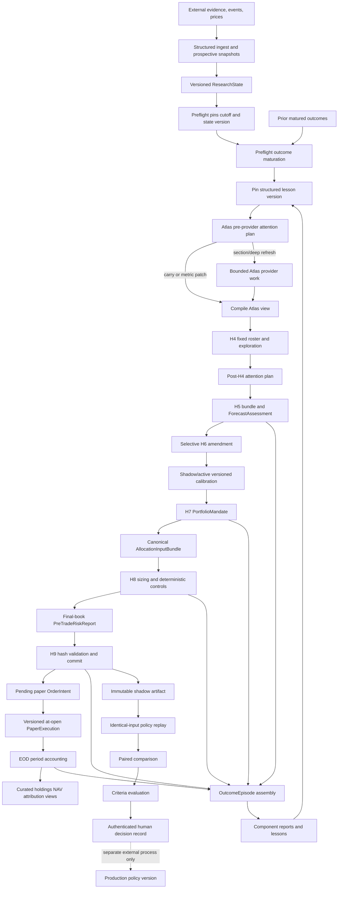
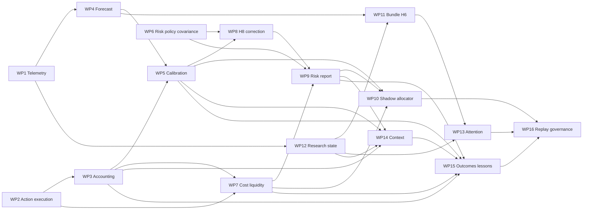

# Olympus Pipeline System Metaplan

> **Date:** 2026-08-06  
> **Amended:** 2026-08-25 (additive product-intent / progress only — delivery sequence and gates preserved)  
> **Status:** Reviewed implementation program; this document alone authorizes no runtime change (task issues still required)  
> **Canonical review:** [Olympus pipeline review](../../reviews/2026-08-06-olympus-pipeline-review.md)  
> **Product-shape addendum:** [Olympus vision realignment brief (2026-08-25)](2026-08-25-olympus-vision-realignment-brief.md)

## Progress / Product intent (2026-08-25)

**Facts (do not renumber WPs):**

- **WP1** telemetry / call-attempt ledger — **done**.
- **WP2** action/fill dual-write — **cutover closed** on develop (`#2594` `book_source` labeling, `#2595` `legacy_opening_snapshot` seed + prices cron `--require-ledger`). Residual `#2487` / `#2772` (ledger_io money-arithmetic test lock) **done**. Residual `#2768` (durable `TargetAdjustment` rows) is the remaining WP2 Gate-1 caveat tracked in code.
- **WP3** reconciled period accounting — **coded** on develop (promote `#2603`); deep review / Gate 1 residual caveats still apply.
- **`module/digiquant`** — synced with develop via #2587 (the earlier “273 commits stale” audit finding is **historical**; still never branch from a stale module ref — `make task` enforces current `origin/<base>`).

**Product intent (additive; full detail in the vision brief):**

- **House default run** is owned by **digithings**, **always runs**, and is **immutable** — no user profile may move, cancel, or replace it.
- User profiles are **DB-backed** overlays (extra research requests and/or different preferences). Research/analysis for assets/themes stays in a **shared, tenant-agnostic corpus**; profiles do not fork the house run.
- **Portfolio phase is user-private** (positions, fills, orders, NAV, mandate→book). Track A portfolio/ledger work is the privacy-boundary home for per-user books. Optional public portfolios + subscribe is **later** — do not preclude; do not build in v1.
- Run **parallel tracks** without deleting later WPs: **A** trust/money (WP2→WP3) ∥ **B** research plumbing (ProfileConfig → WP12-class corpus → WP13 **shadow**) ∥ **C** glass-box (#1945; Pipeline = primary product surface; Brief = daily read). B/C may start **beside** WP2/WP3; they do **not** wait for WP8–10. Phase 0 accounting gates **stay**.
- Planner sits before the research gate; it **cannot** expand H4 roster/cap or rewrite H7/H8 authority.
- **Kairos / execution:** groundwork for Interactive Brokers API + Alpaca Trading API / MCP; default **paper** and/or **manual**; live-trading cutover remains human-gated (see § Kairos / execution groundwork below).
- **Next major milestones (planning):** [Kairos execution + user tenancy brief (2026-08-29)](2026-08-29-olympus-kairos-tenancy-milestone-brief.md) — Milestone 1 paper broker connect (Alpaca first), Milestone 2 login/tiers/private books. Not authorized by this strip alone.

This section amends product framing and schedule emphasis only. WP numbers, Gates 1–4, the authority matrix, H1–H9 ownership, and the target mermaid remain the program spine.

## Purpose, Reason, and Intent

**Purpose:** Convert the Olympus audit into one dependency-ordered delivery program in which every
pipeline step has a typed input, one owner, an immutable/versioned output, a named consumer, a
defined degraded state, and a measurable contribution.

**Reason:** The current system contains valuable deterministic portfolio controls and a coherent
single graph, but provider materiality, forecast meaning, execution timing, accounting, research
state, and learning are not joined by sufficiently explicit contracts. Improving prompts or adding
an optimizer before those foundations would create confident but untestable results.

**Intent:** Build evidence and accounting first; make forecasts/risk inputs honest second; change
allocation only behind signal gates; reduce research spend only behind measured shadow evidence;
and close learning through identical-input offline replay and human governance. Preserve one graph,
H7/H8/H9 authority, existing risk controls, and no live-trading changes without an explicit human
gate. **As of 2026-08-25:** product chrome and ownership (digithings house run, shared corpus vs
private books, ProfileConfig DB, glass-box, Kairos groundwork) are clarified in the
[vision brief](2026-08-25-olympus-vision-realignment-brief.md) without rewriting this delivery spine.

## Plan Index

| Phase | Plan | Packages | Primary contribution |
|---:|---|---|---|
| 0 | [Observability and accounting](2026-08-06-olympus-pipeline-phase0-observability-accounting.md) | WP1-WP3 | Trustworthy call economics, execution lineage, NAV, contribution |
| 1 | [Forecast and risk contracts](2026-08-06-olympus-pipeline-phase1-forecast-risk-contracts.md) | WP4-WP7 | Typed forecasts, calibration, policy/covariance, costs |
| 2 | [Allocation and risk](2026-08-06-olympus-pipeline-phase2-allocation-risk.md) | WP8-WP10 | Correct H8 inputs, pre-trade risk, isolated challenger replay |
| 3 | [Research attention](2026-08-06-olympus-pipeline-phase3-research-attention.md) | WP11-WP14 | Versioned research state, shared evidence, pre-LLM routing, bounded context |
| 4 | [Learning and replay](2026-08-06-olympus-pipeline-phase4-learning-replay.md) | WP15-WP16 | Outcome episodes, structured lessons, policy replay, human governance |

Each task in a phase plan is one issue, one `task/<N>-<slug>` branch, one focused TDD loop, and one
reviewable PR. Migration numbers are allocated only after that task branch is synced. Never copy a
symbol/path from a plan into an issue without confirming it against the then-current branch.

## Non-Negotiable System Invariants

1. One canonical Atlas A0-A4 -> Hermes H1-H9 graph. Deterministic helpers run inside existing phase
   boundaries; no calibration, outcome, attention, context, or optimizer graph node is added.
2. H4 owns roster width, regime, cap, order, and exploration reservation.
3. H5 owns each base evidence bundle and base numerical forecast.
4. H6 owns only challenged amendments and specific missing-fact evidence supplements.
5. H7 owns `long | flat`, eligibility, and ordinal priority. It emits no target weight and cannot
   silently rewrite a forecast.
6. H8 alone owns target weights and all deterministic risk/control transformations.
7. H9 alone commits the portfolio. It validates typed IDs/hashes; it does not recompute research,
   forecasts, risk, or optimization.
8. Paper execution and period accounting are distinct authorities after H9.
9. Every economic record distinguishes event/effective time, `known_at`, and recorded time.
10. Once a run pins state, all later reads use exact versions, never unversioned latest.
11. New stores are private, append-only, Pydantic v2 at boundaries, and prospective by default.
12. Missing/unknown values are unavailable/degraded, never fabricated zeroes.
13. Prose is a deterministic view or explanation, never authoritative structured memory.
14. Existing H8 cap/correlation/volatility/drawdown/continuity/turnover/cadence/grid/cash controls
    remain characterized and preserved.
15. Portfolio replay uses one shared-cash multi-instrument Nautilus engine per isolated arm/fold.
16. Shadow/replay can recommend eligibility but cannot activate, promote, rollback, trade, or mutate
    production policy.
17. No broker adapter, live-order path, or digikey/auth code is changed without its explicit human
    gate and separate issue. Research and plumbing groundwork for broker **connect** (paper/manual
    first) may proceed under separate issues; **live cutover** stays gated.
18. UI work in this program includes **reader-contract cutovers** and **glass-box surfaces** that make
    WP1-attributed pipeline attempts inspectable (Pipeline as primary glass-box; Brief as daily read;
    ledger/period inspectability on Portfolio — see #1945 and the 2026-08-25 vision brief). Broad
    marketing / chrome redesign remains outside this program.

## End-to-End Target Pipeline



## Daily Pipeline Handoffs

| Step | Owning boundary | Typed input | Output | Direct consumer | Contribution | Failure/degraded state |
|---:|---|---|---|---|---|---|
| 1 | Ingest/market adapters | Source payload and observation time | `EvidenceRecord`, market snapshot, event version | Research store, forecast outcomes, costs | Research, accounting | Reject invalid source; record unavailable; no timestamp invention |
| 2 | Research state store | Structured entities plus source lineage | `ResearchStateVersion` | Preflight, replay | Research, learning | Append failure visible; prior version remains |
| 3 | Atlas preflight | Requested as-of and run start | `knowledge_cutoff_at`, `ResearchStatePin` | Every later phase | Accuracy, replay | Exact state unavailable blocks strict reader or uses typed shadow degradation |
| 4 | Outcome maturation helper | Prior forecasts plus cutoff-safe market/accounting data | `ForecastOutcome`, episode/lesson candidates | Calibrator, lesson compiler | Learning | Missing calendar/price/accounting stays pending/ineligible |
| 5 | Lesson compiler/context | Eligible prior episodes and exact state | `OutcomeLessonVersion`, role context pin | H5/H7 contexts | Research, portfolio | Prior valid lesson or typed none; never own-run future feedback |
| 6 | Atlas triage | Pinned state, events, staleness, budget | `AttentionPlan` per artifact | Atlas provider-owning nodes | Efficiency | Shadow/off executes incumbent; incomplete telemetry blocks promotion |
| 7 | Atlas provider/view | Attention decision plus exact context | Updated state entities and compiled views | H4 and later roles | Research | Carry/patch/provide failure reason; view never becomes source |
| 8 | H4 | Regime, universe, exploration policy | Fixed focus roster and exclusions | Hermes planner/H5 | Discovery | Existing safe behavior; planner cannot alter result |
| 9 | Post-H4 planner | Fixed roster plus hidden value features | H5/H6 attention decisions | H5/H6 | Efficiency | Shadow/off runs incumbent; exploration retained |
| 10 | H5 | Pinned role context, market data, one base bundle | `TickerEvidenceBundle`, `ForecastAssessment` | H6, H7, H9 | Research, signal | Prior typed carry or unavailable; bundle persists through provider failure |
| 11 | H6 | H5 bundle/forecast and challenge decision | Optional amendment/bundle amendment, `EffectiveForecast` | Calibrator, H7, H9 | Research, signal | Base preserved; failure/invalid request typed; no broad search |
| 12 | Calibrator | Effective forecast plus cutoff-safe outcome cohort | `CalibratedForecast` version | H8 bundle, replay | Signal | Prior/shrinkage or unavailable; no false precision |
| 13 | H7 | Blinded research plus versioned portfolio context | `PortfolioMandate` with forecast refs | H8 | Portfolio | Existing fail-soft/degraded context; no forecast/weight mutation |
| 14 | H8 input builder | Mandate, calibrated forecasts, policy/covariance, costs, prior book | `AllocationInputBundle` | H8/report/replay | Portfolio, risk | Affected asset receives no invented risk; explicit degraded mode |
| 15 | H8 | Canonical bundle | Requested targets, adjustments, final `SizedBook` | Risk report/H9 | Portfolio | Preserve cash/current safety path and all deterministic controls |
| 16 | Risk report builder | Final book and exact input bundle | `PreTradeRiskReport` | H9, operators, episodes | Risk | Unavailable metrics reason-coded; report cannot mutate book |
| 17 | H9 | Mandate/book/report and hashes | `PortfolioCommit`, approved targets, pending orders, artifact refs | Executor, UI projections, replay | Portfolio, audit | Hash/schema/persistence conflict blocks incomplete commit; no recompute |
| 18 | Paper executor | Pending orders and approved timing/price/cost policy | Immutable fills, lots, cash events | Accounting, cost outcomes | Execution | Pending/deferred/rejected; never synthesize fill |
| 19 | EOD accounting | Opening state, fills, costs, marks, FX, benchmark | Reconciled period, holdings, NAV, daily contribution | Views, metrics, episodes | Accounting | Provisional/incomplete; no false final value |
| 20 | Curated views | Finalized authoritative records | Minimum public portfolio/performance/activity views | Olympus and digiquant.io | Operations | Explicit labeled legacy fallback; no mixed-source value |
| 21 | Episode assembler | Matured forecast plus decision/target/fill/accounting/cost/risk | `OutcomeEpisode` | Attribution/lessons/replay | Learning | Typed assembly blocker; unreconciled data ineligible |
| 22 | Component attribution | Episode plus paired replay when available | Component observations and structured lesson versions | Later contexts/governance | Learning | Causal claims unavailable without counterfactual; residual explicit |
| 23 | Replay dataset/registry | Exact as-of state and allowlisted policy versions | Shared manifest and purged folds | Spawned policy arms | Evaluation | Missing/unregistered/version mismatch fails closed |
| 24 | Nautilus replay | Shared manifest, target policy, bars/cost/fill policy | `PortfolioReplayResult` | Comparison | Portfolio, risk | Child crash/timeout is inconclusive; no vector fallback |
| 25 | Comparison/governance | Paired results, resource/signal evidence, criteria version | Report and `GateEvaluation` | Human reviewer | Governance | Ineligible/insufficient evidence; no activation |
| 26 | Authenticated human record | Eligible evaluation plus trusted operator principal | Append-only decision/rationale | External policy process | Governance | No trusted identity means no decision write |

## Artifact Ownership Matrix

| Artifact | Sole producer/owner | Mutability | First consumer | Later consumers |
|---|---|---|---|---|
| Provider attempt | `digillm` provider boundary | Append-only | WP1 reconciliation | WP13/WP16 |
| Logical call/node record | generic digigraph observer plus Olympus metadata | Append-only | diagnostics | attention evaluation |
| Research state version | research state store | Immutable/superseding | preflight | all research/replay |
| Attention plan | deterministic planner | Immutable per policy/run | Atlas or H5/H6 | WP16 |
| Evidence bundle | H5 bundle builder | Immutable | H5/H6 | H7/outcomes/replay |
| Bundle amendment | H6 missing-fact path | Append-only | H6 | outcomes/replay |
| Base forecast | H5 materializer | Immutable | H6 | H7/calibration/outcomes |
| Forecast amendment | H6 materializer | Append-only | effective forecast | H7/calibration/outcomes |
| Calibrated forecast | deterministic calibrator | Immutable version | H8 bundle | replay/learning |
| Portfolio mandate | H7 | Immutable per run | H8 | H9/outcomes |
| Risk policy/covariance | WP6 resolver | Immutable version | H8 bundle | risk/replay |
| Expected/realized cost | WP7 model/resolver | Immutable versions | risk report | accounting/outcomes/replay |
| Allocation bundle | H8 input builder | Immutable | H8 | risk/H9/replay |
| Requested/approved target | H8 | Append-only lineage | H9 | executor/outcomes |
| Pre-trade report | H8 report builder | Immutable | H9 | operators/outcomes/replay |
| Portfolio commit/order | H9 | Append-only/superseding pending intent | executor | projections/outcomes |
| Fill/holding/cash | paper executor | Fill immutable; state derived | accounting | outcomes/replay |
| Accounting period | EOD finalizer | Immutable/superseding restatement | curated views | outcomes/governance |
| Outcome episode | assembler | Immutable/superseding | component attribution | lessons/replay |
| Lesson version | deterministic compiler | Immutable/superseding | context compiler | replay |
| Replay manifest/result | replay package/workers | Immutable, lifecycle events append | comparison | governance |
| Criteria/evaluation/decision | governance store/human principal | Immutable/superseding | human/external process | audit |

No artifact has two producers. Compatibility tables/views are projections and are never alternate
authority.

## Dependency Graph and Critical Path



### Critical Path

```text
WP2 action/fill lineage
-> WP3 reconciled accounting
-> WP5 calibrated outcomes
-> WP8 corrected H8 inputs
-> WP9 final-book risk report
-> WP14 versioned H7 context
-> WP15 outcome episodes/lessons
-> WP16 policy replay/governance
```

WP10 isolated allocation replay is a parallel branch from WP9 and joins the critical path at WP16.

### Safe Parallelism

- WP1 telemetry and WP2 action ledger can begin independently.
- WP6 characterization/models can run beside WP4/WP5, but durable snapshots require run identity.
- WP12 research state can run after WP1 beside WP3-WP7.
- WP11 follows WP4/WP12 and can run beside WP8-WP10.
- WP13 follows WP11/WP12 and can run beside WP14 after its own prerequisites.
- Within a package, schema/model work can be reviewed separately, but writer/read cutovers remain
  sequential.
- **Pull-forward (2026-08-25):** **ProfileConfig (DB)** + **WP12-class shared corpus** + **WP13
  shadow** (attention planner shadow only — not full Gate 3 enforcement) and **#1945 glass-box** may
  start **beside WP2/WP3** on Tracks B∥C. Do **not** wait for WP8–10. Do **not** renumber or delete
  later WPs; promotion out of shadow still obeys Gates below.

### Do Not Parallelize

- Do not cut accounting readers before shadow period reconciliation.
- Do not feed calibration into H8 before WP5 coverage and WP6 contracts pass.
- Do not enforce the attention planner before WP1 reconciliation and shadow quality gates.
- Do not compile learning episodes from unreconciled accounting.
- Do not implement generalized governance by duplicating the Phase 2 replay adapter.

## Delivery Sequence

| Order | Package | Exit artifact/gate | What remains unchanged until exit |
|---:|---|---|---|
| 1 | WP1 | Reconciled call/attempt ledger | Provider behavior and graph |
| 2 | WP2 | H7-H9-order-fill-holding lineage | H8 math and live paths |
| 3 | WP3 | Reconciled period accounting and curated views | Legacy reader available/labeled |
| 4 | WP4 | Typed H5/H6/H7 forecast lineage | H8 rank sizing |
| 5 | WP5 | Prospective calibrated forecasts | Calibration shadow-only |
| 6 | WP6 | Resolved policy/covariance parity | Incumbent H8 values |
| 7 | WP7 | Expected/realized cost evidence | Cost observational only |
| 8 | WP12 | Exact research state/version pin | Existing documents remain compatibility views |
| 9 | WP11 | Durable H5 bundle/selective H6 | Planner remains off/shadow |
| 10 | WP8 | Forecast-driven H8 with controls green | Challenger absent |
| 11 | WP9 | Final-book risk report bound to H9 | No optimizer promotion |
| 12 | WP10 | Isolated allocation comparison evidence | Incumbent remains production |
| 13 | WP13 | Pre-provider plans and reconciled shadow evaluation | Incumbent calls/context in shadow |
| 14 | WP14 | Versioned blinded role context | Rollback to incumbent context available |
| 15 | WP15 | Episodes/component reports/lessons | No online policy update |
| 16 | WP16 | Paired replay, criteria evaluation, human record | Activation remains external |

The package order differs from phase numbering only to expose safe foundation parallelism: WP12/WP11
may land before the production WP8 cutover. No dependent behavior is promoted out of order.

**2026-08-25 clarification:** Delivery Sequence order above remains the **promotion** spine. Near-term
scheduling may run Track A (WP2 residual → WP3) in parallel with early Track B/C groundwork
(ProfileConfig, corpus pins, WP13 shadow, Pipeline glass-box) without collapsing H1–H9 or skipping
Gate 1 before honest NAV / learning claims. See Progress / Product intent and the vision brief.

## Kairos / execution groundwork (2026-08-25)

Additive note only — not a Kairos redesign and not a new WP renumber.

- **Default v1:** paper portfolios and/or **manual** trade execution after H9.
- **Groundwork (research + plumbing OK):** Interactive Brokers **Web API** (account/portfolio read,
  order submit via `/iserver/...`; paper/sim when linked account qualifies) and **Alpaca Trading API**
  / **alpaca-py** (`TradingClient`, paper keys / `paper=True`) plus Alpaca’s **MCP Server** as the
  current AI-facing Trading API surface. Short doc cites live in the
  [vision brief §4 execution note](2026-08-25-olympus-vision-realignment-brief.md#execution-groundwork-note-official-docs-skim-2026-08-25).
- **Human gate:** live-trading paths, broker adapters that place real capital, and digikey/auth
  changes still require explicit human approval and separate issues (invariant 17). Groundwork must
  not silently enable live cutover.
- Users may later **connect** portfolios via these APIs for automated routing; until then paper/manual
  remain the product default.
- **Program plan (2026-08-29):** phased WPs K0–K5 (execution) then T0–T5 (tenancy/tiers) live in
  [2026-08-29-olympus-kairos-tenancy-milestone-brief.md](2026-08-29-olympus-kairos-tenancy-milestone-brief.md).
  That brief does not renumber metaplan WPs; live cutover remains human-gated.

## State Machines

### Research Artifact

```text
pinned -> planned
planned -> carried | metric_patched | provider_started
provider_started -> completed | failed
completed -> structured_state_appended -> view_compiled
failed -> prior_state_retained + failure_provenance
```

### Portfolio Action

```text
H7 intent -> H8 requested -> adjusted -> approved -> H9 committed
-> pending order -> filled | partial | deferred | rejected | superseded
-> holding/cash event -> accounting provisional -> finalized | restated | incomplete
```

### Learning and Governance

```text
forecast pending -> matured -> episode assembled | blocked
episode -> component reports -> lesson version
policy pair -> manifest -> folds -> replay results | inconclusive
results -> comparison -> eligible | ineligible | insufficient
eligible -> human approve | reject | defer
human decision -/-> automatic activation
```

## Failure Policy

| Class | Rule |
|---|---|
| Provider/research | Preserve last valid typed state and record exact failure; no fabricated completion |
| State/version | Fail exact reads closed; no fallback to unversioned latest |
| Forecast/calibration | Carry eligible prior or mark unavailable; no inferred terms/precision |
| Risk/covariance | Preserve characterized safe production path only when explicitly versioned; shadow abstains |
| Action/execution | No fill without authoritative pending order and valid execution mark |
| Accounting | Never finalize with unexplained residual or missing required marks |
| Context/attention | Shadow/off restores incumbent behavior; incomplete telemetry blocks enforcement |
| Replay | Crash/mismatch/missing input is inconclusive or invalid, never approximated |
| Governance | Missing criteria/evidence/identity blocks eligibility or decision write |
| Security/auth/live | Stop and obtain human review; do not route around the gate |

## Rollout Pattern

Every changed behavior follows the same promotion shape:

1. **Characterize:** lock incumbent behavior and known defects with focused tests.
2. **Contract:** land strict models and private append-only schema.
3. **Dual write/dark run:** produce new artifacts without changing consumers.
4. **Reconcile:** compare counts, hashes, accounting, calls, and outputs exactly.
5. **Shadow:** run new decisions/contexts/policies while incumbent remains authoritative.
6. **Canary:** enable a versioned subset only after pre-authored gates pass.
7. **Cut readers/behavior:** move the named consumer, preserving one explicit rollback.
8. **Retire compatibility:** delete temporary writer/fallback only after retention, parity, and no-reader
   evidence; retain immutable historical rows.

Rollback changes a versioned mode or consumer pointer. It never deletes or rewrites evidence.

## Release Gates

### Gate 1: Accounting

Required before calibration labels, optimizer claims, outcome episodes, or policy comparisons:

- action/fill/holding/cash lineage is complete;
- daily NAV and all contributions reconcile within a declared Decimal tolerance;
- benchmark and portfolio intervals match;
- cost contribution is explicit;
- incomplete periods are excluded; and
- current-book lookback never enters realized labels.

### Gate 2: Signal

Required before calibrated forecasts control H8:

- H5/H6 forecast lineage is complete and immutable;
- outcomes use trading sessions and as-of-safe prospective observations;
- cohort counts, bias, dispersion, proper scores, uncertainty, priors, shrinkage, reliability, and
  missingness are reported;
- low-sample estimates cannot claim high reliability; and
- source/policy/covariance versions are exact and replayable.

### Gate 3: Shadow

Required before attention enforcement or challenger review:

- every provider attempt reconciles to WP1 and provider-reported coverage;
- H4 roster/exploration and H5/H6 blinding have zero violations;
- research cost improvements meet pre-versioned criteria without forecast/decision degradation;
- paired policy arms share exact state/data/cost/execution hashes;
- one-account Nautilus results include costs, turnover, benchmark, drawdown, tails/scenarios, hard
  constraints, missingness, and failures; and
- no shadow component has production credentials or write authority.

### Gate 4: Promotion

Required for any future production policy change:

- criteria were human-authored/versioned before result inspection;
- all criteria resolve pass/fail/insufficient with evidence;
- accounting and hard constraints cannot be outweighed by stronger return;
- required sample/fold/regime/duration coverage exists;
- machine output is only eligibility;
- a trusted human records approval/rejection/defer/rollback-review; and
- activation is implemented in a separate issue/PR with architecture/security review and any required
  dependency/auth/live-trading human gate.

## Metrics by System Contribution

| Contribution | Required measures |
|---|---|
| Research quality | Evidence novelty, contradiction yield, coverage, stale-state reduction, exploration share, amendment yield |
| Research efficiency | Calls, physical attempts, searches, cached/uncached tokens, provider cost, latency, defer/run counts |
| Signal | Sample count, forecast bias/dispersion, Brier/log score, downside error, reliability, cohort/regime coverage |
| Portfolio | Target/actual return, active return, cash, turnover, expected/realized cost, action/fill/no-op/rejection counts |
| Risk | Volatility, marginal/component risk, concentration, effective bets, sectors/factors, scenarios/tails, drawdown, hard breaches |
| Accounting | Opening/closing equity, ticker/cash/FX/cost P&L, residual, finalized/incomplete/restated counts |
| Learning | Episode coverage, component eligibility/missingness, lesson version/sample/effective sample, counterfactual coverage |
| Governance | Manifest parity, fold coverage, criteria pass/fail/insufficient, authenticated decisions, activation side effects (must be zero) |

No metric is accepted without unit, interval, source/version IDs, evidence mode, missingness, and sample
count where applicable.

## Issue and Branch Protocol

1. Synchronize `module/digiquant` with current `develop` through the protected-branch PR workflow
   before creating implementation branches. The 2026-08-06 audit found it ~273 commits stale; **as of
   #2587 the module branch was synced** — still never branch from a stale local/module ref
   (`make task` cuts from current `origin/<base>`).
2. Create one Project #1 issue per task using the task's full issue contract and canonical finding IDs.
3. Use `make task ISSUE=<N>` to create `task/<N>-<slug>` from the correct, synchronized base.
4. Read `digiquant/AGENTS.md` and `digiquant/ARCHITECTURE.md` immediately before the first component
   edit and update architecture docs in the same task when behavior/interfaces change.
5. Write the smallest failing test first, run it, implement the minimum, and rerun the same focused
   check before widening validation.
6. Allocate migrations at task execution time and update migration test/docs together.
7. Stage only the issue scope; run focused tests, Ruff, `make test-baseline`, `make doc-check`, and
   `make score` where applicable.
8. Obtain the repository-required fresh-context independent review and fix findings before merge.
9. Commit locally with repository conventional style; do not combine packages into a giant commit.

## Program Definition of Done

- All sixteen package acceptance gates pass on prospective evidence.
- The production graph topology and H4/H7/H8/H9 authority boundaries remain test-locked.
- Provider calls, artifacts, targets, orders, fills, accounting, outcomes, lessons, and replay results
  form one exact versioned lineage.
- H8 no longer treats rank as expected-return magnitude and retains all deterministic controls.
- Research calls are routed before spend and any savings are measured against signal/portfolio impact.
- NAV/contribution and policy comparison use valid shared-cash portfolio accounting.
- Learning is offline, versioned, cutoff-safe, and governed.
- No compatibility writer/fallback remains without a named reader, owner, retirement condition, and
  observed reason to keep it.
- No shadow or agent-facing interface can activate a policy or reach live trading.
