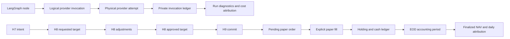

# Olympus Pipeline Phase 0: Observability and Accounting Implementation Plan

> **Status:** Draft for implementation review  
> **As of 2026-08-26:** WP1 done; WP2 cutover closed (`#2594` / `#2595` / `--require-ledger`) with residuals `#2487`/`#2772` and `#2768`; WP3 coded on develop (`#2603`). Product-shape / parallel-track intent lives in the [metaplan Progress strip](2026-08-06-olympus-pipeline-metaplan.md#progress--product-intent-2026-08-25) and [vision realignment brief](2026-08-25-olympus-vision-realignment-brief.md) — Phase 0 task list below is unchanged.  
> **Canonical findings:** [Olympus pipeline review](../../reviews/2026-08-06-olympus-pipeline-review.md), `OLY-REV-001`, `OLY-REV-007`, `OLY-REV-008`, `OLY-REV-009`
> **Execution:** One issue and one `task/<N>-<slug>` branch per task. Use red-green-refactor. Allocate migration numbers only after syncing the implementation branch.

## Goal

Establish the evidence and accounting foundation required to judge every later pipeline change.
After Phase 0, Olympus can answer, without inference:

1. which graph node made each logical provider call and physical attempt;
2. what H7 intended, what H8 requested and approved, and what H9 committed;
3. what the paper executor filled, when, at which price convention, and at what cost; and
4. how holdings, cash, costs, and marks produced each finalized daily NAV and contribution.

Phase 0 changes observability and accounting authority. It does not change research policy,
forecast semantics, H7 direction, H8 sizing, or live trading.

## System Contribution Contract

Every task must document this chain in its issue and PR:

```text
observed defect
  -> changed producer
  -> typed/versioned output
  -> named consumer
  -> system decision or measurement improved
  -> acceptance metric
  -> rollback/deletion condition
```

A field, table, event, or adapter without a named consumer and measurable contribution is not added.

## Architecture



Authority remains fixed:

- H7 owns `long | flat`, authorization, and ordinal priority.
- H8 owns target weights and deterministic policy adjustments.
- H9 remains the sole Hermes terminal and portfolio-commit writer.
- A target snapshot is not a fill.
- A fill is not finalized accounting.
- Only reconciled EOD accounting is authoritative performance.

## Grounded Current State

| Surface | Existing behavior | Required treatment |
|---|---|---|
| `digillm/src/digillm/client.py` | Provider boundary records completed logical usage but not every retry/cache/tool attempt | Instrument here; do not add another tracing service |
| `digigraph/src/digigraph/usage.py` | Process aggregate used by `atlas_run_diagnostics` | Retain as compatibility projection; derive it from detailed events after cutover |
| `digigraph/src/digigraph/graph/pipeline_builder.py` | `NodeSpec.name` is stable node identity | Reuse it for node execution context |
| `digiquant/src/digiquant/olympus/hermes/chain.py` | Owns usage lifecycle and final diagnostics flush | Reuse run/attempt lifecycle and fail-soft flush |
| `digiquant/src/digiquant/olympus/hermes/phases/phase7e_risk_sizing.py` | Produces final book but does not persist normalized adjustment lineage | Add audit events without changing weights |
| `digiquant/src/digiquant/olympus/hermes/writers/commit_io.py` | H9 books target projections, provisional NAV, manifests, same-date supersession, and orphan pruning | Preserve idempotency and pruning; dual-write authoritative commit lineage |
| `digiquant/scripts/atlas/execute_at_open.py` | Reconstructs `position_events` from documents/snapshots/positions | Keep as legacy projection; new fills consume H9 pending orders only |
| `digiquant/scripts/atlas/refresh_performance_metrics.py` | Evening NAV writer applies exact-date weights over the full close-to-close interval | Replace NAV ownership with event-boundary accounting |
| `digiquant/src/digiquant/olympus/atlas/attribution.py` | Current-weight trailing-window decomposition | Rename as lookback analytics; never use as realized daily attribution |
| `.github/workflows/pipeline-atlas-metrics.yml` | Job order contains a semantic workaround | Remove ordering dependency after common accounting cutover |

## Invariants

1. No historical provider attempts, fills, costs, holdings, or claims are fabricated.
2. New detailed records are append-only; corrections append superseding versions.
3. Prompts, responses, search text, secrets, and unredacted exceptions are never persisted.
4. Missing usage or cost is `unavailable`, never zero.
5. Same logical retry cannot duplicate a provider attempt, commit, order, fill, or period.
6. Identical same-date H9 commits remain no-ops; changed commits append supersession lineage.
7. Existing orphan pruning remains load-bearing during compatibility projection.
8. Paper execution uses an explicit versioned timing and price convention.
9. Only fills alter realized quantity and cash.
10. Daily ticker, cash, FX, fee, and slippage contributions reconcile to NAV within a declared tolerance.
11. Portfolio and benchmark periods use identical boundaries.
12. Accounting failure leaves a visible provisional/incomplete state; it does not publish a false final value.
13. Internal telemetry, action, fill, and accounting tables are service-role-only.
14. Deploy in schema -> writer -> shadow comparison -> curated reader order.
15. No broker adapter or live-order path is touched.

## Decisions to Record Before Cutover

These do not block contract implementation; they block production reader promotion.

| Decision | Recommended initial policy | Gate |
|---|---|---|
| Provider retry ownership | Disable hidden SDK retries where supported; record each repository-managed attempt | Telemetry reconciliation |
| Provider cost authority | Provider-returned usage/cost; missing remains unavailable | Billing comparison |
| Paper fill time | First eligible session open after commit, using an explicitly stored mark source | Fill activation |
| Post-fill same-day revision | Immutable fill; schedule revised target for the next eligible open | Order policy |
| Fractional quantities | Permit deterministic fractional paper quantities against a versioned notional | Paper ledger |
| Costs | Versioned non-zero-capable commission/slippage model; zero only when policy explicitly says zero | Accounting cutover |
| Missing close | Mark period estimated/incomplete and restate later; do not call it final | Public NAV |
| Reconciliation tolerance | Decimal absolute and relative tolerances stored with the accounting policy | Period finalization |

## Migration and Backfill Policy

- Use symbolic migration names in this plan. At implementation, sync and allocate the next unused
  number after current migration `065_atlas_run_diagnostics_attempt.sql`.
- Schema lands before writers; writers dual-write before readers change.
- Existing `atlas_run_diagnostics` rows remain `legacy_aggregate`.
- Existing `position_events` remain `legacy_reconstructed`.
- Existing `nav_history` remains a legacy estimate unless produced after accounting cutover.
- Existing `position_attribution` remains historical `current_book_lookback` analytics.
- Initialize the realized ledger at cutover with one labeled `legacy_opening_snapshot`; do not infer
  lots, fills, or costs before that point.
- Curated views expose only the fields required by named readers. Base tables remain private.

## Work Package 1: Provider Invocation and Node Telemetry

### Task 1.1: Define strict telemetry contracts and private schema

**Finding:** `OLY-REV-001`

**Defect:** Existing aggregate counters cannot identify a node, logical call, physical retry, cache
result, or produced artifact.

**Intent:** Define the minimum shared vocabulary and private storage before changing any call path;
do not persist provider payloads or impose Olympus dependencies on other `digillm` consumers.

**Purpose and contribution:** Establish one vocabulary that distinguishes node executions, logical
calls, cache hits, and physical provider attempts. This makes call-level economics measurable and
prevents aggregate diagnostics from being misread as exact lineage.

**Producer -> consumer:** `digillm` and graph wrappers -> in-process collector -> private tables ->
run diagnostics and policy evaluation.

**Files:**

- Create `digillm/src/digillm/telemetry.py`.
- Create `digiquant/supabase/migrations/<NNN>_olympus_provider_telemetry.sql`.
- Create `digillm/tests/test_provider_telemetry.py`.
- Create `tests/dq/atlas/test_migration_<NNN>.py`.
- Update `digillm/ARCHITECTURE.md` and `digiquant/ARCHITECTURE.md`.

**Models:** `NodeRunRecord`, `ProviderCallRecord`, `ProviderAttemptRecord`, `ArtifactRef`,
`CallPurpose`, `CacheStatus`, and closed outcome/retry-reason enums. All use Pydantic v2,
`extra="forbid"`, UTC timestamps, and stable IDs.

**Output/contribution:** Strict event contracts and private append-only tables make call economics,
retry behavior, and downstream materiality attributable.

**Red tests:** reject raw prompt/response fields; require parent IDs; permit a cache-hit logical call
with zero attempts; require unique `(call_id, attempt_number)`; verify RLS and no anon/auth grants.

**Focused check:**

```bash
.venv/bin/python -m pytest -m unit \
  digillm/tests/test_provider_telemetry.py \
  tests/dq/atlas/test_migration_<NNN>.py -q --tb=short
```

**Green:** implement only models, observer protocol, and schema. No call-site behavior changes.

**Acceptance metric:** all synthetic lifecycle fixtures serialize deterministically and the schema
admits no secret-bearing payload fields.

**Failure state:** Invalid events are rejected and a telemetry write failure is reported separately;
it never fabricates usage or aborts portfolio work.

**Rollback/deletion:** unused optional fields are removed before writer rollout; the normalized
call/attempt distinction is permanent.

**Anti-goals:** prompt/response storage, a public telemetry view, provider behavior changes, or a new
tracing service.

### Task 1.2: Instrument every physical provider attempt

**Finding:** `OLY-REV-001`

**Defect:** Retries, cancellations, search transport attempts, and terminal failures are currently
collapsed or absent from durable evidence.

**Intent:** Observe the existing provider boundary without changing retry, backoff, routing, cache,
or response semantics.

**Purpose and contribution:** Record retries, terminal failures, streaming, searches, and served-model
identity at the only boundary that can observe them.

**Producer -> consumer:** `_create_with_retry`, streaming/search transports -> attempt observer ->
logical-call reconciliation.

**Files:** modify `digillm/src/digillm/client.py`; extend `digillm/tests/test_provider_telemetry.py`
and existing `digillm/tests/test_digillm.py`.

**Output/contribution:** One `ProviderAttemptRecord` per physical attempt makes cost, reliability, and
latency measurement exact at the observable boundary.

**Red tests:** one event per network attempt; increasing attempt number; terminal error preserved;
streaming usage finalized; search attempts typed; cancellation closes an attempt; sanitized errors;
unknown cost stays null.

**Focused check:**

```bash
.venv/bin/python -m pytest -m unit \
  digillm/tests/test_provider_telemetry.py digillm/tests/test_digillm.py -q --tb=short
```

**Green:** wrap existing transports without changing retry counts, backoff, response parsing, or
provider selection. Hidden provider-SDK retries are characterized by a canary before disabling them.

**Acceptance metric:** canaries for normal, retry, error, streaming, and search reconcile physical
attempt counts exactly.

**Failure state:** Missing provider usage/cost remains unavailable and sanitized transport failures
remain linked to their logical call.

**Rollback/deletion:** Disable the observer injection while retaining the stable attempt contract;
remove any temporary dual counters after aggregate parity is proven.

**Anti-goals:** disabling SDK retries before characterization, exposing secrets, or changing provider
selection.

### Task 1.3: Add logical purpose, cache, tool-loop, and parentage records

**Finding:** `OLY-REV-001`

**Defect:** A physical request alone cannot explain why a call was made, what parent caused it, or
whether it produced a consumed artifact.

**Intent:** Add generic, injectable logical-call metadata while keeping digigraph independent of
Olympus-specific ticker and artifact semantics.

**Purpose and contribution:** Explain why each successful or rejected call existed and which artifact
or later call consumed it.

**Producer -> consumer:** research-agent/tool loop/cache -> generic logical-call observer protocol ->
artifact links and research-policy evaluation.

**Files:** modify `digigraph/src/digigraph/graph/research_agent.py`,
`digigraph/src/digigraph/llm_client.py`, `digigraph/src/digigraph/usage.py`; extend
`tests/dg/test_llm_client.py` and `tests/dg/test_usage.py`.

**Output/contribution:** Purpose, parentage, cache, and artifact references connect provider cost to
research output and later policy evaluation.

**Red tests:** initial generation, tool selection, tool follow-up, schema repair, web grounding, and
cache hit receive distinct purposes; parent/child calls link; cache hits cost zero only when proven;
aggregate usage equals detailed successful-call projection.

**Green:** establish logical-call scope around existing call paths. Keep purpose and artifact metadata
generic and injectable through an observer/callback protocol; Olympus supplies ticker/artifact detail
from its run wrapper rather than adding Olympus semantics to digigraph. Keep prompt cache ordering and
existing API signatures.

**Acceptance metric:** every logical call has a purpose, parent (when applicable), and artifact link
or explicit `no_artifact` reason.

**Failure state:** Unknown purpose/artifact is a typed incomplete record and blocks exact materiality
claims; it is never silently omitted.

**Rollback/deletion:** Disable optional metadata injection if a shared consumer regresses; delete the
legacy aggregate-only write path after detailed projection parity and retention gates pass.

**Anti-goals:** Olympus imports in digigraph, prompt payload persistence, or changing tool-loop/cache
behavior.

### Task 1.4: Propagate run, node, agent, ticker, and edit-mode context

**Finding:** `OLY-REV-001`

**Defect:** Provider events cannot be attributed to concurrent graph/fan-out work without stable
execution context.

**Intent:** Propagate identity across existing sync/thread boundaries without adding a node registry
or changing graph topology.

**Purpose and contribution:** Connect provider economics to the graph decision that caused them.

**Producer -> consumer:** `NodeSpec.name` plus fan-out state -> context scope -> provider records.

**Files:** modify `digigraph/src/digigraph/graph/pipeline_builder.py` and focused graph tests;
modify Olympus phase adapters only where ticker/artifact metadata is introduced.

**Output/contribution:** Scoped run/node/agent/ticker/artifact context makes every call traceable to
the graph work that caused it.

**Red tests:** context survives sync and thread fan-out; two ticker workers cannot leak context;
exceptions close node records; nested calls preserve parent node ID; no node-name registry is added.

**Focused check:**

```bash
.venv/bin/python -m pytest -m unit \
  tests/dg/test_pipeline_builder.py tests/dg/test_usage.py \
  tests/dq/hermes/test_build_hermes_phases_thesis.py -q --tb=short
```

**Green:** wrap node execution with `ContextVar` plus explicit context propagation where executors
cross threads. Reuse `NodeSpec.name` and existing fan-out cursor fields.

**Acceptance metric:** every provider call in a simulated H5/H6 fan-out resolves to exactly one node,
ticker, run, and attempt.

**Failure state:** Missing/ambiguous context marks telemetry incomplete and fails reconciliation, but
does not leak context between workers or stop portfolio completion.

**Rollback/deletion:** Remove temporary explicit propagation shims once all supported executors
preserve the standard context protocol.

**Anti-goals:** duplicate node-name registry, global mutable context, or graph-node changes.

### Task 1.5: Persist, flush, and reconcile diagnostics

**Finding:** `OLY-REV-001`

**Defect:** In-process detail is not auditable after a run and aggregate diagnostics cannot prove
billing or artifact reconciliation.

**Intent:** Durably batch detailed events while preserving the existing fail-soft graph lifecycle.

**Purpose and contribution:** Make detailed telemetry durable while preserving current health and
retry behavior.

**Producer -> consumer:** in-process collector -> batched private writes ->
`atlas_run_diagnostics` compatibility aggregate and daily economics report.

**Files:** create `digiquant/src/digiquant/olympus/atlas/provider_telemetry.py`; modify
`digiquant/src/digiquant/olympus/hermes/chain.py`,
`digiquant/src/digiquant/olympus/atlas/diagnostics.py`; add focused tests.

**Output/contribution:** Durable attempts/logical calls plus a compatibility aggregate enable exact
cost attribution and Phase 3 routing evaluation.

**Red tests:** flush on success and exception; retries produce separate attempt lineage; failed
telemetry write is visible but never kills portfolio completion; aggregate totals reconcile;
incomplete telemetry cannot claim exact billing reconciliation.

**Acceptance metric:** one representative production-shadow run reconciles detailed logical counts to
existing diagnostics and provider billing within provider-reported coverage.

**Failure state:** A failed flush is visible as incomplete telemetry and never kills or retries the
portfolio commit.

**Rollback/deletion:** Disable detailed persistence and retain aggregate diagnostics temporarily;
delete the independent aggregate counter after it is derived from detailed records in production.

**Anti-goals:** making telemetry a portfolio success dependency, claiming exact billing where the
provider omits usage, or storing prompts.

## Work Package 2: Decision, Action, and Execution Ledger

### Task 2.1: Add append-only portfolio lineage contracts and schema

**Finding:** `OLY-REV-009`

**Defect:** Decision intent, target approval, order intent, fill, and holding state are currently
conflated across snapshots and documents.

**Intent:** Define prospective authoritative lineage without changing H7/H8/H9 ownership or touching
live execution.

**Purpose and contribution:** Separate decision intent, target approval, order intent, fill, and
holding state so every portfolio change has one replayable chain.

**Producer -> consumer:** H7/H8/H9 -> private ledger -> paper executor -> accounting and learning.

**Files:** create `digiquant/src/digiquant/olympus/hermes/models/portfolio_ledger.py`, migration
`<NNN>_olympus_portfolio_ledger.sql`, structural migration tests, and model tests.

**Models/tables:** `PortfolioCommit`, `DecisionIntent`, `RequestedTarget`, `TargetAdjustment`,
`ApprovedTarget`, `OrderIntent`, `PaperExecution`, `HoldingLot`, with stable IDs, effective/known
UTC times, status, reason, quantities/weights, policy/version IDs, and supersession links.

**Output/contribution:** Private immutable ledger contracts make every portfolio transition and
non-action replayable for accounting, risk, and learning.

**Red tests:** immutable fills; idempotent exact retry; changed same-date target supersedes pending
orders; executed order cannot be rewritten; missing quantity/price is not zero; private grants only.

**Acceptance metric:** model fixtures represent add, trim, exit, no-op, rejection, cap, rounding,
carry, and supersession without nullable semantic ambiguity.

**Failure state:** Invalid or conflicting lineage fails closed before an authoritative commit/fill;
missing economic values remain unavailable.

**Rollback/deletion:** Keep schema dark until H9 dual-write; delete temporary compatibility adapters
only after all readers use authoritative projections.

**Anti-goals:** broker/live paths, mutable fills, or a second H9 writer.

### Task 2.2: Preserve H8 requested targets and adjustment reasons

**Finding:** `OLY-REV-009`

**Defect:** Final weights do not retain a normalized explanation of each deterministic adjustment.

**Intent:** Observe the existing sizing sequence exactly; do not alter weights or control ordering.

**Purpose and contribution:** Explain how deterministic risk transformed authorized intent into the
book without changing the book itself.

**Producer -> consumer:** `size_portfolio` and final H8 transformations -> adjustment events -> H9,
pre-trade risk, and outcome episodes.

**Files:** modify `digiquant/src/digiquant/olympus/hermes/sizing.py` and
`phases/phase7e_risk_sizing.py`; extend `tests/dq/hermes/test_sizing.py` and
`test_phase7e_risk_sizing.py`.

**Output/contribution:** Requested targets and ordered reason-coded adjustments explain how H8
produced its approved target for audit, risk, and later outcome analysis.

**Reason codes:** conviction floor, single-name cap, sector cap, correlation dedup, volatility scale,
drawdown breaker, grid rounding, cadence hold, minimum-hold override, continuity carry, final gross
scale, and flat exit.

**Red tests:** final weights remain byte-equivalent to incumbent fixtures; every material difference
between requested and approved targets has one reason; H7-flat and omitted-held cases are distinct.

**Acceptance metric:** zero unexplained requested-to-approved deltas in property fixtures.

**Failure state:** Any unexplained delta fails lineage validation; incumbent sizing output itself is
not replaced by an inferred explanation.

**Rollback/deletion:** Disable adjustment persistence while keeping characterization tests; the audit
contract is permanent after parity.

**Anti-goals:** changing final weights, moving controls, or giving H7/H9 sizing authority.

### Task 2.3: Make H9 append the authoritative commit chain

**Finding:** `OLY-REV-009`

**Defect:** H9 writes useful projections but no normalized immutable chain from mandate through
pending order.

**Intent:** Add authoritative lineage inside the existing terminal sequence and preserve current
idempotency/orphan pruning.

**Purpose and contribution:** Bind the approved book to one date-scoped H9 commit and pending order
set while preserving current idempotency and projections.

**Producer -> consumer:** H9 `commit_run` -> ledger rows -> open executor and compatibility tables.

**Files:** create `writers/ledger_io.py`; modify `phases/h9_commit_run.py`,
`writers/commit_io.py`, and `tests/dq/hermes/test_commit_run.py`.

**Output/contribution:** Date-scoped commit and pending order records create the sole handoff from
portfolio targets to paper execution.

**Red tests:** H9 is the only writer; exact same-date fingerprint is no-op; changed pre-fill commit
supersedes pending orders; existing fill remains immutable; orphan pruning still converges legacy
positions; partial ledger failure does not masquerade as committed.

**Green:** persist commit lineage and pending orders in the existing terminal sequence. Continue
legacy positions/NAV dual-write until accounting reader cutover.

**Acceptance metric:** H7 -> H8 -> H9 chain is queryable for every final ticker and cash residual.

**Failure state:** A partial authoritative write is not reported as committed and never triggers a
second booking attempt.

**Rollback/deletion:** Turn off authoritative dual-write while retaining legacy projections; remove
direct legacy booking writes after projection parity and reader cutover.

**Anti-goals:** a second commit authority, post-fill mutation, or removing orphan pruning before
compatibility retirement.

### Task 2.4: Execute explicit paper orders at the versioned open convention

**Finding:** `OLY-REV-008`, `OLY-REV-009`

**Defect:** At-open execution reconstructs events from documents/snapshots instead of consuming a
pending authoritative order.

**Intent:** Make paper fills explicit and prospective under one approved timing/price policy; do not
touch live trading.

**Purpose and contribution:** Replace document reconstruction with explicit, idempotent paper fills
that can drive holdings and cost accounting.

**Producer -> consumer:** pending `OrderIntent` -> at-open executor -> immutable fills/lots/cash ->
EOD accounting.

**Files:** refactor `digiquant/scripts/atlas/execute_at_open.py`; add focused executor tests and
workflow tests for `.github/workflows/pipeline-digiquant-prices.yml`.

**Output/contribution:** Immutable fills, lots, and cash events make realized holdings/costs usable by
period accounting and learning.

**Red tests:** first eligible session; missing/late open; halt; duplicate retry; add/trim/exit;
fractional quantity; fees/slippage; post-fill revised target; no fallback to prose after cutover.

**Green:** select pending orders only, load the declared mark, calculate deterministic quantity and
costs, append fills/lots/cash, then update compatibility `position_events` as a projection.

**Acceptance metric:** every realized quantity change has exactly one fill chain and every pending,
rejected, or deferred order remains visible.

**Failure state:** Missing/invalid open, halt, or policy conflict leaves a typed pending/deferred/
rejected order; no fill is synthesized.

**Rollback/deletion:** Disable authoritative executor and preserve pending orders; delete prose-based
reconstruction after the cutover retention window.

**Anti-goals:** broker adapters, same-day target rewriting of immutable fills, or prose fallback after
cutover.

### Task 2.5: Label legacy reconstruction and maintain projections

**Finding:** `OLY-REV-009`

**Defect:** Legacy reconstructed rows can be mistaken for authoritative fills/holdings.

**Intent:** Preserve reader continuity while making source quality explicit and one-way.

**Purpose and contribution:** Preserve UI/operator continuity without letting legacy rows compete
with authoritative records.

**Producer -> consumer:** authoritative ledger plus legacy data -> explicit compatibility views ->
existing readers during cutover.

**Files:** migration/view update, `execute_at_open.py`, `digiquant/supabase/SCHEMA.md`, and reader
contract tests.

**Output/contribution:** Labeled compatibility views prevent mixed authority during reader migration.

**Red tests:** legacy and authoritative rows cannot be confused; projections choose authoritative
records after cutover; historical legacy rows retain their labels; no public base-table access.

**Acceptance metric:** existing activity readers continue working while new consumers can require
authoritative lineage.

**Failure state:** Ambiguous source rows are excluded from authoritative views and surfaced as legacy,
never silently promoted.

**Rollback/deletion:** Views can point back to legacy rows during cutover; delete legacy projection
writers only after all named readers and retention checks pass.

**Anti-goals:** rewriting historical rows, exposing private ledger tables, or maintaining two
permanent truths.

## Work Package 3: Period-Correct NAV and Attribution

### Task 3.1: Define accounting contracts, schema, and pure engine

**Finding:** `OLY-REV-007`, `OLY-REV-008`

**Defect:** Exact-date target weights are applied across a full return interval, so rebalance timing,
cash, cost, and contribution can disagree.

**Intent:** Establish event-boundary accounting from authoritative holdings/fills/marks before any
reader cutover.

**Purpose and contribution:** Establish one event-boundary calculation shared by NAV, P&L, and daily
attribution.

**Producer -> consumer:** opening holdings/cash, fills/costs, closing marks -> pure engine -> period,
contribution, and holding outputs.

**Files:** create `digiquant/src/digiquant/olympus/accounting/models.py` and `engine.py`; create
migration `<NNN>_olympus_period_accounting.sql`; create model, engine, and migration tests.

**Required outputs:** accounting period; opening/closing equity; gross and net ticker P&L; cash/FX;
fees/slippage; benchmark; reconciliation residual; status and quality reasons.

**Output/contribution:** Strict period/accounting models and a pure Decimal/Polars engine create the
authoritative NAV and realized contribution source.

**Red tests:** hold, add, trim, exit, cash, multiple fills, open gap, costs, dividend/split policy,
missing marks, stale marks, benchmark mismatch, exact retry, and non-zero residual failure.

**Core invariants:**

$$
E_1 = E_0 + \sum_i \mathrm{NetPnL}_i + \mathrm{CashPnL}
$$

$$
E_1 = \mathrm{ClosingCash} + \sum_i q_{i,1}P_{i,1}
$$

$$
\sum_i \mathrm{Contribution}_i + \mathrm{CashContribution}
= \frac{E_1-E_0}{E_0}
$$

**Focused check:**

```bash
.venv/bin/python -m pytest -m unit \
  tests/dq/atlas/test_period_accounting.py \
  tests/dq/atlas/test_migration_<NNN>.py -q --tb=short
```

**Acceptance metric:** all golden fixtures reconcile within the versioned Decimal tolerance; no
period can finalize with unexplained residual.

**Failure state:** Missing/stale marks or non-zero residual produce incomplete/estimated status and
never a false final period.

**Rollback/deletion:** Engine can run shadow-only while legacy NAV remains labeled; delete legacy
calculation ownership after shadow reconciliation and reader cutover.

**Anti-goals:** target-snapshot ownership inference, float-only reconciliation, or current-book
lookback as realized attribution.

### Task 3.2: Persist EOD holdings, periods, NAV, and daily attribution

**Finding:** `OLY-REV-007`, `OLY-REV-008`

**Defect:** Current jobs can publish provisional/misaligned values and depend on workflow ordering.

**Intent:** Finalize one coherent period from authoritative events while retaining provisional H9
state only as clearly labeled continuity data.

**Purpose and contribution:** Make evening accounting authoritative and atomic enough that job order
cannot alter meaning.

**Producer -> consumer:** accounting engine -> private period/attribution/holding rows -> risk metrics,
public curated views, and learning labels.

**Files:** create `accounting/io.py` and `scripts/atlas/finalize_period_accounting.py`; modify
`refresh_performance_metrics.py`; add focused finalizer tests.

**Output/contribution:** Atomic finalized holdings, period, NAV, and contribution rows support risk,
public views, and valid learning labels.

**Red tests:** idempotent finalization; provisional H9 row cannot be selected as final; incomplete
marks remain non-final; restatement supersedes; metrics consume the finalized period directly;
transaction failure publishes no partial final period.

**Green:** H9 keeps provisional NAV for continuity. EOD finalizer consumes authoritative fills and
marks, persists one coherent period, then derives aggregate metrics.

**Acceptance metric:** shadow finalizer reconciles every eligible day in the approved cutover window.

**Failure state:** Persistence or reconciliation failure publishes no partial final period and leaves
the date visibly provisional/incomplete.

**Rollback/deletion:** Keep finalizer in shadow and point curated views to labeled legacy estimates;
delete legacy NAV writer ownership after the approved reconciliation window.

**Anti-goals:** in-place period correction, selecting provisional rows as final, or workflow-order
semantics.

### Task 3.3: Separate current-book lookback from realized attribution

**Finding:** `OLY-REV-007`

**Defect:** A 21-day calculation using today's weights can be mistaken for realized period
contribution.

**Intent:** Keep the diagnostic under an accurate name and remove all accounting/workflow authority.

**Purpose and contribution:** Preserve a useful exposure diagnostic while preventing it from
masquerading as realized P&L.

**Producer -> consumer:** existing attribution calculator -> `current_book_lookback`; accounting
period -> `daily_realized_attribution`.

**Files:** modify `refresh_attribution.py`, `attribution.py`, workflow comments, schema/views, and
existing attribution tests.

**Output/contribution:** Distinct `current_book_lookback` and `daily_realized_attribution` contracts
improve accounting accuracy and prevent invalid training labels.

**Red tests:** 21-day values cannot populate daily contribution fields; metrics/attribution job order
is irrelevant; reruns are idempotent; labels and intervals are explicit; active return reconciles
only against identical-period benchmark.

**Acceptance metric:** no daily or cumulative realized reader consumes legacy static-book rows.

**Failure state:** Missing realized accounting leaves the realized view unavailable; the lookback is
never substituted.

**Rollback/deletion:** Keep the renamed diagnostic for explicitly descriptive consumers; delete its
legacy `position_attribution` compatibility alias after all readers migrate.

**Anti-goals:** selection/allocation attribution without a valid benchmark decomposition or
relabeling synthetic values as realized.

### Task 3.4: Add curated views and cut readers over after shadow reconciliation

**Finding:** `OLY-REV-007`, `OLY-REV-008`, `OLY-REV-009`

**Defect:** Existing public readers cannot distinguish finalized authoritative periods from legacy or
provisional estimates.

**Intent:** Change only required reader contracts after accounting gates pass; broad UI redesign
belongs to the separate frontend session.

**Purpose and contribution:** Expose accurate minimum public data while shielding internal lineage
and allowing immediate rollback.

**Producer -> consumer:** finalized accounting and realized holdings -> curated views -> Olympus and
digiquant.io.

**Files:** migration `<NNN>_olympus_accounting_views.sql`; modify
`frontend/olympus/lib/observability-queries.ts`, `frontend/olympus/lib/queries.ts`, generated/local
DB types, `frontend/digiquant-web/lib/live/useLivePortfolio.ts`, and focused frontend tests.

**Output/contribution:** Minimal curated views and adapter changes expose correct portfolio state
without leaking private lineage.

**Red tests:** public views expose only finalized rows; incomplete periods are explicit; daily
contributions sum to shown NAV return; legacy fallback is labeled; reader rollback is one view or
adapter change.

**Focused checks:**

```bash
npm run test --workspace olympus -- --run \
  lib/portfolio-attribution-build.test.ts \
  app/portfolio/attribution/page.test.ts \
  app/portfolio/performance/page.test.ts
cd frontend/olympus && npm run lint && npm run build
```

**Acceptance metric:** at least the approved shadow interval, including one rebalance session, has
zero unexplained reconciliation failures before public cutover.

**Failure state:** Incomplete periods are explicit and readers use only a labeled legacy fallback;
they never combine sources into one value.

**Rollback/deletion:** Repoint the view/adapter to the labeled legacy projection without deleting
authoritative rows; remove fallback code after the retention and parity gate.

**Anti-goals:** broad UI redesign, public base-table grants, or hiding reconciliation failures.

## Phase 0 Release Gates

1. **Telemetry gate:** detailed logical calls reconcile to physical attempts and provider-reported
   billing coverage; incomplete coverage is quantified, not hidden.
2. **Authority gate:** every post-cutover portfolio quantity change links H7 -> H8 -> H9 -> order ->
   fill -> holding/cash.
3. **Accounting gate:** finalized daily contribution reconciles to NAV and identical-period benchmark.
4. **Order-independence gate:** metrics and attribution job order cannot change stored semantics.
5. **Security gate:** no new base table is publicly readable and no prompt/secret payload is stored.
6. **Rollback gate:** compatibility views can revert readers without deleting append-only evidence.

## Full Verification

```bash
.venv/bin/python -m pytest -m unit \
  digillm/tests/test_provider_telemetry.py \
  tests/dg/test_llm_client.py tests/dg/test_pipeline_builder.py tests/dg/test_usage.py \
  tests/dq/hermes/test_sizing.py tests/dq/hermes/test_phase7e_risk_sizing.py \
  tests/dq/hermes/test_commit_run.py \
  tests/dq/atlas/test_execute_at_open.py tests/dq/atlas/test_period_accounting.py \
  tests/dq/atlas/test_refresh_performance_metrics.py \
  tests/dq/atlas/test_refresh_attribution.py tests/dq/atlas/test_attribution.py \
  -q --tb=short
.venv/bin/ruff check digillm/src digigraph/src digiquant/src tests/dg tests/dq
.venv/bin/ruff format --check digillm/src digigraph/src digiquant/src tests/dg tests/dq
make supabase-migrations-check
make doc-check
```

Before each task PR: update relevant architecture docs, stage only the issue scope, run `make score`,
and obtain the repository-required independent review. Phase 0 contains no live-trading change.
