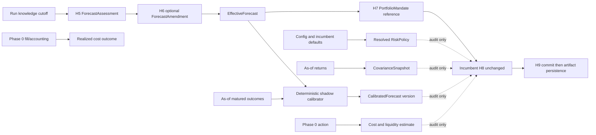

# Olympus Pipeline Phase 1: Forecast and Risk Contracts Implementation Plan

> **Status:** Draft for implementation review
> **Canonical findings:** [Olympus pipeline review](../../reviews/2026-08-06-olympus-pipeline-review.md), `OLY-REV-004`, `OLY-REV-005`, `OLY-REV-006`, `OLY-REV-008`, `OLY-REV-010`, `OLY-REV-011`, `OLY-REV-012`
> **Execution:** One issue and one `task/<N>-<slug>` branch per task. Use red-green-refactor. Allocate migration numbers only after syncing the implementation branch.

## Goal

Create honest, replayable inputs for portfolio construction without changing production allocation:

1. H5 emits an immutable, typed forecast assessment.
2. H6 can append an evidence-linked amendment without rewriting H5 history.
3. H7 references the effective forecast but retains only authorization and priority authority.
4. Matured forecasts produce as-of-safe outcomes and versioned calibration.
5. Every H8 run resolves and persists the complete risk, covariance, cost, and liquidity assumptions
   that were in force.
6. Expected and realized action cost become comparable through the Phase 0 action/fill/accounting
   chain.

All calibration and cost outputs remain observational in Phase 1. The incumbent rank-derived H8
sizing path remains unchanged until Phase 2.

## Issue Contract

Every implementation issue must state all of the following. The task entries below provide the
minimum required content and must be updated with actual merged symbol names before coding.

| Field | Required answer |
|---|---|
| Defect | What current ambiguity, loss of lineage, or invalid inference is removed? |
| Purpose | What capability is being created? |
| Intent | Why this task exists now and what it deliberately does not authorize |
| Producer | Exact component that creates the output |
| Consumer | Exact component that reads it |
| Output | Strict model/table/artifact and version identity |
| Contribution | Research, portfolio, risk, accounting, learning, or efficiency effect |
| Failure state | Typed degraded/blocked behavior; never an invented zero |
| Tests | First failing test and focused command |
| Metric | Observable completion criterion |
| Rollback/deletion | How to disable behavior and when temporary compatibility code is removed |
| Anti-goals | Explicitly forbidden scope |

## Architecture and Authority



- H5 owns base forecast terms.
- H6 owns only immutable amendments.
- H7 owns `long | flat`, eligibility, and ordinal priority. It emits no weight and cannot edit
  forecast terms.
- H8 remains the sole target-weight authority.
- H9 remains the sole terminal portfolio-commit authority and the fail-soft persistence boundary for
  Phase 1 artifacts.
- Phase 1 adds no graph node. Calibration is a deterministic helper invoked inside the existing
  post-H6/pre-H7 phase boundary and stored in existing typed state.
- Phase 1 creates no live-trading or broker path.

## Hard Dependencies

| Work package | Blocking prerequisites |
|---|---|
| WP4 typed forecasts | WP1 provider invocation IDs and model/prompt provenance |
| WP5 outcomes/calibration | WP3 period-correct market/accounting time semantics and WP4 |
| WP6 risk policy | None for characterization; WP1 run identity for durable snapshots |
| WP7 cost/liquidity | WP2 authoritative action/fill IDs and WP3 realized accounting |

Before a task uses a Phase 0 contract, read its merged model and test. Record the real path, symbol,
key, timestamp semantics, and idempotency rule in the issue. If the contract is absent or still an
ambiguous dictionary, stop instead of creating a Phase 1 compatibility duplicate.

WP7 is the last Phase 1 package allowed to start. Both Phase 0 WP2 and WP3 must be merged and green,
not merely planned or under review, before Task 7.1 begins.

At implementation time, sync and allocate the next unused migration after the then-current head.
This plan intentionally uses `<NNN>` placeholders; migration `065_atlas_run_diagnostics_attempt.sql`
is already occupied and later numbers are not reserved.

## Temporal and Version Contract

Every run pins one timezone-aware UTC `knowledge_cutoff_at` before state construction. Every new
economic artifact distinguishes:

- `effective_at` or market `event_time`;
- `known_at`, when Olympus first had the record;
- `recorded_at`, when persistence completed;
- immutable content/version ID and source IDs; and
- the run cutoff under which it was selected.

Rules:

1. Registry inputs require `event_time <= requested_as_of` and `known_at <= knowledge_cutoff_at`.
2. After a version is pinned, no code resolves an unversioned latest policy, forecast, covariance,
   calibration, or cost record.
3. Same-run H5/H6 products may flow forward in graph state because the run caused them; they cannot
   enter the historical cohort selected at the earlier cutoff.
4. Outcome horizons and half-lives use trading sessions, not calendar days.
5. Legacy price rows without trustworthy ingestion time cannot be historically backfilled as known.
6. First prospective observation may snapshot a source value and stamp the actual observation time.
7. Retries with the same ID and canonical content are idempotent. Same ID with different content is
   a conflict, never an update.
8. New tables are private and append-only. Migrations contain no historical `INSERT ... SELECT`.

## Forecast Contract

`ForecastTerms` includes:

- trading-session horizon and half-life;
- ordered bear/base/bull returns and probabilities summing to one;
- thesis-valid probability;
- raw uncertainty;
- evidence and counter-evidence IDs;
- assumptions and invalidation rules.

`ForecastAssessment` adds deterministic base identity, source run/provider/prompt/artifact versions,
price anchor or typed unavailability, `effective_at`, `known_at`, and content hash.

`ForecastAmendment` contains a complete replacement term set, base/supersession lineage, reason, and
new evidence or contradiction IDs. `EffectiveForecast` selects either the immutable base or one
valid amendment and carries typed degradation.

The raw scenario mean is:

$$
\hat{\mu}_i = p_{bear}r_{bear} + p_{base}r_{base} + p_{bull}r_{bull}.
$$

No forecast term is inferred from legacy conviction or price-target prose.

## Risk and Cost Contract

A `RiskPolicy` resolves every enforced value and fallback, including sizing caps, gross/cash,
volatility target, drawdown schedule, cadence, minimum hold, no-trade bands, correlation policy,
covariance policy, liquidity, cost, factor/stress/tail capability, and grid. Every leaf records
whether it came from explicit config, normalized config, code default, or a derived invariant.

A `CovarianceSnapshot` carries canonical asset order, return horizon/window, observations, estimator,
shrinkage/fallback policy, source IDs/times, matrix values, quality, and content hash. It records the
incumbent calculation in Phase 1; it does not silently introduce a new estimator.

The observational expected cost model is:

$$
C_i(q_i)=\mathrm{fees}_i+\frac{\mathrm{spread}_i}{2}|q_i|
+\alpha_i\sigma_i\sqrt{\frac{|q_i|}{ADV_i}}|q_i|.
$$

Spread proxies and all coefficients are labeled assumptions. Missing price/notional is unpriceable;
missing liquidity invokes an explicitly approved conservative policy or remains unavailable. It is
never zero by omission.

## Failure and Degradation Matrix

| Failure | Required state |
|---|---|
| Invalid H5 proposal | Carry a prior typed forecast when eligible; otherwise `forecast_unavailable` |
| Legacy H5 document | Force full analysis; do not synthesize terms |
| Invalid/failed H6 amendment | Preserve base/effective ID; record `amendment_rejected` or `llm_failure` |
| H7 forecast mutation/weight output | Reject strict model output and use existing visible fail-soft path |
| Registry write failure after booking | Keep the one committed book; mark artifact persistence degraded |
| Trading calendar or maturity price absent | Forecast remains pending, never zero-return |
| Sparse calibration cohort | Shrink to declared prior, widen uncertainty, reduce reliability |
| Calibration unavailable | Persist typed unavailability; incumbent H8 continues |
| Risk-policy contradiction | Reject snapshot and flag the run; do not substitute new sizing values |
| Invalid covariance snapshot | Persist unavailable/degraded reason; never repair silently |
| Unsupported factor/stress/tail limit | `available=false`, `enforced=false`, `limit=None`, reason required |
| Partial liquidity data | Apply only a versioned conservative fallback and mark degraded |
| Price/action notional absent | `unpriceable`, `expected_cost=None` |
| Fill/accounting absent | Expected cost remains pending; no realized value is inferred |

## Work Package 4: Typed Forecast Assessment

### Task 4.1: Pin one knowledge cutoff per run

- **Defect:** Registry reads can otherwise observe records that arrived during a long or replayed run.
- **Purpose:** Establish one temporal boundary for all Phase 1 reads.
- **Intent:** Enable as-of correctness; do not alter graph cadence or economic outputs.
- **Producer -> consumer:** `run_atlas_then_hermes` -> Atlas/Hermes state -> every new reader.
- **Output/contribution:** UTC `knowledge_cutoff_at`; improves reproducibility and learning validity.
- **Files:** create `digiquant/src/digiquant/olympus/temporal.py`; modify Atlas state/graph,
  `hermes/chain.py`, `tests/dq/atlas/test_state.py`, `test_chain_atlas_then_hermes.py`, and
  `test_chain_checkpointer.py`.
- **Red:** naive timestamps rejected; start captured before initial state; resume preserves cutoff;
  missing cutoff fails closed rather than calling `now()`.
- **Focused check:**
  `pytest tests/dq/atlas/test_state.py tests/dq/hermes/test_chain_atlas_then_hermes.py tests/dq/hermes/test_chain_checkpointer.py -m unit -q`.
- **Metric:** all state and registry fixtures share exactly one cutoff.
- **Failure/rollback:** missing cutoff blocks only new readers; field remains backward-compatible until
  old checkpoints expire.
- **Anti-goals:** no new scheduler, graph, or hidden current-time fallback.
- **Commit:** `feat(olympus): pin run knowledge cutoff`

### Task 4.2: Add strict forecast models and stable identities

- **Defect:** `conviction_score` and untyped `price_targets` conflate confidence and expected return.
- **Purpose:** Separate LLM-proposed economics from deterministic identity/audit metadata.
- **Intent:** Create a durable forecast contract; retain legacy fields temporarily but never derive
  terms from them.
- **Producer -> consumer:** H5 proposal -> deterministic materializer -> H6/H7/H9.
- **Output/contribution:** frozen Pydantic v2 forecast models; improves signal accuracy and audit.
- **Files:** create `hermes/models/forecast.py` and `tests/dq/hermes/test_forecast_models.py`; modify
  `hermes/models/analyst.py`.
- **Red:** probability, order, finite-number, horizon, evidence, immutable, extra-field, UUID5, and
  same-ID/different-hash tests.
- **Focused check:** `pytest tests/dq/hermes/test_forecast_models.py -m unit -q`.
- **Metric:** every valid forecast has complete terms and deterministic provenance.
- **Failure/rollback:** invalid proposal becomes typed unavailable/carry; forecast field can remain
  optional until full-mode rollout is complete.
- **Anti-goals:** model-generated IDs/timestamps, raw dictionaries, inferred legacy forecasts.
- **Commit:** `feat(hermes): define typed forecast contracts`

### Task 4.3: Materialize immutable H5 assessments

- **Defect:** H5 serializers manually project fields and would silently discard a new contract.
- **Purpose:** Make every new full H5 analysis produce one auditable base forecast.
- **Intent:** Give H5 numerical forecast ownership without changing H7/H8 authority.
- **Producer -> consumer:** H5 provider result plus WP1 invocation -> `ForecastAssessment` -> H6/H9.
- **Output/contribution:** immutable base forecast and exact/typed-unavailable price anchor; improves
  forecast measurement.
- **Files:** modify `hermes/phases/portfolio_common.py`, H5 full/edit skills,
  `tests/dq/hermes/test_analyst_edit.py`, and forecast tests.
- **Red:** full requires terms; legacy prior forces full; skip preserves identity; partial nested edit
  rejected; serializer includes assessment; anchor has observed time or reason.
- **Metric:** 100% of successful new full H5 artifacts contain valid base lineage.
- **Failure/rollback:** rollout flag may keep forecast optional in shadow; delete compatibility
  optionality once all active carry windows contain typed forecasts.
- **Anti-goals:** changing retrieval, prompt identity in the LLM payload, or H8 inputs.
- **Commit:** `feat(hermes): materialize immutable H5 forecasts`

### Task 4.4: Add H6 amendments and quiet-carry lineage

- **Defect:** H6 conviction deltas/prose can change meaning without preserving a numerical base/revision
  chain, and slim prior summaries can drop IDs.
- **Purpose:** Append evidence-linked amendments and retain them across skips/restarts.
- **Intent:** Preserve challenge value while making forecast history immutable.
- **Producer -> consumer:** H6 plus prior-summary loaders -> `EffectiveForecast` -> H7/H9.
- **Output/contribution:** base/amendment/effective IDs and degradation; improves research/learning.
- **Files:** modify `models/deliberation.py`, `phases/h6_deliberation.py`, `payloads.py`,
  `atlas/supabase_io.py`, and focused H6/Supabase tests.
- **Red:** accepted complete amendment; unchanged base; invalid/failure preserves base; fingerprint
  skip carries identity/time/hash; cutoff excludes future-known prior.
- **Metric:** zero effective forecasts without reconstructable base and optional amendment.
- **Failure/rollback:** invalid/failed amendment is a no-change artifact with reason; legacy carry
  forces H5 full refresh.
- **Anti-goals:** in-place forecast mutation, partial term patches, deriving terms from prose.
- **Commit:** `feat(hermes): preserve forecast amendment lineage`

### Task 4.5: Make H7 forecast-reference-only

- **Defect:** Without a typed reference, an H7 authorization cannot be tied to the forecast it saw.
- **Purpose:** Bind each mandate decision to one effective forecast.
- **Intent:** Preserve H7 authorization/priority and prohibit forecast/weight authority.
- **Producer -> consumer:** effective forecast map -> deterministic H7 post-processing -> H8/H9.
- **Output/contribution:** `ForecastReference` on each ticker decision; improves portfolio audit.
- **Files:** modify `models/pm_direction.py`, `phases/h7_pm_direction.py`,
  `test_pm_no_weights.py`, and `test_h7_fail_soft.py`.
- **Red:** authoritative ID attached deterministically; numerical forecast and weight output rejected;
  fallback cannot replace current IDs; H8 sees identical direction/rank values.
- **Metric:** every non-legacy H7 ticker has exactly one effective forecast reference.
- **Failure/rollback:** missing forecast is explicit degraded input and cannot be fabricated.
- **Anti-goals:** H7 target weights, expected-return edits, or model-supplied identifiers.
- **Commit:** `feat(hermes): bind H7 to effective forecasts`

### Task 4.6: Persist forecast lineage prospectively through H9

- **Defect:** Forecast meaning currently survives primarily in rendered documents.
- **Purpose:** Store immutable base and amendment records independently of prose.
- **Intent:** Create a prospective scoring source without adding another commit authority.
- **Producer -> consumer:** H5/H6 state -> H9 artifact block -> outcome resolver.
- **Output/contribution:** private append-only forecast registry; enables calibration/learning.
- **Files:** create migration `<NNN>_olympus_forecast_registry.sql`, structural test,
  `atlas/forecast_registry.py`, registry tests; modify `h9_commit_run.py` and
  `tests/dq/hermes/test_commit_run.py`.
- **Red:** schema privacy/immutability/no-backfill; exact retry; content conflict; H9 booking once;
  registry failure cannot rebook; exact-ID cutoff reads only.
- **Metric:** all post-rollout successful H5 forecasts persist or expose a degraded artifact result.
- **Failure/rollback:** disable artifact writer while retaining rows and documents; remove document
  fallback after the typed-retention horizon.
- **Anti-goals:** prompt/reasoning storage, public base view, forecast math in commit I/O.
- **Commit:** `feat(olympus): persist prospective forecast lineage`

## Work Package 5: Outcome and Calibration Registry

### Task 5.1: Define outcome, calibration, and calibrated-forecast models/schema

- **Defect:** Market outcome, forecast error, portfolio contribution, and confidence are conflated.
- **Purpose:** Define immutable prospective labels and calibration versions.
- **Intent:** Measure forecast quality only; do not attribute sizing/timing P&L here.
- **Producer -> consumer:** outcome resolver/calibrator -> private registry -> Phase 2 and learning.
- **Output/contribution:** strict models plus `<NNN>_olympus_forecast_calibration.sql`; improves signal
  reliability.
- **Files:** create `models/forecast_calibration.py`, model tests, migration, and migration test.
- **Red:** exact base/effective IDs, reference/maturity sessions and snapshots, signed residual,
  positive label, event/known times, cohort/prior/sample/bias/dispersion/Brier/log/reliability,
  immutable hashes, privacy, no backfill.
- **Metric:** every persisted metric identifies its outcomes, prior, method, and unavailable reasons.
- **Failure/rollback:** schema can remain dark; no runtime reader changes until writer tests pass.
- **Anti-goals:** realized contribution labels, mutable current calibration, historical fabrication.
- **Commit:** `feat(olympus): define forecast calibration registry`

### Task 5.2: Resolve matured outcomes by trading session

- **Defect:** Calendar-day maturity and mutable current price reads would leak or mislabel outcomes.
- **Purpose:** Snapshot the exact prospective reference-to-maturity market result.
- **Intent:** Produce honest labels, not same-run feedback.
- **Producer -> consumer:** due forecast, trading calendar, first observed close -> outcome registry ->
  later runs' calibrator.
- **Output/contribution:** `ForecastOutcome`; improves research accuracy and temporal safety.
- **Files:** create `atlas/forecast_outcomes.py` and tests; invoke beside existing preflight reflection,
  not inside legacy `decision_log`.
- **Red:** Nth trading session; weekends/holidays; cutoff eligibility; exact anchor; missing calendar/
  close pending; real observation `known_at`; same-run exclusion; idempotency; no legacy conversion.
- **Metric:** every due, observable typed forecast resolves once; all others remain reason-coded pending.
- **Failure/rollback:** disable prospective resolver; no existing row is changed.
- **Anti-goals:** calendar approximation, zero return, decision-log reuse, pre-Phase-1 backfill.
- **Commit:** `feat(atlas): resolve forecast outcomes by session`

### Task 5.3: Implement deterministic shrinkage calibration

- **Defect:** Small samples can otherwise produce falsely precise expected returns.
- **Purpose:** Estimate bias, dispersion, downside, and reliability against a declared prior.
- **Intent:** Produce a shadow input for later evaluation, not a live H8 signal.
- **Producer -> consumer:** as-of eligible outcomes plus effective forecast -> calibration artifacts ->
  Phase 2 bundle/replay.
- **Output/contribution:** `ForecastCalibration` and `CalibratedForecast`; improves signal quality.
- **Files:** create `hermes/forecast_calibration.py` and tests.
- **Red:** scenario mean; signed residual; empty/one/adequate cohorts; Brier/log score; deterministic
  input order; late-known exclusion; non-zero uncertainty; reliability bounds.
- **Green policy:** persist prior definition/equivalent sample size, shrinkage formula, downside method,
  empirical threshold, cohort, and implementation version. Use Polars for aggregation.
- **Metric:** repeated identical cohorts produce identical IDs/results and sparse cohorts remain low
  reliability.
- **Failure/rollback:** return typed unavailable; incumbent H8 remains untouched.
- **Anti-goals:** hidden priors, online fitting, unreviewed statistical dependency.
- **Commit:** `feat(hermes): calibrate forecasts deterministically`

### Task 5.4: Run calibration in shadow inside an existing boundary

- **Defect:** A correct calibrator is useless if its exact input cohort/version is not connected to
  the run, but adding a node would violate the one-graph topology.
- **Purpose:** Attach and persist current shadow calibration after H6 and before H7 consumption.
- **Intent:** Observe complete artifacts while keeping H7 references and incumbent H8 economics
  unchanged.
- **Producer -> consumer:** existing H6 completion boundary -> deterministic helper -> typed state ->
  H9 registry and Phase 2.
- **Output/contribution:** exact subject/cohort/calibration IDs; improves future portfolio inputs.
- **Files:** add a focused helper in `hermes/forecast_calibration.py`; modify the existing H6/H7
  boundary, typed state, `forecast_registry.py`, H9, and focused calibration/H8/H9 tests.
- **Red:** no new graph node; cutoff-bounded outcomes; typed unavailable; H7 reference only;
  `_memo_effective_inputs`, `_effective_inputs`, and final book remain golden; H9 idempotency.
- **Metric:** every valid current forecast has a persisted calibrated or explicit unavailable artifact;
  production target hashes remain unchanged.
- **Failure/rollback:** disable shadow helper/writer; no production action changes.
- **Anti-goals:** new phase name/node, live sizing input, graph fork, latest calibration lookup.
- **Commit:** `feat(olympus): persist shadow forecast calibration`

## Work Package 6: Versioned Risk Policy and Covariance

### Task 6.1: Characterize every incumbent H8 risk default and stage

- **Defect:** Risk behavior is distributed across preferences, dataclass defaults, constants, and
  ordered helpers.
- **Purpose:** Freeze current behavior before modeling it.
- **Intent:** Discover the complete policy; do not refactor or improve it in this task.
- **Producer -> consumer:** existing H8 code -> characterization fixtures -> policy resolver tests.
- **Output/contribution:** golden behavior matrix; reduces allocation regression risk.
- **Files:** extend `test_sizing.py`, `test_sizing_correlation.py`, `test_risk_controls.py`,
  `test_turnover.py`, and `test_phase7e_risk_sizing.py`.
- **Red/green:** cover every `SizingCaps` field, breaker, horizon, 63-day window, correlation buckets,
  annualization, volatility fallback, caps/cash/grid, continuity/cadence/turnover, and representative
  books; only fix test-discovered defects that violate documented incumbent intent.
- **Metric:** all policy leaves and control order have a named golden fixture.
- **Rollback/deletion:** tests are permanent.
- **Anti-goals:** changing formulas, defaults, ordering, or production inputs.
- **Commit:** `test(hermes): characterize incumbent risk policy`

### Task 6.2: Define and resolve complete RiskPolicy and CovarianceSnapshot

- **Defect:** A historical run cannot reconstruct which hard limits, fallbacks, and matrix it used.
- **Purpose:** Build one validated, fully resolved policy and one canonical matrix snapshot.
- **Intent:** Version incumbent behavior now; optimization changes wait for Phase 2.
- **Producer -> consumer:** config/defaults/as-of returns -> resolver -> H9, risk report, replay.
- **Output/contribution:** strict `RiskPolicy`, provenance, and `CovarianceSnapshot`; improves risk
  reproducibility.
- **Files:** create `models/risk_policy.py`, `risk_policy.py`, and tests; expose read-only fallback
  descriptions from existing modules only where needed.
- **Red:** every leaf provenance; contradictions; complete correlation/fallback maps; canonical asset
  order; finite symmetric matrix; horizon/window/source metadata; unavailable factor/stress/tail
  capabilities; deterministic hashes.
- **Metric:** resolver output matches every characterization fixture and contains no unresolved field.
- **Failure/rollback:** invalid policy/snapshot is typed degraded and not fed to incumbent sizing.
- **Anti-goals:** silent matrix repair, new covariance estimator, environment-only economics.
- **Commit:** `feat(hermes): resolve risk policy and covariance`

### Task 6.3: Persist snapshots privately and attach them to each H8 run

- **Defect:** Resolved policy/matrix can still disappear unless bound to the run and persisted.
- **Purpose:** Store exact Phase 1 risk inputs prospectively.
- **Intent:** Audit H8 without changing any target weight.
- **Producer -> consumer:** resolver at existing H8 entry -> typed state -> H9 artifact block -> Phase 2.
- **Output/contribution:** `<NNN>_olympus_risk_policy_snapshots.sql`, registry adapters, run refs;
  improves risk/audit.
- **Files:** migration/test, `atlas/risk_policy_registry.py` and tests; modify
  `phase7e_risk_sizing.py`, state, H9, `test_phase7e_risk_sizing.py`, and `test_commit_run.py`.
- **Red:** private append-only schema; exact-ID reads only; resolver runs before sizing; parity with
  direct incumbent inputs; final book unchanged; persistence after booking; failure cannot rebook.
- **Metric:** every successful H8 run has one exact policy and covariance result or visible degradation.
- **Failure/rollback:** disable artifact writer; incumbent H8 continues through characterized path.
- **Anti-goals:** passing the new objects back into `size_portfolio` in Phase 1.
- **Commit:** `feat(olympus): snapshot incumbent H8 risk inputs`

## Work Package 7: Cost and Liquidity Model

### Task 7.1: Bind to merged Phase 0 action, fill, and accounting contracts

- **Defect:** Guessed adapters could create a second economic truth.
- **Purpose:** Translate authoritative Phase 0 records into cost-model inputs.
- **Intent:** Reuse ledger ownership; stop if required typed fields are absent.
- **Producer -> consumer:** Phase 0 Pydantic records -> `ActionCostInput`/`RealizedCostInput` -> model.
- **Output/contribution:** typed adapter; improves execution/accounting linkage.
- **Files:** create `hermes/action_cost_inputs.py` and tests; update real Phase 0 model tests only as
  required.
- **Red:** explicit side, quantity/notional, currency, action/fill/accounting IDs and timestamps;
  reject missing or inferred values.
- **Metric:** every accepted adapter fixture retains exact authoritative IDs and amounts.
- **Failure/rollback:** missing contract blocks WP7 rather than falling back to legacy dictionaries.
- **Anti-goals:** infer notional from current weights/NAV; duplicate action/fill models.
- **Commit:** `feat(hermes): bind costs to authoritative actions`

### Task 7.2: Implement pure cost and liquidity contracts/model

- **Defect:** Current turnover has no timestamped, decomposed cost/capacity evidence.
- **Purpose:** Estimate fees, spread proxy, impact, ADV participation, and days to liquidate.
- **Intent:** Observe trade economics only; do not veto or modify actions in Phase 1.
- **Producer -> consumer:** action input plus prospective OHLCV/technicals and resolved policy -> H9.
- **Output/contribution:** `LiquiditySnapshot`, `ActionCostEstimate`, `ActionCostOutcome`; improves
  execution/risk evidence.
- **Files:** create `models/cost_liquidity.py`, `cost_liquidity.py`, and tests; extend risk policy.
- **Red:** complete data, buy/sell, zero trade, missing high/low/vol/ADV/close/notional, extreme
  participation, deterministic version/hash, expected-vs-realized components.
- **Metric:** every estimate decomposes assumptions/observations and never maps unknown cost to zero.
- **Failure/rollback:** conservative approved fallback or typed unpriceable; pure model is unused by
  production controls.
- **Anti-goals:** hidden coefficient defaults, quote claims from range proxies, new market service.
- **Commit:** `feat(hermes): model observational costs and liquidity`

### Task 7.3: Persist cost/liquidity evidence and resolve realized outcomes

- **Defect:** Expected costs cannot be calibrated without immutable market snapshots and fill linkage.
- **Purpose:** Store prospective estimates and later compare them with authoritative realized cost.
- **Intent:** Build learning evidence without rewriting the original estimate.
- **Producer -> consumer:** H9 after action creation and later preflight resolver -> registry -> WP9,
  WP15, and replay.
- **Output/contribution:** `<NNN>_olympus_cost_liquidity.sql`, exact-version registry; improves
  execution learning.
- **Files:** migration/test, `atlas/cost_liquidity_registry.py` and tests; modify H9, preflight, typed
  state, and actual Phase 0 tests.
- **Red:** exact action/policy/source linkage; privacy/immutability/no-backfill; H9 estimates only
  after action ID; target/book unchanged; failure no rebook; later fill creates one outcome;
  missing fill pending.
- **Metric:** 100% of priceable post-rollout actions have expected cost; every observed completed fill
  has one realized comparison or typed unavailable reason.
- **Failure/rollback:** disable writer/resolver; retain rows; remove observational-only caveat only
  after Phase 2 gates.
- **Anti-goals:** feeding estimates into turnover, suppressing actions, historical reconstruction.
- **Commit:** `feat(olympus): persist expected and realized action costs`

## Integration Task 1.1: Lock Phase 1 composition and unchanged H8 output

- **Defect:** Independently valid registries could still violate temporal or authority boundaries
  when composed.
- **Purpose:** Prove end-to-end lineage and production non-interference.
- **Intent:** Close Phase 1 and expose exact contracts to Phase 2; authorize no optimizer.
- **Producer -> consumer:** full simulated graph -> all Phase 1 registries and incumbent book -> Phase 2.
- **Output/contribution:** `tests/dq/hermes/test_phase1_forecast_risk_contracts.py`, architecture docs,
  release evidence; improves whole-system correctness.
- **Red fixture:** unchanged forecast, valid/invalid/failed amendment, matured prior, sparse cohort,
  complete/unpriceable action, valid/degraded policy/covariance.
- **Assertions:** one effective ID per H7 decision; cutoff-safe calibration; one risk snapshot;
  authoritative action cost; event/known/version fields; explicit-ID reads; H9 books once; final
  `sized_book` equals incumbent golden; graph node list unchanged.
- **Metric:** all WP4-WP7 acceptance statements below pass in one deterministic fixture.
- **Failure/rollback:** Phase 1 remains shadow and Phase 2 cannot start.
- **Anti-goals:** rank-to-forecast cutover, cost-aware turnover, optimizer, promotion.
- **Commit:** `test(olympus): lock Phase 1 contracts`

## Release Acceptance

### WP4 Forecast

- H5 emits complete typed terms with immutable provider/evidence lineage.
- H6 amendments are separate and failure preserves the last valid effective forecast.
- Quiet carry preserves identity and known time.
- H7 references but cannot mutate forecasts or emit weights.
- No legacy conviction/prose is converted into forecast terms.

### WP5 Calibration

- Outcomes mature by trading session using prospective snapshots.
- Event time and `known_at` are both enforced.
- Same-run discoveries cannot enter same-run calibration.
- Reports include sample, bias, dispersion, proper scores where defined, cohort, prior, shrinkage,
  uncertainty, reliability, and versions.
- Calibrated forecasts remain shadow-only.

### WP6 Risk

- Every successful H8 run produces one resolved policy and covariance artifact.
- Every default, fallback, source, horizon, and limit has provenance.
- Contradictions and invalid matrices fail closed.
- Unsupported limits are explicitly unavailable/unenforced.
- Incumbent sized-book fingerprints remain unchanged.

### WP7 Cost

- Every estimate references an authoritative Phase 0 action.
- Every observation, coefficient, proxy, fallback, and policy version is stored.
- Missing data is conservative/degraded or unpriceable, never zero by omission.
- Expected and realized values link immutably.
- Estimates do not affect targets/actions in Phase 1.

## Verification

Run focused tests task by task, then:

```bash
.venv/bin/python -m pytest -m unit \
  tests/dq/hermes/test_forecast_models.py \
  tests/dq/hermes/test_forecast_calibration.py \
  tests/dq/hermes/test_risk_policy.py \
  tests/dq/hermes/test_cost_liquidity.py \
  tests/dq/hermes/test_phase7e_risk_sizing.py \
  tests/dq/hermes/test_commit_run.py \
  tests/dq/hermes/test_phase1_forecast_risk_contracts.py \
  tests/dq/atlas/test_forecast_outcomes.py \
  tests/dq/atlas/test_forecast_registry.py \
  tests/dq/atlas/test_risk_policy_registry.py \
  tests/dq/atlas/test_cost_liquidity_registry.py -q --tb=short
.venv/bin/python -m pytest -m unit tests/dq/atlas/test_migration_*.py -q --tb=short
.venv/bin/ruff check digiquant/src/digiquant/olympus tests/dq/atlas tests/dq/hermes
.venv/bin/ruff format --check digiquant/src/digiquant/olympus tests/dq/atlas tests/dq/hermes
make test-baseline
make doc-check
git diff --check
```

Before every issue PR, update `digiquant/ARCHITECTURE.md` and Hermes architecture documentation when
interfaces change, stage only the issue scope, run `make score`, and obtain the repository-required
independent review.

## Explicit Phase 2 Handoff

Phase 1 does not authorize replacing `_rank_to_conviction`, feeding calibrated returns into live H8,
feeding costs into turnover, changing deterministic control order, adding an optimizer/solver, or
promoting any policy. Phase 2 may begin only when prospective calibration and risk artifacts meet its
coverage gate and Phase 0 accounting remains reconciled.
