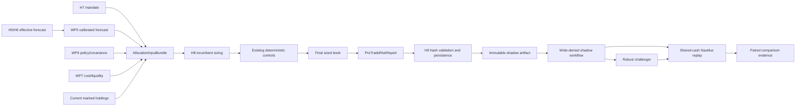

# Olympus Pipeline Phase 2: Allocation and Risk Implementation Plan

> **Status:** Draft for implementation review
> **Canonical findings:** [Olympus pipeline review](../../reviews/2026-08-06-olympus-pipeline-review.md), `OLY-REV-004`, `OLY-REV-005`, `OLY-REV-006`, `OLY-REV-009`, `OLY-REV-012`
> **Execution:** One issue and one `task/<N>-<slug>` branch per task. Use red-green-refactor. No production optimizer promotion is authorized.

## Goal

Upgrade portfolio construction in three bounded steps:

1. Fix the current H8 eligibility/rank-gap defect, then replace rank-derived magnitude with exact
   versioned calibrated forecasts after the signal gate passes.
2. Emit one deterministic pre-trade report for the final H8 book and bind it to H9 by hashes.
3. Evaluate a robust, uncertainty/cost-aware challenger in an isolated shadow workflow using genuine
   one-account, multi-instrument NautilusTrader replay.

H7 remains authorization and priority authority. H8 remains target-weight authority. H9 remains the
sole terminal commit authority. The challenger has no route into production state, configuration,
Supabase, broker code, or the H1-H9 graph.

## Issue Contract

Every task issue must state: defect, purpose, intent, producer, consumer, strict output, system
contribution, typed failure state, first failing test, focused command, acceptance metric,
rollback/deletion condition, and anti-goals. A new artifact without a named consumer and measurable
contribution is out of scope.

## Dependencies and Promotion Boundary

| Package | Required input/gate |
|---|---|
| WP8 immediate fallback fix | Current H7/H8 tests only |
| WP8 calibrated cutover | WP4 typed forecast, WP5 calibration coverage, WP6 risk/covariance snapshot |
| WP9 risk report | WP6 policy/covariance, WP7 cost/liquidity, completed WP8 |
| WP10 challenger | WP5-WP9, reconciled Phase 0 accounting, human-approved shadow criteria |

Do not create local replacement contracts if a prerequisite has not merged. The Phase 1 covariance
snapshot is the sole matrix input. The Phase 0 action/fill/accounting ledger is the sole execution
truth.

## Authority and Data Flow



## Invariants

1. H7 alone defines eligible instruments, `long | flat`, and ordinal priority.
2. H5 stance cannot add, remove, or reverse an H7-authorized instrument.
3. Rank is ordering/tie information, never expected-return magnitude after cutover.
4. H8 cannot introduce a ticker or reverse H7 direction.
5. Existing cap, correlation, volatility, drawdown, continuity, turnover, cadence, grid, and residual
   cash controls remain in their characterized order.
6. H8 may assign zero and hold cash when forecast/risk evidence is insufficient.
7. Forecasts, uncertainty, covariance, costs, prior weights, and policy share one pinned cutoff and
   compatible horizons/units.
8. Asset order is canonical across vectors, matrices, hashes, reports, and replay.
9. H9 validates model identity and hashes. It does not recompute risk or optimize.
10. A shadow artifact is numeric/versioned and contains no prompt, prose, secret, client, or mutable
    production handle.
11. Challenger code is unreachable from the production graph and CLI.
12. Replay uses one engine and shared cash per portfolio arm, never independent per-symbol averaging.
13. Nautilus failure is `inconclusive`; there is no vectorized economic fallback.
14. No live-trading, broker, or order-submission code changes.

## Numerical Contract

For risky weights $w$, covariance $\Sigma$, and portfolio volatility $\sigma_p$:

$$
\sigma_p^2 = w^T\Sigma w,
\qquad
\mathrm{MRC}_i = \frac{(\Sigma w)_i}{\sigma_p},
\qquad
\mathrm{CRC}_i = w_i\mathrm{MRC}_i.
$$

Component risks sum to $\sigma_p$ within declared tolerance when $\sigma_p > 0$.

The challenger objective is:

$$
J(w)=\hat{\mu}^{T}w
-\kappa\lVert D_{\mu}w\rVert_2
-\frac{\lambda}{2}w^{T}\Sigma w
-C(w-w_0)
-\gamma\lVert w-w_0\rVert_1.
$$

Hard feasibility is inherited from the same production policy and final projection. No objective
improvement can excuse a hard-constraint violation.

## Degradation Matrix

| Condition | Production H8 | Pre-trade report | Shadow challenger |
|---|---|---|---|
| Gapful/duplicate legacy rank before cutover | Dense `(rank, symbol)` fallback | Records legacy mode | Abstains without calibrated bundle |
| Missing/stale/wrong-horizon forecast after cutover | No new risk for affected asset; preserve cash/safety semantics | Reason-coded degraded asset | Abstains |
| H5/H7 disagreement | H7 wins | Records mandate source | Uses H7 only |
| Invalid/missing covariance | Existing characterized safe fallback only when its policy explicitly applies | Matrix metrics unavailable/fallback labeled | Abstains |
| Missing uncertainty | Follow approved calibrated-forecast policy; never zero uncertainty | Unavailable | Abstains |
| Missing cost/liquidity | Existing controls unchanged | Cost/capacity unavailable | Abstains |
| All-cash book | Valid commit | Valid zero variance/contributions | Incumbent-equivalent no-op |
| Report/hash mismatch | H9 rejects incomplete commit | No partial authoritative report | Artifact rejected |
| Nautilus unavailable/crash | No effect | Existing report remains | Inconclusive |
| Challenger infeasible/non-finite | No effect | No change | Failed evaluation |

## Shared Contracts

All models are Pydantic v2, frozen, `extra="forbid"`, finite, and versioned.

`AllocationInputBundle` contains run/cutoff/cadence, canonical asset order, H7 mandate references,
calibrated expected returns and uncertainty, exact covariance/policy versions, prior risky/cash
weights, existing control settings, costs/liquidity, source hashes, freshness, and degradation.

`PreTradeRiskReport` contains input/final-book/report hashes, prior/final weights, trade deltas, cash,
gross/net exposure, variance/volatility, marginal/component risk, name/sector/factor/scenario
exposure where available, concentration, effective bets, control outcomes, expected cost, liquidity,
forecast staleness/uncertainty, binding constraints, altered/rejected targets, and reason-coded
unavailable metrics.

`ShadowAllocationArtifact` contains only the exact allocation bundle, incumbent final book, report,
source commit/run metadata, and hashes.

Canonical JSON uses sorted keys, compact separators, UTF-8, normalized UTC timestamps,
`allow_nan=False`, and SHA-256. Existing weight fingerprint outputs remain byte-identical.

## Work Package 8: H8 Forecast-Input Correction

### Task 8.1: Correct gapful rank fallback and remove H5 eligibility authority

- **Defect:** Raw rank arithmetic can silently drop an H7-authorized long, and H5 stance can leak
  into eligibility.
- **Purpose:** Repair current behavior before larger input changes.
- **Intent:** Make the legacy fallback coherent without changing downstream sizing controls.
- **Producer -> consumer:** H7 memo -> `_memo_effective_inputs` -> incumbent H8.
- **Output/contribution:** dense deterministic fallback convictions; improves portfolio correctness.
- **Files:** modify `hermes/phases/phase7e_risk_sizing.py` and
  `tests/dq/hermes/test_phase7e_risk_sizing.py`.
- **Red:** ranks `[2,7,11]` equal `[1,2,3]`; duplicate ranks tie by symbol; H5 cannot remove an H7
  long; H7-flat cannot enter through H5.
- **Focused check:** `pytest tests/dq/hermes/test_phase7e_risk_sizing.py -m unit -q`.
- **Metric:** all authorized legacy longs receive deterministic fallback inputs; no H5 authority.
- **Failure/rollback:** small pure-function change is revertible; fallback is deleted after calibrated
  cutover retention window.
- **Anti-goals:** forecast cutover, control reorder, live path.
- **Commit:** `fix(hermes): densify H7 fallback ranks`

### Task 8.2: Define allocation models and stable hashes

- **Defect:** Inputs are assembled from heterogeneous state without one validated identity.
- **Purpose:** Establish a canonical H8 boundary and hash vocabulary.
- **Intent:** Join prerequisite contracts; do not estimate or optimize here.
- **Producer -> consumer:** Phase 1 registries/H7/prior book -> H8/report/H9/replay.
- **Output/contribution:** `AllocationInputBundle` models and stable hashes; improves portfolio
  reproducibility.
- **Files:** create `hermes/allocation_contracts.py`, `allocation_hashes.py`, and tests; modify
  `hermes/writers/commit_io.py` only to delegate existing fingerprint API.
- **Red:** extra/mutable/NaN/horizon/order/matrix mismatch rejection; UTC/hash stability; existing
  weight fingerprint golden outputs unchanged.
- **Metric:** any source change changes the bundle hash; ordering changes alone do not.
- **Failure/rollback:** models can remain unused until wiring task; shared hash API is permanent.
- **Anti-goals:** duplicate Phase 1 models, mutable dictionaries, Python `hash()`.
- **Commit:** `feat(hermes): define allocation input contracts`

### Task 8.3: Build the canonical H8 bundle

- **Defect:** H8 cannot prove which versioned forecast/risk/cost inputs it consumed.
- **Purpose:** Construct one exact as-of bundle at H8 entry.
- **Intent:** Validate and join only; incumbent output remains unchanged initially.
- **Producer -> consumer:** H7 mandate plus exact Phase 1 artifacts -> typed state -> H8/report.
- **Output/contribution:** `allocation_input_bundle`; improves audit/risk.
- **Files:** create `hermes/allocation_inputs.py` and tests; modify `hermes/state.py` and
  `phase7e_risk_sizing.py`.
- **Red:** H7 authorization only; exact forecast/policy/covariance/cost versions; prior weights;
  future/wrong-horizon rejection; H5 mutation no effect; deterministic asset order.
- **Metric:** every accepted asset has one complete source chain or a typed degraded status.
- **Failure/rollback:** bundle construction shadow mode can be disabled; no private fallback models.
- **Anti-goals:** latest reads, matrix estimation, policy resolution, allocation.
- **Commit:** `feat(hermes): assemble canonical H8 inputs`

### Task 8.4: Cut incumbent raw sizing over to calibrated forecasts

- **Defect:** Rank gaps and a fixed premium currently masquerade as cardinal alpha.
- **Purpose:** Feed common-horizon calibrated returns/uncertainty into the existing deterministic
  sizing shell.
- **Intent:** Correct magnitude while preserving H7 authority and every downstream control.
- **Producer -> consumer:** validated bundle -> incumbent raw-weight stage -> existing controls.
- **Output/contribution:** forecast-driven pre-control weights; improves allocation accuracy.
- **Files:** modify `hermes/sizing.py`, `phase7e_risk_sizing.py`, and focused tests.
- **Red:** changing forecasts with fixed ranks changes raw weights; changing rank gaps with fixed
  forecasts does not; invalid/negative alpha cannot create contrary risk; H5 stance no effect;
  reliability/uncertainty is applied exactly as the approved policy states.
- **Gate:** sufficient prospective WP5 coverage and owner-approved degraded fallback policy.
- **Metric:** rank-to-conviction/fixed-premium code absent from live post-cutover path; source bundle
  ID on every book.
- **Failure/rollback:** versioned mode reverts to characterized incumbent fallback, never an
  unversioned hybrid; remove fallback only after approved retention.
- **Anti-goals:** optimizer, control reorder, H7 weights, automatic shorting.
- **Commit:** `fix(hermes): size H8 from calibrated forecasts`

### Task 8.5: Freeze the deterministic risk shell after cutover

- **Defect:** Input correction could accidentally change control order or edge semantics.
- **Purpose:** Lock all existing deterministic safeguards around the new raw inputs.
- **Intent:** Preserve valuable controls exactly; repair only demonstrated local defects.
- **Producer -> consumer:** H8 raw book -> control sequence -> final book.
- **Output/contribution:** table/property regression suite; improves risk safety.
- **Files:** create `tests/dq/hermes/test_allocation_invariants.py`; extend sizing, risk-control,
  correlation, and turnover tests.
- **Red:** cash-first cap, sectors, correlation dedup, vol target, breaker, continuity, cadence,
  turnover, grid, backstop, final caps; all-cash/one-asset/cap-saturated/degraded cases.
- **Metric:** output satisfies all policy invariants and control sequence is explicit.
- **Rollback/deletion:** tests are permanent.
- **Anti-goals:** redistribute cap excess differently or collapse controls into optimizer logic.
- **Commit:** `test(hermes): lock H8 allocation invariants`

## Work Package 9: Pre-Trade Risk Report

### Task 9.1: Define report contract and metric availability

- **Defect:** H9 receives a book without one deterministic explanation of current/target risk.
- **Purpose:** Define complete, source-bound operator and validation output.
- **Intent:** Observe the final book; report methods cannot alter it.
- **Producer -> consumer:** allocation bundle/final book -> H9/operators/outcome episodes.
- **Output/contribution:** strict `PreTradeRiskReport`; improves risk/accountability.
- **Files:** extend `allocation_contracts.py`; create `tests/dq/hermes/test_pretrade_risk.py`.
- **Red:** complete/degraded/unavailable states; NaN/order/reason rejection; unavailable requires
  reason; hard constraints and target adjustments represented.
- **Metric:** every required metric is a value plus provenance or typed unavailability.
- **Failure/rollback:** contract can remain shadow until computation is complete.
- **Anti-goals:** weights mutation, LLM-computed numbers, hidden zeroes.
- **Commit:** `feat(hermes): define pre-trade risk report`

### Task 9.2: Compute deterministic risk, scenario, cost, and liquidity metrics

- **Defect:** Portfolio risk and implementation burden are not measured from one common book/input set.
- **Purpose:** Calculate report values reproducibly from prerequisite contracts.
- **Intent:** Reuse the exact covariance, cost, turnover, and policy definitions.
- **Producer -> consumer:** pure report builder -> report model -> H8/H9.
- **Output/contribution:** `hermes/pretrade_risk.py`; improves risk decisions.
- **Files:** create module and extend report tests.
- **Red:** hand-calculated one/two/three-asset variance, MRC/CRC, concentration/effective bets,
  sectors, factor/scenarios where available, turnover, cost, ADV/days-to-liquidate, all-cash,
  zero-volatility, unavailable inputs.
- **Metric:** risk contributions reconcile; all metric source hashes equal bundle sources.
- **Failure/rollback:** report remains degraded/unavailable; never substitute a different book.
- **Anti-goals:** estimating covariance/cost again, unsupported scenario fabrication.
- **Commit:** `feat(hermes): calculate deterministic pre-trade risk`

### Task 9.3: Attach report after the final H8 transformation

- **Defect:** A report on a provisional book would disagree with carry/cadence/grid/final caps.
- **Purpose:** Bind metrics to exactly the book H9 receives.
- **Intent:** Compute once after all existing controls.
- **Producer -> consumer:** final H8 book -> report -> state/H9.
- **Output/contribution:** `pre_trade_risk_report`; improves commit coherence.
- **Files:** modify `phase7e_risk_sizing.py`, `hermes/state.py`, and focused tests.
- **Red:** carry, cadence, backstop, grid, and final-cap cases prove report hash/weights equal final
  book; builder has no mutation side effect.
- **Metric:** report final-weight hash equals final book hash for every successful H8 result.
- **Failure/rollback:** before H9 enforcement, typed report failure blocks only report promotion;
  after enforcement it blocks incomplete commit without changing prior state.
- **Anti-goals:** provisional reporting, H9 recomputation.
- **Commit:** `feat(hermes): report final H8 portfolio risk`

### Task 9.4: Add H9 hash validation and append-only persistence

- **Defect:** A detached report could be stored beside a different committed book.
- **Purpose:** Make H9 enforce identity/coherence without owning calculations.
- **Intent:** Preserve one commit path and idempotency.
- **Producer -> consumer:** H8 report/book -> H9 validator -> private manifest/ledger -> operators,
  WP15, replay.
- **Output/contribution:** hash-bound persisted report; improves portfolio/risk audit.
- **Files:** modify `phases/h9_commit_run.py`, `writers/commit_io.py`,
  `tests/dq/hermes/test_commit_run.py`, and relevant migration/schema from Phase 0/1.
- **Red:** missing/unknown report, book/bundle hash mismatch, identical retry, append-only result;
  import/call guard proves H9 never calls report computation.
- **Metric:** every committed post-cutover book references exactly one matching report ID/hash.
- **Failure/rollback:** enforcement can revert to shadow validation via versioned rollout config;
  persistence never mutates prior reports.
- **Anti-goals:** creating a second H9 test file instead of extending `test_commit_run.py`,
  recomputation, second manifest authority.
- **Commit:** `feat(hermes): persist hash-bound risk reports`

## Work Package 10: Robust Optimizer in Isolated Shadow

### Task 10.1: Export a minimal immutable allocation artifact

- **Defect:** Shadow evaluation must not read mutable production state or invoke the graph again.
- **Purpose:** Serialize the exact completed inputs/book/report atomically.
- **Intent:** Create a one-way data boundary; no challenger import in production.
- **Producer -> consumer:** completed H9 state -> workflow artifact -> shadow job.
- **Output/contribution:** `ShadowAllocationArtifact`; enables safe portfolio research.
- **Files:** create `hermes/shadow_artifact.py` and tests; modify `hermes/chain.py` and
  `.github/workflows/pipeline-olympus.yml`.
- **Red:** canonical bytes, atomic replace, tamper detection, no prose/secrets/clients, export failure
  does not rerun or modify H8/H9, import guard against optimizer/replay.
- **Metric:** every eligible production-shadow run emits one verifiable artifact hash.
- **Failure/rollback:** disable upload; production result remains committed once.
- **Anti-goals:** DB clients, credentials, provider output, challenger selection.
- **Commit:** `feat(hermes): export immutable allocation artifacts`

### Task 10.2: Enforce write-denied shadow workflow isolation

- **Defect:** A shadow evaluator with production credentials could accidentally become an execution
  path.
- **Purpose:** Make isolation statically and behaviorally testable.
- **Intent:** Permit only artifact-in/file-out evaluation.
- **Producer -> consumer:** approved workflow artifact -> isolated CLI -> result artifact.
- **Output/contribution:** shadow workflow and checker; improves security/risk.
- **Files:** create `.github/workflows/pipeline-olympus-allocation-shadow.yml`,
  `digiquant/scripts/atlas/check_allocation_shadow_isolation.py`, and tests.
- **Red:** reject Supabase/H9/commit I/O/network/live Nautilus/broker/provider secrets, write
  permissions, `secrets: inherit`, untrusted source/branch/schema/hash.
- **Metric:** zero forbidden imports/secrets/permissions and file-only output.
- **Failure/rollback:** disable workflow; production graph unaffected.
- **Anti-goals:** network sink, production runtime flag, live engine.
- **Commit:** `ci(digiquant): isolate allocation shadow evaluation`

### Task 10.3: Implement solver-free robust challenger

- **Defect:** The incumbent is a benchmark, not an uncertainty/cost-aware optimizer.
- **Purpose:** Produce a deterministic feasible challenger without a new dependency.
- **Intent:** Evaluate the robust objective in shadow only; dependency-backed solver work requires a
  separate human architecture gate.
- **Producer -> consumer:** immutable bundle/incumbent seed -> challenger result -> replay/comparison.
- **Output/contribution:** deterministic coordinate-search policy and move trace; improves portfolio
  research.
- **Files:** create `hermes/shadow_optimizer.py` and tests.
- **Red:** identity/no-improvement, uncertainty penalty, diversification, cost-dominated no-trade,
  cash moves, caps/grid, infeasible input, deterministic ties, repeated byte-identical output.
- **Green:** move one existing grid quantum between donor/receiver (including cash), validate through
  shared feasibility checks, accept only objective improvement above epsilon, bounded iterations.
- **Metric:** never worse than seed objective within tolerance; zero hard-constraint violations.
- **Failure/rollback:** abstain on incomplete/invalid data; module remains shadow-only.
- **Anti-goals:** SciPy/CVXPY, random search, independent risk shell, production flag.
- **Commit:** `feat(hermes): add robust shadow allocator`

### Task 10.4: Build shared one-account Nautilus portfolio replay

- **Defect:** Existing independent-per-symbol engine averaging is not portfolio accounting.
- **Purpose:** Replay synchronized target books with one account, shared cash, real engine fills/costs.
- **Intent:** Create the single low-level replay adapter reused by Phase 4; do not modify existing
  public `BacktestResult` contracts.
- **Producer -> consumer:** validated artifact/bars/execution policy -> isolated engine -> portfolio
  result -> comparisons.
- **Output/contribution:** `olympus/replay/nautilus_portfolio.py`, strict internal result, and spawned
  worker; improves portfolio validation.
- **Files:** create `olympus/replay/__init__.py`, `models.py`, `nautilus_portfolio.py`, `worker.py`,
  focused tests; update Nautilus CI ownership only as required.
- **Red:** one engine/account/cash; all instruments/global event ordering; target delta from current
  holdings; next-bar timing; costs reduce shared NAV; hold/add/trim/exit/no-op/partial fill;
  deterministic; never calls `_run_multi_symbol_backtest`; `spawn`, fresh engine, JSON I/O, crash/
  timeout typed.
- **Metric:** fixture result differs from independently fully funded engine average and reconciles
  cash/holdings/NAV/costs.
- **Failure/rollback:** child failure is inconclusive; no fallback; production unaffected.
- **Anti-goals:** fork/pickle, engine pools, live mode, modifying existing backtest models.
- **Commit:** `feat(olympus): replay shared-cash portfolios in Nautilus`

### Task 10.5: Produce paired shadow comparison evidence

- **Defect:** Objective improvement alone does not establish net portfolio improvement.
- **Purpose:** Compare incumbent/challenger under identical observed artifacts and execution.
- **Intent:** Generate evidence only; Phase 4 owns generalized walk-forward governance/promotion.
- **Producer -> consumer:** two isolated replay arms -> paired report -> operators and Phase 4.
- **Output/contribution:** allocation shadow report with return, benchmark, cost, turnover, drawdown,
  tails/scenarios, failures, and source hashes; improves portfolio/risk learning.
- **Files:** create `olympus/replay/allocation_comparison.py`, CLI, tests, and a versioned shadow
  criteria file containing no production activation hook.
- **Red:** identical manifest required; execution/cost/data hashes equal; future-data mutation
  invariance; absolute and paired metrics; unavailable/inconclusive explicit; file-only output;
  threshold version frozen before results.
- **Metric:** all structurally valid observed artifacts yield a report or typed abstention; no hard
  constraint hidden by stronger return.
- **Failure/rollback:** disable workflow; retain immutable reports.
- **Anti-goals:** claim walk-forward from today's forecast/trailing bars, auto-promotion, config write.
- **Commit:** `feat(olympus): compare allocation policies in shadow`

## Shadow Evidence Gates

These gates determine whether the challenger is eligible to enter Phase 4 generalized replay. They
do not promote it.

### Engineering

- Zero unauthorized symbols, reversals, cap violations, or non-finite outputs.
- Challenger objective is not below incumbent seed by more than $10^{-12}$.
- Repeated runs produce identical hashes.
- Covariance, policy, market-data, cost, and execution hashes are identical between arms.
- Static isolation reports no forbidden import, permission, or secret.
- Nautilus tests prove one shared account/engine per spawned arm.
- Engine failure yields inconclusive, never a substitute result.

### Prospective Sample

- Criteria/sample periods are human-authored and versioned before inspection.
- Only naturally accumulated point-in-time artifacts are eligible.
- Accounting must reconcile for every evaluated period.
- Return, cost, turnover, drawdown, tail/scenario, hard-constraint, and missingness metrics are all
  reported.
- No numeric threshold in this plan is treated as production policy. WP16 freezes the actual review
  criteria and controls human promotion/rollback evidence.

## Integration Task 2.1: Lock Phase 2 end to end

- **Defect:** Correct parts could still cross authority or isolation boundaries when composed.
- **Purpose:** Prove calibrated H8, final-book risk, H9 hashes, artifact export, challenger, and
  Nautilus replay as one system.
- **Intent:** Close WP8-WP10 without enabling challenger selection.
- **Producer -> consumer:** deterministic full fixture -> production book plus isolated report -> WP16.
- **Output/contribution:** integration tests and architecture docs; improves system correctness.
- **Assertions:** H7/H8/H9 ownership; rank gap fixed; no H5 authority; controls preserved; report binds
  final book; H9 never recomputes; artifact minimal; production imports no challenger; shadow has no
  writes/secrets; one-account replay; hard failures visible; graph topology unchanged.
- **Metric:** full fixture and isolation checks pass with byte-stable artifacts.
- **Failure/rollback:** challenger stays disabled; incumbent remains production.
- **Anti-goals:** production selector, online learning, live trading.
- **Commit:** `test(olympus): lock Phase 2 allocation contracts`

## Verification

```bash
.venv/bin/python -m pytest -m unit \
  tests/dq/hermes/test_phase7e_risk_sizing.py \
  tests/dq/hermes/test_sizing.py tests/dq/hermes/test_sizing_correlation.py \
  tests/dq/hermes/test_risk_controls.py tests/dq/hermes/test_turnover.py \
  tests/dq/hermes/test_allocation_contracts.py \
  tests/dq/hermes/test_allocation_inputs.py \
  tests/dq/hermes/test_allocation_invariants.py \
  tests/dq/hermes/test_pretrade_risk.py \
  tests/dq/hermes/test_commit_run.py \
  tests/dq/replay/test_nautilus_portfolio.py tests/dq/replay/test_worker.py \
  tests/dq/replay/test_allocation_comparison.py -q --tb=short
.venv/bin/ruff check digiquant/src/digiquant/olympus tests/dq/hermes tests/dq/replay
.venv/bin/ruff format --check digiquant/src/digiquant/olympus tests/dq/hermes tests/dq/replay
python3 scripts/generate_ci_path_filters.py --check
make test-baseline
make doc-check
git diff --check
```

Nautilus tests run in isolated spawned processes because the repository documents a platform-specific
engine crash risk. Before every issue PR, update architecture docs, stage only that issue, run
`make score`, and obtain the required independent review.
