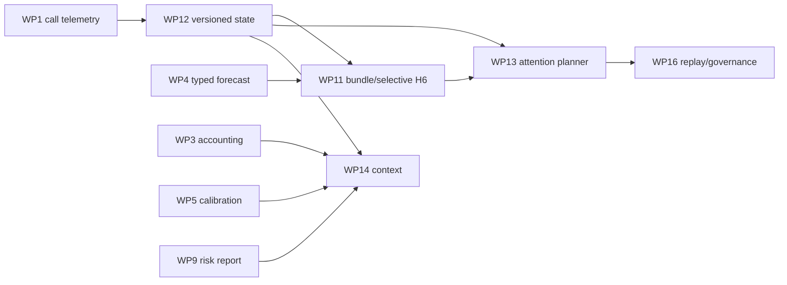

# Olympus Pipeline Phase 3: Research Attention Implementation Plan

> **Status:** Draft for implementation review
> **Canonical findings:** [Olympus pipeline review](../../reviews/2026-08-06-olympus-pipeline-review.md), `OLY-REV-001`, `OLY-REV-002`, `OLY-REV-003`, `OLY-REV-010`, `OLY-REV-011`
> **Execution:** One issue and one `task/<N>-<slug>` branch per task. Use red-green-refactor. Allocate migration numbers only after syncing the implementation branch.

## Goal

Reduce provider cost without narrowing discovery or weakening auditability:

1. replace prose-as-memory with versioned evidence, belief, event, and patch state;
2. make H5 produce one immutable evidence bundle per ticker;
3. run H6 only where challenge can matter and permit only a specific missing-fact amendment;
4. decide `carry | metric_patch | section_patch | challenge | deep_refresh` before provider work;
5. compile bounded role-specific context from exact pinned versions; and
6. measure avoided/retained calls, tokens, searches, and downstream signal effects before enforcement.

Phase 3 keeps the existing Atlas A0-A4 -> Hermes H1-H9 graph. The planner is a deterministic helper
inside existing boundaries, not a graph node, service, scheduler, or provider.

## Issue Contract

Every task issue must state: defect, purpose, intent, producer, consumer, strict output, system
contribution, typed failure state, first failing test, focused command, acceptance metric,
rollback/deletion condition, and anti-goals. Every new state field or table needs a named consumer and
a measurable contribution to research, portfolio decisions, risk, accounting, learning, or cost.

## Dependencies and Order



Implement WP12 first, then WP11, WP13, and WP14. WP11 code may be prototyped after WP1/WP4, but it
cannot close until its bundle/amendment lineage survives WP12 persistence and exact-version reload.
WP14 H7 context cannot enforce until WP3, WP5, and WP9 expose their versioned inputs.

## Authority and Topology Invariants

1. Keep one canonical graph and exact H1-H9 order.
2. The Atlas planner runs inside existing triage/pre-provider code.
3. The Hermes planner runs at the end of H4, after its roster is fixed.
4. H4 remains sole owner of regime, roster width, cap enforcement, priority order, and exploration
   reservation.
5. The planner cannot add/reorder a ticker, expand the cap, or consume the exploration floor.
6. H5 owns the immutable base ticker bundle and forecast.
7. H6 consumes the bundle and may append one policy-bounded missing-fact amendment; it never mutates
   the base or runs generic grounding.
8. Every selected, successful H6 deliberation executes at least two rounds. Early exit requires typed
   provider/infrastructure failure.
9. Preserve H5/H6 blinding: no `query_portfolio`; H5 document-key restrictions remain; hidden
   materiality features never enter prompts.
10. H7/H8/H9 authority is unchanged.
11. `documents` and prose briefs are deterministic views, never authoritative state.
12. Legacy prose is not parsed into atomic claims, confidence, event times, or known times.
13. Use the existing digiquant package and `core` Supabase project. No second service/database.
14. No external dependency or live-trading change.

## Version and Temporal Contract

Each structured record has `event_time`, `known_at`, `effective_as_of`, `recorded_at`,
`schema_version`, immutable content hash, source run/attempt/artifact IDs, and supersession lineage.
A `ResearchStateVersion` has a content-addressed `state_version_id`, optional parent, and an exact
manifest of included entity IDs.

As-of selection is allowed only before pinning:

```text
effective_as_of <= requested_as_of
known_at <= knowledge_cutoff_at
```

After preflight pins `state_version_id`, every role, dispatcher, compiler, writer, and replay reads
that exact version or an explicitly named same-run child. No unversioned latest read is permitted.
Legacy rows without trustworthy known time become `legacy_manifest_only` and are excluded from strict
replay.

## Planner Modes

| Mode | Provider behavior | Compatibility |
|---|---|---|
| `carry` | zero calls/searches | current `skip` |
| `metric_patch` | deterministic structured update, zero calls | `skip` plus patch |
| `section_patch` | one bounded patch path | current `edit` |
| `challenge` | bounded H6 path after H5 | current `edit` |
| `deep_refresh` | bounded acquisition and full synthesis | current `full` |

Every decision records reason codes, expected value features, source versions, estimated call/search/
uncached-token budget, exploration status, and eventual actual invocation links.

## Work Package 12: Versioned Evidence, Belief, and Event Store

### Task 12.1: Define frozen research-state contracts

- **Defect:** Current prose cannot provide queryable claim/event/supersession or exact as-of state.
- **Purpose:** Establish strict structured entities and manifests before persistence.
- **Intent:** Make prose a view; do not infer structured truth from old prose.
- **Producer -> consumer:** ingest/metrics/H5/event resolution -> store/planner/bundles/context/replay.
- **Output/contribution:** `EvidenceRecord`, `BeliefVersion`, `ExpectedEventVersion`, `ResearchPatch`,
  `ResearchStateManifest`, `ResearchStateVersion`, `ResearchStatePin`, `LegacyDocumentRef`; improves
  research memory and replay.
- **Files:** create `research_retrieval/models.py` and
  `tests/dq/olympus/test_research_state_models.py`; modify `research_retrieval/__init__.py`.
- **Red:** frozen/extra-forbidden, UTC temporal order, typed provenance, immutable tuples, canonical
  IDs independent of input ordering, parent/supersession validation.
- **Focused check:** `pytest tests/dq/olympus/test_research_state_models.py -m unit -q`.
- **Metric:** every entity is reconstructable from typed source/version IDs.
- **Failure/rollback:** models can remain unused until schema lands.
- **Anti-goals:** raw dict boundaries, prose parsing, mutable current-state records.
- **Commit:** `feat(olympus): define immutable research state`

### Task 12.2: Add private append-only research-state schema/store

- **Defect:** There is no durable exact-version source for structured research state.
- **Purpose:** Persist entities, manifestations, run pins, and supersession in `core` Supabase.
- **Intent:** Add one store boundary, not a second database/service.
- **Producer -> consumer:** structured writers -> `ResearchStateStore` -> preflight/planner/context/replay.
- **Output/contribution:** `<NNN>_olympus_research_state.sql`, store API, private tables; improves
  research/audit.
- **Files:** create migration/test, `research_retrieval/store.py`, and
  `tests/dq/olympus/test_research_state_store.py`; update schema/architecture docs.
- **Red:** RLS/revoked public grants/update-delete rejection; content idempotency; changed content
  appends; `select_state_as_of`, `pin_state_for_run`, exact `load_state_version`, child-parent checks;
  strict reads exclude future-known and legacy-null-known rows.
- **Metric:** exact-version round trip returns byte-equivalent typed state after newer rows exist.
- **Failure/rollback:** schema dark launch; disable writers, never delete evidence.
- **Anti-goals:** upsert-update, public base view, `load_latest` after pin.
- **Commit:** `feat(olympus): persist append-only research state`

### Task 12.3: Pin one state version in preflight and replay/resume

- **Defect:** A run can otherwise mix state versions as ingestion continues.
- **Purpose:** Select once and carry an exact research-state pin through Atlas/Hermes.
- **Intent:** Make current and replayed runs reproducible without changing graph topology.
- **Producer -> consumer:** existing Atlas preflight -> Atlas/Hermes state/CLI/checkpoint -> all roles.
- **Output/contribution:** `research_state_pin`; improves research and decision reproducibility.
- **Files:** modify Atlas state/preflight/graph, `hermes/chain.py`, `tests/dq/atlas/test_preflight.py`,
  and `tests/dq/hermes/test_chain_cli.py`.
- **Red:** optional explicit version; otherwise one cutoff-bound pin; resume reuses run/attempt pin;
  same-run child names parent; no later latest read.
- **Metric:** a simulated invocation exposes one root state version and explicit child lineage only.
- **Failure/rollback:** typed `state_unavailable`; compatibility document path remains only in shadow
  rollout until exact-state coverage passes.
- **Anti-goals:** per-role selection, current-time fallback, graph node.
- **Commit:** `feat(olympus): pin research state during preflight`

### Task 12.4: Backfill only non-fabricating legacy manifests

- **Defect:** Legacy documents need inventory continuity but cannot support atomic historical claims.
- **Purpose:** Reference old payloads without inventing evidence or known time.
- **Intent:** Support audit/degraded compatibility, never strict replay/training.
- **Producer -> consumer:** existing documents/snapshots -> legacy manifest rows -> operators only.
- **Output/contribution:** dry-run/apply backfill with `legacy_manifest_only`; improves migration audit.
- **Files:** create `scripts/atlas/backfill_research_state.py` and test; update runbook.
- **Red:** default dry-run; `--apply`; hashes source refs; writes zero evidence/belief/event rows;
  `known_at=None`; idempotent counts; strict readers exclude output.
- **Metric:** source/inserted/skipped/unverifiable counts reconcile exactly.
- **Failure/rollback:** stop writes; rows remain clearly degraded.
- **Anti-goals:** LLM extraction, migration-time known dates, deleting legacy documents.
- **Commit:** `feat(olympus): inventory legacy research manifests`

### Task 12.5: Compile reproducible prose views from exact state

- **Defect:** If documents remain independent writers, structured state is not authoritative.
- **Purpose:** Generate human-readable briefs/digests deterministically from one pinned version.
- **Intent:** Preserve useful prose presentation without reverse parsing.
- **Producer -> consumer:** exact state version -> compiler -> publish/operator/context view.
- **Output/contribution:** `research_retrieval/views.py` compiled brief/digest; improves audit/context.
- **Files:** create module/test; modify Atlas publish phase only after structured persistence.
- **Red:** same version compiles byte-identically after newer rows; sorted entities; IDs/hash/schema
  embedded; structured write failure prevents misleading view publication.
- **Metric:** every compiled view states and hashes its exact state version.
- **Failure/rollback:** retain incumbent documents during dual-write; remove independent prose writer
  after parity/retention gate.
- **Anti-goals:** prose-to-state parsing, hidden latest reads.
- **Commit:** `feat(olympus): compile briefs from pinned state`

## Work Package 11: Shared Ticker Evidence and Selective H6

### Task 11.1: Define/persist immutable bundles and amendments

- **Defect:** H5/H6 can acquire duplicated evidence without one durable exchange contract.
- **Purpose:** Add one base bundle and append-only amendment vocabulary.
- **Intent:** H5 owns base acquisition; H6 can only supplement a named missing fact.
- **Producer -> consumer:** H5/H6 -> store -> forecast/H7/outcomes/replay.
- **Output/contribution:** `TickerEvidenceBundle`, `MissingFactRequest`,
  `EvidenceBundleAmendment`, `<NNN>_olympus_evidence_bundles.sql`; improves research efficiency.
- **Files:** extend research models/store/tests; create migration/test.
- **Red:** immutable base; amendment references one base/request; ticker/run/state/evidence/known-time/
  source/hash lineage; public grants denied; exact retry idempotent.
- **Metric:** at most one base bundle per run/ticker/content and zero unlinked amendments.
- **Failure/rollback:** keep in-memory typed bundle in shadow, but WP11 cannot close until durable.
- **Anti-goals:** base mutation, generic blob, public view.
- **Commit:** `feat(olympus): add ticker evidence contracts`

### Task 11.2: Build and publish one H5 evidence bundle

- **Defect:** Evidence can be acquired repeatedly per role and lost when H5 fails.
- **Purpose:** Canonicalize/persist H5 evidence before synthesis.
- **Intent:** One acquisition pass per ticker; no forecast behavior change beyond citing sources.
- **Producer -> consumer:** pinned state/market/grounding/tool results -> bundle -> H5/H6.
- **Output/contribution:** `research_retrieval/evidence_bundle.py` and state ticker map; improves cost and
  audit.
- **Files:** create module/test; modify store, `hermes/phases/portfolio_common.py`,
  `h5_asset_analyst.py`, typed state, and existing H5 tests.
- **Red:** canonical dedupe; event/known/source times; conflicts/missing fields; persist before provider;
  H5 forecast cites bundle/evidence IDs; H5 failure leaves bundle.
- **Metric:** exactly one persisted base bundle for every H5-attempted ticker.
- **Failure/rollback:** disable durable writer, retain typed in-run bundle; no H6 cutover until durable.
- **Anti-goals:** H6 base writer, portfolio context leakage, per-agent acquisition.
- **Commit:** `feat(olympus): publish H5 evidence bundles`

### Task 11.3: Select H6 from structured decision-value features

- **Defect:** Broad/unconditional debate spends calls even when it cannot change a decision.
- **Purpose:** Challenge only decision-boundary, conflict, uncertainty, invalidation-risk, material, or
  exploration cases.
- **Intent:** Reduce redundant calls while preserving discovery and two-round adversarial review.
- **Producer -> consumer:** deterministic selection helper after H5 -> existing H6 fan-out.
- **Output/contribution:** typed `H6Selection` reasons/features/budget; improves efficiency/research.
- **Files:** create/extend `research_retrieval/planner.py` and attention tests; modify
  `h6_deliberation.py`, `test_deliberation_skip.py`, `test_deliberation_convergence.py`.
- **Red:** each required condition selects; low-value case carries with zero provider call; selected
  success completes at least two rounds; provider failure exits early with typed provenance;
  materiality never enters prompt.
- **Metric:** every H6 run/carry has one reason and selected success meets round floor.
- **Failure/rollback:** run incumbent selection in `shadow`; fallback is full incumbent H6, not an
  unrecorded skip.
- **Anti-goals:** replacing H4 roster/exploration, one-round success, LLM selection.
- **Commit:** `feat(olympus): select H6 challenges deterministically`

### Task 11.4: Constrain H6 search to one missing-fact amendment

- **Defect:** H6 can perform broad extra grounding that duplicates H5 and obscures marginal value.
- **Purpose:** Permit a bounded, auditable supplement only when H6 names the exact missing fact.
- **Intent:** Preserve challenge quality while measuring incremental evidence.
- **Producer -> consumer:** validated `MissingFactRequest` -> retrieval -> append-only amendment -> H6.
- **Output/contribution:** amendment plus failure/carry provenance; improves research/cost evidence.
- **Files:** modify store, `models/deliberation.py`, `h6_deliberation.py`, Atlas Supabase projection,
  and focused H6/Supabase tests.
- **Red:** one claim ID/question/source kind/reason; at most policy allowance; base hash unchanged;
  invalid/exhausted/failed request never falls back to broad search; slim summary preserves reason.
- **Metric:** generic H6 searches equal zero and every supplement links request -> evidence -> amendment.
- **Failure/rollback:** record failed amendment and continue with base bundle.
- **Anti-goals:** base replacement, unbounded search, silent fallback.
- **Commit:** `feat(olympus): constrain H6 evidence amendments`

### Task 11.5: Prove durable H5/H6 lineage round trip

- **Defect:** An in-memory-only implementation could falsely satisfy local phase tests.
- **Purpose:** Close WP11 against WP12 persistence/reload.
- **Intent:** Verify actual graph state/checkpoint durability.
- **Producer -> consumer:** simulated Atlas/Hermes invocation -> store/reload -> release gate.
- **Output/contribution:** durable acceptance test; improves system reliability.
- **Files:** modify `tests/dq/atlas/test_pipeline_simulation.py`, Atlas simulator, and architecture docs.
- **Red:** one base per ticker; amendments only H6; exact pin; no mutation/generic search; two rounds;
  carry/failure provenance after serialize/reload.
- **Metric:** byte-equivalent lineage after exact-version reload.
- **Failure/rollback:** WP11 remains incomplete.
- **Anti-goals:** mocks that skip persistence/checkpoint boundaries.
- **Commit:** `test(olympus): lock durable H5 H6 lineage`

## Work Package 13: Pre-LLM Attention and Update Planner

### Task 13.1: Define versioned planner policy and deterministic routing

- **Defect:** `skip | edit | full` is decided too late to prevent grounding/provider spend and lacks
  budget/value evidence.
- **Purpose:** Route all research work before provider invocation.
- **Intent:** Preserve existing compatibility modes and discovery floor while introducing measurable
  structured decisions.
- **Producer -> consumer:** pinned state/events/forecast uncertainty/H4 roster/materiality -> Atlas,
  H5, H6 workers.
- **Output/contribution:** `AttentionFeatures`, `AttentionDecision`, `AttentionPlan`, budget and
  versioned policy; improves efficiency.
- **Files:** create `config/olympus_research_policy.yaml`; extend research models/planner/tests.
- **Red:** deterministic tie-break; five modes; stable reasons; `off|shadow|enforce`; call/search/
  uncached-token estimates; exploration reservation survives all budgets; policy content hash.
- **Metric:** identical state/policy yields identical plan and estimated resource totals.
- **Failure/rollback:** `shadow` records decision while incumbent runs; `off` is immediate rollback.
- **Anti-goals:** source-code economic thresholds, graph node, LLM planner.
- **Commit:** `feat(olympus): define research attention policy`

### Task 13.2: Persist plans, decisions, contexts, and evaluations

- **Defect:** A defer/run decision cannot be evaluated later without exact feature/call linkage.
- **Purpose:** Store routing evidence and actual outcomes append-only.
- **Intent:** Support WP16 replay/promotion; no runtime activation in storage.
- **Producer -> consumer:** planner/context compiler/evaluator -> private store -> diagnostics/replay.
- **Output/contribution:** `<NNN>_olympus_attention_context.sql`; improves learning/efficiency.
- **Files:** migration/test; extend research store.
- **Red:** private append-only tables for plans/decisions/context manifests/policy evaluations;
  run/attempt/policy/state/reason/features/budget/provider-attempt linkage; exact as-of reads.
- **Metric:** every shadow/enforced decision can reconcile to planned and actual resources.
- **Failure/rollback:** disable writes and enforcement; incomplete telemetry fails evaluation.
- **Anti-goals:** policy mutation, public tables, aggregate-only usage linkage.
- **Commit:** `feat(olympus): persist attention decisions`

### Task 13.3: Route Atlas before grounding/provider work

- **Defect:** Current update decisions can occur after cost has already been incurred.
- **Purpose:** Make `carry`/`metric_patch` genuine zero-provider paths.
- **Intent:** Invoke the planner inside existing triage and branch early in provider-owning nodes.
- **Producer -> consumer:** Atlas triage helper -> `_node_factory`/synthesis nodes.
- **Output/contribution:** per-artifact decisions and actual links; improves efficiency.
- **Files:** modify Atlas state, `triage_phase.py`, `_node_factory.py`, `phase7_synthesis.py`; create
  `tests/dq/atlas/test_attention_planner_wiring.py`.
- **Red:** plan exists before `build_grounding`; carry/metric patch make zero calls; shadow preserves
  incumbent; patch recompiles structured view; reasons persist.
- **Metric:** enforced zero-call modes have exactly zero WP1 physical attempts.
- **Failure/rollback:** set mode `shadow`/`off`; incumbent path remains.
- **Anti-goals:** planner node, provider call to decide, prose patch as authority.
- **Commit:** `feat(olympus): route Atlas before provider calls`

### Task 13.4: Plan Hermes after H4 without changing its roster

- **Defect:** H5/H6 fan-out lacks a pre-provider budget but H4 discovery output must remain sovereign.
- **Purpose:** Allocate work over the already-fixed roster.
- **Intent:** Add helper invocation at H4 end, not a graph phase.
- **Producer -> consumer:** H4 output plus pinned features -> H5/H6 zero/full/challenge paths.
- **Output/contribution:** post-H4 attention plan; improves research efficiency.
- **Files:** modify `h4_opportunity_screener.py`, `h5_asset_analyst.py`, `h6_deliberation.py`,
  `test_h4_focus_roster.py`, and existing graph/phase tests.
- **Red:** planner cannot add/remove/reorder/expand roster or consume exploration; conditional H6 resolves
  after H5 features; graph node list/order unchanged.
- **Metric:** H4 roster and exclusions are byte-identical with planner off/shadow/enforce.
- **Failure/rollback:** shadow/off restores incumbent calls; H4 output remains untouched.
- **Anti-goals:** planner-owned roster, separate graph, hidden exploration reduction.
- **Commit:** `feat(olympus): plan attention after H4`

### Task 13.5: Reconcile budgets and evaluate shadow decisions

- **Defect:** Aggregate token floors cannot show which avoided call would have mattered.
- **Purpose:** Join proposed decisions to exact WP1 attempts and downstream artifacts.
- **Intent:** Make cost reduction falsifiable before enforcement.
- **Producer -> consumer:** plans + WP1 telemetry + forecasts/H7 outcomes -> evaluator -> WP16/humans.
- **Output/contribution:** shadow evaluation report; improves efficiency/learning.
- **Files:** create `scripts/atlas/evaluate_research_policy_shadow.py` and test; modify Atlas telemetry,
  diagnostics, and runbook only as required.
- **Red:** exact reconciliation required by run/node/ticker/artifact; calls/searches/cached/uncached
  tokens/cost/latency/carries/amendments/forecast/H7/exploration; missing telemetry fails evaluation.
- **Metric:** 100% decision-attempt reconciliation over eligible shadow runs.
- **Failure/rollback:** no enforcement/promotion; retain reports.
- **Anti-goals:** treating `digigraph/usage.py` aggregate as exact, anecdotal promotion.
- **Commit:** `feat(olympus): evaluate attention policy in shadow`

## Work Package 14: Role-Specific Context Compiler

### Task 14.1: Define deterministic capsules and manifests

- **Defect:** Ad hoc broad prompt payloads waste tokens and obscure included state.
- **Purpose:** Compile bounded role inputs from one exact state version.
- **Intent:** Make context reproducible and inspectable; raw transcripts remain drill-down only.
- **Producer -> consumer:** pinned structured state/current artifacts/role policy -> H5/H6/H7/telemetry.
- **Output/contribution:** `ContextCapsule`, `ContextItem`, `ContextManifest`, role allowlists; improves
  research efficiency/audit.
- **Files:** create `research_retrieval/context.py` and test; extend research models.
- **Red:** deterministic sort/hash; byte/token budget; exact included IDs; every omission reason;
  strict role allowlist; no unpinned item.
- **Metric:** same version/policy compiles byte-identical capsule and manifest.
- **Failure/rollback:** compile in shadow beside incumbent context; no provider cutover until parity.
- **Anti-goals:** prompt prose as source, hidden truncation, cross-role leakage.
- **Commit:** `feat(olympus): compile versioned role contexts`

### Task 14.2: Wire blinded H5/H6 capsules

- **Defect:** H5/H6 context assembly can duplicate unchanged history or leak disallowed state.
- **Purpose:** Give each role only changed/local evidence and its allowed deliberation data.
- **Intent:** Reduce tokens while preserving retrieval blinding and decision independence.
- **Producer -> consumer:** context compiler -> existing H5/H6 provider calls.
- **Output/contribution:** role-specific manifests; improves research quality/efficiency.
- **Files:** modify `portfolio_common.py`, `h6_deliberation.py`,
  `research_retrieval/blinding.py`, `test_context_compiler.py`, and
  `tests/dq/olympus/test_research_retrieval.py`.
- **Red:** reject portfolio/PM/other-ticker/unpinned content; no `query_portfolio`; H5 changed evidence,
  beliefs/events/invalidations/bundle; H6 bundle/amendment/H5/transcript only; materiality absent.
- **Metric:** zero blinding violations and complete manifest-to-WP1 prompt linkage.
- **Failure/rollback:** send incumbent context in shadow; retain generated manifest for comparison.
- **Anti-goals:** weakening existing blocked-document rules or dumping all history.
- **Commit:** `feat(olympus): compile blinded H5 H6 contexts`

### Task 14.3: Wire H7 decision capsule after prerequisite gates

- **Defect:** H7 currently sees thin aggregate performance rather than versioned forecast/contribution/
  cost/risk feedback.
- **Purpose:** Provide enough typed evidence for authorization while preserving its authority limits.
- **Intent:** Improve decision context, not let H7 recompute accounting/risk or set weights.
- **Producer -> consumer:** WP3/WP5/WP9/WP12 plus H5/H6 -> compiler -> H7.
- **Output/contribution:** H7 capsule with exact source IDs; improves portfolio decisions.
- **Files:** modify `h7_pm_direction.py`, Atlas preflight/state, and create
  `tests/dq/hermes/test_h7_context_compiler.py`.
- **Red:** mandate, calibration, contribution/cost, pre-trade risk, prior authorization reasons,
  unresolved/matured forecast sections; exact IDs; shadow degraded inputs; enforce refuses
  unversioned dependency; no target weights.
- **Metric:** all H7 context sections are typed/versioned or explicitly unavailable.
- **Failure/rollback:** revert role to incumbent context via policy mode; H7 output schema unchanged.
- **Anti-goals:** H7 numerical forecast mutation, target allocation, legacy synthetic attribution.
- **Commit:** `feat(olympus): compile H7 decision context`

### Task 14.4: Pin drill-down tools and prompt-token manifests

- **Defect:** Tool expansion could bypass the state pin or vanish from call economics.
- **Purpose:** Bind every role dispatcher and provider call to an exact context manifest.
- **Intent:** Preserve bounded drill-down with full telemetry.
- **Producer -> consumer:** compiler/role dispatcher -> tools/provider telemetry/policy evaluator.
- **Output/contribution:** pinned retrieval and pre-call manifest; improves audit/efficiency.
- **Files:** modify `research_retrieval/queries.py`, `retriever.py`, `tools.py`, store, and
  `test_research_retrieval.py`.
- **Red:** dispatcher rejects no pin/latest; document access resolves through manifest; pre-call
  manifest persisted; estimated tokens linked to actual WP1 prompt/cache tokens without mutation.
- **Metric:** every H5/H6/H7 provider attempt resolves to one context manifest and state version.
- **Failure/rollback:** role falls back only in shadow/off with visible reason.
- **Anti-goals:** latest-date dispatcher, manifest update after call, raw transcript persistence.
- **Commit:** `feat(olympus): pin role retrieval manifests`

## Rollout and Promotion Evidence

1. **Schema dark:** apply private migrations, planner `off`, backfill dry-run.
2. **Dual write:** state, pins, bundles, manifests; incumbent documents/context remain consumers.
3. **Shadow:** compute plans/capsules, execute incumbent calls/context, reconcile exact counterfactual
   resources and downstream changes.
4. **Enforce canary:** requires versioned human-approved thresholds and WP16 replay evidence; rollback
   is policy mode `shadow`, never row deletion.

Structural gates:

- all provider attempts reconcile to WP1;
- zero H4 roster/exploration changes;
- zero generic H6 search;
- selected successful H6 always has at least two rounds;
- zero H5/H6 blinding violation;
- all forecast/bundle/amendment/plan/context/call artifacts have exact IDs;
- missing telemetry or a would-defer item that materially changes forecast/H7 blocks promotion;
- cost/token improvements and forecast non-inferiority use human-authored versioned criteria;
- portfolio quality requires WP16 identical-input Nautilus replay and human review.

## Integration Task 3.1: Lock one-graph research contracts

- **Defect:** Storage, routing, bundles, and contexts could work alone but violate topology/provenance
  when composed.
- **Purpose:** Prove Phase 3 in shadow and enforce modes with one exact pinned state.
- **Intent:** Close WP11-WP14 without production self-promotion.
- **Producer -> consumer:** full simulator -> durable artifacts/evaluation -> WP15/WP16.
- **Output/contribution:** integration tests and architecture docs; improves whole-system efficiency.
- **Files:** modify `test_pipeline_simulation.py`, existing Hermes graph tests, Atlas graph compile tests,
  and Atlas/Hermes architecture docs.
- **Assertions:** exact A0-A4/H1-H9 topology; no planner node/service; H4 width/order/exploration
  unchanged; immutable bundles/amendments; no broad H6 search; round floor; carry/failure provenance;
  blinded deterministic contexts; byte-identical exact-version replay; exact telemetry reconciliation.
- **Metric:** all assertions pass over persisted serialize/reload fixture.
- **Failure/rollback:** remain shadow/off.
- **Anti-goals:** runtime policy promotion, second graph, live trading.
- **Commit:** `test(olympus): lock Phase 3 research contracts`

## Verification

```bash
.venv/bin/python -m pytest -m unit \
  tests/dq/olympus/test_research_state_models.py \
  tests/dq/olympus/test_research_state_store.py \
  tests/dq/olympus/test_evidence_bundle.py \
  tests/dq/olympus/test_attention_planner.py \
  tests/dq/olympus/test_context_compiler.py \
  tests/dq/olympus/test_research_retrieval.py \
  tests/dq/atlas/test_attention_planner_wiring.py \
  tests/dq/atlas/test_pipeline_simulation.py \
  tests/dq/hermes/test_h4_focus_roster.py \
  tests/dq/hermes/test_deliberation_skip.py \
  tests/dq/hermes/test_deliberation_convergence.py \
  tests/dq/hermes/test_h7_context_compiler.py -q --tb=short
.venv/bin/ruff check digiquant/src/digiquant/olympus tests/dq/olympus tests/dq/atlas tests/dq/hermes
.venv/bin/ruff format --check digiquant/src/digiquant/olympus tests/dq/olympus tests/dq/atlas tests/dq/hermes
make test-baseline
make doc-check
git diff --check
```

Before every issue PR, update architecture/runbook documentation in the same task, stage only the
issue scope, run `make score`, and obtain the repository-required independent review.
