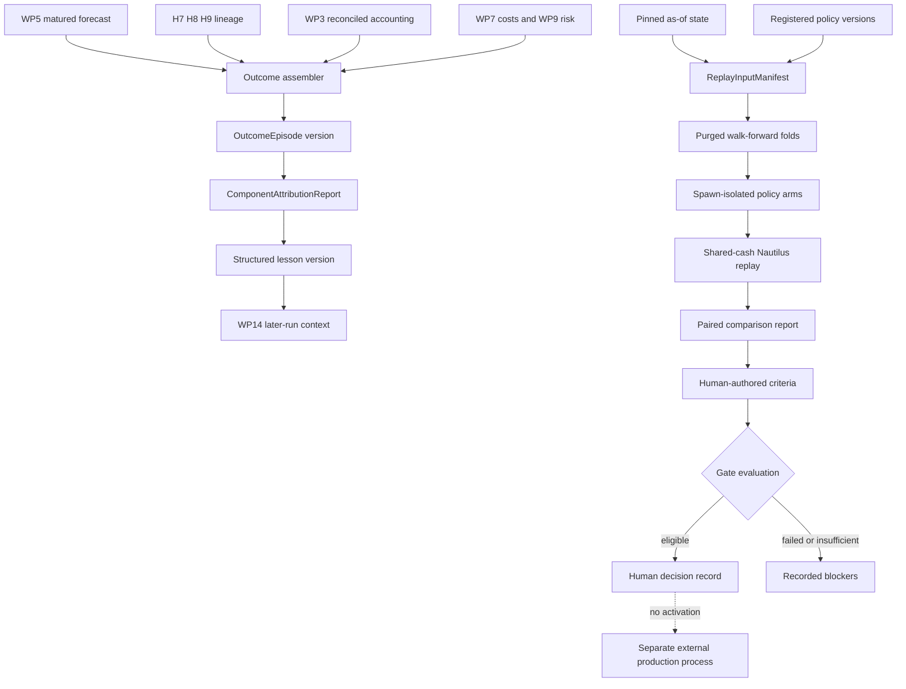

# Olympus Pipeline Phase 4: Learning and Replay Implementation Plan

> **Status:** Draft for implementation review
> **Canonical findings:** [Olympus pipeline review](../../reviews/2026-08-06-olympus-pipeline-review.md), especially `OLY-REV-009`, `OLY-REV-010`, `OLY-REV-011`; WP16 covers all findings
> **Execution:** One issue and one `task/<N>-<slug>` branch per task. Use red-green-refactor. Allocate migration numbers only after syncing the implementation branch.

## Goal

Close a governed, offline learning loop without online policy mutation:

1. assemble one immutable `OutcomeEpisode` for every matured typed forecast;
2. distinguish forecast, sizing, timing, execution, and residual evidence honestly;
3. compile versioned structured lessons that later runs can consume at an exact cutoff;
4. replay registered incumbent and challenger research/portfolio policies over identical as-of state;
5. run portfolio arms through the Phase 2 one-account multi-instrument Nautilus adapter;
6. compare resource, signal, execution, portfolio, and risk results with explicit missingness; and
7. evaluate immutable human-authored promotion/rollback criteria, record human decisions, but never
   activate a production policy.

## Issue Contract

Every task issue must state: defect, purpose, intent, producer, consumer, strict output, system
contribution, typed failure state, first failing test, focused command, acceptance metric,
rollback/deletion condition, and anti-goals. Every learning claim must identify whether it is observed,
modeled, counterfactual, descriptive, or unavailable.

## Hard Dependencies

| Package | Required contract |
|---|---|
| WP15 outcome episodes | WP3 accounting, WP5 forecast outcomes, WP7 costs, WP9 risk, WP14 contexts |
| WP16 research replay | WP13 policy versions/telemetry and WP15 outcomes |
| WP16 portfolio replay | WP10 policy/artifact versions, shared Nautilus adapter, WP15 outcomes |
| Promotion/rollback evidence | Accounting, signal, shadow, and human governance gates |

Before Phase 4 coding, create `tests/dq/learning/test_phase4_prerequisite_contracts.py` against the
actual merged public contracts. It must prove stable IDs, immutable versions, typed readers,
timezone-aware event/effective/known times, and exact-version selection. If it cannot, repair the
prerequisite package instead of adding a compatibility shim.

Migrations use `<NNN>` placeholders. Allocate the next unused number only after the task branch is
synced; no number after current migration `065_atlas_run_diagnostics_attempt.sql` is reserved here.

## Current-Truth Boundaries

| Existing surface | Phase 4 treatment |
|---|---|
| `olympus/learning/beliefs_distillation.py` | Rendered/legacy prose only, never authoritative lesson state |
| `olympus/atlas/decision_log.py` | Legacy H5 reflection only, not an episode source |
| `olympus/atlas/backtest.py` | Decision compounding is not portfolio replay or promotion evidence |
| `nautilus_runner._run_multi_symbol_backtest` | Independent-engine averaging is prohibited |
| `olympus/atlas/attribution.py` | Current-book lookback is descriptive only, never realized contribution |
| Phase 0 accounting | Sole realized NAV/contribution source |
| Phase 0 action/fill ledger | Sole decision/execution lineage source |
| Phase 2 `olympus/replay` adapter | Sole one-account portfolio replay implementation |
| Existing `BacktestResult` models | Remain unchanged |

A database link proves lineage, not causal contribution. Missing counterfactual evidence is
`unavailable`, never zero.

## Temporal Contract

Every source and Phase 4 artifact distinguishes:

- `effective_at`: economic event time;
- `known_at`: first availability to Olympus;
- `recorded_at`: immutable persistence time;
- `horizon_end`: forecast economic maturity;
- `available_at`: maximum of horizon end and all required source known times; and
- `replay_as_of`: the historical information cutoff.

Rules:

1. All timestamps are timezone-aware UTC.
2. An episode/lesson is visible only when `available_at <= as_of`.
3. Every source query filters `known_at <= as_of`.
4. No unversioned latest read occurs after input state is pinned.
5. Late corrections append a superseding version; historical versions remain selectable.
6. Same source versions produce the same content hash.
7. A run cannot consume a lesson derived from its own future outcome.
8. Replay uses the version visible at its historical cutoff, not today's newest version.
9. Executable bars occur strictly after the decision cutoff under a versioned fill policy.
10. Walk-forward labels that overlap evaluation are purged, and adjacent observations respect a
    versioned embargo.

## Architecture



## Core Contracts

All models use Pydantic v2, `ConfigDict(extra="forbid", frozen=True)`, immutable collections, Decimal
for financial values, Polars for aggregate computation, normalized JSON, and SHA-256.

### OutcomeEpisode

Required fields:

- stable logical key, immutable version, schema version, content hash, supersession;
- forecast/outcome/mandate/instrument/horizon/source-run IDs;
- evidence/state/context/policy version IDs;
- H7 disposition including excluded, rejected, no-op, and authorized;
- requested/approved H8 targets and reason-coded adjustments;
- H9 action/order/fill/holding links when applicable;
- Phase 0 accounting contribution/reconciliation interval and IDs;
- expected/realized cost IDs and pre-trade risk report ID;
- realized instrument, benchmark, and active return from authoritative sources;
- temporal fields, per-component eligibility, and typed quality issues.

Every matured forecast gets an episode. Missing downstream action/fill is explained by a disposition,
not silently omitted.

### ComponentAttributionReport

Each observation includes component (`forecast`, `sizing`, `timing`, `execution`, `residual`), metric,
value/unit/uncertainty, baseline and interval, artifact IDs, evidence quality, and method:
`observed | model_estimate | counterfactual_replay | unavailable`.

- Forecast error compares the typed forecast and matured outcome over the identical horizon.
- Execution error compares expected cost/reference with authoritative fills/costs.
- Timing latency/price drift may be observed diagnostics.
- Timing P&L is causal only with a paired timing counterfactual.
- Sizing P&L is causal only with paired sizing-policy replay.
- One-at-a-time counterfactual deltas are not summed.
- Any additive waterfall declares order, baseline, and residual.

### OutcomeLessonVersion

A lesson contains its compilation policy/version/cutoff, episode/report IDs, cohort/regime/horizon/
component, sample and effective sample counts, estimate/uncertainty/prior/shrinkage, quality state,
structured recommendation/warning code, availability, and supersession. Rendered summaries are views.

### Replay and Governance

`PolicyVersionRef`, `PolicyBundle`, `ReplayInputManifest`, `ReplayArmSpec`, `ReplayPairSpec`,
`WalkForwardFold`, `PortfolioReplayResult`, `PolicyComparisonReport`, `GateCriteriaVersion`,
`GateEvaluation`, and `PolicyGovernanceDecision` separate shared inputs from arm-specific policies.
Paired arms must share the same manifest hash. Arbitrary imports, pickle, and Python `hash()` are
prohibited.

## Work Package 15: Outcome Episodes and Component Attribution

### Task 15.1: Define strict outcome-learning models

- **Defect:** No typed object connects forecast through decision, execution, realized outcome, and
  learning eligibility.
- **Purpose:** Freeze episode, attribution, lesson, quality, and version contracts.
- **Intent:** Represent every disposition and missing source honestly; no persistence yet.
- **Producer -> consumer:** later assemblers -> store/compiler/replay/context.
- **Output/contribution:** `learning/outcome_models.py`; improves learning/audit.
- **Files:** create module and `tests/dq/learning/test_outcome_models.py`.
- **Red:** naive/invalid temporal fields; missing core refs; excluded/no-op without fabricated target/
  fill allowed; unavailable needs reason; causal sizing/timing needs replay artifact; frozen/strict.
- **Focused check:** `pytest tests/dq/learning/test_outcome_models.py -m unit -q`.
- **Metric:** all canonical episode dispositions and attribution methods validate without raw dicts.
- **Failure/rollback:** models remain unused until store/assembly lands.
- **Anti-goals:** causal claims from links, mutable lessons, prose authority.
- **Commit:** `feat(olympus): define outcome learning contracts`

### Task 15.2: Add private append-only outcome-learning persistence

- **Defect:** Episode/lesson corrections need immutable as-of history, not updated rows.
- **Purpose:** Persist versions, links, component reports, and lesson membership.
- **Intent:** Keep base tables private and deduplicate identical content only.
- **Producer -> consumer:** learning store -> assembler/compiler/replay/context.
- **Output/contribution:** `<NNN>_olympus_outcome_learning.sql`, `learning/outcome_store.py`; improves
  learning reproducibility.
- **Files:** create migration/test, store/test; update `digiquant/supabase/SCHEMA.md`.
- **Red:** RLS/revoked grants/update-delete protection; identical insert same row; changed content
  new version; no update upsert; supersession; as-of-visible version; no historical fabrication.
- **Metric:** exact cutoff returns the version then visible after later correction exists.
- **Failure/rollback:** schema dark launch; disable writes, retain rows.
- **Anti-goals:** public view without named reader, mutable latest record, migration backfill.
- **Commit:** `feat(olympus): persist outcome learning versions`

### Task 15.3: Assemble episodes from authoritative ledgers

- **Defect:** Current sources cannot be joined safely through prose or current-book state.
- **Purpose:** Build one deterministic episode for every matured forecast.
- **Intent:** Consume typed reader protocols from prerequisite packages only.
- **Producer -> consumer:** forecast/action/accounting/cost/risk readers -> assembler -> episode store.
- **Output/contribution:** `learning/outcome_assembly.py`; improves learning/accounting linkage.
- **Files:** create module/test.
- **Red:** immature before horizon/data known; late-known exclusion; excluded episode; requested/capped/
  rejected/rounded/partial/no-op lineage; accounting/benchmark/cost/risk links; unreconciled accounting
  disables portfolio learning; optional gaps affect only relevant components; idempotent; correction
  supersedes; no source beyond cutoff.
- **Metric:** every eligible matured forecast has one visible episode or a typed assembly blocker.
- **Failure/rollback:** store assembly issue; never insert partial fabricated numbers.
- **Anti-goals:** direct legacy-table query, current-weight attribution, zero substitution.
- **Commit:** `feat(olympus): assemble authoritative outcome episodes`

### Task 15.4: Compute honest component attribution

- **Defect:** Forecast, sizing, timing, and execution errors can otherwise be mislabeled or added
  without valid counterfactuals.
- **Purpose:** Produce independent typed component observations.
- **Intent:** Separate causal, diagnostic, descriptive, estimated, and unavailable evidence.
- **Producer -> consumer:** episode plus optional replay evidence -> report store/lesson compiler.
- **Output/contribution:** `learning/component_attribution.py`; improves learning accuracy.
- **Files:** create module/test.
- **Red:** forecast error identical horizon; proper scores where defined; expected/realized execution
  cost; timing diagnostics non-causal; sizing unavailable without replay; valid paired delta; no sum of
  one-at-a-time deltas; ordered waterfall/residual; missing data unavailable; units/uncertainty.
- **Metric:** zero causal sizing/timing claims without a paired replay artifact and declared baseline.
- **Failure/rollback:** append unavailable report; episode remains intact.
- **Anti-goals:** forced additive attribution, contribution inferred from foreign keys.
- **Commit:** `feat(olympus): attribute outcome components honestly`

### Task 15.5: Compile immutable structured lesson versions

- **Defect:** Legacy reflection prose cannot be safely aggregated, versioned, or replayed.
- **Purpose:** Summarize eligible episodes by typed cohort/component with uncertainty and priors.
- **Intent:** Produce structured later-run context without an authoritative LLM call.
- **Producer -> consumer:** eligible episodes/reports -> lesson compiler/store -> WP14 contexts.
- **Output/contribution:** `learning/lesson_registry.py`; improves research/portfolio learning.
- **Files:** create module/test.
- **Red:** cutoff/eligibility; Polars aggregation; low-sample prior/shrinkage; deterministic hash; late
  episode new version; old queryable; prose cannot replace payload; consuming run excluded; all
  source IDs exposed.
- **Metric:** every lesson is reproducible from declared episode/report IDs and policy version.
- **Failure/rollback:** no lesson version on compiler failure; prior contexts continue.
- **Anti-goals:** online weight update, LLM-authored authoritative lesson, recent-P&L optimization.
- **Commit:** `feat(olympus): compile structured lesson versions`

### Task 15.6: Mature prior outcomes and pin lessons in existing preflight

- **Defect:** A later run cannot consume lessons safely unless maturation precedes context compilation
  under the same cutoff.
- **Purpose:** Wire outcome/lesson selection into the existing preflight boundary.
- **Intent:** Preserve graph topology; no new Atlas node.
- **Producer -> consumer:** existing preflight helper -> WP14 context manifest -> H5/H7.
- **Output/contribution:** exact lesson-version pin; improves closed-loop research decisions.
- **Files:** add a helper module under `atlas/phases/outcome_maturation.py` if it keeps preflight small;
  invoke it from existing preflight, update typed state/context, create integration test, update
  architecture.
- **Required order:** pin cutoff -> mature prior outcomes -> compile/pin lesson -> compile WP14 context
  -> research/decision.
- **Red:** available lesson included; later lesson excluded; newly matured prior-run outcome allowed;
  own future outcome impossible; H5/H7 manifests expose lesson ID; no decision-log source; exact
  replay selects same lesson; graph node list unchanged.
- **Metric:** every consuming context identifies one exact lesson version or typed none-available.
- **Failure/rollback:** context uses prior pinned lesson/degraded input; no graph mutation.
- **Anti-goals:** new graph node, current-run outcome feedback, legacy reflection authority.
- **Commit:** `feat(olympus): pin lessons during preflight`

## Work Package 16: Offline Policy Replay and Governance

### Task 16.1: Extend shared replay models and canonical manifests

- **Defect:** Policy comparison cannot prove identical inputs without structural shared-state identity.
- **Purpose:** Extend the Phase 2 replay package with policy/fold/pair contracts.
- **Intent:** Reuse, not duplicate, the existing `olympus/replay` models and hashing.
- **Producer -> consumer:** as-of dataset/policy registry -> workers/reports/store.
- **Output/contribution:** extended `replay/models.py` and `canonical.py`; improves evaluation rigor.
- **Files:** extend/create shared modules and focused tests.
- **Red:** cross-process/order/UTC hash stability; source/data/cost/seed/fill/cash changes alter hash;
  paired arms require same manifest; only declared policy fields differ; arbitrary paths/pickle/unknown
  IDs rejected; strict/frozen.
- **Metric:** pair construction cannot represent unequal shared inputs.
- **Failure/rollback:** contract remains offline only.
- **Anti-goals:** second replay package, arbitrary dynamic imports, mutable manifests.
- **Commit:** `feat(olympus): define policy replay manifests`

### Task 16.2: Persist replay/governance evidence append-only

- **Defect:** Mutable status/results/criteria would make promotion evidence irreproducible.
- **Purpose:** Store manifests, events, results, comparisons, criteria, evaluations, and decisions.
- **Intent:** Content-address large payloads; represent lifecycle as events, not row updates.
- **Producer -> consumer:** replay/governance store -> operators/MCP/human review.
- **Output/contribution:** `<NNN>_olympus_policy_replay.sql`, `replay/store.py`; improves governance.
- **Files:** migration/test, store/test, schema docs.
- **Red:** manifest dedupe; append-only run events/final result; pair/shared hash; criteria/evaluation/
  decisions immutable; superseding versions; as-of selection; private grants.
- **Metric:** any historical gate result can be reconstructed from immutable IDs/hashes.
- **Failure/rollback:** disable jobs/tools; evidence remains.
- **Anti-goals:** mutable running row, duplicated bars/evidence payload, active-policy table.
- **Commit:** `feat(olympus): persist replay governance evidence`

### Task 16.3: Build as-of datasets and allowlisted policy adapters

- **Defect:** Replay can leak future state or execute arbitrary code if versions are loose.
- **Purpose:** Materialize identical historical inputs and resolve only registered policies.
- **Intent:** Separate deterministic replay from unavailable counterfactual generated research.
- **Producer -> consumer:** exact stores/policy registry -> arm/fold manifests -> workers.
- **Output/contribution:** `replay/asof_dataset.py`, `policy_registry.py`; improves research/portfolio
  validation.
- **Modes:** `research_plan`, `portfolio_target`, `observed_shadow`.
- **Files:** create modules/tests.
- **Red:** all reads cutoff-bound; all review-required versions pinned; arms share bars/calendar/cash/
  costs/timing/seed; no future evidence; allowlist only; missing research output unavailable; no
  provider/network calls.
- **Metric:** later data mutations cannot change a historical manifest/result.
- **Failure/rollback:** fail closed on missing/unregistered/incomplete state.
- **Anti-goals:** fabricate H5/H6 counterfactuals, latest reads, network/provider replay.
- **Commit:** `feat(olympus): build as-of policy replay inputs`

### Task 16.4: Complete one-account multi-asset Nautilus replay coverage

- **Defect:** Phase 2 proves allocation replay but WP16 needs folds, policy versions, and complete
  outcome fields through the same adapter.
- **Purpose:** Extend the shared adapter without adding another engine implementation.
- **Intent:** Characterize installed Nautilus APIs before each extension; keep imports worker-local.
- **Producer -> consumer:** validated arm/fold manifest -> fresh spawned engine -> portfolio result.
- **Output/contribution:** extended `replay/nautilus_portfolio.py` and worker tests; improves portfolio
  evidence.
- **Red:** instruments compete for cash; synchronized targets; explicit next-bar timing; costs/cash;
  deterministic hold/add/trim/exit/no-op/partial fill; no independent runner; existing backtest models
  unchanged; one fresh engine per arm/fold; crash/timeout events.
- **Metric:** every successful arm reconciles NAV, cash, positions, fills, and costs in one engine.
- **Failure/rollback:** inconclusive child result; parent/store remains operational.
- **Anti-goals:** vectorized fallback, fork/pickle, live engine, public model changes.
- **Commit:** `feat(olympus): complete policy portfolio replay`

### Task 16.5: Add purged and embargoed walk-forward folds

- **Defect:** Overlapping forecast labels and late-known data can leak into evaluation.
- **Purpose:** Produce deterministic non-overlapping training/calibration/evaluation roles.
- **Intent:** Version all fold/sample parameters; do not silently drop bad folds.
- **Producer -> consumer:** episodes/manifests -> fold builder -> paired workers/reports.
- **Output/contribution:** `replay/walk_forward.py`; improves evaluation accuracy.
- **Files:** create module/test.
- **Red:** strict ordering; crossing horizon purged; late-known excluded; embargo boundary; shared folds;
  no episode in train/eval; empty/undersampled explicit; timezone/inclusive boundaries.
- **Metric:** zero temporal/label overlap violations in property fixtures.
- **Failure/rollback:** result `insufficient_history`, never pass/fail by omission.
- **Anti-goals:** hidden fold constants, random split, current-data reconstruction.
- **Commit:** `feat(olympus): build purged walk-forward folds`

### Task 16.6: Produce complete paired comparison reports

- **Defect:** Return-only comparisons hide cost, missingness, resource use, and constraint failures.
- **Purpose:** Aggregate paired fold/arm evidence across all system contributions.
- **Intent:** Keep observed and modeled evidence distinct.
- **Producer -> consumer:** arm/fold results plus WP1/WP5/WP7/WP9/WP13 -> governance/humans.
- **Output/contribution:** `replay/comparison.py` `PolicyComparisonReport`; improves governed learning.
- **Metric groups:** research calls/searches/tokens/cost/latency/budget; novelty/conflict/coverage/
  exploration/staleness; forecast calibration/proper scores/uncertainty; actions/turnover/cost/fills;
  NAV/active return/drawdown; tail/scenarios/constraints; engine/data/failure metadata.
- **Files:** create module/test.
- **Red:** shared hash required; metric direction; absolute/delta; count/missing/provenance/evidence mode;
  modeled/observed not pooled; undersampled cannot promote; accounting/hard breach visible; folds
  retained; deterministic report hash.
- **Metric:** every required group has valid values or explicit unavailable reasons.
- **Failure/rollback:** incomplete report cannot enter governance evaluation.
- **Anti-goals:** return-only score, hidden missingness, unreviewed stats dependency.
- **Commit:** `feat(olympus): compare research and portfolio policies`

### Task 16.7: Evaluate immutable human-authored gate criteria

- **Defect:** Thresholds chosen after results or embedded as Python defaults invalidate promotion
  evidence.
- **Purpose:** Apply pre-versioned accounting, signal, shadow, promotion, and rollback criteria.
- **Intent:** Machine output is eligibility only, never promotion.
- **Producer -> consumer:** criteria version plus comparison -> gate evaluation -> human review.
- **Output/contribution:** `replay/governance.py` evaluation; improves governance/risk.
- **Criteria fields:** metric/cohort, absolute or paired delta, direction/threshold, evidence mode,
  minimum sample/folds/duration, missing-data rule, confidence-bound rule, author/rationale/effective
  time/hash.
- **Files:** create module/test.
- **Red:** no criteria fails closed; evaluator cannot author; missing metrics insufficient; manifest/
  accounting/hard breach ineligible; per-criterion result; name `eligible_for_human_review`; rollback
  separate; no config write.
- **Metric:** every evaluation is fully explained by immutable criteria/result IDs.
- **Failure/rollback:** no eligibility; active policy untouched.
- **Anti-goals:** source-code production thresholds, auto-promote/rollback, evaluator-authored criteria.
- **Commit:** `feat(olympus): evaluate policy governance gates`

### Task 16.8: Record authenticated human decisions without activation

- **Defect:** Eligibility needs an accountable human record, but caller-supplied identity is unsafe.
- **Purpose:** Append approve/reject/defer/rollback-review decisions and rationale.
- **Intent:** Record governance only; activation remains a separate external human-controlled process.
- **Producer -> consumer:** existing authenticated operator principal -> governance store -> audit.
- **Output/contribution:** `PolicyGovernanceDecision`; improves accountability.
- **Files:** extend governance/store/tests and the existing authenticated service boundary if it
  already exposes trusted principal context.
- **Red:** approval requires eligible evaluation; reject/defer allowed with rationale; rollback links
  evaluation/current version; identity from principal, not request; immutable/superseding; no policy
  mutation/deploy/broker; MCP cannot impersonate.
- **Human gate:** if trusted principal cannot be propagated without digikey/auth changes, stop and
  obtain the repository-required auth human review. Do not edit `digikey/` under this plan.
- **Metric:** every decision has verified actor, rationale, prior/evaluation IDs, and no activation
  side effect.
- **Failure/rollback:** omit decision-write endpoint until authentication is sufficient.
- **Anti-goals:** request-supplied actor, agent approval, activation API, modifying `digikey/` code.
- **Commit:** `feat(olympus): record authenticated policy decisions`

### Task 16.9: Expose replay/evaluation through service, MCP, and CLI

- **Defect:** Offline capabilities are not useful if undiscoverable, but agent tools must not gain
  promotion authority.
- **Purpose:** Run, inspect, compare, and evaluate replay evidence through typed interfaces.
- **Intent:** Recommendation/read capabilities only.
- **Producer -> consumer:** `digiquant/service.py`, `mcp_server.py`, `orchestrator_tools.py`, CLI ->
  operators/agents.
- **Output/contribution:** discoverable MCP tools and CLI; improves operational efficiency.
- **Tools:** `olympus_run_policy_replay`, `olympus_get_policy_replay`,
  `olympus_get_policy_comparison`, `olympus_evaluate_policy_gate`,
  `olympus_get_policy_gate_evaluation`.
- **Files:** modify existing entry points, create `replay/cli.py`, focused service/MCP tests, docs.
- **Red:** discovery/typed I/O; invalid IDs fail closed; summaries/artifact IDs only; no confidential
  evidence; no promote/activate/set-live/rollback-live tool; running/evaluating cannot change active
  policy; human decision write absent from unauthenticated MCP.
- **Metric:** all capabilities are discoverable and side-effect boundaries are test-enforced.
- **Failure/rollback:** disable endpoint/tool registration; offline artifacts remain.
- **Anti-goals:** policy activation, human impersonation, raw evidence disclosure.
- **Commit:** `feat(digiquant): expose policy replay evidence`

## Integration Task 4.1: Add the golden learning/replay fixture

- **Defect:** Temporal, accounting, replay, and governance contracts can fail only when composed.
- **Purpose:** Prove the complete closed loop deterministically.
- **Intent:** Close Phase 4 while keeping production activation external.
- **Producer -> consumer:** two-instrument multi-date fixture -> episodes/lessons/replay/report/gate ->
  release review.
- **Fixture:** shared cash, excluded forecast, no-op, rebalance, explicit costs, benchmark, tail
  scenario, late-known correction.
- **Assertions:** accounting reconciles before learning; one visible episode per cutoff; correction
  supersedes without changing historical replay; observed/counterfactual distinction; later lesson
  pin; identical arm manifest; shared-cash engine; no fold leakage; all metric groups or unavailable;
  eligible/ineligible/insufficient result; human approval does not activate; rerun identical hashes
  and tolerance-bounded numbers.
- **Files:** create `tests/dq/replay/test_phase4_end_to_end.py`, compact fixtures, and finalize
  architecture/schema/policy replay docs.
- **Metric:** all four release gates pass in one reproducible fixture.
- **Failure/rollback:** no policy eligibility or decision record; production unchanged.
- **Anti-goals:** online learning, automatic promotion, live trading.
- **Commit:** `test(olympus): lock Phase 4 governed learning loop`

## Release Gates

### Accounting

- NAV, cash, costs, and daily contributions reconcile within declared tolerance.
- Portfolio and benchmark intervals match.
- Current-book lookback never enters realized episode labels.
- Unreconciled periods are ineligible for learning/promotion.

### Signal

- Forecast outcomes are typed, matured, calibrated, and as-of safe.
- Sample counts, uncertainty, cohorts, and missingness are explicit.
- Research counterfactuals never reuse evidence/output unavailable at the cutoff.
- Generated-research changes require observed shadow evidence, not planner-only simulation.

### Shadow

- Paired arms share exact manifest hashes.
- Portfolio replay uses one account and multi-instrument Nautilus.
- Costs, turnover, drawdown, tails/scenarios, latency, novelty, and failures are reported.
- Hard constraints hold after final projection.
- No shadow action reaches production or live trading.

### Promotion

- A human-authored immutable criteria version is selected before evaluation.
- Every criterion is pass, fail, or insufficient with source evidence.
- Machine output is only `eligible_for_human_review`, `ineligible`, or `insufficient_evidence`.
- Trusted human decision/rationale is append-only.
- Activation/rollback remains a separate external human-controlled operation.

## Verification

```bash
.venv/bin/python -m pytest -m unit \
  tests/dq/learning/test_phase4_prerequisite_contracts.py \
  tests/dq/learning/test_outcome_models.py \
  tests/dq/learning/test_outcome_store.py \
  tests/dq/learning/test_outcome_assembly.py \
  tests/dq/learning/test_component_attribution.py \
  tests/dq/learning/test_lesson_registry.py \
  tests/dq/learning/test_outcome_context_integration.py \
  tests/dq/replay/test_models.py tests/dq/replay/test_canonical.py \
  tests/dq/replay/test_store.py tests/dq/replay/test_asof_dataset.py \
  tests/dq/replay/test_policy_registry.py \
  tests/dq/replay/test_nautilus_portfolio.py tests/dq/replay/test_worker.py \
  tests/dq/replay/test_walk_forward.py tests/dq/replay/test_comparison.py \
  tests/dq/replay/test_governance.py tests/dq/replay/test_mcp_tools.py \
  tests/dq/replay/test_phase4_end_to_end.py -q --tb=short
.venv/bin/ruff check digiquant/src/digiquant/olympus tests/dq/learning tests/dq/replay
.venv/bin/ruff format --check digiquant/src/digiquant/olympus tests/dq/learning tests/dq/replay
make test-baseline
make doc-check
git diff --check
```

Run Nautilus cases in fresh spawned processes. Before every issue PR, update architecture/schema/
operator documentation in the same task, stage only the issue scope, run `make score`, and obtain the
repository-required independent review. Auth changes require the explicit human gate.
