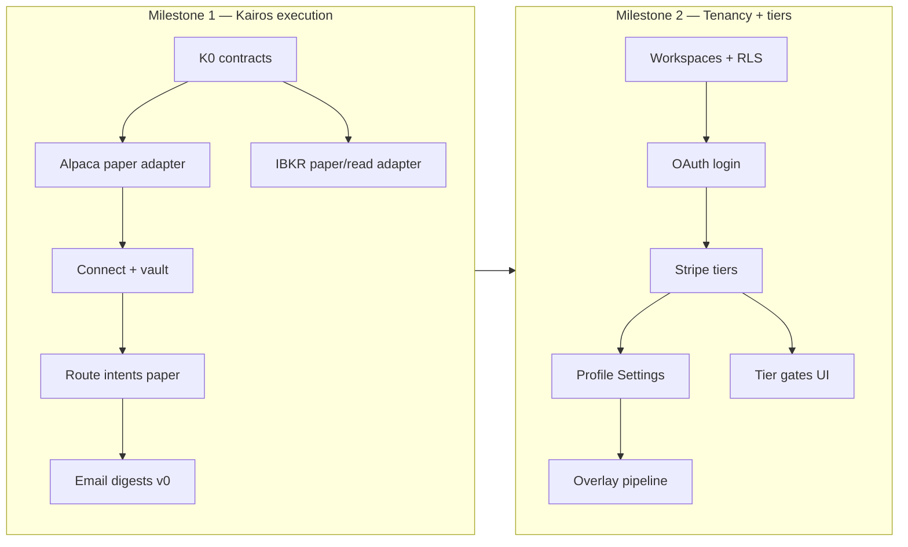

# Olympus Milestone Brief — Kairos execution + user tenancy

> **Date:** 2026-08-29  
> **Status:** Planning brief — no runtime implementation authorized by this document  
> **Scope:** End-to-end product + engineering plan for the two remaining major Olympus milestones after the live house pipeline  
> **Does not:** rewrite the 2026-08-06 metaplan WP numbers, enable live order submit, or change digikey/auth without separate human-gated issues  
> **Authority:** Product decisions marked **Proposed** need human lock; decisions marked **Locked** inherit from the [2026-08-25 vision brief](2026-08-25-olympus-vision-realignment-brief.md) and [Wave 3 migration roadmap](../../../digiquant/src/digiquant/olympus/atlas/docs/ops/MIGRATION-ROADMAP-DIGITHINGS.md)

---

## 0. Why this brief exists

The house Olympus pipeline (Atlas → Hermes → paper book) and dashboard are live enough that **maintenance and small UI polish belong in other sessions**. What remains of the original vision is the consumer product path:

1. **Kairos** — turn Hermes mandates into real (paper-first, then live) execution against user-connected brokers.
2. **User profiles + login** — multi-tenant identity, private books, subscription tiers, and (for higher tiers) profile-overlay pipelines that share Atlas research but keep portfolio-manager deliberation user-private.

This brief audits what the repo already decided, where the dashboard sits today, and a dependency-ordered delivery sequence so we can file agent-task issues and execute step by step.

---

## 1. Repo audit — what we already have

### 1.1 Locked product architecture (do not re-debate)

From the [vision realignment brief](2026-08-25-olympus-vision-realignment-brief.md) and metaplan product-intent strip:

| Principle | Meaning |
|-----------|---------|
| **House run immutable** | digithings-owned always-on house ETF paper book; no profile may move/cancel/replace it |
| **Shared research corpus** | Asset/theme keys are tenant-agnostic; one analyst dossier per ticker can be shared |
| **Private portfolio phase** | Positions, fills, orders, NAV, mandate→book are **user-private** |
| **One pipeline, many profiles** | Profiles are investment overlays (universe, risk, themes), not forked graphs |
| **Paper/manual before live** | Execution defaults to paper and/or manual; live broker cutover is human-gated |
| **Kairos groundwork brokers** | Alpaca Trading API + Interactive Brokers Web API (expand later) |

### 1.2 What "Kairos" means (resolve the dual vocabulary)

Vision docs historically used **Kairos** for two related ideas:

| Sense | Where documented | Status |
|-------|------------------|--------|
| **A. Strategy workbench** | `docs/vision/digiquant.md` — VectorBT → Nautilus → Alpaca paper → live; digichat product mode | Still roadmap; **not** this milestone's first slice |
| **B. Execution / connect-account layer** | 2026-08-25 brief + this brief — route Hermes order intents to broker (paper then live) | **This milestone** |

**Locked for this program:** Milestone 1 implements **sense B** (execution). Strategy-workbench digichat (sense A) stays a later product surface and must not block connect-account paper trading.

### 1.3 Code / schema inventory (2026-08-29)

| Area | Location | State |
|------|----------|-------|
| Broker protocol | `digiquant/brokers/base.py` | Protocol only (`connect` / `disconnect` / `submit_order`) |
| Broker adapters | `digiquant/brokers/stubs.py` | `IBAdapterStub`, `AlpacaAdapterStub`, `QuantConnectAdapterStub` — all `NotImplementedError` |
| Paper execution | Hermes `execution_io` / `execute_at_open` + `portfolio_ledger_*` | **Shipped** for house book (#2420 closed); ledger → paper fill → lots |
| Profile schemas | `digiquant/profiles/` | `InvestmentProfile` + `AssetPreferences` (Pydantic v2) |
| ProfileConfig DB | `olympus_profile_config` (mig 075), `profile_config.py` | **Landed** (#2609 Track B) — house + overlay pins; not yet multi-user auth |
| Research corpus | `olympus/research_corpus.py` + related migs | Shared-corpus plumbing in progress on Track B |
| Olympus dashboard | `frontend/olympus` | Brief, Pipeline, Portfolio (Holdings/Theses/Tearsheet/Ledger/Attribution), House (Corpus\|Book\|Profile read-only), Settings (ops chrome), Library, Why, twelve-x |
| Access gate today | `frontend/olympus/AUTH.md` | **Cloudflare Access** email allow-list on `/olympus/*` — **not** per-user Supabase Auth + RLS |
| Data exposure | Static export + anon RLS `USING (true)` on product tables | Anyone who passes Access (or has the URL before Access) can read the full house corpus + book |
| Settings scope | `docs/superpowers/plans/2026-06-24-olympus-settings.md` | Explicitly **out of scope:** login, multi-user, notification prefs, API keys |
| Wave 3 tenancy spec | `MIGRATION-ROADMAP-DIGITHINGS.md` P2–P8 | Full design: workspaces, RLS, OAuth, Stripe, BYOK, jobs — **not started as product** |
| Email / digest | — | **No** digithings notification service; deferred in Settings plan |
| digikey | JWT / API-key plane for stack services | Not wired as Olympus end-user login |

### 1.4 Dashboard today (operator product, single house book)

Shipped and actively used:

- **Brief** — daily read / Morning Read
- **Pipeline** — glass-box (#1945 Track C direction)
- **Portfolio** — holdings, theses, tearsheet, ledger, attribution on the **house paper book**
- **House** — Corpus \| Book \| Profile (read-only pins)
- **Access** — Cloudflare Access allow-list (human-owned config)

Not shipped:

- Per-user login inside the app
- Tier-gated views (hide PM weights / show Atlas-only)
- Broker connect UI
- Email digests / holding-change alerts
- Editable investment profile Settings
- Custom overlay pipeline scheduling for paying users

---

## 2. Target product shape

### 2.1 Subscription tiers (**Proposed** — needs lock)

Reconciles today's product conversation with the migration roadmap's Free / Pro / Enterprise and the digiquant.io paywall narrative.

| Tier | Access | Research | Portfolio / PM | Pipelines | Execution |
|------|--------|----------|----------------|-----------|-----------|
| **Observer** (free / authenticated) | Login required | **Atlas** house research (shared corpus read) | **No** weights, fills, NAV, Hermes PM deliberation | House run only (read) | None |
| **Baseline** (paid tier 1) | Subscription | Full house Atlas + Hermes artifacts | Full house paper book (read) + optional **manual** execution queue | House run only | Paper book; optional connect for **mirror / notify** later |
| **Custom** (paid tier 2) | Subscription + BYOK for user LLM spend | Shared Atlas theses **plus** profile-requested tickers/themes into shared corpus | **Private** user book; user-anchored H7–H9 (PM deliberation on user prefs + positions) | House run **+** overlay ProfileConfig run | Paper → Alpaca/IBKR paper → live (human-gated) |
| **Enterprise** | Contract | Custom SLA, dedicated support, optional private corpus / SSO | Multi-seat workspaces later | Priority scheduling, higher caps | Same brokers + compliance onboarding |

**Architecture invariant that tiers must respect:**

- Analyst layer (per-ticker theses) → **shareable** across users when corpus keys match.
- Portfolio manager deliberation (H7–H9) → **always user-anchored** once custom books exist; never leak user A’s mandate/weights into user B’s workspace.
- House run → **always runs**; overlays request additional research / different prefs; they do not replace the house run.

**Open product fork (must lock before Observer UI work):**

1. Is **Observer** “Atlas-only / hide PM” (conversation first pass), or does **Baseline** already include full house Hermes + weights (conversation second pass: “tier 1 = baseline in full”)?  
   **Recommendation:** Observer = Atlas + high-level Hermes narrative without weights/NAV; Baseline = full house glass-box + paper book; Custom = overlays + private book + broker connect. That preserves a free taste without giving away the PM product.

### 2.2 End-to-end user journey (Custom tier)

```text
Sign up (OAuth) → pick tier (Stripe) → create InvestmentProfile / AssetPreferences
  → (optional) BYOK for overlay LLM spend
  → connect Alpaca paper OR IBKR paper/sim
  → house Atlas research shared; overlay requests extra tickers into corpus
  → per-user Hermes PM on private book
  → Kairos routes approved intents → paper broker → (later) live
  → email: daily digest + holding-change alerts
```

### 2.3 Broker strategy (**Proposed**)

| Priority | Broker | Why first | Defer |
|----------|--------|-----------|-------|
| **1** | **Alpaca** (`alpaca-py` `TradingClient`) | Same API shape paper vs live; simple API keys; paper host; MCP server exists for later agents | Broker API white-label; options/crypto depth |
| **2** | **Interactive Brokers** (Web API / Client Portal) | Broad retail coverage; equities + many ETF/crypto vehicles | Full vendor automated-trading onboarding; Account Management API |

**Answer to vision brief open Q (“IB vs Alpaca first?”):** ground **Alpaca paper connect** first; keep IBKR adapter interface parallel but second.

**Human gate:** any path that submits **live** capital remains behind explicit human approval (repo invariant). Milestone 1 ships **paper connect + account/position read + paper order submit** only unless a separate human-gated issue authorizes live.

### 2.4 Email notifications (**Proposed**)

| Notification | Trigger | Content |
|--------------|---------|---------|
| Daily digest | Cron after house (and entitled overlay) runs publish | Brief summary + holdings snapshot + notable thesis changes |
| Holding change alert | Diff on private book positions / fills | What changed, size, rationale link into Olympus |
| Execution alert | Paper/live fill ack | Order id, symbol, side, qty, venue |

**Implementation home (proposed):** new thin **notification** capability owned by digiquant job completion + Olympus BFF (or worker), provider = Mailgun (or existing org email). Not a new top-level Digi product name until it proves reusable. Prefs live on `workspaces.settings` (Wave 3).

---

## 3. Milestone program (ordered)

Two milestones, each with phased work packages. **Do not start Wave 3 tenancy UI before Kairos paper path is boring on the house book** — but **do** design tenancy schema early enough that paper ledger tables already carry `workspace_id` (or a clear migration plan) so we do not rebuild the privacy boundary twice.



### Milestone 1 — Kairos (execution layer)

| WP | Name | Outcome | Human gate? |
|----|------|---------|-------------|
| **K0** | Execution contracts | Pydantic models: `BrokerConnection`, `BrokerAccountSnapshot`, `ExecutionVenue` (`paper_internal` \| `alpaca_paper` \| `ibkr_paper` \| `alpaca_live` \| `ibkr_live`), mapping from `portfolio_ledger_order_intents` → venue orders; extend `BrokerAdapter` protocol with `get_positions` / `get_account` / `cancel_order` | No (design + stubs) |
| **K1** | Alpaca paper adapter | Real `AlpacaAdapter` using `alpaca-py` against **paper** keys only; unit tests with mocked HTTP; never reads live keys in default config | No for paper; **yes** if live keys enabled |
| **K2** | IBKR Web API adapter (paper/sim read + order path) | Parallel adapter behind same protocol; document Client Portal Gateway / OAuth session requirements | Same as K1 |
| **K3** | Connection vault + operator/UI seam | Encrypt broker credentials at rest (same pattern as Wave 3 BYOK); fingerprint in UI; house-operator path first, then user workspace | **Yes** (crypto / secret storage) |
| **K4** | Intent router | After H9 / `execute_at_open`: if venue = internal paper → existing ledger writer; if venue = alpaca_paper/ibkr_paper → adapter submit + record external fill ids on ledger | Paper only without extra gate |
| **K5** | Email v0 | Daily digest + holding-change for allow-listed / subscribed emails; prefs stub | No (if no PII beyond email) |

**Milestone 1 exit criteria**

- [ ] House book can still run entirely on internal paper (regression).
- [ ] Alpaca paper: connect → read positions → submit one paper order from a synthetic intent → cancel → disconnect (integration test against Alpaca paper or recorded fixtures).
- [ ] IBKR path at least: account/portfolio **read** in staging; order submit behind feature flag.
- [ ] No live `submit_order` reachable without explicit env flag **and** human-gated issue.
- [ ] `digiquant/ARCHITECTURE.md` + SECURITY live-trading notes updated.
- [ ] Olympus Settings (or House) shows connection status for the operator book (read-only chrome OK).

### Milestone 2 — User profiles, login, tiers

Aligns with migration roadmap **Wave 3 P2–P8**, updated for the tier table above and the shared-corpus / private-book split.

| WP | Name | Maps to | Outcome |
|----|------|---------|---------|
| **T0** | Workspaces + tenant columns + RLS | P2 | `workspaces`, `workspace_members`, `workspace_id` on private portfolio tables; system workspace for shared research; strip broad anon reads in prod |
| **T1** | Supabase Auth (Google + GitHub) | P3 | `/login`, session, query scoping; Cloudflare Access becomes optional admin overlay or retired for app auth |
| **T2** | Stripe + plan_tier | P4 | Observer / Baseline / Custom (+ Enterprise manual); webhook idempotency |
| **T3** | Profile + broker Settings UI | P5 + K3 | Edit InvestmentProfile / AssetPreferences; connect Alpaca/IBKR; notification prefs |
| **T4** | Overlay pipeline runs | P6–P7 | ProfileConfig pin → extra corpus publish-if-missing → user-private Hermes PM → Kairos venue for that workspace |
| **T5** | Tier gates in Olympus UI | — | Observer hides weights/NAV/PM; Baseline shows full house; Custom unlocks overlays + private book |

**Milestone 2 exit criteria**

- [ ] User A cannot read user B’s positions/fills/NAV (RLS proof).
- [ ] Both users can read the same Atlas thesis for `asset:NVDA` when present in the shared corpus.
- [ ] Observer user never receives weight/NAV payloads in BFF responses (fail closed).
- [ ] Custom user overlay run cannot cancel or mutate the house run.
- [ ] Billing: checkout → active → cancel path tested in Stripe test mode.
- [ ] Email prefs honored for digest / alerts.

---

## 4. Privacy & data model sketch

```text
SHARED (system workspace / tenant-agnostic keys)
  documents / research corpus  (theme: | asset: | segment:)
  price_history, technicals, macro (global market data)
  house daily_snapshots research facets (as published for system)

PRIVATE (per user workspace)
  positions, position_events, nav_history, portfolio_metrics
  portfolio_ledger_* (intents, paper_executions, lots, …)
  Hermes PM artifacts (mandate, weights, risk debate for that book)
  broker_connections, notification_prefs
  ProfileConfig overlay versions owned by the workspace
```

**Corpus write rule (locked):** profile requests publish-if-missing (or stale per planner); keys never embed `workspace_id` / `user_id`.

**Who pays for overlay research? (still open from vision brief):** propose **Custom tier subscription covers platform; BYOK covers model calls** (already Wave 3 F4). House budget never pays for unbounded user-forced refresh.

---

## 5. Suggested issue breakdown (file after decisions lock)

Parent epic (suggested title): **`[epic] Olympus Kairos + tenancy program`**

Child agent-tasks (one issue each, `component:digiquant` or `website / root docs` as appropriate):

1. `[agent] K0 — Kairos execution contracts + BrokerAdapter expansion`
2. `[agent] K1 — Alpaca paper TradingClient adapter`
3. `[agent] K2 — IBKR Web API paper/read adapter`
4. `[agent] K3 — Broker credential vault (human-gated crypto)`
5. `[agent] K4 — Order-intent router: internal paper vs Alpaca/IBKR paper`
6. `[agent] K5 — Daily digest + holding-change email v0`
7. `[agent] T0 — Workspaces + RLS privacy boundary`
8. `[agent] T1 — Olympus Supabase Auth login`
9. `[agent] T2 — Stripe plan_tier Observer/Baseline/Custom`
10. `[agent] T3 — Settings: profile, brokers, notifications`
11. `[agent] T4 — Overlay ProfileConfig pipeline + private Hermes book`
12. `[agent] T5 — Tier-gated Olympus UI surfaces`

Each issue should cite this brief + the vision brief + `MIGRATION-ROADMAP-DIGITHINGS.md` and list acceptance criteria per `docs/agent-backlog/SPEC_TEMPLATE.md`.

---

> **Update (2026-08-29, same day):** D1–D7 below are now **locked** — with payments (Stripe per ADR-0004) and external-venue bookkeeping added — in the
> [Kairos + tenancy implementation spec](../specs/2026-08-29-kairos-tenancy-implementation-spec.md), which also carries the per-WP executable detail and the Alpaca/IBKR API ground truth. That spec supersedes this section.

## 6. Decisions to lock next session

| # | Question | Recommendation |
|---|----------|----------------|
| D1 | Observer vs Baseline content split | Observer = Atlas (+ narrative); Baseline = full house including weights/NAV |
| D2 | Alpaca before IBKR? | **Yes** — Alpaca paper first |
| D3 | Live cutover in Milestone 1? | **No** — paper only; live = separate human-gated epic |
| D4 | Auth plane for Olympus users | Supabase Auth (Wave 3) for end users; digikey remains service/API plane |
| D5 | Email provider | Mailgun (org already has MCP/skills) unless another subprocessor is preferred |
| D6 | Static export vs server BFF | Tenancy + Stripe + credential encrypt **require** server routes — plan migration off pure `output:export` for authenticated app surfaces (marketing static can stay) |
| D7 | Cloudflare Access after app auth | Keep as optional IP/email allow-list for staging; production relies on Supabase Auth + RLS |

---

## 7. Near-term working sequence (this program)

1. **Lock D1–D7** in a short follow-up (product).
2. File the epic + K0–K1 issues first (contracts + Alpaca paper).
3. Keep live Olympus maintenance / UI nits on separate branches/sessions.
4. Only after K4 paper router is boring: start T0 schema (privacy boundary) so Custom books reuse Kairos venues.
5. Do **not** wire live Alpaca/IBKR keys into default deploy configs.

---

## 8. References

- [Olympus vision realignment brief (2026-08-25)](2026-08-25-olympus-vision-realignment-brief.md)
- [Olympus pipeline metaplan](2026-08-06-olympus-pipeline-metaplan.md) — Progress / Kairos groundwork strip
- [Wave 3 migration roadmap](../../../digiquant/src/digiquant/olympus/atlas/docs/ops/MIGRATION-ROADMAP-DIGITHINGS.md)
- [docs/vision/olympus.md](../../vision/olympus.md), [docs/vision/digiquant.md](../../vision/digiquant.md)
- [frontend/olympus/AUTH.md](../../../frontend/olympus/AUTH.md), [frontend/olympus/README.md](../../../frontend/olympus/README.md)
- [digiquant/docs/profiles/README.md](../../../digiquant/docs/profiles/README.md)
- Broker stubs: `digiquant/src/digiquant/brokers/`

---

*Next doc action after D1–D7 lock: file the epic + K0/K1 agent-task issues; optionally add a one-line pointer under the metaplan Progress strip to this brief.*
