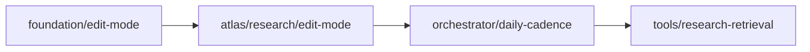

# Olympus #930 — Implementation Brief: `atlas/research/edit-mode` + `orchestrator/daily-cadence`

**Scope:** Scoping only (no production code). Tracking: [#930](https://github.com/digithings-ai/digithings/issues/930).  
**Canonical spec:** [`2026-06-20-olympus-daily-thesis-design.md`](../../specs/2026-06-20-olympus-daily-thesis-design.md) §5–6, §13.1, §14, §16, §17.  
**Plan:** [`2026-06-20-olympus-daily-thesis.md`](../2026-06-20-olympus-daily-thesis.md).

**Execution order:** `foundation/edit-mode` → **`atlas/research/edit-mode`** → **`orchestrator/daily-cadence`** → `tools/research-retrieval` → Hermes steps.

---

## Shared context (live code gaps)

| Area | Today | Target |
|------|-------|--------|
| Triage | `evaluate()` no-ops unless `run_type == "delta"` (`triage.py:439-444`); decisions are `regenerate` \| `carry` | Always runs; signals map to `skip` \| `edit` \| `full` via `resolve_edit_mode` |
| Segment nodes | `build_segment_node` short-circuits on `carry` (`_node_factory.py:468-483`); otherwise **full** LLM | Add `edit` branch: `*-edit.md` → `DocumentPatch` → `merge_document_patch`; `skip` = shallow carry |
| Phase 5 | `_equity_node` / `_sector_node_factory` are **bespoke** — no triage carry, no edit-mode (`phase5_equities.py:59-155`) | Must converge on shared edit-mode helper (or refactor to `build_segment_node`) |
| Phase 6 | Fully deterministic recompute from `source=="today"` slots (`phase6_consolidate.py:77-100`) | Carry prior bias row on quiet day; recompute deterministic fields when any upstream segment ran |
| Phase 7 digest | Always full rewrite (`phase7_synthesis.py:162-188`) | `edit` \| `full` via `resolve_edit_mode`; merge into `DigestSnapshot` |
| Publish | Materialized `documents` / `daily_snapshots` only (`publish_phase.py`) | Dual publish: materialized row + `document_delta` audit row (§5.4) |
| Orchestrator | `--run-type baseline\|delta\|monthly` (`chain.py:324-328`); triage wired only for `delta` (`chain.py:436`); monthly early-exit (`chain.py:254-256`) | `--cadence daily` + `--refresh-scope`; single graph; no monthly branch |
| CI | Sat→baseline, weekday→delta, 28–31→monthly (`.github/workflows/pipeline-olympus.yml:8-81`) | Single daily cron + `workflow_dispatch.refresh_scope` (§14) |

`make_triage_gate()` exists (`triage.py:466-484`) but is **unused** in phase builders — carry is inlined in `_node_factory.build_segment_node`.

---

## Step 1: `atlas/research/edit-mode`

**Spec:** §6, §13.1 (Atlas A1–A4). **Depends on:** `foundation/edit-mode` (`digiquant.olympus.edit_mode`).

### Architecture decision

Keep **one graph topology**; vary per-artifact mode at node entry (§2.2). Atlas nodes call `resolve_edit_mode(artifact_key, run_date, prior_loader, triage_signal, force_full=refresh_scope)` then branch:

| Mode | Segment / digest behavior |
|------|---------------------------|
| `skip` | Shallow-carry prior materialized body → `SegmentSlot(Carried)` or copied `SegmentPayload` with new `as_of` + provenance |
| `edit` | Load `*-edit.md` skill; hybrid prompt (§5.6); output `DocumentPatch \| FullArtifactBody`; merge → publish both rows |
| `full` | Load existing `SKILL.md` (rename to `*-full.md` over time); full schema output |

Triage evolves from `regenerate` → **`needs_edit`** (stale + prior exists) and `carry` → **`quiet`** (maps to `skip`). Mandatory-tier segments (macro, equity, crypto) still run daily but may be `edit` not `full` when prior exists and signals are localized.

### Files to modify

| File | Lines (approx) | Change |
|------|----------------|--------|
| `digiquant/src/digiquant/olympus/atlas/state.py` | 113-114, 338-352 | Extend `DeltaTriageDecision.decision` to `quiet` \| `needs_edit` \| `force_full` (or keep legacy + adapter); add `prior_artifact_date` on state if needed; deprecate `RunType` coupling in triage (full removal in orchestrator step) |
| `digiquant/src/digiquant/olympus/atlas/triage.py` | 433-484 | Remove `run_type != "delta"` gate; map rule outcomes to triage signals consumed by `resolve_edit_mode`; update `make_triage_gate` / rename to `make_edit_mode_gate` returning skip vs proceed |
| `digiquant/src/digiquant/olympus/atlas/phases/triage_phase.py` | 38-40, 63-73 | Always populate `price_deltas` + `triage` (not delta-only); wire `prior_published` lookups via foundation loader |
| `digiquant/src/digiquant/olympus/atlas/graph.py` | 143-144 | Insert `build_triage_phase()` for **all** daily shapes (not only `run_type == "delta"`) |
| `digiquant/src/digiquant/olympus/atlas/phases/_node_factory.py` | 343-359, 384-433, 458-529 | Core edit-mode branch: skill selection (`{slug}-edit` / `{slug}-full`), hybrid `phase_inputs`, `ArtifactEditOutput` parse, `merge_document_patch`, fail-closed → `PhaseError`; update `_changed_segment_keys` for new decision vocabulary; extend `build_grounding` hook for `fetch_prior_document` (foundation stub OK until `tools/research-retrieval`) |
| `digiquant/src/digiquant/olympus/atlas/phases/phase1_altdata.py` | 168-173 | No structural change if using `build_segment_node`; verify triage applies |
| `digiquant/src/digiquant/olympus/atlas/phases/phase2_institutional.py` | 80-160 | Institutional circuit-breaker (#928) must compose with edit-mode (absent stub ≠ quiet carry) |
| `digiquant/src/digiquant/olympus/atlas/phases/phase3_macro.py` | 72-85 | Pilot vertical for edit-mode skills |
| `digiquant/src/digiquant/olympus/atlas/phases/phase4_assetclass.py` | 125-135 | Same factory pattern |
| `digiquant/src/digiquant/olympus/atlas/phases/phase5_equities.py` | 59-155, 200+ | **Critical gap:** refactor equity + sector nodes to shared edit-mode path (triage skip + edit/full) |
| `digiquant/src/digiquant/olympus/atlas/phases/phase6_consolidate.py` | 77-100 | Bias row: carry prior `daily_snapshots` row when all segments `skip`; else deterministic recompute; optional LLM `edit` only for `notes` if spec requires (prefer deterministic-only for v1) |
| `digiquant/src/digiquant/olympus/atlas/phases/phase7_synthesis.py` | 162-228 | Digest edit-mode: prior digest from `prior_context.last_snapshots`; `DocumentPatch` merge; keep `_bodies()` today-only filter for synthesis **inputs** |
| `digiquant/src/digiquant/olympus/atlas/phases/publish_phase.py` | 77-288 | Dual publish helper: upsert materialized + `document_delta` row per §5.4; skip delta row on pure `skip` carry |
| `digiquant/src/digiquant/olympus/atlas/skills/**` | new files | Add `*-edit.md` per vertical (start: `macro`, `equity`, `crypto`, `digest`; sector uses `sector-research-edit.md`); document hybrid prompt contract §5.6 |
| `tests/dq/atlas/test_triage_monthly_phase9.py` | 102-120+ | Update triage vocabulary + always-on behavior |
| `tests/dq/atlas/test_context_diet.py` | 171-195 | Update `regenerate` → `needs_edit` in fixtures |
| `tests/dq/atlas/test_pipeline_simulation.py` | — | Add `test_segment_edit_e2e` (spec §16) |
| `tests/dq/atlas/test_phase67.py` | — | Add `test_digest_edit` |

**New module (from foundation, consumed here):** `digiquant/olympus/edit_mode/` — not duplicated in this step.

### Ordered sub-tasks (max 8)

1. **Triage signal evolution** — `triage.py` + `state.py` decision types; always-on triage in `triage_phase.py` + `graph.py`; update existing triage unit tests.
2. **Segment edit-mode core** — Extract `run_segment_with_edit_mode()` from `_node_factory.build_segment_node` (mode resolve → skip \| edit \| full → merge); wire `macro` pilot end-to-end with `macro-edit.md`.
3. **Phase 1–4 factory rollout** — Apply shared helper to all `build_segment_node` phases; add edit skills for high-traffic verticals (`equity`, `crypto`, `bonds`, …).
4. **Phase 5 parity** — Refactor `phase5_equities.py` equity + sector swarm to use shared edit-mode (fixes today’s triage blind spot).
5. **Phase 6 bias continuity** — Deterministic carry vs recompute; publish bias row with correct provenance.
6. **Phase 7 digest edit** — `digest-edit.md`, prior snapshot load, merge, `_enforce_research_only_boundary` on merged output.
7. **Dual publish** — `publish_phase.py` writes materialized + `document_delta`; align keys with `document-delta.schema.json` (`prior_date`).
8. **Simulator e2e** — Two-day sim: day1 full, day2 macro edit-only + sector skip; assert patch rows + materialized coherence.

### Test plan (spec §16)

| Test | Location | Assert |
|------|----------|--------|
| `test_segment_edit_e2e` | `tests/dq/atlas/test_pipeline_simulation.py` (new) | Simulator: day1 full → day2 `needs_edit` macro only; quiet sectors `skip` (0 LLM); `documents` + `document_delta` rows for edited segment |
| `test_digest_edit` | `tests/dq/atlas/test_phase67.py` or new `test_digest_edit.py` | Golden ops from `delta-request.example.json` / `document-delta` fixtures; merged digest matches manual `apply_ops` fold |
| Triage regression | `tests/dq/atlas/test_triage_monthly_phase9.py` | Mandatory segments never `quiet` on first run; quiet tape → `quiet`; stale + prior → `needs_edit` |
| Context diet | `tests/dq/atlas/test_context_diet.py` | `_changed_segment_keys` reflects new decision literals |

**Not in this step:** `test_resolve_edit_mode`, `test_merge_document_patch` (foundation).

### Dependencies on `foundation/edit-mode`

| Foundation deliverable | Atlas consumer |
|---------------------|----------------|
| `resolve_edit_mode()` | Every segment + digest node entry |
| `DocumentPatch`, `PatchOp`, `MergeResult` | LLM output validation |
| `merge_document_patch()` | Post-LLM merge (wraps `apply_ops`) |
| `ArtifactEditOutput` union | `run_research_agent` output_model override in edit branch |
| `prior_published(run_date, document_key)` | Triage + skip/edit resolution |
| `OLYMPUS_STALE_FULL_DAYS` | Hard `full` when gap > N days |
| `fetch_prior_document` stub | §5.6 hybrid prompt (real impl in `tools/research-retrieval`) |

**Blocker:** Do not merge atlas edit-mode until foundation tests pass. Atlas may land behind a feature flag only if foundation is on `module/digiquant` first.

### Risks / edge cases

- **Phase 5 triage bypass** — Today equity/sectors always call LLM; quiet-day cost savings impossible until sub-task 4 ships.
- **Mandatory tier vs skip** — `macro`/`equity`/`crypto` `_always` rules must not emit `quiet` when no prior exists; with prior, `needs_edit` is valid (not full regen).
- **Carried semantics** — `Carried` points at `baseline_date`; edit-mode uses `prior_published.date` (may ≠ calendar yesterday). Align `Carried.baseline_date` → `prior_artifact_date` or shallow-copy materialized body into `SegmentPayload(source=today)`.
- **Model-initiated full rewrite** (§5.3.2) — Edit branch must accept full body without merge failure.
- **Merge fail-closed** — Bad patch → `PhaseError`; optional one-shot `full` retry (spec §5.3).
- **Phase 2 circuit breaker** — `inst-*` absence stub must not be mistaken for triage `skip`.
- **Digest input diet** — `_bodies()` excludes carried segments from LLM **input** but `segment_freshness` must still list them (`phase7_synthesis.py:215-228`).
- **Skills volume** — ~25+ segment slugs; batch edit skills or template-generate from `*-full.md` to avoid drift.

### Estimated PR slices

| Slice | Commit focus | Files (primary) |
|-------|--------------|-----------------|
| **A1** | Triage always-on + signal vocabulary | `triage.py`, `triage_phase.py`, `state.py`, `graph.py`, triage tests |
| **A2** | `_node_factory` edit-mode core + macro pilot | `_node_factory.py`, `skills/macro/*-edit.md`, foundation imports |
| **A3** | Phase 1–4 segment edit skills | `phase1-4`, `skills/*-edit.md` |
| **A4** | Phase 5 edit-mode parity | `phase5_equities.py` |
| **A5** | Phase 6–7 + dual publish | `phase6_consolidate.py`, `phase7_synthesis.py`, `publish_phase.py` |
| **A6** | E2E simulator tests | `test_pipeline_simulation.py`, `test_phase67.py` |

One commit per slice; each PR body: `Fixes #930`.

---

## Step 2: `orchestrator/daily-cadence`

**Spec:** §14, §17 #4. **Run after** `atlas/research/edit-mode` (or in parallel only for workflow YAML if CLI shims remain backward-compatible). **Must complete before** `tools/research-retrieval` and Hermes steps.

### Architecture decision

Replace three **graph shapes** with one **daily** cadence. `run_type` becomes an implementation detail:

- **CLI:** `--cadence daily` (only legal value in v1) + `--refresh-scope none|all|segments|hermes|digest|beliefs`
- **Operator full refresh:** `refresh_scope=all` (Sunday cron or manual) — forces `resolve_edit_mode → full` per artifact, not a different graph
- **Remove:** `monthly` compile branch, Sat baseline / weekday delta inference in CI
- **Transitional shim (one PR max):** accept deprecated `--run-type delta` → `cadence=daily`; map `baseline` → `refresh_scope=all`; warn on stderr

### Files to modify

| File | Lines (approx) | Change |
|------|----------------|--------|
| `digiquant/src/digiquant/olympus/hermes/chain.py` | 254-256, 303-377, 395-457, 508 | Add `--cadence`, `--refresh-scope`; deprecate `--run-type`, `--auto-baseline`; thread `refresh_scope` into `AtlasInput` / state; remove monthly early-exit; always wire triage + preflight_reflect |
| `digiquant/src/digiquant/olympus/atlas/graph.py` | 13-21, 61-63, 100-120, 318-450 | Remove `monthly` branch (`build_phase_monthly`); single daily phase list always includes triage; update `AtlasInput` (`cadence`, `refresh_scope`); migrate `resolve_cli_inputs` |
| `digiquant/src/digiquant/olympus/atlas/state.py` | 113-114, 387-389 | Add `Cadence = Literal["daily"]`, `RefreshScope`; keep `run_type` deprecated alias during migration or remove in same PR as CI |
| `digiquant/src/digiquant/olympus/atlas/phases/phase_monthly.py` | all | Stop compiling into graph; keep module for ad-hoc operator script only (§17.4) |
| `digiquant/src/digiquant/olympus/atlas/testing/simulator.py` | 500-501, 614-620, 641+ | Default `AtlasInput(cadence="daily")`; remove monthly invoke path; `simulated_pipeline` seeds for daily-only |
| `.github/workflows/pipeline-olympus.yml` | 1-120, 196-230 | Single `cron: "0 12 * * *"`; `workflow_dispatch` inputs: `refresh_scope`, `run_date`, `dry_run`; drop `run_type` / monthly crons; invoke `chain --cadence daily` |
| `tests/dq/atlas/test_cli.py` | 24-184 | Cadence + refresh-scope parsing; deprecation warnings for `--run-type` |
| `tests/dq/atlas/test_graph_compile.py` | 98-130 | Remove `test_monthly_graph_is_compact`; add `test_daily_always_includes_triage` |
| `tests/dq/hermes/test_chain_atlas_then_hermes.py` | — | Daily cadence smoke; no monthly path |
| `tests/dq/atlas/test_pipeline_simulation.py` | — | Cadence CLI + workflow smoke (spec §16 mapping) |

### Ordered sub-tasks (max 8)

1. **State + input model** — `Cadence`, `RefreshScope` on `AtlasInput` / `AtlasResearchState`; plumb `force_full_rewrite` from `refresh_scope=all`.
2. **Atlas graph daily-only** — Delete `monthly` branch in `build_atlas_graph`; triage always compiled; update `test_graph_compile.py`.
3. **Chain CLI** — `--cadence daily`, `--refresh-scope`; deprecation shim for `--run-type`; remove monthly guards in `cli_main` / `run_atlas_then_hermes`.
4. **Simulator defaults** — `simulator.py` + `simulated_pipeline` use daily cadence; drop monthly code paths.
5. **CI workflow** — Simplify `olympus.yml` resolve job; pass `refresh_scope` (Sunday → `all` optional enhancement).
6. **CLI tests** — `test_cli.py` + new chain CLI tests.
7. **Integration smoke** — `test_chain_atlas_then_hermes` dry-run compiles daily graph + Hermes.
8. **Grep gate** — CI/script grep for scheduled `run_type=monthly` / `baseline` as **current** behavior (full gate in `docs/olympus-topology-sync`).

### Test plan (spec §16)

| Test | Assert |
|------|--------|
| Cadence CLI | `chain --cadence daily --run-date …` parses; `--run-type baseline` emits deprecation + maps to `refresh_scope=all` |
| Workflow smoke | Dry-run compile via chain with daily input succeeds; no `monthly` in compiled node set |
| Simulator | `simulated_pipeline` default invoke uses triage phase present for all runs |

### Dependencies on `foundation/edit-mode`

| Dependency | Why |
|------------|-----|
| `resolve_edit_mode(..., force_full_rewrite)` | `refresh_scope=all` must force `full` at orchestrator boundary |
| `refresh_scope` semantics | Shared enum used by Atlas + later Hermes nodes |

Orchestrator can land **without** atlas edit-mode if it only changes CLI/graph shape and passes `refresh_scope` through (edit branches no-op until atlas step merges). Prefer **atlas first** so triage always-on does not run against old delta-only assumptions.

### Risks / edge cases

- **`baseline_date` removal** — Delta runs used `baseline_date` for carry provenance; daily cadence uses `prior_published` per §5.1. Migrate `_auto_resolve_baseline` → `prior_artifact_date` helper or drop `--auto-baseline`.
- **`daily_snapshots.run_type` column** — DB may still store `baseline`/`delta`; decide migration vs write constant `daily`.
- **Sunday full refresh** — CI currently sets Saturday baseline; new model: Sunday `refresh_scope=all` on same graph (operator decision).
- **Hermes always runs** — Removing “delta-only Hermes skip” is already spec intent; ensure no `run_type` gates remain in `hermes/graph.py` (out of scope but verify in smoke).
- **Parallel PR conflict** — `chain.py` touched by both steps; **sequence atlas edit-mode (triage always-on) before orchestrator CLI** or single owner file merge.
- **Monthly ad-hoc** — `phase_monthly.py` / `monthly-synthesis` skill retained but unrouted; document in RUNBOOK (final docs step).

### Estimated PR slices

| Slice | Commit focus | Files (primary) |
|-------|--------------|-----------------|
| **O1** | `AtlasInput` cadence + graph daily-only | `state.py`, `graph.py`, `test_graph_compile.py` |
| **O2** | Chain CLI `--cadence` / `--refresh-scope` + shim | `chain.py`, `test_cli.py`, chain tests |
| **O3** | Simulator + `run_atlas_then_hermes` monthly removal | `simulator.py`, `test_pipeline_simulation.py` |
| **O4** | `olympus.yml` workflow | `.github/workflows/pipeline-olympus.yml` |

One commit per slice; `Fixes #930`.

---

## Cross-step sequencing

- **Do not** implement #931 lite graph or amend ADR in these steps (separate `docs/adr-and-tracking`).
- **Atlas before orchestrator** avoids conflicting edits to `graph.py`, `chain.py`, and triage wiring.
- `orchestrator/daily-cadence` explicitly **blocks** Hermes work per plan (“downstream tests assume daily-only orchestration”).

---

## Top 5 actionable items for implementers

1. **Land `foundation/edit-mode` first** — `resolve_edit_mode`, `merge_document_patch`, and `prior_published` are hard prerequisites; atlas nodes only call the library.
2. **Fix Phase 5 triage blind spot** — `phase5_equities.py` bespoke nodes must use the same skip/edit/full path as `build_segment_node` or quiet-day savings fail (#929 cost target).
3. **Evolve triage vocabulary before widening graph** — Change `regenerate`/`carry` → `needs_edit`/`quiet`, remove `run_type == "delta"` gate in `triage.py:439` and `triage_phase.py:39`, then always compile triage in `graph.py:143`.
4. **Orchestrator: one daily graph** — Delete `build_atlas_graph("monthly")` (`graph.py:118-120`), switch CI to `chain --cadence daily` (`.github/workflows/pipeline-olympus.yml:216-218`), add `--refresh-scope` for operator full refresh (§14).
5. **Add two spec tests early (TDD)** — `test_segment_edit_e2e` and `test_digest_edit` in simulator harness before wiring all `*-edit.md` skills; macro-only pilot proves merge + dual publish.

---

*Generated: 2026-06-20 — scoping subagent for Olympus #930.*
