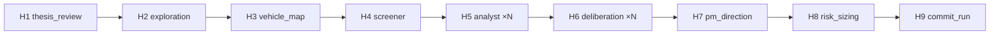

# Hermes Scope Brief — #930 (H1–H9)

**Status:** Scoping only — no production code in this document.  
**Canonical spec:** [`2026-06-20-olympus-daily-thesis-design.md`](../../specs/2026-06-20-olympus-daily-thesis-design.md) §3.6, §7–§11, §13.2  
**Plan steps:** [`2026-06-20-olympus-daily-thesis.md`](../2026-06-20-olympus-daily-thesis.md) — `hermes/thesis/*` + `hermes/portfolio/*`  
**Branch:** `task/930-olympus-mvp-delta` → PR into `module/digiquant`

---

## Executive summary

Replace the live **7C → 7CD → 7D → chain-terminal-7E → publish → materialize → phase9** stack with a **single thesis-first graph** (`build_hermes_phases_thesis`, H1–H9). Graph topology is invariant; cost control is `resolve_edit_mode` per artifact + `OLYMPUS_MODEL_TIER`, not `OLYMPUS_HERMES_LITE` or a second builder.

Ship in **four Hermes PRs (4a→4d)**. Each PR keeps CI green via a **strangler tail** until 4d removes legacy terminal phases from `chain.py`.

**Critical path to first Hermes PR (4a):** `docs/adr-and-tracking` (#931 revert) → `foundation/edit-mode` → `orchestrator/daily-cadence` → `tools/research-retrieval` → **4a** `hermes/thesis/market-and-roster`.

---

## Patterns and conventions (live code)

| Pattern | Location | Reuse for Hermes |
|---------|----------|------------------|
| `PipelinePhase` + `build_pipeline` | `hermes/pipeline_builder.py` → `digigraph.graph.pipeline_builder` | Same builder; new `build_hermes_phases_thesis()` returns ordered phases |
| Per-ticker fan-out + cap + `held` invariant (#936) | `phase7c_analyst._capped_tickers`, `phase7cd_debate._capped_tickers` | Move cap logic to H4 roster + H5/H6 fan-out builders |
| `AnalystPayload` Pydantic contract | `phase7c_analyst.py:74–87` | **Evolve** field set per spec §9 (unified payload); drop 4-axis `SpecialistPayload` join |
| `run_research_agent` + `load_skill` + `build_grounding` | `_node_factory.py`, all phase modules | All LLM nodes; extend grounding with `query_research` / `query_portfolio` (§6.1) |
| `PriorContext.active_theses` | `preflight.py` → `load_active_theses_rows` | H1 input; writers must upsert `theses` rows same-day |
| Interim focus roster (technical) | `chain.py:469–486` + `candidates.select_focus_tickers` | **Delete** from chain once H4 runs in-graph |
| Post-PM thesis derivation | `portfolio_materialize._upsert_theses` | **Delete** — theses authored H1–H2 + H5, synced H9 |
| Terminal chain phases | `chain.py:274–284` — 7E, `publish_phase`, `materialize` | **4d:** fold into H9 `commit_run`; H8 moves **inside** Hermes graph (4c) |
| Migration 024 tables | `024_thesis_deliberation_first_class.sql` | `thesis_vehicles` (H3), deliberation tables (H6), `analyst_coverage` (H5) |
| JSON schemas (partial) | `hermes/templates/schemas/` | Reuse: `market-thesis-exploration`, `thesis-vehicle-map`, `asset-recommendation`, `deliberation-transcript` |

**Historical reference only:** `HERMES_SUBGRAPH.md` (recess/deep_dive, `MAX_ROUNDS=6`, `PMAllocationMemo` weights) — **not** v1 per Jun-20 spec §10, §11, §12.

---

## Architecture decision

**One builder:** `build_hermes_phases_thesis()` is the only Hermes phase list. `build_hermes_graph()` always calls it (no env fork).

**Strangler rule:** PRs 4a–4c append legacy tail nodes only where needed for green CI; each PR deletes the slice it replaces. PR 4d removes the tail and chain terminal phases.

**State:** Add nested `phase_hermes: PhaseHermesState` on `AtlasResearchState`. Legacy slots (`phase7c_*`, `phase7d_*`, `phase9_evolution`) are removed incrementally (4b–4d), not in one big-bang rename.

**Authority split (ADR-0020):** H7 = `PMDirectionMemo` (direction + rank, **no weights**). H8 = `phase7e_risk_sizing` (sole weight owner). H9 = `commit_run` (sole terminal Supabase write on daily path).

---

## `build_hermes_phases_thesis()` structure

```text
build_hermes_phases_thesis(watchlist, held, deps) -> list[PipelinePhase]

  [H1] thesis_review                    # 1 node — market thesis refresh
  [H2] market_thesis_exploration        # 1 node — propose short/long market theses
  [H3] thesis_vehicle_map               # 1 node — thesis → tickers (thesis_vehicles)
  [H4] opportunity_screener             # 1 node — focus_roster (held + mapped + technical)
  [H5] asset_analyst × len(focus_roster)  # fan-out — unified AnalystPayload / asset_recommendation doc
  [H6] deliberation × len(focus_roster)   # fan-out — cyclic PM↔analyst sub-graph per ticker
  [H7] pm_direction                       # 1 node — PMDirectionMemo
  [H8] risk_sizing                        # 1 node — deterministic (today's phase7e logic)
  [H9] commit_run                       # 1 node — terminal persist (#932)
```

**Mermaid (target topology):**



**Per-PR wiring:**

| PR | Phases in builder | Strangler tail (temporary) |
|----|-------------------|----------------------------|
| **4a** | H1–H4 | `build_phase7c` → `build_phase7cd` → `build_phase7d` → `build_phase9` + chain 7E/publish/materialize |
| **4b** | H1–H6 | `build_phase7d` → `build_phase9` + chain terminals |
| **4c** | H1–H8 | chain `publish` + `materialize` only (7E absorbed into H8) |
| **4d** | H1–H9 | **none** — delete chain terminal phases for daily |

**`build_hermes_graph()` changes (all PRs):**

- Replace `build_hermes_phases` / `build_hermes_phases_lite` / `_hermes_lite_enabled()` with `build_hermes_phases_thesis`.
- Drop `debate_rounds` compile-time param (7CD gone after 4b); H6 uses semantic convergence (§10.3).
- `watchlist` arg becomes **Atlas research scope** only; **Hermes fan-out roster** = `state.phase_hermes.focus_roster` from H4 (chain stops calling `select_focus_tickers` in 4a).

---

## `AtlasResearchState` / `PhaseHermesState` slots

### New nested block (`atlas/state.py`)

```python
class FocusRosterEntry(BaseModel):
    ticker: str
    roster_reason: Literal["thesis_mapped", "technical", "held", "momentum", "other"]
    linked_market_thesis_id: str | None = None

class PhaseHermesState(BaseModel):
  # H1–H4 (thesis track)
    thesis_review: dict[str, Any] | None = None           # ThesisReviewOutput JSON
    market_thesis_exploration: dict[str, Any] | None = None
    thesis_vehicle_map: dict[str, Any] | None = None
    focus_roster: list[FocusRosterEntry] = Field(default_factory=list)

  # H5–H6 (portfolio track)
    asset_analysts: Annotated[dict[str, dict[str, Any]], _merge_right_wins_dict] = Field(default_factory=dict)
    deliberation_summaries: Annotated[dict[str, dict[str, Any]], _merge_right_wins_dict] = Field(default_factory=dict)

  # H7–H9
    pm_direction_memo: PMDirectionMemo | None = None
    sized_book: RebalancePayload | None = None            # H8 output (post-7E shape)
    commit_manifest: dict[str, Any] | None = None         # H9 coherence + idempotency audit

class AtlasResearchState(BaseModel):
    ...
    phase_hermes: PhaseHermesState = Field(default_factory=PhaseHermesState)
```

### Legacy slots — removal schedule

| Slot | Action | PR |
|------|--------|-----|
| `phase7c_specialists` | **DELETE** | 4b |
| `phase7c_analysts` | **DELETE** (H5 writes `phase_hermes.asset_analysts` + publishes `analyst/{ticker}`) | 4b |
| `phase7cd_debates` | **DELETE** (H6 → `phase_hermes.deliberation_summaries`) | 4b |
| `phase7d_risk_debate` | **DELETE** | 4c |
| `phase7d_rebalance` | **DELETE** as PM output; H8 writes `phase_hermes.sized_book` only | 4c |
| `phase9_evolution` | **DELETE** from daily graph; H9 persists `decision_log` pending rows | 4d |

### `theses` table gap (blocker for H1–H2)

Live `theses` row (`001_initial_schema.sql`) lacks spec §7.1 fields: `confidence`, `validation_criteria`, `invalidation_criteria`, `horizon`, `thesis_kind`, `linked_market_thesis_id`. **Add migration `025_thesis_daily_fields.sql` in PR 4a** (or immediately before). Store criteria in row columns + mirror in `documents` payloads for edit-mode patches.

### Supabase write map (migration 024 + `theses`)

| Table | Writer phase | Notes |
|-------|--------------|-------|
| `theses` | H1 (refresh), H2 (new market), H5 (vehicle-local), H9 (final sync) | Replace `portfolio_materialize._upsert_theses` |
| `thesis_vehicles` | H3 (map), H9 (reconcile) | FK `(date, thesis_id)` → `theses` |
| `documents` | H1–H7 per artifact + `document_delta` audit | `publish` helpers extracted for H9 |
| `analyst_coverage` | H5 | `current_recommendation_key` = `analyst/{ticker}` |
| `deliberation_sessions` / `deliberation_rounds` | H6 | Fresh transcript per session; `kind='delta_scoped'` → rename to `daily` in follow-up migration if desired |
| `positions` / `nav_history` / `decision_log` | H9 only | Idempotent on `source_run_id` |

**Out of v1:** `deep_dive_triggers`, recess/deep_dive batch (Jun-20 §10 supersedes HERMES_SUBGRAPH §2.3).

---

## PR 4a — `hermes/thesis/market-and-roster` (H1–H4)

### New modules

| Module | Node id | Responsibility |
|--------|---------|----------------|
| `hermes/phases/h1_thesis_review.py` | `hermes/thesis/market-review` | Daily pass on `prior_context.active_theses`; confidence + criteria refresh; `resolve_edit_mode` on thesis exploration summary doc |
| `hermes/phases/h2_market_thesis_exploration.py` | `hermes/thesis/market-exploration` | Propose/revise `thesis_kind=market` theses; publish `market-thesis-exploration` document |
| `hermes/phases/h3_thesis_vehicle_map.py` | `hermes/thesis/vehicle-map` | Map active market theses → tickers; upsert `thesis_vehicles`; publish `thesis-vehicle-map` doc |
| `hermes/phases/h4_opportunity_screener.py` | `hermes/thesis/opportunity-screener` | Build `focus_roster`: held (#936) + H3 edges + technical/unlinked; **replaces** `candidates.select_focus_tickers` for Hermes |
| `hermes/writers/thesis_io.py` | — | Shared `upsert_thesis_row`, `upsert_thesis_vehicles`, status normalization (`chk_theses_status`) |
| `hermes/models/thesis.py` | — | Pydantic: `ThesisReviewOutput`, `MarketThesisExploration`, `ThesisVehicleMap`, `OpportunityScreen` |

### Evolve existing

| Module | Change |
|--------|--------|
| `hermes/graph.py` | Add `build_hermes_phases_thesis()`; wire H1–H4 + **legacy tail**; delete `build_hermes_phases_lite`, `_hermes_lite_enabled`, `OLYMPUS_HERMES_LITE` branch |
| `hermes/chain.py` | Stop `select_focus_tickers` when `phase_hermes.focus_roster` populated; pass `held` through unchanged |
| `atlas/state.py` | Add `PhaseHermesState` + `phase_hermes` field (H1–H4 fields only OK) |
| `atlas/phases/preflight.py` | Extend `load_active_theses_rows` select columns after migration 025 |

### Skills to create (`hermes/skills/`)

Each skill directory gets **`SKILL-full.md`** + **`SKILL-edit.md`** (or `thesis-full.md` / `thesis-edit.md` loaded by node via `resolve_edit_mode`). `SKILL.md` can re-export default (full) for backward compat.

| Skill dir | Used by | Schema |
|-----------|---------|--------|
| `thesis/` | H1 | **Create** `thesis-review.schema.json` |
| `market-thesis-exploration/` | H2 | Reuse `market-thesis-exploration.schema.json` |
| `thesis-vehicle-map/` | H3 | Reuse `thesis-vehicle-map.schema.json` |
| `opportunity-screener/` | H4 | **Create** `opportunity-screen.schema.json` |

Optional: `thesis-tracker/` as edit-mode helper text included by H1 skill (not a separate node).

### Delete from graph wiring (4a)

- `build_hermes_phases_lite()` and env `OLYMPUS_HERMES_LITE`
- Any `#931` `build_phase7c_unified` import (revert if present uncommitted)
- `chain.py` Hermes roster = `select_focus_tickers` (replaced by H4 output)

**Keep temporarily:** full `build_phase7c` → `build_phase7cd` → `build_phase7d` → `build_phase9` tail fed by `focus_roster`.

### Acceptance criteria (4a)

- [ ] `build_hermes_graph()` compiles H1–H4 + legacy tail; dry-run CLI green
- [ ] `test_thesis_criteria` — invalidation hit → thesis `CHALLENGED` in H1
- [ ] H1–H4 graph smoke: stub LLM → `phase_hermes` populated; `theses` + `thesis_vehicles` rows written for fixture date
- [ ] Held tickers always in `focus_roster` (#936)
- [ ] H4 includes all H3-mapped tickers + does not drop thesis-mapped names
- [ ] `query_research` wired on H1–H4 nodes (from `tools/research-retrieval` prerequisite)
- [ ] No `OLYMPUS_HERMES_LITE` / `build_hermes_phases_lite` references in graph or chain
- [ ] `make test-unit` + ruff green; `Fixes #930` (partial — note H1–H4 in PR body)

---

## PR 4b — `hermes/portfolio/analyst-deliberation` (H5–H6)

### New modules

| Module | Node id | Responsibility |
|--------|---------|----------------|
| `hermes/phases/h5_asset_analyst.py` | `hermes/portfolio/asset-analyst` | Unified `AnalystPayload` per roster ticker; vehicle-local thesis when `roster_reason ≠ thesis_mapped`; fingerprint skip/edit (#925); publish `analyst/{ticker}` + optional `document_delta` |
| `hermes/phases/h6_deliberation.py` | `hermes/portfolio/deliberation` | Per-ticker **cyclic sub-graph**: `h6_pm_challenge` ↔ `h6_analyst_response` until `converged=true` (§10.3); no round cap; publish `deliberation_transcript`; upsert `deliberation_sessions` / `deliberation_rounds` |
| `hermes/models/analyst.py` | — | Expanded `AnalystPayload` (§9 fields) validated against `asset-recommendation.schema.json` |
| `hermes/models/deliberation.py` | — | `DeliberationTurn`, `DeliberationSummary` |

### Evolve existing

| Module | Change |
|--------|--------|
| `hermes/graph.py` | H5–H6 in builder; **remove** `build_phase7c`, `build_phase7cd` from tail |
| `phase7c_analyst.py` | **DELETE file** after H5 lands |
| `phase7cd_debate.py` | **DELETE file** after H6 lands |
| `phase7e_risk_sizing.py` | Read `phase_hermes.asset_analysts` + `deliberation_summaries` instead of `phase7c_*` / `phase7cd_*` (interim until 4c) |
| `publish_phase.py` | Publish analyst + deliberation docs from `phase_hermes` slots |
| `portfolio_materialize.py` | Stop reading `phase7c_analysts` / `phase7cd_debates` (still runs until 4d) |

### Skills to create

| Skill dir | Variants | Notes |
|-----------|----------|-------|
| `asset-analyst/` | `*-full.md`, `*-edit.md` | **Not** `#931` `unified-analyst`; blinding: `query_research` + `query_data` only |
| `deliberation/` | `*-full.md`, `*-edit.md` | PM challenge uses `portfolio-manager/SKILL.md` persona; analyst uses `asset-analyst` |

### Delete from graph wiring (4b)

- `build_phase7c()` / `build_phase7c_unified()` (entire 4-axis path)
- `build_phase7cd()` — bull/bear/research-manager stack (#933 gating bridge **gone**)
- `phase7c_specialists`, `phase7c_analysts`, `phase7cd_debates` state fields
- Skills (deprecate, do not load): `fundamental-analyst`, `technical-analyst`, `sentiment-analyst`, `news-analyst`, `research-manager`, `research-debate`, `bull`/`bear` personas
- `clamp_debate_rounds` usage in `chain.py` for Hermes
- `HERMES_DEBATE_GATING` env (#933)

### Acceptance criteria (4b)

- [ ] `test_analyst_edit` — stale fingerprint → `DocumentPatch`, not full rewrite
- [ ] `test_deliberation_convergence` — PM challenge → analyst revise → `converged=true` ends loop
- [ ] `test_deliberation_skip` — quiet fingerprint → 0 LLM, carried summary into `phase_hermes.deliberation_summaries`
- [ ] No references to `phase7c_analysts` / `phase7cd_debate` in graph wiring
- [ ] `analyst_coverage` row updated per H5 ticker
- [ ] Vehicle-local thesis row created in H5 when `roster_reason=technical`
- [ ] H6 portfolio context via `phase_inputs` (book/theses), not `query_portfolio` for analysts

---

## PR 4c — `hermes/portfolio/direction-and-sizing` (H7–H8)

### New modules

| Module | Node id | Responsibility |
|--------|---------|----------------|
| `hermes/phases/h7_pm_direction.py` | `hermes/portfolio/pm-direction` | Emit `PMDirectionMemo` only; publish `pm-direction-memo` document |
| `hermes/models/pm_direction.py` | — | `PMDirectionMemo`, `TickerDirection` (§11.2) |

### Evolve existing

| Module | Change |
|--------|--------|
| `phase7e_risk_sizing.py` | Becomes **H8** inside Hermes graph: input = `PMDirectionMemo` + conviction ranks; output = `phase_hermes.sized_book`; map direction→weights via existing `size_portfolio` (#934 gaps) |
| `phase7d_pm.py` | **DELETE** `build_phase7d` / `build_phase7d_pm` / risk debaters after H7 lands |
| `hermes/graph.py` | H7–H8 wired; remove `build_phase7d` + `build_phase9` from tail |
| `chain.py` | **Remove** `_run_terminal_phase(deps.risk_sizing, ...)` — sizing runs inside Hermes |

### `PMDirectionMemo` cutover (replaces `RebalanceDecision` from PM)

```python
class TickerDirection(BaseModel):
    ticker: str
    direction: Literal["long", "flat"]
    conviction_rank: int = Field(ge=1)
    narrative: str | None = None

class PMDirectionMemo(BaseModel):
    schema_version: str = "1.0"
    date: date
    roster: list[TickerDirection]
    memo: str | None = None
    # MUST NOT: target_pct, weight, shares, recommended_portfolio
```

**H8 mapping:** `conviction_rank` + `direction` + feasibility caps → `recommended_portfolio` (`TargetWeight` list). Reuse `phase7e_risk_sizing._effective_inputs` logic but source ranks from H7 memo instead of analyst conviction_score + debate delta.

### Skills

| Skill | Action |
|-------|--------|
| `pm-rebalance-decision/` | **Replace** with `pm-direction/` (`*-full.md`, `*-edit.md`) — direction + rank only; explicit prohibition on weight fields in skill text |
| `pm-allocation-memo/` | **Deprecate** for daily path (historical schema retained) |
| `risk-aggressive/`, `risk-conservative/` | **Stop loading** — delete from graph |

**Create schema:** `pm-direction-memo.schema.json` (replaces weight-bearing `rebalance-decision` as PM artifact).

### Delete from graph wiring (4c)

- `build_phase7d()` — PM weight emission + risk temperament debate
- `phase7d_risk_debate`, `phase7d_rebalance` as PM-emitted state
- Chain-terminal `risk_sizing` phase invocation
- `publish_phase` publishing PM `pm-rebalance` doc from `phase7d_rebalance` — switch to H8-sized book

### Acceptance criteria (4c)

- [ ] `test_pm_no_weights` — H7 schema rejects `target_pct` / `recommended_portfolio` keys
- [ ] 7E sizing regression: given fixture `PMDirectionMemo`, H8 weights match prior `phase7e` golden vectors
- [ ] Published brief weights (if publish still runs) == H8 `sized_book` — full gate in 4d
- [ ] Bearish expression via inverse ETF tickers in H7 `direction=long` on inverse (§8.3)

---

## PR 4d — `hermes/portfolio/commit-run` (H9)

### New modules

| Module | Node id | Responsibility |
|--------|---------|----------------|
| `hermes/phases/h9_commit_run.py` | `hermes/portfolio/commit-run` | Single terminal phase (#932): coherence checks, idempotent upserts |
| `hermes/writers/commit_io.py` | — | Extract booking from `portfolio_materialize.py` + publish paths from `publish_phase.py` |

### `commit_run` contract (§11.3)

**Inputs:** `phase_hermes.sized_book`, materialized Hermes artifacts H1–H7, pending `decision_log` rows from analyst/PM outputs, `run_date`, `source_run_id`

**Outputs:**

- `positions` + `nav_history` upsert (from H8 weights only)
- `theses` / `thesis_vehicles` reconcile (no post-PM derivation)
- Portfolio brief publish — weights **from H8**
- `decision_log` append (persist-only slice of old phase9)
- `commit_manifest` in state + run status row

**Coherence (fail-closed):** brief weights == positions; held tickers preserved; every open position has H5 analyst doc or explicit `flat` in H7

**Idempotency:** same `source_run_id` → no-op upsert; conflict → `PhaseError`

### Evolve / fold

| Source | Fate |
|--------|------|
| `atlas/phases/publish_phase.py` | Extract Hermes-relevant publish helpers → called from H9; Atlas segments/digest publish stays in Atlas graph or moves to shared helper |
| `hermes/portfolio_materialize.py` | **DELETE** `build_materialize_phase` from daily chain; logic folded into H9 |
| `hermes/phases/phase9_evolution.py` | **Remove** from `build_hermes_phases_thesis`; 9A–9C LLM **not** on daily path; `persist_pending` → H9 |

### Delete from graph wiring (4d)

- `chain.py`: `_run_terminal_phase(publish)`, `_run_terminal_phase(materialize)` for daily cadence
- `build_phase9()` in Hermes builder
- `portfolio_materialize._upsert_theses` — theses already authored upstream
- `HermesGraphDeps.phase9` LLM path (keep deps struct for tests if needed, default `None`)
- `phase9_evolution` state slot

### Acceptance criteria (4d)

- [ ] `commit_run` coherence + idempotency tests (#932)
- [ ] Re-run same `source_run_id` is no-op
- [ ] `decision_log` pending rows written without phase9 LLM
- [ ] End-to-end daily sim: single terminal write; no double booking
- [ ] `phase9` evolution LLM not invoked on daily path (beliefs on-demand only, §11.1)

---

## Graph wiring deletion checklist (cumulative after 4d)

| Item | Location |
|------|----------|
| `build_hermes_phases()` | `graph.py` |
| `build_hermes_phases_lite()` | `graph.py` |
| `_hermes_lite_enabled()` / `OLYMPUS_HERMES_LITE` | `graph.py`, env docs |
| `build_phase7c` / 4-axis specialists | `phase7c_analyst.py` (deleted) |
| `build_phase7cd` | `phase7cd_debate.py` (deleted) |
| `build_phase7d` / risk debaters | `phase7d_pm.py` (deleted or gutted) |
| `build_phase9` in Hermes graph | `phase9_evolution.py` (module may remain for on-demand beliefs) |
| Chain `select_focus_tickers` for roster | `chain.py` |
| Chain terminal 7E / publish / materialize | `chain.py` `run_atlas_then_hermes` |
| Post-PM `_upsert_theses` | `portfolio_materialize.py` |
| Debate rounds CLI preference | `chain.py`, `clamp_debate_rounds` for Hermes |

---

## Test mapping (Hermes PRs)

| Test | PR |
|------|-----|
| `test_thesis_criteria`, H1–H4 smoke | 4a |
| `test_analyst_edit`, `test_deliberation_*`, fingerprint skip | 4b |
| `test_pm_no_weights`, 7E sizing regression | 4c |
| `commit_run` coherence + idempotency | 4d |

---

## PR order summary

| PR | Plan step | Scope | Blocks |
|----|-----------|-------|--------|
| **4a** | `hermes/thesis/market-and-roster` | H1–H4, `build_hermes_phases_thesis` scaffold, delete lite, migration 025, thesis skills | — |
| **4b** | `hermes/portfolio/analyst-deliberation` | H5–H6, delete 7C/7CD | 4a merged |
| **4c** | `hermes/portfolio/direction-and-sizing` | H7–H8, `PMDirectionMemo`, delete 7D | 4b merged |
| **4d** | `hermes/portfolio/commit-run` | H9, delete publish/materialize/phase9 daily | 4c merged; blocks portfolio track merge |

**Do not combine** 4a–4d into one PR (plan explicit).

---

## Critical path — first Hermes PR (4a)

1. **`docs/adr-and-tracking`** — revert uncommitted #931 lite graph; amend ADR-0020 (thesis-first supersedes lite).
2. **`foundation/edit-mode`** — `resolve_edit_mode`, `DocumentPatch`, `merge_document_patch` (H1/H5 edit paths depend on this).
3. **`orchestrator/daily-cadence`** — `--cadence daily`; drop `run_type` monthly/baseline/delta gates affecting Hermes.
4. **`tools/research-retrieval`** — `query_research`, `query_portfolio`, phase blinding (§6.1); wire into `build_grounding`.
5. **Schema `025_thesis_daily_fields.sql`** — `confidence`, criteria columns, `thesis_kind`, `horizon`, `linked_market_thesis_id`.
6. **4a implementation** — `PhaseHermesState`, H1–H4 modules + skills, `build_hermes_phases_thesis` with legacy tail, delete lite builder, `theses`/`thesis_vehicles` writers, chain roster cutover to H4.

**First executable slice in 4a:** `graph.py` scaffold + `h4_opportunity_screener` with deterministic held/mapped merge (no LLM) + legacy 7C tail fed by `focus_roster` — proves roster replacement before all thesis LLM nodes land.

---

## References

- `digiquant/src/digiquant/olympus/hermes/graph.py` — current `build_hermes_phases` / lite fork
- `digiquant/src/digiquant/olympus/hermes/chain.py` — terminal phase orchestration
- `digiquant/supabase/migrations/024_thesis_deliberation_first_class.sql`
- `tests/dq/atlas/test_migration_024.py`
- `digiquant/src/digiquant/olympus/atlas/supabase_io.py:load_active_theses_rows`
- `docs/adr/0020-olympus-mvp-daily-delta.md` — PM direction / 7E / commit_run intent
