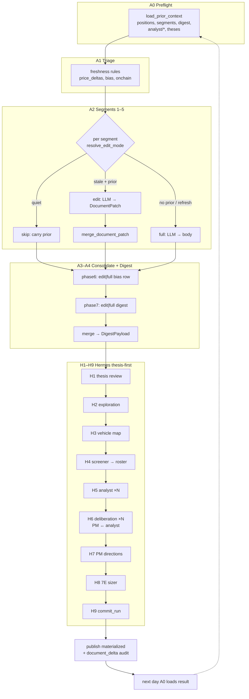
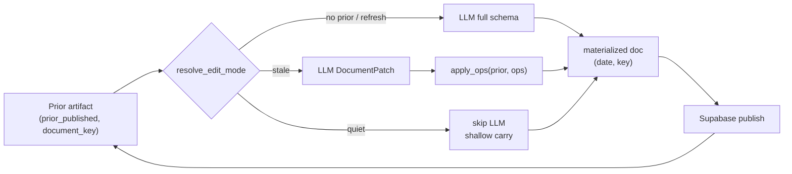

# Olympus Daily Thesis + Edit-Mode Continuity (greenfield)

**Date:** 2026-06-20 · **Status:** Draft for review (not committed)  
**Implementation plan:** [`2026-06-20-olympus-daily-thesis.md`](../plans/2026-06-20-olympus-daily-thesis.md) · **Tracking:** GitHub #930 (absorbs #924)  
**Supersedes for graph topology:** [`2026-06-19-olympus-mvp-delta-design.md`](./2026-06-19-olympus-mvp-delta-design.md) — dual `run_type` graphs, `OLYMPUS_HERMES_LITE`, baseline-vs-delta as separate Hermes shapes, Jun-19 lite/collapse path (#931). Jun-19 forensics, cost targets, and ADR-0020 rationale remain valid (see §12.2).  
**Builds on:** [ADR-0015](../../../docs/adr/0015-atlas-vs-hermes.md), [ADR-0020](../../../docs/adr/0020-olympus-mvp-daily-delta.md) (sizer + terminal-write *intent* — amend in `docs/adr-and-tracking` before Hermes work; lite/collapse bullets superseded), [HERMES_SUBGRAPH.md](../../../digiquant/src/digiquant/olympus/hermes/docs/HERMES_SUBGRAPH.md) (**historical topology reference** — `MAX_ROUNDS=6`, recess/deep_dive, and `PMAllocationMemo` weights are **not** in v1; see §10, §11, §17 #5)

---

## 1. Problem statement

Olympus must run **every calendar day** as one continuous research + portfolio loop. Yesterday’s artifacts are the starting point; agents **evolve** them via structured edits, not full rewrites. “Baseline” is an **operator-triggered full refresh** (first run, weekly regen, error correction) — not a separate cron graph or Hermes shape.

Jun-19 forensics showed the cost failure mode: even “delta” re-generated full documents and re-ran the entire Hermes fan-out. The fix is **continuity at the artifact layer** (patch-merge) plus **thesis-aware Hermes** with selective LLM calls — not two pipelines.

---

## 2. Design principles (non-negotiable)

These principles govern all Olympus daily work. Implementations that fork graph topology for cost, cadence, or “lite” paths violate this spec.

### 2.1 One graph, one daily cadence

- **Single LangGraph topology:** Atlas A0–A4 → Hermes H1–H9 → `commit_run`. No `OLYMPUS_HERMES_LITE`, no `build_hermes_phases_lite`, no parallel full-vs-lite graph builders, no maintaining two Hermes shapes.
- **One cron:** `daily` schedule only. No `monthly` run type or month-end synthesis pipeline (owner decision #4). “Baseline” means intentional full refresh (first run, operator `refresh_scope=all`, weekly regen, error correction) — **not** a separate workflow, cron, or graph variant.
- **Supersedes Jun-19 topology:** see §12 and [`2026-06-19-olympus-mvp-delta-design.md`](./2026-06-19-olympus-mvp-delta-design.md).

### 2.2 Vary prompt / input / output — not graph nodes

**Graph nodes are invariant.** What changes per LLM call:

| Varies per call | Does **not** vary |
|-----------------|-------------------|
| Prompt template (`*-full.md` vs `*-edit.md`) | Node identity and graph edges |
| Input bundle (prior doc, delta signals, triage hints) | H1–H9 / A0–A4 phase ordering |
| Output schema (full body vs `DocumentPatch`) | Parallel graph builders per cost tier or cadence |
| Post-merge step (`apply_ops` vs direct publish) | Separate baseline/delta cron graphs |

This is the core cost-and-continuity mechanism: **selective LLM invocation and smaller outputs**, not fewer nodes in the graph.

### 2.3 Cost control = model tier only

Spend is controlled by **`OLYMPUS_MODEL_TIER`** and [`config/olympus_models.yaml`](../../../config/olympus_models.yaml) (`cheap` \| `balanced` \| `quality`). Model tier routes which pinned model each LLM node uses.

**Not** acceptable for cost control:

- Alternate graph shapes (lite vs full Hermes)
- Skipping entire Hermes subgraphs on “quiet” days (H1+ still runs; per-artifact `skip` / `edit` / `full` decides calls)
- Baseline-vs-delta workflow forks

Quiet-day savings come from **`skip`** (0 LLM) and **`edit`** (smaller output tokens), not from collapsing the graph.

### 2.4 Edit-mode continuity (delta reframed)

Per **LLM call**, not per graph: `full` \| `edit` \| `skip` resolved per artifact via `resolve_edit_mode` (§5).

- Prior artifact exists (yesterday) → structured `DocumentPatch` (`set` / `append` / `remove`) → programmatic merge via `apply_ops`
- No prior → full rewrite
- Applies to: Atlas vertical segments, daily digest, Hermes analyst outputs, thesis docs
- Analysts receive prior analysis and **modify thinking** in edit mode — not blind full rewrites
- Goal: day-over-day continuity; fewer output tokens; avoid rewriting full docs daily

### 2.5 Authoritative continuity model

| Principle | Implication |
|-----------|-------------|
| Daily run, not scratch | Preflight loads **prior-day materialized** docs for every artifact class |
| Delta reframed | No “baseline graph” vs “delta graph”. One graph; per-call **edit vs full vs skip** |
| Per vertical: enhance / modify / add / retract | LLM outputs **ops**, not whole JSON bodies |
| Programmatic merge | `apply_ops(prior_doc, ops)` → materialized publish row |
| Applies everywhere | Atlas segments, daily digest, Hermes analyst payloads, thesis docs |
| Automation | `prior_published(run_date, document_key)` exists (latest `date < run_date`) → default **edit**; else → **full** (see §5.1 — not calendar yesterday only) |
| Explicit refresh | `force_full_rewrite: true` on artifact or run — intentional baseline (not a fork) |

---

## 3. Current-state grounding (what exists today)

### 3.1 Triage + carry-forward (KEEP / EVOLVE)

- `triage.evaluate()` → `DeltaTriageDecision(decision="regenerate"|"carry")` gated on `run_type == "delta"` only (`triage.py:433-463`).
- `make_triage_gate()` short-circuits segment nodes to `Carried` marker — **zero LLM** (`triage.py:466-484`, `_node_factory.py:468-483`).
- Bias signals from `prior_context.last_snapshots[0].snapshot` and `latest_segments` (`triage.py:77-111`).
- Onchain carry: byte-equal Hyperdash injection (`triage.py:343-364`).

**Gap:** `regenerate` still runs **full** segment regen in the research agent — no edit prompt, no `document_delta` publish path in-graph.

### 3.2 Patch schemas (REUSE)

| Schema | Location | Ops |
|--------|----------|-----|
| `document_delta` | `hermes/templates/schemas/document-delta.schema.json` | `set`, `append`, `remove` + JSON Pointer `path` |
| `delta-request` (digest snapshot) | `atlas/templates/delta-request-schema.json` | same op vocabulary |
| Merge impl | `scripts/atlas/materialize_snapshot.py:apply_ops` | deterministic deep-copy apply |
| Fold job | `scripts/atlas/fold_document_deltas.py` | prior-day row + delta → materialized upsert |

`COMPILED-RESEARCH-VIEW.md` already specifies fold-on-read for “as of D” without persisting merged blobs.

### 3.3 Prior context (KEEP)

`PriorContext` (`state.py:171-220`): `last_snapshots`, `latest_segments`, `prior_book`, `prior_analyst_by_ticker`, `active_theses`, `decision_lessons`, `portfolio_performance`.

Preflight hydrates these (`preflight.py` + `supabase_io.load_prior_context`).

### 3.4 Digest continuity (PARTIAL)

`phase7_synthesis._bodies()` filters to `source == "today"` only — carried segments excluded from digest **prompt** (`phase7_synthesis.py:215-228`). Digest itself is still **full rewrite** when synthesis runs.

### 3.5 What to DELETE vs KEEP

| DELETE | KEEP / EVOLVE |
|--------|----------------|
| `run_type` fork driving **different Hermes graph shapes** (`build_hermes_phases` vs `build_hermes_phases_lite`) | Triage table + carry gate (evolve `regenerate` → `edit`) |
| Separate `atlas-baseline.yml` / `atlas-delta.yml` **semantics** as two pipelines | Single `daily` cron + `workflow_dispatch` `refresh_scope` |
| `OLYMPUS_HERMES_LITE` as alternate graph; Jun-19 lite/collapse path (#931) | Thesis-first H1–H9 as **the** graph |
| **4-axis parallel analysts** (fundamental / technical / sentiment / macro) | Unified H5 `AnalystPayload` (§9) |
| **Bull/bear + research-manager** debate stack (`phase7cd_debate.py`) | H6 PM↔analyst deliberation (§10) |
| **Risk-aggressive / risk-conservative** debate personas (legacy phase7d) | H7 PM direction + conviction only (§11) |
| **Technical-score-only** focus roster selection | H4 screener: held names + thesis→vehicle map candidates |
| **Post-PM ticker-theses materialization** node (derive theses after PM) | Thesis-first H1–H2 before vehicle map (§7–§8) |
| **Phase 9 evolution LLM** on daily path (beliefs distillation / 9A–9C calls) | `commit_run` terminal persist + optional beliefs later (§11, §17) |
| **`monthly` run type** + month-end synthesis graph branch | Daily-only; month-over-month views are UI aggregation over stored daily artifacts |
| ADR-0019 premise “Hermes always re-runs on delta” | ADR-0020 PM direction-only + 7E sizer + `commit_run` |
| Full segment regen when stale-but-not-orphaned | Patch when prior exists; carry when triage quiet |
| `baseline_date` week-anchor for **every** weekday | `prior_published(run_date, key)` = last materialized row before `run_date` |

> **Code reality (2026-06-20):** The **DELETE** column above is the **target** state. Live code still runs `build_hermes_phases` / optional `build_hermes_phases_lite` (#931), `phase7cd_debate`, 4-axis 7C, PM weight emission, `publish_phase` + `portfolio_materialize` + phase9 LLM — see §3.6.

### 3.6 Live code → target mapping

| Live (today) | Target | Action |
|--------------|--------|--------|
| `triage.evaluate` → `regenerate`\|`carry` (`run_type=delta` only) | A1: `skip`\|`edit`\|`full` per artifact | Evolve `triage.py`; drop `run_type` gate |
| `_node_factory` carry gate | A2: `skip` + `edit` branch + merge | Extend factory |
| `phase7_synthesis` full digest | A4: digest `edit`\|`full` + merge | Wire edit-mode |
| `build_hermes_phases` + `build_hermes_phases_lite` | `build_hermes_phases_thesis` H1–H9 only | Delete lite builder; revert uncommitted #931 |
| `phase7c` 4-axis + `build_phase7c_unified` (lite) | H5 unified `AnalystPayload` | New `phase_h5_*`; remove 4-axis from graph |
| `phase7cd_debate` (#933 gating = **bridge only** until H6 ships) | H6 PM↔analyst loop | Remove from graph when H6 lands |
| `phase7d_pm` + risk debaters | H7 `PMDirectionMemo` (§11.2) | New schema; no weights |
| `phase7e_risk_sizing` | H8 deterministic sizer | Keep module; inputs from H7 memo |
| `publish_phase` + `portfolio_materialize` + `phase9_evolution` persist | H9 `commit_run` (§11.3) | Single terminal phase (#932) |
| `portfolio_materialize._upsert_theses` (post-PM) | H1–H2 + H5 vehicle thesis | Delete post-PM thesis derivation |
| `candidates.select_focus_tickers` (technical interim) | H4 opportunity screener | Thesis-mapped + unlinked paths |
| `scripts/atlas/materialize_snapshot.py:apply_ops` | `digiquant.olympus.edit_mode.merge_document_patch` | Wrap + in-graph call |
| `query_data` only in grounding | §6.1 `query_research` + `query_portfolio` | `tools/research-retrieval` |

---

## 4. Architecture decision

**One `daily` LangGraph chain** (Atlas A0–A4 → Hermes H1–H9 → `commit_run`) per §2.1. Graph nodes and edges are **fixed**; per-call variation is prompt template, input bundle, output schema, and post-merge step only (§2.2). Each LLM node receives an `ArtifactEditContext` resolved at node entry:

```text
edit_mode = resolve_edit_mode(artifact_key, run_date, force_full=...)
```

- **`full`** — no prior materialized body (or operator refresh): existing SKILL + full output schema.
- **`edit`** — prior loaded per §5.6 (section index + stale-section bodies); output schema = `DocumentPatch` (ops list). Model may call `fetch_prior_document` for additional context.
- **`skip`** — triage/carried: no LLM; shallow-copy prior row with new `date` + `source_run_id` provenance.

**Merge** runs in-process immediately after validation (fail-closed). Publish **both**:

1. `document_delta` row (audit / changelog / re-fold)
2. Materialized full payload row (`documents` or `daily_snapshots`) for UI + next-day preflight

**Rationale:** Reuses proven `apply_ops` + existing JSON schemas; avoids a second graph; token savings are structural (output size), not prompt-cache tricks alone.

**Trade-off:** Edit fidelity depends on patch quality (§5.3.1) — structured ops, schema validation, and edit-mode skills — not post-merge drift heuristics.

---

## 5. EditMode contract

### 5.1 Deterministic mode resolution

```python
ArtifactKey = tuple[str, str]  # (namespace, slug) e.g. ("segment", "macro"), ("analyst", "SPY")

def resolve_edit_mode(
    *,
    artifact_key: ArtifactKey,
    run_date: date,
    prior_loader: PriorLoader,
    triage: TriageSignal | None,
    force_full_rewrite: bool = False,
) -> Literal["full", "edit", "skip"]:
```

| Condition | Mode |
|-----------|------|
| `force_full_rewrite` or run-level `refresh_scope=all` | `full` |
| No prior row for `document_key` (any `date < run_date`) | `full` |
| Prior gap **>** `OLYMPUS_STALE_FULL_DAYS` (default 7) | `full` (hard cap — too stale to patch) |
| Triage / fingerprint says **quiet** | `skip` |
| Prior exists + triage/fingerprint says **stale** | `edit` (default continuity path) |
| First-ever run (empty Supabase) | `full` for all |

**Prior artifact (owner decision #3):** `prior_published(run_date, document_key)` = latest materialized row with `date < run_date` for that key — **not** calendar yesterday only. Handles missed runs (Fri outage → Mon patches against Thu or last good publish).

**Within `edit` mode:** model may return either a `DocumentPatch` or a **full body** when it judges patch is suboptimal (see §5.3.2). Default expectation is patch; full rewrite from the model is allowed when delta signals imply extensive change.

**Hermes ticker fingerprint (extends #925):** unchanged price band + news hash + prior stance → `skip`; material change → `edit`; new ticker → `full`.

### 5.2 Pydantic models (new — `digiquant.olympus.edit_mode`)

```python
PatchOpType = Literal["set", "append", "remove"]

class PatchOp(BaseModel):
    model_config = ConfigDict(extra="forbid")
    op: PatchOpType
    path: str = Field(max_length=512, description="JSON Pointer, RFC 6901")
    value: Any | None = None
    reason: str | None = Field(default=None, max_length=240)

class DocumentPatch(BaseModel):
    """LLM output when edit_mode=edit and patch is sufficient."""
    model_config = ConfigDict(extra="forbid")
    schema_version: str = "1.0"
    doc_type: Literal["document_delta"] = "document_delta"
    date: date
    prior_date: date  # date of prior_published row used as base
    target_document_key: str
    status: Literal["updated", "skipped"]
    skip_reason: str | None = None
    ops: list[PatchOp] = Field(default_factory=list)
    one_line_summary: str | None = Field(default=None, max_length=400)
    signals_checked: list[str] = Field(default_factory=list)

# Edit-mode nodes accept a discriminated union (§5.3.2):
# ArtifactEditOutput = DocumentPatch | FullArtifactBody  # per-node full schema

class MergeResult(BaseModel):
    materialized: dict[str, Any]
    delta: DocumentPatch
    merge_stats: MergeStats  # ops_applied, paths_touched (telemetry only)
```

`DocumentPatch` aligns with `document-delta.schema.json` — add `prior_date` as alias for `baseline_date` during migration.

### 5.3 Merge semantics (`merge_document_patch`)

```python
def merge_document_patch(
    prior: dict[str, Any],
    patch: DocumentPatch,
    *,
    schema_validator: Callable[[dict], None],
) -> MergeResult:
```

| Rule | Behavior |
|------|----------|
| `status=skipped` | Return `prior` unchanged; publish delta row only |
| Op order | Apply in array order (same as `apply_ops`) |
| Path create | `set` on missing path creates intermediate dicts (existing behavior) |
| `append` | Requires list at path — else **fail** |
| `remove` | Idempotent remove — missing key OK |
| Post-validate | Merged doc must pass target segment JSON schema |
| Conflict | Duplicate `set` on same path in one patch → **fail** |
| Fail-closed | Any apply error → no publish; segment degrades to `PhaseError` + optional `full` retry once |

#### 5.3.1 Patch quality (owner decision #2 — no verbatim guard)

**Decision:** Do **not** implement a post-merge verbatim/drift guard that falls back to `full` when untouched leaves change. Rely on getting good patches consistently instead.

| Mechanism | Role |
|-----------|------|
| **Structured output** | `DocumentPatch` with `extra="forbid"`; skills require a `reason` on each op (`PatchOp.reason` optional in schema for forward-compat) |
| **Path discipline** | Skills: patch only paths backed by today's delta signals; no drive-by rewrites |
| **Post-merge schema validation** | Merged doc must pass target JSON schema — fail-closed, no publish |
| **Hybrid prompt + `fetch_prior_document`** | §5.6 — model has context to make surgical edits |
| **`OLYMPUS_MODEL_TIER`** | Route edit-mode nodes to models with reliable JSON (validate on #926 before cheap default) |
| **Telemetry only** | `merge_stats.paths_touched` logged for ops review — not an automatic fallback trigger |
| **Operator escape hatch** | `force_full_rewrite` per artifact or `refresh_scope` when patches are bad in production |

Rejected: `unchanged_leaf_ratio` threshold → auto-`full` fallback (ADR-0019 open Q1 closed as **won't do**).

#### 5.3.2 Model-initiated full rewrite (owner decision #3)

When `resolve_edit_mode` returns `edit`, the LLM still chooses the **output shape**:

| Model output | When | Node behavior |
|--------------|------|---------------|
| `DocumentPatch` | Surgical delta; default path | `merge_document_patch` → publish materialized + delta audit |
| **Full artifact body** (segment/analyst/digest schema) | Model judges patch suboptimal — extensive structural change, stale prior, too many interdependent updates | Publish full body directly; log `rewrite_reason`; optional empty or summary delta row for audit |

**Skills instruct:** prefer patch when prior is recent and signals are localized; choose full body when reorganization or >~50% content would need ops (model judgment — no programmatic verbatim guard).

**Hard cap (deterministic):** if `run_date - prior_published.date > OLYMPUS_STALE_FULL_DAYS` (default **7**, env-tunable), `resolve_edit_mode` returns `full` **before** LLM — model does not get edit mode on ancient priors.

### 5.4 Supabase `documents` versioning

| Row | `date` | `document_key` | `payload.doc_type` |
|-----|--------|----------------|---------------------|
| Materialized | `run_date` | stable key (`macro`, `analyst/SPY`, `digest`, …) | segment / analyst / digest type |
| Delta audit | `run_date` | `document-deltas/{target_key}` or same key + `payload.run_suffix` | `document_delta` |

**Versioning model:** `(date, document_key)` is the version key (migration 011). Continuity chain:

```text
doc(D) = apply_ops(doc(D-1), delta(D))   # or doc(D) = full when mode=full
```

`daily_snapshots` digest: same pattern via `delta-request` ops or shared `DocumentPatch` against prior snapshot JSON.

**Do not delta-edit:** `deliberation_transcript` (fresh per H6 session — §10.5), `deliberation_session_index`, `pm_allocation_memo` per `COMPILED-RESEARCH-VIEW.md`. Deliberation **summaries** may be carried on H6 `skip` without new transcript rows.

### 5.5 Token savings narrative

| Artifact | Full rewrite (typical) | Edit mode (typical) | Savings |
|----------|------------------------|---------------------|---------|
| Segment body | 2–6k output tokens | 150–600 ops + reasons | **70–90%** output |
| Digest | 3–8k | 200–800 | **75–90%** |
| Analyst payload | 1–2k | 100–400 | **60–80%** |
| Quiet day (carry/skip) | N/A | **0** | **100%** |

Input side: edit prompts use the **hybrid assembly** in §5.6 (section index + full body for stale sections only) + **delta signals** — smaller than dumping all segment bodies into synthesis (#935 context diet complements this).

### 5.6 Edit prompt assembly (owner decision #1)

**Decision:** Hybrid (**C**) — section index always; full prior body only for sections triage marks stale; optional on-demand fetch for anything else.

| Prompt component | Always included | Stale sections only | On demand (tool) |
|------------------|-----------------|---------------------|------------------|
| Section index | ✓ (headings, keys, one-line summaries) | — | — |
| Full prior JSON excerpt | — | ✓ per stale section | — |
| Delta signals | ✓ (price moves, bias shift, triage reason) | — | — |
| Arbitrary prior sections | — | — | `fetch_prior_document` |

**`fetch_prior_document` tool** (available on every `edit`-mode LLM node):

```python
fetch_prior_document(
    document_key: str,       # e.g. "segment/macro", "analyst/SPY", "digest"
    section_path: str | None = None,  # JSON Pointer; None = full materialized body
    as_of_date: date | None = None,   # default: prior_calendar(run_date)
) -> dict[str, Any]
```

- Resolves from preflight cache or **`query_research`** (§6.1) — any `as_of_date`, not only yesterday.
- Bounded response (token cap per call); model cites fetched paths in patch `reason` fields.
- Skills instruct: **start from index + stale excerpts**; call tool only when a cross-section dependency requires more context (e.g. macro edit referencing equity detail not in the stale set).

**Rationale:** Aligns input cost with triage; avoids blind full-json prompts while preserving fidelity when the model needs a field outside the stale bundle.

---

## 6. Product narrative (Atlas)

Atlas research spans **verticals** (sectors, sources, information types) and produces **detailed segment documents** per vertical. The **daily digest** is a separate artifact: human-readable consolidation for the web UI (Olympus dashboard). Nitty-gritty evidence and segment-specific reasoning live in vertical docs; the digest is **not** the sole machine input to Hermes.

Atlas produces two artifact classes with distinct audiences:

| Artifact | Audience | Role |
|----------|----------|------|
| **Vertical segment docs** (`macro`, `equity`, `crypto`, …) | Agents + power users | Nitty-gritty evidence, data pulls, segment-specific reasoning |
| **Daily digest** (`daily_snapshots`) | Web UI (Olympus dashboard) | Human-readable **daily consolidation** — what changed, what matters, cross-vertical synthesis |

**Machine handoff to Hermes** uses a **compact prompt bundle** (today's triage summary, active theses, segment index) plus **retrieval tools** (§6.1) — not a fixed pointer schema or full document dump.

1. **Prompt (always):** segment freshness index, `one_line_summary` from today's digest, `active_theses`, delta signals.
2. **On demand (tools):** any prior research vertical, digest from **any date**, portfolio book, prices/technicals — fetched when the model needs them.

Rationale: the digest is optimized for operator scan-ability; agents pull segment fidelity and history via tools instead of stuffing context or maintaining a separate `attention_index` artifact (owner decision #9).

### 6.1 Olympus retrieval tools (owner decision #9)

**Decision:** No formal digest pointer / `attention_index` sidecar for v1. Hermes (and Atlas edit-mode) LLM nodes get a **unified retrieval toolkit** backed by Supabase + market tables. Models fetch what they need, including **any historical date** — not only yesterday.

Wire via `build_grounding` (extends existing `query_data` pattern). Preflight hydrates a read-through cache where possible; cache miss → bounded Supabase read.

| Tool | Scope | Parameters (indicative) | Typical callers |
|------|-------|-------------------------|-----------------|
| **`query_research`** | `documents` rows + `daily_snapshots` digest JSON | `document_key`, `as_of_date` (optional; default latest `< run_date`), `segment` (vertical slug) | H1–H2, H5, H6, H7; Atlas edit nodes |
| **`fetch_prior_document`** | Alias / narrow wrapper over `query_research` for edit-mode patch context | `document_key`, `section_path?`, `as_of_date?` | Atlas + Hermes edit-mode (§5.6) |
| **`query_data`** | Market data tables (`price_history`, `price_technicals`, …) | Existing MCP shape: `table`, `eq`, `order`, `limit` | H5 analyst, H6 (market-data scope) |
| **`query_portfolio`** | `positions`, `nav_history`, `theses`, `decision_log` (lessons) | `as_of_date?`, `ticker?` | H7 PM, H8 sizing context; **not** blinded analysts |

**Date semantics:** `as_of_date` selects the materialized row for that calendar date; if missing, fall back to latest `date < as_of_date` (same as §5.1 `prior_published`). Enables “pull last Thursday's macro segment” without prompt stuffing.

**Blinding rules (unchanged intent):**

| Phase | `query_research` | `query_data` | `query_portfolio` |
|-------|------------------|--------------|-------------------|
| H5 analyst | ✓ (market segments only) | ✓ market tables | ✗ |
| H6 deliberation | ✓ | ✓ market tables | ✗ (portfolio via `phase_inputs` — see below) |
| H7 PM | ✓ | ✓ | ✓ |
| H1–H2 thesis | ✓ all verticals + digest | ✓ macro/positioning series | ✓ active theses + book |

**H6 portfolio context (resolves §10 vs blinding):** PM deliberation turns receive `prior_book`, `active_theses`, and held-name context from **preflight-hydrated `phase_inputs`** — not the `query_portfolio` tool. Analyst turns remain blinded to portfolio. H7 may use `query_portfolio` when the model needs ad-hoc history.

**Response bounds:** per-call token cap; paginate wide tables; skills instruct “fetch narrow columns first, widen only if needed.”

**Supersedes:** separate `attention_index` artifact (options B/C from design review) — retrieval tools replace machine routing pointers.

---

## 7. Thesis model (H1–H2)

Hermes is **thesis-aware** — not strictly top-down only. Macro/market theses are one **avenue** for finding vehicles; the roster can also include **thesis-unlinked** names selected for other reasons (e.g. technical setup), with a **vehicle-specific thesis** created bottom-up at analysis time (§7.3).

**Top-down path (H1 → H2 → H3):**

1. **Market theses** (short + long horizon) from Atlas research — what the market cares about
2. Validation / invalidation criteria per thesis
3. H3 maps theses → candidate **vehicles** aligned with each thesis (§8)

**Bottom-up path (H4 → H5):** screener adds tickers **without** a macro thesis link → H5 analyst authors a **vehicle-local investment thesis** (not derived from macro research first).

Shared downstream: per-vehicle analyst work (§9) → PM deliberation (§10) → direction + conviction (§11) → deterministic 7E weights (§11).

Every active thesis row carries a horizon class:

| Class | Horizon (indicative) | Examples |
|-------|------------------------|----------|
| **Short-term** | Days–weeks | Event-driven, positioning, tactical regime |
| **Long-term** | Months–quarters | Structural macro, secular theme, policy arc |

### 7.1 Required fields (per thesis)

| Field | Purpose |
|-------|---------|
| `validation_criteria` | Observable conditions that **keep the thesis alive** (must hold or improve) |
| `invalidation_criteria` | Observable conditions that **nullify** the thesis (any hit → challenged / retired) |
| `confidence` | **Float `0.0–1.0`** (canonical store); UI maps to bands (owner decision #7); refreshed every daily H1 pass |
| `horizon` | `short_term` \| `long_term` |
| `status` | `active` \| `challenged` \| `retired` (existing `theses` table semantics) |
| `thesis_kind` | `market` (from H2 macro exploration) \| `vehicle` (from H5 bottom-up; `thesis_id` typically = ticker slug) |
| `linked_market_thesis_id` | Optional FK when `thesis_kind=vehicle` and name traces to a macro theme; **null** when selected for technical/other reasons only |

H1 (`thesis_review`): daily pass over `active_theses` + prior exploration doc — `edit` when prior exists; emit `DocumentPatch` on exploration summary and per-thesis confidence deltas. H2 (`market_thesis_exploration`): propose **new** or **revised** theses when macro/segment drift warrants; `full` on first run or `refresh_scope=hermes`.

**Edit-mode continuity:** thesis exploration doc and summary rows evolve via ops; confidence and criteria paths are first-class patch targets (not full rewrites).

### 7.2 Confidence scale (owner decision #7)

| Layer | Representation |
|-------|----------------|
| **Storage / agent I/O** | `confidence: float` in `[0.0, 1.0]` on `theses` row and thesis exploration doc |
| **UI display** | Bands derived at read time: `<0.33` → `low`, `<0.67` → `medium`, else `high` |
| **H7 ranking** | Uses raw float for ordinal sort; bands are presentation-only |

Patch ops target `/confidence` as a numeric path; band labels are never persisted.

### 7.3 Dual roster paths (owner clarification — 2026-06-20)

| Path | How vehicles enter the roster | Where the thesis is created |
|------|------------------------------|----------------------------|
| **Top-down** | H3 `thesis_vehicle_map` — vehicles aligned to active **market** theses | H2 (+ H1 refresh); vehicle inherits macro validation/invalidation context |
| **Bottom-up** | H4 `opportunity_screener` — technical score, momentum, held review, **no required macro link** | H5 `asset_analyst` — emits **vehicle-specific** thesis (bull/bear, risks, invalidation) stored as `thesis_kind=vehicle` |

**Rules:**

- Every **booked** ticker should have a thesis row before or at H9 — either linked to a market thesis or a vehicle-local thesis.
- H4 **must not** drop thesis-mapped tickers; it **may add** unlinked candidates.
- PM (H7) sees both kinds: macro thesis context for mapped names; vehicle-local thesis for screener-only names.
- Technical selection is a **first-class** roster reason — not a fallback when macro theses fail.

---

## 8. Vehicle mapping (H3)

`thesis_vehicle_map` binds each **active** thesis to tradable **vehicles** (tickers/ETFs) drawn from the **user portfolio preferences / investable universe** — not an unconstrained screener dump.

| Rule | Behavior |
|------|----------|
| Universe source | User prefs + `candidates.py` focus slate constraints (held names always eligible) |
| Alignment | Thesis **direction** is `long` \| `short` \| `hedge` at the narrative level (owner decision #8) |
| **Short expression (v1)** | **No literal short weights.** Bearish thesis → map to **inverse / short-exposure ETFs** in the user universe (e.g. SH, PSQ, sector inverse) as **`long` book positions** |
| Vehicle map output | `{ thesis_id, ticker, alignment, expression: long_book \| avoid, rationale }` — `expression` tells H7/7E how to book |
| Output | `vehicle_map` artifact — `weight_hint` is narrative only; magnitudes owned by 7E (§11) |
| Edit behavior | `edit` prior map when H2 produced no new/challenged thesis; `skip` when H2 skipped and fingerprint quiet |
| New ticker | No prior `analyst/{ticker}` → downstream H5 runs `full` |

Thesis→ticker edges feed H4 roster as **one input** among others (§7.3); H4 also adds thesis-unlinked candidates (technical, held, momentum).

### 8.2 Opportunity screener (H4)

| Input | Role |
|-------|------|
| H3 vehicle map edges | Tickers tied to market theses (always included) |
| Prior book / held | Always included (#936 invariant) |
| Technical / momentum signals | May add tickers **without** macro thesis link |
| User universe | Caps breadth |

Output: **focus roster** `{ ticker, roster_reason: thesis_mapped \| technical \| held \| …, linked_market_thesis_id? }` → H5 fan-out.

### 8.3 Bearish theses without short weights (owner decision #8)

| Thesis alignment | H3 vehicle choice | H7 direction | 7E booking |
|------------------|-------------------|--------------|------------|
| Bullish on theme | Long ETF / single name | `long` | Positive weight |
| Bearish on theme | **Inverse ETF** from universe (preferred) or `avoid` if none | `long` on inverse ticker, else `flat` | Positive weight on inverse; 0% if `avoid` |
| Hedge / pair | Long + inverse or low-beta sleeve | Per leg | 7E treats both as long positions |

Skills (`thesis-vehicle-map`) must **prefer inverse vehicles** over naming a short leg when the book is long-only. Literal `short` direction and negative weights are **out of scope for v1**.

## 9. Analyst contract (H5)

`asset_analyst` emits one **unified** `AnalystPayload` per focus ticker (replaces 4-axis parallel analysts). Required output fields:

| Field group | Content |
|-------------|---------|
| **Fundamentals** | For ETFs: composition, tracking error, expense, liquidity; for single names: earnings quality, balance-sheet hooks as data allows |
| **Technicals** | Trend, levels, momentum summary tied to `price_deltas` |
| **Headwinds / tailwinds** | Structured bull/bear **drivers** (not duplicate of cases) |
| **Bull case** | Best-effort upside narrative + key triggers |
| **Bear case** | Downside narrative + key triggers |
| **Price targets** | Horizon-scoped targets where model supports; else explicit `null` + reason |
| **Expectations** | Consensus / positioning vs thesis-implied view |
| **Risks** | Invalidation hooks for PM deliberation (wired to schema, not hard-`""`) |
| **Vehicle thesis** (when `roster_reason ≠ thesis_mapped`) | H5 **creates or updates** `thesis_kind=vehicle` row: local investment thesis, validation/invalidation, `linked_market_thesis_id=null` unless analyst later ties to macro theme |

**Edit-mode:** when `prior_analyst_by_ticker[ticker]` exists and fingerprint is stale → `edit` against prior `analyst/{ticker}` document via `DocumentPatch`; the analyst **sees prior analysis and revises thinking** (stance, cases, targets) via ops — not a blind rewrite. Quiet fingerprint → `skip` (shallow carry). First appearance → `full`.

Publish key: `analyst/{ticker}` materialized row + optional `document_delta` audit row (§5.4).

---

## 10. Deliberation (H6)

H6 is **cyclic PM↔analyst deliberation per ticker**, not the legacy bull/bear + research-manager stack.

The PM enters each ticker loop with the **full analyst outlook** (unified `AnalystPayload`), **portfolio context** (held names, prior book, active theses — market and vehicle-local), and the user's **investment profile** (risk tolerance, universe constraints). The PM acts as **devil's advocate** — challenging bull/bear cases, probing invalidation criteria, demanding evidence on gaps — and deliberates back-and-forth with the analyst until **natural convergence** (owner decision #5 — no hard round cap).

| Aspect | Design |
|--------|--------|
| **PM role** | Devil's advocate — challenges analyst bull/bear, probes invalidation criteria, demands evidence on gaps |
| **Analyst role** | Responds to PM challenges; may revise stance fields until both parties signal done |
| **Loop** | **No hard round cap.** Alternating PM challenge ↔ analyst response until either side emits `DeliberationSummary` with `converged=true` and `conclusion` (see §10.3) |
| **Output** | Per-ticker deliberation summary feeding H7 (direction + conviction rank inputs) |

### 10.3 Natural convergence (owner decision #5)

Each deliberation turn returns a structured turn object. The loop continues while `converged=false`. Termination is **semantic**, not numeric:

| Signal | Who emits | Effect |
|--------|-----------|--------|
| `converged=true` + `DeliberationSummary` | PM (typical) or analyst when PM's challenge is satisfied | Loop ends; publish transcript + summary |
| `open_questions=[]` and PM `accepts_analyst_position=true` | PM | Loop ends |
| Analyst `revises_payload` (patch ops on stance/thesis/risks) | Analyst | Loop continues unless same turn also sets `converged=true` |

**Skills instruct:** deliberate until genuine disagreement is resolved or explicitly parked as a monitored risk — do not rubber-stamp. No artificial stop at round N.

**Ops safety (not product caps):** LangGraph step timeout and run-level token budget may abort a runaway loop in production — these are infrastructure guardrails, not a deliberation round limit in the spec.

### 10.4 Contrast with current (to delete)

| Current (Jun-19 / phase7cd) | Greenfield (H6) |
|-----------------------------|-----------------|
| Separate bull + bear agents + research manager merge | Single analyst payload + **PM as counterparty** |
| `phase7cd_debate.py` agreement gating → deterministic neutral | Convergence-based loop; skip only when fingerprint says stance unchanged |
| Debate identities fixed bull/bear | PM challenges **this ticker's** analyst doc, not anonymous bull/bear personas |

**Delete:** `phase7cd_debate.py` bull/bear/research-manager graph; #933-style agreement-only gating as the *primary* deliberation shape. Gating becomes a **skip** path only.

> **Bridge:** #933 debate gating on the 7CD path is **interim only** — do not preserve or extend it once H6 ships.

### 10.5 When to skip (0 LLM)

| Condition | H6 mode |
|-----------|---------|
| Unchanged stance fingerprint (#925 extension): price band + news hash + prior `analyst/{ticker}` stance unchanged | `skip` — **carry prior deliberation summary** into H7; no new transcript |
| Material stance change, new ticker, or material conviction shift | Full deliberation loop → **fresh `deliberation_transcript`** for this session |
| Prior deliberation exists, minor analyst patch only | Run deliberation if fingerprint says material; otherwise `skip` + carried summary |

**Owner decision #6 — transcript edit scope:**

| Artifact | v1 behavior |
|----------|-------------|
| `deliberation_transcript` | **Fresh row** each time H6 runs (immutable session log; not patch-edited) |
| Deliberation **summary** (H6 → H7 input) | **Carried** on `skip`; regenerated when deliberation runs |

Rationale: audit trail when PM and analyst actually deliberate; continuity via summary on quiet tickers without transcript merge complexity.

### 10.6 Sub-graph shape (implementation contract)

H6 is a **per-ticker cyclic sub-graph** (not a single LLM call):

| Node | Actor | Input | Output |
|------|-------|-------|--------|
| `h6_pm_challenge` | PM persona | Analyst payload, `phase_inputs` book/theses, prior deliberation summary | Challenge turn or `DeliberationSummary` with `converged=true` |
| `h6_analyst_response` | Analyst persona (same ticker as H5) | PM challenge, analyst doc | Response turn or revised stance fields |

**Termination:** loop while `converged=false`; either side may emit `converged=true` per §10.3. **No round cap** (§17 #5). **Infra guardrails only:** LangGraph step timeout and run-level token budget may abort runaway loops — not a product round limit.

**State:** append-only transcript turns in run state; publish fresh `deliberation_transcript` row when loop runs; carry summary only on `skip` (§10.5).

---

## 11. PM vs sizer (H7–H8)

Explicit authority split (canonical in ADR-0020; restated here for implementers):

| Phase | Owner | Inputs | Outputs | Must NOT output |
|-------|-------|--------|---------|-----------------|
| **H7** `pm_deliberation` | LLM (PM) | Full roster outlook (H5 + H6 summaries), active theses, investment profile, prior book | Per-ticker **direction** (`long` \| `flat` — bearish via inverse ETFs as `long`; §8.3), **conviction rank** (ordinal), **narrative** / memo | Weights, % allocations, share counts |
| **H8** `risk_sizing` (7E) | Deterministic code | H7 directions + conviction ranks + feasibility constraints | **All weight magnitudes**, cash residual, feasibility gates, turnover bands | LLM calls |

**User-facing "final portfolio"** = post-7E book (`recommended_portfolio` / `positions` upsert). Published brief, dashboard weights, and `commit_run` all read **the same H8 output** — never PM-proposed weights.

H7 `edit` mode: patch prior PM intent memo when directions unchanged for subset of roster; `full` on `refresh_scope=hermes` or first run.

**Phase 9 on daily path:** no evolution LLM (9A–9C). `commit_run` (H9) owns terminal persist (`positions`, `nav_history`, `theses`, `decision_log` pending rows). Learning loop: §11.1.

### 11.1 Learning loop (owner decision #10)

| Component | Cadence | LLM? |
|-----------|---------|------|
| **`preflight_reflect`** | Every daily run (before Atlas) | ✓ per due `decision_log` row (cheap reflector) |
| **`decision_log` persist** | H9 `commit_run` — append pending rows from today's analyst/PM outputs | ✗ |
| **PM `past_context`** | Every H7 — recent resolved lessons from preflight | ✗ (reads DB) |
| **`beliefs` blob distillation** | **On demand only** — not on daily graph | ✓ single distillation call when triggered |

**Beliefs blob triggers (option C):**

1. **Operator:** `workflow_dispatch` input `refresh_scope=beliefs` or CLI `--refresh-scope beliefs`
2. **Automatic backlog:** when `count(decision_log WHERE status='resolved' AND beliefs_folded_at IS NULL) > OLYMPUS_BELIEFS_BACKLOG` (default **20**)

When triggered, one LLM call (cheap tier) reads recent resolved lessons + active theses → writes/updates `beliefs` document (`doc_type=beliefs`, keyed by `run_date`). Subsequent H7 runs include `beliefs` in `past_context` alongside raw lessons.

**Not in v1 daily path:** Phase 9A–9C evolution artifacts, improvement proposals, sources scorecard LLM.

### 11.2 H7 output schema (`PMDirectionMemo`)

Live `RebalanceDecision` / `pm-rebalance-decision` skill emit weights — **incompatible** with H7. Introduce an intermediate schema consumed by H8:

```python
class TickerDirection(BaseModel):
    ticker: str
    direction: Literal["long", "flat"]  # bearish via inverse ETF booked as long (§8.3)
    conviction_rank: int = Field(ge=1, description="Ordinal rank across roster; 1 = highest")
    narrative: str | None = Field(default=None, max_length=2000)

class PMDirectionMemo(BaseModel):
    model_config = ConfigDict(extra="forbid")
    schema_version: str = "1.0"
    date: date
    roster: list[TickerDirection]
    memo: str | None = Field(default=None, max_length=8000)
    # MUST NOT include: target_pct, weight, shares, recommended_portfolio
```

H8 `risk_sizing` maps `PMDirectionMemo` + feasibility constraints → `recommended_portfolio` (existing 7E shape). Cutover: replace `phase7d_pm` weight emission with `PMDirectionMemo` validation (`test_pm_no_weights`).

### 11.3 H9 `commit_run` contract (#932)

**Replaces** on the daily path: `publish_phase` terminal publish, `portfolio_materialize` booking, and phase9 persist hooks — one fail-closed terminal phase.

| | |
|--|--|
| **Inputs** | H8 `recommended_portfolio` / sizing result; materialized Hermes artifacts (H1–H7); pending `decision_log` rows from today's analyst/PM outputs; `run_date`, `source_run_id` |
| **Outputs** | `positions` + `nav_history` upsert; `theses` / `thesis_vehicles` sync; portfolio brief publish (**weights from H8 only**); `decision_log` append; run status / coherence manifest |
| **Coherence checks (fail-closed)** | Published brief weights == H8 positions; held tickers preserved (#936); every open position has H5 analyst doc or explicit `flat` direction |
| **Idempotency** | Re-run with same `source_run_id` is no-op upsert; conflicting row → `PhaseError` |

**Does not run:** phase9 evolution LLM (9A–9C). Beliefs distillation remains on-demand (§11.1).

---

## 12. Cross-reference — Jun-19 epic supersession

[`2026-06-19-olympus-mvp-delta-design.md`](./2026-06-19-olympus-mvp-delta-design.md) and its **4-wave implementation plan** remain useful for **forensics, cost targets, and ADR-0020 rationale** — but are **superseded for graph topology** by this spec. Do not implement the Jun-19 graph shape on new work.

### 12.1 Abandoned from Jun-19 epic

| Item | Was | Superseded by |
|------|-----|---------------|
| **#931 Hermes lite** | `build_hermes_phases_lite`, `OLYMPUS_HERMES_LITE`, `phase7c_unified` as alternate graph | Single thesis-first H1–H9 graph (§13) |
| **Baseline / delta forks** | `run_type` baseline vs delta, separate cron semantics, `atlas-baseline.yml` / `atlas-delta.yml` | One `daily` cadence + `resolve_edit_mode` per artifact (§4–5) |
| **Bull/bear + research-manager** | `phase7cd_debate.py` 7CD stack | H6 PM↔analyst deliberation (§10) |
| **Dual Hermes graph builders** | `build_hermes_phases` vs `build_hermes_phases_lite` | `build_hermes_phases` thesis-first only |
| **Risk-aggressive / risk-conservative** | Separate debate personas in legacy phase7d | H6 PM as sole counterparty (§10) |
| **Technical-score focus roster** | Rank candidates by technical score alone | H4: thesis-mapped + **technical/unlinked** candidates (§7.3, §8.2) |
| **Post-PM ticker-theses** | Materialize per-ticker theses after PM | Thesis-first H1–H2 before H3 vehicle map (§7) |
| **Phase 9 evolution LLM** | Daily 9A–9C beliefs / evolution calls on lite path | H9 `commit_run` persist; beliefs blob **on demand** only (§11.1) |
| **Zero-stale Hermes early-exit** | Skip entire Hermes when triage finds nothing stale | Hermes always runs H1+; per-artifact `skip`/`edit`/`full` (thesis review still daily) |
| **4-axis analyst join** | Parallel fundamental/technical/sentiment/macro analysts | Unified H5 `AnalystPayload` (§9) |

### 12.2 Carried forward from Jun-19 (still valid)

- ADR-0020 **intent** (PM direction-only + 7E sole sizer + terminal write) — **amend ADR body** before implementation; bullets endorsing `OLYMPUS_HERMES_LITE` and baseline/delta graph forks are **superseded** by §2.1
- #936 held-ticker focus slate invariant
- #934 correlation / turnover sizer recipe (deterministic H8)
- #925 ticker fingerprint skip semantics (extended to H5/H6)
- #935 context diet (complements edit-mode)
- Cost contract targets (≤20 LLM calls quiet day — re-baseline after thesis-first wiring)

---

## 13. Greenfield flow — Atlas A0–A4 + Hermes H1–H9

### 13.1 Atlas (research)

| Step | Node | Edit behavior |
|------|------|---------------|
| **A0** | `preflight` | Load `PriorContext`; resolve `prior_artifact_date`; no LLM |
| **A1** | `triage` | Evolve to `skip` / `edit` / `full` per artifact (`needs_edit` = triage signal → `edit` mode); price_deltas |
| **A2** | Phases 1–5 segments | Per segment: `skip`→Carried, `edit`→`DocumentPatch`, `full`→segment schema |
| **A3** | `phase6_consolidate` | `edit` prior bias row or `full`; deterministic fields always code-owned |
| **A4** | `phase7_synthesis` | `edit` prior digest snapshot or `full`; human-readable UI consolidation (§6); merge → `DigestPayload` |

### 13.2 Hermes (thesis-aware — single graph)

| Step | Node | Edit behavior |
|------|------|---------------|
| **H1** | `thesis_review` | Daily; `edit` active **market** thesis rows; refresh confidence + criteria (§7) |
| **H2** | `market_thesis_exploration` | `edit` exploration doc; propose short/long **market** theses (§7) |
| **H3** | `thesis_vehicle_map` | Map market theses → tickers (§8) |
| **H4** | `opportunity_screener` | Roster = held + H3 mapped + **thesis-unlinked** (e.g. technical) candidates (§8.2) |
| **H5** | `asset_analyst` (×N) | Unified `AnalystPayload` (§9); vehicle-local thesis when unlinked; `skip` / `edit` / `full` |
| **H6** | `deliberation` (×N) | PM devil's advocate ↔ analyst until convergence (§10); skip on unchanged fingerprint |
| **H7** | `pm_deliberation` | Direction + conviction ranks + narrative only (§11); `edit` prior PM intent memo |
| **H8** | `risk_sizing` (7E) | **No LLM** — deterministic sizer; sole owner of weights (§11) |
| **H9** | `commit_run` | Upsert positions/nav/theses; publish brief from **same** H8 weights; decision_log append |

**Model tier (sole cost lever):** `OLYMPUS_MODEL_TIER=cheap|balanced|quality` routes all LLM nodes via [`config/olympus_models.yaml`](../../../config/olympus_models.yaml). Load-bearing schemas stay flat (`DocumentPatch`, `AnalystPayload`). Do **not** fork graph shape for cost (§2.3).

### 13.3 Mermaid — full daily loop



### 13.4 Mermaid — continuity loop (artifact-centric)



---

## 14. CI / operator surface

Replace dual cron semantics with **one workflow** (`atlas.yml` or `olympus-daily.yml`):

```yaml
on:
  schedule:
    - cron: "0 12 * * *"   # daily
  workflow_dispatch:
    inputs:
      run_date: ...
      refresh_scope:
        type: choice
        options: [none, all, segments, hermes, digest]
      dry_run: ...
```

CLI: `python -m digiquant.olympus.hermes.chain --cadence daily --run-date …`  
Deprecate `--run-type baseline|delta` → `--cadence daily` + `--refresh-scope`. **No `monthly` run type** (owner decision #4).

**Weekly full refresh:** `refresh_scope=all` on Sunday (or first trading day of week) — not a different graph.

---

## 15. Implementation map (phased)

Aligned with [`2026-06-20-olympus-daily-thesis.md`](../plans/2026-06-20-olympus-daily-thesis.md) **workflow map** (path-style step titles, not numbered phases).

| Step | Title |
|------|-------|
| `docs/adr-and-tracking` | ADR amend, revert #931, doc-check |
| `foundation/edit-mode` | `resolve_edit_mode`, `DocumentPatch`, merge library |
| `atlas/research/edit-mode` | Triage, segments, consolidate, digest |
| `orchestrator/daily-cadence` | `--cadence daily`, drop monthly/baseline/delta |
| `tools/research-retrieval` | `query_research`, `query_portfolio`, blinding |
| `hermes/thesis/market-and-roster` | H1–H4 |
| `hermes/portfolio/analyst-deliberation` | H5–H6 |
| `hermes/portfolio/direction-and-sizing` | H7–H8 |
| `hermes/portfolio/commit-run` | H9 (#932) |
| `learning/preflight-and-beliefs` | Daily reflect; beliefs on-demand |
| `ci/simulator-gates` | Quiet-day budget, continuity tests |
| `docs/olympus-topology-sync` | **Final** — all Olympus docs match shipped graph |

---

## 16. Testing strategy

| Test | Assert |
|------|--------|
| `test_resolve_edit_mode` | no prior → full; prior + quiet triage → skip; prior + stale → edit |
| `test_merge_document_patch` | golden ops from `delta-request.example.json` |
| `test_segment_edit_e2e` | simulator: day1 full, day2 edit-only macro, carry sectors |
| `test_digest_edit` | merged digest equals manual fold |
| `test_analyst_edit` | held ticker stance tweak → patch, not full |
| `test_deliberation_convergence` | PM challenge → analyst revise → `converged=true` ends loop (no round cap) |
| `test_deliberation_skip` | unchanged fingerprint → 0 LLM, carried summary |
| `test_pm_no_weights` | H7 output schema rejects weight fields |
| `test_thesis_criteria` | invalidation hit → thesis `challenged` in H1 |
| `test_quiet_day` | zero stale → Hermes roster still runs H1 + held H5 edits only |

---

## 17. Owner decisions

Record of product/ops choices made during design review. Each item was an open question in the draft; resolved entries move here with **Decision**, **Rationale** (optional), and **Date**.

| # | Topic | Status | Decision | Rationale | Date |
|---|-------|--------|----------|-----------|------|
| 1 | Edit prompt shape | **resolved** | Hybrid (C): section index + stale-section bodies; `fetch_prior_document` tool for on-demand prior context | Input cost tracks triage; model can pull cross-section detail when needed | 2026-06-20 |
| 2 | Verbatim guard threshold | **resolved** | **No guard** — patch quality via schema validation, skills, model tier, telemetry | Prefer consistent good patches over drift heuristics | 2026-06-20 |
| 3 | Missed-run prior date | **resolved** | Last published prior; default `edit`; model may output full body when patch suboptimal; hard `full` if gap > 7 days (`OLYMPUS_STALE_FULL_DAYS`) | Continuity across missed runs; model judges extensive change | 2026-06-20 |
| 4 | Monthly cadence | **resolved** | **Remove monthly run completely** — daily only; UI aggregates history | One workflow; no month-end graph branch | 2026-06-20 |
| 5 | Deliberation round cap | **resolved** | **No hard cap** — loop until semantic `converged=true`; ops timeout only | Let deliberation flow naturally to resolution | 2026-06-20 |
| 6 | Deliberation transcript edit scope | **resolved** | **C:** fresh transcript when H6 runs; carry summary on `skip` | Audit when deliberating; continuity on quiet tickers | 2026-06-20 |
| 7 | Thesis confidence scale | **resolved** | **C — Hybrid:** store `0.0–1.0` float; UI bands low/med/high | Precise for agents; readable for operators | 2026-06-20 |
| 8 | Short alignment in v1 | **resolved** | **C:** bearish thesis → inverse ETF as `long` book position; no negative weights | Long-only book; full thesis expression | 2026-06-20 |
| 9 | Digest pointer schema | **resolved** | **Retrieval tools** — `query_research` + `query_data` + `query_portfolio`; any date; no `attention_index` sidecar | Model pulls verticals/digest/book/prices on demand | 2026-06-20 |
| 10 | Beliefs / learning loop | **resolved** | **C:** daily `preflight_reflect` + `decision_log`; beliefs blob on operator trigger or backlog > 20 | Learn without daily evolution LLM | 2026-06-20 |
| 11 | Issue linkage | **resolved** | **Single source:** extend **#930** to absorb **#924** scope; one spec + one plan (`2026-06-20-*`); close #924 as merged into #930 | One tracking surface for all Olympus greenfield work | 2026-06-20 |
| 12 | Thesis roster model | **resolved** | Dual path: macro thesis→vehicles (top-down) + screener/technical vehicles with H5 vehicle-local thesis (bottom-up) | Technical ideas don't require macro thesis first | 2026-06-20 |

### Decision details (append as resolved)

#### 17.1 — Edit prompt shape (2026-06-20)

**Decision:** Hybrid assembly (option C) plus `fetch_prior_document` tool on all edit-mode nodes.

**Implement:** §5.6; wire tool in `build_grounding` alongside existing `query_data` where edit mode is active.

#### 17.2 — Verbatim guard (2026-06-20)

**Decision:** No post-merge verbatim/drift guard. See §5.3.1.

#### 17.3 — Missed-run prior + model full rewrite (2026-06-20)

**Decision:** Option C — last published prior (not calendar-yesterday-only); default path is patch against it; model may emit full artifact body instead of `DocumentPatch` when rewrite is more optimal; deterministic `full` only when prior gap exceeds `OLYMPUS_STALE_FULL_DAYS` (default 7).

**Implement:** §5.1, §5.3.2; edit-mode output = discriminated union `DocumentPatch | FullArtifactBody`.

#### 17.4 — Monthly cadence (2026-06-20)

**Decision:** No `monthly` run type. Delete month-end Atlas synthesis branch and `MonthlyDigest` path from the orchestrator. Month-over-month operator views are **UI rollups** over persisted daily `documents` / `daily_snapshots` — not a separate pipeline.

**Migration:** Remove `run_type=monthly` early-exit in chain/simulator; deprecate `monthly-synthesis` skill from cron (may keep skill file for ad-hoc operator use only).

#### 17.5 — Deliberation round cap (2026-06-20)

**Decision:** No hard round cap. H6 runs until PM/analyst emit `converged=true` per §10.3.

#### 17.6 — Deliberation transcript scope (2026-06-20)

**Decision:** Option C — fresh `deliberation_transcript` when H6 runs; on `skip`, carry prior deliberation **summary** only (no transcript patch). See §10.5.

#### 17.7 — Thesis confidence scale (2026-06-20)

**Decision:** Hybrid (C) — canonical `0.0–1.0` float; UI bands at `<0.33` / `<0.67`. See §7.2.

#### 17.8 — Short alignment in v1 (2026-06-20)

**Decision:** Option C — express bearish theses via inverse ETFs booked as long positions; no literal shorts or negative weights in v1. See §8.3.

#### 17.9 — Research retrieval vs digest pointers (2026-06-20)

**Decision:** Unified retrieval toolkit (§6.1) instead of formal digest pointer / `attention_index` schema. Hermes LLM calls may fetch any research vertical, digest, portfolio row, or price/technical series from any historical date via tools.

**Implement:** extend `build_grounding`; MCP-discoverable tools; phase-scoped blinding table in §6.1.

#### 17.10 — Beliefs / learning loop (2026-06-20)

**Decision:** Option C — `preflight_reflect` every daily run; beliefs distillation **on demand** via `refresh_scope=beliefs` or when resolved `decision_log` backlog exceeds `OLYMPUS_BELIEFS_BACKLOG` (default 20). See §11.1.

#### 17.11 — Issue linkage (2026-06-20)

**Decision:** Single source — extend **#930** to absorb **#924**; canonical docs:

- Spec: `docs/superpowers/specs/2026-06-20-olympus-daily-thesis-design.md`
- Plan: `docs/superpowers/plans/2026-06-20-olympus-daily-thesis.md`

Close #924 as merged into #930. Jun-19 spec/plan are historical. Do not merge uncommitted #931 lite work.

#### 17.12 — Dual thesis roster paths (2026-06-20)

**Decision:** Thesis-aware dual path — macro theses drive H3 vehicle map; H4 may add thesis-unlinked names (e.g. technical); H5 creates vehicle-local thesis bottom-up. See §7.3, §8.2.

---

## 18. References

- `digiquant/src/digiquant/olympus/atlas/triage.py` — carry/regenerate rules
- `digiquant/src/digiquant/olympus/atlas/phases/_node_factory.py` — carry gate, context diet
- `digiquant/scripts/atlas/materialize_snapshot.py:apply_ops` — merge primitive
- `digiquant/src/digiquant/olympus/hermes/templates/schemas/document-delta.schema.json`
- `docs/adr/0019-unified-atlas-workflow.md` — incremental patch intent (workflow half still valid)
- `docs/superpowers/specs/2026-06-19-olympus-mvp-delta-design.md` — cost/continuity epic; **graph topology superseded by §12** (forensics + ADR-0020 rationale still valid)
