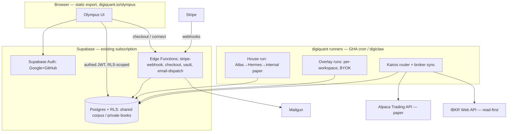

# Kairos + tenancy — final implementation spec

> **Date:** 2026-08-29  
> **Status:** Implementation spec — authorizes filing the epic + task issues; runtime changes still land through per-task PRs with normal gates  
> **Supersedes ambiguity in:** [2026-08-29 milestone brief](../plans/2026-08-29-olympus-kairos-tenancy-milestone-brief.md) (D1–D7 are **locked** here)  
> **Binds to:** [2026-08-25 vision realignment brief](../plans/2026-08-25-olympus-vision-realignment-brief.md), [metaplan](../plans/2026-08-06-olympus-pipeline-metaplan.md), [Wave 3 migration roadmap](../../../digiquant/src/digiquant/olympus/atlas/docs/ops/MIGRATION-ROADMAP-DIGITHINGS.md), [ADR-0004 (Stripe billing)](../../adr/0004-atlas-pricing.md)  
> **Outcome:** Olympus becomes a client-ready product — users sign up, subscribe, hold private books, connect Alpaca/IBKR (paper first), run overlay pipelines with their own LLM keys, and receive email digests.

---

## 0. How to execute this spec (read this first, executor agents)

This spec is written so a smaller model can pick up any single work package (WP) cold. Per WP it gives: goal, exact files, interfaces, behavior rules, edge cases, tests, acceptance, and gates. Global rules that apply to **every** WP:

1. **Read-first, always:** `CLAUDE.md`, `digiquant/AGENTS.md` (for K-track), `frontend/olympus/README.md` (for UI work), plus the WP's own "Read first" list. Never skip a component AGENTS.md.
2. **Branching:** K-track WPs are `component:digiquant` → branch from `module/digiquant` via `make task ISSUE=N` (two-hop). Olympus UI WPs and root docs are one-hop to `develop`. Never branch from a stale base — `make task` enforces `origin/<base>`.
3. **Migration numbers are allocated at execution time** — the next free `digiquant/supabase/migrations/NNN_*.sql` when your PR lands (096+ as of this writing; check, don't assume). Update `digiquant/supabase/SCHEMA.md` in the same PR.
4. **Human gates (hard):**
   - Anything matching `live_trading|execute_trade|place_order|digiquant/**/live/` requires a `Human-Approved-By:` commit trailer (`scripts/hooks/pre-push.sh`). **Deliberate consequence:** live order submission code MUST live under `digiquant/src/digiquant/brokers/live/` so the hook fires. Paper-only code lives outside `live/` but is still policy-gated per `SECURITY.md` criterion 5 — flag broker-adapter PRs for human review regardless.
   - K3 (credential crypto), T1 (auth), T2 (Stripe webhook crypto) → human review per CLAUDE.md human-gate list.
5. **Stack rules:** Pydantic v2 `extra="forbid"` models, `Decimal` never `float` for money/quantities, Polars never pandas, ruff line length 100. Ledger tables are **append-only** — no UPDATE/upsert anywhere near `portfolio_ledger_*`.
6. **Scoring:** `make score` before every PR (≥8 Security, ≥8 Quality, ≥7 Optimization, ≥9 Accuracy).
7. **Tests:** each WP lists its selector. `make test-baseline` is the always-green floor; do not run full `make test-unit` on Linux against Nautilus engine tests (SIGABRT, #42).
8. **Vocabulary:** Digi names lowercase everywhere in prose. "Kairos" in this program means the **execution/connect layer** (sense B in the milestone brief), not the strategy workbench.

---

## 1. Locked decisions

| # | Decision | Ruling | Rationale |
|---|----------|--------|-----------|
| **D1** | Tier content split | **Observer** (free, authenticated): teaser only — Atlas research + Hermes narrative / **digest summary conclusions** + light **portfolio glimpse** (names, not weights/NAV/fills). **No** automations, **no** broker/portfolio connections. **Baseline** (tier 1, paid): full house glass-box + house paper book, read-only. **Custom** (tier 2, paid): overlay profiles, private book, broker connect, BYOK. **Enterprise**: contract (multi-seat, SLA). **Creator/ops exception:** emails in `entitlement_grants` get a `plan_floor` (seeded creator → `custom`) so baseline/Kairos works without Stripe for the operator; everyone else still needs a subscription for full product. **Client products** (FX Hub / future): `client_product_grants` email allowlist, not plan_tier | Free taste without reverse-engineering the PM product; creator unblocked while Stripe/Alpaca captchas block vendor onboarding |
| **D2** | Broker order | **Alpaca paper first**, IBKR second (read-first) | Alpaca: single REST plane, OAuth for third-party apps, paper keys trivial. IBKR: session/gateway model is heavier (§7) |
| **D3** | Live trading in scope? | **No.** Milestone 1+2 ship paper connect + read + paper orders only. Live cutover is a separate, human-gated epic | Repo invariant; also defers the investment-adviser compliance question (§8) |
| **D4** | End-user identity plane | **Supabase Auth** (Google + GitHub OAuth) for Olympus users; **digikey** remains the machine/API plane. Entitlements ride Supabase JWT `app_metadata.plan_tier`, enforced by RLS | Wave 3 D3; one login for dashboard + data plane; digikey untouched (no auth-plane change = no digikey human gate in this program) |
| **D5** | Email provider | **Mailgun** (org already operates it; MCP + skills exist) | No new subprocessor |
| **D6** | Hosting seam | **Keep Olympus static export.** Enforcement moves to the data plane: Supabase Auth + RLS deny-by-default. Server-side needs (Stripe webhooks, checkout session, credential vault, email dispatch) run as **Supabase Edge Functions** + digiquant runner jobs — not a Next server. Revisit OpenNext-on-Workers only if Edge Functions prove insufficient | Zero deploy churn on digiquant.io; uses existing Supabase + Cloudflare subscriptions; a static bundle can never leak what RLS never returns |
| **D7** | Cloudflare Access after T1 | Keep on **staging** only; production auth = Supabase Auth + RLS once T1 ships | Access is an allow-list, not a product login |
| **D8** | Payments provider | **Stripe** — already locked by [ADR-0004](../../adr/0004-atlas-pricing.md). Supabase and Cloudflare are infra planes, **not** payment processors; they host the webhook handler and the site, respectively. Stripe Checkout + Customer Portal + webhooks → `workspaces` billing columns + JWT claim sync | ADR-0004: "No in-house billing code for non-negotiable reasons (PCI, chargebacks, tax)" |
| **D9** | Who pays for overlay research | Subscription covers platform + house corpus reads. **BYOK covers user-initiated LLM spend** (overlay research, private PM deliberation). House budget never pays for profile-forced refresh | Wave 3 F4: "subscription ≠ inference spend" |
| **D10** | External-venue bookkeeping | For broker venues **the broker is authoritative** for fills/positions. digithings keeps an append-only **mirror** (`broker_orders`, `broker_executions`, `broker_position_snapshots`) reconciled by a sync job. The internal `portfolio_ledger_*` chain remains authoritative **only** for `paper_internal`. We do not shoehorn external fills into `portfolio_ledger_paper_executions` | `PaperExecution.id` semantics are pinned to the internal idempotency scheme; external venues have their own ids and partial-fill semantics. Mirroring is honest; forging internal fills is not |

---

## 2. Target architecture



**Identity planes (D4/D8 reconciliation with ADR-0004):** ADR-0004's `atlas-billing → digikey scoped key` flow is for **API/machine** customers (metered backtests). Olympus **consumer** entitlements are simpler: Stripe webhook → `workspaces.plan_tier` + Supabase Auth `app_metadata.plan_tier` → RLS policies read the claim. digikey keys can be minted later for Custom-tier API access without changing this program.

**Privacy boundary (restate — every WP must respect it):**

- Shared / tenant-agnostic: research corpus (`theme:`/`asset:`/`segment:` keys), market data, house research facets.
- Private / workspace-scoped: positions, fills, orders, NAV, mandates, broker connections, BYOK ciphertext, notification prefs, overlay ProfileConfig versions.
- The house run is immutable and always-on. Overlays publish-if-missing into the shared corpus; corpus keys never embed workspace identity.

---

## 3. Data model additions (SQL sketches — final DDL at task time)

New tables (K-track, digiquant migrations). All RLS deny-by-default; `service_role` INSERT/SELECT; append-only triggers mirroring migration 069 where marked.

```sql
-- broker_connections (K3) — one row per (workspace, broker); credentials sealed
CREATE TABLE broker_connections (
  id uuid PRIMARY KEY,
  workspace_id uuid NOT NULL,               -- FK once T0 lands; house operator row uses system workspace
  broker text NOT NULL CHECK (broker IN ('alpaca','ibkr')),
  env text NOT NULL CHECK (env IN ('paper','live')) DEFAULT 'paper',
  auth_kind text NOT NULL CHECK (auth_kind IN ('oauth','api_key')),
  ciphertext bytea NOT NULL,                -- AES-256-GCM envelope: {access_token,refresh_token} | {key_id,secret}
  nonce bytea NOT NULL,
  key_id text NOT NULL,                     -- master-key version for rotation
  fingerprint text NOT NULL,                -- last-4 style display hash; never the secret
  scopes text[] NOT NULL DEFAULT '{}',
  status text NOT NULL CHECK (status IN ('active','revoked','expired')) DEFAULT 'active',
  created_at timestamptz NOT NULL DEFAULT now(),
  revoked_at timestamptz,
  last_used_at timestamptz,
  UNIQUE (workspace_id, broker, env)
);

-- broker_orders (K4) — append-only submission mirror; status change = new row (supersedes_id)
CREATE TABLE broker_orders (
  id uuid PRIMARY KEY,                      -- uuid5(order_intent_id, broker, submitted_date) — deterministic
  connection_id uuid NOT NULL REFERENCES broker_connections(id),
  order_intent_id uuid,                     -- nullable: manual/UI-originated orders have no intent
  client_order_id text NOT NULL,            -- = str(order_intent_id) → broker-side idempotency
  external_order_id text,                   -- broker's id, once acked
  symbol text NOT NULL,
  side text NOT NULL CHECK (side IN ('buy','sell')),
  quantity numeric,                         -- shares XOR notional
  notional numeric,
  order_type text NOT NULL DEFAULT 'market',
  time_in_force text NOT NULL DEFAULT 'day',
  status text NOT NULL,                     -- submitted|accepted|partially_filled|filled|canceled|rejected|expired
  supersedes_id uuid,
  raw_payload_sha256 text,                  -- hash of broker response, payload archived not inlined
  submitted_at timestamptz NOT NULL,
  recorded_at timestamptz NOT NULL DEFAULT now()
);

-- broker_executions (K4) — append-only fill mirror; idempotent on the broker's fill id
CREATE TABLE broker_executions (
  id uuid PRIMARY KEY,                      -- uuid5(connection_id, external_fill_id)
  broker_order_id uuid NOT NULL REFERENCES broker_orders(id),
  external_fill_id text NOT NULL,
  symbol text NOT NULL,
  quantity numeric NOT NULL CHECK (quantity > 0),
  price numeric NOT NULL CHECK (price > 0),
  fee numeric,
  executed_at timestamptz NOT NULL,
  recorded_at timestamptz NOT NULL DEFAULT now(),
  UNIQUE (broker_order_id, external_fill_id)
);

-- broker_position_snapshots (K4 sync) — point-in-time truth pulled from the broker
CREATE TABLE broker_position_snapshots (
  id uuid PRIMARY KEY,
  connection_id uuid NOT NULL REFERENCES broker_connections(id),
  as_of timestamptz NOT NULL,
  positions jsonb NOT NULL,                 -- [{symbol, qty, avg_entry, market_value, unrealized_pl}]
  account jsonb NOT NULL,                   -- {equity, cash, buying_power, currency}
  UNIQUE (connection_id, as_of)
);

-- notification_prefs (K5)
CREATE TABLE notification_prefs (
  workspace_id uuid PRIMARY KEY,
  email text NOT NULL,
  daily_digest boolean NOT NULL DEFAULT false,
  holding_change_alerts boolean NOT NULL DEFAULT false,
  execution_alerts boolean NOT NULL DEFAULT false,
  digest_hour_utc smallint NOT NULL DEFAULT 12 CHECK (digest_hour_utc BETWEEN 0 AND 23),
  updated_at timestamptz NOT NULL DEFAULT now()
);
```

T-track tables (`workspaces`, `workspace_members`, `stripe_events`, `job_runs`, BYOK `workspace_provider_credentials`, tenant columns + RLS rewrite) are specified in [Wave 3 roadmap §P2](../../../digiquant/src/digiquant/olympus/atlas/docs/ops/MIGRATION-ROADMAP-DIGITHINGS.md) — execute as written there with two deltas: (a) `plan_tier` enum is `free | baseline | custom | enterprise` per D1; (b) tenant columns go on the **private** tables listed in §2 above; corpus/documents shared rows live in the system workspace.

---

## 4. Milestone 1 — Kairos work packages

### K0 — Execution contracts (`component:digiquant`, exec:cursor, model:sonnet, risk:low)

**Goal:** typed contracts for venues, connections, and broker order lifecycles; expand `BrokerAdapter` so real adapters have a complete surface to implement.

**Files:**
- New: `digiquant/src/digiquant/brokers/contracts.py`
- Modify: `digiquant/src/digiquant/brokers/base.py`, `digiquant/src/digiquant/brokers/__init__.py`, `digiquant/src/digiquant/brokers/stubs.py` (implement the widened protocol as stubs)
- Tests: `tests/dq/brokers/test_contracts.py`

**Interfaces (style: mirror `hermes/models/portfolio_ledger.py` — `StrEnum` vocabularies, frozen strict base, `Decimal` money, business-rule validators):**

```python
class ExecutionVenue(StrEnum):
    PAPER_INTERNAL = "paper_internal"
    ALPACA_PAPER = "alpaca_paper"
    IBKR_PAPER = "ibkr_paper"
    ALPACA_LIVE = "alpaca_live"      # defined, never routable in this program
    IBKR_LIVE = "ibkr_live"

class BrokerOrderStatus(StrEnum): ...   # submitted/accepted/partially_filled/filled/canceled/rejected/expired
class OrderSide(StrEnum): BUY = "buy"; SELL = "sell"
class TimeInForce(StrEnum): DAY = "day"; GTC = "gtc"; OPG = "opg"; IOC = "ioc"

class BrokerOrderRequest(BaseModel):      # frozen, extra=forbid
    client_order_id: str                  # = str(order_intent_id) when intent-derived
    symbol: Symbol
    side: OrderSide
    quantity: PositiveQuantity | None     # XOR notional — validator enforces exactly one
    notional: Decimal | None
    order_type: str = "market"
    time_in_force: TimeInForce = TimeInForce.DAY

class BrokerOrderAck(BaseModel): ...      # external_order_id, status, submitted_at, raw hash
class BrokerFill(BaseModel): ...          # external_fill_id, qty, price, fee, executed_at
class BrokerPosition(BaseModel): ...      # symbol, qty (signed), avg_entry_price, market_value, unrealized_pl
class BrokerAccountSnapshot(BaseModel): ...  # account_id, equity, cash, buying_power, currency, as_of
```

`BrokerAdapter` protocol gains: `get_account() -> BrokerAccountSnapshot`, `get_positions() -> list[BrokerPosition]`, `submit_order(req: BrokerOrderRequest) -> BrokerOrderAck`, `get_order(external_order_id) -> BrokerOrderAck`, `cancel_order(external_order_id) -> None`, `list_fills(since: datetime) -> list[BrokerFill]`. Keep the legacy positional `submit_order(symbol, side, quantity, order_type)` off the protocol — migrate the stubs.

**Rules:** no live-path names (`place_order`, `execute_trade`) anywhere in this WP; venue enum defines live values but nothing routes them. No I/O in this WP.

**Acceptance:** models validate/reject per XOR + sign rules; stubs satisfy `isinstance(x, BrokerAdapter)`; `pytest -m unit tests/dq/brokers/ -v` green; ruff clean; `digiquant/ARCHITECTURE.md` gains a "Kairos execution contracts" section.

---

### K1 — Alpaca paper adapter (`component:digiquant`, exec:claude, model:sonnet, risk:med, **policy gate: broker adapter — human review**)

**Goal:** a real `AlpacaAdapter` implementing the K0 protocol against **paper** endpoints, supporting both API-key and OAuth-token auth.

**Files:**
- New: `digiquant/src/digiquant/brokers/alpaca.py`
- Modify: `digiquant/pyproject.toml` — optional extra `brokers-alpaca = ["alpaca-py>=…"]` (pin current major at task time; tools-that-gate-CI bounding rule does not apply to runtime deps, but a broker SDK is a behavior-critical boundary — cap to the tested major and comment why, same pattern as the `mcp` extras)
- Tests: `tests/dq/brokers/test_alpaca_adapter.py` (mocked transport — never live HTTP in unit tests), `tests/dq/brokers/test_alpaca_integration.py` behind `-m alpaca_paper` marker + env keys (excluded from CI)

**Behavior spec:** see §6 for the API ground truth. Binding rules:

1. Construction: `AlpacaAdapter(auth=AlpacaAuth, env=BrokerEnv.PAPER)`. `AlpacaAuth` is a tagged union: `ApiKeyAuth(key_id, secret)` | `OAuthAuth(access_token)`. Default and only-permitted env in this program: `paper`. Constructing with `env=live` raises `LiveVenueNotAuthorizedError` unless `DIGIQUANT_ALLOW_LIVE_BROKERS=1` **and** the call site lives under `brokers/live/` (which does not exist yet — deliberate).
2. Idempotency: always set Alpaca `client_order_id` from `BrokerOrderRequest.client_order_id`; on submit failure, query by client order id before retrying (fills survive our crashes).
3. Order mapping: market/limit day orders v1; fractional/notional passes through when `notional` set, **and the adapter enforces Alpaca's rule that notional or fractional qty ⇒ `time_in_force=day`** (reject locally before submit, §6); extended-hours off in v1; recovery after a submit-side crash goes through `get_order_by_client_id` before any retry.
4. Errors: map 401/403 → `BrokerAuthError` (mark connection `expired` upstream), 422 → `BrokerOrderRejected(reason)`, 429 → `BrokerRateLimited(retry_after)` with bounded exponential backoff; never swallow.
5. All money/qty in `Decimal`; parse Alpaca decimal-strings with `Decimal(str_value)`, never float.
6. No secrets in logs — log key `fingerprint` only.

**Acceptance:** unit suite green with mocked transport covering happy path + each error class + idempotent resubmit; one recorded-fixture round-trip (connect → account → submit paper market order → poll ack → cancel → fills); ruff clean; ARCHITECTURE.md updated; PR flagged for human review (broker adapter policy gate).

---

### K2 — IBKR Web API adapter, read-first (`component:digiquant`, exec:claude, model:sonnet, risk:med, **policy gate: broker adapter**)

**Goal:** `IbkrAdapter` implementing account/portfolio **read** + session keepalive; order submit implemented but locked behind `DIGIQUANT_IBKR_ORDERS=1` feature flag (default off).

**Files:** `digiquant/src/digiquant/brokers/ibkr.py`; `tests/dq/brokers/test_ibkr_adapter.py` (mocked transport); `digiquant/docs/brokers/IBKR-NOTES.md` (session/onboarding operational doc); optional extra `brokers-ibkr` in `digiquant/pyproject.toml` if `ibind` is adopted (evaluate at task time vs hand-rolled OAuth 1.0a signing — §7; wrap either behind the K0 protocol).

**Behavior spec:** see §7 for ground truth. Binding rules: the **read path never opens a brokerage session** (portfolio endpoints ride the SSO/live-session layer); session lifecycle is explicit (`connect()` = auth status + live-session establishment; `keepalive()` exposed, the tickle loop is the **caller's** job — no threads inside the adapter); brokerage session init happens only on the flagged order path, defaults `compete=false`, and surfaces "competing session" as a status rather than kicking the user's own login; order submit must handle the reply/confirmation chain (`/iserver/reply/{id}`) with an allowlist of suppressible message ids re-applied after every session init — never auto-confirm anything off the allowlist; respect per-endpoint pacing (1 req/5s on `/portfolio/accounts`, `/iserver/orders`, `/iserver/trades`); document the dedicated-API-username mitigation and vendor-onboarding state in IBKR-NOTES.md.

**Optional K2b (separate small issue, exec:cursor):** Flex Web Service read-only fallback — user pastes Flex Query id + token; nightly holdings import into `broker_position_snapshots`. Gives IBKR users portfolio visibility while OAuth 1.0a vendor onboarding is pending (§7 market evidence).

**Acceptance:** mocked unit suite covering live-session establishment/keepalive/expiry re-auth, positions/summary pagination + pacing guard, and the order reply chain incl. allowlist refusal; feature flag verified default-off by a test; read path proven to never call `ssodh/init` (assert on mock transport); ARCHITECTURE.md + IBKR-NOTES.md; human review flag.

---

### K3 — Credential vault (`component:digiquant` + Edge Function, exec:claude, model:opus, risk:high, **human gate: cryptography**)

**Goal:** sealed storage for broker credentials (and later BYOK LLM keys — same envelope, same table family per Wave 3 P4).

**Design (implement exactly):**
- **Envelope:** AES-256-GCM, random 96-bit nonce per seal, master key from env (`DIGIQUANT_VAULT_MASTER_KEY`, 32 bytes base64) with `key_id` for rotation. One shared implementation in Python (`digiquant/src/digiquant/vault/envelope.py`, `cryptography` lib) — the Supabase Edge Function that accepts user-entered credentials calls the runner-side seal via an internal endpoint or replicates with WebCrypto **against the same test vectors** (`tests/dq/vault/vectors.json`, committed). One implementation of record: Python; the TS side must pass the identical vector suite.
- **Never** log/return plaintext after the seal call; API responses carry `fingerprint` only.
- Migration: `broker_connections` (§3).
- Decrypt only inside the runner job for the duration of the broker call; zero out references after use.
- Audit: connect/revoke events → `audit_log` (Wave 3 P2 table; create it here if T0 has not landed, workspace-nullable until then).

**Acceptance:** seal/unseal round-trip vectors pass in both implementations; unit test proves plaintext absent from repr/logs (capture logging and assert); revoke marks row + subsequent adapter construction fails closed; human sign-off recorded on the PR.

---

### K4 — Intent router + broker mirror sync (`component:digiquant`, exec:claude, model:sonnet, risk:med)

**Goal:** after H9/`execute_at_open`, route approved order intents to the configured venue; mirror external acks/fills/positions per D10.

**Files:**
- New: `digiquant/src/digiquant/olympus/kairos/router.py`, `digiquant/src/digiquant/olympus/kairos/sync.py`, `digiquant/src/digiquant/olympus/kairos/policy.py` (venue resolution)
- New migration: `broker_orders`, `broker_executions`, `broker_position_snapshots` (§3)
- Modify: `digiquant/scripts/atlas/execute_at_open.py` — venue dispatch seam (default `paper_internal`, unchanged behavior)
- Tests: `tests/dq/olympus/kairos/test_router.py`, `test_sync.py`, migration structural test

**Behavior spec:**
1. `resolve_venue(workspace_id | None) -> ExecutionVenue`: house/system → always `PAPER_INTERNAL` (hard-coded, not config); workspace → from execution policy (Custom tier only), default `PAPER_INTERNAL`.
2. `PAPER_INTERNAL` → existing `execution_io` path, byte-for-byte unchanged (regression tests must not change).
3. `ALPACA_PAPER` / `IBKR_PAPER` → build `BrokerOrderRequest` from the pending `OrderIntent` (+ direction from `DecisionIntent.action` via the existing `_directions_by_order` chain — never re-derive from the positions book), submit via adapter, append `broker_orders` row. Deterministic ids (`uuid5`) exactly as §3 comments — a retry collides, never duplicates.
4. Sync job (`kairos.sync`, cron ~5min during market hours for active connections): pull order status + fills since last cursor → append `broker_orders` status rows (supersedes chain) + `broker_executions`; daily positions/account snapshot → `broker_position_snapshots`. **v1 is REST polling** (Alpaca `TradingStream` has no OAuth support; IBKR websocket needs a brokerage session — §6/§7); per-broker budgets: Alpaca ≤6 calls/user/cycle against the ~200 req/min account limit; IBKR ≥5s spacing on paced endpoints. Reconciliation report row when broker positions disagree with our expectation (log + UI-visible flag, never auto-trade to fix).
5. Kill switch: `OLYMPUS_KAIROS_ROUTING` env (default off) — with it off, only `PAPER_INTERNAL` is reachable regardless of policy. Mirrors the `OLYMPUS_PORTFOLIO_LEDGER` pattern.
6. Live venues: `resolve_venue` raising on any `*_LIVE` value is a **test-pinned invariant**.

**Acceptance:** house regression (`pytest -m unit tests/dq/olympus/ -k execution` unchanged); router unit tests per venue incl. kill switch + live-raise; sync idempotency (same fill twice → one row); glass-box rule satisfied — every routed order surfaces in the (T5) UI as a Book change event.

---

### K5 — Email notifications v0 (`component:digiquant` + Edge Function, exec:cursor, model:sonnet, risk:low)

**Goal:** daily digest + holding-change + execution alert emails via Mailgun.

**Files:** `digiquant/src/digiquant/notify/{digest.py,events.py,mailgun.py}`; `notification_prefs` migration (§3); templates `digiquant/src/digiquant/notify/templates/*.html.j2`; dispatch hook at end of daily run + from K4 sync; `tests/dq/notify/`.

**Behavior spec:** digest builder reads the same public views the dashboard reads (tier-filtered: an Observer digest never contains weights/NAV — reuse the T5 gating functions, single source of truth); events are deduped per (workspace, event_key, date) via a `notification_log` table so retries never double-send; Mailgun calls go through one client with API key from env; unsubscribe link required in every template (Mailgun suppression list honored — check suppression before send); all sends fail soft (log + continue) — email must never fail a pipeline run.

**Acceptance:** golden-file tests for digest rendering per tier; dedupe test; no-PII-beyond-email assertion (templates contain no broker ids/keys); suppression-respect test with mocked Mailgun.

---

## 5. Milestone 2 — Tenancy work packages

Execute [Wave 3 roadmap P2–P8](../../../digiquant/src/digiquant/olympus/atlas/docs/ops/MIGRATION-ROADMAP-DIGITHINGS.md) as the detailed schema/acceptance source, with the deltas below. Order: T0 → T1 → T2 → {T3, T5} → T4.

### T0 — Workspaces + RLS privacy boundary (risk:high — data exposure)

Roadmap P2a–P2c with deltas:
- `plan_tier` enum: `free | baseline | custom | enterprise` (D1).
- Tenant columns on the **private** set: `positions`, `position_events`, `nav_history`, `portfolio_metrics`, `portfolio_ledger_*`, `broker_*`, `notification_prefs`, `olympus_profile_config` (overlay rows; house row stays system). Shared corpus/documents/daily_snapshots research facets → system workspace rows.
- RLS: `authenticated` may SELECT system-workspace research rows **when their tier admits the artifact class** (see T5 artifact-class table) and their own workspace's private rows. Writers stay `service_role`.
- **The anon `USING (true)` policies are removed in the same migration that ships login (T1), not before** — sequencing note: do T0 schema + policies behind a feature flag, cut over with T1 so the live dashboard never breaks.
- Acceptance additions: two-JWT RLS proof; anon SELECT returns zero rows on every private table; house run pipeline (service role) unaffected.

### T1 — Supabase Auth login (risk:med; **human gate: auth flow review**)

Roadmap P3. Olympus is static-export (D6): use `@supabase/supabase-js` browser auth (PKCE OAuth, Google + GitHub), session in localStorage, `onAuthStateChange` context provider wrapping `DashboardProvider`. New routes `/login`, `/auth/callback` (static pages — PKCE completes client-side). Every query in `lib/queries.ts` runs through the authed client; signed-out users see the login page, not empty chrome. Cloudflare Access comes **off** production `/olympus/*` in the same release (D7) — coordinate with the owner (dashboard config is human-owned).

### T2 — Stripe tiers (risk:med; **human gate: webhook secret handling**)

Roadmap P4 with deltas: Edge Functions (not Next routes) for `stripe-webhook`, `create-checkout-session`, `customer-portal`; webhook updates `workspaces` billing columns **and** Supabase Auth `app_metadata.plan_tier` (admin API) so RLS/JWT claims stay in sync; idempotency via `stripe_events`; out-of-order protection via event `created` comparison; products: Baseline + Custom monthly/annual (+ Enterprise = manual invoice, flag only). Acceptance: full checkout → active → cancel → downgrade in Stripe test mode; replayed webhook is a no-op; JWT claim visibly updates after refresh.

### T3 — Settings: profile, brokers, notifications (risk:med)

Roadmap P5 with deltas: pages under existing `/settings` (tabs: Profile, Brokers, Notifications, Billing); Profile edits post `InvestmentProfile` / `AssetPreferences` JSON to an Edge Function that validates server-side against the exported v1 JSON schemas (`digiquant/docs/schemas/*.v1.json`) and appends a new `olympus_profile_config` overlay version (never mutates — versions supersede); Brokers tab drives the K3 connect flow (Alpaca OAuth redirect or key entry; IBKR per §7 ruling) and shows fingerprint + status only; Notifications writes `notification_prefs`. The 2026-06-24 Settings plan's "no accounts/login" constraint is **superseded** by this program — note that in the PR description.

### T4 — Overlay pipeline runs (risk:high — cost + isolation)

Roadmap P6–P7 with deltas: job dispatch keys `(workspace_id, job_type, run_date)`; entitlement check = `plan_tier ∈ {custom, enterprise}` AND BYOK present AND subscription `active`; overlay run = ProfileConfig pin (already built, #2609) → publish-if-missing into shared corpus (tenant-agnostic keys — **assert** no workspace id in any corpus key at write time, test-pinned) → user-private H7–H9 book under their workspace → K4 venue routing. Budget: `research_budget_usd` enforced via WP1 telemetry attribution per run; hard-stop + UI-visible "budget exhausted" state. House run isolation: overlay failure must not mark the house run degraded (separate job rows, separate alerting).

### T5 — Tier-gated UI (risk:med)

One artifact-class gate, defined once, enforced twice:

| Artifact class | Observer | Baseline | Custom |
|---|---|---|---|
| Atlas research / theses / corpus identity | ✓ | ✓ | ✓ |
| Hermes narrative (deliberation prose, risk debate) | ✓ | ✓ | ✓ |
| House weights / NAV / tearsheet / ledger / attribution | — | ✓ | ✓ |
| Pipeline glass-box economics (attempts, spend) | — | ✓ | ✓ |
| Private book surfaces, broker status, overlay profile | — | — | ✓ (own workspace) |

Enforcement plane 1: **RLS** (T0) — the payload never reaches an unentitled client (fail closed; the static bundle is untrusted). Enforcement plane 2: UI — locked-state chrome with upgrade CTA (never an empty error). One shared `lib/entitlements.ts` maps JWT claim → artifact classes; vitest table-driven test pins the matrix above; K5 digest builder imports the same map.

---

## 6. Alpaca — API ground truth (official-docs research, 2026-08)

Full sourced detail lives in the research pass attached to the PR; the facts below are binding on K1/K3/K4/T3.

**Product ruling:** user-connects-own-account = **Trading API via OAuth2 ("Connect with Alpaca")**. Broker API is for originating/custodying accounts (white-label/RIA) — out of scope. User-pasted API keys work but OAuth is the sanctioned third-party pattern; support both in K1 (`ApiKeyAuth` for dev/house, `OAuthAuth` for product).

| Fact | Value | Consequence |
|------|-------|-------------|
| OAuth app registration | [Alpaca Connect](https://app.alpaca.markets/connect) dashboard; client id + secret; **Alpaca compliance review by email before third-party use** | Start registration during K1 — review gates T3 launch, not development |
| Authorize URL | `https://app.alpaca.markets/oauth/authorize?...&scope=account:write trading&env=paper\|live` | `env=paper` gives a paper-only consent screen — **paper-first is a first-class OAuth mode**, live later = re-auth with `env=live`, no integration change |
| Token exchange | `POST https://api.alpaca.markets/oauth/token` (server-side only — Edge Function in T3) | Client secret never in the static bundle |
| Token lifetime | **No expiry, no refresh token** (per Alpaca staff; not contractual) | Vault stores one bearer token per (user, env); build revoke/re-auth anyway; treat 401 as `expired` |
| Scopes | `account:write`, `trading`, `data`; default read-only | Request `trading` only for Custom tier connects |
| SDK auth | `TradingClient(oauth_token=..., paper=True)` — officially supported | K1 tagged-union auth stands as specced |
| Environment select | Same token; base URL picks paper vs live | `env` guard in K1 stays the enforcement point |
| Fill events | **No webhooks.** Per-account `trade_updates` websocket; OAuth auth supported on the **raw** ws protocol but **not** by SDK `TradingStream` (key-pair only); ~1 stream connection per account (contention with the user's own tools → 406) | **K4 v1 syncs by REST polling** (`get_orders`/fills since cursor); per-user websocket streaming is a later optimization with hand-rolled ws auth |
| Rate limit | ~200 req/min **per account** (semi-official) | Per-user polling scales naturally; K4 sync budget: ≤6 calls/user per 5-min cycle; honor `X-RateLimit-*` + 429 backoff |
| Orders | `MarketOrderRequest`/`LimitOrderRequest`, `qty` XOR `notional`, `client_order_id` supported | K0 XOR validator confirmed; idempotency via `client_order_id` + `get_order_by_client_id` recovery confirmed |
| Fractional/notional | Requires `time_in_force=day`; asset must be `fractionable`; no fractional shorting | K1 validator: `notional or fractional qty ⇒ TIF=day`, else reject before submit |
| Extended hours | Limit orders + `day`/`gtc` only | v1 keeps `extended_hours=false` (as specced) |
| Crypto | Via Alpaca Crypto LLC (not FINRA/SIPC), TIF `gtc`/`ioc` only | Out of v1 order scope; positions read passes through |
| Paper accounts | Free, multiple per dashboard, $100k default, NBBO fills + random 10% partials, no dividends/borrow | Good enough for integration tests; not an execution-quality oracle |
| Errors | 403 auth, 422 validation (code `42210000` family), 429 rate, `X-Request-ID` on all | K1 error mapping confirmed; always log request id |
| MCP server | Official but single key-pair per instance, no OAuth/multi-tenant | Operator/debug tooling only — **not** a serving-layer dependency |

---

## 7. IBKR — API ground truth (official-docs research, 2026-08)

**Product ruling:** the only viable family for a hosted multi-user SaaS is the **Web API (CPAPI)**. TWS API needs a desktop process per username; FIX is institutional connectivity. Within Web API, the only officially supported hosted flow for a third party is **OAuth 1.0a vendor onboarding**:

| Fact | Value | Consequence |
|------|-------|-------------|
| Third-party access | **OAuth 1.0a only** ("third-party vendors may currently only seek approval for OAuth 1.0a"); compliance questionnaire, legal agreement, RSA keys, consumer key; **~3–5 weeks IBKR-side**, longer in practice; automated trading raises the bar to financial-authority registration or a legal opinion per region | **Start vendor onboarding immediately** (§8); scope the application to include trading even though v1 ships read-first — re-approval for scope changes is a second compliance pass |
| OAuth 2.0 | Enterprise/institutional, management approval; no retail/third-party timeline | Design K2's auth layer swappable 1.0a → 2.0; do not wait for it |
| CP Gateway | Self-hosted Java + interactive 2FA login per ~24h; one username per gateway; retail-documented path but disqualifying UX for SaaS | Rejected for product; acceptable only for a future self-host tier |
| Self-service OAuth 1.0a (user generates own keys) | Works for individuals today but IBKR states "FA/Institutional only" — gray zone | **Dev/testing only** (build K2 against paper with self-service creds); never a product dependency |
| Session model | Access token (long-lived) → live session token (~24h, DH handshake) → brokerage session (`/iserver/auth/ssodh/init`) for `/iserver/*`; keepalive `POST /tickle` ~60s; idle timeout ~5–6 min; `compete` flag controls kicking the user's own TWS/mobile session | K2 exposes `keepalive()`; caller (K4 sync) owns the tickle loop; document the **dedicated second username** mitigation in IBKR-NOTES.md; default `compete=false` and surface "session competing" as a connection status, never silently kick the user |
| Read without brokerage session | `/portfolio/accounts`, `/portfolio/{id}/positions/{page}`, `/summary`, `/ledger` work off the SSO session | **v1 read path never opens a brokerage session** — cleaner and safer |
| Order submit | `POST /iserver/account/{id}/orders` (conid-based, needs contract lookup) with a chained **reply/confirmation** flow (`POST /iserver/reply/{id}`); suppression list per brokerage session via `/iserver/questions/suppress` | K2's reply-allowlist rule confirmed; suppressions must be re-applied after every session init; conid resolution (`/iserver/secdef/search`) is part of the order path |
| Rate limits | Design to **10 req/s per username**; per-endpoint pacing: `/portfolio/accounts` and `/iserver/orders`/`trades` **1 req/5s**, `/pa/*` 1 req/15min; 429 + IP penalty box on abuse | K4 sync for IBKR: ≥5s spacing between paced calls; prefer the websocket (`sor`/`spl` topics) over polling once orders are enabled |
| Websocket | `wss://api.ibkr.com/v1/api/ws`, session id from `/tickle`, needs active brokerage session; `sor` orders / `str` trades / `spl` PnL | Later optimization, gated with order enablement |
| Paper accounts | One per approved (funded, Pro) live account; **separate username**; $1M simulated; Web API works with "minimal differences"; top-of-book fills only | K2 dev target; market-data subscriptions shareable from live user |
| Python client | No first-party CPAPI client; **ibind** (Apache-2.0) is the de-facto standard incl. OAuth 1.0a signing and reply handling | K2 may depend on `ibind` (optional extra `brokers-ibkr`) rather than hand-rolling RSA/DH signing — evaluate at task time; wrap it behind the K0 protocol either way |
| Market evidence | Comparable SaaS (SnapTrade et al.) ship IBKR as **read-only via Flex Web Service** (user pastes Flex Query id + token; no trading) | Confirms K2 read-first scoping; **optional K2b**: Flex-Query read-only fallback so users get IBKR portfolio visibility while vendor approval is pending |

**Net ruling for the program:** Alpaca is the full v1 connect path (OAuth paper → orders). IBKR v1 is **portfolio read** (OAuth 1.0a after vendor onboarding; optionally Flex fallback sooner), with order submit code present but feature-flagged off until onboarding + human gate clear.

---

## 8. Compliance & risk register

| Risk | Class | Disposition |
|------|-------|-------------|
| Automated trading of client accounts may constitute investment advice (RIA registration, suitability) | **Legal/business — not code** | v1 is paper-only (D3), which defers but does not resolve. **Blocker to flag before any live cutover epic**: obtain a legal read on adviser status per target jurisdiction. Track as a standing item on the live-cutover epic, owner: human |
| Broker OAuth app review (Alpaca) / vendor onboarding (IBKR) | Business process | **Start both immediately — they are the program's long poles.** Alpaca: Connect app registration + email compliance review (gates third-party live use). IBKR: OAuth 1.0a vendor onboarding, ~3–5 weeks IBKR-side minimum, automated-trading scope needs financial-authority registration or a legal opinion per region — scope the initial application to include trading to avoid a second pass. Paper development proceeds on personal/self-service keys meanwhile |
| User credential compromise | Security | K3 envelope + fingerprint-only display + revoke path + audit log; master key in deploy secrets only |
| Stripe webhook forgery / replay | Security | Signature verify + `stripe_events` idempotency + out-of-order guard (T2) |
| Cross-tenant leakage | Security | RLS deny-by-default (T0), two-JWT tests, no service-role in any client bundle (existing REM-036 rule) |
| Overlay cost blowout | Financial | D9 BYOK + `research_budget_usd` hard stop (T4) |
| Broker/our-book divergence | Correctness | D10: broker authoritative for external venues; reconciliation report, never auto-correct with trades |
| Email PII | Privacy | K5: email only; templates carry no keys/ids; suppression honored |

---

## 9. Testing matrix (cross-cutting; per-WP tests listed inline)

| Layer | Proof |
|-------|-------|
| RLS | JWT-A cannot read workspace-B rows on every private table; anon reads zero rows post-T1 |
| Tier gates | Table-driven entitlement test = §5 T5 matrix, both in vitest (UI map) and pgTAP/SQL (policies) |
| Billing | checkout→active→cancel→downgrade; replay no-op; out-of-order no-regress; JWT claim sync |
| Vault | Cross-implementation vectors; plaintext-absence; revoke fails closed |
| Router | Venue dispatch incl. kill switch; live-raise invariant; idempotent resubmit/refill |
| House regression | `pytest -m unit tests/dq/olympus/` unchanged before/after every K/T PR |
| E2E (staging) | Sign up → subscribe (test mode) → connect Alpaca paper → overlay run → order routed → fill mirrored → digest email received |

---

## 10. Issue filing plan

**Drafted and ready to file:** the epic + all twelve executor briefings live in
[`docs/agent-backlog/kairos-tenancy/`](../../agent-backlog/kairos-tenancy/README.md)
(`EPIC.md`, `K0.md`–`K5.md`, `T0.md`–`T5.md`) with filing commands, label/model table, wave map,
file-ownership conflict rules, and the cheap-model parallel-dispatch protocol. Each briefing is
self-contained — dispatch one file per agent session. Suggested execution order and parallelism:

```text
K0 ──▶ K1 ──▶ K3 ──▶ K4 ──▶ K5          (K-track, module/digiquant)
        └▶ K2 (parallel with K3/K4)
T0 ──▶ T1 ──▶ T2 ──▶ T3 ──▶ T4          (T-track; T0 schema may start once K4 tables exist to absorb workspace_id)
                 └▶ T5 (parallel with T3)
Gate: T-track UI cutover (T1) waits until K4 paper routing is boring on the house/staging book.
```

Two live end-state epics deliberately **not** filed by this spec: live broker cutover (needs legal read + Human-Approved-By ceremony) and Enterprise workspace multi-seat.
