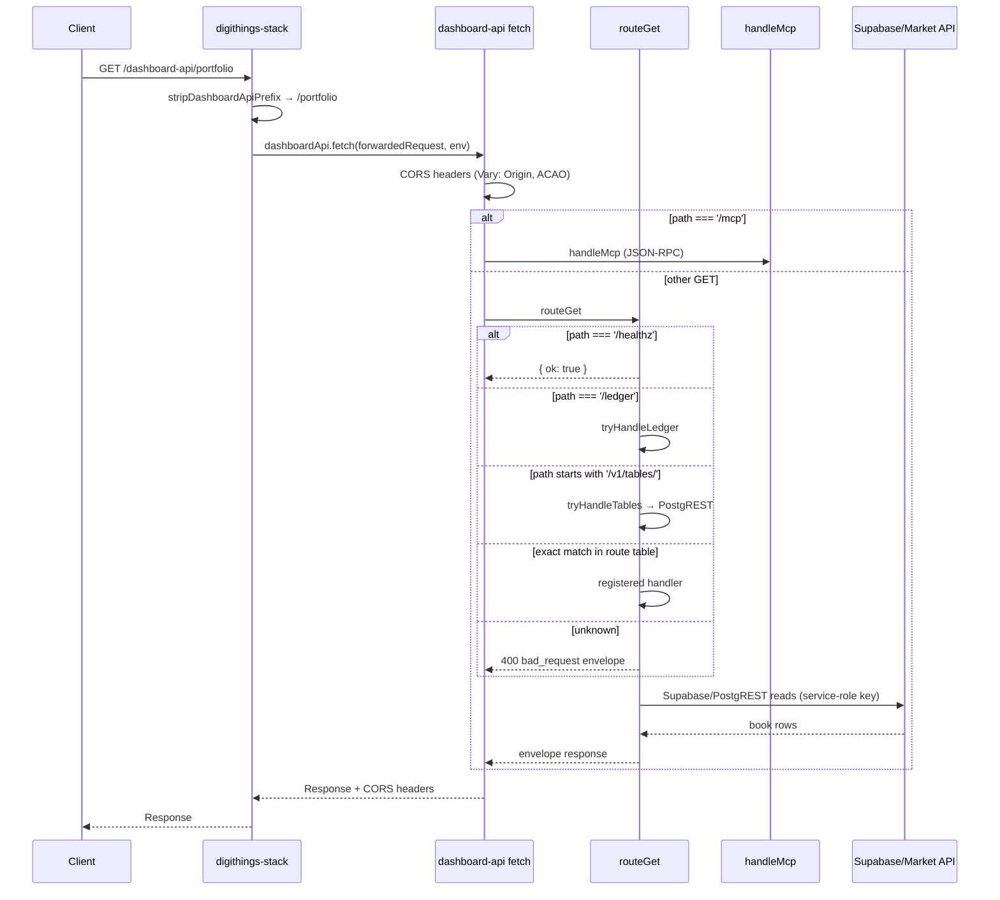
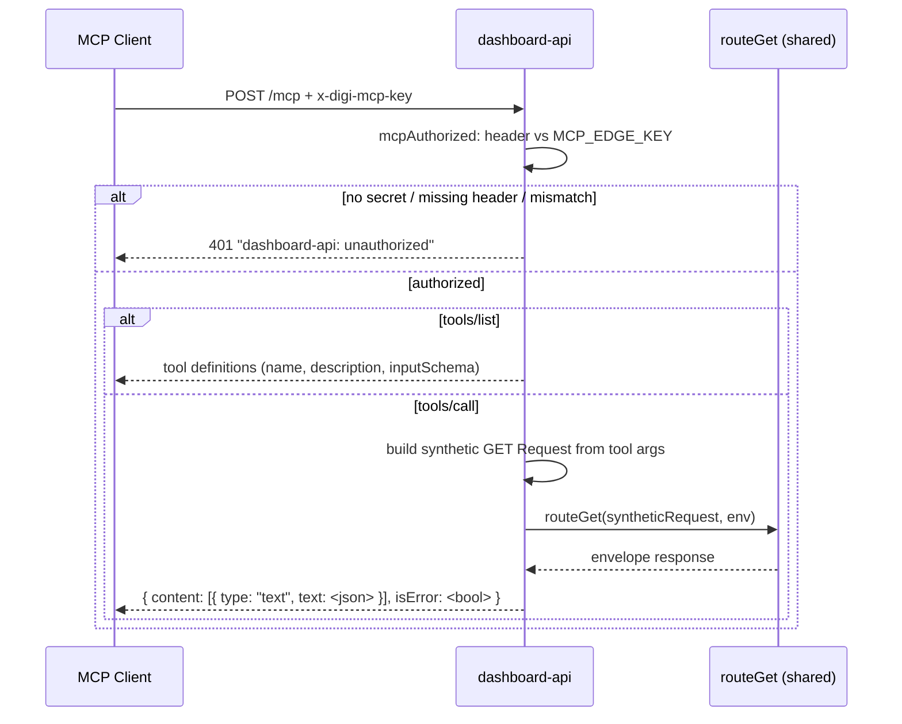
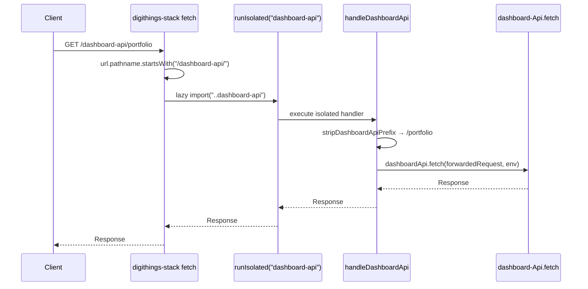

# dashboard-api Routes and Operations

The dashboard-api is a Cloudflare Worker that serves as the central read-only
book-data API for the digiquant dashboard. It replaces per-page `houseBook()` +
`reconcileBook` duplication with a single contract surface. Dashboard surfaces
in `apps/dashboard` become thin renderers over these routes and compute nothing
locally.

All digi product names stay lowercase. No auth surface, JWT, or crypto changes
ship here — the worker adds no new auth and touches no `digikey/` or
`digiquant/brokers/` code.

## Endpoint resolution

The contract names nine functional areas for eight envelope route slots, with
two folds (`/book-date` folded into `/portfolio` as the `book_as_of` object and
`/valuations` folded into `/allocations` as per-row mark fields):

| Method | Path | Contract section |
|--------|------|------------------|
| `GET` | `/portfolio` | §6.1 — committed-book snapshot + invested envelope + folded `book_as_of` gate |
| `GET` | `/allocations` | §6.2 — reconciled allocation rows with folded per-row valuations |
| `GET` | `/brief` | §6.3 — scoreboard KPIs with persisted-vs-overlay decision |
| `GET` | `/performance` | §6.4 — tearsheet bundle: NAV series + benchmark-relative headline |
| `GET` | `/kpis/live` | §6.5 — point-in-time live snapshot (never a stream) |
| `GET` | `/nav-series` | §6.6 — shared NAV + close continuity series |
| `GET` | `/benchmarks` | §6.7 — benchmark universe + aligned series for a NAV window |
| `GET` | `/ledger` | §6.8 — paginated event stream from `position_events` |
| `GET` | `/healthz` | auth-exempt liveness probe, returns `{"ok": true, "service": "dashboard-api"}` |
| `GET` | `/v1/tables/:table` | §7 — generic allowlisted PostgREST proxy (bare row array, no envelope) |

There is no standalone `/book-date` route — it is folded into `GET /portfolio`.

## Global conventions

- **All routes are `GET` and read-only.** No request body anywhere.
- **Common query params on every route:** `asOf?: string` (`YYYY-MM-DD` calendar
  date; default = latest committed) and `retrieval_pin?: string` (opaque
  caller-supplied correlation id, max 128 chars).
- **Success envelope** (all eight routes above except `/healthz` and
  `/v1/tables/*`): an object with `data`, `as_of`, `retrieval_pin` (echo of the
  caller's pin), and `provenance`.
- **`/v1/tables/:table`** returns a bare row array with no envelope and no
  `retrieval_pin` echo — the pin is accepted and ignored.
- **House workspace pinning:** every Group A book read filters
  `workspace_id = 6b753576-ced9-5319-9bfa-c5d0aacd9319` (the public book
  selector matching `houseBook()` and the Python `house_workspace_id()` uuid5
  `house` slug). Overlay workspace rows are excluded server-side. The UUID is a
  selector, not a secret.

### Provenance badges

Every success response carries a `provenance` object describing the source of
the displayed numbers:

```json
{
  "source": "string",
  "tip_date": "string | null",
  "contract": "finalized_accounting" | "legacy_estimate" | null,
  "seam": false,
  "marks": "stored" | "market_api" | "unavailable"
}
```

`contract` is `finalized_accounting` when the NAV tip row has
`contract: finalized_accounting` or `source: finalized_accounting`, otherwise
`legacy_estimate`. `seam` is true when the tip crosses a NAV source boundary
(no derived day return across seams). `marks` is `stored` when the nightly
metrics stamp is present on every open-book row, `market_api` when marks were
filled from `GET /v1/market/closes`, and `unavailable` otherwise.

### `retrieval_pin` passthrough

`retrieval_pin` is an opaque string the caller supplies (for example a
digisearch/digigraph retrieval correlation id). The API never interprets it: it
echoes the exact value back in every success (`retrieval_pin` top-level) and
every error (`error.retrieval_pin`, null when absent), and forwards it unchanged
to any upstream market-data fetch so traces join across the hop. Max length 128;
longer values are rejected with `bad_request`.

### Common param validation

`asOf` and `retrieval_pin` are validated by `parseCommonParams` in
`src/index.ts`:

- `asOf` must be a valid calendar date `YYYY-MM-DD` (checked with
  `AS_OF_RE = /^\d{4}-\d{2}-\d{2}$/` plus `Date` round-trip validation).
  Malformed dates → `bad_request` (400).
- `retrieval_pin` if present must be ≤ 128 characters. Longer → `bad_request`
  (400).

Validation errors follow the standard error envelope (§2).

### CORS

Every response carries `Vary: Origin` plus `Access-Control-Allow-Origin`
(echoed) and `Access-Control-Allow-Methods: GET, OPTIONS` when the request
`Origin` exactly matches the allowlist. The allowlist defaults to
`https://digiquant.io`, `https://digithings.ai`, and localhost/127.0.0.1 dev
ports (3000, 3100, 3101); override via `DASHBOARD_API_ALLOWED_ORIGINS` env var.
`OPTIONS` preflights return `204` with the same headers
(`Access-Control-Max-Age: 86400`).

## Error envelope

All failures return HTTP status + exactly this body (no other shape):

```json
{
  "error": {
    "code": "string",
    "message": "string",
    "details": {},
    "retrieval_pin": "string | null"
  }
}
```

Error codes and their HTTP statuses:

| Code | Status | When |
|------|--------|------|
| `bad_request` | 400 | Malformed `asOf`/`retrieval_pin`/params, unknown route |
| `not_found` | 404 | No committed book or tip for the requested `asOf` |
| `upstream_empty` | 502 | Required upstream read (Supabase or market API) fails — never synthesize numbers |
| `internal` | 500 | Unexpected failure |

Empty sessions (for example a ledger with no events in range) are success with
empty arrays plus honest `provenance`, never errors.

## Route dispatch: how the router works

Request dispatch is in `src/index.ts` through the `fetch` handler (`export
default`). The flow:



Route dispatch is built per request from `env`:

1. If `SUPABASE_SERVICE_ROLE_KEY` is present, real Supabase reads are used
   (`createSupabaseSource`).
2. Otherwise, clearly-marked stub doubles in `./stubs` serve (local tests,
   secretless dev).

Every route handler is wrapped by `failClosed`, which catches `UpstreamError`
and maps it to `upstream_empty` (502) — never a silent stub fallback in
production.

## Endpoint details

### `GET /portfolio` (§6.1)

Committed-book snapshot + invested envelope + folded `book_as_of` gate. Query:
`asOf?`, `retrieval_pin?`.

Response `data` includes:
- `book_as_of`: committed book date (gate from `committedBookDate`)
- `nav_tip`: latest NAV row with `contract` badge, `invested_pct`, `cash_pct`,
  and seam-guarded `day_return_pct` (null across NAV seams or calendar gaps > 4
  days)
- `seam`: `crosses_nav_seam`, `lag_days`, `lag_direction`
- `invested`: `kpi_pct` (raw unclamped KPI), `envelope_pct` (clamped-100
  envelope), `cash_pct`, and `definition` naming the winning source
  (`accounting_nav_tip` | `book_weights` | `portfolio_metrics` | `unavailable`)
- `positions`: reconciled rows inside the clamped-100 `reconcileBook` envelope

Invested precedence: NAV tip `invested_pct` → non-CASH `positions.weight_pct`
sum on the committed book → `portfolio_metrics.invested_pct` → null. CASH is
always excluded from holding counts.

### `GET /allocations` (§6.2)

Reconciled allocation rows with per-row valuations. Consumes the same committed
book as `/portfolio`. Query: `asOf?`, `retrieval_pin?`,
`include_marks?: boolean` (default true).

Each row carries `entry_price`, `current_price`, `unrealized_pct`, `marks` (one
of `stored`, `market_api`, `unavailable`), and `marks_as_of`. Valuation
precedence: stored `unrealized_pnl_pct` / `since_entry_return_pct` → derived
from `entry_price` vs `current_price` → market API fill (`GET /v1/market/closes`,
R2-API-only) → fail closed to null. Mid-session NULL marks affect marks only,
never weights.

`marks_unstamped` is true when the open book is empty or any row lacks
`metrics_as_of`.

### `GET /brief` (§6.3)

Scoreboard KPIs with the persisted-vs-overlay decision made in one place. Query:
`asOf?`, `retrieval_pin?`, `overlay?: "auto" | "off"` (default `"auto"`).

Response includes `nav_tip`, `day_return_pct` (seam-guarded),
`since_inception_pct`, `since_inception_start_date`, `overlay` object
(`active`, `live_vs_mark_pct`, `badge`), `invested_pct`, and
`session_events`. The live overlay engages only when `|liveVsMarkPct| > 0`,
and the tile is labeled `live marks` — never finalized accounting.
Overlay-off output matches the Tearsheet headline within 0.05pp tolerance
(`PERSISTED_KPI_TOLERANCE_PP = 0.05`).

### `GET /performance` (§6.4)

Tearsheet bundle: one contracted NAV series (base-100 continuity index),
benchmark-relative headline, overlap-gated alpha/IR. Query: `asOf?`,
`retrieval_pin?`, `benchmark?: string` (default `SPY`),
`window?: "inception" | "1y" | "6m" | "3m"` (default `"inception"`).

Response includes `nav` (tip, base-100 tip, points), `metrics` (day return,
since inception %, excess return %, alpha, IR, beta, overlap days), `benchmark`
(ticker, aligned start), `stale` (lag days, direction, metrics as of), and
`ssot` (full `PerformanceSsotMeta` including `bookAsOf`, `investedDefinition`,
`marksUnstamped`, `tipCashPct`, `tipInvestedPct`).

Alpha (Jensen) and IR require ≥ 20 overlapping daily return pairs
(`MIN_OVERLAP_DAYS = 20`) — null below the floor, never invented from endpoints.
Lag is signed UTC calendar days and symmetric (`metrics lag` / `nav lag`).

### `GET /kpis/live` (§6.5)

Point-in-time live snapshot. Query: `retrieval_pin?` (no `asOf` — always latest
quotes). Response includes `quote_date`, `live_vs_mark_pct`,
`day_return_live_pct`, `since_inception_live_pct`, `excess_live_pct`,
`overlay_eligible`, and `universe`. `overlay_eligible` is false when
`liveVsMarkPct === 0` or the book's `current_price` marks are all NULL. Numbers
here are `live marks` by definition and must never be labeled finalized
accounting.

This route is a snapshot only, not a stream. Realtime stays client-side: live
marks arrive via Supabase Realtime `postgres_changes` on `prices_live`.

### `GET /nav-series` (§6.6)

Shared NAV + close continuity series. Query: `retrieval_pin?`, `from?: string`,
`to?: string` (default = full history). Response includes `tip` (date,
contract) and `points` (date, nav, day return, contract, index). Per-point
contract labels are preserved so consumers can badge tip flips. Calendar gaps
≤ 4 days forward-fill flat; seam basis changes carry flat, never draw a phantom
return.

### `GET /benchmarks` (§6.7)

Benchmark universe + aligned series for a NAV window. Query: `retrieval_pin?`,
`tickers?: string` (comma-separated, 1-20 symbols; default = universe from
`GET /v1/market/tickers`), `from?: string`, `to?: string`.

Universe resolution: explicit `tickers` win; else the market-API universe; else
the dashboard key list (`DASHBOARD_BENCHMARK_TICKERS`: SPY, QQQ, DIA, IWM, VTI,
EEM, TLT, IEF, AGG, HYG, GLD, SLV, USO, UUP, IBIT, BITO, EFA). Each series
aligns to NAV dates with as-of forward fill. R2-API-only — no Supabase fallback
at any step.

### `GET /ledger` (§6.8)

Paginated event stream from house-pinned `position_events`. Query: `asOf?`,
`retrieval_pin?`, `ticker?: string`, `limit?: number` (default 50, max 500),
`cursor?: string` (opaque base64url cursor encoding offset).

Response includes `events` array and `next_cursor`. Event types:
`OPEN | ADD | EXIT | TRIM`. Realized % for sells is vs average entry (sold
weight = `prev_weight_pct − weight_pct`); fail closed without fill price or cost
basis. Empty range → success with `"events": []` plus honest provenance.

Economics logic in `./ledger.ts` mirrors `apps/dashboard/lib/position-event-economics.ts`
exactly (`ledgerEventEconomics`, `averageEntryAsOf`, `realizedReturnVsAverageEntry`,
`soldWeightPct`).

### `GET /healthz`

Auth-exempt liveness probe. Always returns `{"ok": true, "service": "dashboard-api"}`.
Not envelope-wrapped — a plain health response.

### `GET /v1/tables/:table` (§7)

Generic allowlisted PostgREST proxy. Returns a bare row array (no envelope, no
`retrieval_pin` echo). Allowlisted tables: `daily_snapshots`, `positions`,
`instruments`, `theses`, `portfolio_metrics`, `documents`, `position_events`,
`macro_series_observations`, `decision_log`, `run_health`,
`position_attribution`, `run_event_trace`, `public_accounting_nav_history`,
`thesis_vehicles`, `analyst_coverage`, `public_daily_realized_attribution`.

Query language: `select?` (comma list, default `*`), repeatable
`order=<col>.<asc|desc>`, `limit?` (default 100, cap 5000), `offset?`, and
repeatable filters `eq.<col>=<v>`, `ilike.<col>=<pattern>`,
`like.<col>=<pattern>`, `in.<col>=(a,b)`, `lt|lte|gt|gte.<col>=<v>`.

House scoping enforced server-side:
- `positions`, `position_events`, `portfolio_metrics` → `workspace_id = eq.<house>`
- `documents` → `workspace_id = in.(<house>,<system>)` (matching anon RLS in
  migration `110_anon_house_only_private_books.sql`)

Unknown tables → `not_found` (404). No stub lane — without the service-role key
the route fails closed (`upstream_empty`, 502).

## MCP JSON-RPC tools

`POST /mcp` exposes all eight envelope routes as JSON-RPC 2.0 tools for MCP
clients. The path is mounted directly in the worker dispatch (not a separate
service).

### Tool definitions

Eight tools, one per read-only route group:

| Tool name | Path | Extra params |
|-----------|------|-------------|
| `get_portfolio` | `/portfolio` | `asOf`, `retrieval_pin` |
| `get_allocations` | `/allocations` | `asOf`, `retrieval_pin`, `include_marks` |
| `get_brief` | `/brief` | `asOf`, `retrieval_pin`, `overlay` |
| `get_performance` | `/performance` | `asOf`, `retrieval_pin`, `benchmark`, `window` |
| `get_kpis_live` | `/kpis/live` | `retrieval_pin` |
| `get_nav_series` | `/nav-series` | `asOf`, `retrieval_pin`, `from`, `to` |
| `get_benchmarks` | `/benchmarks` | `retrieval_pin`, `tickers`, `from`, `to` |
| `get_ledger` | `/ledger` | `asOf`, `retrieval_pin`, `ticker`, `limit`, `cursor` |

### Secret gating

MCP access is secret-gated with the same pattern as `/_stack/mcp`:

- Header: `x-digi-mcp-key`
- Secret: `MCP_EDGE_KEY` env var (set via `wrangler secret put`)
- Fail closed: no secret configured → deny all (401); missing header → 401;
  mismatch → 401.
- The 401 response is a plain text body `dashboard-api: unauthorized` (no
  envelope), matching the stack precedent.



### Protocol details

- JSON-RPC 2.0 `tools/list` returns all eight tool definitions.
- `tools/call` builds a synthetic GET `Request` from the tool arguments
  and runs it through the worker's own `routeGet` dispatch. The MCP
  response is byte-identical to the HTTP response from the same builder
  functions.
- Tools NEVER reimplement route logic.
- JSON-RPC errors: `-32700` (parse error), `-32600` (invalid request),
  `-32601` (unknown method), `-32602` (unknown tool / bad arguments).
- Batch (array) requests are supported.

## Stack fold: `/dashboard-api/*` on digithings-stack

The dashboard-api is folded into the digithings-stack worker under the
canonical module path `/dashboard-api/*` so it shares the stack's domain and
infrastructure. The fold is in `apps/digithings-stack-cloudflare/src/dashboard-api.ts`.

### How the fold works



1. The stack worker checks `url.pathname === "/dashboard-api" ||
   url.pathname.startsWith("/dashboard-api/")`.
2. If matched, it calls `runIsolated("dashboard-api", () =>
   import("./dashboard-api"), ...)`.
3. `handleDashboardApi` strips the `/dashboard-api` prefix, constructs a new
   `Request` with the remaining path, and forwards it to
   `dashboardApi.fetch()`.
4. The same CORS allowlist logic from the standalone worker applies unchanged.

### Fault isolation

The `runIsolated` helper provides per-module fault isolation:

- The `dashboard-api` module loads lazily via `import()` — a dynamic import
  failure (bundle error, missing dependency) affects only `/dashboard-api/*`
  paths.
- Handler failure (thrown exception, upstream timeout) degrades only
  `/dashboard-api/*` paths.
- Both failure modes return **503** with body
  `digithings-stack: dashboard-api unavailable: <error message>`.
- Every other route group (key-proxy, mcp-edge, market-data, digichat,
  container-routes) keeps serving normally.
- Module health is tracked in `GET /_stack/status` under
  `modules.dashboard-api` with states `loaded` or `degraded`.

### Identity

The fold keeps the same handlers and one dispatch. `POST /dashboard-api/mcp`
routes through the same `handleMcp` function as the standalone worker, and the
eight MCP tools are re-exported from the stack as `DASHBOARD_MCP_TOOLS` for
merge. HTTP and MCP responses stay byte-identical between standalone and folded
deployments.

## Operations

### Secrets

| Secret | Purpose | How set |
|--------|---------|---------|
| `SUPABASE_SERVICE_ROLE_KEY` | House-book reads via PostgREST | `wrangler secret put SUPABASE_SERVICE_ROLE_KEY` |
| `MCP_EDGE_KEY` | Secret-gate for `POST /mcp` | `wrangler secret put MCP_EDGE_KEY` |

`SUPABASE_SERVICE_ROLE_KEY` lives **only** in worker secrets — never in the
static bundle, no `NEXT_PUBLIC_` service key. Without it, all book endpoints
fail closed with `upstream_empty` (502). `SUPABASE_URL` is set as a worker var
in `wrangler.toml` (pointing to `https://rwagjbkvxkdwqmouagad.supabase.co`).

Optional env vars:
- `DASHBOARD_API_ALLOWED_ORIGINS` — comma-separated CORS allowlist override
- `MARKET_DATA_URL` — market API base URL for closes/tickers (used by real
  source; when unset, market closes resolve to empty maps)

### Deploy

CI/CD via [`.github/workflows/deploy-dashboard-api.yml`](repo://.github/workflows/deploy-dashboard-api.yml):
path-filtered push to `develop`/`main` on `apps/dashboard-api/**` changes plus
`workflow_dispatch`. The workflow runs `npm run test` + `npm run typecheck`
before `wrangler deploy`, injecting `SUPABASE_SERVICE_ROLE_KEY` from GitHub
secrets.

Manual deploy:
```bash
npm run deploy --workspace dashboard-api
```

### Dev and test commands

```bash
# Local dev server (standalone, no stack)
npm run dev --workspace dashboard-api

# Run vitest suites
npm run test --workspace dashboard-api

# Typecheck
npm run typecheck --workspace dashboard-api
```

### Test coverage

Vitest suites covering the full contract:

| Suite | What it covers |
|-------|---------------|
| `src/index.test.ts` | Error envelope shape, provenance defaults, common-param validation, `/healthz`, unknown-route 400, no standalone `/book-date` |
| `src/envelope.test.ts` | `mountEnvelopeRoutes` registration, `/portfolio` + `/allocations` + `/nav-series` handlers against stub source, envelope/provenance shapes, pin passthrough |
| `src/brief.test.ts` | `buildBriefData`, overlay decision, seam-guarded day return, `parseBriefQuery` validation |
| `src/performance.test.ts` | `getPerformanceBundle`, seam/null guards, SSPOT integration, `parsePerformanceQuery` |
| `src/kpis-live.test.ts` | Live KPIs, `overlay_eligible` gating, `computeLiveVsMarkPct` |
| `src/benchmarks.test.ts` | Universe resolution, series alignment, overlap floor |
| `src/ledger.test.ts` | Event economics (parity with client), cursor encoding, empty-range success |
| `src/book.test.ts` | `reconcileBook` parity with client (dedupe, CASH exclusion, clamp) |
| `src/ssot.test.ts` | Shared SSOT kernel — continuity series, seam detection, benchmark alignment |
| `src/mcp.test.ts` | Secret gate (401 on missing/wrong/no-key), `tools/list` coverage, `tools/call` dispatch, JSON-RPC error codes |
| `src/wiring.test.ts` | Every contracted route reachable through stub doubles with envelope + provenance |
| `src/validation.test.ts` | Byte-for-value parity: worker stub responses vs real client derivations from `apps/dashboard/lib/*` |

### Stack-local verify curls

When running the stack worker locally:
```bash
# Health check
curl http://localhost:8787/dashboard-api/healthz

# Portfolio (through the fold)
curl http://localhost:8787/dashboard-api/portfolio

# MCP tools/list (needs MCP_EDGE_KEY set)
curl -X POST http://localhost:8787/dashboard-api/mcp \
  -H 'x-digi-mcp-key: test-key' \
  -H 'content-type: application/json' \
  -d '{"jsonrpc":"2.0","id":1,"method":"tools/list"}'
```