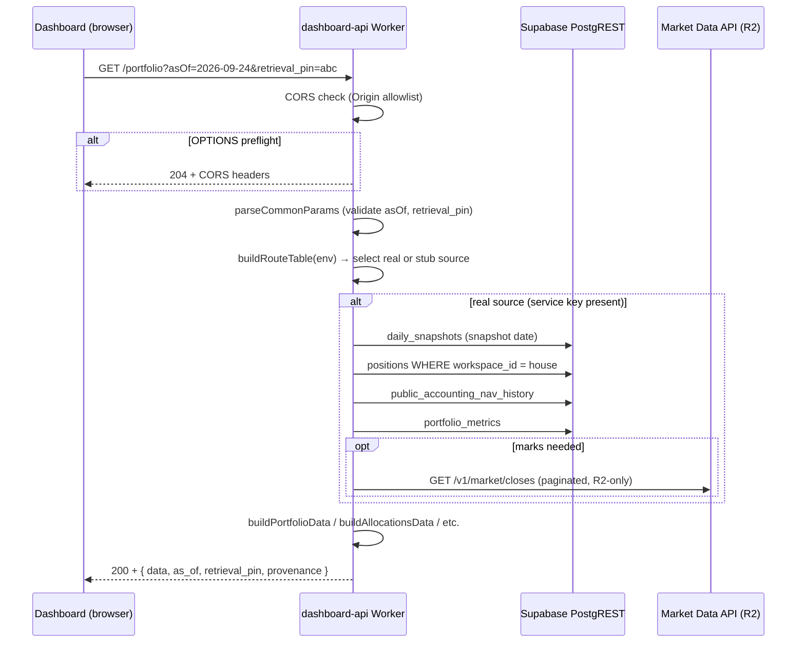

# dashboard-api Architecture

The dashboard-api (`apps/dashboard-api`) is a Cloudflare Worker that serves as the
central read-only API for the dashboard. It replaces all direct Supabase reads
from the browser with a single worker-held service-role key, and exposes eight
contracted route groups plus generic table reads and a JSON-RPC MCP surface. The
dashboard frontend (`apps/dashboard`) becomes a thin renderer over these routes
and computes nothing locally.

The worker is governed by a detailed contract at
`apps/dashboard-api/CONTRACT.md` and implemented slice-by-slice in TypeScript
under `apps/dashboard-api/src/`. All digi product names stay lowercase
(`digithings`, `digiquant`, `digichat`). Auth, JWT, and live-trading paths are
untouched — this worker adds no new auth surface.

## Worker scaffold

The worker is a standalone Cloudflare Worker deployed via wrangler:

- **Entrypoint:** `src/index.ts` exports a default `fetch` handler.
- **Runtime:** TypeScript, compiled by wrangler/esbuild, no containers.
- **Secrets:** `SUPABASE_SERVICE_ROLE_KEY` and `MCP_EDGE_KEY` live only in
  worker secrets (`wrangler secret put`). Never in the static bundle.
- **Config:** `wrangler.toml` sets `workers_dev = true` and defines
  `SUPABASE_URL` as a plain var (the URL alone is not a secret). Observability
  is enabled.
- **Deploy:** GitHub Actions workflow at
  `.github/workflows/deploy-dashboard-api.yml`, path-filtered on push to
  `develop`/`main`.

## Request flow

Every incoming HTTP request follows a single path through the worker:



All handler logic is pure: the builders (`portfolio.ts`, `allocations.ts`,
`brief.ts`, `performance.ts`, `kpis-live.ts`, `benchmarks.ts`, `ledger.ts`)
contain no network I/O and import no runtime secrets. The route layer in
`src/index.ts` resolves the data source (real Supabase or stub doubles) and
injects it into the builders.

## Fail-closed design

The worker **never synthesizes data**. Every upstream read that fails closes the
route with a `502` (`upstream_empty`) error envelope — never a silent fallback,
never an empty success masquerading as healthy.

The fail-closed mechanism works through three layers:

1. **`UpstreamError`** (`src/supabase.ts`): thrown by `supaGet()` on any non-OK
   PostgREST response. Carries the upstream HTTP status and body.
2. **`failClosed` wrapper** (`src/index.ts`): wraps every registered route
   handler. Catches `UpstreamError` and maps it to the contract §2
   `upstream_empty` (502) envelope.
3. **No stub fallback in production**: when `SUPABASE_SERVICE_ROLE_KEY` is
   present, `createSupabaseSource()` provides real readers. When it is absent
   (tests, secretless dev), `buildRouteTable` routes through the clearly-marked
   `./stubs` test doubles. An `UpstreamError` thrown by a real reader is never
   caught and served by stubs.

Market data reads (closes, tickers, benchmark history) follow the R2-API-only
rule: when `MARKET_DATA_URL` is unset or the API returns non-OK, the result is
an empty map/array — the builders flow the honest-empty path. Market closes
never fall back to Supabase.

## House workspace pinning

Every book-backed read is scoped to the house workspace. The workspace UUID is
hardcoded as a selector (not a secret):

```typescript
HOUSE_WORKSPACE_ID = "6b753576-ced9-5319-9bfa-c5d0aacd9319"
```

This UUID matches `houseBook()` in the dashboard client and the Python
`house_workspace_id(uuid5('house'))`. It is applied server-side for three
categories:

| Table(s) | Pin |
|---|---|
| `positions`, `position_events`, `portfolio_metrics` | `workspace_id = eq.{house}` |
| `documents` | `workspace_id = in.({house},{system})` (anon RLS parity) |
| `daily_snapshots`, `theses`, `instruments`, and others | No pin (shared, date-only) |

The dashboard client sends no `workspace_id`. The worker appends the pin before
forwarding to PostgREST. Overlay workspace rows are excluded even when RLS would
allow them for the caller JWT. Accounting NAV reads go through
`public_accounting_nav_history` (a security definer view).

## Route table

The worker exposes ten route patterns, all `GET` and read-only:

### Contracted specific routes (CONTRACT §6)

These eight routes return the full envelope with `data`, `as_of`,
`retrieval_pin`, and `provenance`:

| Route | Source module | Query params |
|---|---|---|
| `GET /portfolio` | `envelope.ts` → `portfolio.ts` | `asOf?`, `retrieval_pin?` |
| `GET /allocations` | `envelope.ts` → `allocations.ts` | `asOf?`, `retrieval_pin?`, `include_marks?` |
| `GET /nav-series` | `envelope.ts` → `nav-series.ts` | `asOf?`, `retrieval_pin?`, `from?`, `to?` |
| `GET /brief` | `brief.ts` | `asOf?`, `retrieval_pin?`, `overlay?` |
| `GET /performance` | `performance.ts` | `asOf?`, `retrieval_pin?`, `benchmark?`, `window?` |
| `GET /kpis/live` | `kpis-live.ts` | `retrieval_pin?` (no `asOf`) |
| `GET /benchmarks` | `benchmarks.ts` | `retrieval_pin?`, `tickers?`, `from?`, `to?` |
| `GET /ledger` | `ledger.ts` | `asOf?`, `retrieval_pin?`, `ticker?`, `limit?`, `cursor?` |

The `/book-date` endpoint does not exist as a standalone route — it is folded
into `GET /portfolio` as the `book_as_of` field. `/valuations` is folded into
`GET /allocations` as per-row mark/unrealized fields.

### Infrastructure routes

| Route | Purpose |
|---|---|
| `GET /healthz` | Liveness probe, auth-exempt, always `{"ok": true, "service": "dashboard-api"}` |
| `GET /v1/tables/:table` | Allowlisted generic table reads (bare row array, no envelope) |
| `POST /mcp` | JSON-RPC tools/list + tools/call (secret-gated) |

### Route dispatch flow

<!-- openwiki: mermaid parse failed and this diagram was converted to a text fence so it does not break rendering. Fix the diagram source and restore the mermaid fence. Parser error: Parse error on line 21: ...thCheck ->|starts "/v1/tables/"| Tables Expecting 'SQE', 'DOUBLECIRCLEEND', 'PE', '-)', 'STADIUMEND', 'SUBROUTINEEND', 'PIPE', 'CYLINDEREND', 'DIAMOND_STOP', 'TAGEND', 'TRAPEND', 'INVTRAPEND', 'UNICODE_TEXT', 'TEXT', 'TAGSTART', got 'STR' -->
```text
flowchart TD
    Start["fetch(request, env)"]
    CORS["CORS headers (Origin allowlist, Vary: Origin)"]
    Preflight{"OPTIONS?"}
    PreflightResp["204 + CORS headers"]
    PathCheck{"pathname"}
    MCP["handleMcp (secret-gate, JSON-RPC dispatch)"]
    Healthz["handleHealthz"]
    Ledger["tryHandleLedger"]
    Tables["tryHandleTables"]
    RouteTable["routes.get(method + ' ' + path)"]
    NotFound["400 bad_request"]

    Start --> CORS
    CORS --> Preflight
    Preflight -->|yes| PreflightResp
    Preflight -->|no| PathCheck
    PathCheck -->|"/mcp"| MCP
    PathCheck -->|"/healthz"| Healthz
    PathCheck -->|"/ledger"| Ledger
    PathCheck -->|starts "/v1/tables/"| Tables
    PathCheck -->|other| RouteTable
    RouteTable -->|found| Build["dispatch to builder"]
    RouteTable -->|not found| NotFound
```

All route handlers are wrapped with `failClosed` (catches `UpstreamError` →
502). Unknown routes return a `400 bad_request` envelope, never a raw 404.

Common query params on every route: `asOf` (`YYYY-MM-DD`, default latest
committed) and `retrieval_pin` (opaque caller-supplied pin, max 128 chars).
Both are validated in `parseCommonParams()` (`src/index.ts`).

## Error envelope

All failures return a single shape (CONTRACT §2):

```json
{
  "error": {
    "code": "string",
    "message": "string",
    "details": {},
    "retrieval_pin": "string | null"
  }
}
```

Four error codes with corresponding HTTP statuses:

| Code | Status | Trigger |
|---|---|---|
| `bad_request` | 400 | Malformed `asOf`, `retrieval_pin` > 128 chars, unknown route, bad filter syntax |
| `not_found` | 404 | No committed book or tip for `asOf`, unknown table |
| `upstream_empty` | 502 | Required upstream read failed (PostgREST non-OK, market API failure) |
| `internal` | 500 | Unexpected runtime error |

Empty sessions (e.g., ledger with no events in range) are **success** with empty
arrays and honest `provenance`, never errors. The API fails closed to `null`/`—`
— never invents P&L, fills, or weights.

## Provenance schema

Every success response on the eight specific routes carries a `provenance`
object (CONTRACT §1):

```typescript
interface Provenance {
  source: string;          // e.g. "public_accounting_nav_history+daily_snapshots+positions"
  tip_date: string | null; // Latest NAV date, null when empty
  contract: "finalized_accounting" | "legacy_estimate" | null;
  seam: boolean;           // True when the NAV tip crosses a source seam
  marks: "stored" | "market_api" | "unavailable";
}
```

The `contract` badge comes from `navRowContractLabel()` in the shared SSOT
kernel: rows with `contract === 'finalized_accounting'` or
`source === 'finalized_accounting'` get the `finalized_accounting` badge; all
others are `legacy_estimate`. Unlabeled rows are estimates — never finalized.

The generic `/v1/tables/:table` route returns a bare row array with no
envelope and no provenance.

## CORS

CORS mirrors the `apps/digithings-stack-cloudflare/src/market-data.ts`
pattern. Implemented in `src/cors.ts`:

- **Allowlist:** exact-match origin, defaulting to `https://digiquant.io`,
  `https://digithings.ai`, and localhost/127.0.0.1 dev ports (3000, 3100, 3101).
  Overridable via the `DASHBOARD_API_ALLOWED_ORIGINS` worker env var.
- **Headers on every response:** `Vary: Origin`. When the request `Origin`
  exactly matches the allowlist, also `Access-Control-Allow-Origin` (echoed)
  and `Access-Control-Allow-Methods: GET, OPTIONS`.
- **Preflight:** `OPTIONS` returns `204` with the same headers plus
  `Access-Control-Max-Age: 86400`. Empty body.
- **Non-allowlisted origins:** no `Access-Control-Allow-Origin` header, but
  `Vary: Origin` is still attached. CORS is a browser mechanism, not a secrecy
  boundary — the service-role key never leaves the worker.

## MCP JSON-RPC surface

`POST /mcp` exposes all contracted routes as JSON-RPC tools, mirroring the
`/_stack/mcp` precedent. Implemented in `src/mcp.ts`:

- **Secret gate:** the `x-digi-mcp-key` header must match the `MCP_EDGE_KEY`
  worker secret. No match → plain `401` (`"dashboard-api: unauthorized"`). No
  secret configured → all requests denied (fail-closed).
- **`tools/list`:** returns one tool per route group (`get_portfolio`,
  `get_allocations`, `get_nav_series`, `get_brief`, `get_performance`,
  `get_kpis_live`, `get_benchmarks`, `get_ledger`). Each tool carries its
  input schema and parameter list.
- **`tools/call`:** builds a synthetic `GET` Request from the tool arguments,
  dispatches it through the worker's own `routeGet` handler. The MCP response
  text is byte-identical to the HTTP response from the same builder functions.
  Tools never reimplement route logic.
- **Batched requests:** supported — an array body dispatches each item and
  returns an array of responses.

The MCP surface uses the same route dispatch as the HTTP surface. JSON-RPC
errors use standard error codes (`-32600` invalid request, `-32601` method not
found, `-32602` invalid params, `-32700` parse error).

## Supabase source and upstream reads

`src/supabase.ts` defines the real upstream source. Key structures:

### `hasSupabaseEnv(env)`

True when both `SUPABASE_URL` and `SUPABASE_SERVICE_ROLE_KEY` are present and
non-empty. When false, the worker uses stub doubles.

### `createSupabaseSource(env)`

Returns a `SupabaseSource` with five dependency groups, each implementing the
interface expected by one slice's builders:

| Dependency | Implements | Used by |
|---|---|---|
| `envelope` | `EnvelopeSource` | portfolio, allocations, nav-series |
| `brief` | `BriefDeps` | brief |
| `performance` | `PerformanceDeps` | performance |
| `live` | `LiveDeps` | kpis-live |
| `benchmarks` | `BenchmarksDeps` | benchmarks |
| `ledger` | `LedgerBook` | ledger |

### Upstream read pattern

All reads go through `supaGet(env, path)` — a `fetch` to the Supabase PostgREST
REST API with the service-role key in the `apikey` and `Authorization` headers.
Non-OK responses throw `UpstreamError`.

The committed-book load (`loadCommittedBook`) aggregates four reads:

1. `daily_snapshots` — snapshot date (tip on or before `asOf`)
2. `positions` — all house-pinned rows, paginated to 5000
3. `public_accounting_nav_history` — NAV rows with contract/source/seam labels
4. `portfolio_metrics` — latest metrics row (invested_pct, as_of_date)

Market closes are loaded from the Market Data API (R2-API-only,
`GET /v1/market/closes`, paginated in batches of 25 tickers). When
`MARKET_DATA_URL` is unset or any batch fails, closes resolve to an empty map.

## Stub doubles

`src/stubs.ts` provides in-memory test doubles for every dependency group. These
serve when `SUPABASE_SERVICE_ROLE_KEY` is absent — secretless local dev and
vitest suites. Stubs are clearly marked and never used in production.

Key stub conventions:

- `STUB_NAV_ROWS`: six-row NAV history with a legacy→finalized seam
- `STUB_SNAPSHOT`: committed-book snapshot with two positions (DBO unmetered, XLV
  stamped)
- `STUB_NULL_AS_OF = "2020-01-01"`: loading with this `asOf` returns `null`,
  triggering the `not_found` path
- `stubEnvelopeSource()`, `stubBriefDeps()`, `stubPerformanceDeps()`,
  `stubLiveDeps()`, `stubBenchmarksDeps()`, `stubLedgerBook()`

## Shared SSOT kernel

`src/ssot.ts` is the pure, dependency-free kernel ported from the dashboard
client's `lib/` layer. It provides:

- **NAV continuity chain:** stitches multiple NAV runs into a single base-100
  index, forward-filling calendar gaps ≤ 4 days, with per-point contract labels
- **Seam detection:** `crossesNavSeam()`, `isNavSeriesSeam()`,
  `findNavSeriesSeams()` — detects source flips (legacy→finalized) so charts
  break the line instead of drawing a phantom return
- **Day return derivation:** `derivedDayReturnPct()` — uses the row's stored
  return, or derives from adjacent NAV levels when the gap is ≤ 4 days. Seam
  rows null their day return unconditionally.
- **Invested resolution:** `resolveInvestedPct()` — precedence order:
  accounting NAV tip → book weights → portfolio_metrics → unavailable. Never
  clamps >100 under an `accounting_nav_tip` label.
- **Committed-book gating:** `committedBookDate()` — latest position date on
  or before the snapshot date. Never substitutes a newer position date.
- **Performance SSOT meta:** `buildPerformanceSsotMeta()` — the 11-field
  `PerformanceSsotMeta` object consumed by the Tearsheet and the Brief
  scoreboard
- **Constants:** `MIN_OVERLAP_DAYS = 20`,
  `MAX_DAY_RETURN_GAP_DAYS = 4`, `CONTINUITY_MAX_FILL_DAYS = 4`,
  `PERSISTED_KPI_TOLERANCE_PP = 0.05`

## Generic table reads

`GET /v1/tables/:table` proxies a read-only PostgREST SELECT with the
service-role key. Only allowlisted tables are served (17 tables including
`daily_snapshots`, `positions`, `instruments`, `theses`, `portfolio_metrics`,
`documents`, `position_events`, `macro_series_observations`, `decision_log`,
`run_health`, `position_attribution`, `run_event_trace`,
`public_daily_realized_attribution`, `public_accounting_nav_history`,
`thesis_vehicles`, `analyst_coverage`).

Query language: `select`, `order` (repeatable), `limit` (cap 5000), `offset`,
and PostgREST filters (`eq`, `ilike`, `like`, `in`, `lt`, `lte`, `gt`, `gte`).

House-pinned tables (`positions`, `position_events`, `portfolio_metrics`) get
the house workspace pin appended server-side. `documents` gets the house+system
pin. The caller cannot widen the scope. The route returns a bare row array —
no envelope, no `retrieval_pin` echo (the pin is accepted and ignored).

## Extension points

The architecture is designed for slice-by-slice delivery:

- **New routes:** add a pure builder module (no network I/O), define its
  dependency interface (e.g., `BriefDeps`), wire it through `buildRouteTable`.
- **New data sources:** implement the dependency interface over new upstream
  reads in `supabase.ts` (or a new source module), add stub doubles in
  `stubs.ts`.
- **MCP tools:** add an entry to `MCP_TOOLS` in `mcp.ts` — no other wiring
  needed; the tool auto-dispatches through the worker's own route handler.

## Related pages

- [dashboard-api Contract and Routes](/openwiki/dashboard-api/contract-and-routes.md)
- [dashboard-api Operations](/openwiki/dashboard-api/operations.md)
- [Dashboard Architecture](/openwiki/dashboard/architecture.md)
- [Dashboard Operator Views](/openwiki/dashboard/operator-views.md)
