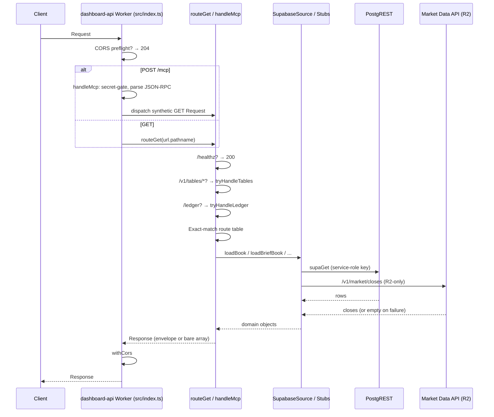

# dashboard-api Architecture

dashboard-api is a standalone Cloudflare Worker that centralises all
dashboard data reads into one read-only API. The dashboard client
(`apps/dashboard`) becomes a thin renderer over these routes and computes
nothing locally — no house-book queries, no NAV series assembly, no mark
resolution runs in the browser. The worker holds the Supabase service-role
key (never exposed to the static bundle) and enforces house-workspace
pinning server-side on every book read.

The contract is defined in `repo://apps/dashboard-api/CONTRACT.md`; the
implementation lives in `repo://apps/dashboard-api/src/`.

## Request dispatch flow

```mermaid
sequenceDiagram
    participant Client
    participant Worker as dashboard-api Worker (src/index.ts)
    participant Router as routeGet / handleMcp
    participant Source as SupabaseSource / Stubs
    participant Supabase as PostgREST
    participant Market as Market Data API (R2)

    Client->>Worker: Request
    Worker->>Worker: CORS preflight? → 204
    alt POST /mcp
        Worker->>Worker: handleMcp: secret-gate, parse JSON-RPC
        Worker->>Router: dispatch synthetic GET Request
    else GET
        Worker->>Router: routeGet(url.pathname)
    end
    Router->>Router: /healthz? → 200
    Router->>Router: /v1/tables/*? → tryHandleTables
    Router->>Router: /ledger? → tryHandleLedger
    Router->>Router: Exact-match route table
    Router->>Source: loadBook / loadBriefBook / ...
    Source->>Supabase: supaGet (service-role key)
    Source->>Market: /v1/market/closes (R2-only)
    Supabase-->>Source: rows
    Market-->>Source: closes (or empty on failure)
    Source-->>Router: domain objects
    Router-->>Worker: Response (envelope or bare array)
    Worker->>Worker: withCors
    Worker-->>Client: Response
```

*Request dispatch through the dashboard-api worker. MCP tools reuse the same route handlers via synthetic GET requests. Supabase reads fail closed; market-data failures resolve to empty maps.*

## Entry points

The worker exposes three categories of routes:

### Eight envelope routes

All are `GET` and read-only. Each returns a contract §1 success envelope
(`data`, `as_of`, `retrieval_pin`, `provenance`):

| Route | Source | Purpose |
|---|---|---|
| `GET /portfolio` | `repo://apps/dashboard-api/src/portfolio.ts` | Committed-book snapshot, NAV tip, invested envelope, reconciled positions (folds `/book-date` gate) |
| `GET /allocations` | `repo://apps/dashboard-api/src/allocations.ts` | Reconciled allocation rows with folded per-row valuations (folds `/valuations`) |
| `GET /brief` | `repo://apps/dashboard-api/src/brief.ts` | Scoreboard KPIs with persisted-vs-overlay decision |
| `GET /performance` | `repo://apps/dashboard-api/src/performance.ts` | Tearsheet bundle: NAV series, benchmark-relative headline, alpha/IR |
| `GET /kpis/live` | `repo://apps/dashboard-api/src/kpis-live.ts` | Point-in-time live snapshot (never a stream) |
| `GET /nav-series` | `repo://apps/dashboard-api/src/nav-series.ts` | Shared NAV + close series with seam-chaining |
| `GET /benchmarks` | `repo://apps/dashboard-api/src/benchmarks.ts` | Benchmark universe + aligned series for a NAV window |
| `GET /ledger` | `repo://apps/dashboard-api/src/ledger.ts` | Paginated house-book position event stream |

Common query parameters on every envelope route: `asOf` (`YYYY-MM-DD`,
default latest committed) and `retrieval_pin` (opaque caller-supplied
correlation id, max 128 chars, echoed in every response and forwarded
upstream to market-data fetches).

### Generic table reads

`GET /v1/tables/:table` (handled by `repo://apps/dashboard-api/src/tables.ts`)
proxies allowlisted PostgREST `SELECT` queries with the service-role key so
the static dashboard bundle never needs a Supabase key in the browser.
Allowlisted tables include `daily_snapshots`, `positions`, `instruments`,
`theses`, `portfolio_metrics`, `documents`, `position_events`,
`macro_series_observations`, `decision_log`, `run_health`,
`position_attribution`, `run_event_trace`,
`public_daily_realized_attribution`, `public_accounting_nav_history`,
`thesis_vehicles`, and `analyst_coverage`.

House-scoped tables (`positions`, `position_events`, `portfolio_metrics`)
get `workspace_id = <house>` appended server-side; `documents` gets the
house+system pin (`workspace_id = in.(<house>,<system>)`), matching anon RLS.
The caller cannot widen scope. The response is a bare row array — no envelope,
no `retrieval_pin` echo. There is no stub lane; without the service-role key
the route fails closed (`upstream_empty`, 502).

### JSON-RPC MCP tools

`POST /mcp` (handled by `repo://apps/dashboard-api/src/mcp.ts`) exposes the
eight envelope routes as JSON-RPC `tools/list` and `tools/call` methods. Each
`tools/call` invocation builds a synthetic `GET` `Request` for the matching
route and dispatches it through the worker's own route handlers, so the MCP
response body is byte-identical to the HTTP response from the same builders.
Tools never reimplement route logic.

The endpoint is secret-gated: the `x-digi-mcp-key` header must match the
`MCP_EDGE_KEY` worker secret. Fail-closed — a missing, empty, or mismatched
secret returns a plain `401` with no envelope.

## Route table construction (per-request)

The worker builds its route table on every request from the `Env` bindings
(`repo://apps/dashboard-api/src/index.ts` lines 164–186):

- **Real lane**: When `SUPABASE_SERVICE_ROLE_KEY` is set,
  `createSupabaseSource(env)` (`repo://apps/dashboard-api/src/supabase.ts`)
  produces an `EnvelopeSource` and dependency objects (`BriefDeps`,
  `PerformanceDeps`, `LiveDeps`, `BenchmarksDeps`, `LedgerBook`) that read
  real house-book rows through PostgREST. Every handler is wrapped by
  `failClosed`, which catches `UpstreamError` and maps it to the contract §2
  `upstream_empty` (502) envelope.
- **Stub lane**: When the service-role key is absent (local development,
  secretless CI), `repo://apps/dashboard-api/src/stubs.ts` provides
  clearly-marked test doubles with fixed fixture data. The ledger route uses
  `tryHandleLedger` with the ledger book; generic tables have no stub and
  fail closed.

The stub lane is never a silent fallback — an `UpstreamError` from a real
read becomes 502, never a synthesized stub response.

## Supabase data source

`repo://apps/dashboard-api/src/supabase.ts` implements every slice dependency
interface over real Supabase/PostgREST reads. Key characteristics:

- **House workspace pinning**: All book reads filter `workspace_id =
  6b753576-ced9-5319-9bfa-c5d0aacd9319` (the `HOUSE_WORKSPACE_ID` constant).
  Overlay workspace rows are excluded even when RLS would allow them.
- **Service-role key**: `supaGet()` uses the `apikey` and `Authorization:
  Bearer` headers with the service-role key from `SUPABASE_SERVICE_ROLE_KEY`.
  This key lives only in worker secrets (`repo://apps/dashboard-api/wrangler.toml` lines 21–23).
- **`loadCommittedBook`**: Assembles a `CommittedBookSnapshot` from
  `daily_snapshots` (tip date), `positions` (house-pinned, 5000-row page),
  `public_accounting_nav_history` (NAV rows, security definer view), and
  `portfolio_metrics` (invested fallback). The committed book date is the
  latest position date ≤ the snapshot date (`committedDate()`).
- **Market data is R2-API-only** (per issue #4053): `loadMarketClosesMap()`
  and `loadBenchmarkHistory()` call `GET /v1/market/closes` on the
  `MARKET_DATA_URL` base. When the URL is unset or any batch fails, the
  functions return empty maps/arrays — never fall back to Supabase, never
  synthesize prices. Closes are batched at 25 tickers per request.

## Error handling: fail-closed

Every upstream failure follows the contract §2 error envelope shape
(`repo://apps/dashboard-api/CONTRACT.md` lines 55–76):

| Code | HTTP | Condition |
|---|---|---|
| `bad_request` | 400 | Malformed `asOf`, `retrieval_pin`, or params |
| `not_found` | 404 | No committed book or tip for the given `asOf` |
| `upstream_empty` | 502 | Required upstream read fails — never synthesize numbers |
| `internal` | 500 | Unexpected errors |

Empty sessions (e.g. ledger with no events in range) are success with empty
arrays and honest `provenance`, never errors. The error envelope always
includes `retrieval_pin` (null when absent) so callers can correlate
failures.

## CORS

CORS handling (`repo://apps/dashboard-api/src/cors.ts`) mirrors the
digithings-stack market-data worker: exact-match origin allowlist, `Vary:
Origin` on every response, `GET, OPTIONS` methods, 86400s preflight cache.
Defaults cover `https://digiquant.io`, `https://digithings.ai`, and
localhost/127.0.0.1 dev ports. Override via `DASHBOARD_API_ALLOWED_ORIGINS`
env var. `OPTIONS` preflights return `204` with an empty body.

## Fold into digithings-stack

The standalone dashboard-api worker is also folded into the
digithings-stack Cloudflare Worker at the canonical module path
`/dashboard-api/*` (`repo://apps/digithings-stack-cloudflare/src/dashboard-api.ts`).
The fold:

- Imports the dashboard-api worker's default export and forwards
  prefix-stripped requests through `dashboardApi.fetch()`.
- Re-exports the 8 MCP tool definitions as `DASHBOARD_MCP_TOOLS` so the stack
  worker can merge them into its unified MCP tool list.
- Loads lazily behind `runIsolated("dashboard-api", …)` — a dashboard-api
  failure degrades only `/dashboard-api/*` paths (503); every other route
  group keeps serving.
- Shared `Env` interface supplies `SUPABASE_URL`, `SUPABASE_SERVICE_ROLE_KEY`,
  `MARKET_DATA_URL`, `MCP_EDGE_KEY`, and `DASHBOARD_API_ALLOWED_ORIGINS` from
  the stack worker's env bindings.

HTTP and MCP responses through the fold stay byte-identical to the standalone
worker.

## Builders: pure logic, testable in isolation

Each route's response assembly is a pure function with no I/O, no secrets,
and no worker runtime imports. The route layer supplies domain objects (from
the real source or stubs), and the builders produce the contract shapes:

| Builder module | Produces |
|---|---|
| `repo://apps/dashboard-api/src/portfolio.ts` | `buildPortfolioData()` — §6.1 shape |
| `repo://apps/dashboard-api/src/allocations.ts` | `buildAllocationsData()` — §6.2 shape |
| `repo://apps/dashboard-api/src/brief.ts` | Brief scoreboard KPIs |
| `repo://apps/dashboard-api/src/performance.ts` | `getPerformanceBundle()` — §6.4 shape |
| `repo://apps/dashboard-api/src/kpis-live.ts` | `computeLivePerformanceKpis()` |
| `repo://apps/dashboard-api/src/nav-series.ts` | `buildNavSeries()` — §6.6 shape |
| `repo://apps/dashboard-api/src/benchmarks.ts` | Benchmark universe + aligned series |
| `repo://apps/dashboard-api/src/ledger.ts` | Paginated event stream with cost-basis economics |
| `repo://apps/dashboard-api/src/book.ts` | `reconcileBook()` — clamped-100 envelope layout |
| `repo://apps/dashboard-api/src/invested.ts` | `resolveInvestedPct()` — four-tier fallback with `InvestedDefinition` label |
| `repo://apps/dashboard-api/src/ssot.ts` | `PerformanceSsotMeta` — 11-field SSOT object |

Each builder has a corresponding vitest test file (e.g.
`repo://apps/dashboard-api/src/portfolio.test.ts`).

## Configuration

`repo://apps/dashboard-api/wrangler.toml`:

- **name**: `dashboard-api`
- **main**: `src/index.ts`
- **workers_dev**: `true` (no custom domain until a follow-up decision — human gate)
- **observability**: enabled
- **vars**: `SUPABASE_URL` set to the house Supabase project URL
- **secrets** (never committed): `SUPABASE_SERVICE_ROLE_KEY`, plus `MCP_EDGE_KEY`, and potentially `MARKET_DATA_URL` and `DASHBOARD_API_ALLOWED_ORIGINS`

## Deferred (out of scope)

The contract (`repo://apps/dashboard-api/CONTRACT.md` §8) explicitly defers:
write paths (all routes are read-only), ledger pipeline repair, NAV-contract
badge rendering, auth/session changes (`digikey/` untouched), pagination
beyond the ledger cursor, and any timeout/retry/rate-limit language.