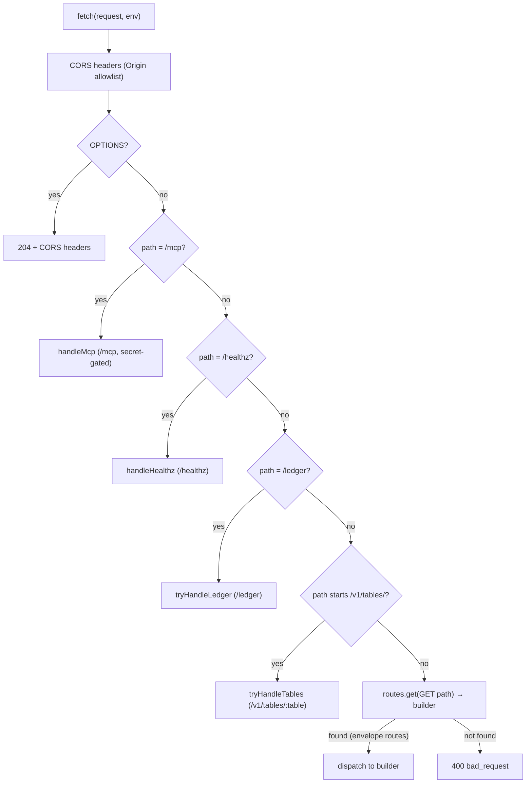

# dashboard-api Contract and Routes

The dashboard-api worker at `apps/dashboard-api` serves as the central read-only
API for the dashboard. All routes are `GET` and read-only; no request ever carries
a body. The worker's architecture, fail-closed design, and house workspace pinning
are documented separately in [dashboard-api Architecture](./architecture.md).
This page covers every route, its query parameters, response shape, and the
rules governing each one.

## Common query parameters

Every route accepts these parameters unless otherwise noted:

| Param | Type | Default | Description |
|---|---|---|---|
| `asOf` | `YYYY-MM-DD` | latest committed | Calendar date to read as-of. Rejected (`bad_request`) when malformed. |
| `retrieval_pin` | string, ≤128 chars | none | Opaque caller-supplied correlation ID. Echoed in every success and error; forwarded unchanged to upstream market-data fetches. Rejected when >128 chars. |

All eight specific routes (`/portfolio`, `/allocations`, `/brief`,
`/performance`, `/kpis/live`, `/nav-series`, `/benchmarks`, `/ledger`) validate
these through `parseCommonParams()` in `src/index.ts`
([source](repo://apps/dashboard-api/src/index.ts#L114-L131)). `/kpis/live` and
`/benchmarks` reject `asOf` — those routes always use the latest data.

## Success envelope (eight specific routes)

Every success response on the eight specific routes follows this shape:

```json
{
  "data": { /* route-specific payload */ },
  "as_of": "2026-09-24",
  "retrieval_pin": "abc123",
  "provenance": {
    "source": "public_accounting_nav_history+daily_snapshots+positions",
    "tip_date": "2026-09-24",
    "contract": "finalized_accounting",
    "seam": false,
    "marks": "stored"
  }
}
```

The `provenance` object always describes the source of the displayed numbers:

| Field | Type | Description |
|---|---|---|
| `source` | string | Which upstream systems produced the data |
| `tip_date` | string\|null | Latest NAV or book date; null when empty |
| `contract` | `finalized_accounting`\|`legacy_estimate`\|null | Badge level of the NAV tip |
| `seam` | boolean | Whether the tip crosses a NAV source seam |
| `marks` | `stored`\|`market_api`\|`unavailable` | Source of position price marks |

The generic `/v1/tables/:table` route returns a bare row array with **no**
envelope — no `data`, no `as_of`, no `retrieval_pin` echo, no `provenance`.

## Error envelope

All failures return this single shape (from CONTRACT §2,
[source](repo://apps/dashboard-api/src/index.ts#L80-L90)):

```json
{
  "error": {
    "code": "bad_request",
    "message": "retrieval_pin exceeds 128 characters",
    "details": { "max_length": 128 },
    "retrieval_pin": null
  }
}
```

Four error codes map to HTTP statuses:

| Code | HTTP | Trigger |
|---|---|---|
| `bad_request` | 400 | Malformed `asOf`, `retrieval_pin` >128, bad filter syntax |
| `not_found` | 404 | No committed book or tip for `asOf` |
| `upstream_empty` | 502 | Required upstream read failed — never synthesize numbers |
| `internal` | 500 | Unexpected runtime error |

Empty sessions (e.g., ledger with no events) are **success** with empty arrays
and honest `provenance`, never errors.

## `retrieval_pin` passthrough

The `retrieval_pin` is an opaque string the caller supplies (typically a
digisearch/digigraph retrieval correlation ID). The API never interprets it:

- **Echoed** in every success (`top-level retrieval_pin`) and every error
  (`error.retrieval_pin`; `null` when absent).
- **Forwarded** unchanged to upstream market-data fetches
  (`GET /v1/market/closes`, `GET /v1/market/tickers`) so traces join across the
  hop.
- **Max length 128**; longer values are rejected with `bad_request`.

For the generic `/v1/tables/:table` route, `retrieval_pin` is accepted and ignored
— it is never echoed and never forwarded upstream.

## Realtime-stays-client-side rule

No route opens a WebSocket, SSE stream, or subscription. The worker serves
snapshots only:

- Live marks arrive exclusively through Supabase Realtime `postgres_changes` on
  `prices_live`, rendered as a badged "live marks" overlay in the dashboard
  client.
- `GET /kpis/live` is a point-in-time snapshot computed from the latest quotes the
  server can see — it does **not** push, and clients must not poll it as a
  realtime substitute.
- Numbers from live KPIs are `live marks` by definition and must never wear a
  `finalized accounting` badge.

## Route dispatch summary



*Route dispatch flow in `src/index.ts`: the worker checks MCP, healthz, ledger,
and tables paths before falling through to the envelope route table
([source](repo://apps/dashboard-api/src/index.ts#L189-L225)).*

---

## Contracted specific routes (CONTRACT §6)

The eight routes below are mounted through `mountEnvelopeRoutes()` (portfolio,
allocations, nav-series), `registerBriefRoutes()`, `registerPerformanceRoutes()`,
`registerLiveRoutes()`, `registerBenchmarksRoutes()`, and `tryHandleLedger()`.

### `GET /portfolio`

Committed-book snapshot + invested envelope + folded book-date gate. Replaces
the per-page `houseBook()` + `reconcileBook` duplication.

| Query param | Required | Default | Description |
|---|---|---|
| `asOf` | no | latest committed | Calendar date to snapshot |
| `retrieval_pin` | no | — | Opaque correlation pin |

Builder: `buildPortfolioData()` in
[portfolio.ts](repo://apps/dashboard-api/src/portfolio.ts#L67-L142).

**Response `data`:**

```json
{
  "book_as_of": "2026-09-24",
  "nav_tip": {
    "date": "2026-09-24",
    "nav": 99.909,
    "contract": "legacy_estimate",
    "invested_pct": 35.13,
    "cash_pct": 64.87,
    "day_return_pct": null
  },
  "seam": {
    "crosses_nav_seam": true,
    "lag_days": 1,
    "lag_direction": "metrics lag"
  },
  "invested": {
    "kpi_pct": 35.13,
    "envelope_pct": 35.13,
    "cash_pct": 64.87,
    "definition": "accounting_nav_tip"
  },
  "positions": [
    { "ticker": "XLV", "weight_pct": 20.0, "scaled_weight_pct": 20.0, "is_cash": false }
  ]
}
```

Key rules:

- **`invested.kpi_pct` is unclamped.** Do not clamp >100 under an
  `accounting_nav_tip` label. The separate clamped-100 `reconcileBook` envelope
  (`envelope_pct`) is the row-layout basis, not the KPI.
- **Invested fallback order:** NAV tip `invested_pct` → non-CASH
  `positions.weight_pct` sum on the committed book →
  `portfolio_metrics.invested_pct` → null.
- **`invested.definition`** names the winning source:
  `accounting_nav_tip | book_weights | portfolio_metrics | unavailable`
  ([source](repo://apps/dashboard-api/src/invested.ts#L37-L64)).
- **`book_as_of`** = `committedBookDate(snapshotDate, positionDates)`
  ([source](repo://apps/dashboard-api/src/committed-book.ts#L27-L33)). Null (with
  `not_found`) when the snapshot is missing — never silently substitute the
  latest position date.
- **`day_return_pct` is null** across NAV seams or calendar gaps > 4 days.
- CASH is outside holding counts.

### `GET /allocations`

Reconciled allocation rows with folded per-row valuations. Consumes the same
committed book as `/portfolio`.

| Query param | Required | Default | Description |
|---|---|---|---|
| `asOf` | no | latest committed | Calendar date |
| `retrieval_pin` | no | — | Opaque pin |
| `include_marks` | no | `true` | When `false`, skip market-API closes lookup |

Builder: `buildAllocationsData()` in
[allocations.ts](repo://apps/dashboard-api/src/allocations.ts#L131-L164).

**Response `data`:**

```json
{
  "book_as_of": "2026-09-24",
  "invested_pct": 35.13,
  "cash_pct": 64.87,
  "invested_definition": "accounting_nav_tip",
  "rows": [
    {
      "ticker": "DBO",
      "weight_pct": 5.0031,
      "scaled_weight_pct": 5.0031,
      "entry_price": 22.14,
      "current_price": null,
      "unrealized_pct": null,
      "marks": "unavailable",
      "marks_as_of": null
    }
  ],
  "marks_unstamped": true
}
```

Key rules:

- **Rows scale into the §6.1 envelope:** `invested = min(100, investedPct ??
  heldSum)`, CASH excluded, `scale = invested/heldSum`.
- **Valuation precedence per row** ([source](repo://apps/dashboard-api/src/allocations.ts#L67-L125)):
  1. Stored `unrealized_pnl_pct` / `since_entry_return_pct` when the nightly
    metrics stamp is present.
  2. Derived from `entry_price` vs `current_price` when both exist.
  3. When the stamp is missing, fill from market API `GET
    /v1/market/closes` (R2-API-only — empty when unset, no Supabase
    fallback).
  4. Fail closed to null without basis or mark — never invent P&L.
- **`marks_unstamped`** is true when the open book is empty or any row lacks
  `metrics_as_of`.
- **Mid-session NULL marks affect marks only,** never weights.

### `GET /brief`

Brief scoreboard KPI with the persisted-vs-overlay decision made in one place.

| Query param | Required | Default | Description |
|---|---|---|---|
| `asOf` | no | latest committed | Calendar date |
| `retrieval_pin` | no | — | Opaque pin |
| `overlay` | no | `auto` | `auto` (live overlay when eligible) or `off` (persisted only) |

Builder: `buildBriefData()` in
[brief.ts](repo://apps/dashboard-api/src/brief.ts#L101-L150).

**Response `data`:**

```json
{
  "book_as_of": "2026-09-24",
  "nav_tip": { "date": "2026-09-24", "nav": 99.909, "contract": "legacy_estimate" },
  "day_return_pct": null,
  "since_inception_pct": 8.4,
  "since_inception_start_date": "2026-08-20",
  "overlay": { "active": false, "live_vs_mark_pct": 0, "badge": "finalized accounting" },
  "invested_pct": 35.13,
  "session_events": []
}
```

Key rules:

- **Persisted path first:** same tip + SSOT helpers as the Tearsheet.
- **Live overlay engages only when** `|liveVsMarkPct| > 0` (strictly > 1e-9
  per `isLiveMarksOverlay()`
  ([source](repo://apps/dashboard-api/src/ssot.ts#L504-L506))). Then the tile is
  labeled `live marks` — never finalized accounting.
- **Overlay-off output must match Tearsheet within 0.05 pp** by construction
  (same persisted path).
- **`session_events`** is the day's `position_events` slice (honest empty when
  none).
- **`since_inception_start_date`** is the first date of the chained NAV series
  the since-% is measured from (null when the series is empty).

### `GET /performance`

Tearsheet bundle: one contracted NAV series, benchmark-relative headline,
overlap-gated alpha/IR. Served by the shared `getPerformanceBundle` builder.

| Query param | Required | Default | Description |
|---|---|---|---|
| `asOf` | no | latest committed | Calendar date |
| `retrieval_pin` | no | — | Opaque pin |
| `benchmark` | no | `SPY` | Benchmark ticker (1-12 upper/alphanumeric) |
| `window` | no | `inception` | `inception | 1y | 6m | 3m` |

Builder: `getPerformanceBundle()` in
[performance.ts](repo://apps/dashboard-api/src/performance.ts#L127-L219).

**Response `data`:**

```json
{
  "nav": {
    "tip_date": "2026-09-24",
    "base100_tip": 108.4,
    "points": [{ "date": "2026-09-24", "index": 108.4, "day_return_pct": null }]
  },
  "metrics": {
    "day_return_pct": null,
    "since_inception_pct": 8.4,
    "excess_return_pct": 1.2,
    "alpha_pct": null,
    "information_ratio": null,
    "beta": null,
    "overlap_days": 21
  },
  "benchmark": { "ticker": "SPY", "aligned_start": "2025-09-24" },
  "stale": {
    "lag_days": 1,
    "lag_direction": "metrics lag",
    "metrics_as_of": "2026-09-23"
  },
  "ssot": {
    "tipCashPct": 64.9,
    "tipInvestedPct": 35.1,
    "investedDefinition": "accounting_nav_tip",
    "bookAsOf": "2026-09-24",
    "marksUnstamped": false
  }
}
```

Key rules:

- **NAV chart is the single base-100 continuity index** over
  `public_accounting_nav_history`: each row's own day return, calendar gaps ≤4
  days forward-fill, tip badge from the latest dated row only.
- **Excess = Rp − Rb** over the NAV-aligned benchmark window.
- **Alpha (Jensen) and IR need ≥ 20 overlapping daily return pairs**
  (`MIN_OVERLAP_DAYS`) — null below the floor, never invented from endpoints.
- **Benchmark prices come from paginated `fetchComparablePriceHistory`**, not a
  single bulk fetch.
- **Lag is signed UTC calendar days** and symmetric (`metrics lag` / `nav lag`).
  `metricsAsOf` is the metrics stamp, never overwritten with the NAV tip.
- **`ssot`** is the full `PerformanceSsotMeta` object: 11 plain-data fields
  ([source](repo://apps/dashboard-api/src/ssot.ts#L344-L358)) so the Brief
  scoreboard can consume it unchanged. The `*BadgeLabel` / `*FreshnessNote` /
  `isLiveMarksOverlay` helpers stay client-side label functions, not JSON.

### `GET /kpis/live`

Point-in-time live snapshot — snapshot only, not a stream.

| Query param | Required | Default | Description |
|---|---|---|
| `retrieval_pin` | no | — | Opaque pin |
| `asOf` | — | — | **Rejected** — always latest quotes |

Builder: `buildLiveData()` in
[kpis-live.ts](repo://apps/dashboard-api/src/kpis-live.ts#L142-L201).

**Response `data`:**

```json
{
  "quote_date": "2026-09-24",
  "live_vs_mark_pct": 0.4,
  "day_return_live_pct": -0.2,
  "since_inception_live_pct": 8.8,
  "excess_live_pct": 1.4,
  "overlay_eligible": true,
  "universe": ["DBO", "EWZ", "XLV", "XLF"]
}
```

Key rules:

- Computed from latest quotes the server can see — `market_api` provenance
  always.
- **`overlay_eligible`** is false (and overlay must stay off) when
  `liveVsMarkPct === 0` **or** the book's `current_price` marks are all NULL.
- Numbers here are `live marks` by definition and must never be labeled
  finalized accounting.
- `since_inception_live_pct` and `excess_live_pct` are computed by drifting the
  book tip by the weighted live-vs-mark move.

### `GET /nav-series`

Shared NAV + close series. Replaces the `nav-seam.ts` ∥
`accounting-views.ts` duplication — one series builder for all surfaces.

| Query param | Required | Default | Description |
|---|---|---|---|
| `retrieval_pin` | no | — | Opaque pin |
| `from` | no | beginning | Start date YYYY-MM-DD |
| `to` | no | end | End date YYYY-MM-DD |
| `asOf` | no | latest committed | Calendar date (passed to book read) |

Builder: `buildNavSeries()` in
[nav-series.ts](repo://apps/dashboard-api/src/nav-series.ts#L160-L173).

**Response `data`:**

```json
{
  "tip": { "date": "2026-09-24", "contract": "legacy_estimate" },
  "points": [
    { "index": 0, "date": "2026-09-24", "nav": 99.909, "day_return_pct": null, "contract": "legacy_estimate" }
  ]
}
```

Key rules:

- **Same continuity-index semantics as §6.4:** per-row day returns, ≤4-day
  forward-fill, seam basis changes carry flat
  ([source](repo://apps/dashboard-api/src/nav-series.ts#L180-L209)).
- **Per-point contract labels preserved** so consumers can badge tip flips
  (e.g., `finalized_accounting` → `legacy_estimate`).
- **`from`/`to` filter** the series date range; default = full history.

### `GET /benchmarks`

Benchmark universe + aligned series for a NAV window. R2-API-only with
benchmark-key fallback.

| Query param | Required | Default | Description |
|---|---|---|---|
| `retrieval_pin` | no | — | Opaque pin |
| `tickers` | no | market API universe | Comma-separated (1-20 symbols) |
| `from` | no | — | Start date YYYY-MM-DD |
| `to` | no | — | End date YYYY-MM-DD |
| `asOf` | — | — | **Rejected** |

Builder: `buildBenchmarksData()` in
[benchmarks.ts](repo://apps/dashboard-api/src/benchmarks.ts#L127-L152).

**Response `data`:**

```json
{
  "universe": ["SPY", "QQQ"],
  "series": { "SPY": [{ "date": "2026-09-24", "close": 512.3 }] },
 "aligned_start": "2025-09-24",
  "overlap_days": 21
}
```

Key rules:

- **R2-API-only**: an empty market-API answer falls back to the benchmark keys
  (`DASHBOARD_BENCHMARK_TICKERS` per #4053,
  [source](repo://apps/dashboard-api/src/ssot.ts#L38-L57)) — no Supabase
  fallback.
- **Universe resolution** ([source](repo://apps/dashboard-api/src/benchmarks.ts#L82-L89)):
  explicit `tickers` win; else market-API universe (`GET /v1/market/tickers`);
  else dashboard key list.
- **Each series aligns to NAV dates** (as-of forward fill): each NAV date
  carries the latest close on or before it.
- **`overlap_days`** counts NAV dates covered for every universe ticker.
- Tickers with no market rows keep an empty series under their key — honest
  gap, never invented closes.

### `GET /ledger`

Ledger event stream. Single source of truth is `position_events` (house book).

| Query param | Required | Default | Description |
|---|---|---|---|
| `asOf` | no | latest | Filter events up to this date |
| `retrieval_pin` | no | — | Opaque pin |
| `ticker` | no | all tickers | Filter to one ticker (case-insensitive) |
| `limit` | no | 50 | Page size (max 500) |
| `cursor` | no | 0 | Opaque offset-based cursor for pagination |

Builder: `buildLedgerPage()` in
[ledger.ts](repo://apps/dashboard-api/src/ledger.ts#L401-L426).

**Response `data`:**

```json
{
  "events": [
    {
      "date": "2026-09-03",
      "ticker": "XLF",
      "type": "TRIM",
      "fill_price": 54.1,
      "avg_entry": 52.0,
      "realized_pct": 4.0,
      "prev_weight_pct": 9.9,
      "weight_pct": 4.9
    }
  ],
  "next_cursor": null
}
```

Key rules:

- **`type`** ∈ `OPEN | ADD | EXIT | TRIM`. Only ledger fill types; HOLD/unknown
  types are excluded
  ([source](repo://apps/dashboard-api/src/ledger.ts#L343-L355)).
- **Realized % for sells** is vs average entry: `soldWeight = prev_weight_pct -
  weight_pct`, `realized = (fill/avg - 1) * 100`
  ([source](repo://apps/dashboard-api/src/ledger.ts#L291-L299)). Fail closed
  without fill price or cost basis.
- **OPEN** normalizes a null `prev_weight_pct` to 0 when `weight_pct` exists.
- **Cursor** is offset-based (opaque base64url), encoded as `{ v: 1, offset: N }`
  ([source](repo://apps/dashboard-api/src/ledger.ts#L145-L167)).
- **Events sorted** most-recent-date first, then ticker.
- **Empty range** → success with `"events": []` plus honest `provenance`.
- **`cumulative_return_since_event_pct`** is NOT included — post-event drift
  must not be presented as trade return.
- Rows fetched up to 80,000 internally (`LEDGER_FETCH_MAX`), paginated in
  chunks of 2,500 (`LEDGER_FETCH_PAGE`)
  ([source](repo://apps/dashboard-api/src/ledger.ts#L433-L437)).

---

## Generic table reads (`GET /v1/tables/:table`)

The `/v1/tables/:table` route serves the dashboard's long-tail direct reads
through one allowlisted worker route so the static bundle never needs the
service-role key. The route proxies PostgREST with the service key and enforces
the house workspace pin server-side
([source](repo://apps/dashboard-api/src/tables.ts#L1-L190)).

### Allowlisted tables

These 17 tables are served ([source](repo://apps/dashboard-api/src/tables.ts#L34-L52)):

| Table | House pin? | Notes |
|---|---|---|
| `daily_snapshots` | no | Shared, date-only |
| `positions` | **yes** | `workspace_id = eq.{house}` |
| `instruments` | no | Shared |
| `theses` | no | Shared |
| `portfolio_metrics` | **yes** | `workspace_id = eq.{house}` |
| `documents` | **house+system** | `workspace_id = in.({house},{system})` |
| `position_events` | **yes** | `workspace_id = eq.{house}` |
| `macro_series_observations` | no | |
| `decision_log` | no | |
| `run_health` | no | |
| `position_attribution` | no | |
| `run_event_trace` | no | |
| `public_accounting_nav_history` | no | Security definer view |
| `public_daily_realized_attribution` | no | |
| `thesis_vehicles` | no | Dossier read |
| `analyst_coverage` | no | Dossier read |

Unknown tables → `not_found` (404).

### Query language

| Param | Syntax | Default | Description |
|---|---|---|---|
| `select` | comma list e.g. `col1,col2` | `*` | Columns to return |
| `order` | repeatable: `col.asc` or `col.desc` | — | Sort columns |
| `limit` | integer | 100 | Max rows (cap 5000) |
| `offset` | integer ≥0 | 0 | Pagination offset |
| `eq.col` | `eq.col=value` | — | Exact match |
| `ilike.col` | `ilike.col=pattern` | — | Case-insensitive LIKE |
| `like.col` | `like.col=pattern` | — | Case-sensitive LIKE |
| `in.col` | `in.col=(a,b,c)` | — | IN list (caller passes CSV) |
| `lt.col` | `lt.col=value` | — | Less than |
| `lte.col` | `lte.col=value` | — | Less than or equal |
| `gt.col` | `gt.col=value` | — | Greater than |
| `gte.col` | `gte.col=value` | — | Greater than or equal |

Filters with no dot (e.g., `?ticker=XLF`) are rejected as `bad_request` —
every filter must use the `op.col` syntax.

### House pinning (server-side)

The worker appends workspace filters **server-side** — the caller cannot widen
them:

- **`positions`, `position_events`, `portfolio_metrics`** → `workspace_id =
  eq.6b753576-ced9-5319-9bfa-c5d0aacd9319`
- **`documents`** → `workspace_id =
  in.(6b753576-ced9-5319-9bfa-c5d0aacd9319,1105372f-4109-5815-be5a-21091ccfc8ad)`
  (house OR system, matching anon RLS)

These pins are never forwarded from the caller. The pin is appended in
`buildTableQuery()`
([source](repo://apps/dashboard-api/src/tables.ts#L99-L159)).

### Response shape

The tables route returns a **bare row array** — no §1 envelope, no
`retrieval_pin` echo, no `provenance`:

```json
[
  { "date": "2026-09-24", "ticker": "XLV", "weight_pct": 20.0 },
  { "date": "2026-09-24", "ticker": "EWZ", "weight_pct": 15.0 }
]
```

Failures still use the standard error envelope shape.

### No stub lane

Without the service-role key the route fails closed with `upstream_empty` (502)
— never an empty success. There is no stub lane: generic reads have no
fixtures
([source](repo://apps/dashboard-api/src/tables.ts#L171-L178)).

---

## MCP JSON-RPC surface

`POST /mcp` exposes all eight contracted routes as JSON-RPC tools, mirroring the
`/_stack/mcp` precedent. Each `tools/call` builds a synthetic GET `Request` for
the matching route and runs it through the worker's own dispatch, so the MCP
response is byte-identical to the HTTP response.

The surface is secret-gated via the `x-digi-mcp-key` header matching the
`MCP_EDGE_KEY` worker secret. No secret configured → all requests denied
(fail-closed).

Full MCP tools are defined in [mcp.ts](repo://apps/dashboard-api/src/mcp.ts#L36-L106)
— one tool per route (`get_portfolio`, `get_allocations`, `get_nav_series`,
`get_brief`, `get_performance`, `get_kpis_live`, `get_benchmarks`, `get_ledger`).
