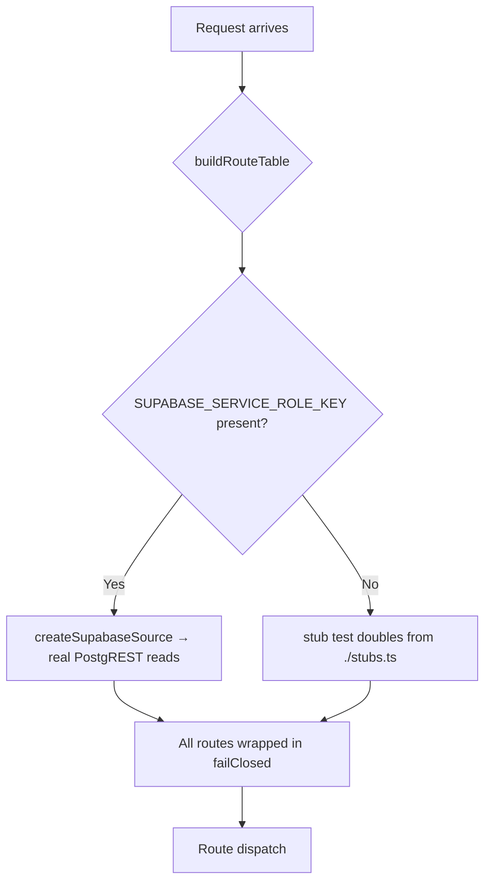
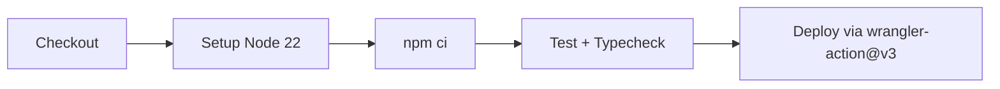

# dashboard-api Operations

The dashboard-api is a standalone Cloudflare Worker at `apps/dashboard-api/`. It
replaces all direct Supabase reads from the browser with a single worker-held
service-role key. This page covers everything needed to develop, test, deploy,
and operate the worker. For architecture and fail-closed design details, see
[dashboard-api Architecture](./architecture.md). The contracted routes and
response shapes are documented in [dashboard-api Contract and
Routes](./contract-and-routes.md).

## Development workflow

All development commands run from the repository root via npm workspaces:

```bash
# Start wrangler dev (local Worker runtime, hot-reload)
npm run dev --workspace dashboard-api

# Run the full Vitest test suite
npm run test --workspace dashboard-api

# Type-check without emitting
npm run typecheck --workspace dashboard-api
```

These map to the scripts in `apps/dashboard-api/package.json`:

| Command | Underlying call | Purpose |
|---|---|---|
| `npm run dev` | `wrangler dev` | Local dev server with live reload |
| `npm run test` | `vitest run` | Run all `src/**/*.test.ts` files once |
| `npm run typecheck` | `tsc --noEmit` | Full project type-check |
| `npm run deploy` | `wrangler deploy` | Manual deploy (CI uses the workflow instead) |

The Vitest config (`apps/dashboard-api/vitest.config.ts`) aliases
`@digithings/ui` to the dependency-free live-performance-kpis module so
validation tests can import real dashboard-client derivations without pulling in
React.

### Local secrets for development

When `SUPABASE_SERVICE_ROLE_KEY` is absent from the worker environment, the
worker uses **stub test doubles** (see [Stub-vs-real lane
switching](#stub-vs-real-lane-switching)). To develop against real Supabase data
locally, write the key to a `.dev.vars` file (gitignored):

```
SUPABASE_SERVICE_ROLE_KEY=your-service-role-key-here
```

Optionally configure the MCP edge key and CORS override:

```
MCP_EDGE_KEY=your-mcp-secret
DASHBOARD_API_ALLOWED_ORIGINS=http://localhost:3000,http://localhost:3100
```

Wrangler automatically loads `.dev.vars` in local dev mode. **Never commit
`.dev.vars`** — it is listed in `.gitignore`
([source](repo://apps/dashboard-api/.gitignore)).

## Environment variables

### wrangler.toml vars (safe to commit)

Defined in `[vars]` in `wrangler.toml`
([source](repo://apps/dashboard-api/wrangler.toml#L18-L19)):

| Variable | Value | Purpose |
|---|---|---|
| `SUPABASE_URL` | `https://rwagjbkvxkdwqmouagad.supabase.co` | PostgREST base URL for house-book reads |

The Supabase URL alone is not a secret — it is visible in the dashboard client
bundle already. Only the service-role key must stay secret.

### Worker env vars (injected at runtime)

These are read from the `Env` interface in `src/index.ts`
([source](repo://apps/dashboard-api/src/index.ts#L52-L60)):

| Variable | Required? | Purpose |
|---|---|---|
| `SUPABASE_URL` | For real reads | PostgREST base URL (set in wrangler.toml vars) |
| `SUPABASE_SERVICE_ROLE_KEY` | For real reads | **Secret.** Service-role key for PostgREST. Never in static bundle. |
| `MCP_EDGE_KEY` | For MCP access | **Secret.** Must match `x-digi-mcp-key` header on `POST /mcp`. Unset = deny all. |
| `DASHBOARD_API_ALLOWED_ORIGINS` | Optional | Comma-separated CORS origin override. Falls back to built-in defaults. |
| `MARKET_DATA_URL` | For live marks | Market data API base URL (R2-only); unset = no live marks. |

`MCP_EDGE_KEY` and `DASHBOARD_API_ALLOWED_ORIGINS` have **no entry** in
`wrangler.toml` vars — they are runtime-only.

## Secrets model

**`SUPABASE_SERVICE_ROLE_KEY` lives ONLY in worker secrets** — set via
`wrangler secret put SUPABASE_SERVICE_ROLE_KEY` or the CI deploy workflow's
`secrets` input. It must never appear in:

- `wrangler.toml` `[vars]`
- Any static bundle or compiled output
- Any `NEXT_PUBLIC_`-prefixed environment variable

The `MCP_EDGE_KEY` follows the same rule: worker secrets only.

The wrangler.toml explicitly calls out the secrets model in a comment block
([source](repo://apps/dashboard-api/wrangler.toml#L21-L23)):

```toml
# Secrets (wrangler secret put; never commit values):
# SUPABASE_SERVICE_ROLE_KEY — house-book reads via PostgREST. Lives ONLY in
# worker secrets. Never in the static bundle, no NEXT_PUBLIC_ service key.
```

## Stub-vs-real lane switching

The worker selects between real Supabase reads and stub test doubles at request
time based on whether `SUPABASE_SERVICE_ROLE_KEY` is present. This logic lives
in `buildRouteTable()` in `src/index.ts`
([source](repo://apps/dashboard-api/src/index.ts#L164-L186)).



### Real lane (`SUPABASE_SERVICE_ROLE_KEY` present)

`hasSupabaseEnv()` returns true ([source](repo://apps/dashboard-api/src/supabase.ts#L45-L47)),
and `createSupabaseSource()` builds the full `SupabaseSource` with real
PostgREST readers:

- `supaGet()` makes authenticated GET requests to PostgREST with the service-role
  key in both `apikey` and `Authorization` headers
  ([source](repo://apps/dashboard-api/src/supabase.ts#L66-L78)).
- Market data reads go through the R2 market API (no Supabase fallback); when
  `MARKET_DATA_URL` is unset or the API fails, closes resolve to an empty map
  and builders flow the honest-empty path
  ([source](repo://apps/dashboard-api/src/supabase.ts#L236-L264)).

Every route handler is wrapped with `failClosed()` so an `UpstreamError` from a
real read becomes a `502` (`upstream_empty`) error envelope — **never a silent
stub fallback**.

### Stub lane (`SUPABASE_SERVICE_ROLE_KEY` absent)

When the service-role key is missing (local dev without `.dev.vars`, CI test
runs), `buildRouteTable()` wires every route through the clearly-marked stub
doubles in `src/stubs.ts`
([source](repo://apps/dashboard-api/src/stubs.ts)). These provide hardcoded test
fixtures that mirror the slice tests and are clearly documented as test doubles,
not production data.

The null-book convention uses `asOf === "2020-01-01"` as a sentinel: passing
that date to a stub loader returns `null`, allowing wiring tests to exercise the
`not_found` path.

## CORS configuration

CORS is handled in `src/cors.ts` ([source](repo://apps/dashboard-api/src/cors.ts)).
Every response carries `Vary: Origin`, and the `Access-Control-Allow-Origin`
header is only set when the request's `Origin` matches the allowlist.

### Default allowlist

```typescript
const DEFAULT_ORIGINS = [
  "https://digiquant.io",
  "https://digithings.ai",
  "http://localhost:3000",
  "http://127.0.0.1:3000",
  "http://localhost:3100",
  "http://127.0.0.1:3100",
  "http://localhost:3101",
  "http://127.0.0.1:3101",
].join(",");
```

This covers the production dashboards plus the three most common local
dashboard dev ports.

### Overriding via env var

Set `DASHBOARD_API_ALLOWED_ORIGINS` to a comma-separated list of origins. The
`resolveAllowlist()` function falls back to the defaults when the env var is
unset ([source](repo://apps/dashboard-api/src/cors.ts#L26-L31)).

### CORS behavior summary

| Aspect | Value |
|---|---|
| Allowed methods | `GET, OPTIONS` |
| Preflight cache | 86,400 seconds (24 hours) |
| `OPTIONS` response | `204 No Content` with CORS headers, empty body |
| Non-allowlisted origin | No `Access-Control-Allow-Origin` header; `Vary: Origin` still set |
| Security note | CORS is a browser mechanism, not a secrecy boundary — the service-role key never leaves the worker |

## MCP (JSON-RPC) surface

`POST /mcp` exposes the same eight read-only routes as JSON-RPC tools
([source](repo://apps/dashboard-api/src/mcp.ts)). It is secret-gated:
the `x-digi-mcp-key` header must match the `MCP_EDGE_KEY` worker secret. Unset
secret, missing header, or mismatch all return a plain `401` (no envelope).

Tools **never reimplement route logic**: each `tools/call` builds a synthetic
`GET` request and dispatches it through the worker's own `routeGet()` handler,
so the MCP response is byte-identical to the HTTP response.

### Available MCP tools

| Tool name | Route | Description |
|---|---|---|
| `get_portfolio` | `/portfolio` | Committed-book snapshot + invested envelope |
| `get_allocations` | `/allocations` | Reconciled allocation rows |
| `get_nav_series` | `/nav-series` | Shared NAV + close series |
| `get_brief` | `/brief` | Brief scoreboard KPIs |
| `get_performance` | `/performance` | Tearsheet: NAV + benchmark-relative |
| `get_kpis_live` | `/kpis/live` | Point-in-time live snapshot |
| `get_benchmarks` | `/benchmarks` | Benchmark universe + aligned series |
| `get_ledger` | `/ledger` | Ledger event stream |

## Fail-closed failure semantics

Every route through the real lane is wrapped with `failClosed()`
([source](repo://apps/dashboard-api/src/index.ts#L150-L162)). When a
PostgREST read fails:

1. `supaGet()` throws an `UpstreamError` carrying the upstream HTTP status and
   response body ([source](repo://apps/dashboard-api/src/supabase.ts#L73-L76)).
2. `failClosed()` catches it and returns the contract §2 `upstream_empty` (502)
   error envelope with `upstream_status` in `details`.
3. Other errors (bugs, unexpected runtime failures) propagate as unhandled
   exceptions → Cloudflare returns a generic 500; the route layer does not
   catch these.

The worker **never synthesizes numbers** and **never falls back to stubs** when
the service-role key is present. An `UpstreamError` from a real reader is a
hard 502.

Market data reads follow a softer failure mode: when `MARKET_DATA_URL` is
unset or a batch request returns non-OK, `loadMarketClosesMap()` returns an
empty map — builders flow the honest-empty path (e.g., `marks: "unavailable"`
in provenance). Market data never falls back to Supabase.

## CI/CD deployment

The deploy workflow lives at `.github/workflows/deploy-dashboard-api.yml`.

### Triggers

| Trigger | Condition |
|---|---|
| `push` to `develop` or `main` | Path filter: `apps/dashboard-api/**` or the workflow file itself |
| `workflow_dispatch` | Manual trigger from the GitHub Actions UI |

### Concurrency

Group `deploy-dashboard-api`, `cancel-in-progress: false` — only one deploy
runs at a time; new pushes queue behind the running deploy.

### Pipeline steps



1. **Checkout** — `actions/checkout@v4`
2. **Setup Node** — Node 22 via `actions/setup-node@v4`
3. **Install** — `npm ci --no-audit --no-fund`
4. **Test + Typecheck** — runs `npm run test` and `npm run typecheck` in the
   `dashboard-api` workspace. Both must pass before deploy proceeds.
5. **Deploy** — `cloudflare/wrangler-action@v3` with:
   - `apiToken`: `${{ secrets.CLOUDFLARE_API_TOKEN }}`
   - `accountId`: `${{ secrets.CLOUDFLARE_ACCOUNT_ID }}`
   - `workingDirectory`: `apps/dashboard-api`
   - `command`: `deploy`
   - `wranglerVersion`: `4.28.0`
   - `secrets`: `SUPABASE_SERVICE_ROLE_KEY` synced from
     `${{ secrets.SUPABASE_SERVICE_ROLE_KEY }}`

### Secrets in CI

The `SUPABASE_SERVICE_ROLE_KEY` GitHub secret is injected into the worker
secrets at deploy time via wrangler-action's `secrets` + `env` inputs
([source](repo://.github/workflows/deploy-dashboard-api.yml#L49-L52)). The key
is never written to any file — wrangler-action passes it directly to the
Cloudflare API.

## Worker configuration

`wrangler.toml` ([source](repo://apps/dashboard-api/wrangler.toml)):

| Setting | Value | Notes |
|---|---|---|
| `name` | `dashboard-api` | Worker name in Cloudflare dashboard |
| `main` | `src/index.ts` | Entrypoint |
| `compatibility_date` | `2026-09-04` | Workers runtime compatibility |
| `workers_dev` | `true` | Deploys to `*.workers.dev`; no custom domain yet |
| `observability.enabled` | `true` | Cloudflare Workers observability on |

No custom domain or route is configured — the worker deploys to the
`workers.dev` subdomain only, pending a follow-up human-gate decision.

### Observability

With `[observability] enabled = true`, the worker emits metrics, logs, and
traces to Cloudflare's observability platform. Failures (especially
`UpstreamError` → 502 responses) appear in the Cloudflare dashboard with the
upstream status preserved in the error envelope's `details.upstream_status`.

## Manual deploy

Outside CI, deploy directly with wrangler:

```bash
cd apps/dashboard-api
npx wrangler deploy
```

Ensure `SUPABASE_SERVICE_ROLE_KEY` is set as a worker secret before the first
production deploy:

```bash
npx wrangler secret put SUPABASE_SERVICE_ROLE_KEY
```

## Common operational tasks

### Adding a new CORS origin

Set `DASHBOARD_API_ALLOWED_ORIGINS` as a worker secret or env var with the full
comma-separated list including all needed origins. The default allowlist is
replaced entirely when this var is set; it is not merged.

### Rotating the service-role key

1. Generate a new key in the Supabase dashboard.
2. Update the `SUPABASE_SERVICE_ROLE_KEY` GitHub secret.
3. Trigger a deploy (push or `workflow_dispatch`). The wrangler-action secrets
   input syncs the new key to the worker.
4. Revoke the old key in Supabase.

### Rotating the MCP edge key

```bash
cd apps/dashboard-api
echo "new-secret-value" | npx wrangler secret put MCP_EDGE_KEY
```

No deploy is needed — worker secrets take effect immediately on the next
request.

### Checking deploy status

The deploy workflow runs are visible in the GitHub Actions tab under
"Deploy: dashboard-api". Each run shows the test + typecheck output followed
by the wrangler deploy result. Cloudflare's dashboard also shows the latest
deploy under the `dashboard-api` worker.

### Local testing without secrets

Run `npm run test --workspace dashboard-api` — the test suite uses Vitest with
the stub doubles and does not require any secrets. The stub lane is exercised
automatically when `SUPABASE_SERVICE_ROLE_KEY` is absent from the environment.
