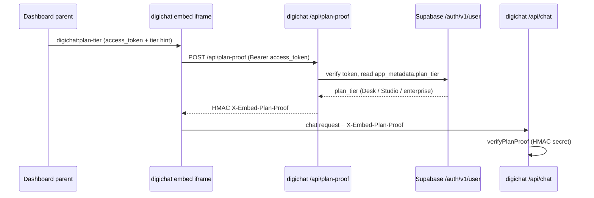

# Dashboard Architecture

The dashboard (`apps/dashboard`, npm package `dashboard`) is the digiquant
operator surface: research, portfolio, and execution in one
investment-intelligence UI (ADR-0026). It is a **Next.js 16 + React 19** app
that builds to a **static export** (`output: 'export'`) served under the
**`/dashboard/` base path** — the only public path; the old `/olympus/` path
is retired with no redirect alias.

## Hosting and routing

`basePath` is fixed to `/dashboard` in `next.config.mjs` and surfaced to
client code as `NEXT_PUBLIC_DASHBOARD_BASE_PATH` (a static export has no
runtime config; it is used by `oauthRedirectTo()` so PKCE `redirect_to`
matches the AUTH.md allow-list). Images are unoptimized, `trailingSlash` is
on, and `transpilePackages` compiles the `@digithings/ui` TypeScript sources.
The build runs `next build && npm run check:static-export` (a
`scripts/check-static-export.mjs` pass that verifies server/client class
boundaries). Top-level route groups under `app/` include `research`,
`portfolio` (which absorbs the legacy `performance` route as a tab),
`library`, `pipeline` (which absorbs `why`, `system`, `observability`, and
`architecture`), `strategy`, `house`, `auth`/`login`/`signup`, `settings`,
and `twelve-x`.

## Design system

Styling joins the root npm workspace and consumes the shared canon via
`@digithings/design` (canon tokens, quant-native and finance-tearsheet
grammars) plus the **Tailwind v4 bridge** from `@digithings/ui`
(`web-theme.css`, the `@theme inline` bridge) — not a separate web package.
`app/globals.css` layers Tailwind, the typography plugin, `tw-animate-css`,
the canon tokens, the theme bridge, and the quant-native / tearsheet /
controls / chat-core / digichat-launcher sheets. The dashboard declares **no
`@theme` bridge of its own** (#1402): every utility (`bg-surface`,
`text-ink`, `border-hair`, `text-up`/`text-down`, `font-mono`) resolves to
the one canon palette, and the only app-local custom props left are
non-utility depth cues (`--shadow-overlay`, `--cp-z`) plus the next/font
family re-declarations.

The root layout scopes pages to the blueprint background
(`qn-blueprint-bg`) and wires `ThemeProvider` → `MotionLayer` →
`AuthProvider` → `AuthGate` around the page. Fonts are **self-hosted at build
time** via `next/font` (a single Geist Mono face exposed as
`--font-geist-mono`) to satisfy the dashboard CSP (`font-src 'self' data:`)
— no `fonts.googleapis.com`. The version/env label
(`NEXT_PUBLIC_DASHBOARD_VERSION`, fallback `v0.1 · dev`) is rendered in the
settings chrome (`sidebar-settings.tsx` / `settings/page.tsx`), not in the
root layout.

## Data and auth

The dashboard reads persisted research/portfolio state (Supabase-backed book
tables) rather than calling the digiquant HTTP service per render. Its
`lib/` layer owns book reconciliation, benchmark tickers, auth context, an
auth gate, and accounting views, with fail-closed accounting helpers covered
by unit tests. Charts use `lightweight-charts` (time-series) and `recharts`
(categorical); markdown renders via `react-markdown` with GFM + sanitize.

The `AppFrame` shell (sidebar + mobile app bar + command palette) stays
mounted even when the backend is down, swapping the page body for a
`DbUnavailable` card on non-exempt routes. Auth is Supabase Auth (Google +
GitHub PKCE) behind `NEXT_PUBLIC_DASHBOARD_AUTH=1`; flag off (default) keeps
the anon read-only client.

## Fail-closed accounting

`reconcileBook` (in `lib/book-reconciliation.ts`) is the single source of
truth for the held book: it dedupes a ticker double-counted across category
buckets (keeping the max weight), **excludes an explicit CASH row from the
held set** (#1553), and normalizes so held + cash = 100%. `investedPct` (from
`nav_history` / `portfolio_metrics`) is the authoritative cash split when
known, otherwise it falls back to the deduped held sum capped at 100 — the
book is **never >100%**. `accounting-views.ts` pins the curated NAV view
(`public_accounting_nav_history`) and marks legacy↔finalized seams so charts
break the line instead of drawing a phantom return across two series; P&L
fails closed to `—` without a basis or mark rather than inventing a number.

## Plan tiers + entitlements

Effective ladder: **Observer** (`free`) → **Brief** → **Desk** → **Studio** /
Enterprise. Do not document Baseline/Custom as Stripe products.

`lib/entitlements.ts` is the plan-tier → artifact-class matrix (spec §5-T5,
mirrored in `digiquant/src/digiquant/notify/entitlements.py`): Observer sees
teaser classes (`research`, `narrative`, `digest_summary`,
`portfolio_teaser`); Brief adds `house_weights_nav`; Desk adds
`glassbox_economics` and `broker_status`; Studio/Enterprise add
`private_book` and `overlay_profile`. `effectivePlanTier` elevates the JWT
claim by a creator/ops `plan_floor` from `entitlement_grants`; when auth is
off (pre-cutover) `tierFromSession` returns `enterprise` so the operator UI
stays fully visible. Settings tab visibility is driven by the same matrix —
unavailable tabs are **omitted**, not greyed.

**Billing** (dashboard Settings) links Stripe `create-checkout-session` /
`customer-portal` for Brief / Desk / Studio (Observer is free). The display
catalog lives in `lib/pricing-catalog.ts`: Brief $10/mo or $96/yr, Desk
$30/mo or $288/yr, Studio $100/mo or $960/yr (annual = 20% off twelve
months); **annual is the default interval**, falling back to monthly when
annual prices are unset.

## Desk+ digichat popup

Desk / Studio / Enterprise sessions see a bottom-right digichat launcher with
full chat; Brief / Observer see the same launcher but an upgrade CTA panel
with chat disabled — **never an iframe**, so non-entitled tiers never burn
turns and never meet the free-3 gate. `canUseDigichatPopup` gates on
`glassbox_economics` (Desk+). The panel iframes digichat
`/embed?layout=embed` and sends sanitized page context (HTML ≤12k chars plus
visible text ≤8k) on open and on signature change, deduped by an FNV-1a
digest.

**Claims-backed plan proof (#3664):** digichat never trusts a client-asserted
`X-Embed-Plan-Tier` header or `?plan_tier=` query. After `digichat:ready`,
the dashboard posts `digichat:plan-tier` carrying the Supabase
`access_token` (the `tier` field is a UI hint only). The embed exchanges that
token at `POST /api/plan-proof`, which verifies it against Supabase
`/auth/v1/user` and reads `app_metadata.plan_tier` (Desk / Studio /
enterprise only), then mints an HMAC proof returned as `X-Embed-Plan-Proof`
on every chat request. Shared secret (ops, names only):
`DIGICHAT_PLAN_PROOF_SECRET`, plus `DIGICHAT_DASHBOARD_SUPABASE_URL` /
`DIGICHAT_DASHBOARD_SUPABASE_ANON_KEY` on digichat.

*The Desk+ plan-proof flow: the dashboard hands the embed a Supabase access
token, which the embed exchanges for an HMAC proof it attaches to every chat
request; the raw tier is never trusted from the client.*

The popup is default-on (`NEXT_PUBLIC_DIGICHAT_POPUP=0` kills it) and fails
closed when the resolved origin is outside the CSP `frame-src` allowlist or a
third-party embed host needs a token and none is configured. Client env reads
use direct `process.env.NEXT_PUBLIC_*` property access
(`digichatPopupEnvFromProcess`) so Turbopack inlines them at build time.

## Representative tests

Vitest (`npm run test` from `apps/dashboard/`): `globals.test.ts`, route
`page.test.ts` files, and `lib/` unit tests including
`book-reconciliation`, `accounting-views`, `accounting-nav-fail-closed`
(which asserts the tearsheet throws `AccountingNavContractError` rather than
silently rendering empty), `entitlements`, `pricing-catalog`, and
`digichat-popup` — pinning the fail-closed P&L contract (missing basis or
mark renders `—`, never an invented number) and the plan-proof flow.
