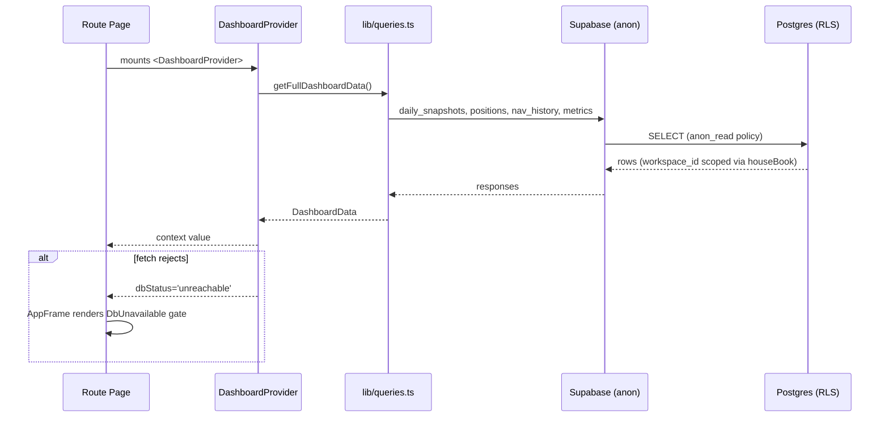
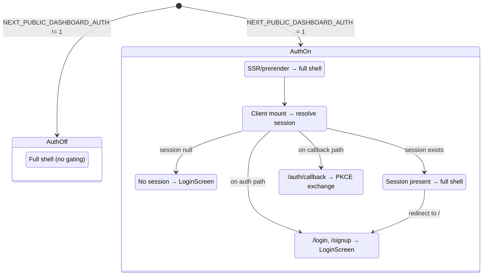
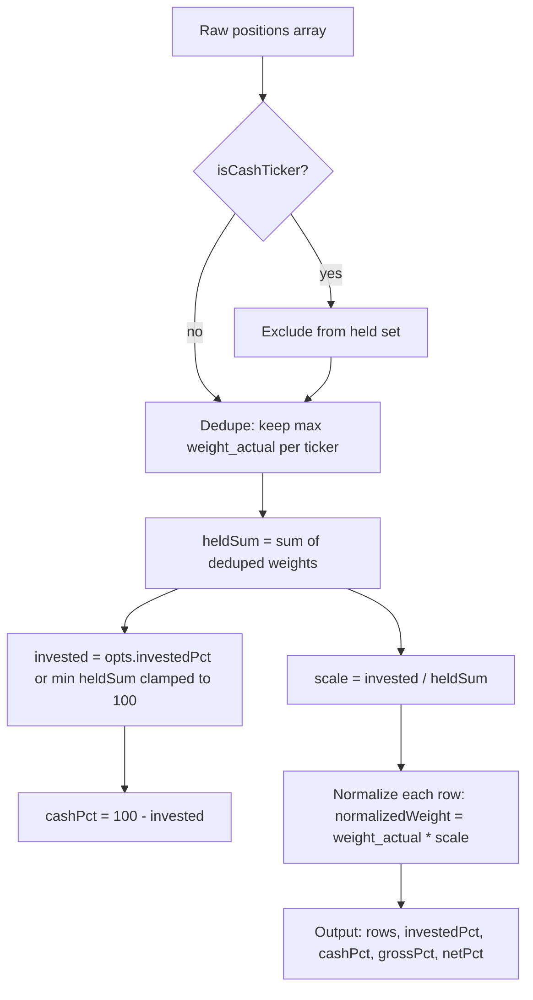

# Dashboard Architecture

The dashboard (`cloudflare/dashboard`, npm package `dashboard`) is the
digiquant operator surface: research, portfolio, and execution in one
investment-intelligence UI. It is a Next.js 16 + React 19 app that builds to a
**static export** (`output: 'export'`) served under the **`/dashboard/`
base path** (ADR-0026); the old `/olympus/` path is retired.

## Hosting and routing

`basePath` is fixed to `/dashboard/` in `next.config.mjs` and surfaced to
client code as `NEXT_PUBLIC_DASHBOARD_BASE_PATH` — a static export has no
runtime config. Images are unoptimized, `trailingSlash` is on, and
`@digithings/web` ships TypeScript sources so Next must compile them
(`transpilePackages`). The build runs a `check:static-export` step that scans
output route artifacts for server/client boundary violations (e.g. a
`SUBPAGE_MAX` client proxy leaking into the static output) and confirms the
Pipeline route carries an `<h1>` heading. A `scripts/write-build-info.sh` emits
`dist/build-info.json` with commit/branch/builder stamps so deployment freshness
checks can alert on stale builds.

The main app shell is `AppFrame` (`components/app-frame.tsx`): a fixed
**Sidebar** on desktop (260px, collapsible to 72px), a **MobileAppBar** on
mobile (hamburger + brand + search), a **CommandPalette** (`⌘K`), and the
**DigichatPopup** launcher (Desk+). The sidebar carries four primary nav items —
**Brief**, **Portfolio**, **Pipeline**, **FX Hub** — plus a Gloomberb Terminal
external link, auth identity, and a Settings popover. Pipeline absorbs legacy
routes (`/why`, `/research`, `/library`, `/system`, `/observability`,
`/architecture`); Portfolio absorbs `/performance`. When the Supabase backend
is unreachable or unconfigured, a `DbUnavailable` card gates the page while
keeping the shell and exempt routes (`/pipeline` health panel, `/settings`)
reachable.

## Design system

Styling joins the root npm workspace and consumes `@digithings/design` (canon
tokens, quant-native and finance-tearsheet grammars) plus the Tailwind v4
bridge and shared controls from `@digithings/web`. `app/globals.css` layers:

1. Tailwind (`@import "tailwindcss"`)
2. Typography plugin (`@plugin "@tailwindcss/typography"`)
3. `tw-animate-css` (before tokens, for animate-in/out utilities in the vendored kit)
4. Design tokens (`@digithings/design/tokens.css`)
5. Theme bridge (`@digithings/web/styles/web-theme.css` — the `@theme inline` block)
6. Shared controls dress (`controls-core.css`, `account-auth.css`, `controls-overlay.css`)
7. Account surfaces layout (`./account-surfaces.css`)
8. Stages, effects-chrome, quant-native, finance-tearsheet, chat-core, digichat-launcher
9. Command-palette and finance-composites sheets
10. Many `@source` directives scanning shared component sources under
   `../../digiweb/web/src/components/` so Tailwind generates utilities from
   package code it would otherwise skip (MIGRATION.md rule 3)
11. Dashboard-local variants and overrides: font re-declarations (self-hosted
   Geist Mono), blueprint grid light-mode override, scrollbar styling,
   Recharts overrides, `data-reveal` scroll animations, tearsheet §13
   adaptations, twelve-x consensus bar and event timeline, P&L color repointing,
   and sheet-overlay scrim

Fonts are self-hosted at build time via `next/font` (`Geist_Mono`) and exposed
through the hashed `--font-geist-mono` variable on `<html>`. CSS re-declares
`--font-sans`, `--font-mono`, `--font-display` to self-hosted faces, satisfying
the dashboard CSP (`font-src 'self' data:` — no `fonts.googleapis.com`).

The `body` element receives `qn-blueprint-bg min-h-screen bg-bg text-ink
antialiased`. The blueprint grid is dark by default with a light-mode override
at the bottom of `globals.css`. The accent (`--accent-digiquant`) is set by the
design tokens; individual routes may nest `.accent-research` to shift to the
research-job green. The P&L direction classes `.qn-up` / `.qn-down` are
repointed to canon `--up` / `--down` tokens (money-color semantics, fixed per
theme). `.qn-sidebar-label` and `.qn-sidebar-link-active` style the collapsible
sidebar rail.

## Data and auth layer

### Supabase data flow

The dashboard reads persisted portfolio/research state from the shared
digiquant Supabase project. Client-side data flows through:



The `DashboardProvider` (`lib/dashboard-context.tsx`) fetches via
`getFullDashboardData()` and exposes `{ data, loading, error, dbStatus }`.
`dbStatus` is `'ok'` (configured and reachable), `'unconfigured'` (Supabase env
absent), or `'unreachable'` (fetch rejected). While loading, status stays
`'ok'` so the gate never flashes during normal startup.

Group A reads (`positions`, `position_events`, `nav_history`,
`portfolio_metrics`) go through `houseBook()` in `lib/house-workspace.ts`,
which pins the query to the house `workspace_id`
(`6b753576-ced9-5319-9bfa-c5d0aacd9319`). Without this filter, an authenticated
Custom member's RLS would mix overlay rows into the public Brief / Holdings /
Performance surfaces. Shared teasers without `workspace_id`
(`daily_snapshots`, `theses`, `instruments`) stay date-only.

### Committed-book SSOT

`lib/dashboard-ssot.ts` enforces that Brief, Pipeline, `pm-rebalance`, and
holdings all follow `daily_snapshots.date`:

- `committedBookDate(snapshotDate, positionDates)` — latest positions date ≤
  the committed snapshot
- `previousBookDate(bookDate, positionDates)` — latest strictly before the
  committed book date
- `bookedCoversCommittedSnapshot()` — true when booked positions row-set is for
  the snapshot date itself
- `unpublishedBookNote()` — operator copy when newer positions are hidden
- `assertDailySnapshotQueryOk(error)` — throws on snapshot query failure

### Accounting views

`lib/accounting-views.ts` defines canonical accounting read surface names:

- `ACCOUNTING_NAV_VIEW` = `'public_accounting_nav_history'` (finalized tips +
  labeled legacy estimates, chained with seam markers)
- `LEGACY_PUBLIC_NAV_VIEW` = `'public_nav_history'` (rollback target)
- `PUBLIC_REALIZED_ATTRIBUTION_VIEW` = `'public_daily_realized_attribution'`
- `PUBLIC_PERIOD_STATUS_VIEW` = `'public_accounting_period_status'`

Rollback = repoint constants to `LEGACY_*` without deleting rows.
`accountingNavToHistoryShape()` maps curated rows onto the legacy shape used by
tearsheet builders. `chainNavContinuity()` chains across source runs, marking
`series_seam` rows so charts break the line at legacy→finalized boundaries.

### Auth gating (T1 feature flag)

Auth is opt-in behind `NEXT_PUBLIC_DASHBOARD_AUTH=1`. When off, the dashboard
behaves identically to the pre-T1 anon-only path.



`AuthProvider` (`lib/auth-context.tsx`) creates the Supabase client (PKCE flow
when flag on, plain anon when off), resolves the initial session, and listens
for auth state changes. `AuthGate` (`lib/auth-gate.tsx`) is the flag-aware guard
that renders the full shell when auth is off, and conditionally renders
`LoginScreen` or the full shell under auth. PKCE callbacks on
`/auth/callback` are handled regardless of existing session state.

OAuth providers: Google, GitHub, X. `oauthRedirectTo()` builds the callback
URL from `window.location.origin + dashboardBasePath() + '/auth/callback/'`.
`oauthSignInOptions()` sets `skipBrowserRedirect: true` so the caller assigns
`data.url` directly — Google's redirect URL otherwise drops on the static
`/dashboard/` basePath. `lib/auth-errors.ts` maps supabase-js errors to
operator-actionable copy without leaking secrets.

### Book reconciliation

`lib/book-reconciliation.ts` provides:



- `reconcileBook(positions, opts?)` — dedupes overlapping tickers (keeps max
  weight), excludes CASH rows from the held set, normalizes held weights so
  held + cash = 100%. `investedPct` (from `nav_history` / `portfolio_metrics`)
  is the authoritative cash split; absent that, falls back to deduped held sum
  capped at 100. Never returns a >100% book.
- `isCashTicker(ticker)` — CASH is the invested/cash split, never a held row.
- `heldByWeight(rows)` — sorts held rows by normalized weight descending.

### Fail-closed P&L contract

The P&L rendering contract is fail-closed: missing basis or mark renders `—`,
never an invented number. The accounting NAV query (`public_accounting_nav_history`)
throws `AccountingNavContractError` on failure — never silently returns empty
rows. This contract is enforced across both the dashboard and digiquant-web
(`cloudflare/digiquant-web/lib/live/accounting-nav-contract.ts`) and verified
by `lib/accounting-nav-fail-closed.test.ts`.

## Performance tearsheet

The tearsheet at `/portfolio/performance` renders persisted NAV and return
metrics via `getPerformanceBundle` (from `public_accounting_nav_history`), a
base-zero portfolio path, current-book contribution, and open-position
outcomes. Open-book unrealized prefers stored `unrealized_pnl_pct` /
`since_entry_return_pct`, else derives from `entry_price` vs `current_price`,
filling a missing nightly mark from the market API (`GET /v1/market/closes`,
R2-backed). Benchmark universe comes from `GET /v1/market/tickers` (R2-backed;
empty answer falls back to benchmark key defaults). Chart rendering uses
**lightweight-charts** for time-series (NAV, drawdown, rolling risk, price +
position panes) via the shared `useLightweightChart` scaffold
(`lib/lw-chart.tsx`). **recharts** stays for categorical/composition surfaces
(e.g. ticker bars, allocation stacks, sparklines). All chart colors come from
`lib/chart-colors.ts` (the single sanctioned color source).

## Chart theming and table grammar

Global `.recharts-*` overrides in `globals.css` reference canon tokens
(`--hair`, `--ink-mute`, `--font-mono`). Portfolio tables stay app-local rather
than adopting the promoted `<SortableTable/>` leaderboard from
`@digithings/web` finance-composites — their row drilldown, sector grouping,
per-cell money tones, and responsive column hiding exceed the primitive's
string-cell API. New flat leaderboards should adopt the primitive.

## digichat popup (Desk+)

Desk / Studio / Enterprise sessions see a bottom-right shared digiweb launcher
that iframes digichat `/embed?layout=embed`. Brief and Observer see the same
launcher but opening it shows an upgrade CTA panel (no iframe, no turn burn).
The embed mints an HMAC proof via `POST /api/plan-proof` after verifying the
dashboard Supabase access token and reading `app_metadata.plan_tier` — never a
raw `X-Embed-Plan-Tier` header. Page-context sanitization walks the live DOM
(computed style, `hidden`/`inert`/`aria-hidden` states, `data-digichat-private`
opt-out) and sends structurally sanitized HTML + visible text on open and on
route/query change (~500ms debounce, deduped by signature).

## Representative tests

Vitest (`npm run test` from `cloudflare/dashboard/`): `lib/` unit tests
covering book reconciliation, accounting views, accounting-nav fail-closed,
dashboard-ssot committed-book logic, auth context/gate, holdings/portfolio
aggregates, performance SSOT, tearsheet build, attribution, position events,
pipeline topology/trace, and digichat popup. The fail-closed test asserts that
dashboard and digiquant-web both throw `AccountingNavContractError` on
accounting NAV query failure rather than silently returning empty rows.

## Settings workspace

`/settings` is a tabbed workspace — **Profile | Pipeline | Keys | Brokers |
Notifications | Billing | About**. Tab visibility is gated by effective plan
tier (Observer and Brief see Notifications/Billing/About only; Desk adds
Brokers; Studio/enterprise see all). The version/env label
(`NEXT_PUBLIC_DASHBOARD_VERSION`, fallback `v0.1 · dev`) is rendered in the
sidebar **Settings** popover (`components/sidebar-settings.tsx`) alongside the
data source host and last-run metadata — not in a separate page-chrome header
strip.

## Canonical tier ladder

Effective ladder: **Observer** (free) → **Brief** → **Desk** → **Studio** /
Enterprise. Do not document Baseline/Custom as Stripe products.

- **Billing** (dashboard Settings): Brief / Desk / Studio checkout; annual is
  the default interval.
- **Desk+ digichat popup:** Desk / Studio / enterprise get full chat; Brief /
  Observer see the upgrade CTA.

## Running

```bash
# From repo root
npm install # links workspace packages
npm --workspace cloudflare/dashboard run dev # http://127.0.0.1:3001/dashboard/
npm --workspace cloudflare/dashboard run build # static export (output: 'export')
npm --workspace cloudflare/dashboard run check:static-export
npm --workspace cloudflare/dashboard run lint
npm --workspace cloudflare/dashboard run test # Vitest
```
