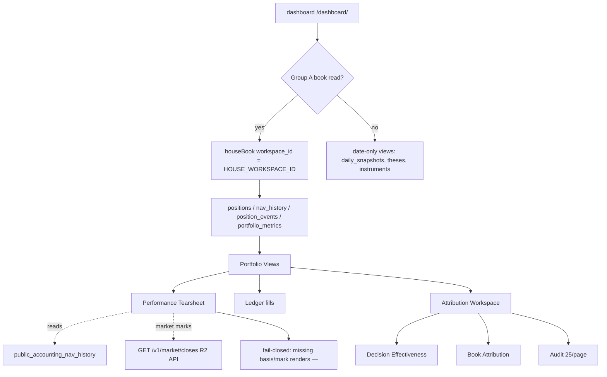

# Dashboard Operator Views

The dashboard renders persisted research and portfolio state. Its views
share two invariants: **house book scope** (Group A reads go through
`houseBook()` so overlay weights never seed the public book) and
**fail-closed P&L** (missing basis or mark renders `—`; the UI never
invents numbers).

## Operator-view overview

*Operator-view data flow: Group A book reads pin the house workspace; tearsheet and attribution surfaces read curated accounting views with fail-closed P&L.*

## Research and portfolio

`app/research/` and `app/portfolio/` present daily research documents
(theses, briefs) and the portfolio book (holdings, performance, ledger,
attribution, tickers). Research views link published documents to the
positions they motivated via brief-book events; portfolio views read the
house book only.

## Performance tearsheet

`app/portfolio/performance/` renders the finance-tearsheet view: persisted
NAV and return metrics, a base-zero portfolio path, current-book
contribution, and open-position outcomes. It reads
`public_accounting_nav_history` (finalized tips plus labeled legacy estimates)
via `getPerformanceBundle`, sharing the same series and `performance-ssot`
helpers as Brief (#3580). Rollback targets `LEGACY_PUBLIC_NAV_VIEW`
(`public_nav_history`) by repointing the constant — no code deletion required
(`repo://cloudflare/dashboard/lib/accounting-views.ts#L8-L12`).

Open-book **Unrealized** prefers stored `unrealized_pnl_pct` (per
`ValuablePosition` in `live-valuation.ts`, `repo://cloudflare/dashboard/lib/live-valuation.ts#L126-L135`), else
derives from `entry_price` vs `current_price`. When the nightly metrics stamp
is missing, fills the mark from the R2 market API (`GET /v1/market/closes`,
`repo://cloudflare/dashboard/lib/market-data.ts#L51-L77`, AS OF = that close date; empty when
`NEXT_PUBLIC_MARKET_DATA_URL` is unset — #4053, R2-API-only, no Supabase
fallback). The `price_history` table was **dropped** in migration 127 (#4053).
Fail closed to `—` without basis or mark — never invent P&L.

Benchmark comparison defaults to SPY, aligning the benchmark universe from the
market API (`GET /v1/market/tickers`, R2-backed) to the NAV dates and
recomputing excess return (Rp − Rb) on change. The tearsheet links to Ledger
as the single source of truth for fills instead of duplicating a closed-positions
tab.

## Ledger

`app/portfolio/ledger/` is the single source of truth for fills: every
`OPEN` / `ADD` / `EXIT` / `TRIM` event with average entry, fill price, and
realized % vs average entry for sells. Sold weight derives from
`prev_weight_pct − weight_pct`. Fail closed without fill price or cost basis —
never invent fills. `position_events.cumulative_return_since_event_pct` is
post-event drift, never presented as trade return.

## Attribution

`app/portfolio/attribution/` defaults to a compact decision-effectiveness
monitor with book attribution and audit as sibling views — toggled via a
`WorkspaceView` switch (`'effectiveness'` | `'attribution'` | `'audit'`,
`repo://cloudflare/dashboard/components/portfolio/AttributionWorkspace.tsx#L15-L21`).

Headline metrics use **direction-adjusted alpha** over independently scored
decisions: bearish calls negate stored raw alpha, watch calls remain
audit-only, and overlapping same-ticker same-stance updates count once from
their initiating call (episode collapsing in
`repo://cloudflare/dashboard/lib/decision-scorecard.ts#L69-L115`). Calibration
remains `'insufficient'` until at least two conviction buckets each hold 10
independent decisions
(`repo://cloudflare/dashboard/lib/decision-scorecard.ts#L269-L276`). Audit preserves every raw
row at `PAGE_SIZE = 25` rows per page
(`repo://cloudflare/dashboard/components/portfolio/DecisionAudit.tsx#L29`).

Analysis defaults to all available history; `1W`, `1M`, `3M`, `YTD`, and `1Y`
period controls rescope every decision metric, diagnostic, review item, Audit
row, and trend point. Book attribution remains the latest stored snapshot and
says so explicitly — its persisted rows are not a historical return series.
CASH remains outside holding counts and position charts, but its allocation
effect is included in headline active return so the decomposition reconciles
to portfolio return minus benchmark return.

## House book scope

Every house-dashboard Group A read (`positions`, `nav_history`,
`position_events`, `portfolio_metrics`) goes through `houseBook()`, which
pins the house `workspace_id` constant
`HOUSE_WORKSPACE_ID = '6b753576-ced9-5319-9bfa-c5d0aacd9319'`
(`repo://cloudflare/dashboard/lib/house-workspace.ts#L21`). This is a public UUID (uuid5
tenancy namespace + slug `house`) matching migration 096/110 seeds. RLS
allows an authenticated Custom member to SELECT their own overlay rows
(migration 109), so omitting the workspace filter would mix overlay weights
into the public house Brief / Holdings / Performance surfaces. The test at
`repo://cloudflare/dashboard/lib/house-workspace.test.ts#L54-L73` asserts that all Group A reader
files use `houseBook()` and never contain raw `.from()` calls on Group A
tables.

Shared teasers without `workspace_id` (`daily_snapshots`, `theses`,
`instruments`) stay date-only. Accounting NAV reads
`public_accounting_nav_history` (security-definer view; house-only until a
later view rewrite, `repo://cloudflare/dashboard/lib/house-workspace.ts#L14-L16`).

### Accounting NAV fail-closed contract

The curated public NAV view carries a typed contract error —
`AccountingNavContractError` — that callers must surface rather than swallow
into a silent empty success surface. The error detects missing views
(PostgREST PGRST205, unapplied migrations) and generic query failures
(`repo://cloudflare/dashboard/lib/accounting-views.ts#L224-L247`). Dashboard tearsheet fetch
(`observability-queries.ts`) throws it explicitly; `queries.ts` asserts via
`assertAccountingNavQueryOk` before mapping rows. The fail-closed wiring test
at `repo://cloudflare/dashboard/lib/accounting-nav-fail-closed.test.ts` asserts no browser fallback
to `public_nav_history` and no "momentarily unavailable" silent degradation.

## Plan-tier ladder

The canonical tier ladder determines what surfaces and features each user
sees:

| Tier | Stripe product | Artifact classes | Key unlocks |
|------|---------------|------------------|-------------|
| **Observer** (free) | none | `research`, `narrative`, `digest_summary`, `portfolio_teaser` | Public teaser only |
| **Brief** | $10/mo or $96/yr | + `house_weights_nav` | House weights, NAV, performance |
| **Desk** | $30/mo or $288/yr | + `glassbox_economics`, `broker_status` | Glass-box pipeline, paper brokers, digichat popup |
| **Studio** | $100/mo or $960/yr | + `private_book`, `overlay_profile` | Overlay, private book, BYOK |
| **Enterprise** | (contract) | Same as Studio | + seats/SLA (out of band) |

Annual is 20% off twelve months of monthly list. Tiers are defined in
`repo://cloudflare/dashboard/lib/entitlements.ts#L36-L42` and `repo://cloudflare/dashboard/lib/pricing-catalog.ts#L28-L50`.
Settings tabs that the current tier cannot use are **omitted**, not greyed
(`repo://cloudflare/dashboard/lib/entitlements.ts#L191-L195`).

When dashboard auth is off (pre-cutover), `tierFromSession` returns
`enterprise` so the operator UI stays fully visible (`repo://cloudflare/dashboard/lib/entitlements.ts#L117-L122`).

## Desk+ digichat popup and HMAC plan proof

Desk / Studio / Enterprise sessions see a bottom-right digichat launcher
that iframes digichat `/embed?layout=embed`. Brief and Observer see the
same launcher but with an upgrade CTA panel and no iframe, so baseline
never burns turns (Chris lock: no free-3 quota).

**Claims-backed plan proof (#3664):** digichat never trusts client-asserted
`X-Embed-Plan-Tier` or `?plan_tier=` query params. The embed mints an
HMAC proof via `POST /api/plan-proof` only after:

1. Verifying the dashboard Supabase access token
2. Reading `app_metadata.plan_tier` (Desk / Studio / enterprise only)

Chat accepts `X-Embed-Plan-Proof` (or an authenticated digichat session
with claims `plan_tier`). The digichat tenant config for `digiquant.io`
pins `gateMode: "ungated"`, `llmAccess: "operator"`, `requiredPlanTier:
"desk"`, and `showByok: true` — entitled chat is never turn-capped and
spend rides operator keys with no visitor BYOK handoff
(`repo://cloudflare/dashboard/lib/digichat-popup.ts#L19-L20`, `repo://cloudflare/dashboard/README.md#L291-L307`).

The popup is default-on (#3638); kill with `NEXT_PUBLIC_DIGICHAT_POPUP=0`.
Fails closed when the resolved origin is outside CSP `frame-src` or when a
third-party embed host needs a token and none is configured
(`repo://cloudflare/dashboard/lib/digichat-popup.ts#L189-L200`).

## Committed-book SSOT

Brief, Pipeline, `pm-rebalance`, and holdings follow `daily_snapshots.date`.
Positions and rebalance rows newer than that snapshot are ignored until a
snapshot exists for that date. Pipeline Health notes hidden newer positions
only when those dates exist; a snapshot query error fails closed
(`repo://cloudflare/dashboard/lib/observability-queries.ts`, committed-book date via
`committedBookDate` in `dashboard-ssot.ts`).
