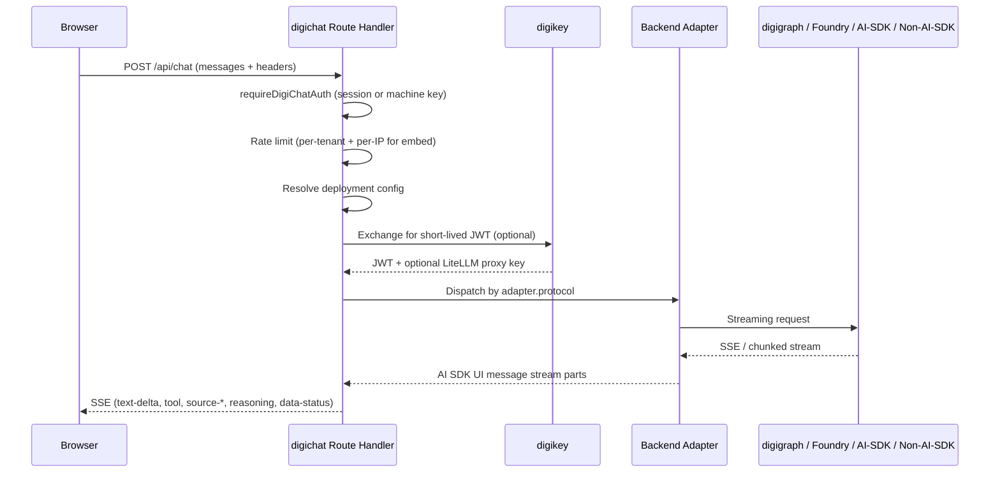
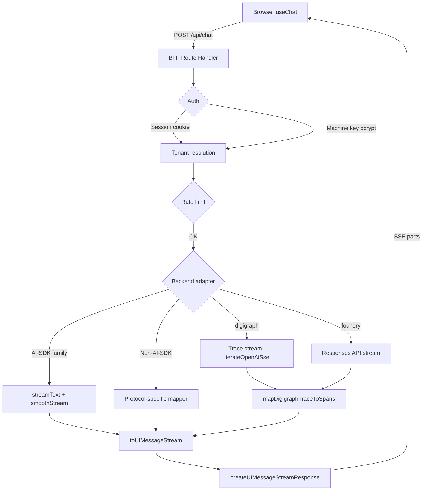

# digichat Architecture

digichat (`apps/digichat`, package `digichat`, version 2.3.2, default port 3005) is the
user-facing chat interface to the digithings ecosystem. It is a Next.js 16 App Router
application acting strictly as a **Backend-for-Frontend (BFF)**: the browser never
speaks to digigraph or any Python service. All LLM calls, auth token exchanges, and
upstream probes run in server-side Route Handlers. The 2.0 release line adds
assistant-ui Thread skins, AI SDK v7, a Zod-validated deployment-config YAML, and a
multi-adapter backend registry.

## BFF invariant

No digigraph URL, digikey token, or upstream credential may ever reach the browser.
Route handlers under `src/app/api/` (`auth`, `byok`, `chat`, `conversations`,
`ecosystem`, `embed`, `health`, `v1`, `plan-proof`, `deploy`, `mcp`) do the upstream
work; every handler except `GET /api/health` requires `requireDigiChatAuth()`.
User-supplied service URLs pass `isAllowedServiceUrl()` (SSRF guard) before any fetch.
The `X-Digichat-Session` header carries only an opaque UUID, never the session token.

## Request flow

## Deployment config (YAML + env overlay)

The 2.0 release replaces ad-hoc env combinations with a single Zod-validated YAML file:

- **Path:** `DIGICHAT_CONFIG_PATH` (default `/app/config/digichat.yaml`)
- **Loader:** `src/lib/deploy-config/loader.ts` — `loadDigichatConfig()` / `getDigichatConfig()`
- **Startup:** `src/instrumentation.ts` calls `initDigichatConfigAtStartup()` (fail closed)
- **Schema:** `src/lib/deploy-config/schema.ts` — `DeploymentSchema` with `chrome`, `backend`, `tools`, `mcp`, `gate`, `features`, `models`, `persistence`, `auth`, `cli`

**Shape:** `version: 1` plus either a single `deployment` block (client container) or `hosts` (multi-tenant container). Key fields:

| Field | Purpose |
|---|---|
| `chrome.mode` | `app` / `embed` / `modal` / `sidebar` |
| `chrome.skin` | Thread template: `base`, `chatgpt`, `claude`, `grok`, `gemini`, `perplexity`, `react-ink`, `base-assistant-ui`, `webpage-assistant`, `product-page-assistant`, `expo-react-native`, or first-party `digichat` |
| `backend.type` | `digigraph`, `foundry`, `openai-completions`, `openai-responses`, `anthropic`, `google-vertex`, `langgraph`, `ag-ui`, or `a2a` |
| `persistence` | `none` / `memory` / `server` |
| `gate` | `turn_limited`, `ungated`, `trial_form`; `requiredPlanTier`; `webSearch`; `consumeUrl` |
| `mcp.servers` | Operator MCP servers (URLs never reach browser) |
| `tools.catalog` | Tool ids available in the catalog bar / slash commands |
| `models.default` / `models.available` / `models.allowPicker` | Model allowlisting |
| `features` | `reasoning`, `toolCalls`, `attachments`, `pageContext`, `dictation` |

**Client projection:** `toDigichatClientConfig()` strips tokens, Foundry endpoints, MCP URLs, and consume URLs before sending config to the browser. `GET /api/deploy/chrome` serves the sanitized projection.

**Env overlay:** `DIGICHAT_CHROME_SKIN` overlays `chrome.skin`; `DIGICHAT_EMBED_TENANTS` JSON serves as compat hydrate into the same schema.

## Multi-backend adapter architecture

The 2.0 backend registry (`src/lib/backend-adapters.ts`) describes every backend once — the route handler selects the streaming path from `adapter.protocol`, never from a raw `backend.type` comparison.

### Backend adapter matrix

| Backend (`type`) | Protocol | Auth | Reasoning | Tool calls | Web search | Turn mutation | Corpus |
|---|---|---|---|---|---|---|---|
| `digigraph` | `digigraph-trace` | upstream-bearer | yes | yes | yes | yes | yes |
| `foundry` | `foundry-responses` | managed-identity | yes | yes | no | yes | no |
| `openai-completions` | `openai-completions` | env | yes | yes | yes | no | no |
| `openai-responses` | `openai-responses` | env | yes | yes | yes | no | no |
| `anthropic` | `anthropic-messages` | env | yes | yes | declared | no | no |
| `google-vertex` | `gemini` | managed-identity | yes | yes | declared | no | no |
| `langgraph` | `langgraph` | env | yes | yes | declared | no | no |
| `ag-ui` | `ag-ui` | env | yes | yes | declared | no | no |
| `a2a` | `a2a` | env | no | no | no | no | no |

The three streaming families:

1. **digigraph / Foundry** — hand-rolled SSE mappers under `src/lib/adapters/digithings/stream.ts` and `src/lib/adapters/foundry/stream.ts`. Digigraph reads `delta.digigraph_trace` payloads; Foundry consumes Azure AI Projects Responses API events. Both normalize onto the same `ActivitySpan` vocabulary for standard UI parts.

2. **AI-SDK family** (`openai-completions`, `openai-responses`, `anthropic`, `google-vertex`) — one shared `streamText` → `toUIMessageStream` mapper in `src/lib/adapters/ai-sdk/stream.ts`. Provider credentials come from env vars named by the config (`apiKeyEnv`), never from the config body. Vertex uses Application Default Credentials from the ambient environment.

3. **Non-AI-SDK family** (`langgraph`, `ag-ui`, `a2a`) — each has its own protocol mapper under `src/lib/adapters/`. The shared dispatcher `src/lib/adapters/non-ai-sdk.ts` resolves credentials once and picks the right mapper.

All backends emit the same AI SDK UI message stream parts — the UI never learns which backend produced a part.

### digigraph adapter specifics

- Calls `POST {digigraph}/v1/chat/completions` with custom `digigraph_trace` deltas
- `mapDigigraphTraceToSpans` converts typed payloads (`tool_call`, `tool_result`, `rag_sources`, `graph_update`) into standard `tool-*`, `source-*`, reasoning, and `data-status` parts
- `X-Session-Id`, `X-Request-ID`, `X-Digichat-Tenant`, `X-Digi-Caller: digichat` forwarded as upstream headers
- `X-Digi-Language` forwarded; digigraph prepends a language directive to the user query
- Tools re-run on regen (full workflow replay); edit truncates client transcript

### Foundry adapter specifics

- Uses `@azure/ai-projects` + `DefaultAzureCredential` (container managed identity)
- Conversation state lives in Azure Foundry; `X-External-Conversation` correlates turns
- Regen/edit mutate conversation items (delete + `responses.create`); returns `501 not_supported` when item API is unavailable
- `azure_ai_search` results map to standard tool / `source-*` parts
- Language directive prepended to input text (Foundry has no per-call system-prompt slot)

### AI-SDK adapters

- `src/lib/adapters/ai-sdk/providers.ts`: factory that resolves `LanguageModel` from backend config
- `@ai-sdk/openai-compatible` for `openai-completions` (reads `reasoning_content` from any compatible vendor)
- `@ai-sdk/openai` for `openai-responses` (native Responses wire format)
- `@ai-sdk/anthropic` and `@ai-sdk/google-vertex` for the respective providers
- Backend credential errors return `502 backend_unavailable` with the env var name (never its value)
- Provider-side web search tools surface citations as `source-url` / `source-document` parts

### Turn mutation & concurrency

- `X-Digi-Turn-Mode`: `send` (default), `regenerate`, or `edit_last_user`
- `X-Digi-Run-Id`: optional idempotency key
- Concurrent runs on the same session → `409 run_in_progress`
- Duplicate run ids → `409 run_id_replay`
- `X-Digi-Force-Tool` (send-only) is catalog-allowlisted on the BFF

## UI architecture: assistant-ui Thread skins

The 2.0 UI replaces the 1.x custom thread with **assistant-ui `Thread` skins** selected per deployment:

- **First-party skin `digichat`:** `DigichatThread` from `@digithings/ui/chat/thread` — gallery thread with cube glyphs
- **11 official catalog templates:** vendored under `src/components/assistant-ui/skins/` and under `src/app/(baseline)/stock/`
- **Skin selection:** `chrome.skin` in deploy YAML, `DIGICHAT_CHROME_SKIN` env overlay, or `?skin=` on `/baseline`
- **Thread rendering:** `ThreadSkinView` inside `ProductStockShell` (`src/components/stock/product-shell.tsx`)
- **Transport:** `AssistantChatTransport` from `@assistant-ui/ai-sdk` wraps `useChat` from `@ai-sdk/react`, pointed at `POST /api/chat`

First-party hosts (`digithings.ai`, `www.digithings.ai`, `occ.digithings.ai`) default omitted `skin` to `digichat`. Unconfigured `/embed` defaults to the `digichat` skin with baseline suggestion chips.

### Local baseline preview

`/baseline` (`src/app/(baseline)/`) is an isolated layout that never loads digichat `globals.css`. Default template is `base`. The BFF proxies `https://digithings.ai/api/chat` (loopback + non-production only). Dev-only.

## AI SDK v7 streaming pipeline

All streaming is HTTP/1.1 `Transfer-Encoding: chunked` SSE. The browser receives standard UI message stream parts: `text-delta`, `tool-{name}` (input + result), `source-url` / `source-document`, reasoning, and `data-status`. The `x-vercel-ai-ui-message-stream: v1` header identifies the stream format.

## Capability matrix

| Capability | Status |
|---|---|
| React 19 streaming chat (`useChat` + assistant-ui, AI SDK v7) | Built |
| Auth.js v5 — generic OIDC provider | Built |
| Auth.js v5 — dev password provider (`DIGICHAT_DEV_AUTH`) | Built |
| digikey JWT exchange (`bff_session` + `api_key` grants) | Built |
| Machine API key auth (`digi_live_…`, hashed in Postgres) | Built |
| Conversation persistence — localStorage (always on) | Built |
| Conversation persistence — Postgres (optional) | Built |
| Standard UI stream parts (tool / source / reasoning / `data-status`) | Built |
| Default UI: assistant-ui Thread skins (11 catalog + first-party `digichat`) | Built (2.0) |
| Deployment config (Zod YAML + env overlay + tenants compat) | Built (2.0) |
| Granular deploy knobs (disclosure / language / models / `cli.enabled`) | Built (2.0) |
| Multi-backend adapter registry (digigraph, Foundry, AI-SDK, non-AI-SDK) | Built (2.0) |
| AI-SDK provider factory (OpenAI Comp/Resp, Anthropic, Vertex) | Built (2.0) |
| Non-AI-SDK protocols (LangGraph, AG-UI, A2A) | Built (2.0) |
| digichat Ink CLI (`apps/digichat/cli`, separate from Next bundle) | Built (2.0) |
| Local baseline preview (`/baseline`, production chat BFF proxy) | Dev-only |
| Turn / thread markdown export | Built |
| Last-turn regen + edit with concurrency control | Built |
| Quant comparison strip (inline `BacktestResult` parsing) | Built |
| Quant run persistence (`quant_runs` table) | Built |
| Ecosystem side panel (service URLs + health badges) | Built |
| Opt-in web search (tenant + user; embed session default ON) | Built |
| BYOK (bring-your-own-key) with inline terminal flow | Built |
| Embed trial gate (turn-limited, trial-form, server-side token consume) | Built |
| Embed slash commands (`/search`, `/vault`, `/language`, `/mcp`, `/models`, `/provider`, etc.) | Built |
| Operator MCP with session overlay (BFF-proxied, never browser) | Built |
| Plan-proof HMAC for Desk+ chat entitlement | Built |
| Page-context postMessage (sanitized DOM snapshot) | Built |
| Auto-migration on container boot (`DIGICHAT_AUTO_MIGRATE=1`) | Built |
| Docker Compose profile (`digichat` + `digichat-db`) | Built |
| OpenClaw gateway integration | Not yet (Phase 2) |
| RAG document ingestion UI | Not yet (Phase 2) |
| Fine-grained permission admin UI | Not yet (Phase 2) |
| digibase credential brokering | Not yet (roadmap) |

## Module map

| Area | Role |
|---|---|
| `src/app/api/` | Route handlers: auth, byok, chat, conversations, ecosystem, embed, health, deploy, mcp, plan-proof |
| `src/lib/adapters/` | Backend adapters: `digithings`, `foundry`, `ai-sdk`, `langgraph`, `ag-ui`, `a2a`, `shared` |
| `src/lib/deploy-config/` | YAML loader, Zod schema, client projection, force-tool gate, MCP server helpers |
| `src/lib/backend-adapters.ts` | Backend adapter registry with protocol, auth, and capabilities |
| `src/components/` | Chat shell, chat panel, product shell, thread skins, quant strip, ecosystem sheet, BYOK flow, toolbar |
| `src/db/` | Drizzle schema (6 tables) + index + migrations |
| `src/auth.ts` | Auth.js v5 OIDC config |
| `src/proxy.ts` | Edge proxy for CSP header overwrite on `/embed` |
| `src/instrumentation.ts` | Boot-time auto-migration + config init (`DIGICHAT_AUTO_MIGRATE=1`) |

## Data model

### Drizzle schema (`src/db/schema.ts`)

Six tables managed by three migration files in `drizzle/`:

- **`tenants`** — `id` (UUID PK), `slug` (unique), `name`, `created_at`
- **`user_tenants`** — `id`, `provider_account_id` (OIDC sub), `tenant_id` (FK → tenants, CASCADE), unique on `(provider_account_id, tenant_id)`
- **`api_keys`** — `id`, `tenant_id` (FK), `key_hash` (bcrypt), `key_prefix` (first 20 chars), `label`, `created_at`
- **`conversations`** — `id` (UUID, client-mintable), `tenant_id` (FK), `owner_user_sub`, `title`, `created_at`, `updated_at`. Index on `(tenant_id, owner_user_sub, updated_at)`
- **`conversation_messages`** — `id`, `conversation_id` (FK, CASCADE), `sequence` (int, 0-based), `payload` (JSONB — full AI SDK `UIMessage`), unique on `(conversation_id, sequence)`
- **`quant_runs`** — `id`, `conversation_id` (FK, CASCADE), `label`, `strategy_name`, `symbols` (JSONB `string[]`), `strategy_params` (JSONB), `backtest_result` (JSONB), index on `(conversation_id, created_at)`

### Postgres connection

`src/db/index.ts` provides a singleton `postgres-js` pool: `max: 10`, `idle_timeout: 20`, `connect_timeout: 10`. Migrations run via `runMigrate()` in `src/lib/migrate.ts` — opens a single dedicated connection, runs all pending Drizzle migrations, and closes.

## Auth

### Auth.js OIDC

Generic OIDC provider activated when `AUTH_OIDC_ISSUER` + `AUTH_OIDC_CLIENT_ID` + `AUTH_OIDC_CLIENT_SECRET` are set. Auth.js v5 handles PKCE (`code_challenge_method=S256`). Session stored as an encrypted JWT in an httpOnly cookie. Stateless — no database session store.

### Machine API keys

`digi_live_…` keys validated via two-step process: prefix lookup (first 20 chars from `key_prefix` column), then bcrypt compare. Created via `npm run db:create-key -- <slug> <label>`. Never returned to the client.

### digikey JWT exchange

Two grant types on `POST {DIGIKEY_URL}/v1/oauth/token`:
- **`bff_session`:** BFF presents `DIGIKEY_BFF_TOKEN` on behalf of an OIDC session
- **`api_key`:** Client presents `dgk_live_…` Bearer → BFF exchanges for short-lived JWT

A new JWT is exchanged on every chat request (no client-side caching). Optional `litellm_proxy_api_key` forwarded as `X-LiteLLM-Proxy-Key`.

### Plan-proof HMAC (#3664)

Desk+ chat entitlement for the digiquant dashboard embed:

- **Mint:** `POST /api/plan-proof` verifies dashboard Supabase access token, reads JWT claims `plan_tier`, falls back to effective tier from `my_access` RPC (`max(plan_tier, plan_floor)`)
- **Verify:** `POST /api/chat` accepts `X-Embed-Plan-Proof` verified with `DIGICHAT_PLAN_PROOF_SECRET` (HMAC-SHA256, 5-minute TTL)
- **Fallback:** authenticated digichat session with `app_metadata.plan_tier`
- **Never trusted:** raw `X-Embed-Plan-Tier` / `?plan_tier=` (client-asserted, spoofable)
- **Missing secrets → 503**

## Design-canon theming

digichat runs on the shared digithings design token canon:

- `@digithings/design/tokens.css` defines `[data-theme="dark"|"light"]` semantic tokens
- `@digithings/ui/styles/web-theme.css` is the single Tailwind `@theme inline` bridge
- `globals.css` derives shadcn variable set from those tokens under `:root[data-theme]`
- Type is Geist Mono for all surfaces (`--font-sans`/`--font-display` → `--font-geist-mono`)
- SSR default: `<html>` ships `data-theme="dark"` + `.dark`
- `/embed` asserts theme via parent `postMessage` > URL `?theme=` > tenant registry `theme`

## Conversation persistence (dual-path)

- **localStorage** (always on): `saveLocalThreads` writes full thread list on every mutation under key `digichat-threads:<userId>`
- **Postgres** (optional): 650 ms debounced server-save via `PUT /api/conversations/[id]` — full-replace strategy (delete all + re-insert by sequence)

Anonymous `/embed` requests never call conversation persistence — `/api/conversations*` requires `requireDigiChatAuth()`.

## Security invariants

- **BFF pattern:** no upstream credential reaches the browser
- **Auth on every route:** every API route except `GET /api/health` requires `requireDigiChatAuth()`
- **SSRF guard:** `isAllowedServiceUrl()` on ecosystem endpoints; `isAllowedMcpServerUrl()` (inverse polarity) on MCP URLs; `fetchGuarded()` (`redirect: "manual"`) on credential-bearing fetches
- **Machine key hashing:** `digi_live_…` keys are bcrypt-hashed in Postgres; `timingSafeEqual` for env bootstrap key
- **Session token isolation:** `X-Digichat-Session` carries only an opaque UUID
- **CSP:** `next.config.ts` bakes fail-closed `frame-ancestors 'none'` on `/embed`; `src/proxy.ts` overwrites with runtime allowlist from `DIGICHAT_EMBED_HOSTS`
- **Operator MCP URLs never reach browser:** `toDigichatClientConfig` / `toEmbedClientConfig` strip `url`, `token`, `tokenEnv`, `authHeader`, `setup`

## Embed architecture

- `/embed` is a server component (`src/app/embed/page.tsx`, `dynamic = "force-dynamic"`)
- Tenant resolution via `resolveEmbedClientConfigFromParams` — pins `<html data-theme>` pre-paint
- `DIGICHAT_EMBED_TENANTS` JSON registry (runtime-only, never a Docker build-arg)
- Token-based authorization: `X-Embed-Token` must match registered tenant; first-party hosts use browser-attested origin (`Origin`/`Referer`)
- `?host=` on iframe src must be the embedding page's own origin
- `X-Embed-Host` alone is never sufficient authorization
- CSP `frame-ancestors` served at request time from `DIGICHAT_EMBED_HOSTS`
- postMessage channels: `digichat:ready`, `digichat:seed`, `digichat:theme`, `digichat:page-context`, `datatap:gated`/`datatap:unlocked`

## Representative tests

Vitest from `apps/digichat/`: route tests for the chat handler, `ecosystem.test.ts` for the SSRF allowlist, adapter tests, persistence tests, deploy-config tests (schema, loader, client projection, force-tool, MCP servers, backend parity), `fetch-guarded.test.ts` for credential redirect posture, `embed-ip-rate-limit.test.ts`, and `security-headers.test.ts`. `npm run lint` (ESLint) and `npm run build` (type-check + production build) gate changes.
