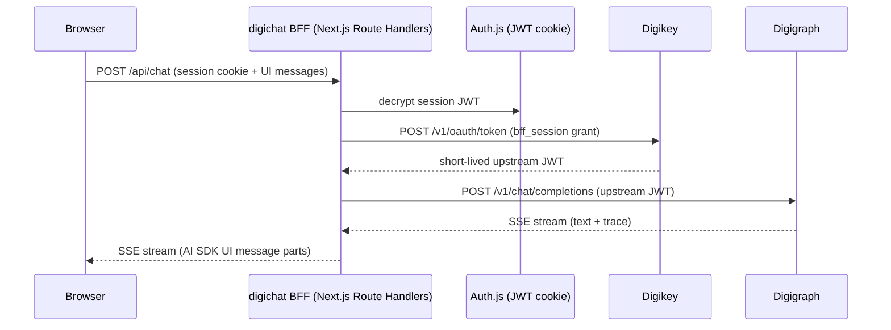

# digichat Architecture

digichat (`cloudflare/digichat`, package `digichat` v2.2.0) is the
containerized chat product for the digithings ecosystem: a Next.js 16 App
Router application acting strictly as a **Backend-for-Frontend (BFF)**. The
browser never speaks to digigraph, Foundry, or any Python service. All LLM
calls, auth token exchanges, upstream probes, and deployment-config resolution
run in server-side Route Handlers. The frontend uses **stock** assistant-ui
`Thread` (digichat 2.0 shift), one shared UI workspace (`@digithings/digichat-ui`),
and deployment-config-driven skin selection (11 catalog templates + first-party
`digichat`).

*Figure: Browser-to-BFF-to-upstream request flow. No upstream credential ever reaches the browser.*

## BFF invariant

No digigraph URL, digikey token, or upstream credential may ever reach the
browser. Route handlers under `src/app/api/` do the upstream work; the
`X-Digichat-Session` header carries only an opaque UUID, never the session
token. The browser holds only an Auth.js httpOnly session cookie; the BFF
exchanges it for a short-lived digikey JWT on every `/api/chat` request (see
[auth-and-chat](/openwiki/digichat/auth-and-chat.md)).

Session-authenticated endpoints (`/api/chat`, `/api/conversations`,
`/api/ecosystem/config`, `/api/byok/test`) require `requireDigiChatAuth()`
(Auth.js session cookie or `Authorization: Bearer digi_live_…` machine key).
Embed-facing endpoints (`/api/embed/tenant-config`, `/api/plan-proof`) use
`resolveVerifiedEmbedTenant()` which verifies the embed token + host
combination. `GET /api/health` is unauthenticated (liveness probe).
User-supplied service URLs pass `isAllowedServiceUrl()` (SSRF guard) before any
fetch; MCP server URLs use the inverse check `isAllowedMcpServerUrl()`.

## digichat 2.0 architecture shifts

The 2.0 branch (package version 2.2.0) makes several architectural changes from
the 1.x line:

| Area | 1.x | 2.0 |
|------|-----|-----|
| UI thread | Custom `CliThread` / branded parts | **Stock** assistant-ui `Thread` (11 catalog skins + first-party `digichat`) |
| AI SDK | AI SDK v? + custom stream parts | AI SDK v7 (`ai@^7.0.93`, `@ai-sdk/react@^4.0.96`, `@assistant-ui/ai-sdk`) |
| Stream format | `data-digichatActivity` branded parts | Standard tool / `source-*` / reasoning / `data-status` parts |
| Deploy config | `DIGICHAT_EMBED_TENANTS` JSON only | **Zod YAML** file (`digichat.yaml`) + env overlay + tenants compat hydrate |
| CLI | Not present | `cloudflare/digichat/cli/` — separate Node package (`@digithings/digichat-cli`) |
| Backend types | `digithings` / `foundry` / `external-relay` | `digigraph` / `foundry` (adapter dir `digithings/` speaks to digigraph) |
| Route handlers | 7 routes | 12+ routes (added `/byok`, `/deploy`, `/embed`, `/mcp`, `/plan-proof`, `/v1`) |

### Deployment config

Canonical operator config is a Zod-validated YAML file at
`DIGICHAT_CONFIG_PATH` (default `/app/config/digichat.yaml`), loaded by
`src/lib/deploy-config/loader.ts` (server-only — imports `node:fs`; never
re-exported from `index.ts` to prevent client-bundle pulls). The config
declares either a single `deployment` (client container) or `hosts`
(multi-tenant container). Backend selection is `backend.type: digigraph | foundry`.

The same schema is hydrated from legacy `DIGICHAT_EMBED_TENANTS` JSON via
`embedTenantToDeployment()` for compat until dogfood cutover. Env overlays
allow secrets (`DIGICHAT_EMBED_TOKEN`, `DIGICHAT_HOST_<SLUG>_TOKEN`) and
`DIGICHAT_CHROME_SKIN` to overlay `chrome.skin` without editing YAML.

Client-safe projections (`toDigichatClientConfig`, `toEmbedClientConfig`) strip
tokens, Foundry endpoints, MCP URLs, and consume URLs before reaching the
browser. Granular deploy knobs include: disclosure modes
(`features.reasoning`/`features.toolCalls`: `off | collapsed | expanded |
locked_open`), `chrome.defaultLanguage`, `models.default`/`models.available`,
`features.attachments`, `cli.enabled`, `mcp.servers` (operator MCP URLs only —
never reach the browser), and `gate` settings.

## Modular frontend and backend adapters

One shared UI (`@digithings/digichat-ui` workspace dependency) serves multiple
backends selected per tenant via deployment config:

- **`digigraph`** (`src/lib/adapters/digithings/stream.ts`): Communicates with
  digigraph via `POST /v1/chat/completions` (OpenAI-compatible SSE). The **trace
  path** (default) iterates raw SSE frames, maps `digigraph_trace` payloads to
  standard UI parts (`tool-*`, `source-*`, reasoning, `data-status`) via
  `mapDigigraphTraceToSpans`. The **legacy path** (`DIGICHAT_TRACE_UI=0`) uses AI
  SDK `streamText` + `smoothStream`. Both paths forward correlation headers:
  `X-Session-Id`, `X-Request-ID`, `X-Digichat-Tenant`, `X-Digi-Caller: digichat`.

- **`foundry`** (`src/lib/adapters/foundry/stream.ts`): Communicates with Azure
  AI Foundry via `@azure/ai-projects` + `DefaultAzureCredential` (container
  managed identity, no stored key). Maps `azure_ai_search` calls and MCP chunks
  into standard UI parts. Server-side conversation state; `send` appends last-user
  text, `regenerate`/`edit_last_user` mutate items then create a response.

- **`shared`** (`src/lib/adapters/shared/messages.ts`): Shared helpers (e.g.,
  `lastUserMessageText`).

Turn/thread semantics are per-adapter:
- **Regen** (`X-Digi-Turn-Mode: regenerate`): Digigraph replays the full
  workflow from the truncated transcript (tools re-run; digistore may
  accumulate). Foundry deletes trailing assistant items and re-creates.
- **Edit** (`X-Digi-Turn-Mode: edit_last_user`): Digigraph replays with edited
  user turn. Foundry deletes trailing user+assistant, then `responses.create`
  with no new input.
- **Concurrent runs** on the same session → `409 run_in_progress`; duplicate run
  IDs → `409 run_id_replay`.
- **Foundry without item API** returns `501 not_supported`.

## Module map

| Area | Role |
|------|------|
| `src/app/api/chat/` | Primary BFF chat endpoint; `v1/chat/` alias for machine clients |
| `src/app/api/conversations/` | CRUD for conversations, quant runs |
| `src/app/api/ecosystem/config/` | Endpoint cookie management |
| `src/app/api/health/` | Readiness probe (unauthenticated; probes all enabled verticals + Postgres) |
| `src/app/api/byok/` | BYOK test ping + model catalog |
| `src/app/api/embed/tenant-config/` | Client-safe tenant config (embed-token verified, not Auth.js) |
| `src/app/api/plan-proof/` | HMAC plan tier proof minting (Supabase access token verification) |
| `src/app/api/mcp/` | MCP OAuth flow (PKCE start + callback) |
| `src/app/api/deploy/` | Chrome config projection |
| `src/app/api/auth/[...nextauth]/` | Auth.js v5 handlers |
| `src/lib/adapters/` | Backend adapters: `digithings/` (digigraph), `foundry/`, `shared/` |
| `src/lib/deploy-config/` | Zod schema, YAML loader, client projection, force-tool, MCP servers |
| `src/components/` | Chat shell, thread state, composer, assistant-ui skins, BYOK flow, tool catalog |
| `src/db/` | Drizzle schema + Postgres client (`max: 10` pool) |
| `src/auth.ts` | Auth.js config (OIDC, dev password, local bootstrap providers) |
| `src/instrumentation.ts` | Boot-time auto-migration (`DIGICHAT_AUTO_MIGRATE=1`) |
| `src/lib/ecosystem.ts` | Endpoint resolution + `isAllowedServiceUrl` SSRF guard |
| `src/lib/request-auth.ts` | `requireDigiChatAuth` shared auth helper |
| `src/lib/digikey-exchange.ts` | digikey JWT exchange (`bff_session` + `api_key` grants) |
| `src/lib/ui-stream-parts.ts` | ActivitySpan → standard UI parts (tool/source/reasoning/`data-status`) |
| `src/lib/capabilities.ts` | `DIGICHAT_ENABLED_SERVICES` parsing |

## digichat CLI (Ink)

The CLI lives in `cloudflare/digichat/cli/` as a **separate Node package**
(`@digithings/digichat-cli`, package `@digithings/digichat-cli@1.4.0`). It uses
the official assistant-ui React Ink starter (`@assistant-ui/react-ink`) and
talks to the **same** `POST /api/chat` BFF via `useChatRuntime` +
`AssistantChatTransport` with an absolute URL. The `--demo` flag uses a scripted
adapter with no backend. `ink` / `react-ink` are never imported from Next.js
client modules.

When `--config` / `DIGICHAT_CONFIG` is set, startup fails closed unless
`cli.enabled: true` in the YAML. Without a config path the binary still runs
(YAML is advisory for operators who skip `--config`).

## Ecosystem health

`GET /api/health` (unauthenticated) probes `{base}/health` for each enabled
service (4 s AbortController timeout per service) and `SELECT 1` against
Postgres. Enabled services are controlled by `DIGICHAT_ENABLED_SERVICES`
(default: `digigraph,digisearch,digiquant,digismith`). Returns HTTP 200 when
healthy, 503 when any required service is unreachable.

`GET /api/ecosystem/config` (Auth.js session required) returns endpoint URLs
and persistence status. `POST /api/ecosystem/config` validates override URLs
through `isAllowedServiceUrl()` and stores them in an httpOnly cookie
(`digichat-endpoints`, 180-day `maxAge`).

The ecosystem side panel (health badge display) is provided by the deploy
config's chrome projection; the legacy `connections-sheet.tsx` component has
been replaced by stock deploy-UI context (`src/components/stock/deploy-ui-context.tsx`)
in the 2.0 architecture.

## Data model (summary)

Drizzle ORM with Postgres-js driver. Six tables: `tenants`, `user_tenants`,
`api_keys` (bcrypt-hashed `digi_live_…` prefixes), `conversations`,
`conversation_messages` (JSONB `UIMessage` payloads), `quant_runs`. Three
migration files in `drizzle/`. Messages conform to AI SDK v7 `UIMessage`
format: `{ id, role, parts: UIPart[] }`. Conversation persistence is
localStorage always-on with optional Postgres; the anonymous `/embed` surface
never calls conversation-persistence endpoints (they require
`requireDigiChatAuth()`).

For the full data model and operational details, see
[operations](/openwiki/digichat/operations.md).

## Representative tests

Vitest from `cloudflare/digichat/`: `route.test.ts` for the chat handler,
`ecosystem.test.ts` for the SSRF allowlist, plus adapter, persistence, deploy-config,
and markdown-export suites. Deploy config has dedicated test files:
`loader.test.ts`, `schema.test.ts`, `client-projection.test.ts`,
`force-tool.test.ts`, `mcp-servers.test.ts`, `cli-isolation.test.ts`.
`npm run lint` (ESLint) and `npm run build` (type-check + production build) gate
changes.

## Claims-backed Desk+ plan proof (#3664)

digichat never trusts client-asserted plan: raw `X-Embed-Plan-Tier` /
`?plan_tier=` are ignored. Entitled Desk+ chat requires either:

- HMAC `X-Embed-Plan-Proof` from dashboard `POST /api/plan-proof` (verifies the
  Supabase access token and reads JWT `app_metadata.plan_tier`), or
- an authenticated digichat session whose claims `plan_tier` is Desk+.

Ops env names only: `DIGICHAT_PLAN_PROOF_SECRET`,
`DIGICHAT_DASHBOARD_SUPABASE_URL`, `DIGICHAT_DASHBOARD_SUPABASE_ANON_KEY`.
Missing secrets → plan-proof **503**. See `cloudflare/digichat/README.md`.
