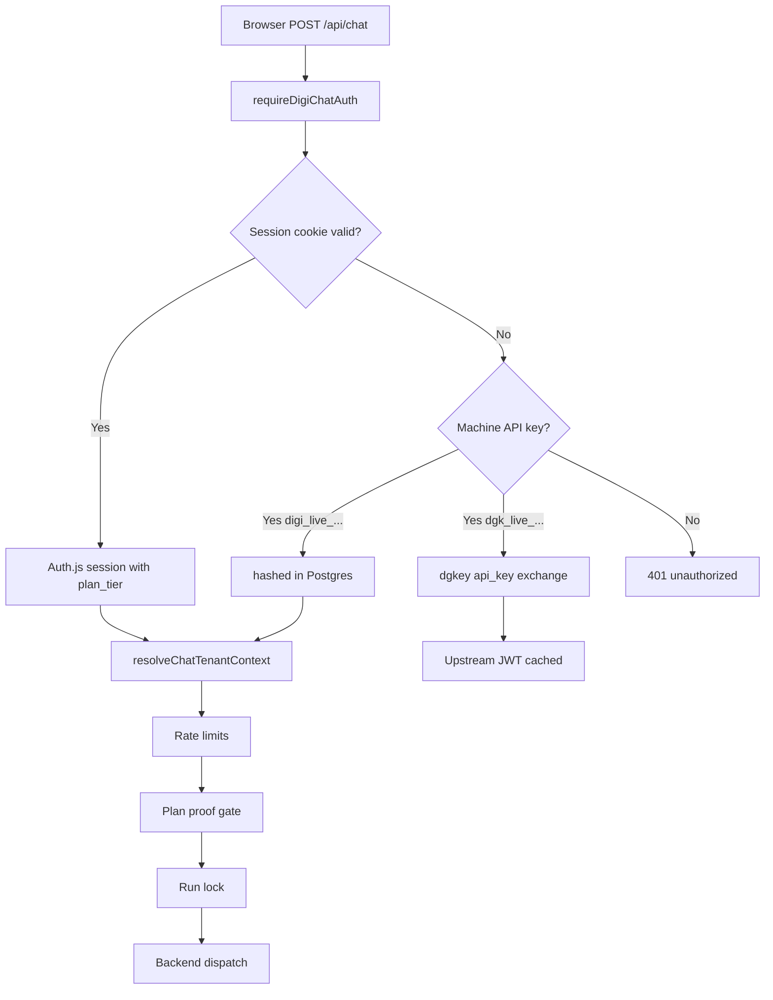
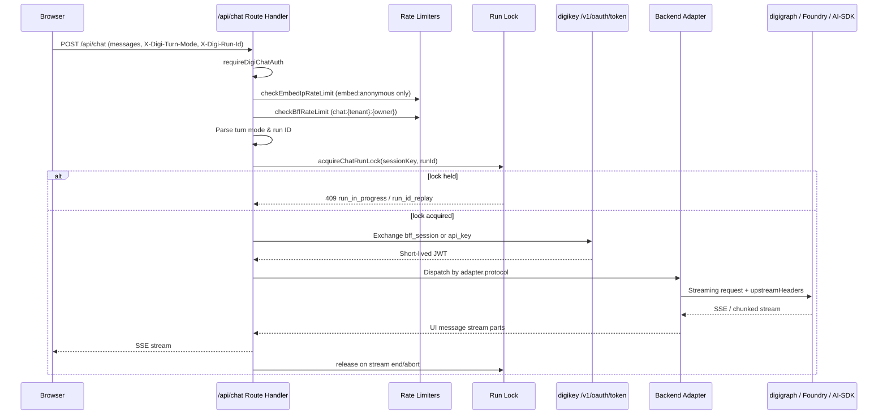

# digichat Auth and Chat

Every digichat interaction is a server-side flow: the browser holds an
Auth.js session cookie, the BFF exchanges it for short-lived upstream
credentials, and the chat route streams model output back. Upstream JWTs
and BYOK keys never cross into the browser.

## Login (Auth.js v5)

`src/auth.ts` configures Auth.js v5 (`NextAuth`) with three providers,
each conditionally enabled by environment:

- **OIDC** — enterprise SSO when `AUTH_OIDC_ISSUER`, `AUTH_OIDC_CLIENT_ID`,
  and `AUTH_OIDC_CLIENT_SECRET` are all set. Requests `openid email profile`
  scope and uses `client_secret_post` token authentication.
- **Dev password** — enabled by `DIGICHAT_DEV_AUTH=1`, checks
  `DIGICHAT_DEV_PASSWORD` (defaults to `"dev"` when empty). Returns a
  static `dev-local` user with `dev@digichat.local`.
- **Local bootstrap** — dev-only (`NODE_ENV !== "production"`), checks
  `DIGICHAT_LOCAL_AUTH_KEY` against a password field. Also returns the
  shared `dev-local` identity.

The session secret comes from `AUTH_SECRET` or `NEXTAUTH_SECRET` and must stay
stable or users must clear cookies. When no providers are configured, a
disabled `Credentials` provider rejects all logins.

### JWT callbacks and plan tier propagation

The `jwt` callback copies `user.id`, `email`, `name`, and `plan_tier`
(extracted from the upstream `User|AdapterUser`'s `app_metadata`) into the
Auth.js JWT. The `session` callback surfaces `plan_tier` back onto
`session.user.app_metadata` — this lets the chat route read the user's plan
tier without re-resolving it from upstream.

*Figure: Request authentication and early gating steps before backend dispatch.*

## Request authentication (`requireDigiChatAuth`)

`src/lib/request-auth.ts` resolves a `DigiChatAuthContext` for every API
handler. It tries two paths in order:

1. **Machine API key** — `Authorization: Bearer digi_live_…` or `dgk_live_…`.
   `digi_live_` keys are hashed in Postgres; `dgk_live_` are digikey-issued
   and exchanged via the `/v1/oauth/token` `api_key` grant.
2. **Auth.js session** — `auth()` from the configured `authConfig`.

On success, the context includes `tenantSlug` (from the machine key's
tenant, or resolved from the OIDC subject via Postgres), `ownerUserSub`,
and optionally `plan_tier` from session `app_metadata`.

## Upstream token exchange

### digikey exchange module

`src/lib/digikey-exchange.ts` provides two grant-type exchanges against
`POST {DIGIKEY_URL}/v1/oauth/token`:

| Grant | Auth header | Body fields | Purpose |
|-------|-------------|-------------|---------|
| `api_key` | none | `grant_type=api_key`, `api_key` | Machine API keys (`dgk_live_…`) |
| `bff_session` | `Bearer {DIGIKEY_BFF_TOKEN}` | `grant_type=bff_session`, `tenant_slug`, `subject` | OIDC-authenticated digichat sessions |

Both return a `DigikeyTokenExchange` with `accessToken` (short-lived JWT)
and optional `litellmProxyApiKey` (forwarded as `X-LiteLLM-Proxy-Key` to
digigraph when a LiteLLM proxy is configured on digikey).

### digigraph upstream auth resolver

`src/lib/digigraph-upstream.ts` (`resolveDigigraphUpstreamAuth`) resolves
the upstream bearer token for the chat route with this priority:

1. **`Authorization: Bearer dgk_live_…`** — exchange via `api_key` grant,
   cached by key prefix.
2. **BFF session exchange** — when `DIGIKEY_URL`, `DIGIKEY_BFF_TOKEN`,
   `tenantSlug`, and `ownerUserSub` are all present. Cached by
   `bff:{tenantSlug}:{ownerUserSub}`.
3. **Static key** — `DIGIGRAPH_UPSTREAM_API_KEY` as a direct bearer (no
   exchange).
4. **Error** — throws `DigigraphUpstreamAuthError` when digikey is
   configured but incomplete.

JWT cache entries expire at `token.exp - 60_000ms` (1-minute skew) with a
5-minute floor. The in-memory cache (`BoundedTTLMap`, max 2,000 entries)
survives per-request reuse within the TTL window. The `litellmProxyApiKey`
from the exchange payload is cached and forwarded alongside every request.

## BFF rate limiting

### Shared per-tenant+user limiter

`src/lib/bff-rate-limit.ts` implements a sliding-window rate limiter using
`BoundedTTLMap` (max 10,000 keys, 1-hour TTL). Each `POST /api/chat` call
is keyed as `chat:{tenantSlug}:{ownerUserSub}` and checked against
configurable defaults:

| Env var | Default | Purpose |
|---------|---------|---------|
| `DIGICHAT_CHAT_RATE_LIMIT_MAX` | 30 | Max requests per window |
| `DIGICHAT_CHAT_RATE_LIMIT_WINDOW_MS` | 60,000 | Window duration in ms |

On violation, the route returns `429 rate_limit_exceeded` with a
`retry-after` header computed from the oldest timestamp in the window.

### Embed IP rate limiting

`src/lib/embed-ip-rate-limit.ts` adds a per-IP sliding window in front of
the shared bucket for anonymous embed visitors. When `ownerUserSub ===
"embed:anonymous"`, the route checks `checkEmbedIpRateLimit` first:

| Env var | Default | Purpose |
|---------|---------|---------|
| `DIGICHAT_EMBED_IP_RATE_LIMIT_MAX` | 10 | Max requests per IP per window |
| `DIGICHAT_EMBED_IP_RATE_LIMIT_WINDOW_MS` | 60,000 | Window duration in ms |

The per-IP max must stay below the shared `DIGICHAT_CHAT_RATE_LIMIT_MAX` —
otherwise one visitor exhausts the shared bucket before hitting the per-IP
cap. IP resolution prefers `cf-connecting-ip` (Cloudflare), then
`x-forwarded-for`, and supports `DIGICHAT_TRUSTED_PROXIES` for
non-Cloudflare deployments. When the IP cannot be determined ("unknown"),
the quota is skipped entirely (fail-open) to avoid collapsing all visitors
into one shared bucket.

### Embed trial turn quotas

The `trial_form` gate mode enforces free-turn quotas per client IP. Server-side,
`src/lib/embed-turn-quota.ts` tracks turn counts in a `BoundedTTLMap` (max
10,000 keys, 24h TTL). Limits are defined in the shared constant module
`src/lib/embed-turn-limits.ts`:

| Constant | Value | Meaning |
|----------|-------|---------|
| `EMBED_FREE_TURN_LIMIT` | 3 | Free turns before gating |
| `EMBED_TRIAL_TURN_LIMIT` | 100 | Turns after trial unlock |

The chat route supports a `chatToken` path where `gate.consumeUrl` provides
server-side quota checking, superseding both the IP quota and any
client-asserted unlock header.

## POST /api/chat

`src/app/api/chat/route.ts` is the main chat endpoint. It exports
`maxDuration = 120` (seconds) and is re-exported by
`src/app/api/v1/chat/route.ts`. Alternative backends (Foundry, AI SDK,
non-AI SDK) each have their own adapter; this section focuses on the
digigraph path, which is the primary production backend.

### Request flow

*Figure: Full request lifecycle for POST /api/chat on the digigraph path.*

### Turn mode headers (2.0)

Three custom headers control turn mutation behavior:

| Header | Values | Default | Notes |
|--------|--------|---------|-------|
| `X-Digi-Turn-Mode` | `send`, `regenerate`, `edit_last_user` | `send` | `regenerate` and `edit_last_user` are mutating |
| `X-Digi-Run-Id` | optional opaque string | none | Dedup: same id on same session → 409 |
| `X-Digi-Force-Tool` | tool catalog id | none | **Send-only** — ignored on regen/edit |

`src/lib/turn-mode.ts` parses the mode header (`parseDigiTurnMode`) and
exposes `isMutatingTurnMode` which returns `true` for `regenerate` and
`edit_last_user`. On regen, digigraph replays the full workflow from the
truncated transcript (tools re-run). On edit, the last user turn is
replaced.

`X-Digi-Force-Tool` values are validated against the deployment config's
`tools.catalog` allowlist via `filterForceToolHeader`. The header is only
forwarded upstream on `send` mode — leftover values from a slash-command
are silently dropped on regen/edit.

### Run lock

`src/lib/chat-run-lock.ts` provides an in-memory per-session mutex with two
`BoundedTTLMap` stores:

| Map | TTL | Max keys | Purpose |
|-----|-----|----------|---------|
| `activeBySession` | 3 min | 4,096 | Tracks active runs per session key |
| `runIdsBySession` | 10 min | 4,096 | Tracks completed run IDs per session key |

The lock key includes the `externalConversation` when present (Foundry):
`chat-run:{tenantSlug}:{sessionId}:{externalConversation}` or
`chat-run:{tenantSlug}:{sessionId}`.

When the lock is released, the run ID entry transitions to `done` status
for the remaining TTL, preventing replays. The lock release is wired into
the streaming response lifecycle via `releaseChatRunLockOnResponseEnd`,
which wraps the response body in a `ReadableStream` that calls `release()`
on stream end, error, or cancel.

The `acquireChatRunLock` function returns `{ ok: false, error:
"run_id_replay" }` for duplicate run IDs and `{ ok: false, error:
"run_in_progress" }` for concurrent runs. Both produce `409` responses.

### Plan proof gate (Desk+ entitlements)

When the embed deployment config declares `gate.requiredPlanTier` (e.g.
`"desk"`), the chat route enforces a tier gate. The caller must present
either:

1. **HMAC-signed plan proof token** in the `X-Embed-Plan-Proof` header.
   Verified server-side with `verifyPlanProof` using
   `DIGICHAT_PLAN_PROOF_SECRET`. Token format: `base64url(tier|exp|sig)`
   with 5-minute TTL, HMAC-SHA256 signature, constant-time comparison.

2. **Authenticated digichat session** with `plan_tier` in the Auth.js JWT
   `app_metadata` claims.

Raw `X-Embed-Plan-Tier` headers and `?plan_tier=` query params are **never
trusted** — they are client-asserted and spoofable. If neither proof method
passes, the route returns `403 plan_tier_required`.

### Model allowlisting

When the deployment config declares `models.available`, the route enforces
a **fail-closed** model allowlist. The requested model (`X-Digi-Model`
header or deployment default) is checked against the allowlist. BYOK
requests bypass the allowlist (`X-BYOK-Model` is forwarded directly).
When the deployment config cannot be loaded and an explicit model is
requested, the route returns `400 model_not_allowed`.

### Backend adapter dispatch

The route resolves the backend via `backendAdapterFor(backend.type)` and
dispatches by `adapter.protocol`:

| Protocol set | Adapter | Characteristics |
|---|---|---|
| `NON_AI_SDK_PROTOCOLS` | `createNonAiSdkStreamResponse` | LangGraph, AG-UI, A2A |
| `foundry-responses` | `createFoundryStreamResponse` | Azure AI Projects |
| `AI_SDK_PROTOCOLS` | `createAiSdkStreamResponse` | OpenAI Completions/Responses, Anthropic, Vertex |
| `digigraph-trace` | `createDigigraphTraceStreamResponse` | Primary digigraph path |

The digigraph path is the fallback. It uses the AI SDK's `streamText` +
`smoothStream({ chunking: "word" })` to produce a UI message stream. If
`DIGICHAT_TRACE_UI` is `"1"` (default) and the client does not send
`X-Digichat-Trace: 0`, the digigraph trace stream adapter is used instead
for richer activity rendering.

### Upstream headers

The route assembles upstream headers for digigraph including:

- `X-Session-Id`, `X-Request-ID`, `X-Digichat-Tenant`, `X-Digi-Tenant`,
  `X-Digi-Caller: digichat`, `Authorization: Bearer {upstreamBearer}`
- `X-Digi-Corpus-Index`, `X-Digi-Vault-Prefix` (when corpus is configured)
- `X-LiteLLM-Proxy-Key` (when digikey returned one)
- `X-Digi-Language` (when non-English)
- `X-Digi-Effort` (`low`, `medium`, or `high`)
- `X-Digi-Force-Tool` (send-only, allowlisted)
- `X-Digi-Disabled-Tools` (allowlisted catalog ids)
- `X-Digi-Mcp-Servers` (operator-sourced, never client-supplied URLs)
- `X-Digi-Enable-Web-Search` (requires client opt-in AND tenant allow)
- `X-BYOK-Key`, `X-BYOK-Provider`, `X-BYOK-Model` (never logged or persisted)

## POST /api/plan-proof

`src/app/api/plan-proof/route.ts` mints HMAC-signed plan proof tokens for
the digiquant dashboard embed flow. The dashboard (a Cloudflare Pages static
export) cannot host API routes, so the embed iframe calls this digichat
endpoint with:

- `Authorization: Bearer {supabase_access_token}` — verified against the
  dashboard's Supabase project
- `X-Embed-Token` — embed tenant verification
- `X-Embed-Host: digiquant.io`

The route restricts proof signing to the `digiquant-dashboard` tenant
slug only. It validates the Supabase access token by calling
`GET /auth/v1/user`, reads `app_metadata.plan_tier` from the response, and
falls back to the effective tier via the `my_access` RPC
(`max(plan_tier, plan_floor)`) for tiered invite codes. Only Desk+ tiers
(`desk`, `studio`, `enterprise`) receive a signed proof. Free/brief users
and FX Hub-only invitees without a desk floor get `403 plan_tier_required`.

The proof token is signed with `signPlanProof(proofTier, secret)` using
HMAC-SHA256 over `{tier}|{exp}` with a 5-minute TTL. The response includes
`{ proof, exp, tier }`. The secret (`DIGICHAT_PLAN_PROOF_SECRET`) never
reaches the client.

## Conversation persistence

### localStorage (always-on)

Threads always persist to localStorage under the key
`digichat-threads:{ownerKey}` via `src/lib/thread-local.ts`. The on-disk
format is `{ v: 1, threads: LocalPersistedThread[] }`. On mount, the chat
shell merges localStorage threads with server `GET /api/conversations`
summaries. A local cache is considered authoritative when its `updatedAt`
is at least as fresh as the server summary — it then skips a server GET.
Remote threads start with `hydrated: false` until the body has been loaded.
`canFlushServerMessages` prevents flushing (`PUT`) a remote thread that has
never been hydrated, and the API returns `409 would_truncate` if a PUT
would drop existing rows without `allowTruncate: true`.

### Postgres (optional)

When `DIGICHAT_DATABASE_URL` is configured (Drizzle + Postgres.js,
max 10 connections), the Drizzle schema (`src/db/schema.ts`) provides:

- `conversations` — id, tenantId, ownerUserSub, title, timestamps
- `conversationMessages` — conversationId, sequence, payload (JSONB)
- `quantRuns` — conversationId, label, strategyName, symbols,
  strategyParams, backtestResult

`src/lib/conversations-repo.ts` provides the full CRUD surface:
`createConversation`, `listConversationSummaries`, `getConversationMessages`,
`replaceConversationMessages` (transactional delete+insert with
`would_truncate` guard), `updateConversationTitle`, `deleteConversation`,
and `listQuantRuns`/`insertQuantRun`.

The REST surface:

| Method | Path | Purpose |
|--------|------|---------|
| `GET` | `/api/conversations` | List summaries (returns `{ serverPersistence, conversations }`) |
| `POST` | `/api/conversations` | Create new conversation |
| `GET` | `/api/conversations/[id]` | Get messages |
| `PUT` | `/api/conversations/[id]` | Full replace messages (with `allowTruncate` guard) |
| `DELETE` | `/api/conversations/[id]` | Delete conversation |

When Postgres is unavailable, `GET /api/conversations` returns
`{ serverPersistence: false, conversations: [] }` and write endpoints
return `503 database_unavailable`. The system degrades gracefully to
localStorage-only mode.

## Markdown export

Turn and thread markdown export lives in the shared `@digithings/digichat-ui`
package (`serializeAssistantMarkdown`, `serializeThreadMarkdown`,
`copyMarkdownWithFallback`). Both `ChatPanel` and embed sessions use it
with the fallback chain:

1. **Clipboard** — `navigator.clipboard.writeText()`. Works in standard
   browsing contexts; fails silently in cross-origin iframes.
2. **Download** — `.md` file download via a generated blob URL. Used in
   embed contexts where clipboard is blocked.
3. **postMessage** — `digichat:copy` message to the parent frame.
4. **Textarea fallback** — selectable `<textarea>` appended to the DOM as a
   last resort.

The serializer filters vault bodies, tool JSON, and BYOK payloads from the
exported markdown. Citations come from `source-*` UI stream parts.
