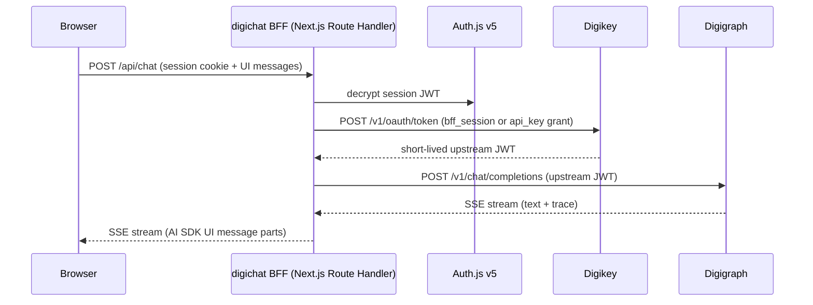

# digichat Auth and Chat

Every digichat interaction is a server-side flow: the browser holds an
Auth.js session cookie, the BFF exchanges it for short-lived upstream
credentials, and the chat route streams model output back. Upstream JWTs
never cross into the browser.

*Figure: Browser-to-BFF-to-upstream request flow. No upstream credential ever reaches the browser.*

## Login

`src/auth.ts` configures Auth.js v5 with three providers, each gated by
environment:

- **OIDC** (`AUTH_OIDC_ISSUER` / `AUTH_OIDC_CLIENT_ID` /
  `AUTH_OIDC_CLIENT_SECRET`) — enterprise SSO with `openid email profile`
  scope and `client_secret_post` token endpoint auth method.
  (`repo://cloudflare/digichat/src/auth.ts#L12-L27`)
- **Dev password** (`DIGICHAT_DEV_AUTH=1`, password in
  `DIGICHAT_DEV_PASSWORD` defaulting to `dev`) — local development only,
  trims values to tolerate CRLF `.env` files.
  (`repo://cloudflare/digichat/src/auth.ts#L29-L54`)
- **Local bootstrap** (`DIGICHAT_LOCAL_AUTH_KEY`) — dev-only Credentials
  provider that validates a shared secret against the env var. Disabled
  when `NODE_ENV=production`.
  (`repo://cloudflare/digichat/src/auth.ts#L57-L83`)

The session cookie secret comes from `AUTH_SECRET` / `NEXTAUTH_SECRET` and
must stay stable or users must clear cookies.
(`repo://cloudflare/digichat/src/auth.ts#L6-L10`)

The JWT callback copies `user.app_metadata.plan_tier` into the session
token so that tier-gated embed tenants can check the authenticated
session's tier without a separate lookup.
(`repo://cloudflare/digichat/src/auth.ts#L104-L131`)

When no providers are configured, a `disabled` Credentials provider is
inserted so Auth.js can still boot without crashing.
(`repo://cloudflare/digichat/src/auth.ts#L95-L102`)

Auth.js route handlers are exported via the standard NextAuth catch-all
at `src/app/api/auth/[...nextauth]/route.ts`:
(`repo://cloudflare/digichat/src/app/api/auth/[...nextauth]/route.ts`)

A **machine API key** path exists alongside session auth. `requireDigiChatAuth()`
in `src/lib/request-auth.ts` accepts either an Auth.js session cookie or an
`Authorization: Bearer digi_live_…` header. Machine keys are validated
via bcrypt against hashes in the `api_keys` Postgres table (Drizzle schema),
keyed by a 20-character prefix. A bootstrap key
(`DIGICHAT_BOOTSTRAP_API_KEY` + `DIGICHAT_BOOTSTRAP_TENANT_SLUG`) bypasses
the database for initial provisioning.
(`repo://cloudflare/digichat/src/lib/request-auth.ts#L12-L47`)
(`repo://cloudflare/digichat/src/lib/api-key.ts#L8-L52`)

## Upstream exchange

The BFF exchanges credentials for a short-lived digikey JWT on every
`POST /api/chat` request. Three exchange paths exist, tried in priority
order by `resolveDigigraphUpstreamAuth()`:

1. **`api_key` grant**: If the incoming request already carries an
   `Authorization: Bearer dgk_live_…` header, the BFF forwards it to
   digikey's `POST /v1/oauth/token` with `grant_type: api_key`.
   (`repo://cloudflare/digichat/src/lib/digikey-exchange.ts#L26-L39`)
2. **`bff_session` grant**: When `DIGIKEY_URL` and `DIGIKEY_BFF_TOKEN`
   are set, the BFF presents the BFF token to digikey with `grant_type:
   bff_session`, `tenant_slug`, and the OIDC `subject`.
   (`repo://cloudflare/digichat/src/lib/digikey-exchange.ts#L44-L66`)
3. **Static key fallback**: `DIGIGRAPH_UPSTREAM_API_KEY` is used directly
   as the bearer token when no digikey URL is configured.

The resulting short-lived JWT carries `principal_kind=bff_session` (or
`api_key`), `sub=<identity>`, and optional `profile_id`/`profile_version`.
The exchange may also return a `litellm_proxy_api_key` forwarded as
`X-LiteLLM-Proxy-Key` to digigraph.
(`repo://cloudflare/digichat/src/lib/digigraph-upstream.ts#L87-L139`)

Exchanged JWTs are cached in-memory (max 2,000 entries) until `exp` minus
a 60-second skew. A `BoundedTTLMap` evicts stale entries.
(`repo://cloudflare/digichat/src/lib/digigraph-upstream.ts#L29-L76`)

## Chat route

`POST /api/chat` (`maxDuration = 120`) is the sole chat endpoint. Request
processing follows this order:

1. **Auth**: `requireDigiChatAuth()` resolves session or machine key;
   embed requests resolve tenant context.
   (`repo://cloudflare/digichat/src/app/api/chat/route.ts#L78-L88`)
2. **Embed IP rate limit**: Anonymous embed users are gated per client IP
   before the BFF-wide rate limit, so one visitor cannot exhaust the
   shared bucket.
   (`repo://cloudflare/digichat/src/app/api/chat/route.ts#L93-L101`)
3. **BFF rate limit**: Sliding-window per-tenant-per-user-sub. Default
   30 requests per 60-second window, configurable via
   `DIGICHAT_CHAT_RATE_LIMIT_MAX` and `DIGICHAT_CHAT_RATE_LIMIT_WINDOW_MS`.
   Exceeded → `429 rate_limit_exceeded` with `retry-after`.
   (`repo://cloudflare/digichat/src/app/api/chat/route.ts#L103-L107`)
   (`repo://cloudflare/digichat/src/lib/bff-rate-limit.ts#L1-L49`)
4. **Plan tier gate**: When the embed config declares `requiredPlanTier`,
   the caller must present a valid HMAC-signed `X-Embed-Plan-Proof` token
   or an authenticated digichat session with `plan_tier` in JWT claims.
   Raw `X-Embed-Plan-Tier` headers are never trusted.
   (`repo://cloudflare/digichat/src/app/api/chat/route.ts#L168-L194`)
5. **Turn mode parsing**: `X-Digi-Turn-Mode` header parsed by
   `parseDigiTurnMode()` → `send` (default), `regenerate`, or
   `edit_last_user`. Invalid values → `400 invalid_turn_mode`.
   (`repo://cloudflare/digichat/src/app/api/chat/route.ts#L142-L151`)
   (`repo://cloudflare/digichat/src/lib/turn-mode.ts#L1-L18`)
6. **Trial form gate** (`gateMode: trial_form`): Per-IP free turn quota
   with `X-Embed-Chat-Token` server-side consumption path. Exhausted →
   `402 trial_gate`. Fails open on any internal error.
   (`repo://cloudflare/digichat/src/app/api/chat/route.ts#L203-L252`)
7. **Run lock**: Acquired via `acquireChatRunLock(runLockKey, runId)`.
   Concurrent open run → `409 run_in_progress`. Duplicate
   `X-Digi-Run-Id` for the same session → `409 run_id_replay`. Lock
   releases when the stream body ends or is cancelled.
   (`repo://cloudflare/digichat/src/app/api/chat/route.ts#L254-L268`)
   (`repo://cloudflare/digichat/src/lib/chat-run-lock.ts#L1-L101`)
8. **Backend dispatch**: Foundry backend → `createFoundryStreamResponse()`.
   Digigraph backend → trace stream (when
   `DIGICHAT_TRACE_UI !== "0"` and `X-Digichat-Trace !== "0"`) via
   `createDigigraphTraceStreamResponse()`, otherwise `streamText` +
   `smoothStream` + `createUIMessageStreamResponse`.
   (`repo://cloudflare/digichat/src/app/api/chat/route.ts#L272-L541`)
9. **BYOK forwarding**: `X-BYOK-Key`, `X-BYOK-Provider`, `X-BYOK-Model`
   headers forwarded to digigraph as upstream headers. Never logged or
   persisted.
   (`repo://cloudflare/digichat/src/app/api/chat/route.ts#L127-L131`)
   (`repo://cloudflare/digichat/src/app/api/chat/route.ts#L492-L504`)

### Turn mode semantics

| Mode | Behavior |
|------|----------|
| `send` (default) | Normal append. `X-Digi-Force-Tool` and `X-Digi-Disabled-Tools` forwarded. |
| `regenerate` | Truncate after the last user message, replay the workflow from the truncated client transcript. `X-Digi-Force-Tool` is **not** forwarded (send-only). |
| `edit_last_user` | Truncate **through** the last user message, insert the new user text from the last message in the request body, then replay. `X-Digi-Force-Tool` is **not** forwarded. |

`isMutatingTurnMode()` returns `true` for both `regenerate` and
`edit_last_user`. Digigraph replays the full workflow on the same session;
tools re-run and digistore may accumulate. Foundry mutates conversation
items (delete trailing assistant / user+assistant, then
`responses.create` with no new input) via `@azure/ai-projects`. When the
Foundry OpenAI client does not expose a conversation items API, the
adapter returns **501 `not_supported`**. Mutating modes also require an
existing `X-External-Conversation`; without one → `400
conversation_required`.
(`repo://cloudflare/digichat/src/lib/turn-mode.ts#L1-L18`)
(`repo://cloudflare/digichat/src/lib/adapters/foundry/stream.ts#L762-L798`)

### Model allowlisting

Deployment config `models.available` acts as an allowlist (fail-closed
when non-empty). `X-Digi-Model` requests against a non-empty allowlist are
rejected with `400 model_not_allowed` if the requested model is not
present. BYOK requests bypass the allowlist so the CI picker does not
reject provider model IDs.
(`repo://cloudflare/digichat/src/app/api/chat/route.ts#L349-L394`)

### Additional upstream headers

- `X-Digi-Force-Tool` / `X-Digi-Disabled-Tools`: filtered through deploy
  config catalog allowlists.
- `X-Digi-Mcp-Servers`: merged from operator YAML and per-session overlay
  (`X-Digi-Mcp-Session` header), with `allowUserServers` gating.
- `X-Digi-Enable-Web-Search`: only forwarded when both the client requests
  it and the tenant/environment allows it.
- `X-Digi-Effort`: `low` / `medium` / `high`.
- `X-Digi-Corpus-Index` / `X-Digi-Vault-Prefix`: from embed config for
  digigraph backends.
(`repo://cloudflare/digichat/src/app/api/chat/route.ts#L397-L504`)

## Persistence

### localStorage (always on)

Thread state persists to `localStorage` under the key
`digichat-threads:<ownerKey>`, versioned with
`THREAD_LOCAL_VERSION = 1`. The blob contains an array of
`{id, title, updatedAt, messages}` entries. On mount, `ChatShell` loads
local threads and merges them with server summaries from `GET
/api/conversations`.
(`repo://cloudflare/digichat/src/lib/thread-local.ts#L1-L71`)

A remote thread (`remote: true`) starts with `hydrated: false`.
`canFlushServerMessages()` refuses to PUT a remote thread that has not
been hydrated, preventing the client from overwriting server history with
an empty or stale local array. Hydration occurs via `GET
/api/conversations/[id]`; after a successful fetch, `hydrated` is set to
`true` and the thread is safe to flush.
(`repo://cloudflare/digichat/src/lib/thread-local.ts#L90-L100`)

`localCacheIsAuthoritative()` compares local `updatedAt` against the
server summary timestamp. A local cache that is at least as fresh as the
server avoids a redundant GET.
(`repo://cloudflare/digichat/src/lib/thread-local.ts#L79-L88`)

### Postgres (optional)

When a Postgres database is available (via `getDb()`), server-side
persistence is enabled. The Drizzle schema defines:

- `tenants`: tenant id + slug
- `conversations`: id, tenantId, ownerUserSub, title, updatedAt
  (indexed by tenant+owner+updatedAt for summary listing)
- `conversation_messages`: conversationId, sequence, payload (JSONB
  `UIMessage`), unique on (conversationId, sequence)
- `quant_runs`: conversationId, label, strategyName, symbols,
  strategyParams, backtestResult (for backtest comparison strip)
(`repo://cloudflare/digichat/src/db/schema.ts#L12-L117`)

**API surface** (`GET` always returns `serverPersistence` flag; Postgres
routes return 503 when the database is unavailable):

| Method | Route | Behavior |
|--------|-------|----------|
| `GET` | `/api/conversations` | List summaries (id, title, updatedAt) for tenant+user, limited to 200, newest first. When no DB: `{serverPersistence: false, conversations: []}`. |
| `POST` | `/api/conversations` | Create a new conversation, returns `{id}` with 201. |
| `GET` | `/api/conversations/[id]` | Fetch full messages. 404 if not found or not owned. |
| `PUT` | `/api/conversations/[id]` | Full replace of messages. Refuses to drop existing rows (`409 would_truncate`) unless `allowTruncate: true`. |
| `DELETE` | `/api/conversations/[id]` | Delete conversation. 404 if not found. |
| `GET`/`POST` | `/api/conversations/[id]/quant-runs` | List (limit 50) or insert quant backtest runs. |

(`repo://cloudflare/digichat/src/lib/conversations-repo.ts#L26-L301`)
(`repo://cloudflare/digichat/src/app/api/conversations/route.ts#L1-L74`)
(`repo://cloudflare/digichat/src/app/api/conversations/[id]/route.ts#L1-L100`)

The `replaceConversationMessages` operation runs inside a Drizzle
transaction: count existing messages, check `allowTruncate` guard, delete
all, re-insert with new sequences, then bump `updatedAt`.
(`repo://cloudflare/digichat/src/lib/conversations-repo.ts#L102-L168`)

### Markdown export

Turn/thread markdown export uses the shared serializer in
`@digithings/digichat-ui` (`serializeAssistantMarkdown` /
`serializeThreadMarkdown` / `copyMarkdownWithFallback`). Clipboard-first
with `.md` download fallback. Citations prefer `source-*` UI stream parts.
(`repo://cloudflare/digichat/ARCHITECTURE.md#L27`)
