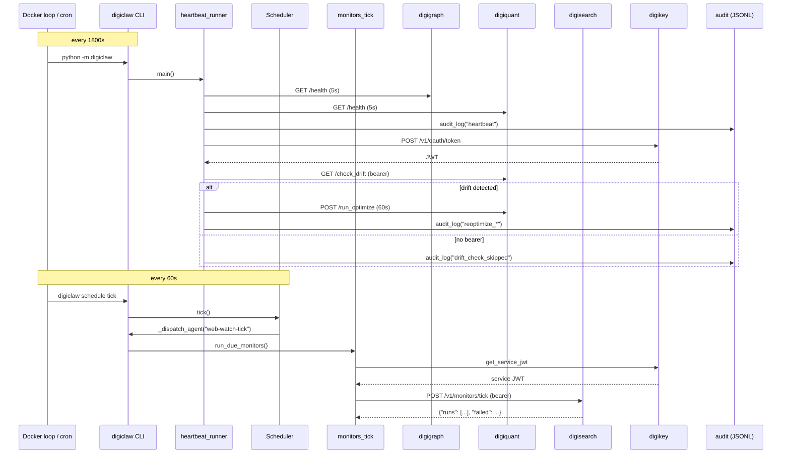
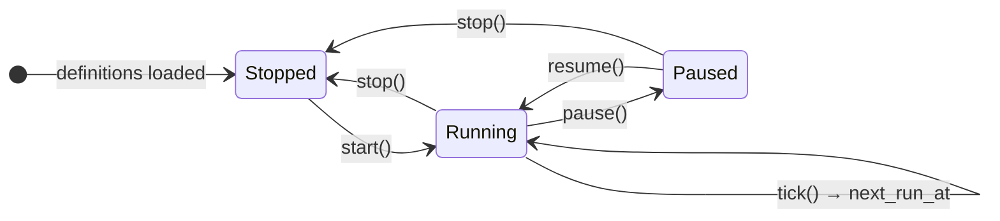

# digiclaw Architecture

digiclaw is the intended user-facing gateway and runtime layer of the
digithings stack. As built (Phase 3), it ships four implemented concerns —
a heartbeat runner, a JSONL audit log, an agent scheduler, and a
digisearch monitor-tick integration — as a **CLI with no HTTP server of
its own**. Channel adapters (Slack, Discord, Telegram, WhatsApp),
session/queue managers, the WebSocket control plane, the full agent
registry (#217), and the `run_digigraph_workflow` skill runtime are
explicitly deferred.



*Figure: digiclaw runtime flow — heartbeat cycle (30 min) and monitor tick (60 s) run in parallel Docker loops.*

## Heartbeat runner

`python -m digiclaw` (or `digiclaw heartbeat`) executes **one cycle and
exits 0** on clean completion (all services healthy), or 1 if any health
check fails. One cycle does three things in sequence:

1. **`run_heartbeat()`** — HTTP GET to `{DIGIGRAPH_URL}/health` and
   `{DIGIQUANT_URL}/health` (5 s timeout each via `urllib.request`), then
   logs one `heartbeat` audit event with per-service `_ok`/`_detail` fields.

2. **`_check_drift_and_reoptimize()`** — calls digiquant
   `GET /check_drift?strategy_id=...` with a digikey bearer when
   available. If `drift_detected` is true in the response, logs
   `reoptimize_triggered`, POSTs to `{DIGIQUANT_URL}/run_optimize`
   (60 s timeout) with symbols `["AAPL", "MSFT", "GOOGL"]`, and logs
   `reoptimize_completed` or `reoptimize_failed`. Without a bearer,
   `drift_check_skipped` is logged — ADDM is **auth-gated**, not
   logic-stubbed.

3. **HEARTBEAT.md presence check** — if the file exists at
   `{DIGI_WORKSPACE}/HEARTBEAT.md`, logs `heartbeat_checklist_seen`.

The Docker loop (`while true; do python -m digiclaw; sleep 1800; done`)
lives outside the runner — no daemon loop inside.

## JSONL audit

`digiclaw.audit.audit_log()` is a thin wrapper over
`digibase.audit.emit_event`: append-only structured lines, never delete or
truncate. Four key patterns (`password`, `api_key`, `token`, `secret`)
are redacted to `[REDACTED]` by case-insensitive substring match before
writing — no fast-path bypass. An optional `AUDIT_SINK_URL` POST is
best-effort: failures are swallowed, never propagated. Default path is
`digiquant/results/audit/events.jsonl`, overridden by `AUDIT_LOG_PATH`.

## Agent scheduler

`digiclaw schedule …` owns agent lifecycle (`start`/`stop`/`pause`/`resume`)
over YAML definitions in `digiclaw/agents/` (or `DIGICLAW_AGENTS_DIR`), with
5-field cron parsing, next-fire calculation, durable tick state via atomic
`JsonStateStore`, and `schedule status` for next-run visibility. Continuous
mode is `interval_seconds` between isolated ticks via `digiclaw schedule
tick`. Event-triggered runs are modeled in the schema (`ScheduleMode.EVENT`)
but not wired — `start` raises `event_mode_unsupported`.

On restart, `restore()` re-queues running agents whose `next_run_at` is
overdue or marked `pending`, so missed ticks are not dropped. State is
persisted at `DIGICLAW_SCHEDULER_STATE` (default
`{DIGI_WORKSPACE}/.digiclaw/scheduler_state.json`) via atomic
write-to-temp + replace.

The scheduler accepts an injected `AgentRunner` callable. The CLI
`_dispatch_agent` maps the name `"web-watch-tick"` to
`digiclaw.monitors_tick.run_due_monitors()`; all other agent names keep
the no-op `default_agent_runner`.

## digisearch monitor tick

The `web-watch-tick` agent (Phase C, #4065) drives digisearch's scheduled
web watches. Its YAML definition:

```yaml
name: web-watch-tick
description: Wake-up clock for digisearch scheduled web watches (Phase C)
schedule:
  mode: continuous
  interval_seconds: 60
  enabled: true
```

`digiclaw.monitors_tick.run_due_monitors()` POSTs
`{DIGISEARCH_URL}/v1/monitors/tick` with a digikey service JWT minted
through `digibase.service_auth.get_service_jwt` using the heartbeat's
provisioned `DIGICLAW_DIGIKEY_API_KEY`, `DIGIKEY_URL`, and
`scopes=("digisearch:query",)`. The JWT import is deliberately lazy and
fully qualified — importing the module needs neither credentials nor the
digibase module.

Key behaviors:

- **Auth and transport failures raise** — the scheduler persists them as
  the agent's `last_status="error"` + `last_error`, and `digiclaw
  schedule tick` prints the failed outcome. A silent successful tick is
  never recorded for a real failure.
- The POST uses a 120 s httpx client timeout with `raise_for_status()`.
- The response `{"runs": [MonitorRun...]}` is aggregated into
  `{"runs": n, "failed": m}`, where `failed` counts runs with
  `status == "failed"`. Per-watch failures are isolated inside digisearch.
- An explicit `bearer_token` argument skips minting entirely (for tests
  or callers that already hold a token).
- The Docker container runs two loops: a background 1800 s heartbeat
  loop and a foreground 60 s tick loop. A one-time `digiclaw schedule
  start web-watch-tick || exit 1` bootstrap ensures the agent is RUNNING
  before the tick loop begins.

## Lifecycle and state

### Agent lifecycle states

The scheduler models three lifecycle states per agent:



*Figure: Agent lifecycle state machine owned by Scheduler.*

- **`start`** is idempotent while the agent is RUNNING (re-arms,
  exit 0); exits 2 only on a real `SchedulerError`.
- **`stop`** clears `pending` and `next_run_at`.
- **`pause`** preserves last-run metadata; raises `agent_not_running`
  if the agent is STOPPED.
- **`resume`** re-queues immediately if `next_run_at` is overdue or
  absent.

### YAML schedule modes

| Mode | Required field | Behavior |
|------|---------------|----------|
| `cron` | `cron` (5-field) | Parsed via `parse_cron`, next fire via `next_cron_time` bounded to 4-year search |
| `continuous` | `interval_seconds` (≥1) | First tick immediate on start; re-scheduled `after + interval` |
| `event` | `event_name` | Schema-only; start raises `event_mode_unsupported` |

Duplicate agent names across YAML files raise `duplicate_agent_name`.

## Explicitly not built

- OpenClaw Node.js runtime (any version)
- Channel adapters (Slack, Discord, Telegram, WhatsApp)
- Session manager and queue manager
- WebSocket control plane
- `run_digigraph_workflow` MCP skill execution (Phase 0 contract only in `digiclaw/skills/README.md`)
- Full agent registry with tools/output_sink (#217) — YAML is schedule-only today
- Event-triggered agent runs (schema only; start raises)
- Durable ADDM history across digiquant restarts (in-process deque today)
- Any HTTP API or REST health endpoint for digiclaw itself
- Log rotation for the JSONL audit file
- Retry/backoff for `AUDIT_SINK_URL`

## Key environment variables

| Variable | Default | Purpose |
|----------|---------|---------|
| `DIGIGRAPH_URL` | `http://127.0.0.1:8000` | digigraph health and workflow base URL |
| `DIGIQUANT_URL` | `http://127.0.0.1:8001` | digiquant health, drift, and optimize base URL |
| `DIGISEARCH_URL` | `http://127.0.0.1:8002` | digisearch base URL for `/v1/monitors/tick` |
| `AUDIT_LOG_PATH` | `digiquant/results/audit/events.jsonl` | JSONL audit destination |
| `AUDIT_SINK_URL` | (unset) | Optional remote NDJSON sink (best-effort) |
| `DIGI_WORKSPACE` | `.` | Directory searched for `HEARTBEAT.md` |
| `REOPTIMIZE_STRATEGY` | `mean_reversion_tech` | Strategy ID for drift check and re-optimization |
| `DIGIQUANT_DATA_DIR` | (unset) | Required by `/run_optimize`; skips re-optimization if missing |
| `DIGICLAW_AGENTS_DIR` | `digiclaw/agents` | Agent YAML directory |
| `DIGICLAW_SCHEDULER_STATE` | `{DIGI_WORKSPACE}/.digiclaw/scheduler_state.json` | Durable scheduler state |
| `DIGICLAW_DIGIKEY_API_KEY` | (unset) | Machine API key for heartbeat bearer and monitor-tick service JWT |
| `DIGIKEY_URL` | `http://127.0.0.1:8005` | digikey base URL for token exchange |

## Representative tests

`tests/dc/`: audit append/redaction behavior, scheduler lifecycle and
cron, heartbeat cycle with drift-check skipped semantics when no bearer
is configured, and monitor-tick dispatch through the scheduler.
